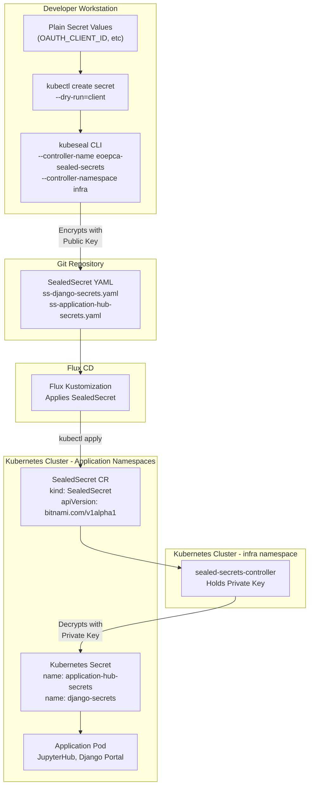
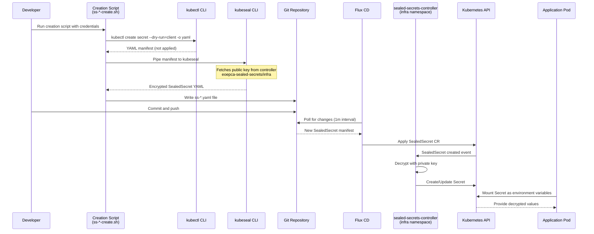
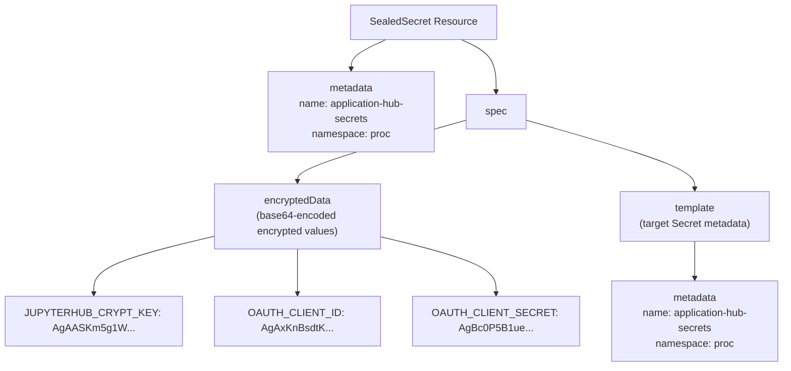
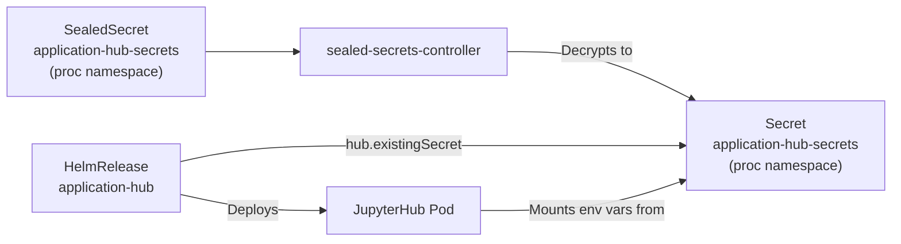
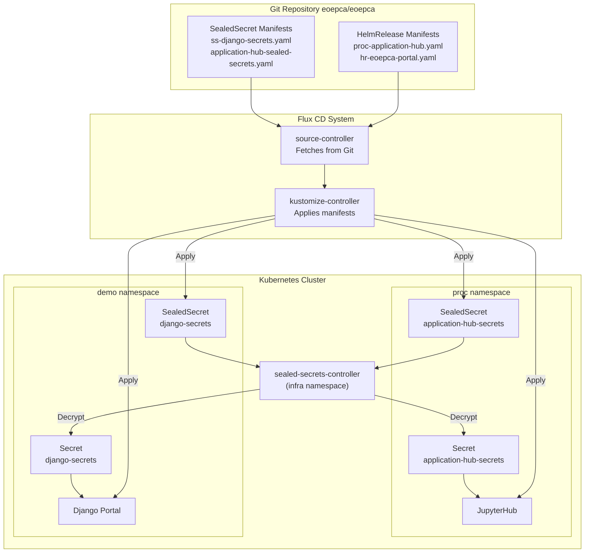

# SealedSecrets

<details>
<summary>Relevant source files</summary>

The following files were used as context for generating this wiki page:

- [system/clusters/creodias/processing-and-chaining/application-hub-sealed-secrets-create.sh](system/clusters/creodias/processing-and-chaining/application-hub-sealed-secrets-create.sh)
- [system/clusters/creodias/processing-and-chaining/application-hub-sealed-secrets.yaml](system/clusters/creodias/processing-and-chaining/application-hub-sealed-secrets.yaml)
- [system/clusters/creodias/processing-and-chaining/proc-application-hub.yaml](system/clusters/creodias/processing-and-chaining/proc-application-hub.yaml)
- [system/clusters/creodias/system/demo/hr-eoepca-portal.yaml](system/clusters/creodias/system/demo/hr-eoepca-portal.yaml)
- [system/clusters/creodias/system/demo/ss-django-secrets-create.sh](system/clusters/creodias/system/demo/ss-django-secrets-create.sh)
- [system/clusters/creodias/system/demo/ss-django-secrets.yaml](system/clusters/creodias/system/demo/ss-django-secrets.yaml)
- [system/clusters/creodias/system/test/identity-dummy-service-ingress.yaml](system/clusters/creodias/system/test/identity-dummy-service-ingress.yaml)
- [system/clusters/creodias/user-management/um-identity-service.yaml](system/clusters/creodias/user-management/um-identity-service.yaml)

</details>


## Purpose and Scope

This document explains the SealedSecrets pattern used in EOEPCA to securely store sensitive credentials in Git repositories. SealedSecrets enables GitOps-based deployments while maintaining security for OIDC client credentials, API keys, and other sensitive configuration data. For general configuration management, see [Configuration and Secrets Management](#10). For OIDC-specific client configuration, see [OIDC Client Configuration](#10.2).

## Overview

SealedSecrets is a Kubernetes controller and CLI tool that encrypts standard Kubernetes Secrets into SealedSecret custom resources. Unlike regular Secrets, SealedSecrets can be safely committed to Git repositories because they are encrypted with a public key. The sealed-secrets controller running in the cluster holds the private key and automatically decrypts SealedSecrets into regular Secrets at runtime.

EOEPCA uses SealedSecrets to store:
- OIDC client credentials for OAuth2/OpenID Connect authentication flows
- JupyterHub encryption keys
- Django application secrets
- Service-to-service authentication credentials

**Sources:** [system/clusters/creodias/system/demo/ss-django-secrets.yaml:1-17](), [system/clusters/creodias/processing-and-chaining/application-hub-sealed-secrets.yaml:1-17]()

## Architecture and Components



**Diagram: SealedSecrets Architecture in EOEPCA**

The sealed-secrets controller (`eoepca-sealed-secrets`) is deployed in the `infra` namespace and manages all SealedSecret resources across the cluster. When a SealedSecret is applied, the controller watches for it, decrypts the encrypted data using its private key, and creates or updates the corresponding Secret.

**Sources:** [system/clusters/creodias/system/demo/ss-django-secrets-create.sh:32-33](), [system/clusters/creodias/processing-and-chaining/application-hub-sealed-secrets-create.sh:34-35]()

## SealedSecrets Workflow



**Diagram: SealedSecrets Creation and Deployment Flow**

**Sources:** [system/clusters/creodias/system/demo/ss-django-secrets-create.sh:1-33](), [system/clusters/creodias/processing-and-chaining/application-hub-sealed-secrets-create.sh:1-36]()

## Creating SealedSecrets

### Creation Script Pattern

EOEPCA uses shell scripts with the naming convention `ss-<secret-name>-create.sh` to generate SealedSecrets. These scripts follow a standard pattern:

| Script Element | Purpose | Example Value |
|----------------|---------|---------------|
| `SECRET_NAME` | Name of the Kubernetes Secret | `application-hub-secrets` |
| `NAMESPACE` | Target namespace | `proc`, `demo` |
| Input parameters | Sensitive values as arguments | `OAUTH_CLIENT_ID`, `OAUTH_CLIENT_SECRET` |
| `secretYaml()` function | Generates plain Secret YAML | Uses `kubectl create secret --dry-run=client` |
| `kubeseal` command | Encrypts Secret into SealedSecret | Targets `eoepca-sealed-secrets` controller |

**Sources:** [system/clusters/creodias/processing-and-chaining/application-hub-sealed-secrets-create.sh:17-35]()

### Application Hub SealedSecret Creation

The Application Hub (JupyterHub) requires three encrypted values:

```bash
#!/usr/bin/env bash

SECRET_NAME="application-hub-secrets"
NAMESPACE="proc"

secretYaml() {
  kubectl -n "${NAMESPACE}" create secret generic "${SECRET_NAME}" \
    --from-literal="JUPYTERHUB_CRYPT_KEY=${JUPYTERHUB_CRYPT_KEY}" \
    --from-literal="OAUTH_CLIENT_ID=${OAUTH_CLIENT_ID}" \
    --from-literal="OAUTH_CLIENT_SECRET=${OAUTH_CLIENT_SECRET}" \
    --dry-run=client -o yaml
}

secretYaml | kubeseal -o yaml --controller-name eoepca-sealed-secrets --controller-namespace infra > application-hub-sealed-secrets.yaml
```

**Sources:** [system/clusters/creodias/processing-and-chaining/application-hub-sealed-secrets-create.sh:17-35]()

The `--dry-run=client` flag ensures the Secret is not actually created in the cluster, only output as YAML. The `kubeseal` command then:
1. Fetches the public key from the `eoepca-sealed-secrets` controller in the `infra` namespace
2. Encrypts each `--from-literal` field separately
3. Outputs a SealedSecret manifest with encrypted data

### Django Portal SealedSecret Creation

The EOEPCA portal uses a similar pattern with additional OIDC credentials:

```bash
SECRET_NAME="django-secrets"
NAMESPACE="demo"

client_id="${1:-set-client-id-here}"
client_secret="${2:-set-client-secret-here}"
django_secret="${3:-set-django-secret-here}"

secretYaml() {
  kubectl -n "${NAMESPACE}" create secret generic "${SECRET_NAME}" \
    --from-literal=OIDC_RP_CLIENT_ID="${client_id}" \
    --from-literal=OIDC_RP_CLIENT_SECRET="${client_secret}" \
    --from-literal=DJANGO_SECRET="${django_secret}" \
    --dry-run=client -o yaml
}

secretYaml | kubeseal -o yaml --controller-name eoepca-sealed-secrets --controller-namespace infra > ss-${SECRET_NAME}.yaml
```

**Sources:** [system/clusters/creodias/system/demo/ss-django-secrets-create.sh:13-33]()

## SealedSecret Manifest Structure

### Manifest Components

A SealedSecret manifest consists of:



**Diagram: SealedSecret Manifest Structure**

**Sources:** [system/clusters/creodias/processing-and-chaining/application-hub-sealed-secrets.yaml:1-17]()

### Application Hub SealedSecret Example

The Application Hub SealedSecret manifest at [system/clusters/creodias/processing-and-chaining/application-hub-sealed-secrets.yaml:1-17]() demonstrates the structure:

| Field | Value |
|-------|-------|
| `apiVersion` | `bitnami.com/v1alpha1` |
| `kind` | `SealedSecret` |
| `metadata.name` | `application-hub-secrets` |
| `metadata.namespace` | `proc` |
| `spec.encryptedData.JUPYTERHUB_CRYPT_KEY` | Encrypted 32-byte hex key for JupyterHub |
| `spec.encryptedData.OAUTH_CLIENT_ID` | Encrypted OIDC client identifier |
| `spec.encryptedData.OAUTH_CLIENT_SECRET` | Encrypted OIDC client secret |
| `spec.template.metadata.name` | `application-hub-secrets` (target Secret name) |

The encrypted values in `spec.encryptedData` are prefixed with `AgA` (AES-GCM encryption algorithm indicator) followed by base64-encoded ciphertext. Each field is encrypted independently, allowing the controller to decrypt them into separate Secret keys.

**Sources:** [system/clusters/creodias/processing-and-chaining/application-hub-sealed-secrets.yaml:8-16]()

### Django Secrets Example

The Django portal SealedSecret at [system/clusters/creodias/system/demo/ss-django-secrets.yaml:1-17]() stores OIDC credentials for the EOEPCA web portal:

| Secret Key | Purpose |
|------------|---------|
| `DJANGO_SECRET` | Django framework secret key for session management |
| `OIDC_RP_CLIENT_ID` | OpenID Connect Relying Party client ID for login service integration |
| `OIDC_RP_CLIENT_SECRET` | OpenID Connect Relying Party client secret |

**Sources:** [system/clusters/creodias/system/demo/ss-django-secrets.yaml:8-11]()

## Integration with Application Deployments

### Application Hub Integration

The Application Hub HelmRelease references the SealedSecret-created Secret via `existingSecret`:



**Diagram: SealedSecret Integration with Application Hub**

The HelmRelease at [system/clusters/creodias/processing-and-chaining/proc-application-hub.yaml:34]() references the Secret:

```yaml
hub:
  existingSecret: application-hub-secrets
```

Individual environment variables then reference the Secret keys:

```yaml
JUPYTERHUB_CRYPT_KEY:
  valueFrom:
    secretKeyRef:
      name: application-hub-secrets
      key: JUPYTERHUB_CRYPT_KEY

OAUTH_CLIENT_ID:
  valueFrom:
    secretKeyRef:
      name: application-hub-secrets
      key: OAUTH_CLIENT_ID
```

**Sources:** [system/clusters/creodias/processing-and-chaining/proc-application-hub.yaml:34](), [system/clusters/creodias/processing-and-chaining/proc-application-hub.yaml:47-63]()

### Secret Consumption Pattern

Applications consume SealedSecret-generated Secrets through environment variable injection:

| HelmRelease Field | Purpose | Example Value |
|-------------------|---------|---------------|
| `hub.existingSecret` | References pre-created Secret | `application-hub-secrets` |
| `extraEnv[].valueFrom.secretKeyRef.name` | Secret name to mount from | `application-hub-secrets` |
| `extraEnv[].valueFrom.secretKeyRef.key` | Specific key within Secret | `OAUTH_CLIENT_ID` |

The pattern ensures sensitive values never appear in HelmRelease manifests committed to Git, only references to the Secret names and keys.

**Sources:** [system/clusters/creodias/processing-and-chaining/proc-application-hub.yaml:47-63]()

## GitOps Integration

### Flux CD and SealedSecrets

SealedSecrets enable GitOps by allowing encrypted secrets in Git repositories that Flux CD can apply:



**Diagram: SealedSecrets in GitOps Workflow**

Flux CD's kustomize-controller applies SealedSecret manifests from Git. The sealed-secrets-controller watches for these resources and automatically decrypts them into Secrets. Applications can then reference these Secrets in their HelmRelease configurations, completing the GitOps loop without exposing sensitive data.

**Sources:** [system/clusters/creodias/processing-and-chaining/application-hub-sealed-secrets.yaml:1-17](), [system/clusters/creodias/processing-and-chaining/proc-application-hub.yaml:1-99](), [system/clusters/creodias/system/demo/ss-django-secrets.yaml:1-17]()

## SealedSecrets Controller Configuration

The sealed-secrets controller is deployed as part of the system infrastructure with the name `eoepca-sealed-secrets` in the `infra` namespace. All creation scripts reference this controller:

```bash
kubeseal -o yaml --controller-name eoepca-sealed-secrets --controller-namespace infra
```

The controller configuration includes:
- **Controller Name:** `eoepca-sealed-secrets`
- **Namespace:** `infra`
- **Scope:** Cluster-wide (manages SealedSecrets in all namespaces)
- **Encryption:** RSA with AES-GCM for data encryption

**Sources:** [system/clusters/creodias/system/demo/ss-django-secrets-create.sh:33](), [system/clusters/creodias/processing-and-chaining/application-hub-sealed-secrets-create.sh:35]()

## Security Considerations

### Encryption Scope

Each SealedSecret field is encrypted independently, ensuring:
- Individual credential rotation without re-encrypting entire secrets
- Separate encryption contexts for each value
- Audit trail of which specific credentials changed in Git history

### Controller Access

The sealed-secrets controller's private key is the critical security component:
- Only the controller can decrypt SealedSecrets
- Private key is stored as a Kubernetes Secret in the `infra` namespace
- Loss of private key prevents decryption of existing SealedSecrets
- Key rotation requires re-encrypting all SealedSecrets

### Namespace Scoping

SealedSecrets in EOEPCA are namespace-scoped, meaning:
- A SealedSecret in the `proc` namespace can only create Secrets in `proc`
- A SealedSecret in the `demo` namespace can only create Secrets in `demo`
- The controller enforces namespace boundaries during decryption

This prevents accidental or malicious cross-namespace Secret creation.

**Sources:** [system/clusters/creodias/processing-and-chaining/application-hub-sealed-secrets.yaml:6](), [system/clusters/creodias/system/demo/ss-django-secrets.yaml:6]()