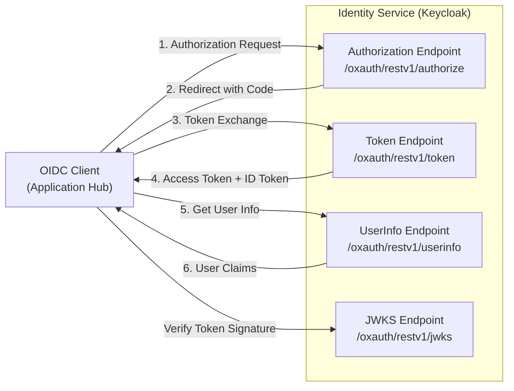
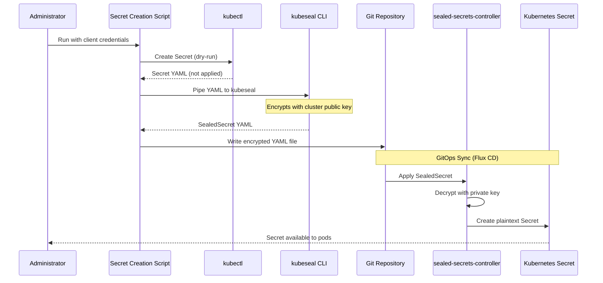
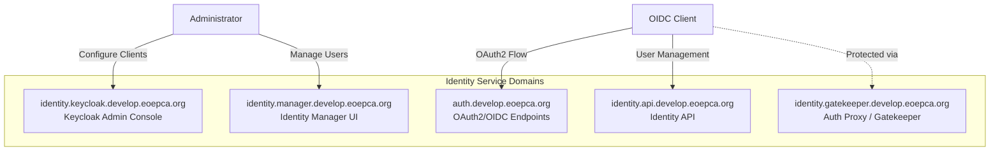
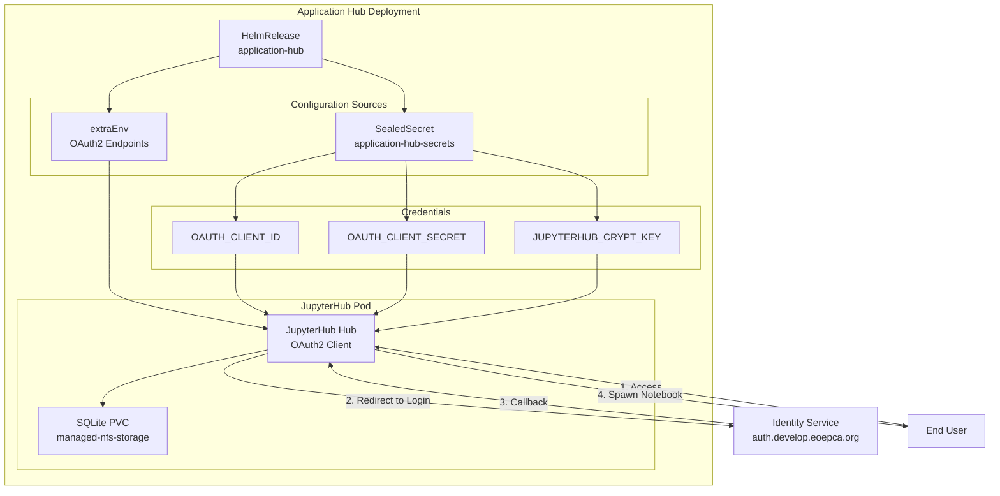
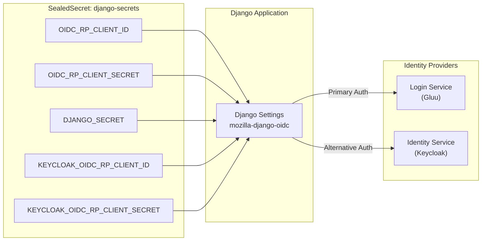
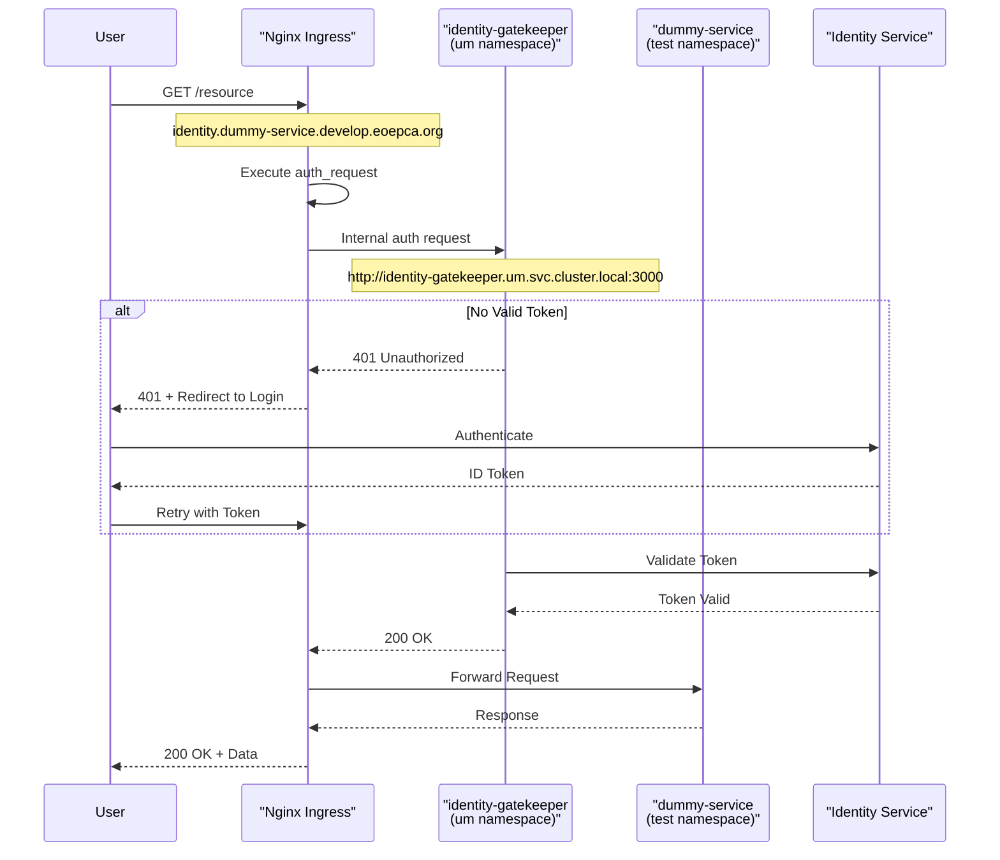

# OIDC Client Configuration

<details>
<summary>Relevant source files</summary>

The following files were used as context for generating this wiki page:

- [system/clusters/creodias/processing-and-chaining/application-hub-sealed-secrets-create.sh](system/clusters/creodias/processing-and-chaining/application-hub-sealed-secrets-create.sh)
- [system/clusters/creodias/processing-and-chaining/application-hub-sealed-secrets.yaml](system/clusters/creodias/processing-and-chaining/application-hub-sealed-secrets.yaml)
- [system/clusters/creodias/processing-and-chaining/proc-application-hub.yaml](system/clusters/creodias/processing-and-chaining/proc-application-hub.yaml)
- [system/clusters/creodias/system/demo/hr-eoepca-portal.yaml](system/clusters/creodias/system/demo/hr-eoepca-portal.yaml)
- [system/clusters/creodias/system/demo/ss-django-secrets-create.sh](system/clusters/creodias/system/demo/ss-django-secrets-create.sh)
- [system/clusters/creodias/system/demo/ss-django-secrets.yaml](system/clusters/creodias/system/demo/ss-django-secrets.yaml)
- [system/clusters/creodias/system/test/identity-dummy-service-ingress.yaml](system/clusters/creodias/system/test/identity-dummy-service-ingress.yaml)
- [system/clusters/creodias/user-management/um-identity-service.yaml](system/clusters/creodias/user-management/um-identity-service.yaml)

</details>


## Purpose and Scope

This document describes the configuration of OpenID Connect (OIDC) clients within the EOEPCA platform. OIDC clients are services that authenticate users through the Identity Service (Keycloak) using the OAuth2/OIDC protocol. This page covers client registration, credential management using SealedSecrets, OAuth2 endpoint configuration, and integration patterns for various EOEPCA services.

For information about the Identity Service (Keycloak) itself, see [Identity Service (Keycloak)](#4.1). For Policy Enforcement Point configuration, see [Policy Enforcement (PEP/PDP)](#4.3). For the complete UMA authentication flow, see [UMA Authentication Flow](#4.4).

---

## OIDC Client Registration Overview

OIDC clients in EOEPCA must be registered with the Identity Service (Keycloak) before they can authenticate users. Each client receives unique credentials (`client_id` and `client_secret`) that are used during the OAuth2 authorization flow.

### Client Types in EOEPCA

The platform supports several types of OIDC clients:

| Client Type | Example | Authentication Pattern |
|------------|---------|----------------------|
| Interactive Web Applications | Application Hub (JupyterHub) | Authorization Code Flow with PKCE |
| Web Portals | EOEPCA Portal (Django) | Authorization Code Flow |
| Protected Services | Identity Dummy Service | Identity Gatekeeper (auth_request) |
| API Services | Workspace API, ADES | Service Account / Client Credentials |

### OIDC Provider Endpoints

The Identity Service exposes standard OIDC endpoints that clients must configure:



**Sources:** [system/clusters/creodias/processing-and-chaining/proc-application-hub.yaml:39-41]()

---

## Client Credential Management with SealedSecrets

OIDC client credentials are sensitive values that must be encrypted at rest in the Git repository. EOEPCA uses the SealedSecrets pattern to achieve this.

### SealedSecret Creation Workflow



**Sources:** [system/clusters/creodias/system/demo/ss-django-secrets-create.sh:1-33](), [system/clusters/creodias/processing-and-chaining/application-hub-sealed-secrets-create.sh:1-36]()

### Secret Creation Script Pattern

OIDC client secrets are generated using shell scripts that follow a consistent pattern:

```bash
# Example structure from application-hub-sealed-secrets-create.sh
SECRET_NAME="application-hub-secrets"
NAMESPACE="proc"

secretYaml() {
  kubectl -n "${NAMESPACE}" create secret generic "${SECRET_NAME}" \
    --from-literal="OAUTH_CLIENT_ID=${OAUTH_CLIENT_ID}" \
    --from-literal="OAUTH_CLIENT_SECRET=${OAUTH_CLIENT_SECRET}" \
    --dry-run=client -o yaml
}

secretYaml | kubeseal -o yaml \
  --controller-name eoepca-sealed-secrets \
  --controller-namespace infra > sealed-secret.yaml
```

The script creates a Kubernetes Secret in dry-run mode, pipes it to `kubeseal`, which encrypts it using the cluster's public key, and outputs a `SealedSecret` resource that can be committed to Git.

**Sources:** [system/clusters/creodias/processing-and-chaining/application-hub-sealed-secrets-create.sh:17-35](), [system/clusters/creodias/system/demo/ss-django-secrets-create.sh:13-33]()

### SealedSecret Resource Structure

The resulting `SealedSecret` contains encrypted credential data:

```yaml
apiVersion: bitnami.com/v1alpha1
kind: SealedSecret
metadata:
  name: application-hub-secrets
  namespace: proc
spec:
  encryptedData:
    OAUTH_CLIENT_ID: AgAx...base64-encrypted...
    OAUTH_CLIENT_SECRET: AgBc...base64-encrypted...
  template:
    metadata:
      name: application-hub-secrets
      namespace: proc
```

The `sealed-secrets-controller` running in the cluster decrypts these values and creates a standard Kubernetes Secret that pods can mount or reference.

**Sources:** [system/clusters/creodias/processing-and-chaining/application-hub-sealed-secrets.yaml:1-18](), [system/clusters/creodias/system/demo/ss-django-secrets.yaml:1-17]()

---

## OAuth2 Configuration Parameters

### Standard OAuth2/OIDC Parameters

OIDC clients must configure the following parameters to integrate with the Identity Service:

| Parameter | Purpose | Example Value |
|-----------|---------|---------------|
| `OAUTH_CLIENT_ID` | Unique client identifier | `application-hub-client` |
| `OAUTH_CLIENT_SECRET` | Client authentication secret | `(encrypted value)` |
| `OAUTH2_AUTHORIZE_URL` | Authorization endpoint | `https://auth.develop.eoepca.org/oxauth/restv1/authorize` |
| `OAUTH2_TOKEN_URL` | Token exchange endpoint | `https://auth.develop.eoepca.org/oxauth/restv1/token` |
| `OAUTH2_USERDATA_URL` | UserInfo endpoint | `https://auth.develop.eoepca.org/oxauth/restv1/userinfo` |
| `OAUTH_CALLBACK_URL` | Redirect URI after authentication | `https://applicationhub.develop.eoepca.org/hub/oauth_callback` |
| `OAUTH_LOGOUT_REDIRECT_URL` | Redirect after logout | `https://applicationhub.develop.eoepca.org` |
| `OAUTH2_USERNAME_KEY` | User identifier claim | `user_name` |

**Sources:** [system/clusters/creodias/processing-and-chaining/proc-application-hub.yaml:38-43]()

### Identity Service Domain Configuration

The Identity Service operates across multiple subdomains, each serving a specific purpose:



**Sources:** [system/clusters/creodias/user-management/um-identity-service.yaml:23-76]()

---

## Application Hub OIDC Configuration

The Application Hub (JupyterHub) demonstrates a complete OIDC client integration pattern.

### Configuration Architecture



**Sources:** [system/clusters/creodias/processing-and-chaining/proc-application-hub.yaml:1-99]()

### Hub Configuration Values

The Application Hub HelmRelease configures OAuth2 parameters as environment variables:

[system/clusters/creodias/processing-and-chaining/proc-application-hub.yaml:35-63]()

Key configuration elements:

- **`OAUTH_CALLBACK_URL`**: Must match the redirect URI registered in Keycloak
- **`OAUTH2_USERNAME_KEY`**: Specifies which claim from the ID token to use as the username (`user_name`)
- **`JUPYTERHUB_CRYPT_KEY`**: Used to encrypt cookies and internal tokens (generated via `openssl rand -hex 32`)
- **Credential References**: Client credentials are mounted from the `application-hub-secrets` Secret using `valueFrom.secretKeyRef`

### Secret Management for Application Hub

The Application Hub creates its SealedSecret using a dedicated script:

[system/clusters/creodias/processing-and-chaining/application-hub-sealed-secrets-create.sh:17-35]()

The script generates three secrets:
- `JUPYTERHUB_CRYPT_KEY`: 32-byte hex encryption key
- `OAUTH_CLIENT_ID`: Client identifier registered in Keycloak
- `OAUTH_CLIENT_SECRET`: Client authentication secret

**Sources:** [system/clusters/creodias/processing-and-chaining/proc-application-hub.yaml:29-63](), [system/clusters/creodias/processing-and-chaining/application-hub-sealed-secrets-create.sh:1-36](), [system/clusters/creodias/processing-and-chaining/application-hub-sealed-secrets.yaml:1-18]()

---

## Django-Based Service OIDC Configuration

Services using Django (such as the EOEPCA Portal) follow a different configuration pattern, storing OIDC parameters with the `OIDC_RP_` prefix.

### Django OIDC Parameter Mapping



**Sources:** [system/clusters/creodias/system/demo/ss-django-secrets.yaml:1-17](), [system/clusters/creodias/system/demo/ss-django-secrets-create.sh:1-33]()

### Django Secret Creation Script

The Django secret creation script handles multiple identity providers:

[system/clusters/creodias/system/demo/ss-django-secrets-create.sh:16-33]()

The script creates five secret literals:
- `OIDC_RP_CLIENT_ID`: Client ID for the primary identity provider (Gluu)
- `OIDC_RP_CLIENT_SECRET`: Client secret for Gluu
- `DJANGO_SECRET`: Django application secret key
- `KEYCLOAK_OIDC_RP_CLIENT_ID`: Alternative client ID for Keycloak
- `KEYCLOAK_OIDC_RP_CLIENT_SECRET`: Alternative client secret for Keycloak

This dual-provider configuration allows services to support both the Login Service (Gluu) and the Identity Service (Keycloak) simultaneously, facilitating migration and testing scenarios.

**Sources:** [system/clusters/creodias/system/demo/ss-django-secrets-create.sh:1-33](), [system/clusters/creodias/system/demo/ss-django-secrets.yaml:1-17]()

---

## Identity Gatekeeper Integration Pattern

Some services use Identity Gatekeeper as a reverse proxy for authentication rather than implementing OIDC directly.

### Gatekeeper Authentication Flow



**Sources:** [system/clusters/creodias/system/test/identity-dummy-service-ingress.yaml:1-48]()

### Nginx Ingress Configuration for Gatekeeper

The Ingress resource configures Nginx to perform authentication checks before forwarding requests:

[system/clusters/creodias/system/test/identity-dummy-service-ingress.yaml:9-31]()

Key configuration elements:

- **`auth_request /auth`**: Nginx subrequest to authenticate before forwarding
- **Internal `/auth` location**: Proxies to `identity-gatekeeper.um.svc.cluster.local:3000`
- **`proxy_pass_request_body off`**: Only headers are sent to the gatekeeper for validation
- **CORS headers**: Added for browser-based clients
- **Proxy buffers**: Sized to handle large JWT tokens

This pattern enables authentication enforcement without modifying the backend service. The backend service (e.g., `dummy-service`) receives authenticated requests with user context in headers.

**Sources:** [system/clusters/creodias/system/test/identity-dummy-service-ingress.yaml:1-48]()

---

## OIDC Endpoint Reference

### Identity Service Endpoints

The following table provides the complete set of OIDC endpoints exposed by the Identity Service:

| Endpoint Type | URL Path | Purpose |
|--------------|----------|---------|
| Authorization | `/oxauth/restv1/authorize` | Initiates OAuth2 authorization flow |
| Token | `/oxauth/restv1/token` | Exchanges authorization code for tokens |
| UserInfo | `/oxauth/restv1/userinfo` | Retrieves authenticated user claims |
| JWKS | `/oxauth/restv1/jwks` | Public keys for token signature verification |
| End Session | `/oxauth/restv1/end_session` | Logout endpoint |
| Discovery | `/.well-known/openid-configuration` | OIDC metadata document |

### Domain Configuration

The Identity Service is accessible through the `auth.develop.eoepca.org` domain for OAuth2/OIDC flows. Administrative interfaces use separate subdomains:

- **Keycloak Admin**: `identity.keycloak.develop.eoepca.org`
- **Identity API**: `identity.api.develop.eoepca.org`
- **Identity Manager**: `identity.manager.develop.eoepca.org`
- **Identity Gatekeeper**: `identity.gatekeeper.develop.eoepca.org`

Each subdomain has dedicated ingress configuration with TLS certificates managed by cert-manager using the `letsencrypt` ClusterIssuer.

**Sources:** [system/clusters/creodias/user-management/um-identity-service.yaml:23-76](), [system/clusters/creodias/processing-and-chaining/proc-application-hub.yaml:38-43]()

---

## Client Registration Checklist

When registering a new OIDC client in the EOEPCA platform:

1. **Register client in Keycloak**:
   - Access Keycloak Admin Console at `identity.keycloak.develop.eoepca.org`
   - Create new client with appropriate redirect URIs
   - Note the generated `client_id` and `client_secret`

2. **Create SealedSecret**:
   - Use or adapt one of the secret creation scripts
   - Generate encrypted SealedSecret YAML
   - Commit to Git repository

3. **Configure service deployment**:
   - Set OAuth2 endpoint URLs (authorize, token, userinfo)
   - Reference SealedSecret for credentials
   - Configure callback URL matching registered URI
   - Set username claim mapping

4. **Validate integration**:
   - Test authentication flow
   - Verify token exchange
   - Confirm user identity propagation

**Sources:** [system/clusters/creodias/processing-and-chaining/application-hub-sealed-secrets-create.sh:1-36](), [system/clusters/creodias/system/demo/ss-django-secrets-create.sh:1-33]()