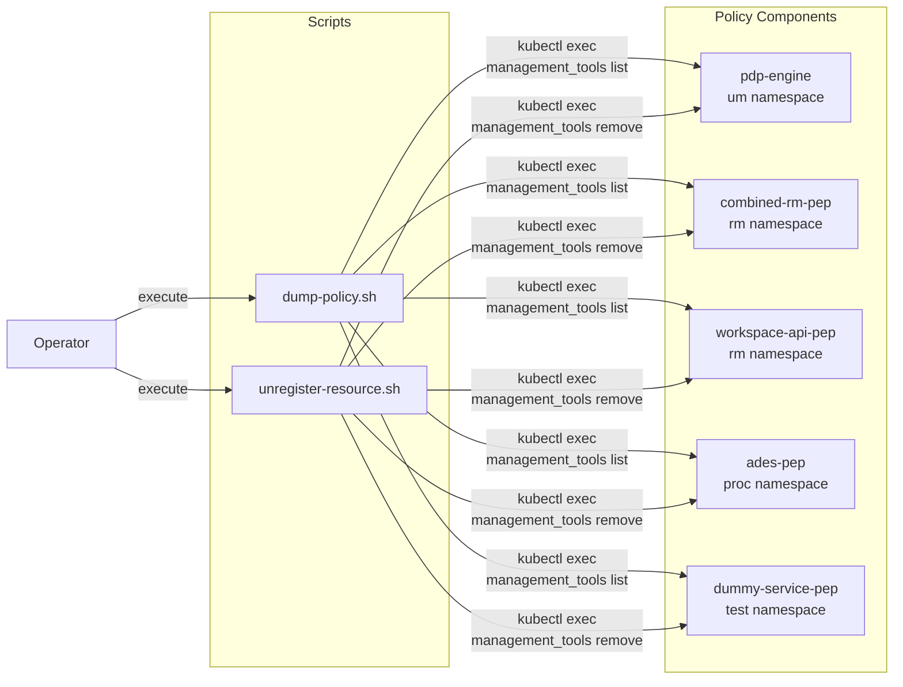
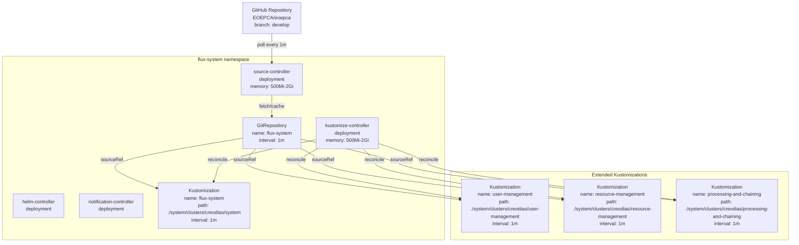

# Operations and Maintenance

<details>
<summary>Relevant source files</summary>

The following files were used as context for generating this wiki page:

- [.gitattributes](.gitattributes)
- [bin/dump-policy.sh](bin/dump-policy.sh)
- [bin/list-container-images.sh](bin/list-container-images.sh)
- [bin/unregister-resource.sh](bin/unregister-resource.sh)
- [system/clusters/creodias/system/flux-system-extended/processing-and-chaining-sync.yaml](system/clusters/creodias/system/flux-system-extended/processing-and-chaining-sync.yaml)
- [system/clusters/creodias/system/flux-system-extended/resource-management-sync.yaml](system/clusters/creodias/system/flux-system-extended/resource-management-sync.yaml)
- [system/clusters/creodias/system/flux-system-extended/user-management-sync.yaml](system/clusters/creodias/system/flux-system-extended/user-management-sync.yaml)
- [system/clusters/creodias/system/flux-system/flux-system-patch.yaml](system/clusters/creodias/system/flux-system/flux-system-patch.yaml)
- [system/clusters/creodias/system/flux-system/gotk-components.yaml](system/clusters/creodias/system/flux-system/gotk-components.yaml)
- [system/clusters/creodias/system/flux-system/gotk-sync.yaml](system/clusters/creodias/system/flux-system/gotk-sync.yaml)
- [system/clusters/creodias/system/flux-system/kustomization.yaml](system/clusters/creodias/system/flux-system/kustomization.yaml)
- [system/clusters/creodias/user-management/kustomization.yaml](system/clusters/creodias/user-management/kustomization.yaml)
- [system/clusters/data/register-S2-L1C-data.sh](system/clusters/data/register-S2-L1C-data.sh)
- [system/clusters/data/register-S2-L2A-data.sh](system/clusters/data/register-S2-L2A-data.sh)
- [test/acceptance/02__Processing/01__ADES/data/app-deploy-body-atom.json](test/acceptance/02__Processing/01__ADES/data/app-deploy-body-atom.json)
- [test/acceptance/02__Processing/01__ADES/data/app-deploy-body-cwl.json](test/acceptance/02__Processing/01__ADES/data/app-deploy-body-cwl.json)
- [test/acceptance/02__Processing/01__ADES/data/application-package-atom.xml](test/acceptance/02__Processing/01__ADES/data/application-package-atom.xml)
- [test/acceptance/02__Processing/01__ADES/data/application-package-cwl.cwl](test/acceptance/02__Processing/01__ADES/data/application-package-cwl.cwl)
- [test/acceptance/03__ResourceCatalogue/CatalogueServiceWeb.py](test/acceptance/03__ResourceCatalogue/CatalogueServiceWeb.py)
- [test/acceptance/03__ResourceCatalogue/Resource_catalogue.robot](test/acceptance/03__ResourceCatalogue/Resource_catalogue.robot)

</details>


## Purpose and Scope

This document provides guidance for operational procedures required to manage and maintain a deployed EOEPCA system. It covers day-to-day administrative tasks including policy management, resource registration and deregistration, monitoring GitOps reconciliation, troubleshooting deployments, and data ingestion workflows.

For initial deployment procedures, see [Deployment Guide](#2.1). For configuration management including secrets and OIDC setup, see [Configuration and Secrets Management](#10). For detailed policy management procedures, see [Policy Management Tools](#11.1). For troubleshooting guidance, see [Monitoring and Troubleshooting](#11.2).

## Operational Architecture

The EOEPCA system is deployed across multiple Kubernetes namespaces with GitOps-managed components. Understanding this architecture is essential for operational tasks.

```mermaid
graph TB
    subgraph "Operator Tools"
        kubectl["kubectl CLI"]
        flux["flux CLI"]
        scripts["Operational Scripts<br/>bin/dump-policy.sh<br/>bin/unregister-resource.sh"]
    end
    
    subgraph "flux-system namespace"
        source["source-controller"]
        kustomize["kustomize-controller"]
        helm["helm-controller"]
        notify["notification-controller"]
        gitrepo["GitRepository CR<br/>flux-system"]
    end
    
    subgraph "um namespace"
        identity["identity-service"]
        login["login-service"]
        pdp["pdp-engine"]
        profile["user-profile"]
    end
    
    subgraph "rm namespace"
        workspace["workspace-api"]
        catalogue["resource-catalogue"]
        dataaccess["data-access"]
        redis["data-access-redis-master-0"]
        combinedpep["combined-rm-pep"]
        workspacepep["workspace-api-pep"]
    end
    
    subgraph "proc namespace"
        ades["ades"]
        apphub["application-hub"]
        adespep["ades-pep"]
    end
    
    subgraph "test namespace"
        dummy["dummy-service"]
        dummypep["dummy-service-pep"]
    end
    
    kubectl -->|exec/logs| um
    kubectl -->|exec/logs| rm
    kubectl -->|exec/logs| proc
    kubectl -->|manage| flux-system
    
    scripts -->|management_tools| pdp
    scripts -->|management_tools| combinedpep
    scripts -->|management_tools| workspacepep
    scripts -->|management_tools| adespep
    scripts -->|management_tools| dummypep
    scripts -->|redis-cli| redis
    
    flux -->|get/logs| gitrepo
    flux -->|reconcile| kustomize
    
    source -->|fetch| gitrepo
    kustomize -->|apply| um
    kustomize -->|apply| rm
    kustomize -->|apply| proc
```



**Operational Components Overview**

| Component | Namespace | Purpose | Common Operations |
|-----------|-----------|---------|-------------------|
| `pdp-engine` | `um` | Policy Decision Point | Policy dumps, resource unregistration |
| `combined-rm-pep` | `rm` | Resource Management PEP | Policy management, resource protection |
| `workspace-api-pep` | `rm` | Workspace API PEP | Workspace access policies |
| `ades-pep` | `proc` | ADES PEP | Processing service protection |
| `data-access-redis-master-0` | `rm` | Registration queue | Data registration, queue inspection |
| `source-controller` | `flux-system` | GitOps source sync | Repository synchronization |
| `kustomize-controller` | `flux-system` | Manifest application | Reconciliation, drift detection |

Sources: [bin/dump-policy.sh:1-43](), [bin/unregister-resource.sh:1-55](), [system/clusters/creodias/system/flux-system/gotk-sync.yaml:1-28]()

## Policy Management Operations

Policy management is a critical operational task for controlling access to protected resources. The EOEPCA system uses distributed Policy Enforcement Points (PEPs) that register resources with both local policy stores and a central Policy Decision Point (PDP).

### Policy Enforcement Architecture



### Dumping Policy State

The `dump-policy.sh` script extracts policy information from all PEP and PDP components. This is useful for auditing, backup, and troubleshooting access control issues.

**Usage:**

```bash
# Dump all policies
./bin/dump-policy.sh

# Dump specific deployment
./bin/dump-policy.sh <namespace> <deployment>
```

**Example:**

```bash
# Dump ADES PEP policies
./bin/dump-policy.sh proc ades-pep

# Dump PDP engine policies
./bin/dump-policy.sh um pdp-engine nojson
```

The script executes `management_tools list --all` within each PEP/PDP container and saves the output to JSON files in the current directory. The output files are named after the deployment (e.g., `ades-pep.json`, `pdp-engine.json`).

**Script Implementation:**

The `dumpDeployment` function in [bin/dump-policy.sh:30-40]() constructs a `kubectl exec` command that invokes the `management_tools` utility inside the target container. For PEP components, the output is formatted as JSON using `jq`. The PDP engine dumps are output in plain text format.

**Deployments Managed:**

- `proc/ades-pep` - ADES service protection
- `rm/combined-rm-pep` - Combined Resource Management services
- `rm/workspace-api-pep` - Workspace API protection
- `test/dummy-service-pep` - Test service protection
- `um/pdp-engine` - Central policy decision point

Sources: [bin/dump-policy.sh:1-43]()

### Unregistering Resources

When resources need to be removed from the system, they must be unregistered from all PEP components and the central PDP. The `unregister-resource.sh` script automates this process.

**Usage:**

```bash
./bin/unregister-resource.sh <resource-id>
```

**Example:**

```bash
./bin/unregister-resource.sh eric-workspace
```

The script executes `management_tools remove -r <resource-id>` against each of the following components in sequence:

1. `rm/combined-rm-pep` - Resource Management protection
2. `proc/ades-pep` - Processing service protection  
3. `rm/workspace-api-pep` - Workspace access control
4. `test/dummy-service-pep` - Test environment cleanup
5. `um/pdp-engine` - Central policy store

The commented-out lines in [bin/unregister-resource.sh:26-34]() show that the system previously used separate PEPs for `resource-catalogue-pep` and `data-access-pep`, but these have been consolidated into `combined-rm-pep`.

Sources: [bin/unregister-resource.sh:1-55]()

## GitOps Operations

The EOEPCA system uses Flux CD for continuous delivery and configuration management. All system state is defined in Git and automatically reconciled to the cluster.

### Flux CD Architecture



### Reconciliation Intervals

The Flux CD system operates on defined intervals:

| Resource Type | Interval | Description |
|---------------|----------|-------------|
| GitRepository sync | 1 minute | Fetch latest commit from `develop` branch |
| System Kustomization | 1 minute | Apply core infrastructure changes |
| Domain Kustomizations | 1 minute | Apply user-management, resource-management, processing changes |

The reconciliation interval is configured in [system/clusters/creodias/system/flux-system/flux-system-patch.yaml:39]() and [system/clusters/creodias/system/flux-system/gotk-sync.yaml:9]().

### Monitoring Reconciliation

**Check GitRepository Status:**

```bash
flux get sources git -n flux-system
kubectl get gitrepository -n flux-system flux-system -o yaml
```

**Check Kustomization Status:**

```bash
flux get kustomizations -A
kubectl get kustomizations -n flux-system
```

**Check Recent Events:**

```bash
flux events
kubectl get events -n flux-system --sort-by='.lastTimestamp'
```

**Trigger Manual Reconciliation:**

```bash
# Reconcile GitRepository
flux reconcile source git flux-system -n flux-system

# Reconcile Kustomization
flux reconcile kustomization flux-system -n flux-system
flux reconcile kustomization user-management -n flux-system
flux reconcile kustomization resource-management -n flux-system
flux reconcile kustomization processing-and-chaining -n flux-system
```

### Resource Memory Configuration

The Flux controllers have been tuned for the EOEPCA workload with resource limits specified in [system/clusters/creodias/system/flux-system/flux-system-patch.yaml:1-40]():

- `source-controller`: 500Mi request, 2Gi limit
- `kustomize-controller`: 500Mi request, 2Gi limit

These values may need adjustment for larger deployments or when managing many HelmReleases.

Sources: [system/clusters/creodias/system/flux-system/gotk-sync.yaml:1-28](), [system/clusters/creodias/system/flux-system/flux-system-patch.yaml:1-40](), [system/clusters/creodias/system/flux-system-extended/user-management-sync.yaml:1-13](), [system/clusters/creodias/system/flux-system-extended/resource-management-sync.yaml:1-13](), [system/clusters/creodias/system/flux-system-extended/processing-and-chaining-sync.yaml:1-13]()

## Data Registration Operations

Data products must be registered in the Resource Catalogue to be discoverable and accessible. The EOEPCA system uses a Redis-based queue for asynchronous data registration.

### Data Registration Workflow

```mermaid
sequenceDiagram
    participant Operator
    participant redis["data-access-redis-master-0<br/>rm namespace"]
    participant registrar["Registrar Service<br/>rm namespace"]
    participant catalogue["resource-catalogue<br/>pycsw database"]
    
    Operator->>redis: kubectl exec<br/>redis-cli lpush register_queue
    Note over redis: Queue: EODATA/path/to/product.SAFE
    
    loop Registration Worker
        registrar->>redis: Poll queue
        redis-->>registrar: Product path
        registrar->>registrar: Parse metadata
        registrar->>catalogue: Insert ISO 19115 record
        catalogue-->>registrar: Confirmation
    end
    
    Note over catalogue: Product now discoverable<br/>via CSW/OpenSearch
```

### Registering Sentinel-2 Data

The repository includes example scripts for bulk registration of Sentinel-2 products. These scripts push product paths to the Redis queue for processing.

**Sentinel-2 L1C Registration:**

The script in [system/clusters/data/register-S2-L1C-data.sh:1-10]() demonstrates bulk registration:

```bash
kubectl -n rm exec --stdin --tty data-access-redis-master-0 -- \
  redis-cli lpush register_queue \
    EODATA/Sentinel-2/MSI/L1C/2020/09/30/S2A_MSIL1C_*.SAFE \
    EODATA/Sentinel-2/MSI/L1C/2020/09/27/S2A_MSIL1C_*.SAFE
```

**Sentinel-2 L2A Registration:**

The script in [system/clusters/data/register-S2-L2A-data.sh:1-10]() uses the same pattern:

```bash
kubectl -n rm exec --stdin --tty data-access-redis-master-0 -- \
  redis-cli lpush register_queue \
    EODATA/Sentinel-2/MSI/L2A/2020/09/02/S2B_MSIL2A_*.SAFE/ \
    EODATA/Sentinel-2/MSI/L2A/2020/09/03/S2A_MSIL2A_*.SAFE/
```

### Manual Data Registration

To register individual products:

**Step 1: Connect to Redis pod**

```bash
kubectl -n rm exec -it data-access-redis-master-0 -- bash
```

**Step 2: Push to registration queue**

```bash
redis-cli lpush register_queue "EODATA/path/to/product.SAFE"
```

**Step 3: Verify queue length**

```bash
redis-cli llen register_queue
```

**Step 4: Check registration progress**

```bash
# Monitor registrar logs
kubectl -n rm logs -f deployment/registrar-service

# Verify in catalogue
kubectl -n rm exec -it deployment/resource-catalogue -- \
  pycsw-admin.py -c get_repository_record -i <product-id>
```

### Queue Management

**Check queue depth:**

```bash
kubectl -n rm exec data-access-redis-master-0 -- redis-cli llen register_queue
```

**Peek at queued items:**

```bash
kubectl -n rm exec data-access-redis-master-0 -- redis-cli lrange register_queue 0 10
```

**Clear the queue (caution):**

```bash
kubectl -n rm exec data-access-redis-master-0 -- redis-cli del register_queue
```

Sources: [system/clusters/data/register-S2-L1C-data.sh:1-10](), [system/clusters/data/register-S2-L2A-data.sh:1-10]()

## Container Image Management

Understanding which container images are deployed is essential for troubleshooting and version management.

### Listing Deployed Images

The `list-container-images.sh` script in [bin/list-container-images.sh:1-26]() provides a formatted list of all running container images:

```bash
./bin/list-container-images.sh
```

This executes a `kubectl` command with JSONPath queries to extract container images from all pods across all namespaces. The output shows pod names with their associated images, sorted alphabetically.

**Example output format:**

```
ades-7d9f8c5b9-xkqzr:     eoepca/ades:latest, eoepca/pep:latest
data-access-5f6b7c8d9-pqrst:     eoepca/data-access:v1.2.0, eoepca/renderer:v1.1.0
```

This is useful for:
- Auditing deployed versions
- Identifying images for security scanning
- Verifying updates after Flux reconciliation
- Troubleshooting version mismatches

Sources: [bin/list-container-images.sh:1-26]()

## Namespace Organization

The EOEPCA system organizes components into functional namespaces:

| Namespace | Purpose | Key Deployments | Configuration Path |
|-----------|---------|-----------------|-------------------|
| `flux-system` | GitOps controllers | source-controller, kustomize-controller, helm-controller | [system/clusters/creodias/system/flux-system]() |
| `um` | User Management & Identity | identity-service, login-service, pdp-engine, user-profile | [system/clusters/creodias/user-management]() |
| `rm` | Resource Management | workspace-api, resource-catalogue, data-access, bucket-operator | [system/clusters/creodias/resource-management]() |
| `proc` | Processing & Chaining | ades, application-hub, pde-hub | [system/clusters/creodias/processing-and-chaining]() |
| `test` | Testing & Validation | dummy-service, test fixtures | N/A |

Each namespace has dedicated PEPs for access control and separate resource quotas. The namespace structure is reflected in the Kustomization resources that Flux manages.

Sources: [system/clusters/creodias/user-management/kustomization.yaml:1-14]()

## Access Control Verification

After modifying policies or registering new resources, verification is essential.

### Testing Resource Access

The acceptance tests in [test/acceptance/03__ResourceCatalogue/Resource_catalogue.robot:1-96]() demonstrate programmatic verification:

**Catalogue Access Test:**

```robot
Get Csw Operations
  ${operations}=  Get Operations
  ${cnt}=    Get length    ${operations}
  should be equal as numbers  ${cnt}  6
```

**Record Query Test:**

```robot
Get Csw Records Filtered
  ${results}=  Get Results  10
  ${returned}=  Get From Dictionary  ${results}  returned
  should be equal as numbers  ${returned}  10
```

### Manual Access Verification

**Test catalogue endpoint:**

```bash
curl -X GET "https://resource-catalogue.${DOMAIN}/csw?service=CSW&version=3.0.0&request=GetCapabilities"
```

**Test with authentication:**

```bash
# Get token
TOKEN=$(kubectl -n um exec deploy/identity-service -- ...)

# Access protected resource
curl -H "Authorization: Bearer $TOKEN" \
  "https://workspace-api.${DOMAIN}/workspaces"
```

Sources: [test/acceptance/03__ResourceCatalogue/Resource_catalogue.robot:1-96](), [test/acceptance/03__ResourceCatalogue/CatalogueServiceWeb.py:1-156]()

## Common Operational Tasks

### Restarting Services

```bash
# Restart specific deployment
kubectl -n rm rollout restart deployment/resource-catalogue

# Restart all deployments in namespace
kubectl -n proc rollout restart deployment

# Check rollout status
kubectl -n rm rollout status deployment/resource-catalogue
```

### Viewing Logs

```bash
# Stream logs from deployment
kubectl -n proc logs -f deployment/ades

# Logs from specific container in multi-container pod
kubectl -n proc logs deployment/ades -c ades-pep

# Previous container logs (after crash)
kubectl -n proc logs deployment/ades --previous

# All pods in namespace
kubectl -n rm logs -l app=data-access --tail=100
```

### Scaling Services

```bash
# Scale deployment
kubectl -n rm scale deployment/data-access-renderer --replicas=4

# Scale statefulset
kubectl -n rm scale statefulset/data-access-redis-master --replicas=1

# Check autoscaling
kubectl -n proc get hpa
```

### Port Forwarding for Debug Access

```bash
# Forward PostgreSQL port
kubectl -n um port-forward svc/identity-postgres 5432:5432

# Forward Redis port
kubectl -n rm port-forward svc/data-access-redis-master 6379:6379

# Forward application port
kubectl -n proc port-forward svc/ades 8080:80
```

### Executing Commands in Pods

```bash
# Interactive shell
kubectl -n rm exec -it deployment/resource-catalogue -- bash

# Single command
kubectl -n um exec deployment/identity-service -- id

# With specific container
kubectl -n proc exec deployment/ades -c ades-pep -- management_tools list
```

## SealedSecrets Operations

EOEPCA uses SealedSecrets for storing encrypted credentials in Git. When secrets need to be rotated or updated, they must be sealed using the cluster's public key.

**Sealing a new secret:**

```bash
# Create secret locally
kubectl create secret generic my-secret \
  --from-literal=username=admin \
  --from-literal=password=secret \
  --dry-run=client -o yaml > /tmp/secret.yaml

# Seal it
kubeseal -f /tmp/secret.yaml -w /tmp/sealed-secret.yaml \
  --controller-namespace=flux-system \
  --controller-name=sealed-secrets

# Commit sealed version to Git
cp /tmp/sealed-secret.yaml system/clusters/creodias/user-management/
git add system/clusters/creodias/user-management/sealed-secret.yaml
git commit -m "Add sealed secret"
git push
```

The SealedSecret controller automatically decrypts these resources when Flux applies them to the cluster. The plaintext secrets are never stored in Git.

For OIDC client credentials and other sensitive configuration, see [OIDC Client Configuration](#10.2).

## Workspace Operations

User workspaces are dynamically provisioned with isolated resources. Operators may need to inspect or manage these.

### Listing Workspaces

```bash
# List workspace namespaces
kubectl get namespaces -l eoepca.org/workspace=true

# List all workspace resources
kubectl get all -n eric-workspace
```

### Inspecting Workspace Resources

```bash
# Check workspace catalogue
kubectl -n eric-workspace get deployment resource-catalogue

# Check workspace data access
kubectl -n eric-workspace get deployment data-access

# Check workspace S3 bucket
kubectl -n rm exec deployment/bucket-operator -- \
  mc ls minio/eric-workspace
```

### Cleaning Up Workspaces

Workspace deletion is handled by the Workspace API, which triggers cascading deletion of namespace resources, S3 buckets, and PEP registrations.

```bash
# Trigger workspace deletion via API
curl -X DELETE \
  -H "Authorization: Bearer $TOKEN" \
  "https://workspace-api.${DOMAIN}/workspaces/eric-workspace"
```

## Flux CD Maintenance

### Upgrading Flux Components

Flux controllers are upgraded by updating the manifest in [system/clusters/creodias/system/flux-system/gotk-components.yaml:1-4]() which is generated by the `flux install` command. The version comment at the top specifies the Flux version (currently v0.24.0).

To upgrade:

```bash
# Generate new manifests
flux install --export > /tmp/gotk-components.yaml

# Review differences
diff system/clusters/creodias/system/flux-system/gotk-components.yaml /tmp/gotk-components.yaml

# Update file and commit
cp /tmp/gotk-components.yaml system/clusters/creodias/system/flux-system/
git add system/clusters/creodias/system/flux-system/gotk-components.yaml
git commit -m "Upgrade Flux to vX.Y.Z"
git push
```

Flux will self-reconcile and apply the updates to its own controllers.

### Suspending Reconciliation

To prevent Flux from reconciling while performing maintenance:

```bash
flux suspend kustomization user-management -n flux-system
flux suspend kustomization resource-management -n flux-system
flux suspend kustomization processing-and-chaining -n flux-system
```

Resume reconciliation:

```bash
flux resume kustomization user-management -n flux-system
flux resume kustomization resource-management -n flux-system
flux resume kustomization processing-and-chaining -n flux-system
```

Sources: [system/clusters/creodias/system/flux-system/gotk-components.yaml:1-4]()

## Best Practices

### Git Workflow

1. **Never apply changes directly with kubectl** - All configuration should be committed to Git
2. **Use feature branches** - Test changes in a branch before merging to `develop`
3. **Monitor Flux after merging** - Verify reconciliation completes successfully
4. **Tag releases** - Use Git tags for major version deployments

### Policy Management

1. **Dump policies before major changes** - Use `dump-policy.sh` for backup
2. **Test policies in isolated resources** - Use `test` namespace for validation
3. **Document resource ownership** - Maintain a registry of protected resources
4. **Audit policy state periodically** - Review dumped policies for inconsistencies

### Data Registration

1. **Batch registrations** - Use Redis queue for bulk operations
2. **Monitor queue depth** - Large queues indicate registrar capacity issues
3. **Validate metadata** - Check catalogue records after registration
4. **Handle failures gracefully** - Implement retry logic for failed registrations

### Monitoring

1. **Set up alerts** - Use Flux notification controller for deployment failures
2. **Track resource utilization** - Monitor memory and CPU of Flux controllers
3. **Log aggregation** - Centralize logs from all namespaces
4. **Regular health checks** - Automate validation of critical services

For detailed troubleshooting procedures, see [Monitoring and Troubleshooting](#11.2).