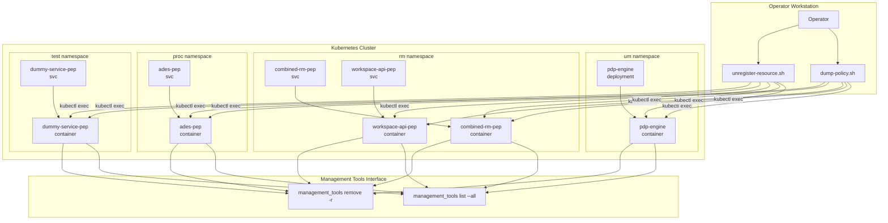
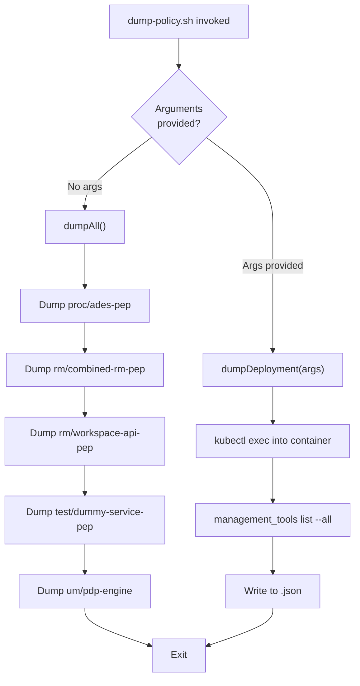
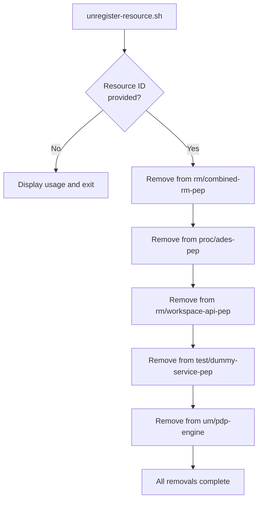
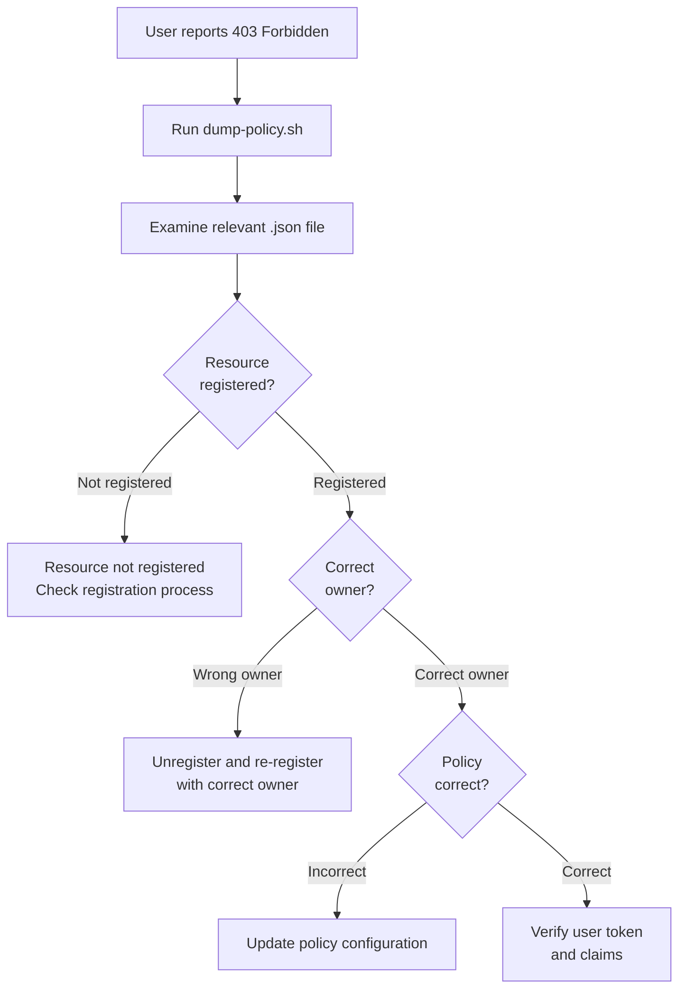
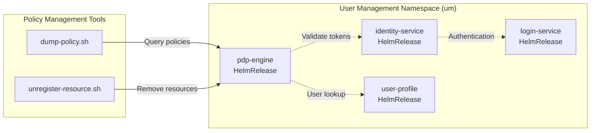
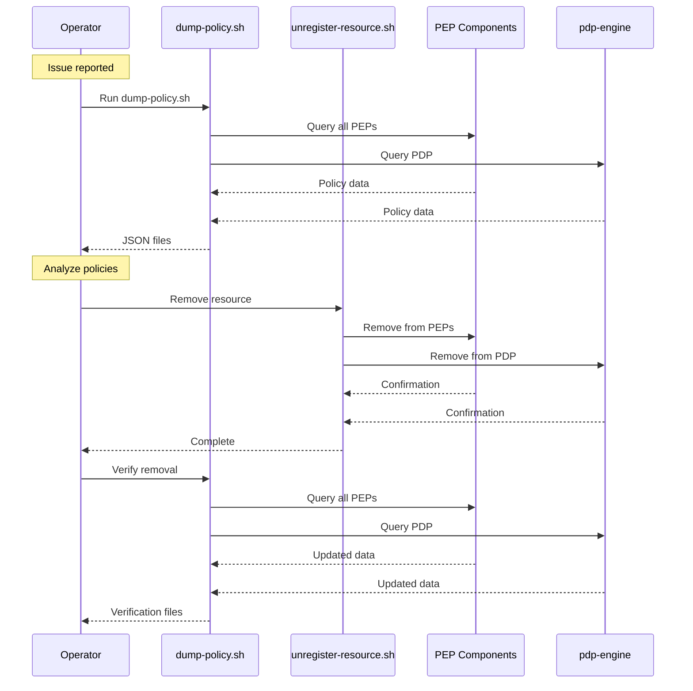

# Policy Management Tools

<details>
<summary>Relevant source files</summary>

The following files were used as context for generating this wiki page:

- [.gitattributes](.gitattributes)
- [bin/dump-policy.sh](bin/dump-policy.sh)
- [bin/list-container-images.sh](bin/list-container-images.sh)
- [bin/unregister-resource.sh](bin/unregister-resource.sh)
- [system/clusters/creodias/user-management/kustomization.yaml](system/clusters/creodias/user-management/kustomization.yaml)
- [system/clusters/data/register-S2-L1C-data.sh](system/clusters/data/register-S2-L1C-data.sh)
- [system/clusters/data/register-S2-L2A-data.sh](system/clusters/data/register-S2-L2A-data.sh)
- [test/acceptance/02__Processing/01__ADES/data/app-deploy-body-atom.json](test/acceptance/02__Processing/01__ADES/data/app-deploy-body-atom.json)
- [test/acceptance/02__Processing/01__ADES/data/app-deploy-body-cwl.json](test/acceptance/02__Processing/01__ADES/data/app-deploy-body-cwl.json)
- [test/acceptance/02__Processing/01__ADES/data/application-package-atom.xml](test/acceptance/02__Processing/01__ADES/data/application-package-atom.xml)
- [test/acceptance/02__Processing/01__ADES/data/application-package-cwl.cwl](test/acceptance/02__Processing/01__ADES/data/application-package-cwl.cwl)
- [test/acceptance/03__ResourceCatalogue/CatalogueServiceWeb.py](test/acceptance/03__ResourceCatalogue/CatalogueServiceWeb.py)
- [test/acceptance/03__ResourceCatalogue/Resource_catalogue.robot](test/acceptance/03__ResourceCatalogue/Resource_catalogue.robot)

</details>


## Purpose and Scope

This document describes the operational scripts provided for managing authorization policies within the EOEPCA platform. Specifically, it covers the `dump-policy.sh` and `unregister-resource.sh` utilities that operators use to inspect and manage resource registrations across Policy Enforcement Points (PEPs) and the Policy Decision Point (PDP).

For information about how policies are enforced at runtime and the UMA authentication flow, see [Policy Enforcement (PEP/PDP)](#4.3) and [UMA Authentication Flow](#4.4). For details on resource registration during workspace provisioning, see [Multi-Tenant Workspaces](#5.5).

---

## Overview of Policy Management

The EOEPCA platform protects resources using a distributed authorization architecture where multiple PEP components enforce access control decisions provided by a central PDP. Resources (such as workspaces, processing jobs, or catalogue entries) must be registered with these components to be protected. The policy management tools provide operators with the ability to:

- Inspect policy state across all PEP/PDP components
- Remove stale or problematic resource registrations
- Debug authorization issues in deployed environments

All policy management operations execute via `kubectl exec` commands that invoke the `management_tools` CLI within running containers.

**Sources:** [bin/dump-policy.sh:1-43](), [bin/unregister-resource.sh:1-55]()

---

## Architecture Context

The following diagram illustrates where policy management tools interact with the deployed system components:



**Policy Component Distribution**

The policy management tools target specific deployments across namespaces:

| Namespace | Service/Deployment | Container Name | Purpose |
|-----------|-------------------|----------------|---------|
| `um` | `pdp-engine` | `pdp-engine` | Central policy decision point |
| `rm` | `combined-rm-pep` | `combined-rm-pep` | Combined PEP for resource management services |
| `rm` | `workspace-api-pep` | `workspace-api-pep` | PEP protecting workspace API |
| `proc` | `ades-pep` | `ades-pep` | PEP protecting ADES processing service |
| `test` | `dummy-service-pep` | `dummy-service-pep` | PEP for testing and validation |

**Sources:** [bin/dump-policy.sh:20-28](), [bin/unregister-resource.sh:21-54]()

---

## The dump-policy.sh Script

### Purpose

The `dump-policy.sh` script exports the current policy state from PEP and PDP components to JSON files for inspection, debugging, or backup purposes. It can dump either all components or a specific deployment.

**Sources:** [bin/dump-policy.sh:1-43]()

### Usage

```bash
# Dump all policies from all components
./bin/dump-policy.sh

# Dump policy from a specific deployment
./bin/dump-policy.sh <namespace> <deployment> [nojson]
```

### Script Flow



### Implementation Details

The script defines a `dumpDeployment` function that constructs and executes `kubectl` commands:

```bash
dumpDeployment() {
  namespace="${1}"
  deployment="${2}"
  print_json="$( [ "${3}" = "nojson" ] && echo "" || echo "| jq" )"
  dumpfile="${ORIG_DIR}/${deployment}.json"

  echo -n "Dumping policy for ${namespace}/${deployment} to ${dumpfile}"
  cmd="kubectl -n "${namespace}" exec -it deploy/"${deployment}" -c "${deployment}" -- management_tools list --all ${print_json}"
  eval "${cmd}" > "${dumpfile}"
  echo " done"
}
```

**Key Parameters:**
- `namespace`: Kubernetes namespace containing the target deployment
- `deployment`: Name of the deployment/service to query
- `nojson`: Optional flag to skip JSON formatting (used for `pdp-engine`)

**Sources:** [bin/dump-policy.sh:30-40]()

### Default Targets

When invoked without arguments, the script dumps policies from these components:

```bash
dumpAll() {
  dumpDeployment proc ades-pep
  dumpDeployment rm combined-rm-pep
  dumpDeployment rm workspace-api-pep
  dumpDeployment test dummy-service-pep
  dumpDeployment um pdp-engine nojson
}
```

Note that `pdp-engine` uses the `nojson` flag because its output format differs from the PEP components.

**Sources:** [bin/dump-policy.sh:20-28]()

### Output Files

Each invocation produces JSON files named after the deployment:

- `ades-pep.json`
- `combined-rm-pep.json`
- `workspace-api-pep.json`
- `dummy-service-pep.json`
- `pdp-engine.json`

---

## The unregister-resource.sh Script

### Purpose

The `unregister-resource.sh` script removes a resource registration from all PEP and PDP components. This is useful for cleaning up stale resources, resolving authorization conflicts, or removing resources that were registered incorrectly.

**Sources:** [bin/unregister-resource.sh:1-55]()

### Usage

```bash
# Remove a resource by ID
./bin/unregister-resource.sh <resource-id>
```

The script requires exactly one argument: the resource ID to unregister. If invoked without arguments, it displays usage information:

```bash
if test $# -lt 1; then
  appname="$(basename "$0")"
  cat - <<EOF
ERROR - resource id not specified
Usage:
  ${appname} <resource-id>
EOF
  exit 1
fi
```

**Sources:** [bin/unregister-resource.sh:9-17]()

### Unregistration Flow



### Component-by-Component Removal

The script systematically removes the resource from each component using `kubectl exec` to invoke `management_tools remove`:

**1. Combined Resource Management PEP:**
```bash
echo -n "Delete resource ${resourceId} from combined-rm-pep..."
kubectl -n rm exec -it svc/combined-rm-pep -c combined-rm-pep -- management_tools remove -r ${resourceId}
echo " done"
```

**2. ADES PEP:**
```bash
echo -n "Delete resource ${resourceId} from ades-pep..."
kubectl -n proc exec -it svc/ades-pep -c ades-pep -- management_tools remove -r ${resourceId}
echo " done"
```

**3. Workspace API PEP:**
```bash
echo -n "Delete resource ${resourceId} from workspace-api-pep..."
kubectl -n rm exec -it svc/workspace-api-pep -c workspace-api-pep -- management_tools remove -r ${resourceId}
echo " done"
```

**4. Dummy Service PEP (Test):**
```bash
echo -n "Delete resource ${resourceId} from dummy-service-pep..."
kubectl -n test exec -it svc/dummy-service-pep -c dummy-service-pep -- management_tools remove -r ${resourceId}
echo " done"
```

**5. Policy Decision Point:**
```bash
echo -n "Delete resource ${resourceId} from pdp..."
kubectl -n um exec -it svc/pdp-engine -c pdp-engine -- management_tools remove -r ${resourceId}
echo " done"
```

**Sources:** [bin/unregister-resource.sh:21-54]()

### Command Pattern

Each removal command follows this pattern:

```
kubectl -n <namespace> exec -it svc/<service> -c <container> -- management_tools remove -r <resource-id>
```

The `-it` flags enable interactive terminal mode, and the `--` separator indicates the start of the command to execute inside the container.

---

## Common Operations

### Inspecting Policy State

**List all registered resources:**
```bash
./bin/dump-policy.sh
```

This creates JSON files for each component. Examine these files to see registered resources, their owners, and associated policies.

**Inspect specific component:**
```bash
./bin/dump-policy.sh rm combined-rm-pep
```

### Cleaning Up Resources

**Remove a workspace resource:**
```bash
# Example: Remove eric's workspace registration
./bin/unregister-resource.sh eric-workspace
```

**Remove a processing job resource:**
```bash
# Example: Remove a specific ADES job
./bin/unregister-resource.sh ades-job-12345
```

### Debugging Authorization Issues

When users report "403 Forbidden" errors, follow this workflow:



### Batch Operations

To remove multiple resources, create a wrapper script:

```bash
#!/bin/bash
# Example: cleanup-old-workspaces.sh
for resource_id in workspace-1 workspace-2 workspace-3; do
  ./bin/unregister-resource.sh "${resource_id}"
done
```

---

## Management Tools CLI

Both scripts invoke the `management_tools` command-line interface that is embedded in PEP and PDP containers. This CLI provides the following operations:

### Command Reference

| Command | Description | Used By |
|---------|-------------|---------|
| `management_tools list --all` | List all registered resources and policies | `dump-policy.sh` |
| `management_tools remove -r <id>` | Remove a resource registration | `unregister-resource.sh` |
| `management_tools register ...` | Register a new resource (not exposed in scripts) | Internal services |

The `management_tools` binary is part of the PEP/PDP container images and is not directly accessible outside the cluster without using `kubectl exec`.

**Sources:** [bin/dump-policy.sh:37](), [bin/unregister-resource.sh:23-53]()

---

## Integration with User Management

The policy management tools interact with the broader User Management subsystem deployed in the `um` namespace:



The `um` namespace components are defined in the system kustomization:

**Sources:** [system/clusters/creodias/user-management/kustomization.yaml:1-14]()

### Namespace Resources

The User Management namespace contains:

- `identity-service`: Keycloak-based identity provider
- `login-service`: Gluu-based login interface
- `pdp-engine`: Policy Decision Point for authorization
- `user-profile`: User profile management service

Policy registrations in the PDP are validated against user identities stored in the Identity Service.

---

## Prerequisites and Access

### Required Permissions

Operators must have the following permissions to use these tools:

1. **Kubernetes Access:** `kubectl exec` privilege on target namespaces (`um`, `rm`, `proc`, `test`)
2. **Service Account:** Sufficient RBAC permissions to access container shells
3. **Network Access:** Connectivity to the Kubernetes API server

### Verifying Access

Test access to a PEP component:

```bash
kubectl -n rm exec -it svc/combined-rm-pep -c combined-rm-pep -- management_tools list --all
```

If successful, this command returns JSON-formatted policy data.

### Troubleshooting Access Issues

**Error: "unable to upgrade connection"**
- Check if the pod is running: `kubectl -n rm get pods`
- Verify service exists: `kubectl -n rm get svc`

**Error: "command not found: management_tools"**
- Incorrect container name specified
- Container does not include management tools binary

**Error: "Forbidden"**
- Insufficient RBAC permissions
- Check your Kubernetes context and credentials

---

## Best Practices

### Before Removing Resources

1. **Dump current state:** Always run `dump-policy.sh` before removal operations to preserve the current state
2. **Verify resource ID:** Confirm the resource ID matches the intended resource
3. **Check dependencies:** Ensure no active operations depend on the resource

### After Removing Resources

1. **Verify removal:** Re-run `dump-policy.sh` and confirm the resource is absent
2. **Test access:** Verify that authorized users can still access their resources
3. **Monitor logs:** Check PEP/PDP logs for authorization errors

### Operational Workflow



---

## Limitations and Caveats

### Script Limitations

1. **No rollback capability:** The `unregister-resource.sh` script does not provide rollback functionality
2. **No validation:** Scripts do not validate resource IDs before attempting removal
3. **Sequential execution:** Resource removal is sequential, not atomic across components
4. **No dry-run mode:** Scripts execute immediately without preview

### Operational Considerations

- **Policy regeneration:** Some resources may be automatically re-registered by services after removal
- **Eventual consistency:** Policy changes may take time to propagate across distributed PEP instances
- **Token caching:** Active tokens may retain access until expiration even after policy changes

### Alternative Approaches

For programmatic policy management, consider:
- Direct API calls to PEP/PDP REST interfaces
- Integration with workspace lifecycle automation
- Custom Kubernetes operators for policy management

**Sources:** [bin/dump-policy.sh:1-43](), [bin/unregister-resource.sh:1-55]()