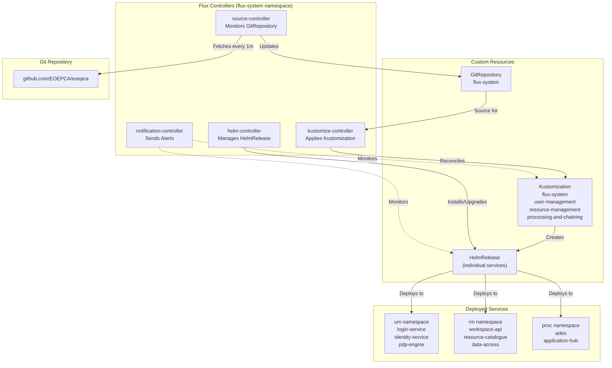
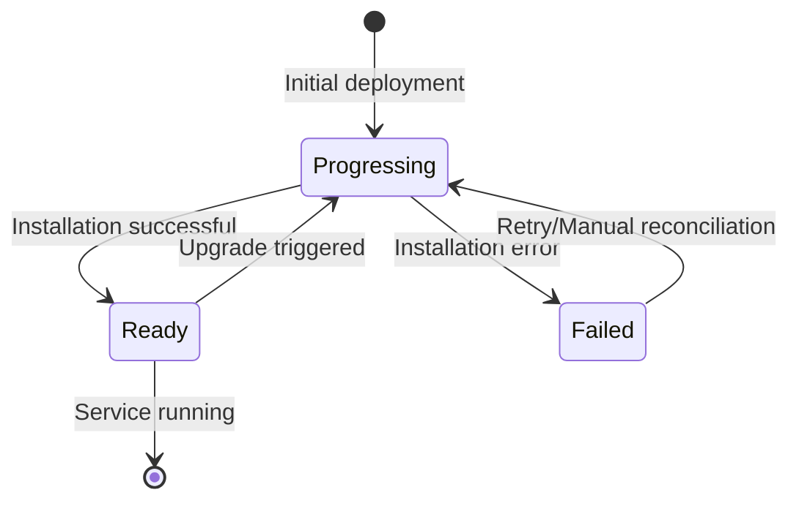
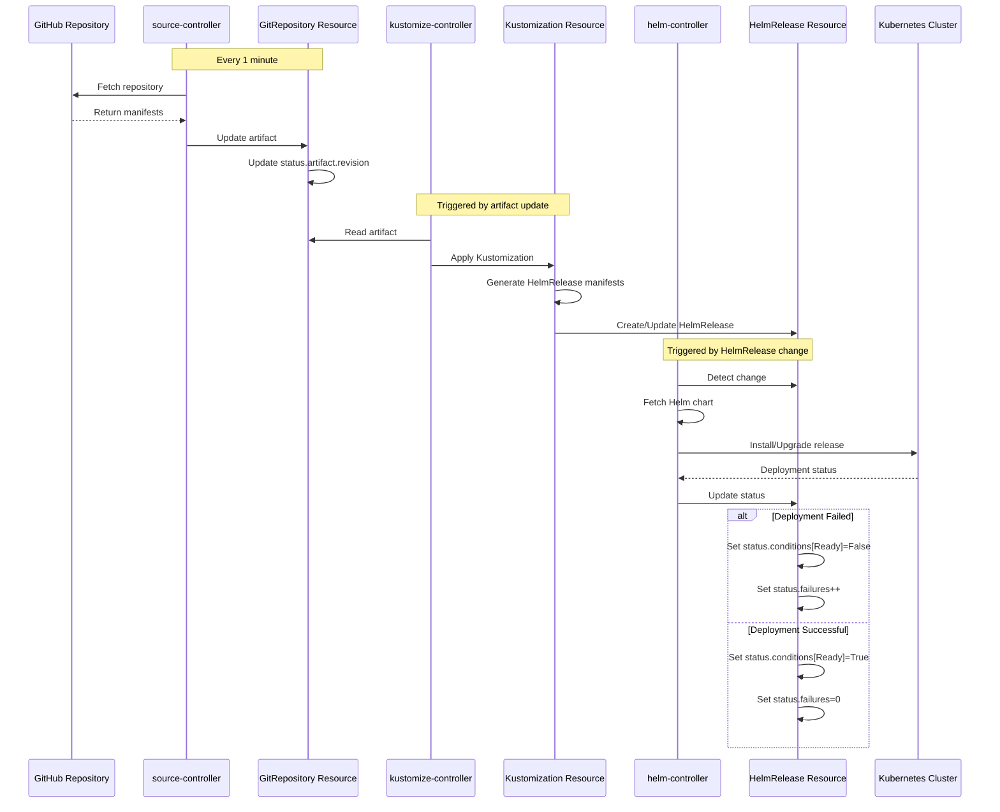
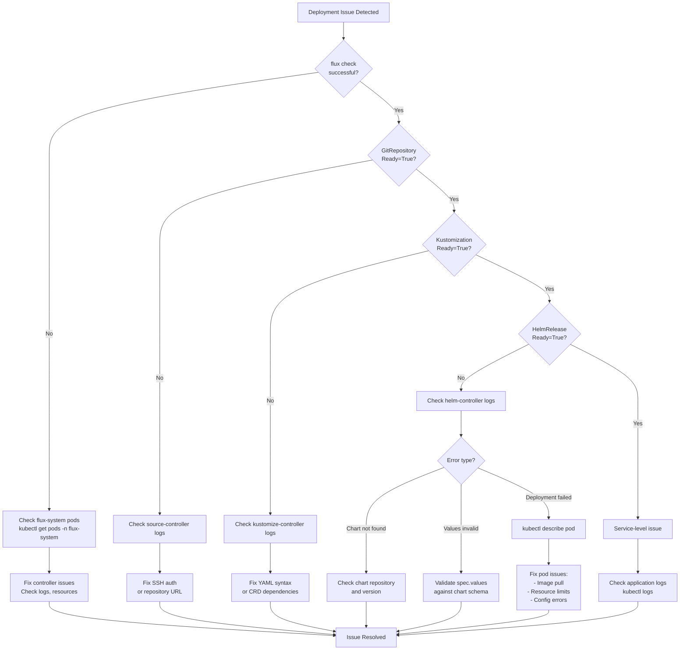

# Monitoring and Troubleshooting

<details>
<summary>Relevant source files</summary>

The following files were used as context for generating this wiki page:

- [README.md](README.md)
- [minikube/README.md](minikube/README.md)
- [system/clusters/README.md](system/clusters/README.md)
- [system/clusters/creodias/system/flux-system-extended/processing-and-chaining-sync.yaml](system/clusters/creodias/system/flux-system-extended/processing-and-chaining-sync.yaml)
- [system/clusters/creodias/system/flux-system-extended/resource-management-sync.yaml](system/clusters/creodias/system/flux-system-extended/resource-management-sync.yaml)
- [system/clusters/creodias/system/flux-system-extended/user-management-sync.yaml](system/clusters/creodias/system/flux-system-extended/user-management-sync.yaml)
- [system/clusters/creodias/system/flux-system/flux-system-patch.yaml](system/clusters/creodias/system/flux-system/flux-system-patch.yaml)
- [system/clusters/creodias/system/flux-system/gotk-components.yaml](system/clusters/creodias/system/flux-system/gotk-components.yaml)
- [system/clusters/creodias/system/flux-system/gotk-sync.yaml](system/clusters/creodias/system/flux-system/gotk-sync.yaml)
- [system/clusters/creodias/system/flux-system/kustomization.yaml](system/clusters/creodias/system/flux-system/kustomization.yaml)

</details>


## Purpose and Scope

This document provides operational guidance for monitoring and troubleshooting a deployed EOEPCA system. It focuses on the GitOps deployment model using Flux CD, covering reconciliation monitoring, deployment failure diagnosis, log access, and common operational issues. This page assumes familiarity with the [GitOps and Flux CD](#3.2) deployment architecture and the [Deployment Guide](#2.1).

For policy-specific troubleshooting tools, see [Policy Management Tools](#11.1). For infrastructure provisioning issues, refer to [Infrastructure Provisioning](#2.2).

---

## Flux CD Monitoring Architecture

The EOEPCA system uses Flux CD to continuously reconcile the cluster state with the Git repository. Flux consists of four primary controllers that monitor different aspects of the deployment:



**Sources:** [system/clusters/creodias/system/flux-system/gotk-components.yaml:1-15](), [system/clusters/creodias/system/flux-system/gotk-sync.yaml:1-28]()

---

## Checking Reconciliation Status

### Flux System Status

The overall Flux system status can be checked using the `flux` CLI:

```bash
# Check flux components status
flux check

# Check all Flux resources
flux get all
```

The `flux check` command verifies that all Flux controllers are running and healthy in the `flux-system` namespace.

**Sources:** [system/clusters/README.md:26-29]()

---

### GitRepository Reconciliation

Monitor the GitRepository resource to ensure Flux is successfully fetching from the Git repository:

```bash
# Check GitRepository status
kubectl get gitrepository -n flux-system

# Detailed status of the main GitRepository
kubectl describe gitrepository flux-system -n flux-system

# Watch for reconciliation events
kubectl get gitrepository flux-system -n flux-system -w
```

The GitRepository resource named `flux-system` is configured to sync from the `develop` branch every 1 minute:

| Field | Value | Location |
|-------|-------|----------|
| `spec.url` | `ssh://git@github.com/EOEPCA/eoepca` | [gotk-sync.yaml:14]() |
| `spec.interval` | `1m0s` | [gotk-sync.yaml:9]() |
| `spec.ref.branch` | `develop` | [gotk-sync.yaml:11]() |

**Key Status Fields:**

- `status.conditions[?(@.type=="Ready")].status`: Should be `"True"` for successful sync
- `status.artifact.revision`: Current Git commit SHA being reconciled
- `status.artifact.lastUpdateTime`: Timestamp of last successful fetch

**Sources:** [system/clusters/creodias/system/flux-system/gotk-sync.yaml:3-14](), [system/clusters/README.md:81-85]()

---

### Kustomization Reconciliation

The Kustomization resources orchestrate the deployment of the three main subsystems:

```bash
# List all Kustomizations
kubectl get kustomization -n flux-system

# Check specific subsystem status
kubectl describe kustomization user-management -n flux-system
kubectl describe kustomization resource-management -n flux-system
kubectl describe kustomization processing-and-chaining -n flux-system
```

Each Kustomization references a path in the Git repository:

| Kustomization | Path | Interval |
|---------------|------|----------|
| `flux-system` | `./system/clusters/creodias/system` | 10m0s |
| `user-management` | `./system/clusters/creodias/user-management` | 1m0s |
| `resource-management` | `./system/clusters/creodias/resource-management` | 1m0s |
| `processing-and-chaining` | `./system/clusters/creodias/processing-and-chaining` | 1m0s |

**Sources:** [system/clusters/creodias/system/flux-system/gotk-sync.yaml:16-28](), [system/clusters/creodias/system/flux-system-extended/user-management-sync.yaml:1-13](), [system/clusters/creodias/system/flux-system-extended/resource-management-sync.yaml:1-13](), [system/clusters/creodias/system/flux-system-extended/processing-and-chaining-sync.yaml:1-13]()

---

### HelmRelease Status

HelmRelease resources represent individual service deployments:

```bash
# List all HelmReleases across all namespaces
flux get helmreleases --all-namespaces

# Check specific service
kubectl describe helmrelease workspace-api -n rm

# Get HelmRelease status for all resource management services
kubectl get helmrelease -n rm
```

**Common HelmRelease Status Conditions:**



**Sources:** [README.md:82-85]()

---

## Flux Reconciliation Workflow

Understanding the reconciliation workflow helps diagnose where issues occur:



**Sources:** [system/clusters/README.md:79-85]()

---

## Debugging Failed Deployments

### Step 1: Identify the Failing Component

Start by checking the overall status to identify which component is failing:

```bash
# Quick overview of all Flux resources
flux get all

# Filter for non-ready resources
flux get helmreleases --all-namespaces | grep -v "True"
flux get kustomizations | grep -v "True"
```

---

### Step 2: Examine Resource Events

Use `kubectl describe` to see detailed events and conditions:

```bash
# For a failing HelmRelease
kubectl describe helmrelease <release-name> -n <namespace>

# For a failing Kustomization
kubectl describe kustomization <name> -n flux-system
```

**Key fields to examine:**

- `status.conditions`: Array of condition objects indicating health
- `status.conditions[?(@.type=="Ready")].message`: Human-readable error description
- `status.conditions[?(@.type=="Ready")].reason`: Programmatic error code
- `status.failures`: Number of consecutive reconciliation failures
- Events section: Recent reconciliation attempts and errors

---

### Step 3: Check Controller Logs

Each Flux controller maintains logs that provide detailed reconciliation information:

```bash
# Source controller logs (GitRepository issues)
kubectl logs -n flux-system deployment/source-controller -f

# Kustomize controller logs (Kustomization issues)
kubectl logs -n flux-system deployment/kustomize-controller -f

# Helm controller logs (HelmRelease issues)
kubectl logs -n flux-system deployment/helm-controller -f

# Filter logs for specific resource
kubectl logs -n flux-system deployment/helm-controller | grep "workspace-api"
```

**Sources:** [system/clusters/creodias/system/flux-system/gotk-components.yaml:1-15]()

---

### Step 4: Manual Reconciliation

Force immediate reconciliation to test fixes without waiting for the interval:

```bash
# Reconcile a specific HelmRelease
flux reconcile helmrelease <name> -n <namespace>

# Reconcile a Kustomization
flux reconcile kustomization <name>

# Reconcile the GitRepository (fetch latest from Git)
flux reconcile source git flux-system
```

---

## Accessing Service Logs

### Application Service Logs

For deployed EOEPCA services, access logs through their pods:

```bash
# List pods in a namespace
kubectl get pods -n um
kubectl get pods -n rm
kubectl get pods -n proc

# View logs for a specific pod
kubectl logs <pod-name> -n <namespace>

# Follow logs in real-time
kubectl logs <pod-name> -n <namespace> -f

# Previous instance logs (after restart/crash)
kubectl logs <pod-name> -n <namespace> --previous

# Logs for multi-container pods
kubectl logs <pod-name> -n <namespace> -c <container-name>
```

**Common EOEPCA Service Namespaces:**

| Namespace | Services |
|-----------|----------|
| `um` | login-service, identity-service, pdp-engine, user-profile |
| `rm` | workspace-api, resource-catalogue, data-access, bucket-operator |
| `proc` | ades, application-hub, pde-hub |

**Sources:** Inferred from system architecture diagrams

---

### Workspace-Specific Service Logs

User workspaces create isolated namespaces with their own service instances:

```bash
# List workspace namespaces
kubectl get namespaces | grep workspace

# Access workspace-specific services
kubectl logs -n eric-workspace deployment/resource-catalogue
kubectl logs -n eric-workspace deployment/data-access
kubectl logs -n eric-workspace deployment/resource-guard
```

**Sources:** Inferred from workspace architecture diagram

---

## Common Troubleshooting Scenarios

### Scenario 1: GitRepository Not Syncing

**Symptoms:**
- `flux get sources git` shows `False` status
- `status.conditions[?(@.type=="Ready")].message` contains "authentication failed" or "connection refused"

**Diagnosis:**

```bash
kubectl describe gitrepository flux-system -n flux-system
kubectl logs -n flux-system deployment/source-controller | tail -50
```

**Common Causes and Solutions:**

| Cause | Diagnostic | Solution |
|-------|-----------|----------|
| SSH key expired/invalid | "authentication failed" in logs | Regenerate SSH key and update `flux-system` secret |
| Repository URL changed | "repository not found" | Update `spec.url` in GitRepository resource |
| Network connectivity | "connection refused" | Check cluster network policies and egress rules |
| Branch doesn't exist | "reference not found" | Verify `spec.ref.branch` exists in repository |

**Update SSH credentials:**

```bash
# The secret is managed by Flux bootstrap
# Re-run flux bootstrap to update credentials
flux bootstrap github \
  --owner=EOEPCA \
  --repository=eoepca \
  --branch=develop \
  --path=./system/clusters/creodias/system
```

**Sources:** [system/clusters/README.md:32-44](), [system/clusters/creodias/system/flux-system/gotk-sync.yaml:3-14]()

---

### Scenario 2: HelmRelease Stuck in Failed State

**Symptoms:**
- HelmRelease shows `Ready: False`
- `status.failures` is incrementing
- Service pods are not created or are in error state

**Diagnosis:**

```bash
# Check HelmRelease details
kubectl describe helmrelease <name> -n <namespace>

# Check Helm controller logs
kubectl logs -n flux-system deployment/helm-controller | grep <name>

# Check if chart exists
flux get sources helm --all-namespaces

# Check for pod errors
kubectl get pods -n <namespace>
kubectl describe pod <pod-name> -n <namespace>
```

**Common Causes:**

1. **Chart version not found**: Update chart version in HelmRelease
2. **Values validation failed**: Check `spec.values` against chart schema
3. **Resource conflicts**: Existing resources with same name
4. **Image pull errors**: Check imagePullSecrets and registry access
5. **Insufficient resources**: Check node capacity and pod resource requests

**Manual intervention:**

```bash
# Suspend reconciliation
flux suspend helmrelease <name> -n <namespace>

# Manually delete the release
helm uninstall <name> -n <namespace>

# Resume reconciliation
flux resume helmrelease <name> -n <namespace>
```

**Sources:** [system/clusters/README.md:81-85]()

---

### Scenario 3: Kustomization Build Failures

**Symptoms:**
- Kustomization shows `Ready: False`
- Message indicates "kustomization build failed" or "validation failed"

**Diagnosis:**

```bash
kubectl describe kustomization <name> -n flux-system
kubectl logs -n flux-system deployment/kustomize-controller | grep <name>
```

**Common Causes:**

| Error Pattern | Meaning | Solution |
|---------------|---------|----------|
| "no matches for kind" | CRD not installed | Install required CRD or adjust dependency order |
| "json: cannot unmarshal" | Invalid YAML syntax | Fix YAML formatting in Git repository |
| "unknown field" | Invalid field in manifest | Check API version compatibility |
| "VariableReference" | Undefined substitution variable | Define missing variables in Kustomization |

**Test Kustomization locally:**

```bash
# Clone the repository
git clone https://github.com/EOEPCA/eoepca.git
cd eoepca

# Build Kustomization locally
kustomize build ./system/clusters/creodias/user-management
```

**Sources:** [system/clusters/creodias/system/flux-system-extended/user-management-sync.yaml:1-13]()

---

### Scenario 4: Resource Controller Memory Issues

**Symptoms:**
- Source-controller or kustomize-controller pods OOMKilled
- `kubectl get pods -n flux-system` shows CrashLoopBackOff

**Diagnosis:**

```bash
kubectl get pods -n flux-system
kubectl describe pod source-controller-<hash> -n flux-system
kubectl top pods -n flux-system
```

The EOEPCA deployment configures memory limits for Flux controllers:

| Controller | Memory Limit | Memory Request |
|------------|--------------|----------------|
| source-controller | 2Gi | 500Mi |
| kustomize-controller | 2Gi | 500Mi |

**Solution:**

These limits are configured in the flux-system-patch overlay. If encountering OOM issues, increase the limits:

```bash
# Edit the patch file
vim system/clusters/creodias/system/flux-system/flux-system-patch.yaml

# Increase memory limits, e.g., to 4Gi
# Commit and push changes
git add system/clusters/creodias/system/flux-system/flux-system-patch.yaml
git commit -m "Increase Flux controller memory limits"
git push
```

**Sources:** [system/clusters/creodias/system/flux-system/flux-system-patch.yaml:1-40]()

---

### Scenario 5: Certificate and TLS Issues

**Symptoms:**
- Services unreachable via HTTPS
- Browser shows certificate errors
- Ingress endpoints return 503 or connection refused

**Diagnosis:**

```bash
# Check cert-manager status
kubectl get certificates --all-namespaces
kubectl get certificaterequests --all-namespaces

# Check cert-manager logs
kubectl logs -n cert-manager deployment/cert-manager

# Check ingress configuration
kubectl get ingress --all-namespaces
kubectl describe ingress <name> -n <namespace>
```

**Common Issues:**

1. **LetsEncrypt rate limits**: Hostnames using `nip.io` help avoid rate limits by embedding IP addresses
2. **Ingress class not specified**: Ensure ingress resources specify `nginx` class
3. **DNS resolution failures**: Verify DNS records resolve to cluster IP

**Sources:** [README.md:100-112]()

---

## Troubleshooting Decision Tree



---

## Useful Monitoring Commands Reference

### Quick Status Checks

```bash
# Overall system health
flux get all

# Check all pods across EOEPCA namespaces
kubectl get pods -n um -n rm -n proc -n flux-system

# Watch for pod changes
kubectl get pods --all-namespaces --watch

# Node resource utilization
kubectl top nodes
kubectl top pods --all-namespaces
```

---

### Reconciliation Status

```bash
# Force reconciliation of all Kustomizations
flux reconcile kustomization flux-system
flux reconcile kustomization user-management
flux reconcile kustomization resource-management
flux reconcile kustomization processing-and-chaining

# Suspend/resume automatic reconciliation
flux suspend kustomization <name>
flux resume kustomization <name>
```

---

### Event Monitoring

```bash
# Watch cluster events
kubectl get events --all-namespaces --watch

# Events for specific namespace
kubectl get events -n rm --sort-by='.lastTimestamp'

# Events for specific resource
kubectl describe <resource-type> <name> -n <namespace>
```

---

### Log Aggregation

```bash
# Tail logs from multiple pods
kubectl logs -n rm -l app=workspace-api --tail=100 -f

# Get logs from all containers in a pod
kubectl logs <pod-name> -n <namespace> --all-containers=true

# Export logs for offline analysis
kubectl logs <pod-name> -n <namespace> > service.log
```

**Sources:** [system/clusters/README.md:1-95]()

---

## Flux Reconciliation Interval Configuration

The reconciliation intervals control how frequently Flux checks for changes. These are configurable per resource:

| Resource Type | Default Interval | Configuration Location |
|---------------|------------------|------------------------|
| GitRepository | 1m0s | [gotk-sync.yaml:9]() |
| Kustomization (flux-system) | 1m0s | [flux-system-patch.yaml:39]() |
| Kustomization (subsystems) | 1m0s | [user-management-sync.yaml:7]() |

The interval was reduced from the default 10m to 1m in the patch configuration to enable faster deployment updates during development:

```yaml
spec:
  interval: 1m0s
```

For production deployments, consider increasing these intervals to reduce API server load.

**Sources:** [system/clusters/creodias/system/flux-system/flux-system-patch.yaml:33-40](), [system/clusters/creodias/system/flux-system/gotk-sync.yaml:9]()

---

## Integration with Deployment Guide

The [Deployment Guide](https://deployment-guide.docs.eoepca.org/) provides an alternative to Flux-based deployment using direct `helm` commands. When troubleshooting issues encountered during Deployment Guide setup:

1. The Deployment Guide assumes `minikube` and uses direct `helm install` commands
2. Flux GitOps uses `HelmRelease` resources that wrap Helm installations
3. Both approaches deploy the same underlying Helm charts
4. To compare configurations, examine the `spec.values` section of HelmRelease resources against the Deployment Guide's helm command values

**Sources:** [README.md:93-99](), [system/clusters/README.md:1-5]()