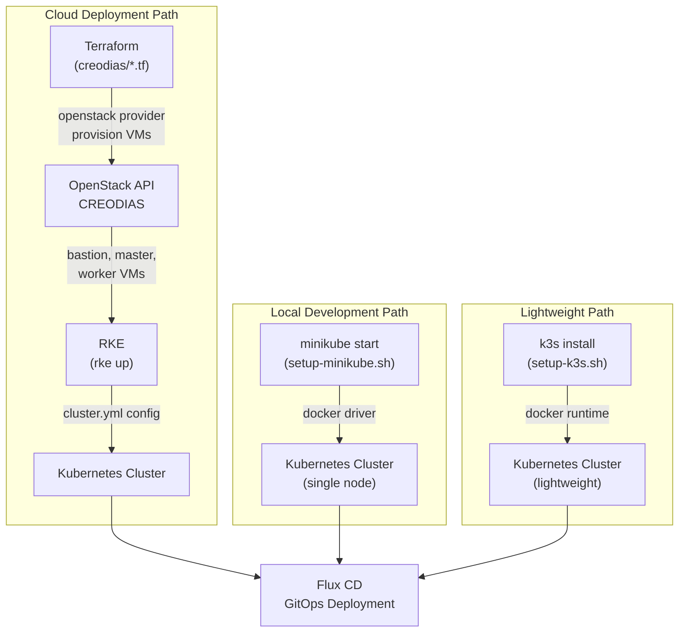
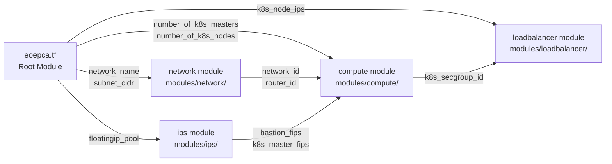
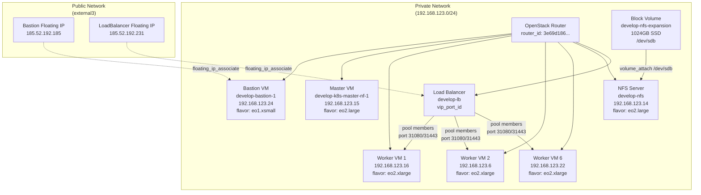
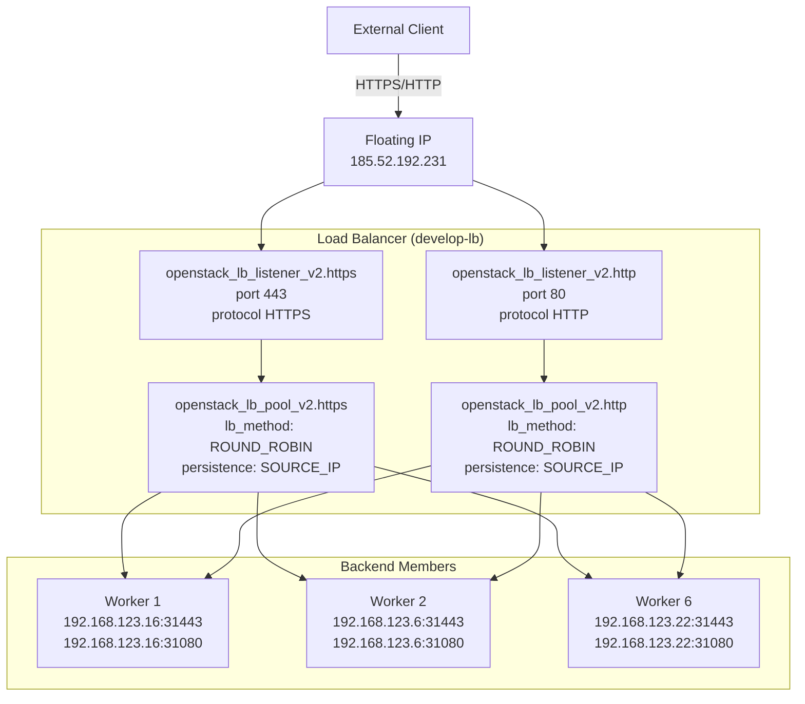
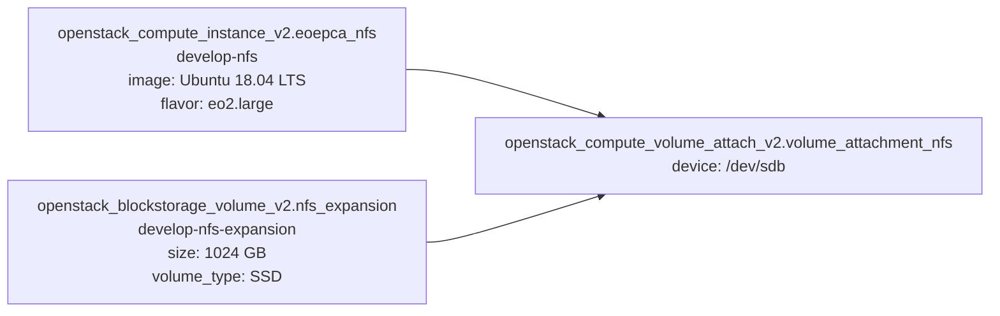
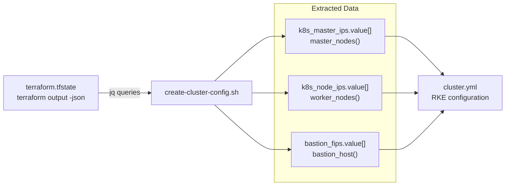

# Infrastructure Provisioning

<details>
<summary>Relevant source files</summary>

The following files were used as context for generating this wiki page:

- [README.md](README.md)
- [bin/install-kubeseal.sh](bin/install-kubeseal.sh)
- [bin/install-rke.sh](bin/install-rke.sh)
- [creodias/.gitignore](creodias/.gitignore)
- [creodias/.terraform/modules/modules.json](creodias/.terraform/modules/modules.json)
- [creodias/README.md](creodias/README.md)
- [creodias/deployCREODIAS.sh](creodias/deployCREODIAS.sh)
- [creodias/eoepca.tf](creodias/eoepca.tf)
- [creodias/eoepca.tfvars](creodias/eoepca.tfvars)
- [creodias/modules/compute/main.tf](creodias/modules/compute/main.tf)
- [creodias/modules/compute/nfs-setup.sh](creodias/modules/compute/nfs-setup.sh)
- [creodias/modules/compute/nfs.tf](creodias/modules/compute/nfs.tf)
- [creodias/modules/compute/outputs.tf](creodias/modules/compute/outputs.tf)
- [creodias/modules/compute/variables.tf](creodias/modules/compute/variables.tf)
- [creodias/modules/loadbalancer/main.tf](creodias/modules/loadbalancer/main.tf)
- [creodias/terraform.tfstate](creodias/terraform.tfstate)
- [creodias/terraform.tfstate.backup](creodias/terraform.tfstate.backup)
- [creodias/variables.tf](creodias/variables.tf)
- [kubernetes/cluster.7z](kubernetes/cluster.7z)
- [kubernetes/create-cluster-config.sh](kubernetes/create-cluster-config.sh)
- [minikube/README.md](minikube/README.md)
- [system/clusters/README.md](system/clusters/README.md)
- [travis/acceptanceTest.sh](travis/acceptanceTest.sh)
- [travis/setupMinikube.sh](travis/setupMinikube.sh)
- [travis/setupRobot.sh](travis/setupRobot.sh)

</details>


## Purpose and Scope

This document explains how to provision the underlying infrastructure for EOEPCA deployments. It covers three deployment scenarios:

1. **Cloud deployment** using Terraform to provision VMs on OpenStack (CREODIAS), followed by Kubernetes cluster setup with RKE
2. **Local development** using Minikube for single-node Kubernetes clusters
3. **Lightweight alternative** using k3s for resource-constrained environments

For GitOps-based system deployment once infrastructure is ready, see [Deployment Guide](#2.1). For detailed Kubernetes cluster configuration specifics, see [Kubernetes Cluster Setup](#8.1). For network architecture details, see [Network Architecture](#8.3).

**Sources:** [README.md:72-96](), [creodias/README.md:1-128]()

---

## Infrastructure Deployment Paths

The EOEPCA system supports three infrastructure provisioning approaches, depending on the target environment:

| Deployment Type | Infrastructure Tool | Kubernetes Tool | Use Case |
|----------------|--------------------|--------------------|----------|
| Cloud (OpenStack) | Terraform | RKE (Rancher Kubernetes Engine) | Production deployments on CREODIAS |
| Local Development | Direct installation | Minikube | Developer workstations, testing |
| Lightweight | Direct installation | k3s | VMs, resource-constrained environments |



**Sources:** [README.md:88-94](), [creodias/README.md:9-11](), [minikube/README.md:3-52]()

---

## OpenStack Provisioning with Terraform

### Terraform Module Structure

The Terraform infrastructure code is organized into modules under `creodias/modules/`:



The root module `eoepca.tf` orchestrates infrastructure provisioning by calling specialized modules for networking, IP allocation, compute resources, and load balancing.

**Sources:** [creodias/eoepca.tf:1-146](), [creodias/.terraform/modules/modules.json:1]()

### Prerequisites and Configuration

Before running Terraform, several prerequisites must be satisfied:

#### OpenStack Client Setup

The OpenStack provider requires the `openstackclient` Python package and a `clouds.yaml` configuration file:

```yaml
clouds:
  eoepca:
    auth:
      auth_url: https://cf2.cloudferro.com:5000/v3
      username: "user@example.com"
      project_name: "eoepca"
      project_id: d86660d4a1a443579c71096771a8104c
      user_domain_name: "cloud_xxxxx"
      password: "xxxxxxxxxx"
    region_name: "RegionOne"
    interface: "public"
    identity_api_version: 3
```

This file must be placed in `./clouds.yaml`, `~/.config/openstack/clouds.yaml`, or `/etc/openstack/clouds.yaml`.

**Sources:** [creodias/README.md:18-52]()

#### Deployment Configuration

The file `creodias/eoepca.tfvars` defines deployment parameters:

| Variable | Description | Example Value |
|----------|-------------|---------------|
| `cluster_name` | Unique identifier for the cluster | `"develop"` |
| `number_of_bastions` | Number of bastion hosts (0 or 1) | `1` |
| `number_of_k8s_masters_no_floating_ip` | Master nodes without public IPs | `1` |
| `number_of_k8s_nodes_no_floating_ip` | Worker nodes without public IPs | `6` |
| `flavor_bastion` | OpenStack flavor ID for bastion | `"14"` (eo1.xsmall) |
| `flavor_k8s_master` | OpenStack flavor ID for masters | `"20"` (eo2.large) |
| `flavor_k8s_node` | OpenStack flavor ID for workers | `"21"` (eo2.xlarge) |
| `nfs_disk_size` | NFS volume size in GB | `1024` |
| `subnet_cidr` | Private network CIDR | `"192.168.123.0/24"` |

**Sources:** [creodias/eoepca.tfvars:1-57](), [creodias/variables.tf:1-233]()

### Deployment Execution

The deployment script `deployCREODIAS.sh` orchestrates the Terraform provisioning process:

```bash
#!/usr/bin/env bash
export OS_CLOUD=eoepca
./creodias/deployCREODIAS.sh
```

The script performs a two-phase deployment:

1. **Keypair Creation** - Provisions `openstack_compute_keypair_v2.k8s` first to ensure SSH access
2. **Full Deployment** - Provisions all remaining resources

**Sources:** [creodias/deployCREODIAS.sh:1-52](), [creodias/README.md:60-73]()

---

## Provisioned Infrastructure

### Resource Topology

The Terraform deployment creates the following infrastructure components:



**Sources:** [creodias/terraform.tfstate:6-146](), [creodias/eoepca.tf:95-146]()

### Compute Instance Details

The `openstack_compute_instance_v2` resources are created with specific metadata for Kubernetes roles:

| Instance Type | Resource Name | Kubespray Groups | Floating IP |
|---------------|---------------|------------------|-------------|
| Bastion | `openstack_compute_instance_v2.bastion` | `bastion` | Yes |
| Master | `openstack_compute_instance_v2.k8s_master_no_floating_ip` | `etcd,kube-master,k8s-cluster,vault,no-floating` | No |
| Worker | `openstack_compute_instance_v2.k8s_node_no_floating_ip` | `kube-node,k8s-cluster,no-floating` | No |
| NFS | `openstack_compute_instance_v2.eoepca_nfs` | `nfs,no-floating` | No |

**Sources:** [creodias/modules/compute/main.tf:116-174](), [creodias/modules/compute/main.tf:384-428](), [creodias/modules/compute/nfs.tf:1-49]()

### Security Groups

The deployment creates multiple `openstack_networking_secgroup_v2` resources:

| Security Group | Resource Name | Purpose | Key Rules |
|----------------|---------------|---------|-----------|
| `develop-bastion` | `openstack_networking_secgroup_v2.bastion` | SSH access to bastion | Ingress TCP 22 from `bastion_allowed_remote_ips` |
| `develop-k8s-master` | `openstack_networking_secgroup_v2.k8s_master` | Kubernetes API access | Ingress TCP 6443 from `master_allowed_remote_ips` |
| `develop-k8s` | `openstack_networking_secgroup_v2.k8s` | Internal cluster traffic | Ingress from same group, SSH from `k8s_allowed_remote_ips` |
| `develop-k8s-worker` | `openstack_networking_secgroup_v2.worker` | NodePort services | Ingress TCP 30000-32767 from 0.0.0.0/0 |
| `develop-lb` | `openstack_networking_secgroup_v2.lb` | Load balancer traffic | Ingress TCP 80/443 from 0.0.0.0/0 |

**Sources:** [creodias/modules/compute/main.tf:14-96](), [creodias/modules/loadbalancer/main.tf:2-36]()

### Load Balancer Configuration

The `openstack_lb_loadbalancer_v2.k8s` resource creates an Octavia load balancer with the following structure:



The load balancer forwards traffic from public ports (80/443) to Kubernetes ingress controller NodePorts (31080/31443) on all worker nodes.

**Sources:** [creodias/modules/loadbalancer/main.tf:38-183](), [creodias/README.md:90-92]()

### NFS Server Provisioning

The NFS server is provisioned with an attached block volume and automated configuration:

#### Volume Attachment



**Sources:** [creodias/modules/compute/nfs.tf:1-70]()

#### Automated NFS Setup

The NFS configuration is automated via a provisioner that executes `nfs-setup.sh`:

```bash
provisioner "remote-exec" {
  inline = [
    "sudo chmod +x /tmp/nfs-setup.sh",
    "echo /tmp/nfs-setup.sh | at now + 2 minute",
  ]
}
```

The `nfs-setup.sh` script performs:
1. Installs `nfs-kernel-server` package
2. Creates partition on `/dev/sdb` using `fdisk`
3. Formats partition as ext4
4. Mounts partition to `/data`
5. Creates export directories: `/data/userman`, `/data/proc`, `/data/resman`, `/data/dynamic`
6. Configures NFS exports in `/etc/exports` with options: `rw,no_root_squash,no_subtree_check`
7. Restarts NFS service

**Sources:** [creodias/modules/compute/nfs.tf:26-44](), [creodias/modules/compute/nfs-setup.sh:1-44]()

---

## Kubernetes Cluster Setup with RKE

### Cluster Configuration Generation

After Terraform provisioning, the RKE cluster configuration is generated using `create-cluster-config.sh`:

```bash
#!/usr/bin/env bash
cd kubernetes
./create-cluster-config.sh develop cluster.yml
```

The script queries Terraform state to extract node IPs and generate the `cluster.yml` configuration:



**Sources:** [kubernetes/create-cluster-config.sh:1-117]()

### RKE Cluster Configuration Structure

The generated `cluster.yml` defines node roles and cluster settings:

```yaml
cluster_name: develop
kubernetes_version: "v1.22.11-rancher1-1"
nodes:
  - address: 192.168.123.15
    user: eouser
    role:
      - controlplane
      - etcd
  - address: 192.168.123.16
    user: eouser
    role:
      - worker
  # ... additional worker nodes

ingress:
  provider: none

bastion_host:
  address: 185.52.192.185
  user: eouser
```

Key configuration elements:
- **kubernetes_version**: Set to `v1.22.11-rancher1-1`
- **ingress.provider**: Set to `none` (EOEPCA deploys nginx-ingress separately)
- **bastion_host**: Enables SSH tunneling through bastion for node access

**Sources:** [kubernetes/create-cluster-config.sh:92-109]()

### RKE Installation and Execution

The `rke` binary is installed via helper script:

```bash
bin/install-rke.sh
# Downloads rke_linux-amd64 to ~/.local/bin/rke
```

Cluster provisioning is executed with:

```bash
rke up --config cluster.yml
```

This command:
1. Establishes SSH connections to nodes via bastion
2. Deploys Kubernetes system components
3. Configures etcd cluster on master nodes
4. Initializes worker nodes
5. Generates `kube_config_cluster.yml` for kubectl access

**Sources:** [bin/install-rke.sh:1-14](), [README.md:91]()

---

## Local Development with Minikube

### Minikube Installation

Minikube provides single-node Kubernetes clusters for local development:

```bash
minikube/setup-minikube.sh
# Downloads and installs minikube to /usr/local/bin/
```

The script supports two driver modes:

| Driver | Usage | Description |
|--------|-------|-------------|
| `docker` (default) | `setup-minikube.sh` | Runs Kubernetes in Docker container |
| `none` (native) | `setup-minikube.sh native` | Runs Kubernetes directly on host VM |

The `docker` driver is preferred and recommended by the Minikube team.

**Sources:** [minikube/README.md:20-35](), [travis/setupMinikube.sh:1-51]()

### Minikube Startup Configuration

The setup script starts Minikube with specific configuration:

```bash
export CHANGE_MINIKUBE_NONE_USER=true
minikube delete --purge --all
minikube start --vm-driver=none \
  --bootstrapper=kubeadm \
  --kubernetes-version=${K8S_VER} \
  --extra-config=apiserver.authorization-mode=RBAC

minikube addons enable ingress
minikube update-context
```

Key parameters:
- **vm-driver**: Uses `none` to run directly on host (in Travis CI context)
- **bootstrapper**: Uses `kubeadm` for cluster initialization
- **authorization-mode**: Enables RBAC for security
- **ingress addon**: Deploys nginx-ingress controller

**Sources:** [travis/setupMinikube.sh:18-36]()

### Kubectl Configuration

After Minikube starts, kubectl access is configured:

```bash
sudo chmod o+r ${HOME}/.kube/config
sudo chmod -R o+r ${HOME}/.minikube/
sudo chown -R $USER $HOME/.kube $HOME/.minikube
```

The `kube_config` is typically located at `~/.kube/config` and provides cluster access credentials.

**Sources:** [travis/setupMinikube.sh:34-36]()

---

## Lightweight Alternative: k3s

### k3s Installation

k3s offers a lightweight Kubernetes distribution suitable for resource-constrained environments:

```bash
minikube/setup-k3s.sh
# Installs k3s with docker runtime
```

### k3s vs Minikube Comparison

| Feature | k3s | Minikube |
|---------|-----|----------|
| Installation time | Faster | Slower |
| Resource usage | Lower | Higher |
| Default runtime | containerd | docker/containerd |
| Production readiness | Production-grade | Development-focused |
| Relationship to RKE | Sibling product from Rancher | Independent project |

k3s is particularly advantageous when:
- Running in VMs with limited resources
- Faster setup times are required
- Alignment with Rancher ecosystem is desired

**Sources:** [minikube/README.md:39-48](), [README.md:96]()

### k3s Docker Runtime Configuration

The setup script explicitly selects the `docker` container runtime:

```bash
# setup-k3s.sh selects docker runtime
curl -sfL https://get.k3s.io | sh -s - --docker
```

This is required for ADES building block compatibility, which depends on Docker for CWL workflow execution with Calrissian.

**Sources:** [minikube/README.md:48]()

---

## Bastion Access Patterns

### SSH Jump Host Access

The bastion host provides the sole SSH entry point to the private cluster network:

```bash
# Single SSH session to a node
ssh -J eouser@185.52.192.185 eouser@192.168.123.15
```

Where:
- `185.52.192.185` is the bastion floating IP (from `bastion_fips` Terraform output)
- `192.168.123.15` is a cluster node IP (from `k8s_master_ips` or `k8s_node_ips`)

**Sources:** [creodias/README.md:102-106]()

### VPN via sshuttle

For persistent cluster access, `sshuttle` creates a VPN tunnel through the bastion:

```bash
# Manual invocation
sshuttle -r eouser@185.52.192.185 192.168.123.0/24

# Using helper script (extracts IPs from Terraform state)
bin/bastion-vpn.sh

# Daemon mode (background)
bin/bastion-vpn.sh -D

# Terminate VPN
killall sshuttle
```

This approach:
- Routes all traffic to `192.168.123.0/24` through the bastion
- Enables direct `kubectl` access to cluster API server
- Persists across multiple terminal sessions (in daemon mode)

**Sources:** [creodias/README.md:108-120]()

---

## Infrastructure Outputs

### Terraform Output Variables

After successful deployment, Terraform exposes infrastructure details via output variables:

```bash
terraform output -json
```

| Output Variable | Type | Description | Example Value |
|-----------------|------|-------------|---------------|
| `bastion_fips` | list(string) | Bastion floating IPs | `["185.52.192.185"]` |
| `loadbalancer_fips` | list(string) | Load balancer floating IPs | `["185.52.192.231"]` |
| `k8s_master_ips` | list(string) | Master node private IPs | `["192.168.123.15"]` |
| `k8s_node_ips` | list(string) | Worker node private IPs | `["192.168.123.16", "192.168.123.6", ...]` |
| `nfs_ip_address` | string | NFS server private IP | `"192.168.123.14"` |
| `subnet_cidr` | string | Private network CIDR | `"192.168.123.0/24"` |
| `router_id` | string | OpenStack router UUID | `"3e69d186-59dd-4dcc-998c-db78c72d366f"` |

These outputs are consumed by:
- `create-cluster-config.sh` for RKE configuration generation
- `bastion-vpn.sh` for VPN tunnel setup
- Subsequent deployment scripts for service configuration

**Sources:** [creodias/eoepca.tf:95-146](), [creodias/terraform.tfstate:6-94](), [kubernetes/create-cluster-config.sh:20-80]()

---

## Summary

Infrastructure provisioning for EOEPCA follows three distinct paths depending on deployment context:

1. **Production (OpenStack + RKE)**:
   - Terraform provisions VMs, networking, and load balancers on CREODIAS OpenStack
   - RKE deploys multi-node Kubernetes cluster with etcd, control plane, and worker nodes
   - Bastion host provides secure SSH access via jump host or VPN tunnel
   - NFS server provides shared persistence with automated partition setup

2. **Local Development (Minikube)**:
   - Single-node Kubernetes cluster running in Docker container or natively
   - Simplified setup for component development and testing
   - Ingress addon pre-configured for local service exposure

3. **Lightweight (k3s)**:
   - Minimal Kubernetes distribution for resource-constrained environments
   - Faster installation and lower overhead than Minikube
   - Docker runtime compatibility for ADES/Calrissian workflows

All paths converge to a functional Kubernetes cluster ready for GitOps deployment via Flux CD.

**Sources:** [README.md:72-96](), [creodias/README.md:76-97](), [minikube/README.md:1-52]()