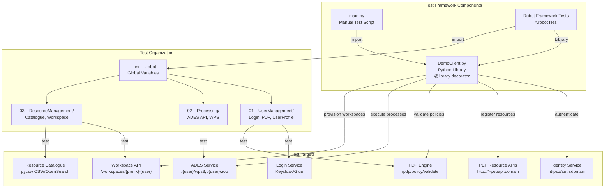
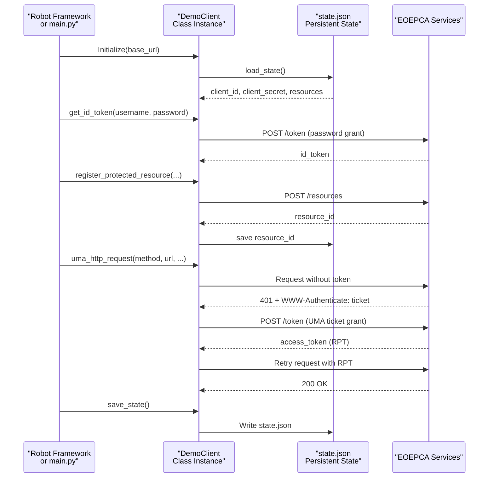
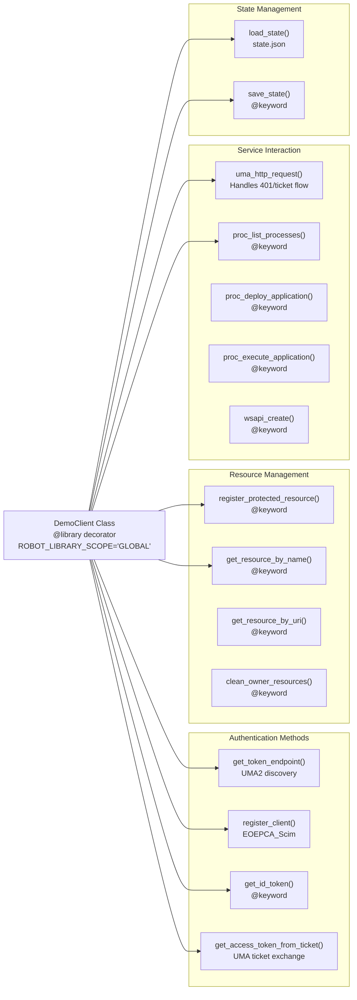
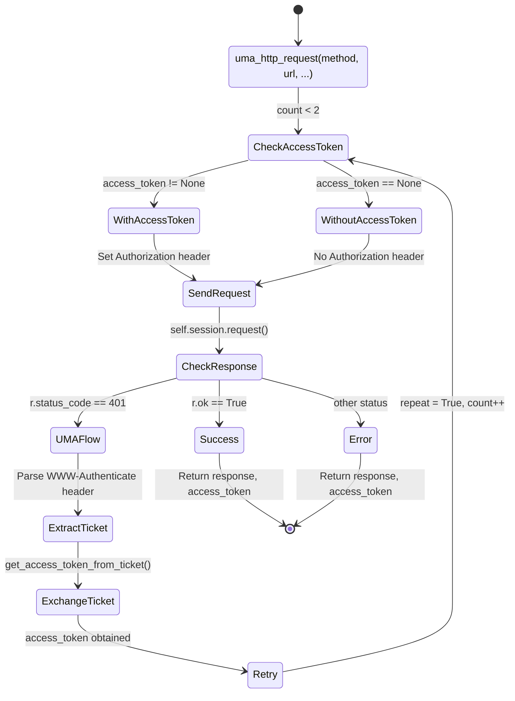
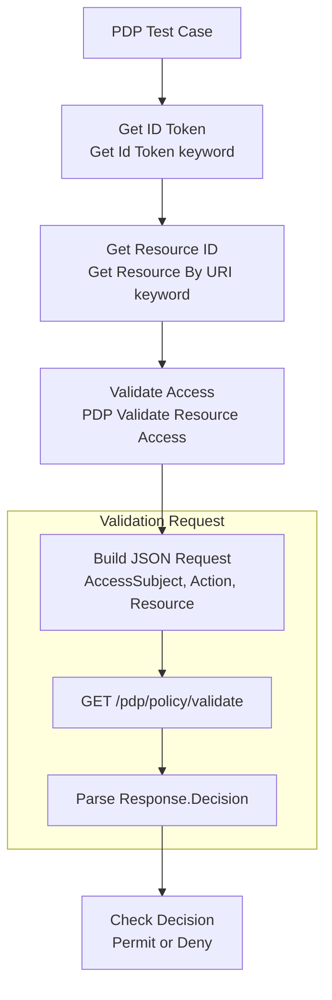
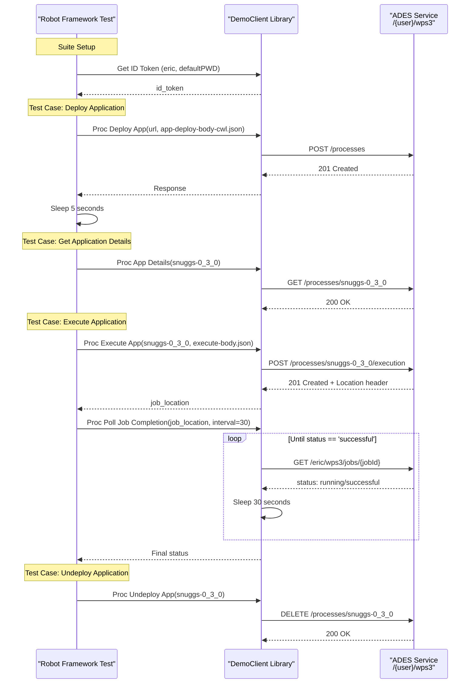
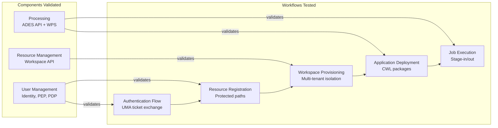

# Testing and Validation

<details>
<summary>Relevant source files</summary>

The following files were used as context for generating this wiki page:

- [test/acceptance/01__UserManagement/02__UserProfile/LoginServiceInteraction.robot](test/acceptance/01__UserManagement/02__UserProfile/LoginServiceInteraction.robot)
- [test/acceptance/01__UserManagement/03__PDP_Engine/PDP_Engine.robot](test/acceptance/01__UserManagement/03__PDP_Engine/PDP_Engine.robot)
- [test/acceptance/01__UserManagement/03__PDP_Engine/getOwnership.py](test/acceptance/01__UserManagement/03__PDP_Engine/getOwnership.py)
- [test/acceptance/01__UserManagement/03__PDP_Engine/tkn.sh](test/acceptance/01__UserManagement/03__PDP_Engine/tkn.sh)
- [test/acceptance/02__Processing/01__ADES/01__API_PROC.robot](test/acceptance/02__Processing/01__ADES/01__API_PROC.robot)
- [test/acceptance/02__Processing/01__ADES/02__WPS.robot](test/acceptance/02__Processing/01__ADES/02__WPS.robot)
- [test/acceptance/__init__.robot](test/acceptance/__init__.robot)
- [test/client/.gitignore](test/client/.gitignore)
- [test/client/DemoClient.py](test/client/DemoClient.py)
- [test/client/debug/jwt-output-by-pep.json](test/client/debug/jwt-output-by-pep.json)
- [test/client/main.py](test/client/main.py)
- [test/client/requirements.txt](test/client/requirements.txt)
- [test/client/setup.sh](test/client/setup.sh)

</details>


## Purpose and Scope

This document describes the testing and validation framework for the EOEPCA platform. It covers the automated acceptance tests built with Robot Framework, the `DemoClient` Python library for programmatic interaction with EOEPCA services, and manual testing procedures. The test framework validates authentication flows, resource protection policies, processing capabilities, and workspace provisioning across the entire platform.

For information about local development environments, see [Local Development with Minikube](#9.3). For deployment procedures that should precede testing, see [Deployment Guide](#2.1).

**Sources:** [test/acceptance/__init__.robot:1-22](), [test/client/main.py:1-10]()

---

## Test Framework Architecture

The EOEPCA test framework consists of three primary components:

| Component | Technology | Purpose |
|-----------|-----------|---------|
| **DemoClient Library** | Python 3 | Reusable client library providing methods for authentication, resource registration, and service interaction |
| **Acceptance Tests** | Robot Framework | Automated test suites covering User Management, Processing, and Resource Management |
| **Manual Test Client** | Python Script | Interactive test script demonstrating end-to-end workflows |



**Test Framework Data Flow**



**Sources:** [test/client/DemoClient.py:14-33](), [test/client/main.py:7-13](), [test/acceptance/__init__.robot:1-22]()

---

## DemoClient Library

The `DemoClient` class provides a Python interface to all EOEPCA services with built-in UMA authentication handling. It is implemented as both a standalone Python library and a Robot Framework library using the `@library` decorator.

### Class Structure



### Key Methods

| Method | Parameters | Purpose | Robot Keyword |
|--------|-----------|---------|---------------|
| `get_id_token` | username, password | Obtain user ID token via password grant | ✓ |
| `register_protected_resource` | resource_api_url, uri, id_token, name, scopes | Register resource with PEP | ✓ |
| `uma_http_request` | method, url, headers, id_token, access_token | Execute HTTP request with UMA flow | ✗ |
| `proc_list_processes` | service_base_url, id_token, access_token | List deployed processes in ADES | ✓ |
| `proc_deploy_application` | service_base_url, app_deploy_body_filename, id_token | Deploy CWL application | ✓ |
| `proc_execute_application` | service_base_url, app_name, app_execute_body_filename, id_token | Execute deployed process | ✓ |
| `proc_poll_job_completion` | service_base_url, job_location, interval, id_token | Poll job status until completion | ✓ |
| `wsapi_create` | service_base_url, name, owner, id_token | Create user workspace | ✓ |
| `update_policy` | pdp_base_url, policy_cfg, resource_id, id_token | Modify PDP policy | ✓ |

**Sources:** [test/client/DemoClient.py:14-683]()

### UMA Authentication Flow Implementation

The `uma_http_request` method implements the complete UMA 2.0 authentication flow:



**Implementation Details:**

- **Line 239-291**: The `uma_http_request` method implements a retry loop (max 2 iterations)
- **Line 257**: Sets `X-User-Id` header with the ID token for user identification
- **Line 260**: Uses existing access token (RPT) if available
- **Line 270-286**: Handles 401 response by extracting ticket from `WWW-Authenticate` header
- **Line 283**: Calls `get_access_token_from_ticket` to exchange ticket for RPT
- **Line 284**: Sets `repeat = True` to retry the original request with new token

**Sources:** [test/client/DemoClient.py:239-291](), [test/client/DemoClient.py:185-212]()

### State Persistence

The `DemoClient` maintains persistent state across test runs in `state.json`:

```json
{
  "client_id": "963e4c2a-9924-4c4d-b999-bebe79c96a5e",
  "client_secret": "...",
  "resources": {
    "http://ades-pepapi.example.org": {
      "/eric": "6c58a5e5-95b7-44ca-ab49-b1192e0db198"
    },
    "http://workspace-api-pepapi.example.org": {
      "/workspaces/develop-user-eric": "7d69b6f6-a6c8-55db-bc5a-c2203f1ec209"
    }
  }
}
```

- **Lines 35-46**: `load_state()` reads state.json on initialization
- **Lines 48-55**: `save_state()` writes state.json with sorted keys for readability
- **Lines 92-111**: Client registration skipped if `client_id` already in state
- **Lines 149-183**: Resource registration skipped if resource already tracked in state

**Sources:** [test/client/DemoClient.py:35-55](), [test/client/DemoClient.py:92-183](), [test/client/.gitignore:4]()

---

## Robot Framework Acceptance Tests

The acceptance test suite is organized by building block and uses Robot Framework's keyword-driven approach.

### Test Suite Organization

```
test/acceptance/
├── __init__.robot                    # Global setup and variables
├── 01__UserManagement/
│   ├── 02__UserProfile/
│   │   └── LoginServiceInteraction.robot
│   └── 03__PDP_Engine/
│       ├── PDP_Engine.robot
│       ├── tkn.sh
│       └── getOwnership.py
└── 02__Processing/
    └── 01__ADES/
        ├── 01__API_PROC.robot
        ├── 02__WPS.robot
        └── data/
            ├── app-deploy-body-cwl.json
            └── app-execute-body.json
```

**Sources:** [test/acceptance/__init__.robot:1-22]()

### Global Test Configuration

The `__init__.robot` file establishes global variables for all test suites:

| Variable | Example Value | Purpose |
|----------|---------------|---------|
| `${UM_BASE_URL}` | `https://auth.${PUBLIC_HOSTNAME}` | Identity Service base URL |
| `${ADES_BASE_URL}` | `http://ades.${PUBLIC_HOSTNAME}` | ADES service endpoint |
| `${ADES_RESOURCES_API_URL}` | `http://ades-pepapi.${PUBLIC_HOSTNAME}` | ADES PEP resource API |
| `${DUMMY_SERVICE_RESOURCES_API_URL}` | `http://dummy-service-pepapi.${PUBLIC_HOSTNAME}` | Test service PEP API |
| `${CATALOGUE_BASE_URL}` | `https://resource-catalogue.${PUBLIC_HOSTNAME}` | Resource Catalogue endpoint |
| `${USER_A_NAME}` | `eric` | Test user A username |
| `${USER_A_PASSWORD}` | `defaultPWD` | Test user A password |
| `${USER_PREFIX}` | `develop-user` | Workspace name prefix |

The `PUBLIC_HOSTNAME` variable must be set as an environment variable or passed via command line when running tests.

**Sources:** [test/acceptance/__init__.robot:6-22]()

### PDP Engine Tests

The PDP Engine test suite validates policy enforcement and authorization decisions.

**Test Case Structure:**



**Example Test Cases:**

- **Lines 13-16**: Validates user `eric` can access `/ericspace` (Permit expected)
- **Lines 18-21**: Validates user `bob` cannot access `/ericspace` (Deny expected)
- **Lines 23-26**: Validates user `bob` can access `/bobspace` (Permit expected)
- **Lines 28-46**: Tests different HTTP methods (GET, POST, PUT, DELETE, HEAD)
- **Lines 63-71**: Tests unauthorized policy changes (401 expected)
- **Lines 73-82**: Tests authorized policy changes by resource owner

**PDP Validation Request Format:**

```json
{
  "Request": {
    "AccessSubject": [{
      "Attribute": [{
        "AttributeId": "user_name",
        "Value": "eric",
        "DataType": "string"
      }]
    }],
    "Action": [{
      "Attribute": [{
        "AttributeId": "action-id",
        "Value": "get"
      }]
    }],
    "Resource": [{
      "Attribute": [{
        "AttributeId": "resource-id",
        "Value": "6c58a5e5-95b7-44ca-ab49-b1192e0db198"
      }]
    }]
  }
}
```

**Sources:** [test/acceptance/01__UserManagement/03__PDP_Engine/PDP_Engine.robot:1-123]()

### ADES API Processes Tests

The ADES acceptance tests validate the OGC API Processes interface for application deployment and execution.

**Test Flow:**



**Key Test Cases:**

| Test Case | Lines | Verification |
|-----------|-------|-------------|
| Initial Process List | 23-24 | Records baseline deployed processes |
| Deploy Application | 26-29 | Deploys CWL from `app-deploy-body-cwl.json`, expects 201 |
| Get Application Details | 31-32 | Retrieves process description, expects 200 |
| Execute Application | 34-35 | Submits job with inputs, expects 201 + Location header |
| Undeploy Application | 37-41 | Removes process, expects 200, verifies removal |

**Sources:** [test/acceptance/02__Processing/01__ADES/01__API_PROC.robot:1-124]()

### ADES WPS Tests

The WPS test suite validates the legacy OGC WPS 1.0.0 interface.

**Test Coverage:**

- **Lines 24-25**: Initial process list via GetCapabilities
- **Lines 27-28**: Unauthorized access without authentication (expects 401)
- **Lines 50-55**: `WPS Get Capabilities` with UMA authentication
- **Lines 57-61**: `WPS Get Capabilities` without authentication
- **Lines 63-73**: XML parsing to extract process identifiers

**Sources:** [test/acceptance/02__Processing/01__ADES/02__WPS.robot:1-74]()

### Login Service Interaction Tests

These tests validate the browser-based login flow using Selenium WebDriver.

**Browser Configuration:**

```python
chrome_options = ChromeOptions()
chrome_options.add_argument("headless")
chrome_options.add_argument("disable-gpu")
chrome_options.add_argument("disable-dev-shm-usage")
chrome_options.add_argument("no-sandbox")
chrome_options.add_argument("ignore-certificate-errors")
```

**Test Scenarios:**

1. **User Profile Login Flow** (Lines 20-37):
   - Navigate to User Profile UI
   - Redirect to Login Service (oxAuth)
   - Authenticate with credentials
   - Authorization consent (if required)
   - Redirect back to User Profile
   - Logout

2. **User Creation via Gluu Admin UI** (Lines 39-59):
   - Login to Gluu admin interface
   - Navigate to Users section
   - Create user A with username, email, password
   - Create user B with username, email, password

**Sources:** [test/acceptance/01__UserManagement/02__UserProfile/LoginServiceInteraction.robot:1-128]()

---

## Manual Testing with Test Client

The `main.py` script provides an interactive demonstration of the complete EOEPCA workflow.

### Execution Flow

```mermaid
graph TB
    Start["main.py execution"]
    
    subgraph "User Management Setup"
        TokenEndpoint["Get token endpoint<br/>/.well-known/uma2-configuration"]
        RegisterClient["Register client<br/>EOEPCA_Scim.registerClient()"]
        GetIDToken["Get user ID token<br/>eric / defaultPWD"]
        RegisterADES["Register ADES resource<br/>/eric as protected"]
        RegisterWS["Register workspace resource<br/>/workspaces/develop-user-eric"]
    end
    
    subgraph "Dummy Service Test"
        CallDummy["Call Dummy Service<br/>/ericspace with trace_flow=True"]
    end
    
    subgraph "Workspace API Test"
        CreateWorkspace["Create workspace<br/>POST /workspaces"]
        GetDetails["Get workspace details<br/>GET /workspaces/develop-user-eric"]
        GetDetailsBob["Get details as bob<br/>Expects 403"]
    end
    
    subgraph "Processing Test"
        ListProc["List processes<br/>GET /eric/wps3/processes"]
        DeployApp["Deploy s-expression-0_0_2<br/>POST /eric/wps3/processes"]
        GetAppDetails["Get application details<br/>Sleep 5 seconds"]
        ExecuteApp["Execute application<br/>POST .../execution"]
        PollJob["Poll job completion<br/>interval=30 seconds"]
        GetResult["Get job result<br/>STAC catalog URI"]
        UndeployApp["Undeploy application<br/>DELETE /eric/wps3/processes/..."]
    end
    
    subgraph "WPS Test"
        WPSGetCap["WPS GetCapabilities<br/>GET /eric/zoo?service=WPS"]
    end
    
    SaveState["Save state to state.json"]
    
    Start --> TokenEndpoint
    TokenEndpoint --> RegisterClient
    RegisterClient --> GetIDToken
    GetIDToken --> RegisterADES
    RegisterADES --> RegisterWS
    
    RegisterWS --> CallDummy
    
    CallDummy --> CreateWorkspace
    CreateWorkspace --> GetDetails
    GetDetails --> GetDetailsBob
    
    GetDetailsBob --> ListProc
    ListProc --> DeployApp
    DeployApp --> GetAppDetails
    GetAppDetails --> ExecuteApp
    ExecuteApp --> PollJob
    PollJob --> GetResult
    GetResult --> UndeployApp
    
    UndeployApp --> WPSGetCap
    WPSGetCap --> SaveState
```



### Configuration Variables

The test client configuration is at the top of `main.py`:

| Variable | Line | Default Value | Purpose |
|----------|------|---------------|---------|
| `USER_NAME` | 9 | `"eric"` | Test user username |
| `USER_PASSWORD` | 10 | `"defaultPWD"` | Test user password |
| `domain` | 12 | `"develop.eoepca.org"` | Deployment domain |
| `ades_url` | 18 | `"https://ades." + domain` | ADES public endpoint |
| `ades_user_prefix` | 20 | `"/" + ades_user` | ADES workspace path |
| `wsapi_url` | 24 | `"https://workspace-api." + domain` | Workspace API endpoint |
| `wsapi_prefix` | 27 | `"develop-user"` | Workspace name prefix |

**Sources:** [test/client/main.py:7-33]()

### Key Test Sections

**1. User Management Setup (Lines 35-65):**
- Discovers token endpoint via UMA2 configuration
- Registers OAuth2 client with required scopes
- Obtains user ID token via password grant
- Registers ADES and Workspace API resources as protected

**2. Workspace API Tests (Lines 100-128):**
- Creates workspace with `POST /workspaces`
- Retrieves workspace details with user's token (expects 200)
- Attempts to retrieve workspace details as different user (expects 403)

**3. Processing Tests (Lines 132-207):**
- Lists deployed processes
- Deploys CWL application from `app-deploy-body-cwl-S3.json`
- Executes application with inputs from `app-execute-body.json`
- Polls job status with 30-second interval until completion
- Retrieves STAC catalog URI from results
- Undeploys application

**4. State Persistence (Line 221):**
- Saves client credentials and resource IDs to `state.json`

**Sources:** [test/client/main.py:35-224]()

---

## Test Environment Setup

### Prerequisites

- Python 3.7 or later
- Virtual environment tools (`python3-venv`)
- Chrome/Chromium browser (for Selenium tests)
- ChromeDriver matching browser version
- Access to deployed EOEPCA instance

### Installation

The `setup.sh` script automates the test environment setup:

```bash
#!/usr/bin/env bash
python3 -m venv venv
source venv/bin/activate
python -m pip install -U pip
pip install -U wheel
pip install -U -r requirements.txt
```

**Dependencies installed:**

| Package | Version | Purpose |
|---------|---------|---------|
| `eoepca-scim` | 2.8.1 | SCIM client for user/client management |
| `pycrypto` | 2.6.1 | Cryptographic operations |
| `pyjwkest` | 1.4.2 | JWT/JWK handling |
| `PyJWT` | 2.6.0 | JWT encoding/decoding |
| `requests` | 2.26.0 | HTTP client library |
| `robotframework` | 4.1 | Test automation framework |
| `WellKnownHandler` | 0.2.0 | OpenID Connect discovery |

**Sources:** [test/client/setup.sh:1-14](), [test/client/requirements.txt:1-8]()

### Manual Setup Steps

```bash
# Navigate to test client directory
cd test/client

# Run setup script
./setup.sh

# Activate virtual environment
source venv/bin/activate

# Verify installation
python -c "import DemoClient; print('DemoClient loaded successfully')"
```

**Sources:** [test/client/setup.sh:1-14]()

---

## Test Execution

### Running the Manual Test Client

```bash
cd test/client
source venv/bin/activate

# Edit domain configuration in main.py if needed
# vi main.py  # Change line 12: domain = "your-deployment.domain"

# Execute the test client
python main.py
```

**Expected Output:**

```
### TEST CLIENT ###

### TOKEN ENDPOINT ###
token_endpoint: https://auth.develop.eoepca.org/oxauth/restv1/token

### REGISTER CLIENT ###
client_id: 963e4c2a-9924-4c4d-b999-bebe79c96a5e

### USER ID TOKEN ###
eyJhbGciOiJSUzI1NiIsImtpZCI6IlJTQTEi...

### REGISTER USER'S ADES BASE RESOURCE PATH ###
resource_id: 6c58a5e5-95b7-44ca-ab49-b1192e0db198 @http://ades-pepapi.develop.eoepca.org = /eric

### Workspace: Create ###
[UMA] Attempting to use existing access token
[UMA] Successfully accessed resource
DETAILS = {
  "preferred_name": "eric",
  "workspace_id": "develop-user-eric",
  ...
}

### API Proc Deploy Application ###
[Deploy Response] = 201 (Created)
...
```

The script uses `trace_flow = True` for certain operations to display detailed UMA flow logging.

**Sources:** [test/client/main.py:7-224]()

### Running Robot Framework Tests

#### Single Test Suite

```bash
cd test/acceptance

# Set public hostname
export PUBLIC_HOSTNAME=develop.eoepca.org

# Run PDP Engine tests
robot 01__UserManagement/03__PDP_Engine/PDP_Engine.robot

# Run ADES API Processes tests
robot 02__Processing/01__ADES/01__API_PROC.robot
```

#### All Tests

```bash
cd test/acceptance
export PUBLIC_HOSTNAME=develop.eoepca.org

# Run all acceptance tests
robot .
```

#### With Custom Variables

```bash
robot --variable PUBLIC_HOSTNAME:my-deployment.org \
      --variable USER_A_NAME:testuser \
      --variable USER_A_PASSWORD:testpass \
      01__UserManagement/03__PDP_Engine/PDP_Engine.robot
```

**Sources:** [test/acceptance/__init__.robot:6-22]()

### Test Output

Robot Framework generates detailed reports:

```
test/acceptance/
├── log.html          # Detailed execution log
├── output.xml        # Machine-readable results
└── report.html       # Summary report
```

**Report Contents:**

- **Test Statistics**: Pass/fail counts by suite and tag
- **Execution Timeline**: Duration of each test case
- **Keyword Details**: Step-by-step execution with arguments
- **Screenshots**: For Selenium-based tests (if enabled)
- **Error Messages**: Stack traces and failure reasons

**Sources:** Robot Framework generates these files automatically based on test execution.

---

## Test Coverage

### User Management Tests

| Test Category | Test Cases | Validates |
|---------------|-----------|-----------|
| **PDP Policy Validation** | 13 test cases | Policy enforcement, access control decisions, unauthorized policy changes |
| **Login Service** | 2 test cases | Browser-based login flow, user creation in Gluu |

**PDP Test Scenarios:**

- Resource ownership enforcement (eric owns /ericspace, bob owns /bobspace)
- HTTP method-specific policies (GET, POST, PUT, DELETE, HEAD)
- Invalid resource/action handling
- Policy modification authorization
- Policy modification by resource owner
- Multi-user policy configuration (OR rules)

**Sources:** [test/acceptance/01__UserManagement/03__PDP_Engine/PDP_Engine.robot:1-123](), [test/acceptance/01__UserManagement/02__UserProfile/LoginServiceInteraction.robot:1-128]()

### Processing Tests

| Test Category | Test Cases | Validates |
|---------------|-----------|-----------|
| **ADES API Processes** | 5 test cases | Application deployment, execution, lifecycle management |
| **ADES WPS** | 2 test cases | Legacy WPS interface, unauthorized access handling |

**ADES API Test Scenarios:**

- Process listing (baseline state)
- CWL application deployment from file
- Application description retrieval
- Asynchronous job execution with polling
- Job result retrieval (STAC catalog)
- Application undeployment

**ADES WPS Test Scenarios:**

- GetCapabilities with authentication
- GetCapabilities without authentication (401 expected)
- XML response parsing

**Sources:** [test/acceptance/02__Processing/01__ADES/01__API_PROC.robot:1-124](), [test/acceptance/02__Processing/01__ADES/02__WPS.robot:1-74]()

### Integration Test Coverage

The manual test client (`main.py`) provides end-to-end integration testing:



**Sources:** [test/client/main.py:7-224]()

---

## Troubleshooting

### Common Issues

| Issue | Symptom | Resolution |
|-------|---------|------------|
| **401 Unauthorized** | Tests fail with "401 (Unauthorized)" | Verify user credentials in test configuration. Check Identity Service is running. Ensure PEP/PDP are deployed. |
| **403 Forbidden** | Tests fail with "403 (Forbidden)" | Verify resource is registered with correct owner. Check PDP policies with `dump-policy.sh`. Reset policy with `reset_resource_policy` keyword. |
| **404 Not Found** | Service endpoints return 404 | Verify `PUBLIC_HOSTNAME` environment variable. Check Ingress routes are configured. Confirm services are deployed in correct namespaces. |
| **Connection Refused** | Cannot connect to services | Verify services are running: `kubectl get pods -A`. Check ingress controller: `kubectl get ingress -A`. |
| **Expired Token** | "Token is expired" errors | Tokens have limited lifetime. Re-run `get_id_token` to obtain fresh token. |
| **Missing state.json** | "client_id not in state" | Delete `state.json` if corrupted. Client will re-register on next run. |

### Debugging UMA Flow

Enable detailed UMA flow tracing:

```python
# In main.py or test script
demo.trace_flow = True
response, access_token = demo.uma_http_request("GET", url, ...)
demo.trace_flow = False
```

**Trace Output:**

```
[UMA] No existing access token - making a naive attempt
[Request] GET => https://ades.develop.eoepca.org/eric/wps3/processes
[UMA] Received a 401 (Unauthorized) response to access attempt
[UMA] Got ticket from response. Using ID Token + ticket to request an RPT
[UMA] Calling token endpoint with ID Token + ticket: POST => https://auth.develop.eoepca.org/oxauth/restv1/token
[UMA] Successfully exchanged ticket for RPT
[Request] GET => https://ades.develop.eoepca.org/eric/wps3/processes
[UMA] Successfully accessed resource
```

**Sources:** [test/client/DemoClient.py:57-68](), [test/client/main.py:94-96]()

### Verifying PDP Policies

Use the DemoClient to query current policies:

```python
from DemoClient import DemoClient

demo = DemoClient("https://auth.develop.eoepca.org")
eric_id_token = demo.get_id_token("eric", "defaultPWD")
resource_id = demo.get_resource_by_name(
    "http://ades-pepapi.develop.eoepca.org",
    "ADES Service for user eric",
    eric_id_token
)

# Get policies for resource
# Use dump-policy.sh script or PDP API directly
```

**Sources:** [test/client/DemoClient.py:577-591]()

### Cleaning Test Resources

After testing, clean up registered resources:

```python
# Clean resources tracked in state.json
demo.clean_state_resources(
    "http://ades-pepapi.develop.eoepca.org",
    eric_id_token
)

# Clean all resources owned by user
demo.clean_owner_resources(
    "http://ades-pepapi.develop.eoepca.org",
    eric_id_token,
    "ADES Service for user eric"
)
```

**Sources:** [test/client/DemoClient.py:608-631]()

---

## Summary

The EOEPCA test framework provides comprehensive validation through:

1. **DemoClient Library**: Reusable Python/Robot Framework library with UMA authentication
2. **Robot Framework Tests**: Automated acceptance tests for all building blocks
3. **Manual Test Client**: Interactive demonstration of end-to-end workflows

Key testing capabilities:
- UMA 2.0 authentication flow validation
- PEP/PDP policy enforcement verification
- ADES application deployment and execution
- Workspace provisioning and isolation
- Multi-user authorization scenarios

For detailed information about specific components tested, refer to:
- User Management: [User Management and Identity](#4)
- Processing: [Processing and Chaining](#6)
- Resource Management: [Resource Management](#5)

**Sources:** [test/client/DemoClient.py:1-683](), [test/client/main.py:1-224](), [test/acceptance/__init__.robot:1-22]()