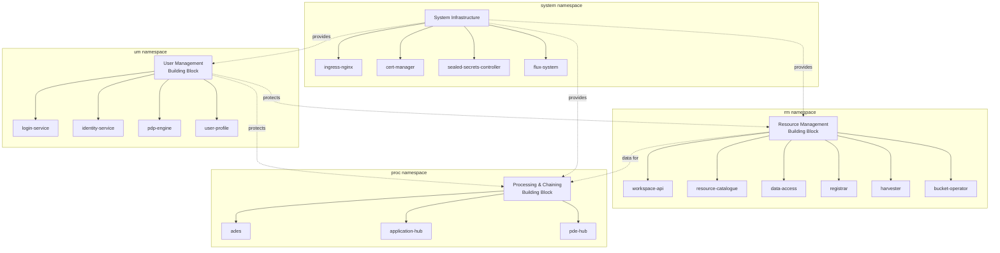
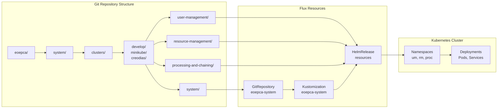
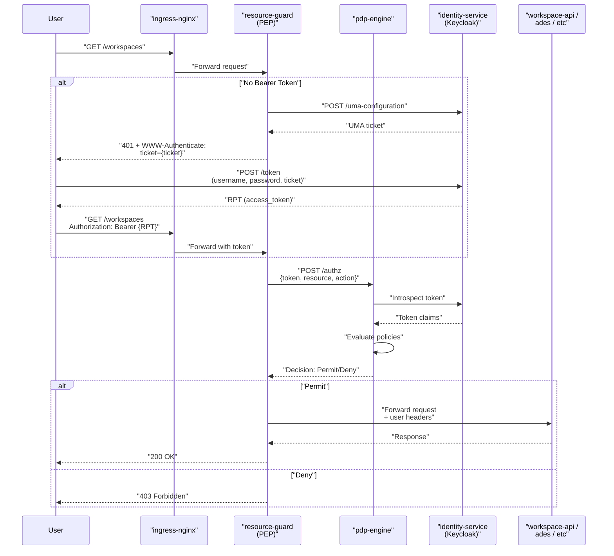
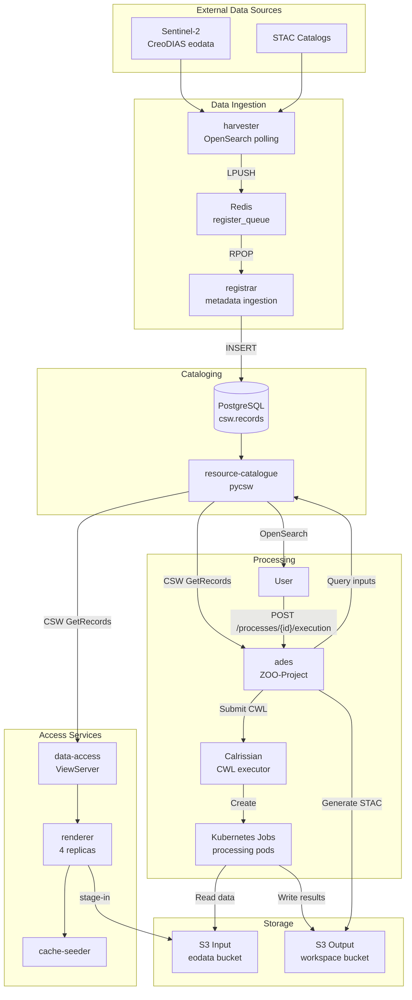
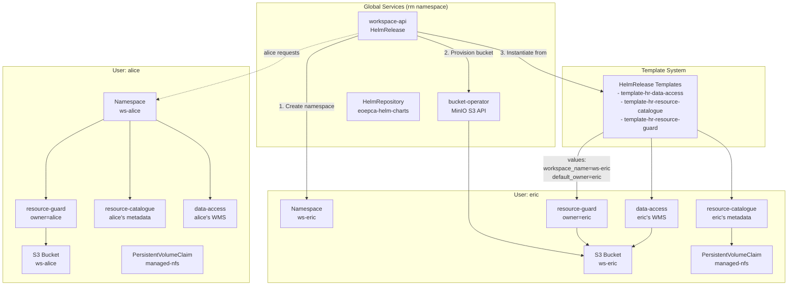
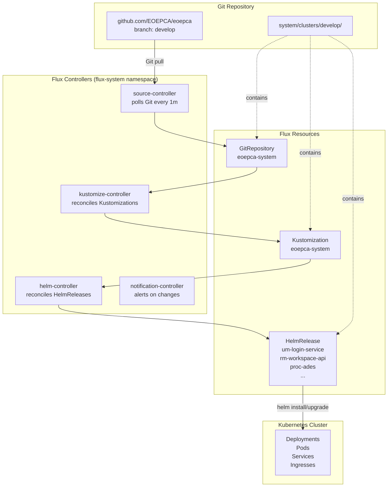
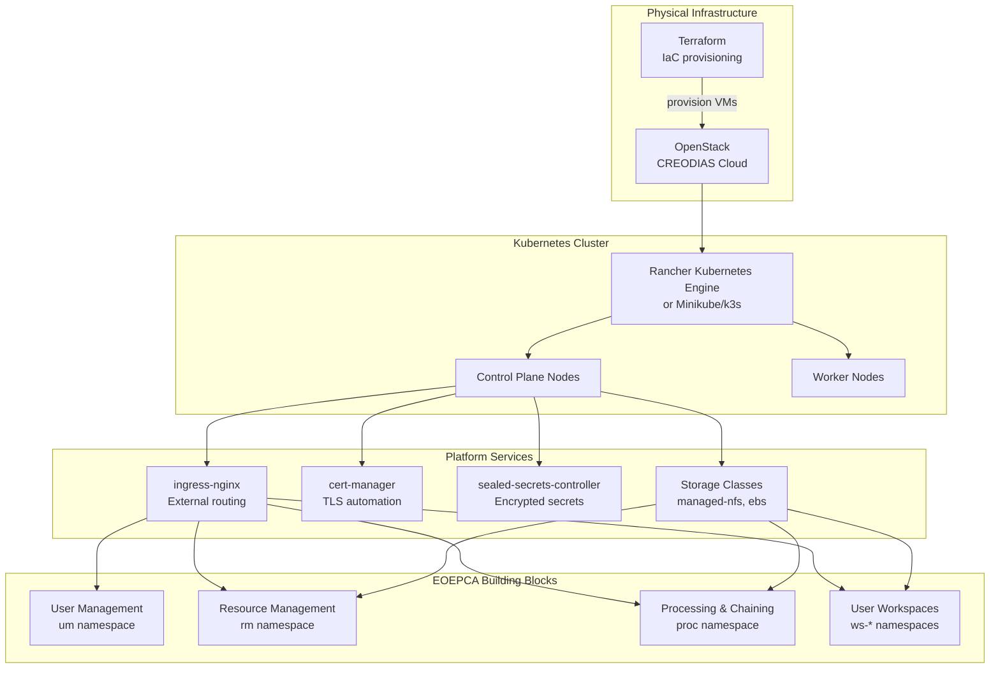

# System Architecture

<details>
<summary>Relevant source files</summary>

The following files were used as context for generating this wiki page:

- [README.md](README.md)
- [minikube/README.md](minikube/README.md)
- [release-notes/release-0.3.md](release-notes/release-0.3.md)
- [system/clusters/README.md](system/clusters/README.md)

</details>


## Purpose and Scope

This document provides a high-level architectural overview of the EOEPCA system, describing its major components, their interactions, and the organizational principles that govern the system design. The architecture is presented from multiple perspectives: logical building blocks, deployment structure, and runtime interactions.

For detailed deployment procedures, see [Deployment Guide](#2.1). For specific building block implementations, refer to [Building Blocks Overview](#3.1), [User Management and Identity](#4), [Resource Management](#5), and [Processing and Chaining](#6). Infrastructure provisioning details are covered in [Infrastructure Provisioning](#2.2) and [Terraform Infrastructure as Code](#8.2).

## Architectural Principles

The EOEPCA system is designed according to the following core principles:

### Standards-Based Architecture

The platform implements Open Geospatial Consortium (OGC) standards for interoperability:
- **OGC API Processes** - Application execution interfaces
- **OGC CSW 3.0** - Catalogue services
- **OGC WMS/WMTS/WCS** - Data visualization and access
- **OpenSearch** - Data discovery with EO, Geo, and Time extensions
- **STAC** - Metadata for stage-in/stage-out workflows

Sources: [README.md:163-170]()

### GitOps-Driven Deployment

All system components are deployed and managed using Flux CD, implementing a GitOps approach where the Git repository serves as the single source of truth for cluster state. This ensures version-controlled, auditable, and reproducible deployments.

Sources: [system/clusters/README.md:1-95](), [README.md:92-93]()

### Multi-Tenant Isolation

User workspaces are provisioned as isolated Kubernetes namespaces with dedicated S3 buckets, catalogues, and policy enforcement points, enabling secure multi-tenancy while maintaining resource sharing capabilities.

Sources: Diagram 4 from high-level overview

### Microservices on Kubernetes

The system is composed of loosely-coupled microservices deployed as containers orchestrated by Kubernetes, supporting both cloud (OpenStack via RKE) and local (Minikube/k3s) deployments.

Sources: [README.md:70](), [minikube/README.md:1-52]()

## System Decomposition

### Building Block Domains

The EOEPCA system is organized into three primary functional domains, each deployed in a dedicated Kubernetes namespace:



**Domain Architecture by Namespace**

| Namespace | Domain | Primary Services | Configuration Path |
|-----------|--------|-----------------|-------------------|
| `um` | User Management | `login-service`, `identity-service`, `pdp-engine`, `user-profile` | `system/clusters/{target}/user-management/` |
| `rm` | Resource Management | `workspace-api`, `resource-catalogue`, `data-access`, `registrar`, `harvester` | `system/clusters/{target}/resource-management/` |
| `proc` | Processing & Chaining | `ades`, `application-hub`, `pde-hub` | `system/clusters/{target}/processing-and-chaining/` |
| `flux-system` | GitOps Control Plane | `source-controller`, `kustomize-controller`, `helm-controller` | `system/clusters/{target}/system/flux-system/` |
| `ingress-nginx` | External Access | `ingress-nginx-controller` | `system/clusters/{target}/system/ingress-nginx/` |
| `cert-manager` | TLS Certificates | `cert-manager`, `cert-manager-webhook` | `system/clusters/{target}/system/cert-manager/` |

Sources: [README.md:128-160](), [release-notes/release-0.3.md:97-319](), Diagram 1 and Diagram 5 from high-level overview

### Directory Structure and GitOps Mapping

The repository structure directly maps to the deployment architecture:



**Key Directory Paths:**

- `system/clusters/{target}/` - Deployment configuration for a specific cluster
- `system/clusters/{target}/system/` - Flux bootstrap and system infrastructure
- `system/clusters/{target}/user-management/` - HelmRelease manifests for Identity/Access services
- `system/clusters/{target}/resource-management/` - HelmRelease manifests for Catalogue/Data services
- `system/clusters/{target}/processing-and-chaining/` - HelmRelease manifests for ADES/Application Hub

Sources: [system/clusters/README.md:45-50](), [system/clusters/README.md:81-85]()

## Component Interaction Architecture

### Authentication and Authorization Flow

The system implements User-Managed Access (UMA) 2.0 for fine-grained authorization:



**Key Components:**

- `resource-guard` - PEP implementation protecting HTTP endpoints
- `pdp-engine` - Policy Decision Point evaluating access policies
- `identity-service` - Keycloak-based IdP providing UMA and OIDC
- `login-service` - Legacy Gluu-based authentication (deprecated in v1.4)

Sources: [README.md:150-159](), Diagram 2 from high-level overview, [release-notes/release-0.3.md:17-29]()

### Data Access and Processing Pipeline



**Key Integration Points:**

- `harvester` pulls metadata from OpenSearch endpoints and enqueues to Redis
- `registrar` consumes queue and writes ISO 19115 records to PostgreSQL
- `pycsw` provides OGC CSW and OpenSearch interfaces over PostgreSQL
- `ades` orchestrates CWL workflows using Calrissian on Kubernetes
- Stage-in/out uses S3 for both input data (`eodata`) and output workspaces

Sources: [README.md:132-149](), [release-notes/release-0.3.md:31-80](), Diagram 3 from high-level overview

## Workspace Multi-Tenancy Architecture

Each user workspace is provisioned as an isolated environment with dedicated resources:



**Workspace Provisioning Sequence:**

1. User requests workspace via `workspace-api`
2. API creates Kubernetes namespace `ws-{username}`
3. `bucket-operator` provisions S3 bucket `ws-{username}`
4. API instantiates HelmRelease templates with user-specific values
5. Templates deploy `resource-guard`, `resource-catalogue`, `data-access` in namespace
6. PEP (`resource-guard`) enforces ownership policies based on `default_owner`

Sources: [README.md:148](), Diagram 4 from high-level overview

## Deployment Architecture

### Flux CD GitOps Workflow



**GitOps Deployment Flow:**

1. Developer commits changes to `system/clusters/{target}/` in Git
2. `source-controller` detects changes via polling (interval: 1m)
3. `kustomize-controller` reconciles `Kustomization` resources
4. `helm-controller` reconciles `HelmRelease` resources
5. Helm charts are installed/upgraded in target namespaces
6. Kubernetes applies Deployment/StatefulSet/Job resources

**Flux Bootstrap Command:**

The deployment is initialized using `deployCluster.sh` which executes:

```bash
flux bootstrap github \
  --owner=EOEPCA \
  --repository=eoepca \
  --branch=develop \
  --path=system/clusters/develop/system \
  --personal=false
```

Sources: [system/clusters/README.md:51-77](), Diagram 5 from high-level overview

### Infrastructure Layers



**Deployment Targets:**

| Target | Infrastructure | Kubernetes | Configuration Path |
|--------|---------------|------------|-------------------|
| Cloud (Production) | OpenStack CREODIAS | RKE 1.24+ | `system/clusters/creodias/` |
| Development | OpenStack CREODIAS | RKE 1.24+ | `system/clusters/develop/` |
| Local Testing | Local machine | Minikube 1.25+ | `system/clusters/minikube/` |
| Local Testing (Alternative) | Local machine | k3s 1.24+ | `system/clusters/minikube/` |

**DNS and Ingress Pattern:**

Services are exposed using `nip.io` dynamic DNS:
- Pattern: `{service}.{ip-with-dashes}.nip.io`
- Example: `workspace-api.192-168-49-2.nip.io` (Minikube)
- Example: `workspace-api.185-52-193-87.nip.io` (CREODIAS)

This avoids the need for public DNS configuration during development/testing.

Sources: [README.md:88-96](), [README.md:100-112](), [minikube/README.md:1-52](), Diagram 5 from high-level overview

## Key Configuration Conventions

### HelmRelease Naming Convention

HelmReleases follow a consistent naming pattern that maps to service names:

| HelmRelease Name | Namespace | Service Name | Configuration File |
|-----------------|-----------|--------------|-------------------|
| `um-login-service` | `um` | `login-service` | `user-management/um-login-service.yaml` |
| `um-identity-service` | `um` | `identity-service` | `user-management/um-identity-service.yaml` |
| `um-pdp-engine` | `um` | `pdp-engine` | `user-management/um-pdp-engine.yaml` |
| `rm-workspace-api` | `rm` | `workspace-api` | `resource-management/rm-workspace-api.yaml` |
| `rm-resource-catalogue` | `rm` | `resource-catalogue` | `resource-management/rm-resource-catalogue.yaml` |
| `rm-data-access` | `rm` | `data-access` | `resource-management/rm-data-access.yaml` |
| `proc-ades` | `proc` | `ades` | `processing-and-chaining/proc-ades.yaml` |
| `proc-application-hub` | `proc` | `application-hub` | `processing-and-chaining/proc-application-hub.yaml` |

### Secret Management

Sensitive configuration is managed using SealedSecrets:
- Encrypted secrets are stored in Git as `SealedSecret` resources
- `sealed-secrets-controller` decrypts them into native `Secret` resources
- Pattern: `{service}-sealedsecret.yaml` files in component directories
- Created using: `kubeseal --format yaml < secret.yaml > sealedsecret.yaml`

For details on secret management, see [SealedSecrets](#10.1).

Sources: [system/clusters/README.md:46-50](), [README.md:100-112]()

## Summary

The EOEPCA system architecture implements a modular, standards-based platform for Earth Observation data exploitation. The architecture is characterized by:

1. **Clear Domain Separation** - Three building blocks (User Management, Resource Management, Processing & Chaining) deployed in isolated namespaces
2. **GitOps-Driven Operations** - Flux CD continuously reconciles cluster state with Git repository
3. **Multi-Tenant Isolation** - Workspace API provisions per-user namespaces with dedicated resources
4. **Standards Compliance** - OGC APIs for interoperability across data access, cataloging, and processing
5. **Infrastructure Flexibility** - Supports cloud (OpenStack/RKE) and local (Minikube/k3s) deployments

For specific component details, refer to the child pages under [Building Blocks Overview](#3.1) and the domain-specific sections ([User Management](#4), [Resource Management](#5), [Processing and Chaining](#6)).

Sources: [README.md:58-68](), [README.md:128-160](), [system/clusters/README.md:1-95]()