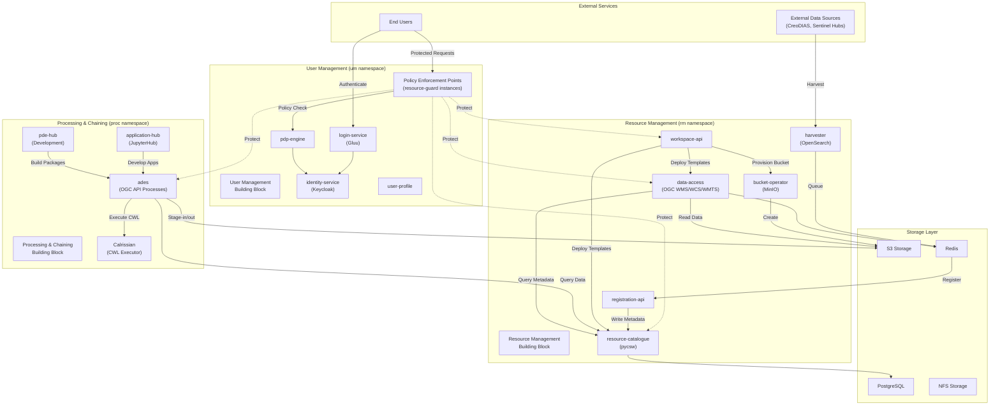
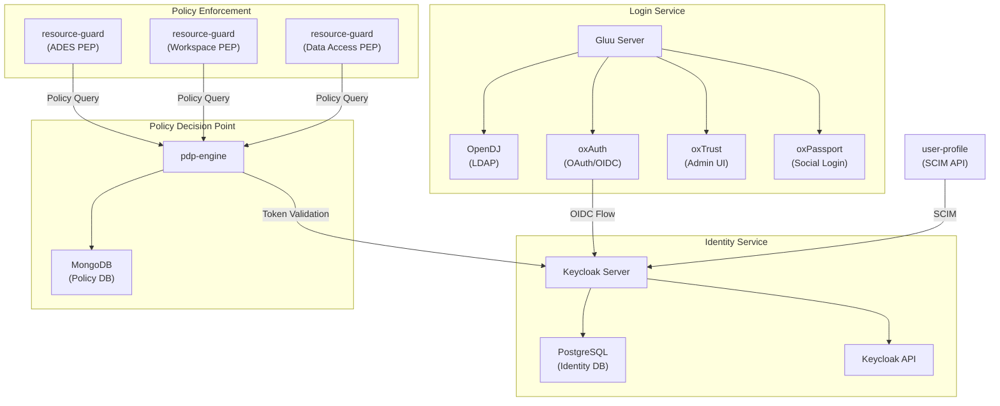
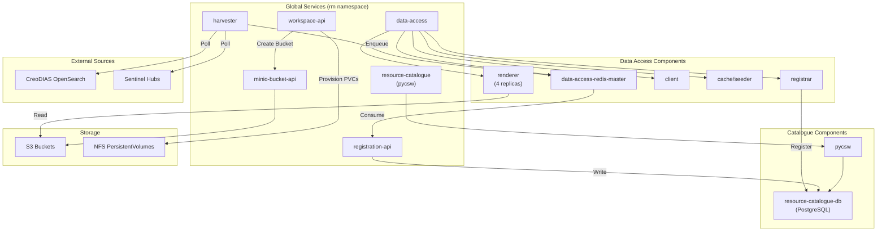
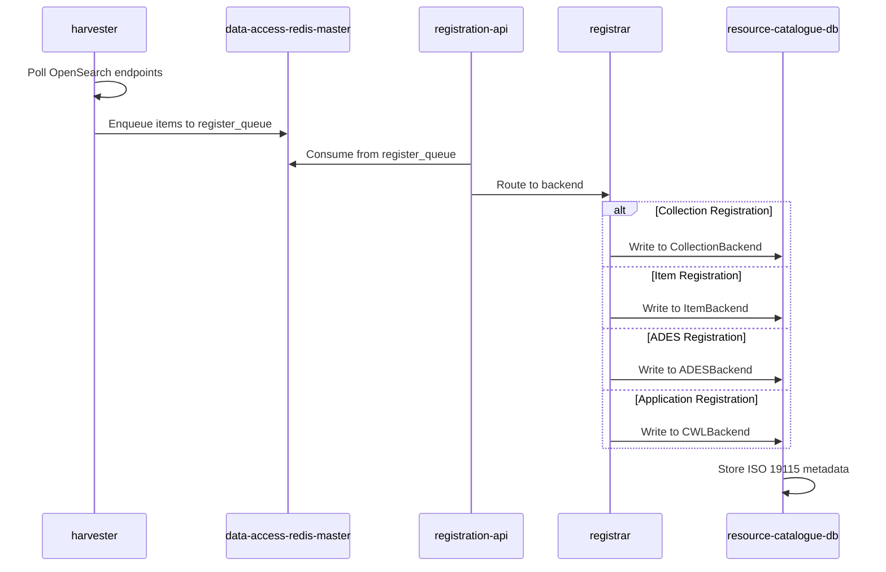
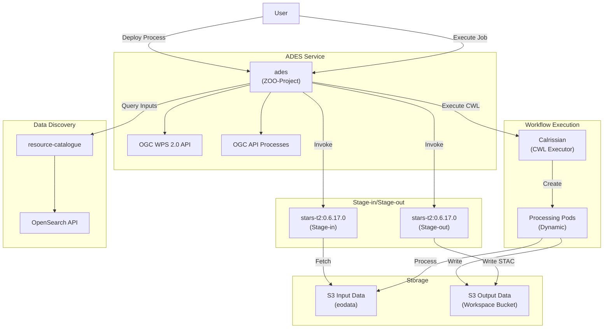
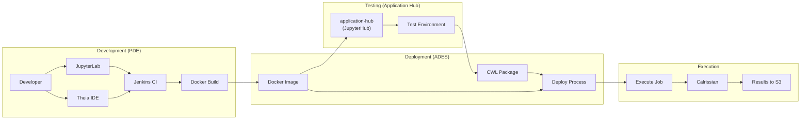
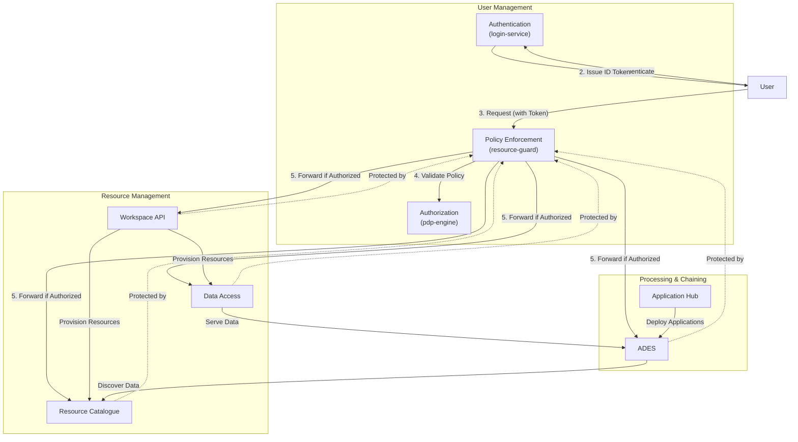
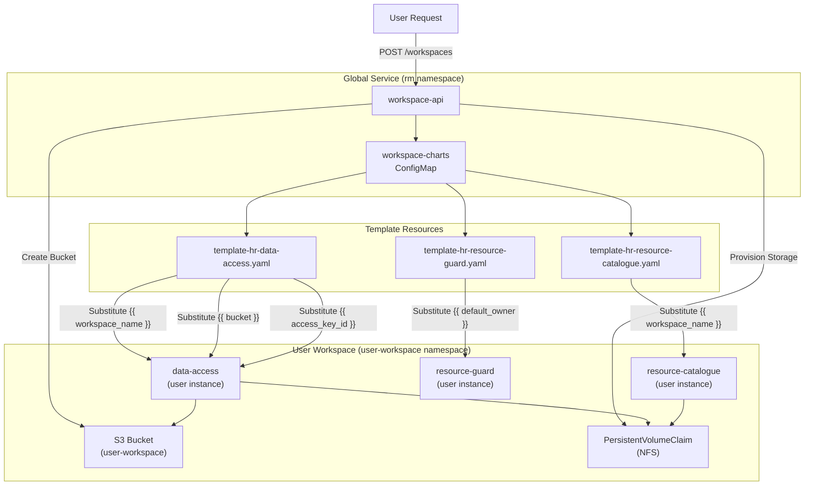

# Building Blocks Overview

<details>
<summary>Relevant source files</summary>

The following files were used as context for generating this wiki page:

- [release-notes/release-0.3.md](release-notes/release-0.3.md)
- [system/clusters/creodias/resource-management/hr-data-access.yaml](system/clusters/creodias/resource-management/hr-data-access.yaml)
- [system/clusters/creodias/resource-management/hr-registration-api.yaml](system/clusters/creodias/resource-management/hr-registration-api.yaml)
- [system/clusters/creodias/resource-management/hr-resource-catalogue.yaml](system/clusters/creodias/resource-management/hr-resource-catalogue.yaml)
- [system/clusters/creodias/resource-management/hr-workspace-api.yaml](system/clusters/creodias/resource-management/hr-workspace-api.yaml)
- [system/clusters/creodias/resource-management/rm-workspace-charts/template-hr-data-access.yaml](system/clusters/creodias/resource-management/rm-workspace-charts/template-hr-data-access.yaml)
- [system/clusters/creodias/resource-management/rm-workspace-charts/template-hr-resource-catalogue.yaml](system/clusters/creodias/resource-management/rm-workspace-charts/template-hr-resource-catalogue.yaml)

</details>


## Purpose and Scope

This document provides a detailed technical explanation of the three primary building blocks that comprise the EOEPCA platform architecture, their constituent components, and their integration patterns. The building blocks are:

1. **User Management** - Authentication, authorization, and identity services
2. **Resource Management** - Data cataloging, access services, and workspace provisioning
3. **Processing & Chaining** - Application deployment, execution, and development environments

For information about the GitOps deployment model and infrastructure provisioning, see [GitOps and Flux CD](#3.2). For details on specific building block implementations, see [User Management and Identity](#4), [Resource Management](#5), and [Processing and Chaining](#6).

---

## Building Block Architecture

The EOEPCA system is organized into three loosely-coupled but highly-integrated building blocks, each deployed to dedicated Kubernetes namespaces and managed through GitOps.

### High-Level Building Block Structure



**Sources:** [system/clusters/creodias/resource-management/hr-data-access.yaml](), [system/clusters/creodias/resource-management/hr-workspace-api.yaml](), [system/clusters/creodias/resource-management/hr-resource-catalogue.yaml](), [release-notes/release-0.3.md:97-264]()

---

## Building Block 1: User Management

The User Management building block provides authentication, authorization, and identity services across the entire platform. It implements a UMA 2.0 (User-Managed Access) authorization pattern with fine-grained policy-based access control.

### User Management Components

| Component | Service Name | Purpose | Key Technologies |
|-----------|-------------|---------|------------------|
| Login Service | `login-service` | Primary authentication provider | Gluu Server (OpenDJ, oxAuth, oxTrust, oxPassport) |
| Identity Service | `identity-service` | Identity provider and token issuer | Keycloak, PostgreSQL |
| Policy Decision Point | `pdp-engine` | Central policy evaluation engine | MongoDB |
| User Profile | `user-profile` | User attribute management | SCIM 2.0 |
| Policy Enforcement Points | `resource-guard` instances | Service-level authorization enforcement | Multiple instances per protected service |

### User Management Component Diagram



**Sources:** [release-notes/release-0.3.md:102-218]()

### Key Integration Points

The User Management building block provides:

- **OIDC Identity Provider**: Keycloak serves as the primary identity provider at `identity-service` endpoint
- **UMA Authorization Server**: Issues UMA tickets and RPT tokens for resource access
- **Policy Management**: Central policy repository in `pdp-engine` accessed by all PEPs
- **Resource Protection**: Each protected service deploys its own `resource-guard` (PEP) instance

For details on the UMA authentication flow, see [UMA Authentication Flow](#4.4). For PEP/PDP implementation details, see [Policy Enforcement (PEP/PDP)](#4.3).

---

## Building Block 2: Resource Management

The Resource Management building block handles data cataloging, visualization, access services, and user workspace provisioning. It manages both global platform resources and per-user isolated workspaces.

### Resource Management Components

| Component | Service Name | Purpose | Key Technologies |
|-----------|-------------|---------|------------------|
| Data Access | `data-access` | OGC-compliant data visualization and access | EOX ViewServer, OGC WMS/WCS/WMTS |
| Resource Catalogue | `resource-catalogue` | Metadata catalog and discovery | pycsw, OGC CSW, OpenSearch |
| Workspace API | `workspace-api` | Multi-tenant workspace orchestration | Kubernetes operator pattern |
| Registration API | `registration-api` | Data and metadata registration endpoint | Redis queue consumer |
| Harvester | `harvester` | External data source ingestion | OpenSearch clients |
| Bucket Operator | `bucket-operator` (via MinIO) | S3 bucket provisioning | MinIO API |

### Resource Management Architecture



**Sources:** [system/clusters/creodias/resource-management/hr-data-access.yaml:1-1144](), [system/clusters/creodias/resource-management/hr-resource-catalogue.yaml:1-82](), [system/clusters/creodias/resource-management/hr-workspace-api.yaml:1-50](), [system/clusters/creodias/resource-management/hr-registration-api.yaml:1-37]()

### Data Access Service Details

The Data Access service is deployed as `data-access` in the `rm` namespace and provides OGC-compliant data visualization. Configuration is defined in [system/clusters/creodias/resource-management/hr-data-access.yaml:1-1144]().

**Key Configuration:**
- **Renderer**: 4 replicas for parallel processing ([hr-data-access.yaml:865-877]())
- **Ingress**: Exposed at `data-access.develop.eoepca.org` ([hr-data-access.yaml:42-47]())
- **S3 Data Source**: CloudFerro eodata at `http://data.cloudferro.com` ([hr-data-access.yaml:49-57]())
- **Cache Storage**: S3 cache bucket at `https://cf2.cloudferro.com:8080` ([hr-data-access.yaml:58-64]())

**Supported Collections:**
- Sentinel-2 L1C and L2A with multiple band configurations ([hr-data-access.yaml:218-252]())
- Landsat-8 L1TP and L1GT ([hr-data-access.yaml:253-278]())
- Sentinel-1 GRD and SLC ([hr-data-access.yaml:279-286]())
- Sentinel-3 OL_2_LFR ([hr-data-access.yaml:287-290]())

### Resource Catalogue Details

The Resource Catalogue is deployed as `resource-catalogue` using pycsw and provides OGC CSW 3.0/2.0.2 interfaces. Configuration is in [system/clusters/creodias/resource-management/hr-resource-catalogue.yaml:1-82]().

**Key Configuration:**
- **Database**: PostgreSQL with 5Gi volume and tuned performance parameters ([hr-resource-catalogue.yaml:19-31]())
- **Server URL**: `https://resource-catalogue.develop.eoepca.org/` ([hr-resource-catalogue.yaml:45]())
- **Transactions**: Enabled with allowed IPs set to "*" ([hr-resource-catalogue.yaml:47-48]())
- **INSPIRE**: Enabled with multi-language support ([hr-resource-catalogue.yaml:72-81]())

### Workspace API Details

The Workspace API orchestrates multi-tenant workspace provisioning. Configuration is in [system/clusters/creodias/resource-management/hr-workspace-api.yaml:1-50]().

**Key Configuration:**
- **Namespace Prefix**: `develop-user` for workspace namespaces ([hr-workspace-api.yaml:35]())
- **S3 Endpoint**: MinIO at `https://minio.develop.eoepca.org` ([hr-workspace-api.yaml:39]())
- **Harbor Registry**: `https://harbor.develop.eoepca.org` ([hr-workspace-api.yaml:41]())
- **Bucket API**: `http://minio-bucket-api:8080/bucket` ([hr-workspace-api.yaml:47]())
- **PEP Integration**: `http://workspace-api-pep:5576/resources` ([hr-workspace-api.yaml:48]())
- **Auto-Protection**: Enabled for automatic resource registration ([hr-workspace-api.yaml:49]())

The Workspace API uses HelmRelease templates to provision per-user instances of services. See [Multi-Tenant Workspaces](#5.5) for details.

### Registration Pipeline

The registration pipeline handles ingestion of metadata from external sources:



**Registrar Routes** (configured in [hr-data-access.yaml:894-947]()):
- `collections`: STAC Collection route to `CollectionBackend`
- `ades`: JSON route for ADES service registration to `ADESBackend`
- `application`: JSON route for CWL application registration to `CWLBackend`
- `catalogue`: JSON route for catalogue federation to `CatalogueBackend`
- `json`/`xml`: Generic registration routes to `JSONBackend`/`XMLBackend`

**Sources:** [system/clusters/creodias/resource-management/hr-data-access.yaml:878-947](), [system/clusters/creodias/resource-management/hr-registration-api.yaml:34-37]()

---

## Building Block 3: Processing & Chaining

The Processing & Chaining building block provides application deployment, workflow execution, and development environments for Earth Observation processing.

### Processing & Chaining Components

| Component | Service Name | Purpose | Key Technologies |
|-----------|-------------|---------|------------------|
| ADES | `ades` | Application deployment and execution service | OGC API Processes, ZOO-Project |
| Application Hub | `application-hub` | Interactive development environment | JupyterHub, OAuth2 |
| PDE Hub | `pde-hub` | Processor development tools | Theia IDE, Jenkins, Docker-in-Docker |
| CWL Executor | Calrissian (invoked by ADES) | Kubernetes-native workflow execution | Calrissian, CWL |

### ADES Integration Architecture



**Sources:** [release-notes/release-0.3.md:220-249]()

### ADES Capabilities

The ADES provides the following capabilities (from [release-notes/release-0.3.md:30-41]()):

1. **OGC Interfaces**: Implements OGC WPS 2.0 and OGC API Processes
2. **Process Management**:
   - List available processes
   - Deploy process (Docker container with CWL application package)
   - Execute process (create job)
   - Get job status
   - Undeploy process
3. **Data Integration**:
   - Stage-in via OpenSearch catalogue reference
   - Stage-out to S3 bucket with STAC manifests
4. **Workflow Execution**: Calrissian CWL engine with native Kubernetes integration
5. **User Context**: Dedicated user 'context' within ADES service

### Application Development Workflow



**Sources:** [release-notes/release-0.3.md:42-49](), [release-notes/release-0.3.md:252-263]()

---

## Building Block Integration Patterns

The three building blocks integrate through well-defined interfaces and shared infrastructure components.

### Cross-Building-Block Integration



### Key Integration Mechanisms

**Authentication Integration:**
- All services validate tokens against `identity-service` (Keycloak)
- UMA flow issues RPT tokens for resource access
- See [UMA Authentication Flow](#4.4) for sequence details

**Authorization Integration:**
- Each protected service deploys a `resource-guard` (PEP) sidecar
- PEPs query `pdp-engine` for policy decisions
- Resources auto-registered with protection policies (when `autoProtectionEnabled: "True"` in [hr-workspace-api.yaml:49]())

**Data Integration:**
- ADES queries `resource-catalogue` via OpenSearch API
- Data Access reads from same S3 buckets that ADES writes to
- Workspace API provisions isolated catalogue and data access instances per user

**Metadata Integration:**
- All components register metadata to `resource-catalogue` via `registration-api`
- Registrar routes metadata to appropriate backends (Item, Collection, ADES, CWL)
- pycsw stores metadata in PostgreSQL using ISO 19115 format

**Sources:** [system/clusters/creodias/resource-management/hr-workspace-api.yaml:44-49](), [system/clusters/creodias/resource-management/hr-data-access.yaml:878-947]()

---

## Workspace Template System

The Resource Management building block implements a template-based system for provisioning per-user workspace instances. This enables multi-tenancy with isolated resources.

### Template Instantiation



**Template Variables** (used in [template-hr-data-access.yaml]() and [template-hr-resource-catalogue.yaml]()):
- `{{ workspace_name }}`: User workspace identifier
- `{{ bucket }}`: S3 bucket name
- `{{ access_key_id }}`: S3 access key
- `{{ secret_access_key }}`: S3 secret key
- `{{ default_owner }}`: User identity for policy enforcement

**Template Configuration Examples:**

From [system/clusters/creodias/resource-management/rm-workspace-charts/template-hr-data-access.yaml:28-44]():
```yaml
ingress:
  tls:
    - hosts:
        - data-access.{{ workspace_name }}.develop.eoepca.org
storage:
  data:
    data:
      type: "S3"
      endpoint_url: https://minio.develop.eoepca.org
      access_key_id: {{ access_key_id }}
      secret_access_key: {{ secret_access_key }}
      bucket: {{ bucket }}
```

From [system/clusters/creodias/resource-management/rm-workspace-charts/template-hr-resource-catalogue.yaml:17-33]():
```yaml
global:
  namespace: "{{ workspace_name }}"
pycsw:
  config:
    server:
      url: "https://resource-catalogue.{{ workspace_name }}.develop.eoepca.org"
    metadata:
      identification_title: Resource Catalogue - {{ workspace_name }}
```

**Sources:** [system/clusters/creodias/resource-management/rm-workspace-charts/template-hr-data-access.yaml:1-269](), [system/clusters/creodias/resource-management/rm-workspace-charts/template-hr-resource-catalogue.yaml:1-68](), [system/clusters/creodias/resource-management/hr-workspace-api.yaml:46]()

---

## Storage Architecture Integration

All three building blocks integrate with a common storage layer:

| Storage Type | Purpose | Used By | Configuration |
|-------------|---------|---------|---------------|
| S3 (CloudFerro) | Input EO data | Data Access (read), ADES (stage-in) | `http://data.cloudferro.com` |
| S3 (MinIO) | User workspaces, outputs | Workspace API, ADES (stage-out), Data Access (cache) | `https://minio.develop.eoepca.org` |
| PostgreSQL | Catalogue metadata | Resource Catalogue, Identity Service | Per-service databases |
| Redis | Registration queues, caching | Data Access, Registration API | Per-service instances |
| NFS | Persistent volumes | Data Access DB, Resource Catalogue DB | `managed-nfs-storage` StorageClass |

**Data Access Storage** ([hr-data-access.yaml:49-64]()):
- Input data from CloudFerro: `http://data.cloudferro.com` (read-only)
- Cache bucket: `https://cf2.cloudferro.com:8080/cache-bucket` (read-write)

**Workspace Storage** ([hr-workspace-api.yaml:39](), [template-hr-data-access.yaml:39-44]()):
- Per-user buckets provisioned via MinIO API
- Workspace-specific NFS PVCs with `managed-nfs-storage` StorageClass ([template-hr-data-access.yaml:220-224]())

**ADES Storage:**
- Stage-in from CloudFerro eodata or STAC catalogs
- Stage-out to workspace S3 buckets
- STAC manifests describe inputs and outputs

For detailed storage architecture, see [Storage and Persistence](#7).

**Sources:** [system/clusters/creodias/resource-management/hr-data-access.yaml:49-64](), [system/clusters/creodias/resource-management/hr-workspace-api.yaml:38-39](), [system/clusters/creodias/resource-management/rm-workspace-charts/template-hr-data-access.yaml:33-44](), [system/clusters/creodias/resource-management/rm-workspace-charts/template-hr-data-access.yaml:219-228]()

---

## Deployment and Namespace Organization

The building blocks are deployed to separate Kubernetes namespaces, each managed by GitOps Kustomization resources:

| Building Block | Namespace | GitOps Kustomization | HelmReleases |
|---------------|-----------|---------------------|-------------|
| User Management | `um` | `./user-management` | `login-service`, `identity-service`, `pdp-engine`, `user-profile` |
| Resource Management | `rm` | `./resource-management` | `data-access`, `resource-catalogue`, `workspace-api`, `registration-api` |
| Processing & Chaining | `proc` | `./processing-and-chaining` | `ades`, `application-hub`, `pde-hub` |
| System Infrastructure | various | `./system` | `ingress-nginx`, `cert-manager`, `sealed-secrets` |

Each HelmRelease references charts from the `eoepca` HelmRepository in the `common` namespace. For example:

From [system/clusters/creodias/resource-management/hr-workspace-api.yaml:8-15]():
```yaml
chart:
  spec:
    chart: rm-workspace-api
    version: "1.4.0"
    sourceRef:
      kind: HelmRepository
      name: eoepca
      namespace: common
```

For complete GitOps deployment details, see [GitOps and Flux CD](#3.2).

**Sources:** [system/clusters/creodias/resource-management/hr-workspace-api.yaml:8-15](), [system/clusters/creodias/resource-management/hr-data-access.yaml:8-15](), [system/clusters/creodias/resource-management/hr-resource-catalogue.yaml:8-15]()

---

## Summary of Building Block Interactions

The three building blocks work together to provide a complete Earth Observation platform:

1. **User Management** provides identity and authorization services that protect all other services through PEP instances
2. **Resource Management** provisions workspaces, catalogs data, and provides visualization services
3. **Processing & Chaining** executes user applications on data discovered through Resource Management and protected by User Management

All building blocks:
- Share common storage infrastructure (S3, PostgreSQL, Redis, NFS)
- Are deployed via GitOps using Flux CD HelmReleases
- Follow OGC standards for interoperability (CSW, WMS, WCS, WMTS, WPS, API Processes, OpenSearch)
- Support multi-tenancy through workspace isolation
- Integrate through well-defined APIs and message queues

For specific implementation details, see the dedicated pages for each building block: [User Management and Identity](#4), [Resource Management](#5), and [Processing and Chaining](#6).