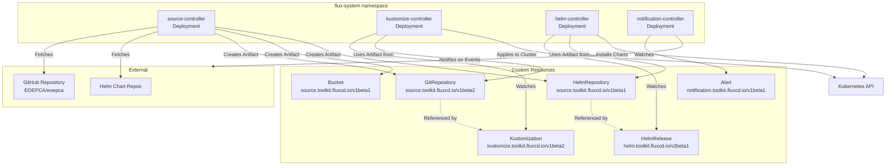
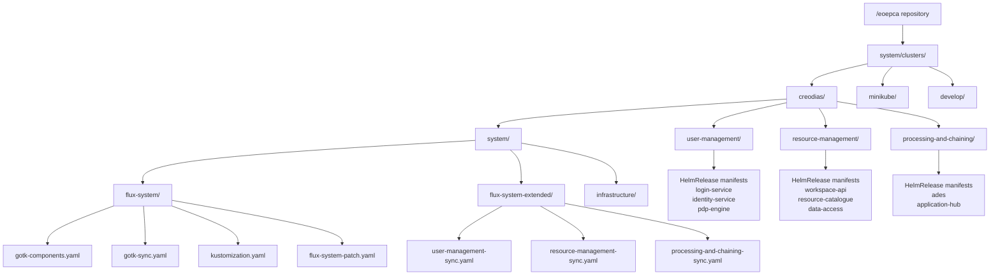
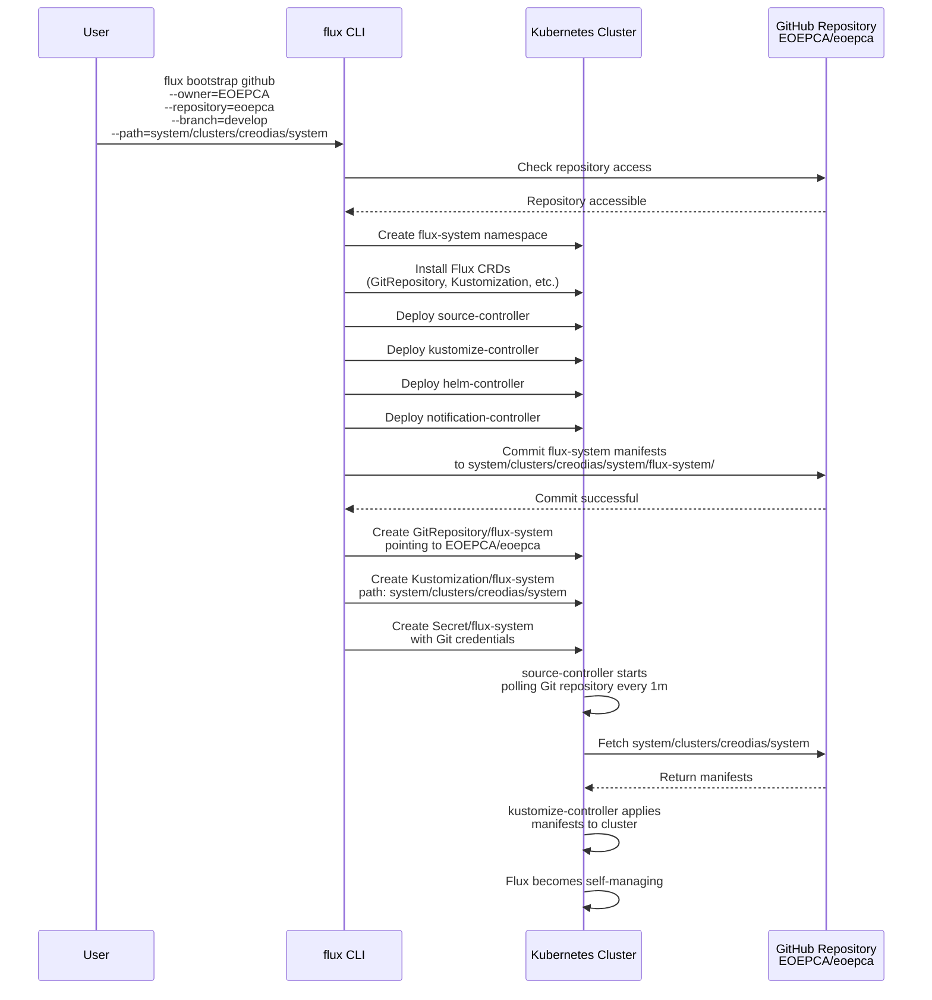
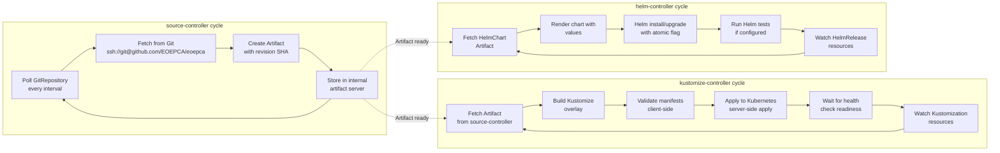
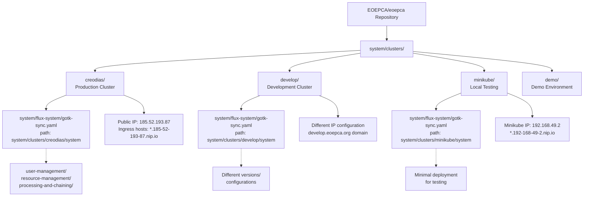

# GitOps and Flux CD

<details>
<summary>Relevant source files</summary>

The following files were used as context for generating this wiki page:

- [README.md](README.md)
- [minikube/README.md](minikube/README.md)
- [system/clusters/README.md](system/clusters/README.md)
- [system/clusters/creodias/system/flux-system-extended/processing-and-chaining-sync.yaml](system/clusters/creodias/system/flux-system-extended/processing-and-chaining-sync.yaml)
- [system/clusters/creodias/system/flux-system-extended/resource-management-sync.yaml](system/clusters/creodias/system/flux-system-extended/resource-management-sync.yaml)
- [system/clusters/creodias/system/flux-system-extended/user-management-sync.yaml](system/clusters/creodias/system/flux-system-extended/user-management-sync.yaml)
- [system/clusters/creodias/system/flux-system/flux-system-patch.yaml](system/clusters/creodias/system/flux-system/flux-system-patch.yaml)
- [system/clusters/creodias/system/flux-system/gotk-components.yaml](system/clusters/creodias/system/flux-system/gotk-components.yaml)
- [system/clusters/creodias/system/flux-system/gotk-sync.yaml](system/clusters/creodias/system/flux-system/gotk-sync.yaml)
- [system/clusters/creodias/system/flux-system/kustomization.yaml](system/clusters/creodias/system/flux-system/kustomization.yaml)

</details>


## Purpose and Scope

This document explains the GitOps deployment model used by EOEPCA and the Flux CD continuous delivery system that implements it. It covers the Flux CD architecture, Custom Resource Definitions (CRDs), repository structure, bootstrap process, and synchronization mechanisms. For initial deployment instructions, see [Deployment Guide](#2.1). For infrastructure provisioning before Flux deployment, see [Infrastructure Provisioning](#2.2). For monitoring and troubleshooting Flux operations, see [Monitoring and Troubleshooting](#11.2).

## GitOps Fundamentals

EOEPCA adopts a GitOps approach where the Git repository at `https://github.com/EOEPCA/eoepca` serves as the single source of truth for the cluster's desired state. All system configuration, Kubernetes manifests, and Helm chart values are stored in Git. Flux CD continuously monitors this repository and automatically reconciles the cluster state to match the declared configuration.

This approach provides:
- **Version Control**: All configuration changes are tracked in Git with full audit history
- **Declarative Infrastructure**: Cluster state is declared as code rather than imperatively applied
- **Automated Reconciliation**: Flux automatically applies changes and self-heals drift
- **Rollback Capability**: Any commit in Git history represents a deployable state
- **Multi-Cluster Support**: Different directories represent different cluster configurations

Sources: [README.md:79-112](), [system/clusters/README.md:1-6]()

## Flux CD Architecture

### Core Components

Flux CD v0.24.0 is deployed to the `flux-system` namespace and consists of four controller deployments that work together to implement GitOps synchronization.

**Flux CD Component Architecture**



Sources: [system/clusters/creodias/system/flux-system/gotk-components.yaml:1-12](), [system/clusters/README.md:3]()

### Controller Responsibilities

| Controller | Purpose | Key CRDs Managed |
|------------|---------|------------------|
| **source-controller** | Fetches artifacts from Git repositories, Helm repositories, and S3 buckets. Exposes artifacts via HTTP to other controllers. | `GitRepository`, `HelmRepository`, `HelmChart`, `Bucket` |
| **kustomize-controller** | Applies Kustomize overlays to the cluster. Watches `Kustomization` resources and fetches source artifacts from source-controller. | `Kustomization` |
| **helm-controller** | Performs Helm releases. Watches `HelmRelease` resources and installs/upgrades Helm charts using artifacts from source-controller. | `HelmRelease` |
| **notification-controller** | Handles events and notifications. Can send alerts to external systems and manage Git commit status updates. | `Alert`, `Provider`, `Receiver` |

Sources: [system/clusters/creodias/system/flux-system/gotk-components.yaml:2-4]()

### Custom Resource Definitions

Flux installs multiple CRDs that define the declarative API for GitOps operations. The primary CRDs are:

**GitRepository CRD** (`source.toolkit.fluxcd.io/v1beta2`): Defines a Git repository source. Includes fields for `url`, `ref` (branch/tag/commit), `interval` for polling, and `secretRef` for authentication.

**Kustomization CRD** (`kustomize.toolkit.fluxcd.io/v1beta2`): Defines a set of Kubernetes resources to apply from a source. Includes `path` within the repository, `prune` flag for garbage collection, and `sourceRef` pointing to a GitRepository.

**HelmRelease CRD** (`helm.toolkit.fluxcd.io/v2beta1`): Defines a Helm release. Includes `chart` specification, `values` overrides, and `interval` for reconciliation.

**HelmRepository CRD** (`source.toolkit.fluxcd.io/v1beta1`): Defines a Helm chart repository source.

Sources: [system/clusters/creodias/system/flux-system/gotk-components.yaml:14-482](), [system/clusters/creodias/system/flux-system/gotk-components.yaml:484-3774]()

### Resource Limits and Tuning

The EOEPCA deployment patches the default Flux controller resource limits to handle the complexity of the system. The `source-controller` and `kustomize-controller` are configured with increased memory limits.

```yaml
# source-controller resource patch
resources:
  limits:
    memory: 2Gi
  requests:
    memory: 500Mi

# kustomize-controller resource patch  
resources:
  limits:
    memory: 2Gi
  requests:
    memory: 500Mi
```

Sources: [system/clusters/creodias/system/flux-system/flux-system-patch.yaml:1-31]()

## Repository Structure

The EOEPCA repository is organized to support multiple cluster deployments with a clear separation between system infrastructure, building blocks, and cluster-specific configuration.

**GitOps Repository Layout**



Sources: [system/clusters/creodias/system/flux-system/kustomization.yaml:1-8](), [system/clusters/README.md:45-50]()

### Cluster Directory Structure

Each cluster deployment is isolated in its own directory under `system/clusters/<cluster-name>/`. The `creodias` directory represents the main development cluster:

- **`system/flux-system/`**: Contains the core Flux CD installation manifests generated during bootstrap
- **`system/flux-system-extended/`**: Contains Kustomization resources that reference building block directories
- **`system/infrastructure/`**: Infrastructure components like ingress-nginx, cert-manager, sealed-secrets
- **`user-management/`**: HelmRelease manifests for identity and access management components
- **`resource-management/`**: HelmRelease manifests for data access and cataloging components  
- **`processing-and-chaining/`**: HelmRelease manifests for ADES and Application Hub components

This separation allows independent versioning and reconciliation of different subsystems while maintaining a single GitRepository source.

Sources: [system/clusters/README.md:45-77](), [system/clusters/creodias/system/flux-system-extended/user-management-sync.yaml:1-13]()

## Bootstrap Process

Flux bootstrap initializes the GitOps continuous delivery system in a target Kubernetes cluster. The process establishes the connection between the cluster and the Git repository, installs Flux components, and begins synchronization.

**Flux Bootstrap Sequence**



Sources: [system/clusters/README.md:9-77](), [system/clusters/creodias/system/flux-system/gotk-sync.yaml:1-28]()

### Bootstrap Script

The EOEPCA repository includes a wrapper script `deployCluster.sh` that simplifies the bootstrap process:

```bash
# Environment variables control bootstrap behavior
BRANCH=${BRANCH:-develop}        # Git branch to synchronize
TARGET=${TARGET:-minikube}       # Cluster configuration directory

./system/clusters/deployCluster.sh
```

The script performs validation, sets up GitHub credentials from `GITHUB_USER` and `GITHUB_TOKEN` environment variables, and executes the appropriate `flux bootstrap` command with organization-specific parameters.

Sources: [system/clusters/README.md:56-77](), [README.md:79-86]()

### GitRepository Resource

The bootstrap process creates a `GitRepository` resource in the `flux-system` namespace that defines the source of truth:

```yaml
apiVersion: source.toolkit.fluxcd.io/v1beta2
kind: GitRepository
metadata:
  name: flux-system
  namespace: flux-system
spec:
  interval: 1m0s
  ref:
    branch: develop
  secretRef:
    name: flux-system
  url: ssh://git@github.com/EOEPCA/eoepca
```

The `interval: 1m0s` field configures source-controller to poll the repository every minute. The `secretRef` points to a Secret containing the SSH deploy key for Git authentication.

Sources: [system/clusters/creodias/system/flux-system/gotk-sync.yaml:3-14]()

### Root Kustomization Resource

A root `Kustomization` resource is created to apply manifests from the cluster-specific path:

```yaml
apiVersion: kustomize.toolkit.fluxcd.io/v1beta2
kind: Kustomization
metadata:
  name: flux-system
  namespace: flux-system
spec:
  interval: 10m0s
  path: ./system/clusters/creodias/system
  prune: true
  sourceRef:
    kind: GitRepository
    name: flux-system
```

The `prune: true` setting enables garbage collection - resources removed from Git are automatically deleted from the cluster. The `interval: 10m0s` is patched from the default to 1m0s in the EOEPCA configuration for faster reconciliation.

Sources: [system/clusters/creodias/system/flux-system/gotk-sync.yaml:16-28](), [system/clusters/creodias/system/flux-system/flux-system-patch.yaml:33-40]()

## Synchronization and Reconciliation

Flux continuously monitors the Git repository and reconciles the cluster state to match the declared configuration through a multi-stage reconciliation loop.

**Flux Reconciliation Loop**



Sources: [system/clusters/README.md:79-86](), [system/clusters/creodias/system/flux-system/gotk-sync.yaml:9]()

### Reconciliation Intervals

Different resources have different reconciliation intervals optimized for their update frequency:

| Resource Type | Interval | Purpose |
|--------------|----------|---------|
| GitRepository/flux-system | 1m | Fast detection of Git commits |
| Kustomization/flux-system | 1m | Quick application of system changes |
| Kustomization/user-management | 1m | Building block reconciliation |
| Kustomization/resource-management | 1m | Building block reconciliation |
| Kustomization/processing-and-chaining | 1m | Building block reconciliation |

These fast intervals (1 minute) ensure rapid propagation of configuration changes from Git to the cluster. In production environments with stable configurations, longer intervals (e.g., 10m or 1h) can reduce API server load.

Sources: [system/clusters/creodias/system/flux-system/flux-system-patch.yaml:33-40](), [system/clusters/creodias/system/flux-system-extended/user-management-sync.yaml:7]()

### Drift Detection and Self-Healing

Flux implements continuous drift detection. If a resource in the cluster is manually modified (e.g., via `kubectl edit`), the kustomize-controller detects the difference during the next reconciliation cycle and reverts the change to match the Git state. This ensures the cluster state always converges to the declared configuration.

The `prune: true` setting enables deletion of resources that are removed from Git, providing complete lifecycle management.

Sources: [system/clusters/creodias/system/flux-system/gotk-sync.yaml:24]()

## Building Block Deployment

EOEPCA organizes building blocks into separate Kustomization resources for modular deployment and independent lifecycle management. The `flux-system-extended` directory contains sync manifests for each building block subsystem.

### User Management Sync

The user-management Kustomization deploys identity and access management components:

```yaml
apiVersion: kustomize.toolkit.fluxcd.io/v1beta1
kind: Kustomization
metadata:
  name: user-management
  namespace: flux-system
spec:
  interval: 1m0s
  path: ./system/clusters/creodias/user-management
  prune: true
  sourceRef:
    kind: GitRepository
    name: flux-system
  validation: client
```

This references HelmRelease manifests in `system/clusters/creodias/user-management/` for components like `login-service`, `identity-service`, `pdp-engine`, and `user-profile`. Each HelmRelease specifies a Helm chart source and values overrides.

Sources: [system/clusters/creodias/system/flux-system-extended/user-management-sync.yaml:1-13]()

### Resource Management Sync

The resource-management Kustomization deploys data access and cataloging services:

```yaml
apiVersion: kustomize.toolkit.fluxcd.io/v1beta1
kind: Kustomization
metadata:
  name: resource-management
  namespace: flux-system
spec:
  interval: 1m0s
  path: ./system/clusters/creodias/resource-management
  prune: true
  sourceRef:
    kind: GitRepository
    name: flux-system
  validation: client
```

This references HelmRelease manifests for `workspace-api`, `resource-catalogue`, `data-access`, `registration-api`, `harvester`, and related services in the `rm` namespace.

Sources: [system/clusters/creodias/system/flux-system-extended/resource-management-sync.yaml:1-13]()

### Processing and Chaining Sync

The processing-and-chaining Kustomization deploys application execution services:

```yaml
apiVersion: kustomize.toolkit.fluxcd.io/v1beta1
kind: Kustomization
metadata:
  name: processing-and-chaining
  namespace: flux-system
spec:
  interval: 1m0s
  path: ./system/clusters/creodias/processing-and-chaining
  prune: true
  sourceRef:
    kind: GitRepository
    name: flux-system
  validation: client
```

This references HelmRelease manifests for `ades`, `application-hub`, and `pde-hub` in the `proc` namespace.

Sources: [system/clusters/creodias/system/flux-system-extended/processing-and-chaining-sync.yaml:1-13]()

### Dependency Management

While not explicitly configured in the current deployment, Flux Kustomization resources support `dependsOn` fields to enforce deployment ordering. For example, infrastructure components (ingress-nginx, cert-manager) should be deployed before application services:

```yaml
apiVersion: kustomize.toolkit.fluxcd.io/v1beta2
kind: Kustomization
metadata:
  name: user-management
spec:
  dependsOn:
    - name: infrastructure
```

This ensures that required infrastructure is ready before dependent services are deployed.

Sources: [system/clusters/creodias/system/flux-system-extended/]()

## HelmRelease Pattern

EOEPCA building blocks are packaged as Helm charts and deployed via Flux `HelmRelease` resources. This pattern provides:

- **Declarative Helm Releases**: Helm releases are declared as Kubernetes resources
- **Automated Upgrades**: Flux monitors chart versions and performs automated upgrades
- **Values Management**: Chart values are version-controlled alongside the HelmRelease
- **Rollback Support**: Failed upgrades can be automatically rolled back
- **Health Checks**: Flux waits for deployed resources to become ready before marking success

A typical HelmRelease structure references a chart from a GitRepository or HelmRepository source and provides values overrides:

```yaml
apiVersion: helm.toolkit.fluxcd.io/v2beta1
kind: HelmRelease
metadata:
  name: workspace-api
  namespace: rm
spec:
  interval: 5m
  chart:
    spec:
      chart: ./charts/workspace-api
      sourceRef:
        kind: GitRepository
        name: rm-workspace-api
        namespace: flux-system
      interval: 1m
  values:
    # Values overrides specific to this deployment
    ingress:
      enabled: true
      hosts:
        - host: workspace-api.185-52-193-87.nip.io
```

When the chart version increments in the GitRepository, Flux detects the change and performs a Helm upgrade operation.

Sources: [system/clusters/README.md:82-86]()

## Multiple Cluster Management

The repository structure supports managing multiple independent clusters by isolating each cluster's configuration in separate directories under `system/clusters/`. Each cluster directory represents a complete, independent deployment.

**Multi-Cluster Configuration Structure**



Sources: [system/clusters/README.md:45-77](), [README.md:100-111]()

### Cluster Configuration Customization

Each cluster directory contains environment-specific configuration:

- **Public IP addresses** embedded in ingress hostnames (e.g., `185.52.193.87.nip.io` for creodias)
- **DNS domains** for clusters with real DNS (e.g., `develop.eoepca.org`, `demo.eoepca.org`)
- **Resource limits** tuned for cluster capacity
- **Component versions** allowing different clusters to run different releases
- **Feature flags** enabling/disabling specific building blocks

To add a new cluster, copy an existing cluster directory (e.g., `creodias` to `new-cluster`) and customize the configuration for the new environment. During bootstrap, specify the new path:

```bash
BRANCH=develop TARGET=new-cluster ./system/clusters/deployCluster.sh
```

This creates an independent Flux installation that synchronizes only the `system/clusters/new-cluster` directory.

Sources: [system/clusters/README.md:45-50](), [README.md:100-107]()

## Flux Management Operations

### Checking Flux Status

Verify Flux component health:

```bash
flux check
```

List all Flux resources:

```bash
flux get all -A
```

View GitRepository synchronization status:

```bash
flux get sources git -A
```

View Kustomization reconciliation status:

```bash
flux get kustomizations -A
```

Sources: [system/clusters/README.md:24-29]()

### Forcing Reconciliation

Manually trigger reconciliation without waiting for the interval:

```bash
flux reconcile source git flux-system
flux reconcile kustomization flux-system
```

This is useful after pushing changes to Git to see immediate effects.

Sources: [system/clusters/README.md:79-86]()

### Suspending Reconciliation

Temporarily suspend automatic reconciliation for maintenance:

```bash
flux suspend kustomization user-management
```

Resume reconciliation:

```bash
flux resume kustomization user-management
```

Sources: [system/clusters/README.md:79-95]()

### Undeploying Flux

The `undeployCluster.sh` script removes Flux controllers from the cluster:

```bash
./system/clusters/undeployCluster.sh
```

Note that this only removes the Flux controllers themselves. Resources deployed by Flux (building blocks, infrastructure) remain in the cluster and must be cleaned up separately if desired.

Sources: [system/clusters/README.md:88-95]()

## Integration with Other Systems

Flux CD serves as the deployment foundation for all EOEPCA building blocks:

- **Infrastructure Components**: cert-manager, ingress-nginx, sealed-secrets are deployed first via Flux
- **User Management**: Keycloak identity-service, login-service, pdp-engine deployed via HelmReleases
- **Resource Management**: workspace-api, resource-catalogue, data-access deployed via HelmReleases
- **Processing**: ADES, application-hub, pde-hub deployed via HelmReleases

The GitOps model ensures that all components maintain consistent configuration across the cluster lifecycle. Changes to component versions, configuration values, or resource specifications are version-controlled in Git and automatically applied by Flux.

For detailed configuration of specific building blocks, see:
- [Identity Service (Keycloak)](#4.1)
- [Workspace API](#5.3)
- [ADES](#6.1)
- [Kubernetes Cluster Setup](#8.1)

Sources: [README.md:72-98](), [system/clusters/README.md:1-95]()