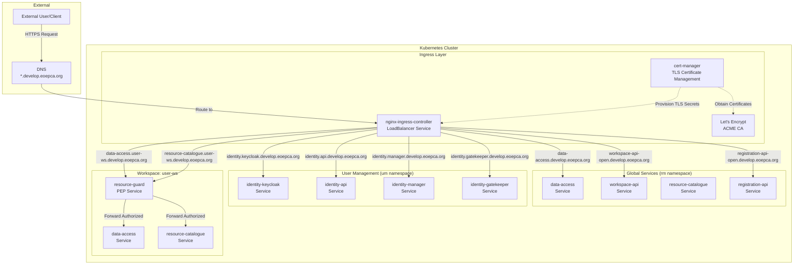
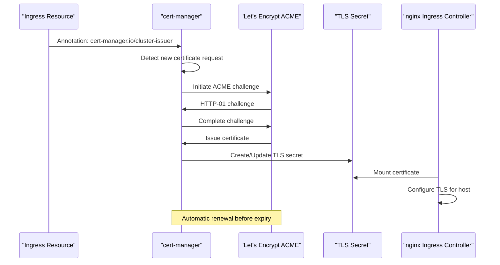
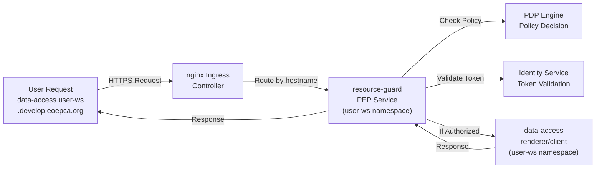
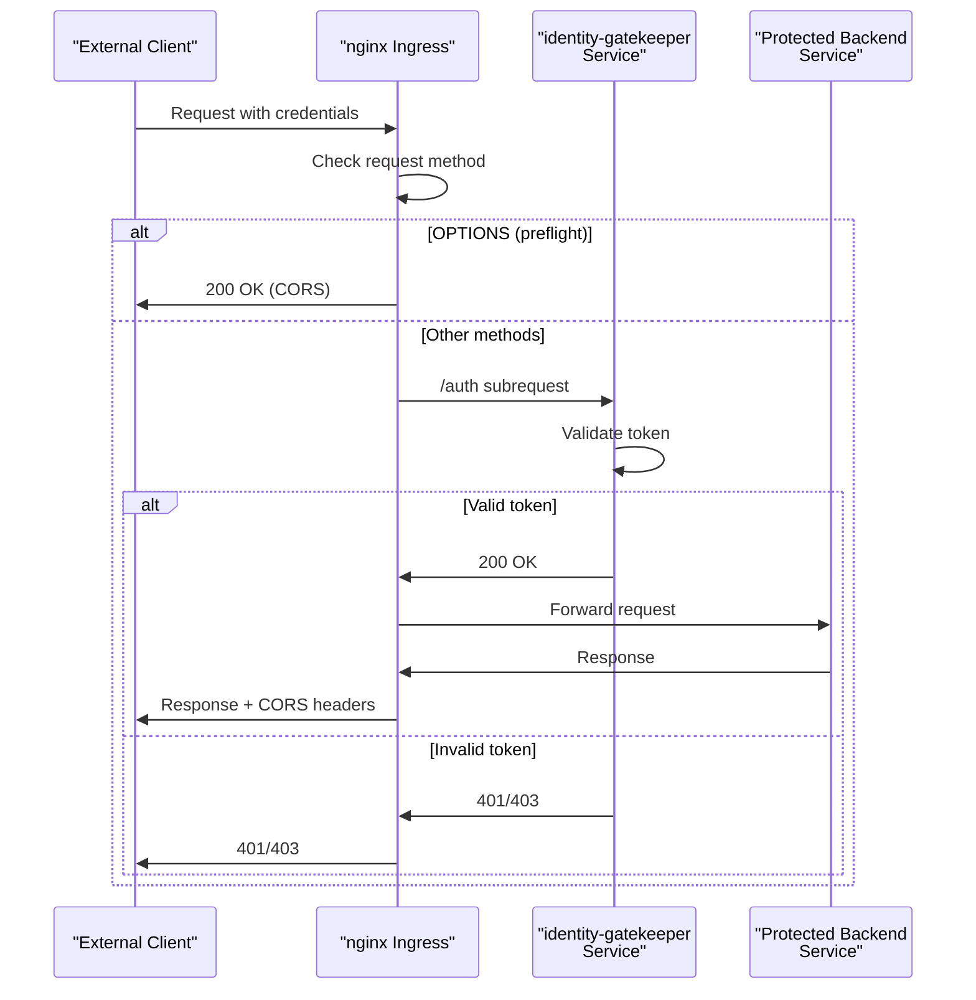

# Network and Ingress

<details>
<summary>Relevant source files</summary>

The following files were used as context for generating this wiki page:

- [system/clusters/creodias/resource-management/hr-data-access.yaml](system/clusters/creodias/resource-management/hr-data-access.yaml)
- [system/clusters/creodias/resource-management/hr-registration-api.yaml](system/clusters/creodias/resource-management/hr-registration-api.yaml)
- [system/clusters/creodias/resource-management/hr-resource-catalogue.yaml](system/clusters/creodias/resource-management/hr-resource-catalogue.yaml)
- [system/clusters/creodias/resource-management/hr-workspace-api.yaml](system/clusters/creodias/resource-management/hr-workspace-api.yaml)
- [system/clusters/creodias/resource-management/rm-workspace-charts/template-hr-data-access.yaml](system/clusters/creodias/resource-management/rm-workspace-charts/template-hr-data-access.yaml)
- [system/clusters/creodias/resource-management/rm-workspace-charts/template-hr-resource-catalogue.yaml](system/clusters/creodias/resource-management/rm-workspace-charts/template-hr-resource-catalogue.yaml)
- [system/clusters/creodias/system/demo/hr-eoepca-portal.yaml](system/clusters/creodias/system/demo/hr-eoepca-portal.yaml)
- [system/clusters/creodias/system/demo/ss-django-secrets-create.sh](system/clusters/creodias/system/demo/ss-django-secrets-create.sh)
- [system/clusters/creodias/system/demo/ss-django-secrets.yaml](system/clusters/creodias/system/demo/ss-django-secrets.yaml)
- [system/clusters/creodias/system/test/identity-dummy-service-ingress.yaml](system/clusters/creodias/system/test/identity-dummy-service-ingress.yaml)
- [system/clusters/creodias/user-management/um-identity-service.yaml](system/clusters/creodias/user-management/um-identity-service.yaml)

</details>


## Purpose and Scope

This document describes the network ingress architecture of the EOEPCA platform, including external access patterns, TLS certificate management, domain naming conventions, and the integration of authentication at the ingress layer. It covers how services are exposed externally through the nginx ingress controller and how the multi-tenant workspace architecture impacts ingress configuration.

For information about identity and authentication flows beyond the ingress layer, see [User Management and Identity](#4). For details on the GitOps deployment of infrastructure components including ingress, see [GitOps and Flux CD](#3.2). For the broader system architecture context, see [Building Blocks Overview](#3.1).

## Ingress Architecture Overview

All external traffic to the EOEPCA platform flows through a centralized nginx ingress controller deployed in the Kubernetes cluster. The ingress layer provides TLS termination, routing to backend services, and integration with authentication mechanisms.



**Sources:** [system/clusters/creodias/resource-management/hr-data-access.yaml:35-47](), [system/clusters/creodias/user-management/um-identity-service.yaml:23-76](), [system/clusters/creodias/resource-management/hr-workspace-api.yaml:24-32]()

## Ingress Controller Configuration

The platform uses the **nginx ingress controller** as the standard ingress implementation. All Ingress resources specify the nginx ingress class through annotations.

### Ingress Class Annotation

Services configure the ingress class using the `kubernetes.io/ingress.class` annotation:

```yaml
annotations:
  kubernetes.io/ingress.class: nginx
```

Some newer configurations use the `ingressClassName` field instead:

```yaml
spec:
  ingressClassName: nginx
```

### Key nginx Annotations

The platform uses several nginx-specific annotations for advanced routing and request handling:

| Annotation | Purpose | Example Usage |
|------------|---------|---------------|
| `nginx.ingress.kubernetes.io/proxy-read-timeout` | Extended timeout for long-running requests | `"600"` for Data Access rendering |
| `nginx.ingress.kubernetes.io/enable-cors` | Enable CORS headers | `"true"` for API services |
| `nginx.ingress.kubernetes.io/configuration-snippet` | Custom nginx configuration for auth_request | Auth integration with gatekeeper |
| `nginx.ingress.kubernetes.io/server-snippet` | Custom server block configuration | Internal auth location definitions |

**Sources:** [system/clusters/creodias/resource-management/hr-data-access.yaml:36-40](), [system/clusters/creodias/system/test/identity-dummy-service-ingress.yaml:9-31](), [system/clusters/creodias/system/demo/hr-eoepca-portal.yaml:24-25]()

## TLS Certificate Management

All services exposed through ingress use TLS encryption with certificates automatically provisioned and renewed by **cert-manager**.

### Certificate Issuer

The platform uses a Let's Encrypt cluster issuer named `letsencrypt` configured for ACME certificate provisioning:

```yaml
annotations:
  cert-manager.io/cluster-issuer: letsencrypt
```

### TLS Configuration Pattern

Each ingress specifies TLS configuration with hostnames and secret names:

```yaml
tls:
  - hosts:
      - service-name.develop.eoepca.org
    secretName: service-name-tls
```

cert-manager automatically creates and manages the referenced secrets, populating them with valid TLS certificates obtained from Let's Encrypt.



**Sources:** [system/clusters/creodias/resource-management/hr-data-access.yaml:41,44-47](), [system/clusters/creodias/user-management/um-identity-service.yaml:25,31-34](), [system/clusters/creodias/resource-management/hr-workspace-api.yaml:29-32]()

## Domain Naming Conventions

The EOEPCA platform follows consistent domain naming patterns to distinguish between global services, workspace-specific services, and different components within a service.

### Global Service Pattern

Global services accessible platform-wide use the pattern:

```
<service-name>.develop.eoepca.org
```

Examples:
- `data-access.develop.eoepca.org` - Global Data Access service
- `workspace-api-open.develop.eoepca.org` - Workspace API
- `registration-api-open.develop.eoepca.org` - Registration API
- `resource-catalogue.develop.eoepca.org` - Global Resource Catalogue

### Identity Service Component Pattern

Identity services use a three-part naming scheme to expose multiple components:

```
identity.<component>.develop.eoepca.org
```

Examples:
- `identity.keycloak.develop.eoepca.org` - Keycloak authentication server
- `identity.api.develop.eoepca.org` - Identity management API
- `identity.manager.develop.eoepca.org` - Identity management UI
- `identity.gatekeeper.develop.eoepca.org` - Gatekeeper proxy service

### Workspace-Specific Service Pattern

User workspace services use the pattern:

```
<service-name>.<workspace-name>.develop.eoepca.org
```

Examples:
- `data-access.eric-workspace.develop.eoepca.org` - Eric's Data Access instance
- `resource-catalogue.alice-workspace.develop.eoepca.org` - Alice's Resource Catalogue

**Domain Naming Convention Table**

| Service Type | Pattern | Example |
|--------------|---------|---------|
| Global Service | `<service>.develop.eoepca.org` | `data-access.develop.eoepca.org` |
| Identity Component | `identity.<component>.develop.eoepca.org` | `identity.keycloak.develop.eoepca.org` |
| Workspace Service | `<service>.<workspace>.develop.eoepca.org` | `data-access.user-ws.develop.eoepca.org` |
| Demo/Portal | `<app>.develop.eoepca.org` | `eoepca-portal.develop.eoepca.org` |

**Sources:** [system/clusters/creodias/resource-management/hr-data-access.yaml:43](), [system/clusters/creodias/user-management/um-identity-service.yaml:27,43,56,69](), [system/clusters/creodias/resource-management/rm-workspace-charts/template-hr-data-access.yaml:28]()

## Global Service Ingress Configuration

Global services are deployed in the `rm` (Resource Management) or `um` (User Management) namespaces with ingress resources that expose them at the top-level domain.

### Data Access Service Ingress

The global Data Access service provides a comprehensive example of ingress configuration:

```yaml
global:
  ingress:
    annotations:
      kubernetes.io/ingress.class: nginx
      kubernetes.io/tls-acme: "true"
      nginx.ingress.kubernetes.io/proxy-read-timeout: "600"
      nginx.ingress.kubernetes.io/enable-cors: "true"
      cert-manager.io/cluster-issuer: letsencrypt
    hosts:
      - host: data-access.develop.eoepca.org
    tls:
      - hosts:
          - data-access.develop.eoepca.org
        secretName: data-access-tls
```

Key features:
- **Extended timeout**: 600 seconds to support long-running rendering operations
- **CORS enabled**: Allows cross-origin API requests from web clients
- **Automatic TLS**: cert-manager provisions certificates
- **Single host**: One hostname per service

### Workspace API Ingress

The Workspace API orchestrates workspace provisioning and uses a simplified ingress pattern:

```yaml
ingress:
  enabled: true
  hosts:
    - host: workspace-api-open.develop.eoepca.org
      paths: ["/"]
  tls:
    - hosts:
        - workspace-api-open.develop.eoepca.org
      secretName: workspace-api-tls
```

The `-open` suffix indicates this endpoint does not require authentication at the ingress level, though the service itself may enforce authorization.

### Identity Service Multi-Component Ingress

The Identity Service deploys multiple ingress resources for different components, each with dedicated hostnames:

**Keycloak Component:**
```yaml
identity-keycloak:
  ingress:
    annotations:
      cert-manager.io/cluster-issuer: letsencrypt
    hosts:
      - host: identity.keycloak.develop.eoepca.org
        paths:
          - path: /
            pathType: Prefix
    tls:
      - secretName: identity-keycloak-tls-certificate
        hosts:
          - identity.keycloak.develop.eoepca.org
```

This pattern repeats for `identity-api`, `identity-manager`, and `identity-gatekeeper`, each with unique hostnames and TLS secrets.

**Sources:** [system/clusters/creodias/resource-management/hr-data-access.yaml:35-47](), [system/clusters/creodias/resource-management/hr-workspace-api.yaml:24-32](), [system/clusters/creodias/user-management/um-identity-service.yaml:23-76](), [system/clusters/creodias/resource-management/hr-registration-api.yaml:24-32]()

## Workspace-Specific Ingress Architecture

The multi-tenant workspace architecture uses a template-based approach to generate unique ingress configurations for each user workspace. However, workspace services typically have ingress disabled at the service level because they are protected by a dedicated resource-guard (PEP) that handles ingress and authorization.

### Template-Based Ingress Generation

Workspace ingress templates use placeholder substitution for dynamic values:

```yaml
global:
  ingress:
    enabled: false
    tls:
      - hosts:
          - data-access.{{ workspace_name }}.develop.eoepca.org
```

The `{{ workspace_name }}` placeholder is replaced with the actual workspace identifier (e.g., `eric-workspace`) during provisioning.

### Workspace Ingress Disabled Pattern

Most workspace service templates have `ingress.enabled: false` because they are accessed through the resource-guard:

```yaml
vs:
  renderer:
    ingress:
      enabled: false
  client:
    ingress:
      enabled: false
```

The resource-guard service acts as a PEP (Policy Enforcement Point) and provides the actual ingress endpoint for the workspace.

### Workspace Service Access Flow



### Template Configuration Examples

**Data Access Template:**
- **File:** [system/clusters/creodias/resource-management/rm-workspace-charts/template-hr-data-access.yaml:24-31]()
- **Pattern:** `data-access.{{ workspace_name }}.develop.eoepca.org`
- **Ingress:** Disabled - protected by resource-guard

**Resource Catalogue Template:**
- **File:** [system/clusters/creodias/resource-management/rm-workspace-charts/template-hr-resource-catalogue.yaml:20-25]()
- **Pattern:** `resource-catalogue.{{ workspace_name }}.develop.eoepca.org`
- **Ingress:** Disabled - protected by resource-guard

### Dynamic Values in Templates

Templates substitute several dynamic values during workspace provisioning:

| Template Variable | Example Value | Usage |
|-------------------|---------------|-------|
| `{{ workspace_name }}` | `eric-workspace` | Hostname, namespace references |
| `{{ bucket }}` | `eric-workspace-bucket` | S3 bucket references |
| `{{ access_key_id }}` | `<generated>` | S3 credentials |
| `{{ secret_access_key }}` | `<generated>` | S3 credentials |

**Sources:** [system/clusters/creodias/resource-management/rm-workspace-charts/template-hr-data-access.yaml:24-31,40-42,111-112](), [system/clusters/creodias/resource-management/rm-workspace-charts/template-hr-resource-catalogue.yaml:20-33]()

## Authentication Integration at Ingress Layer

Some services integrate authentication directly at the nginx ingress layer using the `auth_request` mechanism, which delegates authentication decisions to a separate service before forwarding requests to the backend.

### Auth Request Pattern

The auth_request pattern is implemented using nginx configuration snippets:



### Configuration Snippet Implementation

The identity dummy service demonstrates the auth_request integration pattern:

```yaml
annotations:
  nginx.ingress.kubernetes.io/configuration-snippet: |
    auth_request /auth;
    # Preflighted requests
    if ($request_method = OPTIONS ) {
      return 200;
    }
    add_header Access-Control-Allow-Origin $http_origin always;
    add_header Access-Control-Allow-Methods "*";
    add_header Access-Control-Allow-Headers "Authorization, Origin, Content-Type";
  nginx.ingress.kubernetes.io/server-snippet: |
    location ^~ /auth {
      internal;
      proxy_pass http://identity-gatekeeper.um.svc.cluster.local:3000/$request_uri;
      proxy_pass_request_body off;
      proxy_set_header Content-Length "";
      proxy_set_header X-Forwarded-Proto $scheme;
      proxy_set_header X-Forwarded-Host $host;
      proxy_set_header X-Forwarded-Method $request_method;
      proxy_set_header X-Forwarded-URI $request_uri;
      proxy_busy_buffers_size 64k;
      proxy_buffers 8 32k;
      proxy_buffer_size 32k;
    }
```

### Auth Request Components

**Configuration Snippet:**
- Invokes `auth_request /auth` for all requests
- Handles CORS preflight OPTIONS requests
- Adds CORS headers to responses

**Server Snippet:**
- Defines internal `/auth` location
- Proxies to `identity-gatekeeper.um.svc.cluster.local:3000`
- Forwards request metadata without body
- Configures buffer sizes for large auth responses

### Gatekeeper Service Reference

The auth_request delegates to the identity-gatekeeper service using cluster-internal DNS:

```
http://identity-gatekeeper.um.svc.cluster.local:3000/$request_uri
```

Components of the service URL:
- **Service name:** `identity-gatekeeper`
- **Namespace:** `um` (User Management)
- **Cluster domain:** `svc.cluster.local`
- **Port:** `3000`
- **Path:** Original request URI passed through

**Sources:** [system/clusters/creodias/system/test/identity-dummy-service-ingress.yaml:9-31]()

## CORS Configuration

Cross-Origin Resource Sharing (CORS) is configured at the ingress level to support web-based clients accessing EOEPCA APIs.

### CORS Enablement

Services that require CORS support use the nginx annotation:

```yaml
annotations:
  nginx.ingress.kubernetes.io/enable-cors: "true"
```

This enables basic CORS headers for cross-origin requests.

### Advanced CORS Headers

For more granular control, services use configuration snippets to add specific CORS headers:

```yaml
add_header Access-Control-Allow-Origin $http_origin always;
add_header Access-Control-Allow-Methods "*";
add_header Access-Control-Allow-Headers "Authorization, Origin, Content-Type";
```

### Preflight Request Handling

OPTIONS preflight requests are handled explicitly to avoid unnecessary auth_request calls:

```yaml
if ($request_method = OPTIONS ) {
  return 200;
}
```

This ensures preflight requests return immediately with appropriate CORS headers.

**Sources:** [system/clusters/creodias/resource-management/hr-data-access.yaml:40](), [system/clusters/creodias/system/test/identity-dummy-service-ingress.yaml:12-17]()

## Ingress Resource Mapping

The following table maps EOEPCA services to their ingress configurations:

| Service | Hostname | Namespace | Protected | TLS Secret | File Reference |
|---------|----------|-----------|-----------|------------|----------------|
| Data Access (Global) | `data-access.develop.eoepca.org` | `rm` | No | `data-access-tls` | [hr-data-access.yaml:43-47]() |
| Workspace API | `workspace-api-open.develop.eoepca.org` | `rm` | No | `workspace-api-tls` | [hr-workspace-api.yaml:27-32]() |
| Registration API | `registration-api-open.develop.eoepca.org` | `rm` | No | `registration-api-tls` | [hr-registration-api.yaml:27-32]() |
| Resource Catalogue | Disabled | `rm` | No | N/A | [hr-resource-catalogue.yaml:32-37]() |
| Identity Keycloak | `identity.keycloak.develop.eoepca.org` | `um` | No | `identity-keycloak-tls-certificate` | [um-identity-service.yaml:27-34]() |
| Identity API | `identity.api.develop.eoepca.org` | `um` | No | `identity-api-tls-certificate` | [um-identity-service.yaml:43-50]() |
| Identity Manager | `identity.manager.develop.eoepca.org` | `um` | No | `identity-manager-tls-certificate` | [um-identity-service.yaml:56-63]() |
| Identity Gatekeeper | `identity.gatekeeper.develop.eoepca.org` | `um` | No | `identity-gatekeeper-tls-certificate` | [um-identity-service.yaml:69-76]() |
| EOEPCA Portal | `eoepca-portal.develop.eoepca.org` | `demo` | Yes | `eoepca-portal-tls-certificate` | [hr-eoepca-portal.yaml:28-35]() |
| Workspace Data Access | `data-access.<workspace>.develop.eoepca.org` | `<workspace>` | Yes | Via resource-guard | [template-hr-data-access.yaml:28]() |
| Workspace Catalogue | `resource-catalogue.<workspace>.develop.eoepca.org` | `<workspace>` | Yes | Via resource-guard | [template-hr-resource-catalogue.yaml:33]() |

**Sources:** All files listed in table references

## Configuration Patterns Summary

### Standard Ingress Pattern

All EOEPCA services follow this general ingress structure:

```yaml
ingress:
  enabled: true
  annotations:
    kubernetes.io/ingress.class: nginx
    cert-manager.io/cluster-issuer: letsencrypt
    # Additional service-specific annotations
  hosts:
    - host: service-name.develop.eoepca.org
      paths:
        - path: /
          pathType: Prefix
  tls:
    - hosts:
        - service-name.develop.eoepca.org
      secretName: service-name-tls
```

### Path-Based Routing

Services use `Prefix` path type for flexible routing:
- `/` - Routes all paths to the service
- Allows services to handle internal routing

### TLS Secret Naming Convention

TLS secrets follow a consistent naming pattern:
- Format: `<service-name>-tls` or `<service-name>-tls-certificate`
- Automatically managed by cert-manager
- Stored in the same namespace as the Ingress resource

**Sources:** [system/clusters/creodias/resource-management/hr-data-access.yaml:35-47](), [system/clusters/creodias/user-management/um-identity-service.yaml:23-76](), [system/clusters/creodias/system/demo/hr-eoepca-portal.yaml:22-35]()