# Task Execution

Relevant source files

The following files were used as context for generating this wiki page:

- [flytepropeller/pkg/controller/nodes/task/backoff/controller.go](flytepropeller/pkg/controller/nodes/task/backoff/controller.go)
- [flytepropeller/pkg/controller/nodes/task/backoff/handler.go](flytepropeller/pkg/controller/nodes/task/backoff/handler.go)
- [flytepropeller/pkg/controller/nodes/task/backoff/handler_map.go](flytepropeller/pkg/controller/nodes/task/backoff/handler_map.go)
- [flytepropeller/pkg/controller/nodes/task/backoff/handler_test.go](flytepropeller/pkg/controller/nodes/task/backoff/handler_test.go)
- [flytepropeller/pkg/controller/nodes/task/backoff/safe_resourcelist.go](flytepropeller/pkg/controller/nodes/task/backoff/safe_resourcelist.go)
- [flytepropeller/pkg/controller/nodes/task/backoff/safe_resourcelist_test.go](flytepropeller/pkg/controller/nodes/task/backoff/safe_resourcelist_test.go)
- [flytepropeller/pkg/controller/nodes/task/config/config.go](flytepropeller/pkg/controller/nodes/task/config/config.go)
- [flytepropeller/pkg/controller/nodes/task/config/config_flags.go](flytepropeller/pkg/controller/nodes/task/config/config_flags.go)
- [flytepropeller/pkg/controller/nodes/task/config/config_flags_test.go](flytepropeller/pkg/controller/nodes/task/config/config_flags_test.go)
- [flytepropeller/pkg/controller/nodes/task/handler.go](flytepropeller/pkg/controller/nodes/task/handler.go)
- [flytepropeller/pkg/controller/nodes/task/handler_test.go](flytepropeller/pkg/controller/nodes/task/handler_test.go)
- [flytepropeller/pkg/controller/nodes/task/k8s/plugin_manager.go](flytepropeller/pkg/controller/nodes/task/k8s/plugin_manager.go)
- [flytepropeller/pkg/controller/nodes/task/k8s/plugin_manager_test.go](flytepropeller/pkg/controller/nodes/task/k8s/plugin_manager_test.go)
- [flytepropeller/pkg/controller/nodes/task/plugin_config.go](flytepropeller/pkg/controller/nodes/task/plugin_config.go)
- [flytepropeller/pkg/controller/nodes/task/plugin_config_test.go](flytepropeller/pkg/controller/nodes/task/plugin_config_test.go)
- [flytepropeller/pkg/controller/nodes/task/resourcemanager/noop_resourcemanager.go](flytepropeller/pkg/controller/nodes/task/resourcemanager/noop_resourcemanager.go)
- [flytepropeller/pkg/controller/nodes/task/resourcemanager/redis_resourcemanager.go](flytepropeller/pkg/controller/nodes/task/resourcemanager/redis_resourcemanager.go)
- [flytepropeller/pkg/controller/nodes/task/resourcemanager/redis_resourcemanager_test.go](flytepropeller/pkg/controller/nodes/task/resourcemanager/redis_resourcemanager_test.go)
- [flytepropeller/pkg/controller/nodes/task/resourcemanager/resourceconstraints.go](flytepropeller/pkg/controller/nodes/task/resourcemanager/resourceconstraints.go)
- [flytepropeller/pkg/controller/nodes/task/resourcemanager/resourcemanager.go](flytepropeller/pkg/controller/nodes/task/resourcemanager/resourcemanager.go)
- [flytepropeller/pkg/controller/nodes/task/resourcemanager/resourcemanager_test.go](flytepropeller/pkg/controller/nodes/task/resourcemanager/resourcemanager_test.go)
- [flytepropeller/pkg/controller/nodes/task/taskexec_context.go](flytepropeller/pkg/controller/nodes/task/taskexec_context.go)
- [flytepropeller/pkg/controller/nodes/task/taskexec_context_test.go](flytepropeller/pkg/controller/nodes/task/taskexec_context_test.go)
- [flytepropeller/pkg/controller/nodes/task/transformer.go](flytepropeller/pkg/controller/nodes/task/transformer.go)
- [flytepropeller/pkg/controller/nodes/task/transformer_test.go](flytepropeller/pkg/controller/nodes/task/transformer_test.go)

This page provides a detailed overview of how tasks are executed in Flyte. It covers the task execution lifecycle, including the plugin system, resource management, and status handling. For information about node execution, see [FlytePropeller Execution Engine](#3.2). For information about array tasks specifically, see [Array Tasks](#3.4).

## Task Execution Overview

Task execution in Flyte is handled by the Task Handler, which delegates the actual execution to plugins. The Task Handler is responsible for managing the task execution lifecycle, including plugin resolution, resource management, state transitions, and event reporting.

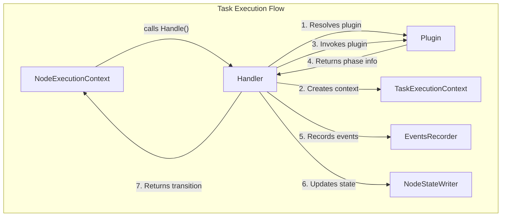

Sources: 
- [flytepropeller/pkg/controller/nodes/task/handler.go:642-797](https://github.com/flyteorg/flyte/blob/master/flytepropeller/pkg/controller/nodes/task/handler.go)
- [flytepropeller/pkg/controller/nodes/task/transformer.go:90-201](https://github.com/flyteorg/flyte/blob/master/flytepropeller/pkg/controller/nodes/task/transformer.go)

## Task Execution Lifecycle

The task execution process follows a well-defined lifecycle that handles tasks from initialization to completion:

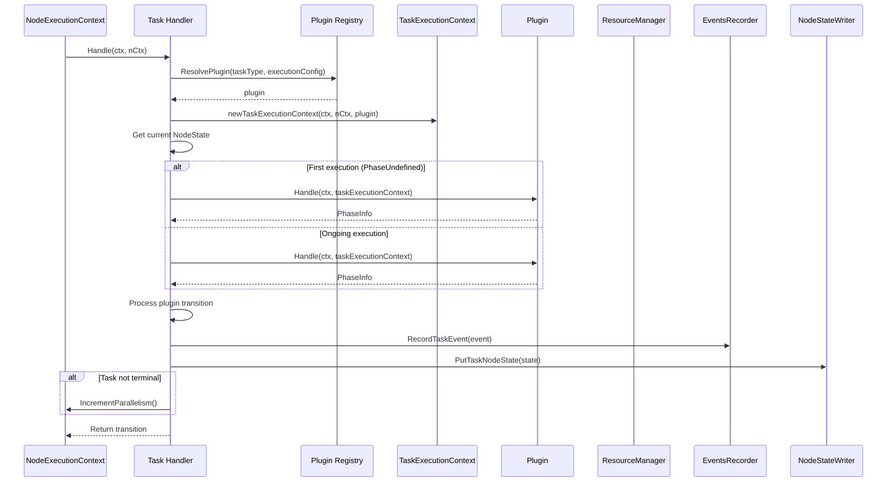

Sources:
- [flytepropeller/pkg/controller/nodes/task/handler.go:642-797](https://github.com/flyteorg/flyte/blob/master/flytepropeller/pkg/controller/nodes/task/handler.go)
- [flytepropeller/pkg/controller/nodes/task/handler.go:376-457](https://github.com/flyteorg/flyte/blob/master/flytepropeller/pkg/controller/nodes/task/handler.go)

### Key Task Execution Phases

Tasks go through various phases during execution:

1. **PhaseUndefined**: Initial state
2. **PhaseNotReady**: Task dependencies not yet satisfied
3. **PhaseQueued**: Task submitted for execution
4. **PhaseInitializing**: Task execution is initializing
5. **PhaseWaitingForResources**: Task waiting for resources to be available
6. **PhaseRunning**: Task is actively running
7. **PhaseSuccess**: Task completed successfully
8. **PhasePermanentFailure**: Task failed (non-recoverable)
9. **PhaseRetryableFailure**: Task failed (recoverable)
10. **PhaseAborted**: Task was aborted

Sources:
- [flytepropeller/pkg/controller/nodes/task/transformer.go:31-56](https://github.com/flyteorg/flyte/blob/master/flytepropeller/pkg/controller/nodes/task/transformer.go)

## Plugin Architecture

Task execution in Flyte is handled by plugins. The plugin system is extensible and supports different types of task execution.

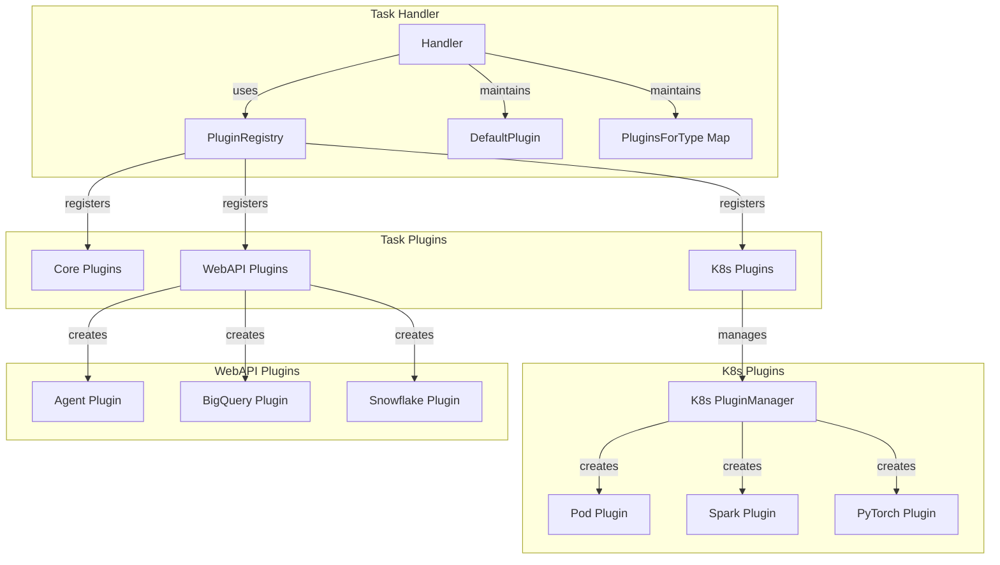

Sources:
- [flytepropeller/pkg/controller/nodes/task/handler.go:228-424](https://github.com/flyteorg/flyte/blob/master/flytepropeller/pkg/controller/nodes/task/handler.go)
- [flytepropeller/pkg/controller/nodes/task/plugin_config.go:20-76](https://github.com/flyteorg/flyte/blob/master/flytepropeller/pkg/controller/nodes/task/plugin_config.go)

### Plugin Resolution

When a task is executed, the Task Handler resolves the appropriate plugin based on the task type and execution configuration. Plugin resolution follows this logic:

1. Check for plugin overrides in the execution config for the task type
2. If no override is found, use the default plugin for the task type
3. If no default plugin for the task type exists, check if it's an agent-compatible task type
4. If all else fails, use the default plugin (if configured)

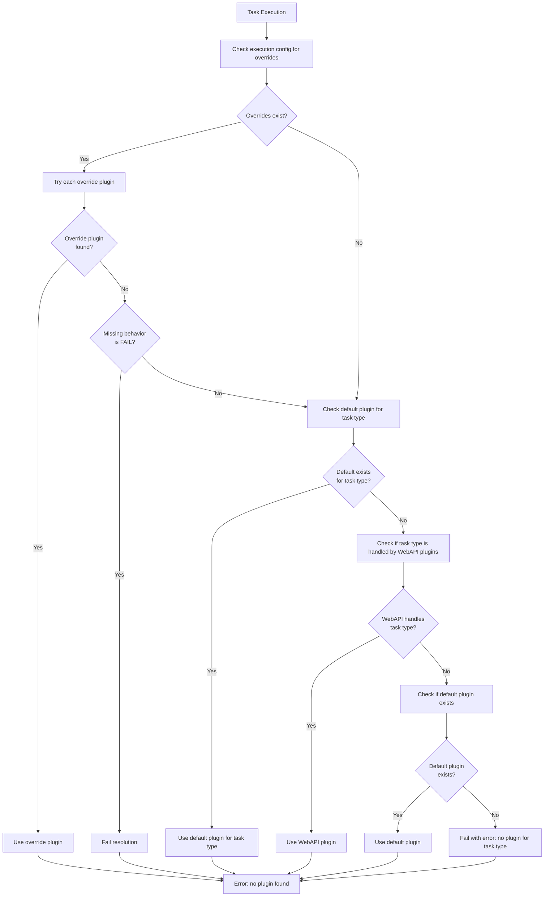

Sources:
- [flytepropeller/pkg/controller/nodes/task/handler.go:381-423](https://github.com/flyteorg/flyte/blob/master/flytepropeller/pkg/controller/nodes/task/handler.go)
- [flytepropeller/pkg/controller/nodes/task/plugin_config.go:20-76](https://github.com/flyteorg/flyte/blob/master/flytepropeller/pkg/controller/nodes/task/plugin_config.go)

## K8s Plugin Manager

The K8s Plugin Manager is a core component of Flyte's task execution system. It creates and manages Kubernetes resources for task execution.

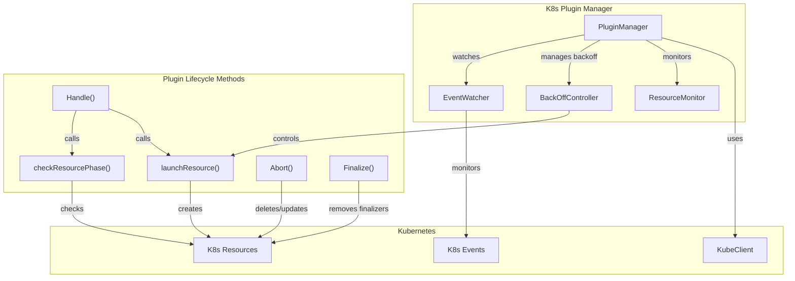

Sources:
- [flytepropeller/pkg/controller/nodes/task/k8s/plugin_manager.go:99-552](https://github.com/flyteorg/flyte/blob/master/flytepropeller/pkg/controller/nodes/task/k8s/plugin_manager.go)
- [flytepropeller/pkg/controller/nodes/task/k8s/plugin_manager.go:332-407](https://github.com/flyteorg/flyte/blob/master/flytepropeller/pkg/controller/nodes/task/k8s/plugin_manager.go)

### K8s Plugin Execution Flow

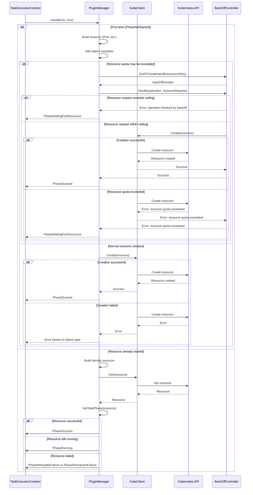

Sources:
- [flytepropeller/pkg/controller/nodes/task/k8s/plugin_manager.go:195-260](https://github.com/flyteorg/flyte/blob/master/flytepropeller/pkg/controller/nodes/task/k8s/plugin_manager.go)
- [flytepropeller/pkg/controller/nodes/task/k8s/plugin_manager.go:272-330](https://github.com/flyteorg/flyte/blob/master/flytepropeller/pkg/controller/nodes/task/k8s/plugin_manager.go)
- [flytepropeller/pkg/controller/nodes/task/k8s/plugin_manager.go:332-407](https://github.com/flyteorg/flyte/blob/master/flytepropeller/pkg/controller/nodes/task/k8s/plugin_manager.go)

## Resource Management

Resource management is a critical aspect of task execution in Flyte. It ensures that tasks are executed efficiently and within resource constraints.

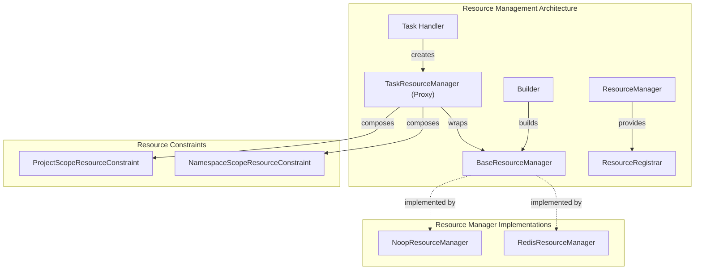

Sources:
- [flytepropeller/pkg/controller/nodes/task/resourcemanager/resourcemanager.go:13-152](https://github.com/flyteorg/flyte/blob/master/flytepropeller/pkg/controller/nodes/task/resourcemanager/resourcemanager.go)
- [flytepropeller/pkg/controller/nodes/task/resourcemanager/noop_resourcemanager.go:1-49](https://github.com/flyteorg/flyte/blob/master/flytepropeller/pkg/controller/nodes/task/resourcemanager/noop_resourcemanager.go)
- [flytepropeller/pkg/controller/nodes/task/resourcemanager/redis_resourcemanager.go:13-174](https://github.com/flyteorg/flyte/blob/master/flytepropeller/pkg/controller/nodes/task/resourcemanager/redis_resourcemanager.go)

### Resource Allocation Flow

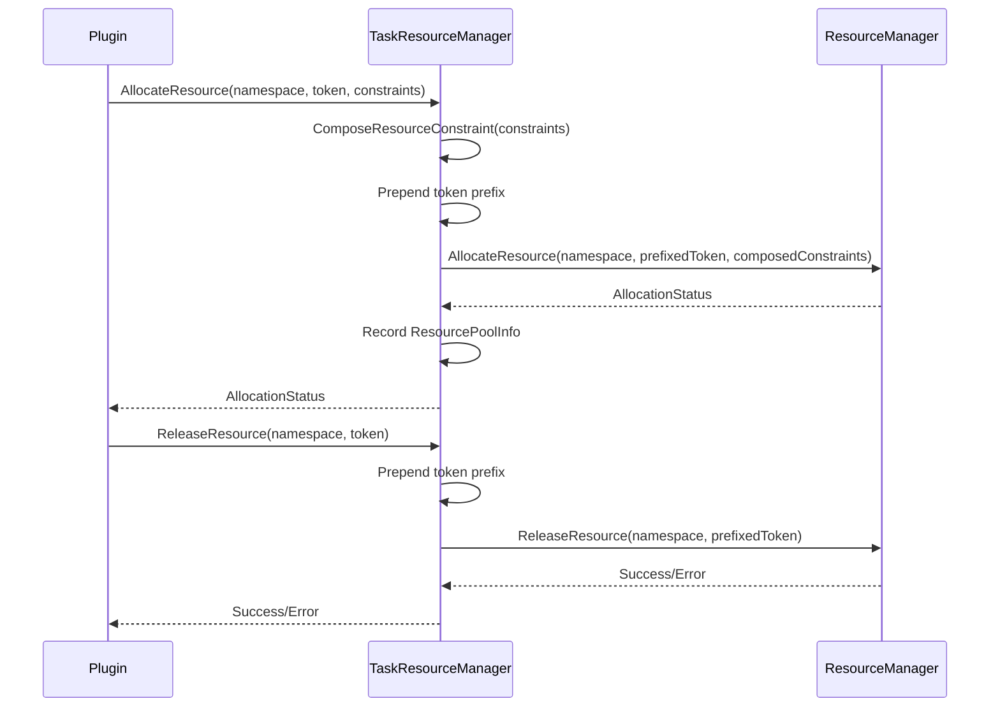

Sources:
- [flytepropeller/pkg/controller/nodes/task/resourcemanager/resourcemanager.go:93-135](https://github.com/flyteorg/flyte/blob/master/flytepropeller/pkg/controller/nodes/task/resourcemanager/resourcemanager.go)

## Backoff Mechanism

When resources are constrained, Flyte uses a backoff mechanism to avoid constant retries that would overwhelm the system.

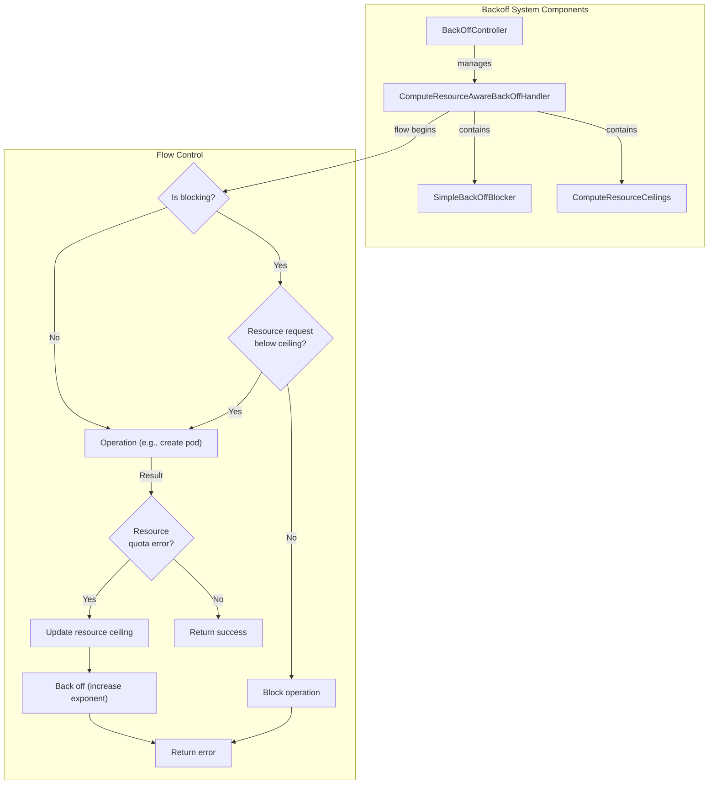

Sources:
- [flytepropeller/pkg/controller/nodes/task/backoff/handler.go:128-192](https://github.com/flyteorg/flyte/blob/master/flytepropeller/pkg/controller/nodes/task/backoff/handler.go)
- [flytepropeller/pkg/controller/nodes/task/backoff/controller.go:22-62](https://github.com/flyteorg/flyte/blob/master/flytepropeller/pkg/controller/nodes/task/backoff/controller.go)

## Task Execution Context

The Task Execution Context provides all the information needed for a plugin to execute a task.

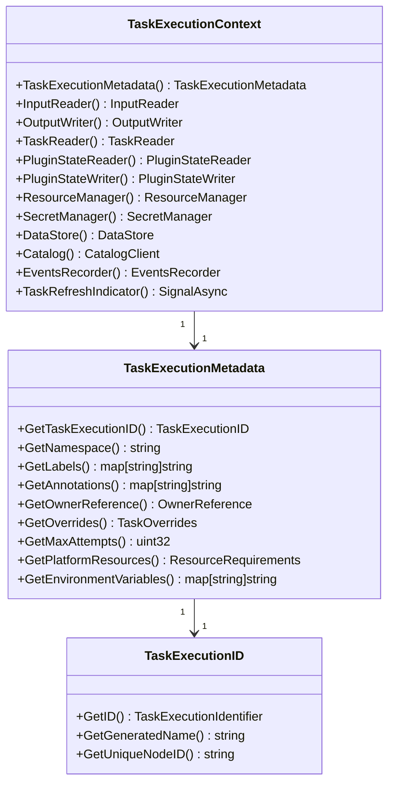

Sources:
- [flytepropeller/pkg/controller/nodes/task/taskexec_context.go:28-106](https://github.com/flyteorg/flyte/blob/master/flytepropeller/pkg/controller/nodes/task/taskexec_context.go)
- [flytepropeller/pkg/controller/nodes/task/taskexec_context.go:106-154](https://github.com/flyteorg/flyte/blob/master/flytepropeller/pkg/controller/nodes/task/taskexec_context.go)
- [flytepropeller/pkg/controller/nodes/task/taskexec_context.go:244-316](https://github.com/flyteorg/flyte/blob/master/flytepropeller/pkg/controller/nodes/task/taskexec_context.go)

## Task Execution Events

Task execution progress is tracked through events. These events are sent to FlyteAdmin and used to update the UI and track task status.

| Event Phase | Description | Next Possible Phases |
|-------------|-------------|----------------------|
| UNDEFINED | Initial state | QUEUED |
| QUEUED | Task submitted for execution | INITIALIZING, RUNNING, FAILED |
| INITIALIZING | Task execution is initializing | RUNNING, WAITING_FOR_RESOURCES, FAILED |
| WAITING_FOR_RESOURCES | Task waiting for resources | INITIALIZING, RUNNING, FAILED |
| RUNNING | Task is actively running | SUCCEEDED, FAILED |
| SUCCEEDED | Task completed successfully | (terminal) |
| FAILED | Task failed (permanent or retryable) | (terminal) |
| ABORTED | Task was aborted | (terminal) |

Sources:
- [flytepropeller/pkg/controller/nodes/task/transformer.go:31-56](https://github.com/flyteorg/flyte/blob/master/flytepropeller/pkg/controller/nodes/task/transformer.go)
- [flytepropeller/pkg/controller/nodes/task/transformer.go:90-201](https://github.com/flyteorg/flyte/blob/master/flytepropeller/pkg/controller/nodes/task/transformer.go)
- [flytepropeller/pkg/controller/nodes/task/handler.go:734-775](https://github.com/flyteorg/flyte/blob/master/flytepropeller/pkg/controller/nodes/task/handler.go)

## Error Handling and Recovery

Task execution can encounter various error scenarios that need to be handled appropriately.

### Output Validation Errors

When a task succeeds but fails to produce valid outputs, the handler determines if the error is recoverable:

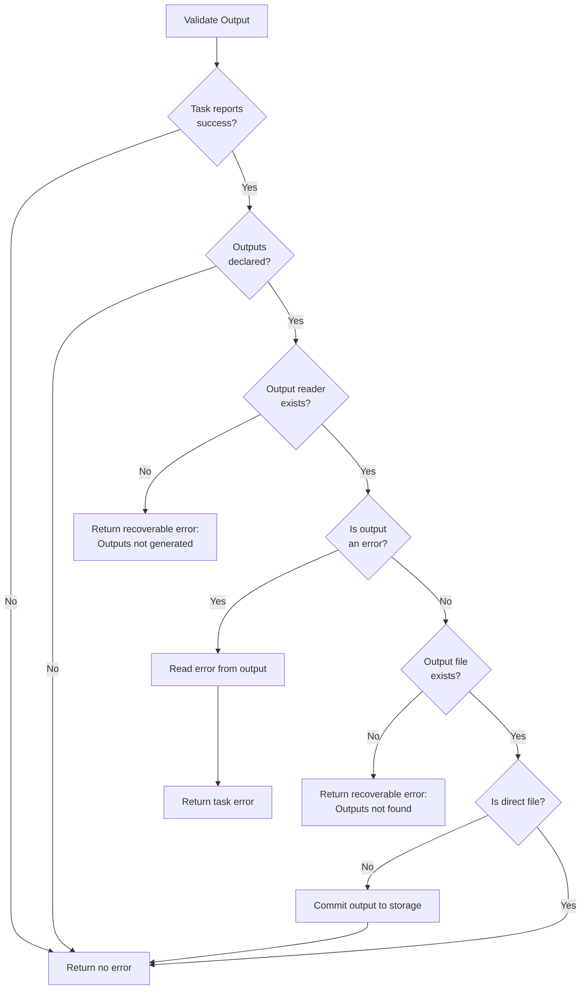

Sources:
- [flytepropeller/pkg/controller/nodes/task/handler.go:798-884](https://github.com/flyteorg/flyte/blob/master/flytepropeller/pkg/controller/nodes/task/handler.go)

### Resource Quota Handling

When a task encounters resource quota limitations, Flyte uses a backoff mechanism to avoid overwhelming the system with retries:

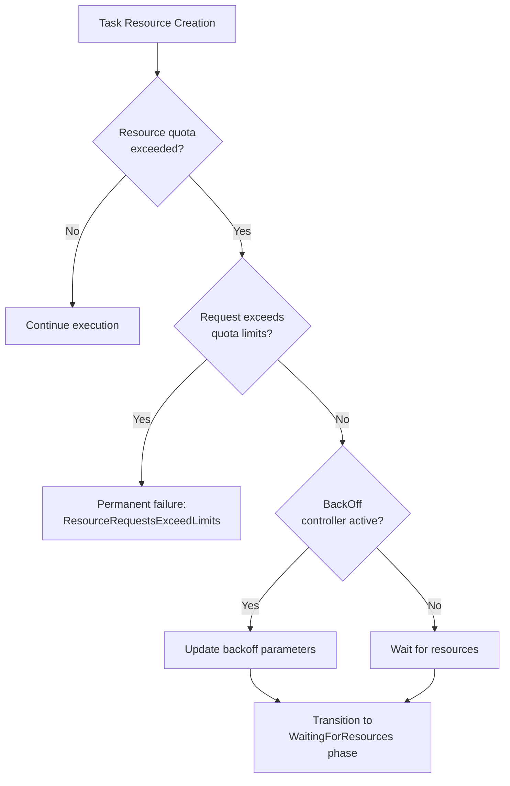

Sources:
- [flytepropeller/pkg/controller/nodes/task/k8s/plugin_manager.go:232-246](https://github.com/flyteorg/flyte/blob/master/flytepropeller/pkg/controller/nodes/task/k8s/plugin_manager.go)
- [flytepropeller/pkg/controller/nodes/task/backoff/handler.go:128-192](https://github.com/flyteorg/flyte/blob/master/flytepropeller/pkg/controller/nodes/task/backoff/handler.go)

## Task Abort and Finalization

Tasks may need to be aborted or finalized in certain scenarios, such as when a workflow is terminated or when resources need to be cleaned up.

### Abort Process

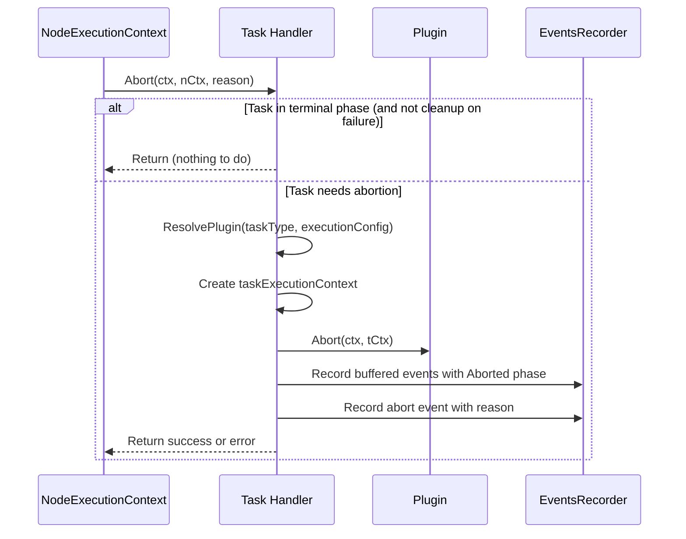

Sources:
- [flytepropeller/pkg/controller/nodes/task/handler.go:886-964](https://github.com/flyteorg/flyte/blob/master/flytepropeller/pkg/controller/nodes/task/handler.go)
- [flytepropeller/pkg/controller/nodes/task/k8s/plugin_manager.go:410-457](https://github.com/flyteorg/flyte/blob/master/flytepropeller/pkg/controller/nodes/task/k8s/plugin_manager.go)

### K8s Resource Finalization

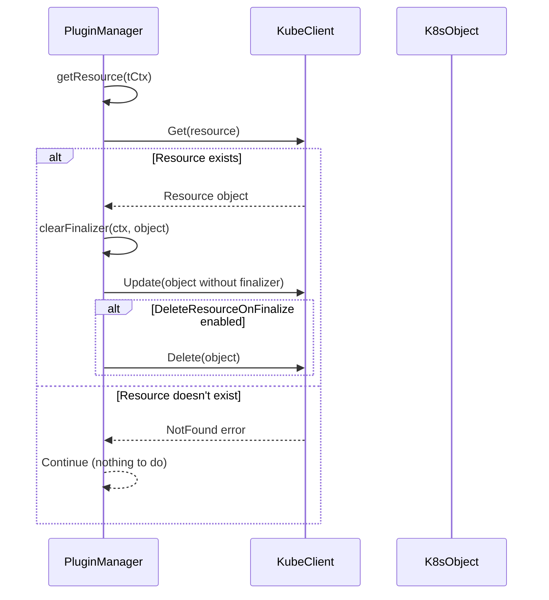

Sources:
- [flytepropeller/pkg/controller/nodes/task/k8s/plugin_manager.go:460-552](https://github.com/flyteorg/flyte/blob/master/flytepropeller/pkg/controller/nodes/task/k8s/plugin_manager.go)

## Configuration

Task execution behavior can be configured through various configuration options:

| Configuration | Description | Default |
|---------------|-------------|---------|
| `task-plugins.enabled-plugins` | List of plugins to enable | [] (all plugins enabled) |
| `task-plugins.default-for-task-types` | Maps task types to their default plugin handler | {} |
| `max-plugin-phase-versions` | Maximum number of plugin phase versions allowed | 100000 |
| `backoff.base-second` | Base duration for exponential backoff | 2 seconds |
| `backoff.max-duration` | Maximum backoff duration | 20 seconds |

Sources:
- [flytepropeller/pkg/controller/nodes/task/config/config.go:15-101](https://github.com/flyteorg/flyte/blob/master/flytepropeller/pkg/controller/nodes/task/config/config.go)
- [flytepropeller/pkg/controller/nodes/task/plugin_config.go:20-76](https://github.com/flyteorg/flyte/blob/master/flytepropeller/pkg/controller/nodes/task/plugin_config.go)