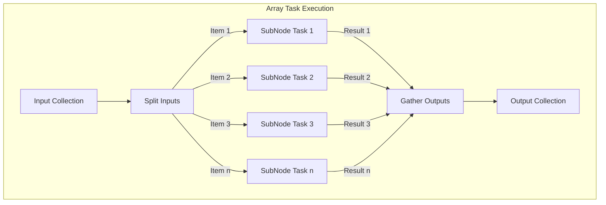
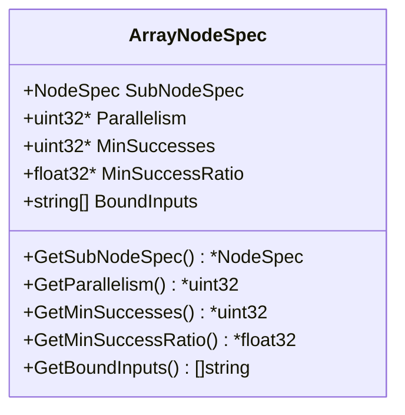
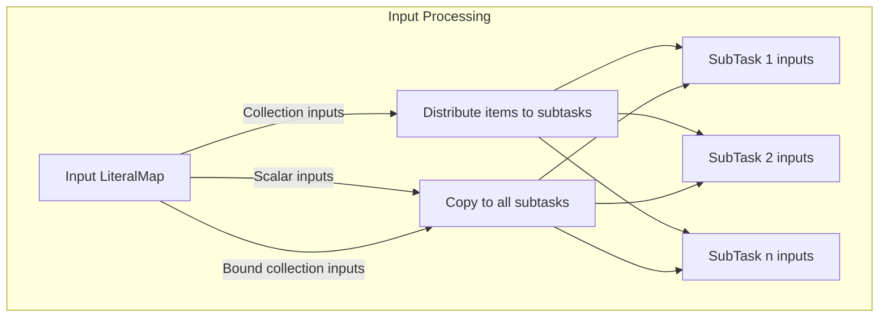
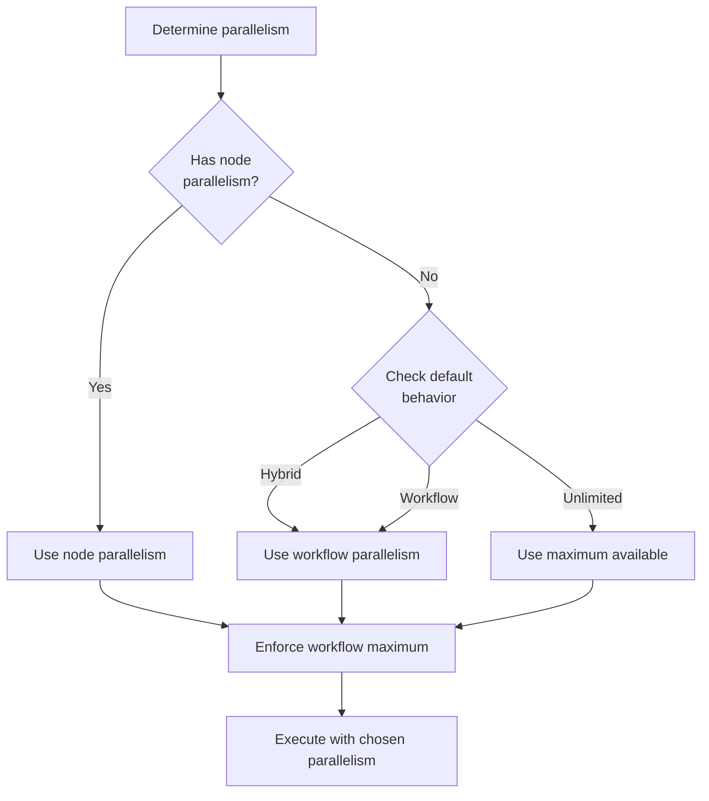
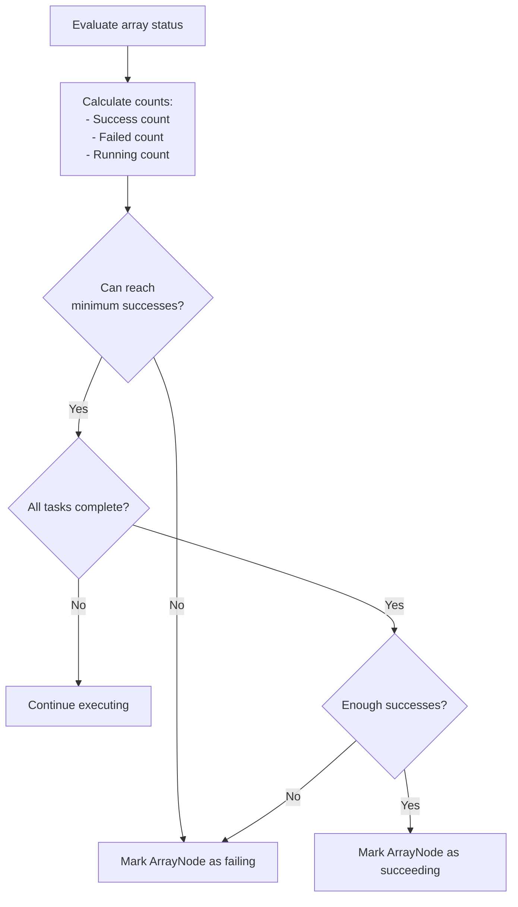
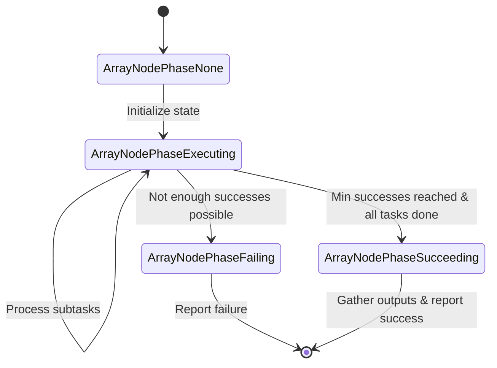
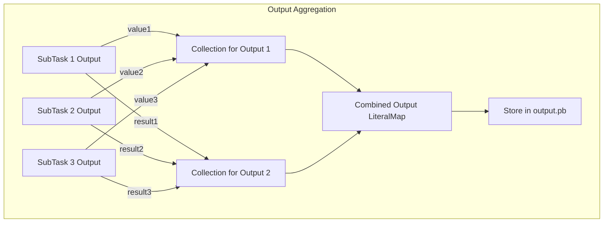
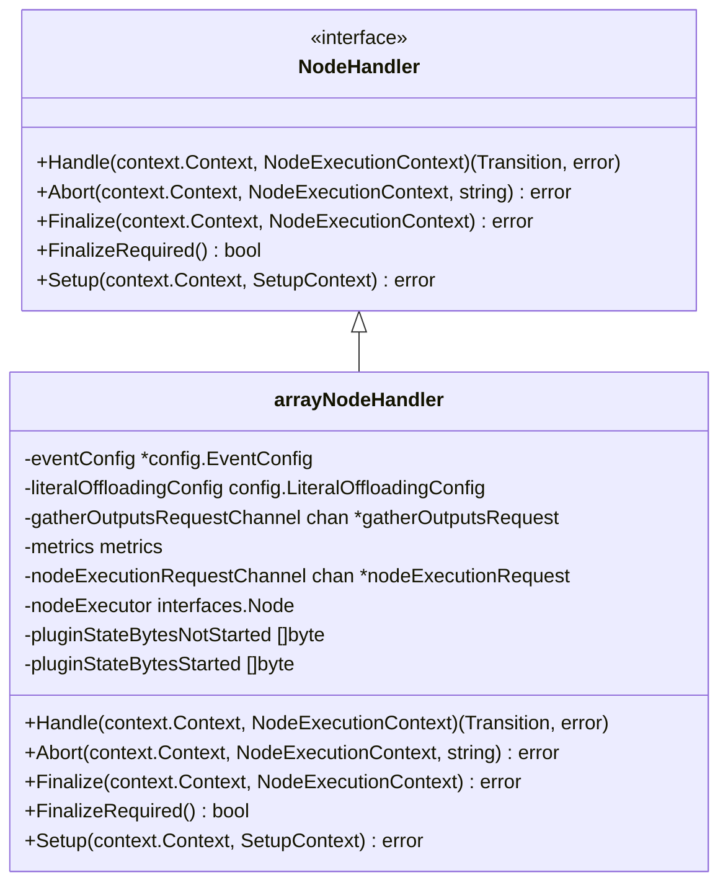
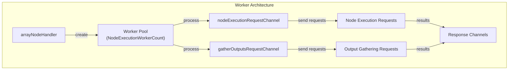
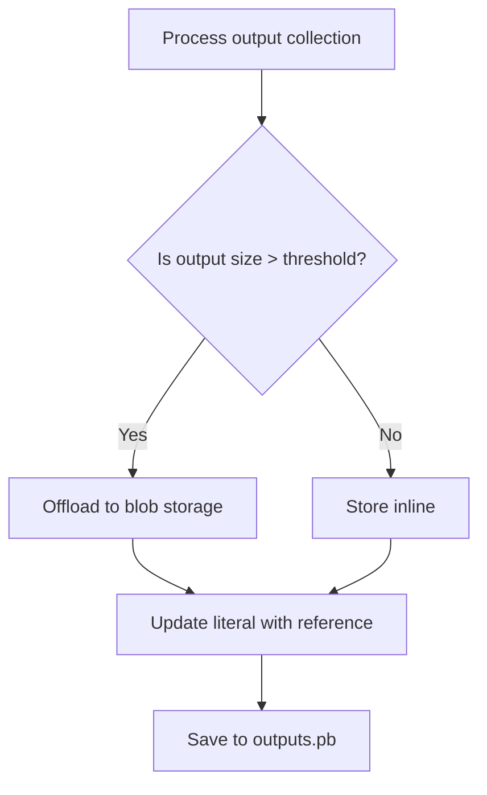

# Array Tasks

Relevant source files

The following files were used as context for generating this wiki page:

- [flytepropeller/pkg/apis/flyteworkflow/v1alpha1/array.go](flytepropeller/pkg/apis/flyteworkflow/v1alpha1/array.go)
- [flytepropeller/pkg/apis/flyteworkflow/v1alpha1/mocks/ExecutableArrayNode.go](flytepropeller/pkg/apis/flyteworkflow/v1alpha1/mocks/ExecutableArrayNode.go)
- [flytepropeller/pkg/compiler/transformers/k8s/node.go](flytepropeller/pkg/compiler/transformers/k8s/node.go)
- [flytepropeller/pkg/compiler/transformers/k8s/node_test.go](flytepropeller/pkg/compiler/transformers/k8s/node_test.go)
- [flytepropeller/pkg/controller/config/config.go](flytepropeller/pkg/controller/config/config.go)
- [flytepropeller/pkg/controller/config/config_flags.go](flytepropeller/pkg/controller/config/config_flags.go)
- [flytepropeller/pkg/controller/config/config_flags_test.go](flytepropeller/pkg/controller/config/config_flags_test.go)
- [flytepropeller/pkg/controller/nodes/array/handler.go](flytepropeller/pkg/controller/nodes/array/handler.go)
- [flytepropeller/pkg/controller/nodes/array/handler_test.go](flytepropeller/pkg/controller/nodes/array/handler_test.go)
- [flytepropeller/pkg/controller/nodes/array/node_execution_context.go](flytepropeller/pkg/controller/nodes/array/node_execution_context.go)
- [flytepropeller/pkg/controller/nodes/array/node_execution_context_test.go](flytepropeller/pkg/controller/nodes/array/node_execution_context_test.go)

This document explains how array nodes are processed for parallel execution of tasks within Flyte. Array tasks allow you to execute the same task over a collection of inputs in parallel, providing a simple and efficient way to process data at scale. For details about individual task execution, see [Task Execution](#3.3).

## Overview

Array tasks enable a form of map-reduce pattern where the same operation is performed on each item in an input collection. Flyte manages the fan-out execution, monitoring, and collection of results with configurable parallelism, retry behavior, and success criteria.

Sources: [flytepropeller/pkg/controller/nodes/array/handler.go:54-764](https://github.com/flyteorg/flyte/flytepropeller/pkg/controller/nodes/array/handler.go)

## Array Node Structure

An array node is defined by an `ArrayNodeSpec` that contains:

- **SubNodeSpec**: The specification of the task to be executed for each item in the input collection
- **Parallelism**: Optional limit on the number of concurrent executions
- **MinSuccesses**: Optional minimum number of successful executions required for the array to be considered successful
- **MinSuccessRatio**: Optional minimum ratio of successful executions (alternative to MinSuccesses)
- **BoundInputs**: Optional list of inputs that should not be split (passed directly to each task)

Sources: [flytepropeller/pkg/apis/flyteworkflow/v1alpha1/array.go:1-29](https://github.com/flyteorg/flyte/flytepropeller/pkg/apis/flyteworkflow/v1alpha1/array.go), [flytepropeller/pkg/compiler/transformers/k8s/node.go:178-208](https://github.com/flyteorg/flyte/flytepropeller/pkg/compiler/transformers/k8s/node.go)

## Input Handling

When an array task executes, the inputs are processed as follows:

1. For each input that is a collection and not in the `BoundInputs` list, items are distributed to individual subtasks
2. Each subtask receives a single element from each collection input
3. Non-collection inputs and bound inputs are passed directly to each subtask

If all inputs are collections of the same length, each subtask receives the corresponding item from each collection. For example, with collections `[a, b, c]` and `[x, y, z]`, the first subtask receives `a` and `x`, the second receives `b` and `y`, and so on.

Sources: [flytepropeller/pkg/controller/nodes/array/node_execution_context.go:15-50](https://github.com/flyteorg/flyte/flytepropeller/pkg/controller/nodes/array/node_execution_context.go), [flytepropeller/pkg/controller/nodes/array/handler.go:783-786](https://github.com/flyteorg/flyte/flytepropeller/pkg/controller/nodes/array/handler.go)

## Parallelism Control

Array tasks offer flexible parallelism control through several mechanisms:

### Parallelism Behaviors

These behaviors are controlled by the `DefaultParallelismBehavior` configuration:

- **Hybrid** (`ParallelismBehaviorHybrid`): Uses exact parallelism specified by the array node
- **Unlimited** (`ParallelismBehaviorUnlimited`): Maximum possible parallelism for nil/0 values
- **Workflow** (`ParallelismBehaviorWorkflow`): Uses workflow-level parallelism for nil/0 values

### Configuring Parallelism

Parallelism is determined through several factors:

1. Node-specific parallelism (if specified in the `ArrayNode` definition)
2. Workflow-level parallelism limit
3. System-level configuration settings

The actual parallelism is calculated based on the behavior mode and the available parallelism in the workflow.

Sources: [flytepropeller/pkg/controller/config/config.go:330-347](https://github.com/flyteorg/flyte/flytepropeller/pkg/controller/config/config.go), [flytepropeller/pkg/controller/nodes/array/handler.go:302-359](https://github.com/flyteorg/flyte/flytepropeller/pkg/controller/nodes/array/handler.go)

## Success Criteria

Array tasks provide two ways to define success criteria:

1. **MinSuccesses**: Absolute number of subtasks that must succeed
2. **MinSuccessRatio**: Fraction of subtasks that must succeed

If no success criteria are specified, all subtasks must succeed for the array task to be considered successful.

The system calculates whether successful completion is still possible:

Sources: [flytepropeller/pkg/controller/nodes/array/handler.go:437-472](https://github.com/flyteorg/flyte/flytepropeller/pkg/controller/nodes/array/handler.go)

## Execution Lifecycle

The array task goes through several phases during execution:

1. **ArrayNodePhaseNone**: Initial state
2. **ArrayNodePhaseExecuting**: Tasks are being executed
3. **ArrayNodePhaseFailing**: Failure conditions have been met
4. **ArrayNodePhaseSucceeding**: Success conditions have been met

### State Management

The array handler maintains state for each subtask using compact bit arrays for efficiency:

- **SubNodePhases**: Current phase of each subnode
- **SubNodeTaskPhases**: Task execution phase of each subnode
- **SubNodeRetryAttempts**: Number of retry attempts for each subnode
- **SubNodeSystemFailures**: Number of system failures for each subnode
- **SubNodeDeltaTimestamps**: Time difference from parent node start

Sources: [flytepropeller/pkg/controller/nodes/array/handler.go:198-645](https://github.com/flyteorg/flyte/flytepropeller/pkg/controller/nodes/array/handler.go)

## Output Aggregation

When an array task completes successfully, it gathers outputs from all subtasks and combines them into collections:

1. For each output variable from the subtasks, a collection is created
2. Each collection contains the corresponding output from each successful subtask
3. For failed subtasks (when using MinSuccesses or MinSuccessRatio), nil values are used
4. The output collections maintain the same order as the input collections

The combined outputs are then stored in the `outputs.pb` file in the node's output directory.

Sources: [flytepropeller/pkg/controller/nodes/array/handler.go:496-626](https://github.com/flyteorg/flyte/flytepropeller/pkg/controller/nodes/array/handler.go)

## Configuration

Array tasks can be configured through several options in the Flyte configuration:

| Configuration Option | Default | Description |
|----------------------|---------|-------------|
| `EventVersion` | 0 | Controls the event format for array nodes (0=legacy, 1=new) |
| `DefaultParallelismBehavior` | `ParallelismBehaviorUnlimited` | Default behavior for handling parallelism |
| `UseMapPluginLogs` | false | Use map plugin logs for subnode log links |
| `MaxTaskPhaseVersionAttempts` | 3 | Maximum retries for handling task phase version conflicts |

Sources: [flytepropeller/pkg/controller/config/config.go:124-129](https://github.com/flyteorg/flyte/flytepropeller/pkg/controller/config/config.go)

## Implementation Architecture

The array task execution is handled by the `arrayNodeHandler` which implements the `interfaces.NodeHandler` interface:

The handler uses worker pools to process subtask executions and gather outputs in parallel:

Sources: [flytepropeller/pkg/controller/nodes/array/handler.go:54-764](https://github.com/flyteorg/flyte/flytepropeller/pkg/controller/nodes/array/handler.go), [flytepropeller/pkg/controller/config/config.go:181-183](https://github.com/flyteorg/flyte/flytepropeller/pkg/controller/config/config.go)

## Special Handling

### Literal Offloading

For large output collections, the array handler supports offloading literals to external storage when they exceed a configured size threshold. This prevents overloading the Kubernetes data store with large outputs:

Sources: [flytepropeller/pkg/controller/nodes/array/handler.go:608-618](https://github.com/flyteorg/flyte/flytepropeller/pkg/controller/nodes/array/handler.go), [flytepropeller/pkg/controller/config/config.go:186-193](https://github.com/flyteorg/flyte/flytepropeller/pkg/controller/config/config.go)

## Error Handling

Array tasks provide robust error handling mechanisms:

1. **Retries**: Individual subtasks can be retried based on retry configuration
2. **Partial Success**: Array tasks can succeed even with some failed subtasks (using MinSuccesses or MinSuccessRatio)
3. **Error Aggregation**: Error messages from failed subtasks are aggregated for easy diagnosis

When an array task fails, the aggregated error message includes information about which subtasks failed and why.

Sources: [flytepropeller/pkg/controller/nodes/array/handler.go:362-426](https://github.com/flyteorg/flyte/flytepropeller/pkg/controller/nodes/array/handler.go)