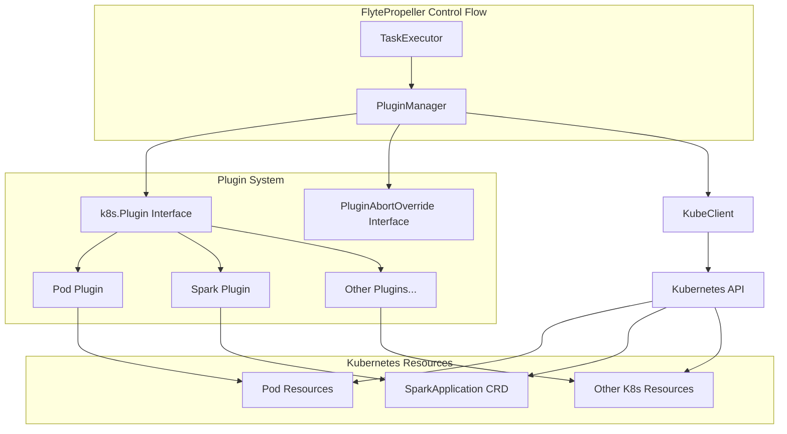
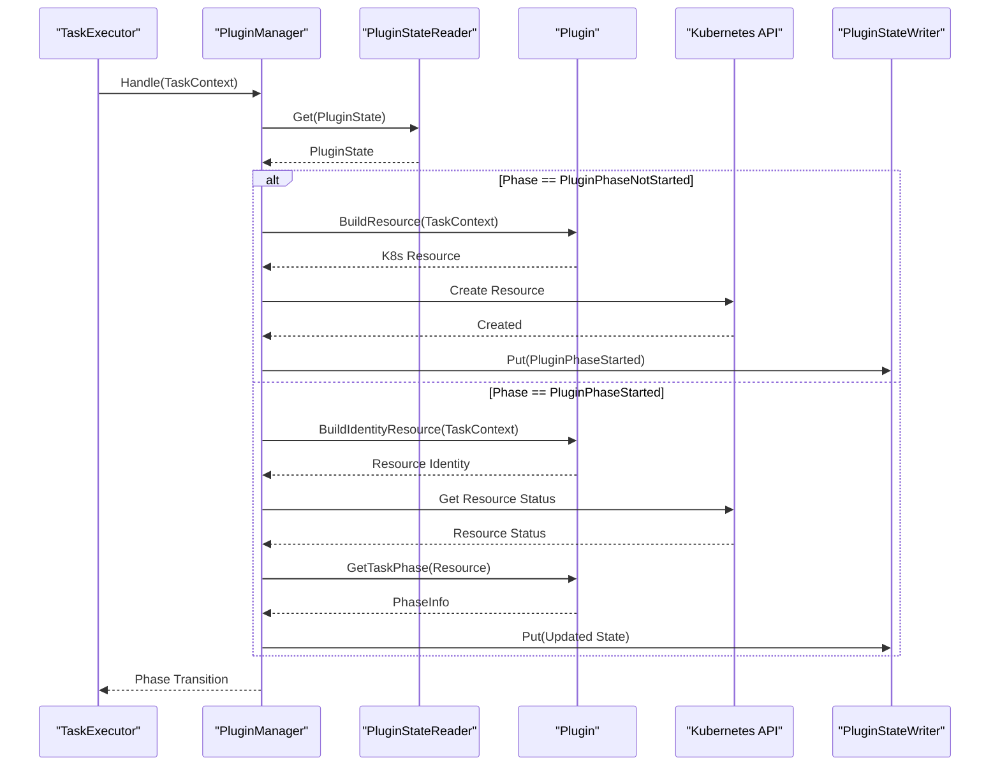
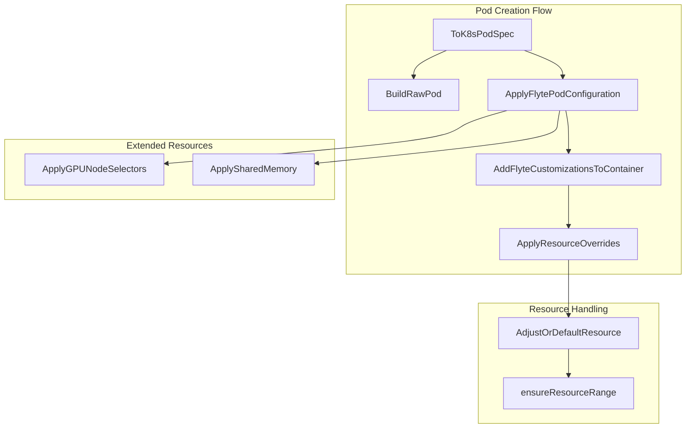

# Plugin System

<details>
<summary>Relevant source files</summary>

The following files were used as context for generating this wiki page:

- [flyteplugins/go/tasks/config_load_test.go](flyteplugins/go/tasks/config_load_test.go)
- [flyteplugins/go/tasks/pluginmachinery/core/mocks/fake_k8s_cache.go](flyteplugins/go/tasks/pluginmachinery/core/mocks/fake_k8s_cache.go)
- [flyteplugins/go/tasks/pluginmachinery/core/mocks/fake_k8s_client.go](flyteplugins/go/tasks/pluginmachinery/core/mocks/fake_k8s_client.go)
- [flyteplugins/go/tasks/pluginmachinery/flytek8s/config/config.go](flyteplugins/go/tasks/pluginmachinery/flytek8s/config/config.go)
- [flyteplugins/go/tasks/pluginmachinery/flytek8s/config/k8spluginconfig_flags.go](flyteplugins/go/tasks/pluginmachinery/flytek8s/config/k8spluginconfig_flags.go)
- [flyteplugins/go/tasks/pluginmachinery/flytek8s/config/k8spluginconfig_flags_test.go](flyteplugins/go/tasks/pluginmachinery/flytek8s/config/k8spluginconfig_flags_test.go)
- [flyteplugins/go/tasks/pluginmachinery/flytek8s/container_helper.go](flyteplugins/go/tasks/pluginmachinery/flytek8s/container_helper.go)
- [flyteplugins/go/tasks/pluginmachinery/flytek8s/container_helper_test.go](flyteplugins/go/tasks/pluginmachinery/flytek8s/container_helper_test.go)
- [flyteplugins/go/tasks/pluginmachinery/flytek8s/k8s_resource_adds.go](flyteplugins/go/tasks/pluginmachinery/flytek8s/k8s_resource_adds.go)
- [flyteplugins/go/tasks/pluginmachinery/flytek8s/k8s_resource_adds_test.go](flyteplugins/go/tasks/pluginmachinery/flytek8s/k8s_resource_adds_test.go)
- [flyteplugins/go/tasks/pluginmachinery/flytek8s/pod_helper.go](flyteplugins/go/tasks/pluginmachinery/flytek8s/pod_helper.go)
- [flyteplugins/go/tasks/pluginmachinery/flytek8s/pod_helper_test.go](flyteplugins/go/tasks/pluginmachinery/flytek8s/pod_helper_test.go)
- [flyteplugins/go/tasks/pluginmachinery/flytek8s/testdata/config.yaml](flyteplugins/go/tasks/pluginmachinery/flytek8s/testdata/config.yaml)
- [flyteplugins/go/tasks/plugins/array/k8s/integration_test.go](flyteplugins/go/tasks/plugins/array/k8s/integration_test.go)
- [flyteplugins/go/tasks/plugins/k8s/pod/container_test.go](flyteplugins/go/tasks/plugins/k8s/pod/container_test.go)
- [flyteplugins/go/tasks/plugins/k8s/pod/plugin.go](flyteplugins/go/tasks/plugins/k8s/pod/plugin.go)
- [flyteplugins/go/tasks/plugins/k8s/pod/sidecar_test.go](flyteplugins/go/tasks/plugins/k8s/pod/sidecar_test.go)
- [flyteplugins/go/tasks/plugins/k8s/spark/spark.go](flyteplugins/go/tasks/plugins/k8s/spark/spark.go)
- [flyteplugins/go/tasks/plugins/k8s/spark/spark_test.go](flyteplugins/go/tasks/plugins/k8s/spark/spark_test.go)
- [flyteplugins/go/tasks/testdata/config.yaml](flyteplugins/go/tasks/testdata/config.yaml)
- [flytepropeller/pkg/controller/nodes/task/backoff/controller.go](flytepropeller/pkg/controller/nodes/task/backoff/controller.go)
- [flytepropeller/pkg/controller/nodes/task/backoff/handler.go](flytepropeller/pkg/controller/nodes/task/backoff/handler.go)
- [flytepropeller/pkg/controller/nodes/task/backoff/handler_map.go](flytepropeller/pkg/controller/nodes/task/backoff/handler_map.go)
- [flytepropeller/pkg/controller/nodes/task/backoff/handler_test.go](flytepropeller/pkg/controller/nodes/task/backoff/handler_test.go)
- [flytepropeller/pkg/controller/nodes/task/backoff/safe_resourcelist.go](flytepropeller/pkg/controller/nodes/task/backoff/safe_resourcelist.go)
- [flytepropeller/pkg/controller/nodes/task/backoff/safe_resourcelist_test.go](flytepropeller/pkg/controller/nodes/task/backoff/safe_resourcelist_test.go)
- [flytepropeller/pkg/controller/nodes/task/config/config.go](flytepropeller/pkg/controller/nodes/task/config/config.go)
- [flytepropeller/pkg/controller/nodes/task/config/config_flags.go](flytepropeller/pkg/controller/nodes/task/config/config_flags.go)
- [flytepropeller/pkg/controller/nodes/task/config/config_flags_test.go](flytepropeller/pkg/controller/nodes/task/config/config_flags_test.go)
- [flytepropeller/pkg/controller/nodes/task/k8s/plugin_manager.go](flytepropeller/pkg/controller/nodes/task/k8s/plugin_manager.go)
- [flytepropeller/pkg/controller/nodes/task/k8s/plugin_manager_test.go](flytepropeller/pkg/controller/nodes/task/k8s/plugin_manager_test.go)
- [flytepropeller/pkg/controller/nodes/task/plugin_config.go](flytepropeller/pkg/controller/nodes/task/plugin_config.go)
- [flytepropeller/pkg/controller/nodes/task/plugin_config_test.go](flytepropeller/pkg/controller/nodes/task/plugin_config_test.go)

</details>


The Flyte Plugin System provides an extensible architecture for executing tasks on various backends, primarily focusing on Kubernetes-based execution environments. This page documents how plugins are structured, registered, and how they manage the task execution lifecycle within Flyte's architecture.

## Architecture Overview

The plugin system acts as the bridge between Flyte's workflow execution engine (FlytePropeller) and the underlying execution platform (primarily Kubernetes). It allows Flyte to support diverse task types and execution environments through a standardized interface.



Sources:
- [flytepropeller/pkg/controller/nodes/task/k8s/plugin_manager.go]()
- [flyteplugins/go/tasks/pluginmachinery/flytek8s/config/config.go]()
- [flyteplugins/go/tasks/plugins/k8s/pod/plugin.go]()
- [flyteplugins/go/tasks/plugins/k8s/spark/spark.go]()

## Plugin Interfaces

The core of the plugin system is the `k8s.Plugin` interface, which all Kubernetes-based plugins must implement:

```go
type Plugin interface {
    GetProperties() PluginProperties
    BuildResource(ctx context.Context, taskCtx core.TaskExecutionContext) (client.Object, error)
    BuildIdentityResource(ctx context.Context, taskCtx core.TaskExecutionMetadata) (client.Object, error)
    GetTaskPhase(ctx context.Context, pluginContext PluginContext, resource client.Object) (core.PhaseInfo, error)
}
```

Some plugins may also implement the optional `PluginAbortOverride` interface to customize abort behavior:

```go
type PluginAbortOverride interface {
    OnAbort(ctx context.Context, tCtx core.TaskExecutionContext, resource client.Object) (AbortBehavior, error)
}
```

Sources:
- [flytepropeller/pkg/controller/nodes/task/k8s/plugin_manager.go:105-129]()

## Plugin Manager

The `PluginManager` is the central orchestrator of the plugin system, managing the lifecycle of Kubernetes resources created by plugins:

```go
type PluginManager struct {
    id string
    plugin k8s.Plugin
    resourceToWatch runtime.Object
    kubeClient pluginsCore.KubeClient
    metrics PluginMetrics
    backOffController *backoff.Controller
    resourceLevelMonitor *ResourceMonitorIndex
    eventWatcher EventWatcher
    updateBaseBackoffDuration int
    updateBackoffRetries int
}
```

The manager implements several key methods:

| Method | Description |
|--------|-------------|
| `Handle` | Core execution method that creates resources and monitors status |
| `Abort` | Handles task abortion (cancellation) |
| `Finalize` | Performs cleanup after task completion |
| `GetProperties` | Returns plugin properties |

Sources:
- [flytepropeller/pkg/controller/nodes/task/k8s/plugin_manager.go:99-111]()
- [flytepropeller/pkg/controller/nodes/task/k8s/plugin_manager.go:332-408]()

## Plugin Execution Flow

The execution of a task through the plugin system follows a defined sequence:



Sources:
- [flytepropeller/pkg/controller/nodes/task/k8s/plugin_manager.go:332-408]()
- [flytepropeller/pkg/controller/nodes/task/k8s/plugin_manager.go:195-260]()
- [flytepropeller/pkg/controller/nodes/task/k8s/plugin_manager.go:272-330]()

## Plugin State

The plugin system maintains state through the `PluginState` structure:

```go
type PluginState struct {
    Phase PluginPhase
    K8sPluginState k8s.PluginState
    LastEventUpdate time.Time
}
```

The `PluginPhase` can be one of:
- `PluginPhaseNotStarted`: Initial state
- `PluginPhaseAllocationTokenAcquired`: Token acquired for resource allocation
- `PluginPhaseStarted`: Resource creation initiated

Sources:
- [flytepropeller/pkg/controller/nodes/task/k8s/plugin_manager.go:54-66]()

## Built-in Plugins

### Pod Plugin

The Pod plugin is the core plugin for container execution, handling both container and pod tasks:

```go
type plugin struct {}

func (plugin) BuildIdentityResource(_ context.Context, _ pluginsCore.TaskExecutionMetadata) (client.Object, error) {
    return flytek8s.BuildIdentityPod(), nil
}

func (p plugin) BuildResource(ctx context.Context, taskCtx pluginsCore.TaskExecutionContext) (client.Object, error) {
    // Build a pod resource based on the task template
}

func (p plugin) GetTaskPhase(ctx context.Context, pluginContext k8s.PluginContext, r client.Object) (pluginsCore.PhaseInfo, error) {
    // Determine the task phase based on the pod status
}
```

Sources:
- [flyteplugins/go/tasks/plugins/k8s/pod/plugin.go:39-147]()

### Spark Plugin

The Spark plugin executes Apache Spark applications on Kubernetes using the Spark Operator:

```go
type sparkResourceHandler struct {}

func (sparkResourceHandler) BuildResource(ctx context.Context, taskCtx pluginsCore.TaskExecutionContext) (client.Object, error) {
    // Parse the SparkJob custom structure from task template
    // Create spark config and driver/executor specs
    // Build a SparkApplication custom resource
}

func (sparkResourceHandler) GetTaskPhase(ctx context.Context, pluginContext k8s.PluginContext, resource client.Object) (pluginsCore.PhaseInfo, error) {
    // Determine the task phase based on the SparkApplication status
}
```

Sources:
- [flyteplugins/go/tasks/plugins/k8s/spark/spark.go:40-554]()

## Resource Management

### K8s Resource Creation

The plugin system provides utilities to build and customize Kubernetes resources:



Sources:
- [flyteplugins/go/tasks/pluginmachinery/flytek8s/pod_helper.go:325-626]()
- [flyteplugins/go/tasks/pluginmachinery/flytek8s/container_helper.go:44-190]()

### Resource Configuration

Resource requirements and limits can be configured at multiple levels:

| Configuration Level | Setting | Source |
|---------------------|---------|--------|
| Default | `DefaultCPURequest`, `DefaultMemoryRequest` | [flytek8s/config/config.go:102-104]() |
| GPU | `GpuResourceName`, `GpuDeviceNodeLabel` | [flytek8s/config/config.go:171-183]() |
| Node Selection | `DefaultNodeSelector`, `InterruptibleNodeSelector` | [flytek8s/config/config.go:109-126]() |
| Tolerations | `DefaultTolerations`, `InterruptibleTolerations` | [flytek8s/config/config.go:108-122]() |

Sources:
- [flyteplugins/go/tasks/pluginmachinery/flytek8s/config/config.go:80-217]()

### Backoff System

The plugin system includes a sophisticated backoff mechanism for handling resource constraints:

```go
type ComputeResourceAwareBackOffHandler struct {
    *SimpleBackOffBlocker
    *ComputeResourceCeilings
}
```

When resources are constrained, the system implements exponential backoff to prevent overwhelming the cluster:

```go
func (h *ComputeResourceAwareBackOffHandler) Handle(ctx context.Context, operation func() error, requestedResourceList v1.ResourceList) error {
    // Determine if the operation should proceed based on resource availability
    // Track resource ceilings to avoid scheduling tasks that exceed available resources
    // Implement exponential backoff when resources are constrained
}
```

Sources:
- [flytepropeller/pkg/controller/nodes/task/backoff/handler.go:111-192]()
- [flytepropeller/pkg/controller/nodes/task/k8s/plugin_manager.go:195-260]()

## Plugin Registration and Configuration

### Plugin Registration

Plugins are registered with the system during initialization:

```go
func init() {
    pluginmachinery.PluginRegistry().RegisterK8sPlugin(
        k8s.PluginEntry{
            ID: "spark",
            RegisteredTaskTypes: []pluginsCore.TaskType{"spark"},
            ResourceToWatch: &sparkOp.SparkApplication{},
            Plugin: sparkResourceHandler{},
            IsDefault: false,
        })
}
```

Sources:
- [flyteplugins/go/tasks/plugins/k8s/spark/spark.go:557-570]()

### Configuration

The `K8sPluginConfig` controls default behavior for all Kubernetes plugins:

```go
type K8sPluginConfig struct {
    InjectFinalizer bool
    DefaultAnnotations map[string]string
    DefaultLabels map[string]string
    DefaultEnvVars map[string]string
    DefaultCPURequest resource.Quantity
    DefaultMemoryRequest resource.Quantity
    SchedulerName string
    // ... many more fields
}
```

This configuration can be set via YAML:

```yaml
plugins:
  k8s:
    inject-finalizer: true
    default-annotations:
      cluster-autoscaler.kubernetes.io/safe-to-evict: "false"
    default-cpus: 1000m
    default-memory: 1024Mi
    scheduler-name: flyte-scheduler
```

Sources:
- [flyteplugins/go/tasks/pluginmachinery/flytek8s/config/config.go:80-217]()
- [flyteplugins/go/tasks/testdata/config.yaml:1-20]()

## Creating Custom Plugins

To create a custom plugin for a new task type or execution backend:

1. Implement the `k8s.Plugin` interface
2. Define a custom resource type or use existing Kubernetes resources
3. Register your plugin with the system during initialization

Example skeleton for a custom plugin:

```go
// 1. Define your plugin
type MyPlugin struct {}

func (MyPlugin) GetProperties() k8s.PluginProperties { ... }
func (MyPlugin) BuildResource(ctx context.Context, taskCtx pluginsCore.TaskExecutionContext) (client.Object, error) { ... }
func (MyPlugin) BuildIdentityResource(ctx context.Context, taskCtx pluginsCore.TaskExecutionMetadata) (client.Object, error) { ... }
func (MyPlugin) GetTaskPhase(ctx context.Context, pluginContext k8s.PluginContext, resource client.Object) (pluginsCore.PhaseInfo, error) { ... }

// 2. Register your plugin
func init() {
    pluginmachinery.PluginRegistry().RegisterK8sPlugin(
        k8s.PluginEntry{
            ID: "my-plugin",
            RegisteredTaskTypes: []pluginsCore.TaskType{"my-task-type"},
            ResourceToWatch: &MyResource{},
            Plugin: MyPlugin{},
            IsDefault: false,
        })
}
```

Sources:
- [flyteplugins/go/tasks/plugins/k8s/spark/spark.go:40-70]()
- [flyteplugins/go/tasks/plugins/k8s/spark/spark.go:557-570]()

## Enabling and Configuring Plugins

Plugins can be selectively enabled through the task configuration:

```go
func WranglePluginsAndGenerateFinalList(ctx context.Context, cfg *config.TaskPluginConfig, pr PluginRegistryIface,
    kubeClientset kubernetes.Interface) (enabledPlugins []core.PluginEntry, defaultForTaskTypes map[pluginID][]taskType, err error) {
    
    // Load plugin configuration
    pluginsConfigMeta, err := cfg.GetEnabledPlugins()
    
    // Determine which plugins to enable
    allPluginsEnabled := pluginsConfigMeta.EnabledPlugins.Len() == 0
    
    // Create controllers and register plugins
    backOffController := backoff.NewController(ctx)
    monitorIndex := k8s.NewResourceMonitorIndex()
    
    // ... enable and configure plugins
}
```

Sources:
- [flytepropeller/pkg/controller/nodes/task/plugin_config.go:20-73]()

This plugin system architecture enables Flyte to execute tasks on various backends while maintaining a consistent execution model and providing robust resource management capabilities.