# Kubernetes Plugin Machinery

Relevant source files

The following files were used as context for generating this wiki page:

- [flyteplugins/go/tasks/config_load_test.go](flyteplugins/go/tasks/config_load_test.go)
- [flyteplugins/go/tasks/pluginmachinery/core/mocks/fake_k8s_cache.go](flyteplugins/go/tasks/pluginmachinery/core/mocks/fake_k8s_cache.go)
- [flyteplugins/go/tasks/pluginmachinery/core/mocks/fake_k8s_client.go](flyteplugins/go/tasks/pluginmachinery/core/mocks/fake_k8s_client.go)
- [flyteplugins/go/tasks/pluginmachinery/flytek8s/config/config.go](flyteplugins/go/tasks/pluginmachinery/flytek8s/config/config.go)
- [flyteplugins/go/tasks/pluginmachinery/flytek8s/config/k8spluginconfig_flags.go](flyteplugins/go/tasks/pluginmachinery/flytek8s/config/k8spluginconfig_flags.go)
- [flyteplugins/go/tasks/pluginmachinery/flytek8s/config/k8spluginconfig_flags_test.go](flyteplugins/go/tasks/pluginmachinery/flytek8s/config/k8spluginconfig_flags_test.go)
- [flyteplugins/go/tasks/pluginmachinery/flytek8s/container_helper.go](flyteplugins/go/tasks/pluginmachinery/flytek8s/container_helper.go)
- [flyteplugins/go/tasks/pluginmachinery/flytek8s/container_helper_test.go](flyteplugins/go/tasks/pluginmachinery/flytek8s/container_helper_test.go)
- [flyteplugins/go/tasks/pluginmachinery/flytek8s/k8s_resource_adds.go](flyteplugins/go/tasks/pluginmachinery/flytek8s/k8s_resource_adds.go)
- [flyteplugins/go/tasks/pluginmachinery/flytek8s/k8s_resource_adds_test.go](flyteplugins/go/tasks/pluginmachinery/flytek8s/k8s_resource_adds_test.go)
- [flyteplugins/go/tasks/pluginmachinery/flytek8s/pod_helper.go](flyteplugins/go/tasks/pluginmachinery/flytek8s/pod_helper.go)
- [flyteplugins/go/tasks/pluginmachinery/flytek8s/pod_helper_test.go](flyteplugins/go/tasks/pluginmachinery/flytek8s/pod_helper_test.go)
- [flyteplugins/go/tasks/pluginmachinery/flytek8s/testdata/config.yaml](flyteplugins/go/tasks/pluginmachinery/flytek8s/testdata/config.yaml)
- [flyteplugins/go/tasks/plugins/array/k8s/integration_test.go](flyteplugins/go/tasks/plugins/array/k8s/integration_test.go)
- [flyteplugins/go/tasks/plugins/k8s/pod/container_test.go](flyteplugins/go/tasks/plugins/k8s/pod/container_test.go)
- [flyteplugins/go/tasks/plugins/k8s/pod/plugin.go](flyteplugins/go/tasks/plugins/k8s/pod/plugin.go)
- [flyteplugins/go/tasks/plugins/k8s/pod/sidecar_test.go](flyteplugins/go/tasks/plugins/k8s/pod/sidecar_test.go)
- [flyteplugins/go/tasks/plugins/k8s/spark/spark.go](flyteplugins/go/tasks/plugins/k8s/spark/spark.go)
- [flyteplugins/go/tasks/plugins/k8s/spark/spark_test.go](flyteplugins/go/tasks/plugins/k8s/spark/spark_test.go)
- [flyteplugins/go/tasks/testdata/config.yaml](flyteplugins/go/tasks/testdata/config.yaml)
- [flytepropeller/pkg/controller/nodes/task/backoff/controller.go](flytepropeller/pkg/controller/nodes/task/backoff/controller.go)
- [flytepropeller/pkg/controller/nodes/task/backoff/handler.go](flytepropeller/pkg/controller/nodes/task/backoff/handler.go)
- [flytepropeller/pkg/controller/nodes/task/backoff/handler_map.go](flytepropeller/pkg/controller/nodes/task/backoff/handler_map.go)
- [flytepropeller/pkg/controller/nodes/task/backoff/handler_test.go](flytepropeller/pkg/controller/nodes/task/backoff/handler_test.go)
- [flytepropeller/pkg/controller/nodes/task/backoff/safe_resourcelist.go](flytepropeller/pkg/controller/nodes/task/backoff/safe_resourcelist.go)
- [flytepropeller/pkg/controller/nodes/task/backoff/safe_resourcelist_test.go](flytepropeller/pkg/controller/nodes/task/backoff/safe_resourcelist_test.go)
- [flytepropeller/pkg/controller/nodes/task/config/config.go](flytepropeller/pkg/controller/nodes/task/config/config.go)
- [flytepropeller/pkg/controller/nodes/task/config/config_flags.go](flytepropeller/pkg/controller/nodes/task/config/config_flags.go)
- [flytepropeller/pkg/controller/nodes/task/config/config_flags_test.go](flytepropeller/pkg/controller/nodes/task/config/config_flags_test.go)
- [flytepropeller/pkg/controller/nodes/task/k8s/plugin_manager.go](flytepropeller/pkg/controller/nodes/task/k8s/plugin_manager.go)
- [flytepropeller/pkg/controller/nodes/task/k8s/plugin_manager_test.go](flytepropeller/pkg/controller/nodes/task/k8s/plugin_manager_test.go)
- [flytepropeller/pkg/controller/nodes/task/plugin_config.go](flytepropeller/pkg/controller/nodes/task/plugin_config.go)
- [flytepropeller/pkg/controller/nodes/task/plugin_config_test.go](flytepropeller/pkg/controller/nodes/task/plugin_config_test.go)

This page documents the Kubernetes Plugin Machinery in Flyte, which provides the framework for converting Flyte tasks to Kubernetes resources, managing their lifecycle, monitoring execution status, and handling resource customization. This is a core component that enables Flyte to execute tasks on Kubernetes clusters.

## Overview

The Kubernetes Plugin Machinery is responsible for translating logical Flyte task definitions into physical Kubernetes resources and managing their execution. It provides a standardized approach for creating, monitoring, and cleaning up these resources, with support for various resource types beyond basic Pods (such as Spark applications, MPI jobs, etc.).

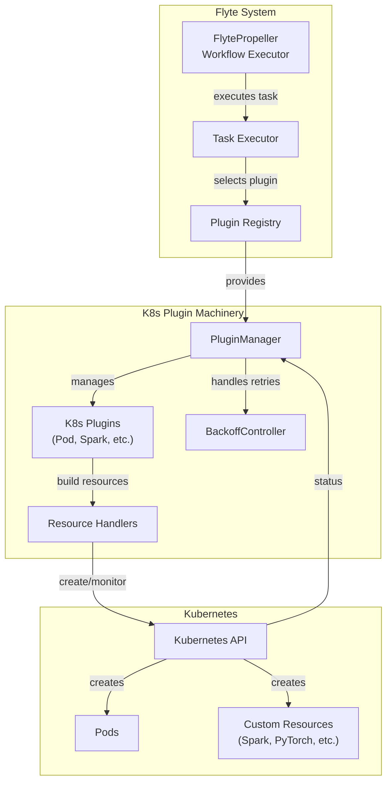

Sources:
- [flytepropeller/pkg/controller/nodes/task/k8s/plugin_manager.go:99-111](flytepropeller/pkg/controller/nodes/task/k8s/plugin_manager.go:99-111)
- [flyteplugins/go/tasks/pluginmachinery/flytek8s/pod_helper.go:26-40](flyteplugins/go/tasks/pluginmachinery/flytek8s/pod_helper.go:26-40)

## Core Components

### Plugin Manager

The `PluginManager` is the central component responsible for orchestrating the lifecycle of Kubernetes resources. It handles task execution, monitoring, and cleanup, providing a consistent interface between Flyte and Kubernetes.

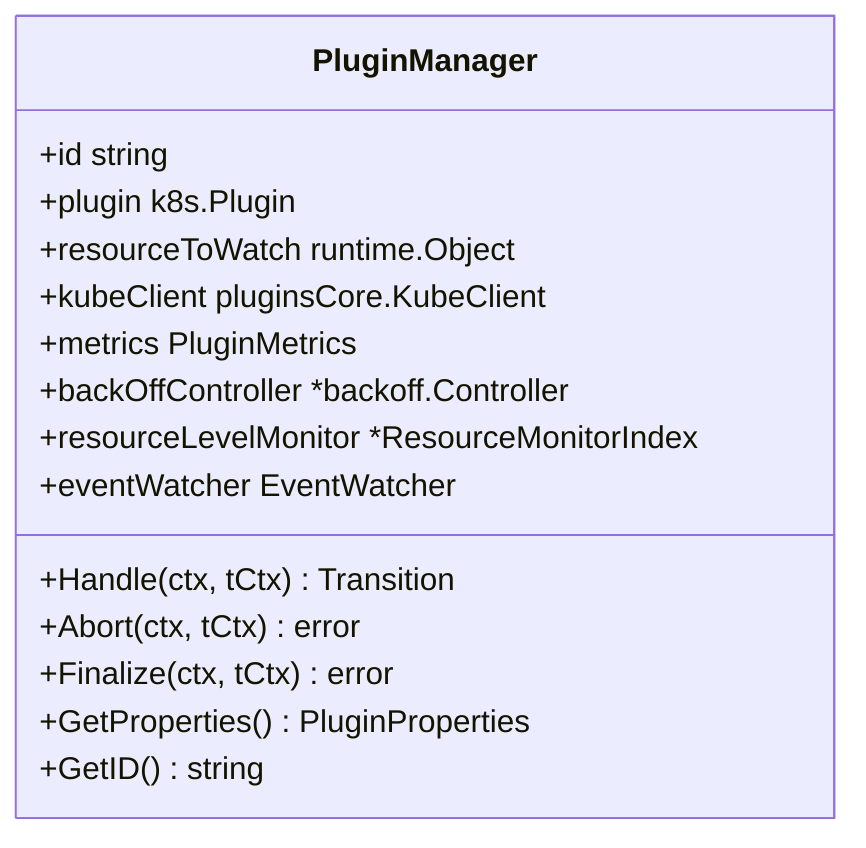

Key methods:
- `Handle`: Main entry point for task execution
- `Abort`: Handles task abortion
- `Finalize`: Cleans up resources after execution
- `launchResource`: Creates the Kubernetes resource
- `checkResourcePhase`: Interprets resource state as task phase

Sources:
- [flytepropeller/pkg/controller/nodes/task/k8s/plugin_manager.go:99-111](flytepropeller/pkg/controller/nodes/task/k8s/plugin_manager.go:99-111)
- [flytepropeller/pkg/controller/nodes/task/k8s/plugin_manager.go:132-142](flytepropeller/pkg/controller/nodes/task/k8s/plugin_manager.go:132-142)
- [flytepropeller/pkg/controller/nodes/task/k8s/plugin_manager.go:332-407](flytepropeller/pkg/controller/nodes/task/k8s/plugin_manager.go:332-407)

### Plugin Interface

All Kubernetes plugins must implement the `k8s.Plugin` interface, which defines how to create resources from tasks and interpret their execution status.

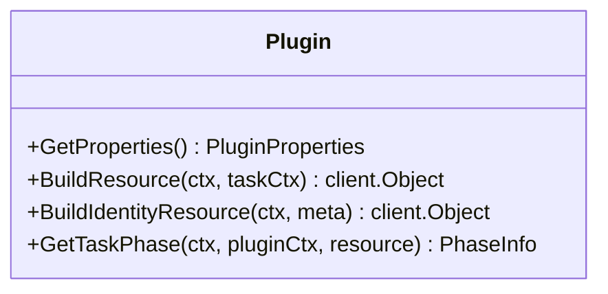

Key methods:
- `GetProperties`: Returns plugin configuration properties
- `BuildResource`: Creates a full Kubernetes resource from a task
- `BuildIdentityResource`: Creates a minimal resource for lookups
- `GetTaskPhase`: Determines task execution phase from resource state

Sources:
- [flyteplugins/go/tasks/plugins/k8s/pod/plugin.go:39-41](flyteplugins/go/tasks/plugins/k8s/pod/plugin.go:39-41)
- [flyteplugins/go/tasks/plugins/k8s/spark/spark.go:40-57](flyteplugins/go/tasks/plugins/k8s/spark/spark.go:40-57)

### Configuration System

The configuration system defined in `K8sPluginConfig` provides a rich set of options for customizing how resources are created and managed.

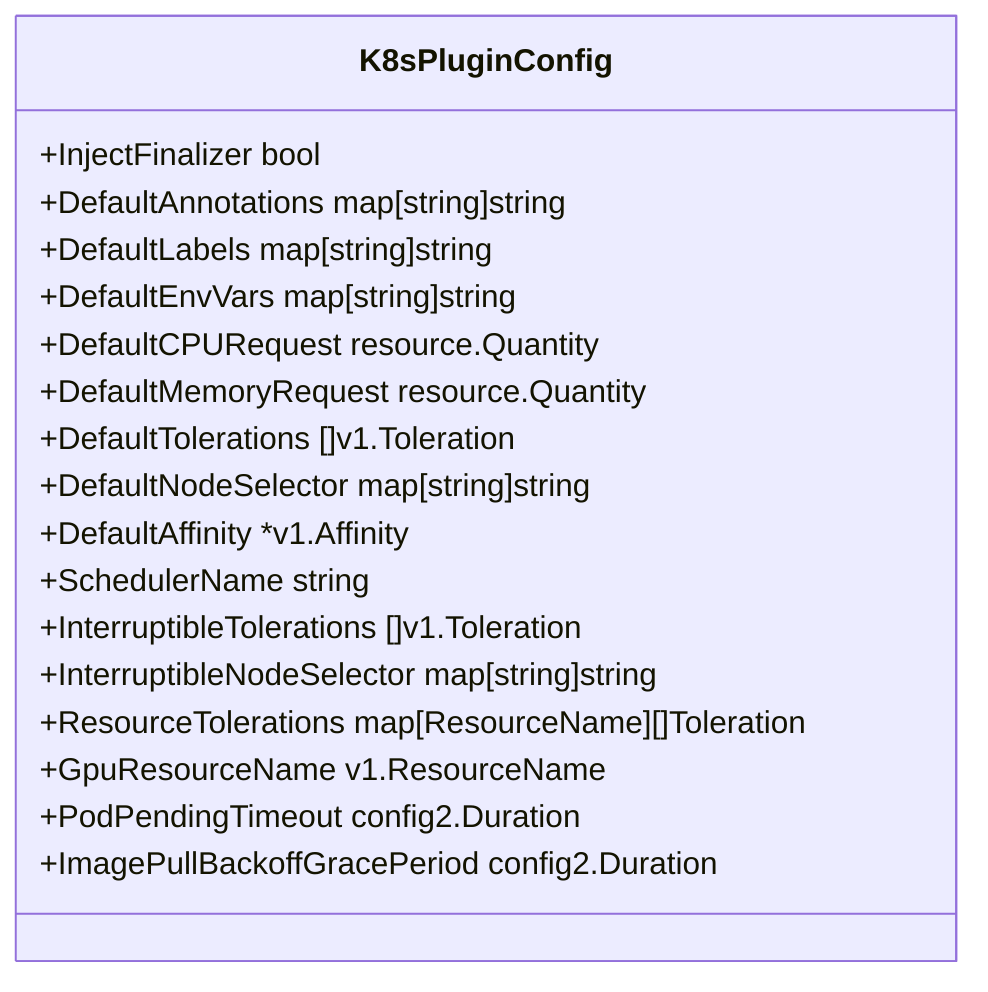

Sources:
- [flyteplugins/go/tasks/pluginmachinery/flytek8s/config/config.go:80-255](flyteplugins/go/tasks/pluginmachinery/flytek8s/config/config.go:80-255)

## Execution Workflow

The execution workflow shows how a Flyte task is transformed into a Kubernetes resource and monitored through completion.

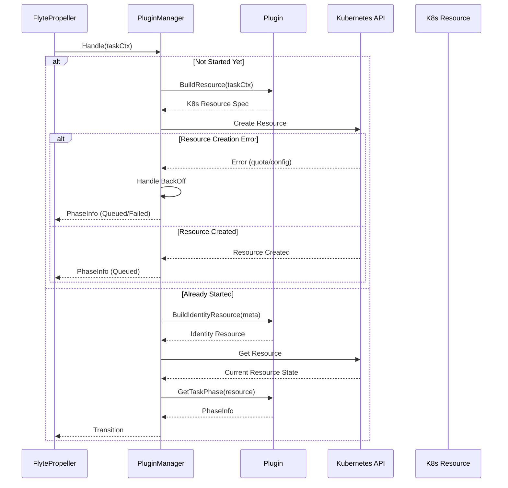

Sources:
- [flytepropeller/pkg/controller/nodes/task/k8s/plugin_manager.go:332-407](flytepropeller/pkg/controller/nodes/task/k8s/plugin_manager.go:332-407)
- [flytepropeller/pkg/controller/nodes/task/k8s/plugin_manager.go:195-260](flytepropeller/pkg/controller/nodes/task/k8s/plugin_manager.go:195-260)
- [flytepropeller/pkg/controller/nodes/task/k8s/plugin_manager.go:272-330](flytepropeller/pkg/controller/nodes/task/k8s/plugin_manager.go:272-330)

## Resource Customization

One of the key features of the Kubernetes Plugin Machinery is its ability to customize Kubernetes resources with Flyte-specific configurations.

### Pod Helper Functions

The `flytek8s` package provides a rich set of functions for customizing Kubernetes pods:

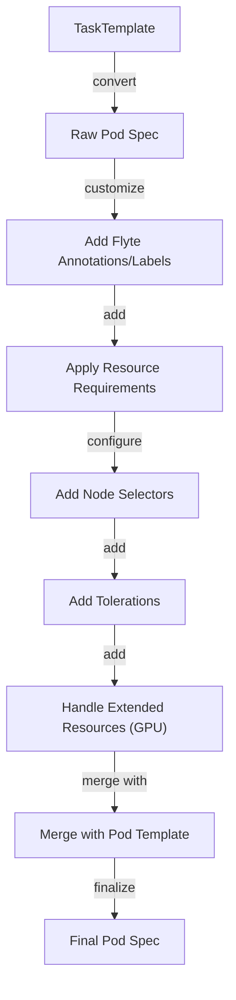

Key customization functions:
- `ToK8sPodSpec`: Main entry point for pod customization
- `BuildRawPod`: Creates basic pod spec from task template
- `ApplyFlytePodConfiguration`: Applies Flyte-specific configurations
- `UpdatePod`: Updates pod with default configurations
- `ApplyInterruptibleNodeAffinity`: Handles interruptible task scheduling
- `ApplyGPUNodeSelectors`: Configures GPU-specific node selection

Sources:
- [flyteplugins/go/tasks/pluginmachinery/flytek8s/pod_helper.go:608-626](flyteplugins/go/tasks/pluginmachinery/flytek8s/pod_helper.go:608-626)
- [flyteplugins/go/tasks/pluginmachinery/flytek8s/pod_helper.go:425-532](flyteplugins/go/tasks/pluginmachinery/flytek8s/pod_helper.go:425-532)
- [flyteplugins/go/tasks/pluginmachinery/flytek8s/pod_helper.go:283-315](flyteplugins/go/tasks/pluginmachinery/flytek8s/pod_helper.go:283-315)

### Resource Requirements

The machinery provides sophisticated handling of resource requirements:

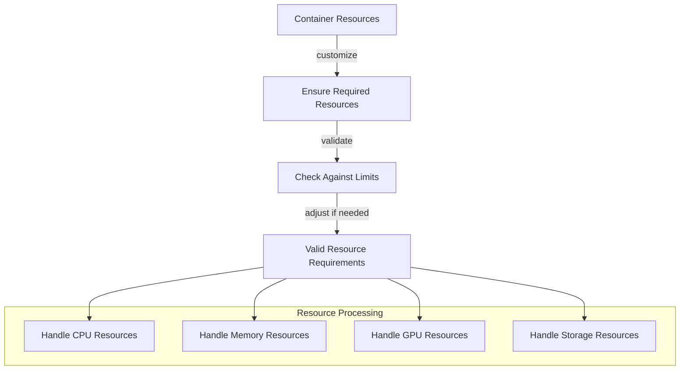

Sources:
- [flyteplugins/go/tasks/pluginmachinery/flytek8s/container_helper.go:71-113](flyteplugins/go/tasks/pluginmachinery/flytek8s/container_helper.go:71-113)
- [flyteplugins/go/tasks/pluginmachinery/flytek8s/container_helper.go:150-190](flyteplugins/go/tasks/pluginmachinery/flytek8s/container_helper.go:150-190)

### Extended Resources: GPU Support

The system has special handling for GPU resources, including device selection and partition sizes:

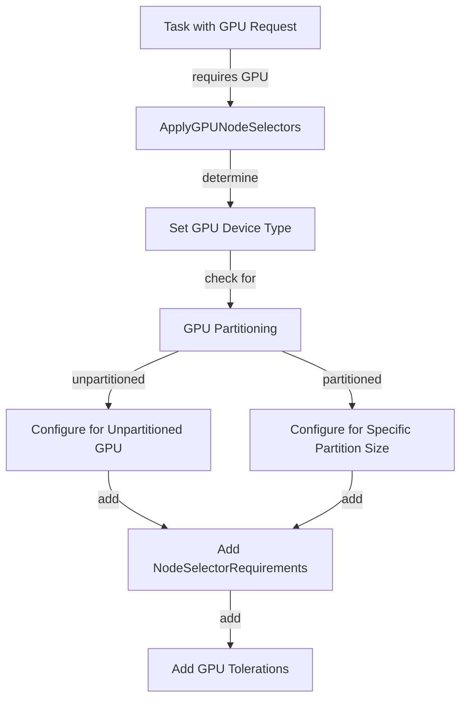

Sources:
- [flyteplugins/go/tasks/pluginmachinery/flytek8s/pod_helper.go:199-281](flyteplugins/go/tasks/pluginmachinery/flytek8s/pod_helper.go:199-281)

### Pod Templates

The machinery supports pod templates for consistent pod configurations:

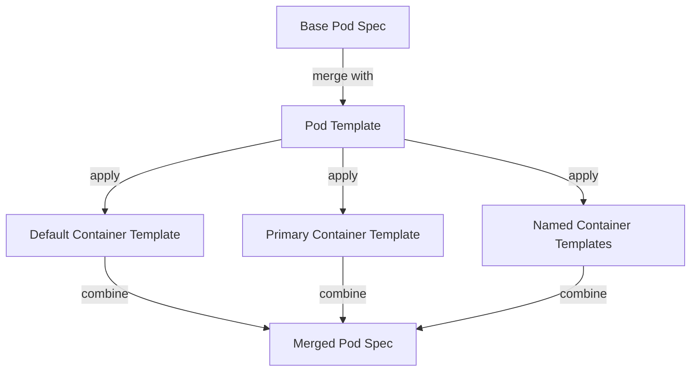

Sources:
- [flyteplugins/go/tasks/pluginmachinery/flytek8s/pod_helper.go:665-690](flyteplugins/go/tasks/pluginmachinery/flytek8s/pod_helper.go:665-690)
- [flyteplugins/go/tasks/pluginmachinery/flytek8s/pod_helper.go:695-836](flyteplugins/go/tasks/pluginmachinery/flytek8s/pod_helper.go:695-836)

## BackOff Handling and Resource Management

The Kubernetes Plugin Machinery includes sophisticated backoff handling for resource quota management.

### BackOff Controller

The `BackOffController` manages backoff strategies for resource creation:

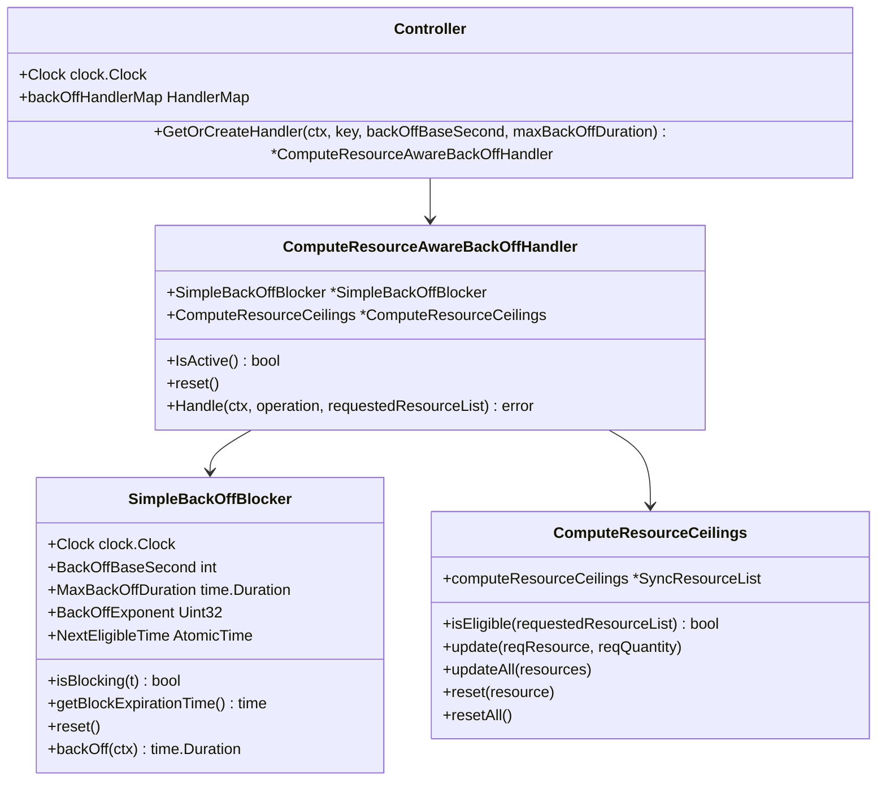

The backoff system provides:
- Exponential backoff for transient errors
- Resource ceiling tracking to avoid futile retries
- Efficient management of cluster resources

Sources:
- [flytepropeller/pkg/controller/nodes/task/backoff/handler.go:26-193](flytepropeller/pkg/controller/nodes/task/backoff/handler.go:26-193)
- [flytepropeller/pkg/controller/nodes/task/k8s/plugin_manager.go:195-260](flytepropeller/pkg/controller/nodes/task/k8s/plugin_manager.go:195-260)

### Resource Creation with BackOff

The resource creation process integrates with the backoff controller:

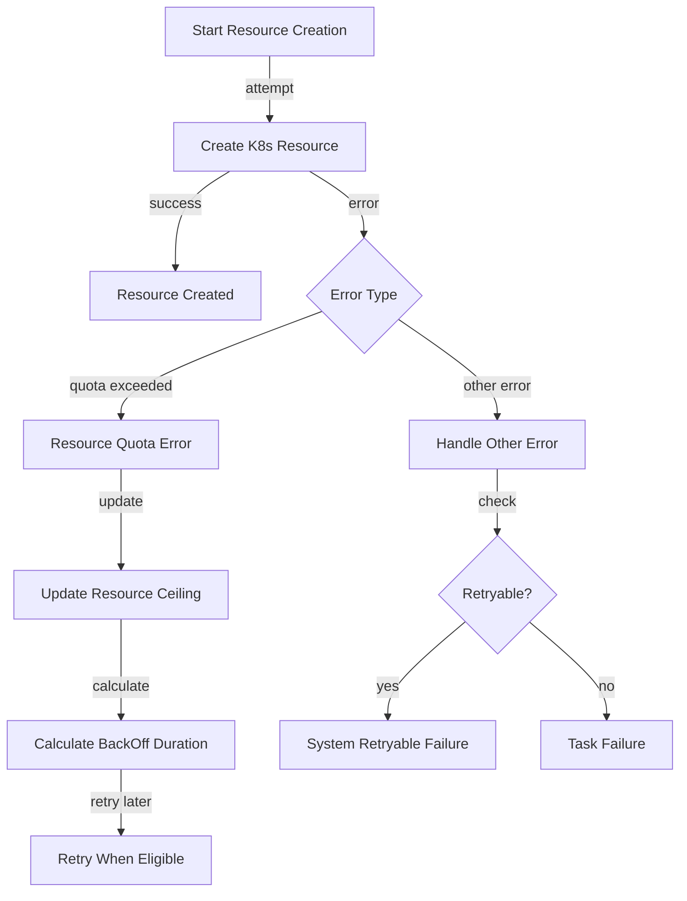

Sources:
- [flytepropeller/pkg/controller/nodes/task/k8s/plugin_manager.go:195-260](flytepropeller/pkg/controller/nodes/task/k8s/plugin_manager.go:195-260)
- [flytepropeller/pkg/controller/nodes/task/backoff/handler.go:128-193](flytepropeller/pkg/controller/nodes/task/backoff/handler.go:128-193)

## Plugin Examples

The Kubernetes Plugin Machinery supports various plugins for different resource types.

### Pod Plugin

The Pod Plugin is the most basic plugin, creating standard Kubernetes pods:

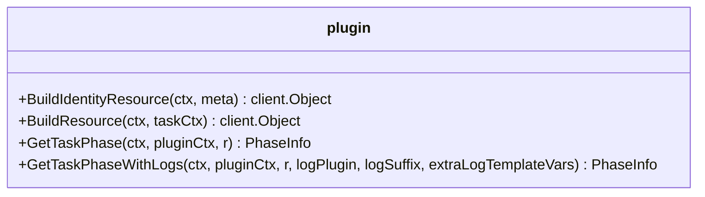

Sources:
- [flyteplugins/go/tasks/plugins/k8s/pod/plugin.go:39-41](flyteplugins/go/tasks/plugins/k8s/pod/plugin.go:39-41)
- [flyteplugins/go/tasks/plugins/k8s/pod/plugin.go:44-138](flyteplugins/go/tasks/plugins/k8s/pod/plugin.go:44-138)

### Spark Plugin

The Spark Plugin demonstrates a more complex plugin for SparkApplication custom resources:

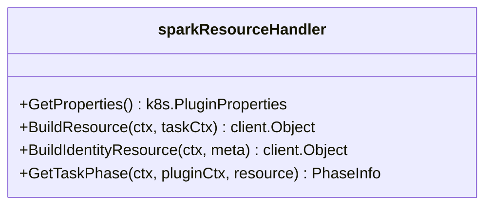

Key components:
- `createSparkApplication`: Creates SparkApplication custom resource
- `createDriverSpec`: Configures Spark driver
- `createExecutorSpec`: Configures Spark executors
- `getSparkConfig`: Manages Spark configuration

Sources:
- [flyteplugins/go/tasks/plugins/k8s/spark/spark.go:40-57](flyteplugins/go/tasks/plugins/k8s/spark/spark.go:40-57)
- [flyteplugins/go/tasks/plugins/k8s/spark/spark.go:59-89](flyteplugins/go/tasks/plugins/k8s/spark/spark.go:59-89)
- [flyteplugins/go/tasks/plugins/k8s/spark/spark.go:91-135](flyteplugins/go/tasks/plugins/k8s/spark/spark.go:91-135)

## Plugin Registration and Integration

The plugin system integrates with the Flyte workflow executor:

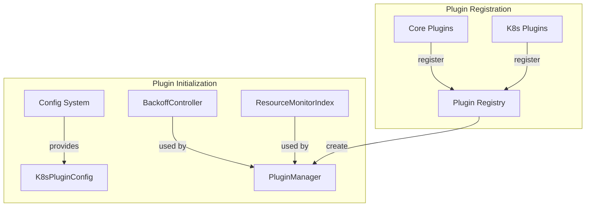

Sources:
- [flytepropeller/pkg/controller/nodes/task/plugin_config.go:20-98](flytepropeller/pkg/controller/nodes/task/plugin_config.go:20-98)
- [flyteplugins/go/tasks/plugins/k8s/spark/spark.go:557-569](flyteplugins/go/tasks/plugins/k8s/spark/spark.go:557-569)

## Summary

The Kubernetes Plugin Machinery provides a powerful and flexible framework for executing Flyte tasks on Kubernetes. Key features include:

1. A plugin-based architecture that supports various resource types
2. Extensive resource customization capabilities
3. Sophisticated error handling and backoff mechanisms
4. Support for extended resources like GPUs
5. Templating for consistent resource configurations

This system enables Flyte to leverage the full power of Kubernetes while providing a consistent and reliable task execution environment.

Sources:
- [flytepropeller/pkg/controller/nodes/task/k8s/plugin_manager.go](flytepropeller/pkg/controller/nodes/task/k8s/plugin_manager.go)
- [flyteplugins/go/tasks/pluginmachinery/flytek8s/pod_helper.go](flyteplugins/go/tasks/pluginmachinery/flytek8s/pod_helper.go)
- [flyteplugins/go/tasks/pluginmachinery/flytek8s/config/config.go](flyteplugins/go/tasks/pluginmachinery/flytek8s/config/config.go)