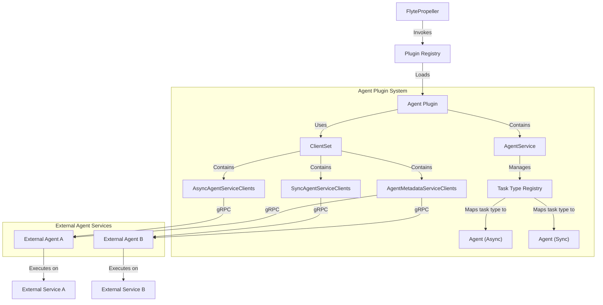
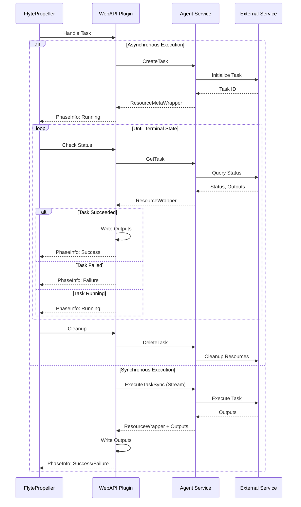
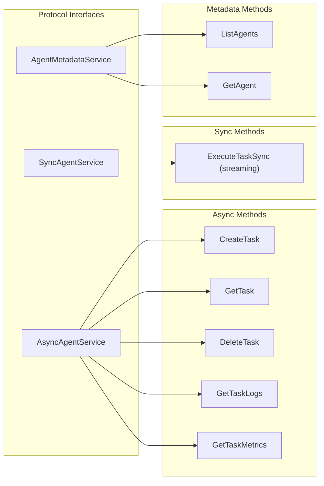
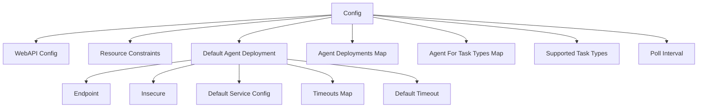
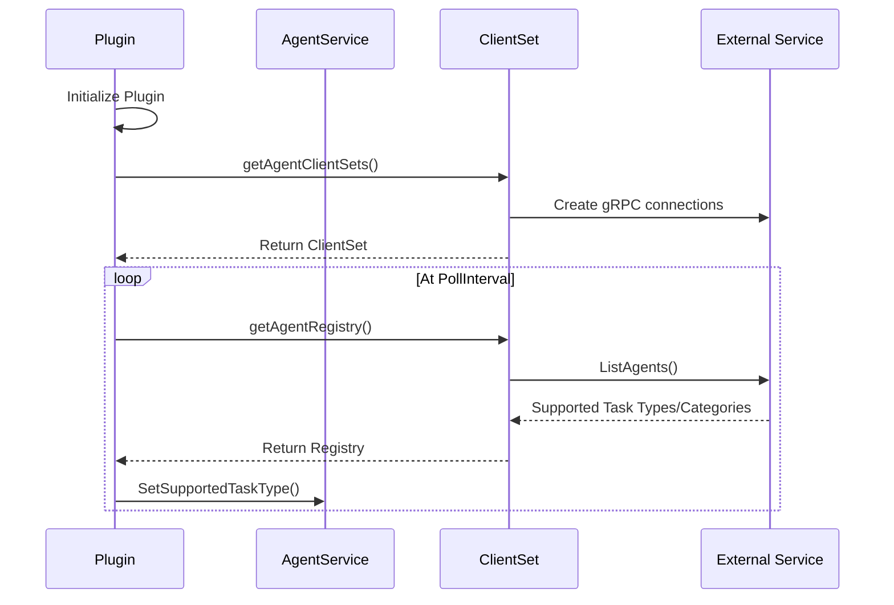

# WebAPI Plugins

<details>
<summary>Relevant source files</summary>

The following files were used as context for generating this wiki page:

- [flyteidl/gen/pb-es/flyteidl/admin/agent_pb.ts](flyteidl/gen/pb-es/flyteidl/admin/agent_pb.ts)
- [flyteidl/gen/pb-go/flyteidl/admin/agent.pb.go](flyteidl/gen/pb-go/flyteidl/admin/agent.pb.go)
- [flyteidl/gen/pb_python/flyteidl/admin/agent_pb2.py](flyteidl/gen/pb_python/flyteidl/admin/agent_pb2.py)
- [flyteidl/gen/pb_python/flyteidl/admin/agent_pb2.pyi](flyteidl/gen/pb_python/flyteidl/admin/agent_pb2.pyi)
- [flyteidl/gen/pb_rust/flyteidl.admin.rs](flyteidl/gen/pb_rust/flyteidl.admin.rs)
- [flyteidl/protos/flyteidl/admin/agent.proto](flyteidl/protos/flyteidl/admin/agent.proto)
- [flyteplugins/go/tasks/plugins/webapi/agent/client.go](flyteplugins/go/tasks/plugins/webapi/agent/client.go)
- [flyteplugins/go/tasks/plugins/webapi/agent/client_test.go](flyteplugins/go/tasks/plugins/webapi/agent/client_test.go)
- [flyteplugins/go/tasks/plugins/webapi/agent/config.go](flyteplugins/go/tasks/plugins/webapi/agent/config.go)
- [flyteplugins/go/tasks/plugins/webapi/agent/config_test.go](flyteplugins/go/tasks/plugins/webapi/agent/config_test.go)
- [flyteplugins/go/tasks/plugins/webapi/agent/integration_test.go](flyteplugins/go/tasks/plugins/webapi/agent/integration_test.go)
- [flyteplugins/go/tasks/plugins/webapi/agent/plugin.go](flyteplugins/go/tasks/plugins/webapi/agent/plugin.go)
- [flyteplugins/go/tasks/plugins/webapi/agent/plugin_test.go](flyteplugins/go/tasks/plugins/webapi/agent/plugin_test.go)

</details>


WebAPI plugins in Flyte provide a mechanism to execute tasks on external services through web-based APIs. Unlike Kubernetes plugins which run workloads directly in the cluster, WebAPI plugins enable integration with external services like BigQuery, Snowflake, Athena, and custom agent-based services. This document explains the architecture and functionality of the WebAPI plugin system, focusing specifically on the agent-based implementation.

For information about Kubernetes-based plugins, see [Kubernetes Plugin Machinery](#4.1).
For information about machine learning specific plugins, see [Machine Learning Operators](#4.3).

## WebAPI Plugin Architecture

The WebAPI plugin system is built on an agent-based architecture that allows Flyte to communicate with external services.



Sources: [flyteplugins/go/tasks/plugins/webapi/agent/plugin.go:29-35](), [flyteplugins/go/tasks/plugins/webapi/agent/plugin.go:53-59](), [flyteplugins/go/tasks/plugins/webapi/agent/client.go:35-40]()

### Key Components

1. **Agent Plugin**: The main WebAPI plugin implementation that connects to external agent services.
   
2. **AgentService**: Manages the set of supported task types and routes tasks to appropriate agents.
   
3. **Registry**: Maps task types to specific agent implementations.
   
4. **ClientSet**: Contains gRPC clients for communicating with external agent services:
   - AsyncAgentServiceClient: For asynchronous task execution
   - SyncAgentServiceClient: For synchronous task execution
   - AgentMetadataServiceClient: For discovering agent capabilities

5. **External Agent Services**: Remote services that implement the Flyte agent protocol and execute tasks.

### Agent Types

WebAPI plugins support two types of agent execution models:

1. **Synchronous Agents**: Execute tasks and return results in the same request. This is suitable for quick operations that complete within a short timeframe.

2. **Asynchronous Agents**: Accept task requests, return a task ID, and allow polling for status and results. This is appropriate for long-running operations.

Sources: [flyteplugins/go/tasks/plugins/webapi/agent/client.go:24-33](), [flyteplugins/go/tasks/plugins/webapi/agent/plugin.go:133-146](), [flyteplugins/go/tasks/plugins/webapi/agent/plugin.go:169-204]()

## Task Execution Flow

The task execution flow in WebAPI plugins varies depending on whether the agent is synchronous or asynchronous.



Sources: [flyteplugins/go/tasks/plugins/webapi/agent/plugin.go:100-167](), [flyteplugins/go/tasks/plugins/webapi/agent/plugin.go:169-228](), [flyteplugins/go/tasks/plugins/webapi/agent/plugin.go:288-341]()

### Asynchronous Task Execution

1. **Create Phase**:
   - Plugin determines the appropriate agent for the task type
   - The `Create` method sends a `CreateTaskRequest` to the agent
   - Agent returns a `CreateTaskResponse` with resource metadata
   - Plugin stores the resource metadata for future status checks

2. **Status Check Phase**:
   - The `Get` method sends a `GetTaskRequest` with the resource metadata
   - Agent returns a `GetTaskResponse` with current resource state
   - Plugin maps the resource state to a Flyte `PhaseInfo`

3. **Cleanup Phase**:
   - The `Delete` method sends a `DeleteTaskRequest` to clean up resources

Sources: [flyteplugins/go/tasks/plugins/webapi/agent/plugin.go:100-167](), [flyteplugins/go/tasks/plugins/webapi/agent/plugin.go:230-285](), [flyteplugins/go/tasks/plugins/webapi/agent/plugin.go:262-286]()

### Synchronous Task Execution

1. **Execute Phase**:
   - Plugin determines the appropriate agent for the task type
   - The `ExecuteTaskSync` method sends task and inputs to the agent via streaming
   - Agent processes the task and returns outputs in the same stream
   - Plugin processes outputs and maps to a Flyte `PhaseInfo`

Sources: [flyteplugins/go/tasks/plugins/webapi/agent/plugin.go:169-228]()

### Phase Mapping

The WebAPI plugin maps agent resource states to Flyte phases:

| Agent Phase | Flyte Phase | Description |
|-------------|-------------|-------------|
| QUEUED | PhaseQueued | Task is queued |
| WAITING_FOR_RESOURCES | PhaseWaitingForResources | Task is waiting for resources |
| INITIALIZING | PhaseInitializing | Task is initializing |
| RUNNING | PhaseRunning | Task is actively running |
| SUCCEEDED | PhaseSuccess | Task completed successfully |
| FAILED | PhaseFailure | Task failed |
| ABORTED | PhaseFailure | Task was aborted |

Sources: [flyteplugins/go/tasks/plugins/webapi/agent/plugin.go:288-341]()

## Agent Service Protocol

The communication between the WebAPI plugin and external agents is defined by a gRPC protocol.

### Core Service Interfaces



Sources: [flyteidl/gen/pb-go/flyteidl/admin/agent.pb.go:185-457](), [flyteidl/protos/flyteidl/admin/agent.proto:60-229]()

### Key Message Types

1. **TaskExecutionMetadata**: Contains runtime metadata about a task execution, including:
   - Task execution ID
   - Kubernetes namespace
   - Labels and annotations
   - Service account and environment variables

2. **Resource**: Represents the state of a task execution in the external service:
   - Phase (QUEUED, RUNNING, SUCCEEDED, FAILED, etc.)
   - Outputs (LiteralMap)
   - Status message
   - Log links
   - Custom information

3. **TaskCategory**: Identifies a specific task type and version that an agent can handle.

Sources: [flyteidl/gen/pb-go/flyteidl/admin/agent.pb.go:185-325](), [flyteidl/protos/flyteidl/admin/agent.proto:28-57](), [flyteidl/protos/flyteidl/admin/agent.proto:129-146](), [flyteidl/protos/flyteidl/admin/agent.proto:180-185]()

## Configuration

The WebAPI plugin system is configured through a structured configuration object.

### Agent Configuration Structure



Sources: [flyteplugins/go/tasks/plugins/webapi/agent/config.go:58-78](), [flyteplugins/go/tasks/plugins/webapi/agent/config.go:81-96]()

### Configuration Properties

| Property | Description |
|----------|-------------|
| WebAPI | Base configuration for the WebAPI plugin |
| ResourceConstraints | Resource limits for task executions |
| DefaultAgent | Default agent configuration if no specific mapping exists |
| AgentDeployments | Map of agent deployment configurations by ID |
| AgentForTaskTypes | Maps task types to specific agent deployments |
| SupportedTaskTypes | List of task types supported by the plugin |
| PollInterval | Interval for polling agent metadata |

Sources: [flyteplugins/go/tasks/plugins/webapi/agent/config.go:58-78](), [flyteplugins/go/tasks/plugins/webapi/agent/config.go:12-53]()

### Agent Deployment Configuration

| Property | Description |
|----------|-------------|
| Endpoint | gRPC endpoint for the agent service |
| Insecure | Whether to use insecure connections |
| DefaultServiceConfig | gRPC service configuration |
| Timeouts | Operation-specific timeout settings |
| DefaultTimeout | Default timeout for operations |

Sources: [flyteplugins/go/tasks/plugins/webapi/agent/config.go:81-96](), [flyteplugins/go/tasks/plugins/webapi/agent/client.go:77-92]()

## Agent Discovery and Registration

The WebAPI plugin discovers and registers agents dynamically.



Sources: [flyteplugins/go/tasks/plugins/webapi/agent/plugin.go:369-378](), [flyteplugins/go/tasks/plugins/webapi/agent/client.go:94-173](), [flyteplugins/go/tasks/plugins/webapi/agent/client.go:175-204]()

The agent discovery process:

1. The plugin initializes and creates gRPC connections to configured agent endpoints
2. It periodically polls agent metadata to discover supported task types
3. Each agent reports its supported task types and categories
4. The plugin builds a registry mapping task types to agent implementations
5. The registry is used to route tasks to the appropriate agent

Sources: [flyteplugins/go/tasks/plugins/webapi/agent/plugin.go:426-453](), [flyteplugins/go/tasks/plugins/webapi/agent/client.go:94-173]()

## Writing Custom Agent Services

To implement a custom agent service, developers need to create a service that implements the Flyte agent protocol.

### Required Interfaces

For asynchronous agents:
1. Implement the `AsyncAgentService` interface:
   - `CreateTask`: Initialize task execution
   - `GetTask`: Check task status
   - `DeleteTask`: Clean up resources

For synchronous agents:
1. Implement the `SyncAgentService` interface:
   - `ExecuteTaskSync`: Execute task and return results in a streaming response

For agent discovery:
1. Implement the `AgentMetadataService` interface:
   - `ListAgents`: Return supported task types/categories
   - `GetAgent`: Return information about a specific agent

Sources: [flyteplugins/go/tasks/plugins/webapi/agent/integration_test.go:254-296](), [flyteplugins/go/tasks/plugins/webapi/agent/integration_test.go:298-341]()

### Resource State Handling

Agents must report task execution state using the `Resource` message type with appropriate phases:

```go
// Example of reporting success state
resource := &admin.Resource{
    Phase:    flyteIdlCore.TaskExecution_SUCCEEDED,
    Outputs:  outputs,
    Message:  "Task completed successfully",
    LogLinks: logLinks,
}
```

Sources: [flyteplugins/go/tasks/plugins/webapi/agent/plugin.go:252-260](), [flyteplugins/go/tasks/plugins/webapi/agent/plugin.go:220-227]()

## Examples and Usage

Here are examples of how the WebAPI plugin system is used in Flyte:

### Example: BigQuery Integration

1. A BigQuery agent service implements the AsyncAgentService interface
2. The service translates Flyte task parameters to BigQuery API calls
3. It executes queries and tracks their status
4. When queries complete, it converts results to Flyte outputs

### Example: Custom Agent Integration

1. Define a custom task type in Flyte
2. Implement an agent service that handles this task type
3. Deploy the agent service
4. Configure the WebAPI plugin to connect to the agent
5. Use the custom task type in Flyte workflows

Sources: [flyteplugins/go/tasks/plugins/webapi/agent/integration_test.go:36-111]()

## Conclusion

The WebAPI plugin system provides a flexible architecture for integrating Flyte with external services through a standardized agent protocol. By supporting both synchronous and asynchronous execution models, it accommodates a wide range of external service patterns, from quick API calls to long-running operations.

The system's dynamic agent discovery mechanism allows for extensibility, enabling developers to implement and deploy custom agent services without modifying the core Flyte codebase. This makes the WebAPI plugin system a powerful tool for expanding Flyte's capabilities to interact with diverse external services.