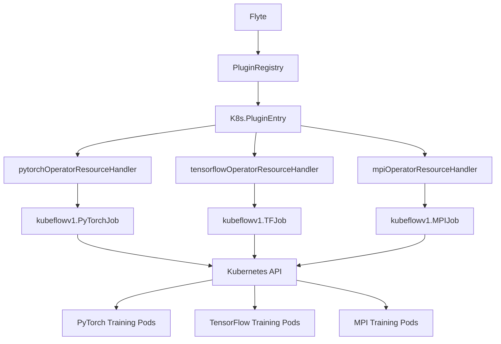
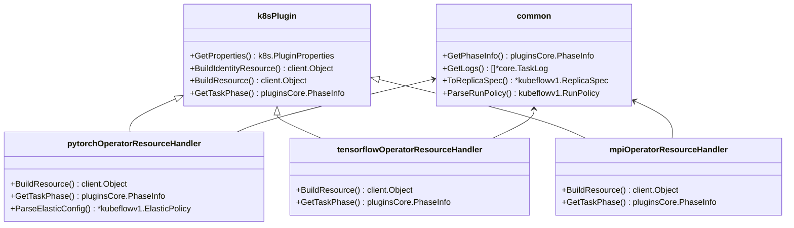
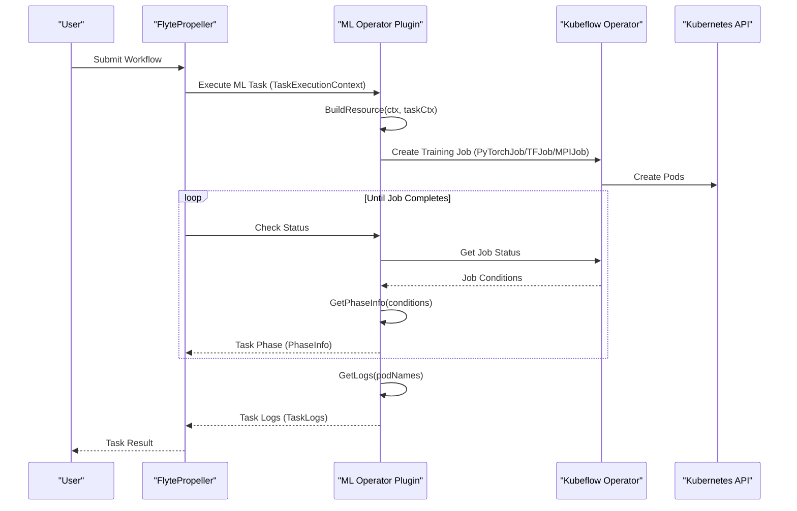
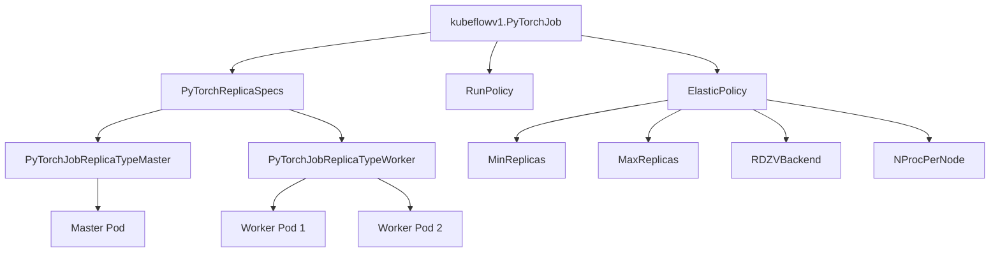
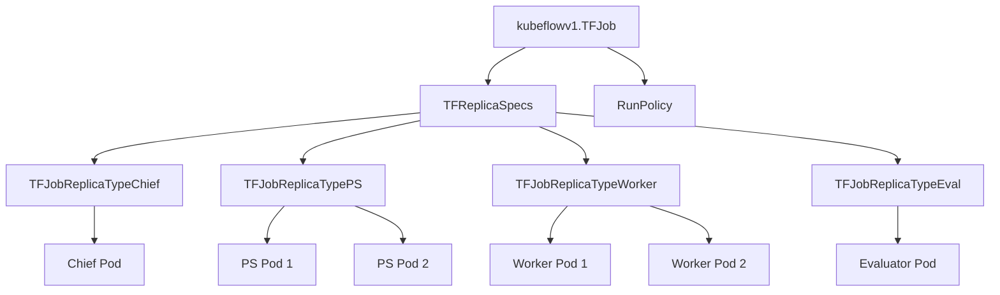
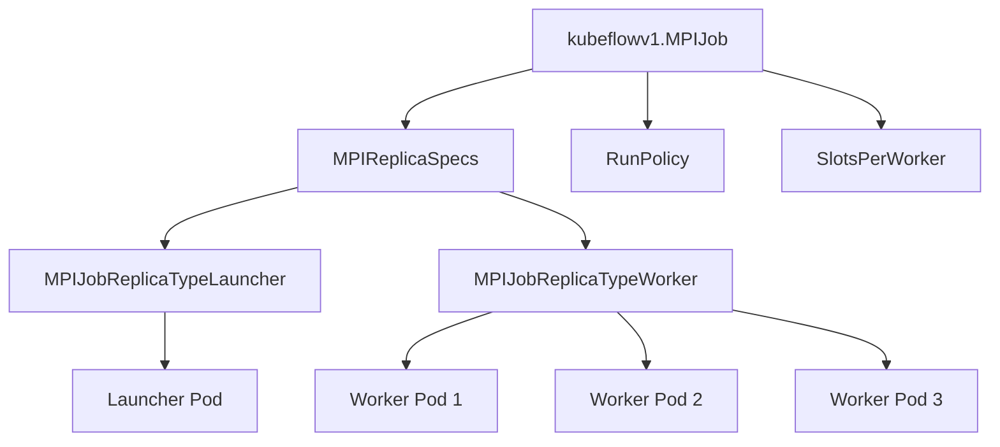

# Machine Learning Operators

<details>
<summary>Relevant source files</summary>

The following files were used as context for generating this wiki page:

- [flyteplugins/go/tasks/plugins/k8s/kfoperators/common/common_operator.go](flyteplugins/go/tasks/plugins/k8s/kfoperators/common/common_operator.go)
- [flyteplugins/go/tasks/plugins/k8s/kfoperators/common/common_operator_test.go](flyteplugins/go/tasks/plugins/k8s/kfoperators/common/common_operator_test.go)
- [flyteplugins/go/tasks/plugins/k8s/kfoperators/mpi/mpi.go](flyteplugins/go/tasks/plugins/k8s/kfoperators/mpi/mpi.go)
- [flyteplugins/go/tasks/plugins/k8s/kfoperators/mpi/mpi_test.go](flyteplugins/go/tasks/plugins/k8s/kfoperators/mpi/mpi_test.go)
- [flyteplugins/go/tasks/plugins/k8s/kfoperators/pytorch/pytorch.go](flyteplugins/go/tasks/plugins/k8s/kfoperators/pytorch/pytorch.go)
- [flyteplugins/go/tasks/plugins/k8s/kfoperators/pytorch/pytorch_test.go](flyteplugins/go/tasks/plugins/k8s/kfoperators/pytorch/pytorch_test.go)
- [flyteplugins/go/tasks/plugins/k8s/kfoperators/tensorflow/tensorflow.go](flyteplugins/go/tasks/plugins/k8s/kfoperators/tensorflow/tensorflow.go)
- [flyteplugins/go/tasks/plugins/k8s/kfoperators/tensorflow/tensorflow_test.go](flyteplugins/go/tasks/plugins/k8s/kfoperators/tensorflow/tensorflow_test.go)

</details>


This document covers Flyte's Machine Learning Operators, which are plugins that enable distributed training for popular machine learning frameworks like PyTorch, TensorFlow, and MPI. These operators leverage Kubeflow's Training Operators to provide native distributed training capabilities within Flyte workflows.

For information about other plugin types in Flyte, refer to the general [Plugin System](#4) documentation.

## Architecture Overview

The ML Operators are implemented as Kubernetes plugins that create, manage, and monitor distributed training jobs using Kubeflow operators. Each ML framework has a dedicated operator that understands the specific requirements and configurations of that framework.

ML Operators Architecture:



Sources:
- [flyteplugins/go/tasks/plugins/k8s/kfoperators/common/common_operator.go](flyteplugins/go/tasks/plugins/k8s/kfoperators/common/common_operator.go)
- [flyteplugins/go/tasks/plugins/k8s/kfoperators/pytorch/pytorch.go](flyteplugins/go/tasks/plugins/k8s/kfoperators/pytorch/pytorch.go)
- [flyteplugins/go/tasks/plugins/k8s/kfoperators/tensorflow/tensorflow.go](flyteplugins/go/tasks/plugins/k8s/kfoperators/tensorflow/tensorflow.go)
- [flyteplugins/go/tasks/plugins/k8s/kfoperators/mpi/mpi.go](flyteplugins/go/tasks/plugins/k8s/kfoperators/mpi/mpi.go)

### Common Structure

All ML Operators implement the `k8s.Plugin` interface and share common utilities for resource handling, phase mapping, and log collection. The diagram below illustrates the relationship between the different components:



Sources:
- [flyteplugins/go/tasks/plugins/k8s/kfoperators/common/common_operator.go:26-29](flyteplugins/go/tasks/plugins/k8s/kfoperators/common/common_operator.go:26-29)
- [flyteplugins/go/tasks/plugins/k8s/kfoperators/pytorch/pytorch.go:26-31](flyteplugins/go/tasks/plugins/k8s/kfoperators/pytorch/pytorch.go:26-31)
- [flyteplugins/go/tasks/plugins/k8s/kfoperators/tensorflow/tensorflow.go:23-27](flyteplugins/go/tasks/plugins/k8s/kfoperators/tensorflow/tensorflow.go:23-27)
- [flyteplugins/go/tasks/plugins/k8s/kfoperators/mpi/mpi.go:26-30](flyteplugins/go/tasks/plugins/k8s/kfoperators/mpi/mpi.go:26-30)

### Task Execution Flow

The following sequence diagram illustrates the lifecycle of a distributed training task using ML Operators:



Sources:
- [flyteplugins/go/tasks/plugins/k8s/kfoperators/pytorch/pytorch.go:56-175](flyteplugins/go/tasks/plugins/k8s/kfoperators/pytorch/pytorch.go:56-175)
- [flyteplugins/go/tasks/plugins/k8s/kfoperators/pytorch/pytorch.go:206-255](flyteplugins/go/tasks/plugins/k8s/kfoperators/pytorch/pytorch.go:206-255)
- [flyteplugins/go/tasks/plugins/k8s/kfoperators/common/common_operator.go:92-200](flyteplugins/go/tasks/plugins/k8s/kfoperators/common/common_operator.go:92-200)

## PyTorch Operator

The PyTorch Operator enables distributed PyTorch training jobs in Flyte. It supports both standard distributed training with master and worker nodes, as well as elastic training with dynamic scaling capabilities.

### PyTorch Job Structure

A PyTorch job consists of master and worker replicas, with optional elastic policy configuration:



Sources:
- [flyteplugins/go/tasks/plugins/k8s/kfoperators/pytorch/pytorch.go:146-164](flyteplugins/go/tasks/plugins/k8s/kfoperators/pytorch/pytorch.go:146-164)
- [flyteplugins/go/tasks/plugins/k8s/kfoperators/pytorch/pytorch.go:179-201](flyteplugins/go/tasks/plugins/k8s/kfoperators/pytorch/pytorch.go:179-201)

### Features

1. **Standard Distributed Training**:
   - Master-worker architecture
   - Configurable number of worker replicas
   - Resource allocation for each replica type

2. **Elastic Training**:
   - Dynamic worker scaling with min/max replicas
   - Configurable processes per node
   - Rendezvous backend selection
   - Automatic removal of master replica in elastic mode

3. **Error Handling**:
   - Earliest error aggregation strategy
   - Phase mapping from Kubeflow job conditions
   - Custom resource monitoring

### Task Type Versions

The PyTorch Operator supports two task type versions with different configuration formats:

| Feature | Version 0 (Legacy) | Version 1 |
|---------|-------------------|-----------|
| Configuration Structure | Simple fields for workers count | Detailed replica specifications |
| Elastic Training | Basic elastic config | Advanced elastic config |
| Container Overrides | Limited customization | Per-replica customization |
| Custom Resources | Global resource settings | Per-replica resource settings |
| Run Policy | Not available | Detailed run policy configuration |

The BuildResource method checks the task type version and constructs the appropriate job specification:

```go
if taskTemplate.GetTaskTypeVersion() == 0 {
    // Parse legacy format
    pytorchTaskExtraArgs := plugins.DistributedPyTorchTrainingTask{}
    err = utils.UnmarshalStruct(taskTemplate.GetCustom(), &pytorchTaskExtraArgs)
    // ...
} else if taskTemplate.GetTaskTypeVersion() == 1 {
    // Parse new format
    kfPytorchTaskExtraArgs := kfplugins.DistributedPyTorchTrainingTask{}
    err = utils.UnmarshalStruct(taskTemplate.GetCustom(), &kfPytorchTaskExtraArgs)
    // ...
}
```

Sources:
- [flyteplugins/go/tasks/plugins/k8s/kfoperators/pytorch/pytorch.go:70-87](flyteplugins/go/tasks/plugins/k8s/kfoperators/pytorch/pytorch.go:70-87)
- [flyteplugins/go/tasks/plugins/k8s/kfoperators/pytorch/pytorch.go:94-142](flyteplugins/go/tasks/plugins/k8s/kfoperators/pytorch/pytorch.go:94-142)
- [flyteplugins/go/tasks/plugins/k8s/kfoperators/pytorch/pytorch_test.go:73-97](flyteplugins/go/tasks/plugins/k8s/kfoperators/pytorch/pytorch_test.go:73-97)

## TensorFlow Operator

The TensorFlow Operator enables distributed TensorFlow training with support for various replica types including parameter servers, chief workers, workers, and evaluators.

### TensorFlow Job Structure

A TensorFlow job consists of various replica types with specific roles:



Sources:
- [flyteplugins/go/tasks/plugins/k8s/kfoperators/tensorflow/tensorflow.go:54-82](flyteplugins/go/tasks/plugins/k8s/kfoperators/tensorflow/tensorflow.go:54-82)
- [flyteplugins/go/tasks/plugins/k8s/kfoperators/tensorflow/tensorflow.go:85-123](flyteplugins/go/tasks/plugins/k8s/kfoperators/tensorflow/tensorflow.go:85-123)

### Features

1. **Parameter Server Architecture**:
   - Parameter server replicas for model parameter management
   - Worker replicas for distributed computation
   - Chief replica for coordination
   - Evaluator replica for model evaluation

2. **Replica Configuration**:
   - Configurable number of replicas for each type
   - Specific resource allocation per replica type
   - Custom container image for each replica type

3. **Job Verification**:
   - Ensures at least one worker is specified
   - Validates replica specifications for all types
   - Proper resource allocation for each replica type

Similar to the PyTorch operator, TensorFlow supports both version 0 (legacy) and version 1 task specifications, with the latter offering more detailed per-replica configuration options.

Sources:
- [flyteplugins/go/tasks/plugins/k8s/kfoperators/tensorflow/tensorflow.go:58-82](flyteplugins/go/tasks/plugins/k8s/kfoperators/tensorflow/tensorflow.go:58-82)
- [flyteplugins/go/tasks/plugins/k8s/kfoperators/tensorflow/tensorflow.go:85-123](flyteplugins/go/tasks/plugins/k8s/kfoperators/tensorflow/tensorflow.go:85-123)
- [flyteplugins/go/tasks/plugins/k8s/kfoperators/tensorflow/tensorflow_test.go:69-75](flyteplugins/go/tasks/plugins/k8s/kfoperators/tensorflow/tensorflow_test.go:69-75)

## MPI Operator

The MPI Operator enables distributed training using the Message Passing Interface (MPI) protocol, commonly used with frameworks like Horovod or other custom distributed applications.

### MPI Job Structure

An MPI job consists of a launcher replica and worker replicas with configurable slots:



Sources:
- [flyteplugins/go/tasks/plugins/k8s/kfoperators/mpi/mpi.go:134-149](flyteplugins/go/tasks/plugins/k8s/kfoperators/mpi/mpi.go:134-149)
- [flyteplugins/go/tasks/plugins/k8s/kfoperators/mpi/mpi.go:62-99](flyteplugins/go/tasks/plugins/k8s/kfoperators/mpi/mpi.go:62-99)

### Features

1. **Launcher-Worker Architecture**:
   - Launcher replica for MPI job coordination
   - Worker replicas for distributed computation
   - Slots per worker configuration for MPI rank allocation

2. **Worker Command Customization**:
   - Support for custom worker commands via `worker_spec_command` config parameter
   - Different command handling for launcher and worker replicas

3. **Validation**:
   - Ensures at least one worker is specified
   - Ensures at least one launcher is specified
   - Validates slot configuration

The MPI operator also supports both version 0 (legacy) and version 1 task specifications, with special handling for worker command configuration:

```go
// V1 requires passing worker command as template config parameter
taskTemplateConfig := taskTemplate.GetConfig()
workerSpecCommand := []string{}
if val, ok := taskTemplateConfig[workerSpecCommandKey]; ok {
    workerSpecCommand = strings.Split(val, " ")
}

for k := range workerReplicaSpec.Template.Spec.Containers {
    if workerReplicaSpec.Template.Spec.Containers[k].Name == kubeflowv1.MPIJobDefaultContainerName {
        workerReplicaSpec.Template.Spec.Containers[k].Args = workerSpecCommand
        workerReplicaSpec.Template.Spec.Containers[k].Command = []string{}
    }
}
```

Sources:
- [flyteplugins/go/tasks/plugins/k8s/kfoperators/mpi/mpi.go:63-97](flyteplugins/go/tasks/plugins/k8s/kfoperators/mpi/mpi.go:63-97)
- [flyteplugins/go/tasks/plugins/k8s/kfoperators/mpi/mpi.go:100-125](flyteplugins/go/tasks/plugins/k8s/kfoperators/mpi/mpi.go:100-125)
- [flyteplugins/go/tasks/plugins/k8s/kfoperators/mpi/mpi.go:24](flyteplugins/go/tasks/plugins/k8s/kfoperators/mpi/mpi.go:24)
- [flyteplugins/go/tasks/plugins/k8s/kfoperators/mpi/mpi_test.go:69-74](flyteplugins/go/tasks/plugins/k8s/kfoperators/mpi/mpi_test.go:69-74)

## Common Components

All ML Operators share common components for job lifecycle management, phase mapping, and log collection.

### Phase Mapping

The operators map Kubeflow job conditions to Flyte task phases as follows:

| Kubeflow Condition | Flyte Phase |
|-------------------|-------------|
| JobCreated | PhaseQueued |
| JobRunning | PhaseRunning |
| JobSucceeded | PhaseSuccess |
| JobFailed | PhaseRetryableFailure |
| JobRestarting | PhaseRunning |

The `GetPhaseInfo` function in the common package handles this mapping:

```go
func GetPhaseInfo(currentCondition kubeflowv1.JobCondition, occurredAt time.Time,
    taskPhaseInfo pluginsCore.TaskInfo) (pluginsCore.PhaseInfo, error) {
    // ...
    switch currentCondition.Type {
    case kubeflowv1.JobCreated:
        return pluginsCore.PhaseInfoQueuedWithTaskInfo(occurredAt, pluginsCore.DefaultPhaseVersion, "JobCreated", &taskPhaseInfo), nil
    case kubeflowv1.JobRunning:
        return pluginsCore.PhaseInfoRunning(pluginsCore.DefaultPhaseVersion, &taskPhaseInfo), nil
    case kubeflowv1.JobSucceeded:
        return pluginsCore.PhaseInfoSuccess(&taskPhaseInfo), nil
    case kubeflowv1.JobFailed:
        details := fmt.Sprintf("Job failed:\n\t%v - %v", currentCondition.Reason, currentCondition.Message)
        return pluginsCore.PhaseInfoRetryableFailure(flyteerr.DownstreamSystemError, details, &taskPhaseInfo), nil
    case kubeflowv1.JobRestarting:
        return pluginsCore.PhaseInfoRunning(pluginsCore.DefaultPhaseVersion, &taskPhaseInfo), nil
    }
    // ...
}
```

Sources:
- [flyteplugins/go/tasks/plugins/k8s/kfoperators/common/common_operator.go:49-68](flyteplugins/go/tasks/plugins/k8s/kfoperators/common/common_operator.go:49-68)
- [flyteplugins/go/tasks/plugins/k8s/kfoperators/pytorch/pytorch.go:206-255](flyteplugins/go/tasks/plugins/k8s/kfoperators/pytorch/pytorch.go:206-255)

### Log Collection

The operators collect logs from distributed pods based on the framework type. The `GetLogs` function in the common package handles log collection with different strategies for each framework:

```go
// For PyTorch (with master)
if taskType == PytorchTaskType && hasMaster {
    masterTaskLog, masterErr := logPlugin.GetTaskLogs(...)
    taskLogs = append(taskLogs, masterTaskLog.TaskLogs...)
}

// For all frameworks: collect worker logs
for workerIndex := int32(0); workerIndex < workersCount; workerIndex++ {
    workerLog, err := logPlugin.GetTaskLogs(...)
    taskLogs = append(taskLogs, workerLog.TaskLogs...)
}

// For TensorFlow: additional replica types
if taskType == TensorflowTaskType {
    // PS replicas, Chief replicas, Evaluator replicas
    // ...
}
```

Sources:
- [flyteplugins/go/tasks/plugins/k8s/kfoperators/common/common_operator.go:92-200](flyteplugins/go/tasks/plugins/k8s/kfoperators/common/common_operator.go:92-200)
- [flyteplugins/go/tasks/plugins/k8s/kfoperators/pytorch/pytorch.go:225-227](flyteplugins/go/tasks/plugins/k8s/kfoperators/pytorch/pytorch.go:225-227)
- [flyteplugins/go/tasks/plugins/k8s/kfoperators/tensorflow/tensorflow.go:169-173](flyteplugins/go/tasks/plugins/k8s/kfoperators/tensorflow/tensorflow.go:169-173)

### Run Policy Configuration

All operators support run policy configuration for controlling job behavior:

| Policy Option | Description |
|--------------|-------------|
| CleanPodPolicy | Policy for cleaning up pods after job completion (None, All, Running) |
| BackoffLimit | Number of retries before marking job failed |
| ActiveDeadlineSeconds | Time limit for job execution |
| TTLSecondsAfterFinished | Time to keep job after completion |

The `ParseRunPolicy` function in the common package converts Flyte run policy to Kubeflow run policy:

```go
func ParseRunPolicy(flyteRunPolicy kfplugins.RunPolicy) kubeflowv1.RunPolicy {
    runPolicy := kubeflowv1.RunPolicy{}
    if flyteRunPolicy.GetBackoffLimit() != 0 {
        var backoffLimit = flyteRunPolicy.GetBackoffLimit()
        runPolicy.BackoffLimit = &backoffLimit
    }
    var cleanPodPolicy = ParseCleanPodPolicy(flyteRunPolicy.GetCleanPodPolicy())
    runPolicy.CleanPodPolicy = &cleanPodPolicy
    // ...
    return runPolicy
}
```

Sources:
- [flyteplugins/go/tasks/plugins/k8s/kfoperators/common/common_operator.go:218-246](flyteplugins/go/tasks/plugins/k8s/kfoperators/common/common_operator.go:218-246)
- [flyteplugins/go/tasks/plugins/k8s/kfoperators/pytorch/pytorch.go:134-136](flyteplugins/go/tasks/plugins/k8s/kfoperators/pytorch/pytorch.go:134-136)

## Plugin Registration

Each ML Operator registers itself with the Flyte plugin registry during initialization:

```go
// In pytorch.go init()
pluginmachinery.PluginRegistry().RegisterK8sPlugin(
    k8s.PluginEntry{
        ID:                  common.PytorchTaskType,
        RegisteredTaskTypes: []pluginsCore.TaskType{common.PytorchTaskType},
        ResourceToWatch:     &kubeflowv1.PyTorchJob{},
        Plugin:              pytorchOperatorResourceHandler{},
        IsDefault:           false,
    })
```

The ML Operators support the following task types defined in the common package:

```go
const (
    TensorflowTaskType = "tensorflow"
    MPITaskType        = "mpi"
    PytorchTaskType    = "pytorch"
)
```

Sources:
- [flyteplugins/go/tasks/plugins/k8s/kfoperators/pytorch/pytorch.go:257-270](flyteplugins/go/tasks/plugins/k8s/kfoperators/pytorch/pytorch.go:257-270)
- [flyteplugins/go/tasks/plugins/k8s/kfoperators/tensorflow/tensorflow.go:203-216](flyteplugins/go/tasks/plugins/k8s/kfoperators/tensorflow/tensorflow.go:203-216)
- [flyteplugins/go/tasks/plugins/k8s/kfoperators/mpi/mpi.go:205-218](flyteplugins/go/tasks/plugins/k8s/kfoperators/mpi/mpi.go:205-218)
- [flyteplugins/go/tasks/plugins/k8s/kfoperators/common/common_operator.go:26-29](flyteplugins/go/tasks/plugins/k8s/kfoperators/common/common_operator.go:26-29)

## Summary

Flyte's Machine Learning Operators provide a powerful abstraction for distributed training with popular ML frameworks. Key features include:

1. **Framework-Specific Support**:
   - PyTorch: Master-worker architecture with elastic training capabilities
   - TensorFlow: Parameter server architecture with chief, worker, PS, and evaluator replicas
   - MPI: Launcher-worker architecture for MPI-based distributed training

2. **Common Capabilities**:
   - Resource allocation and management
   - Job lifecycle monitoring
   - Phase mapping from Kubeflow to Flyte
   - Log collection from distributed pods
   - Run policy configuration

3. **Task Versioning**:
   - Version 0 (legacy): Simple configuration with basic options
   - Version 1: Detailed per-replica configuration with advanced options

These operators seamlessly integrate distributed training capabilities into Flyte workflows, leveraging Kubeflow's Training Operators to manage the underlying Kubernetes resources.