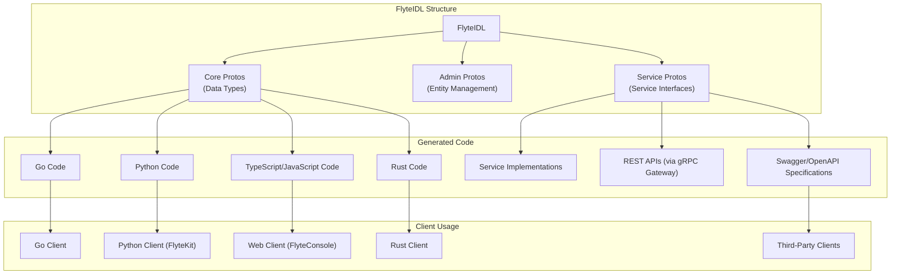
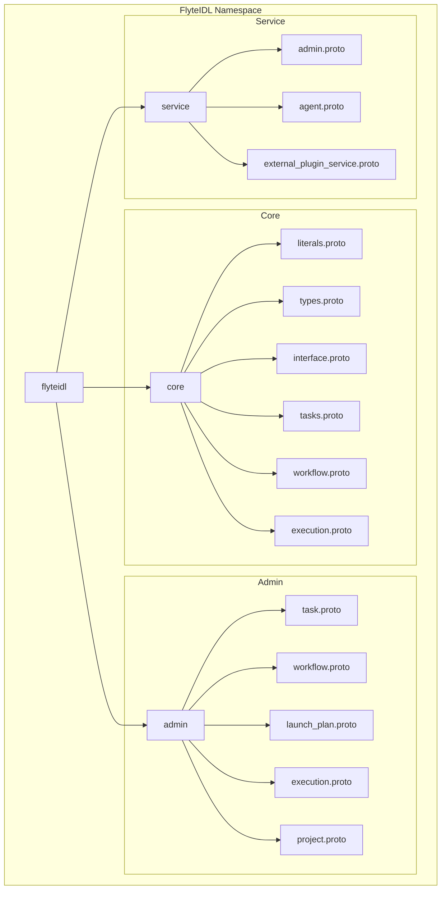
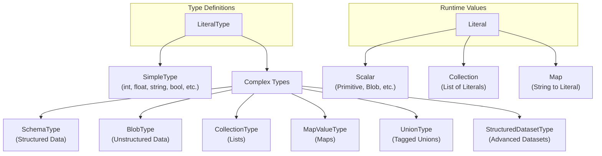
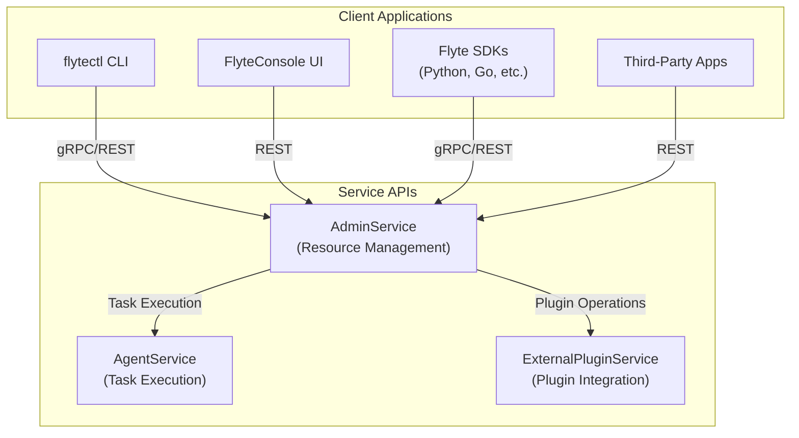
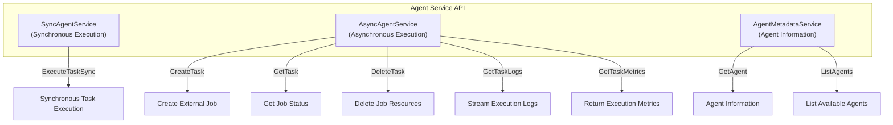
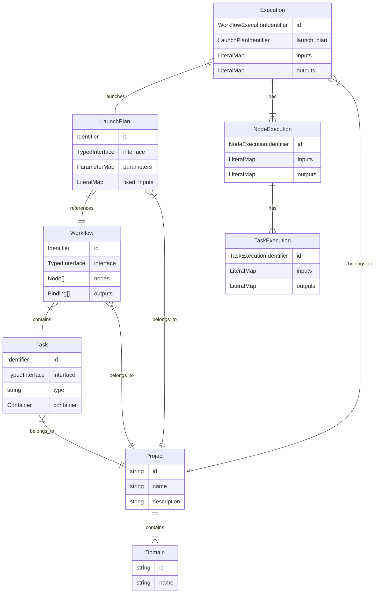
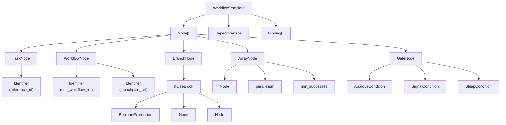

# API and Interface Definitions

Relevant source files

The following files were used as context for generating this wiki page:

- [flyteidl/clients/go/assets/admin.swagger.json](flyteidl/clients/go/assets/admin.swagger.json)
- [flyteidl/gen/pb-es/flyteidl/core/workflow_pb.ts](flyteidl/gen/pb-es/flyteidl/core/workflow_pb.ts)
- [flyteidl/gen/pb-go/flyteidl/core/workflow.pb.go](flyteidl/gen/pb-go/flyteidl/core/workflow.pb.go)
- [flyteidl/gen/pb-go/flyteidl/service/admin.pb.go](flyteidl/gen/pb-go/flyteidl/service/admin.pb.go)
- [flyteidl/gen/pb-go/gateway/flyteidl/service/admin.swagger.json](flyteidl/gen/pb-go/gateway/flyteidl/service/admin.swagger.json)
- [flyteidl/gen/pb-go/gateway/flyteidl/service/agent.swagger.json](flyteidl/gen/pb-go/gateway/flyteidl/service/agent.swagger.json)
- [flyteidl/gen/pb-go/gateway/flyteidl/service/external_plugin_service.swagger.json](flyteidl/gen/pb-go/gateway/flyteidl/service/external_plugin_service.swagger.json)
- [flyteidl/gen/pb-js/flyteidl.d.ts](flyteidl/gen/pb-js/flyteidl.d.ts)
- [flyteidl/gen/pb-js/flyteidl.js](flyteidl/gen/pb-js/flyteidl.js)
- [flyteidl/gen/pb_python/flyteidl/core/workflow_pb2.py](flyteidl/gen/pb_python/flyteidl/core/workflow_pb2.py)
- [flyteidl/gen/pb_python/flyteidl/core/workflow_pb2.pyi](flyteidl/gen/pb_python/flyteidl/core/workflow_pb2.pyi)
- [flyteidl/gen/pb_python/flyteidl/service/admin_pb2.py](flyteidl/gen/pb_python/flyteidl/service/admin_pb2.py)
- [flyteidl/gen/pb_rust/flyteidl.core.rs](flyteidl/gen/pb_rust/flyteidl.core.rs)
- [flyteidl/protos/flyteidl/core/workflow.proto](flyteidl/protos/flyteidl/core/workflow.proto)
- [flyteidl/protos/flyteidl/service/admin.proto](flyteidl/protos/flyteidl/service/admin.proto)

This document provides a technical overview of the API and interface definitions in the Flyte system. It describes how Flyte defines its data types, services, and communication protocols through a structured Interface Definition Language (IDL). These definitions form the foundation for type-safe communication between Flyte components, both internally and with external clients.

For information about specific Admin Service functionality, see [Admin Service](#5.2).

## Overview of Flyte Interface Definitions

Flyte uses Protocol Buffers (protobuf) as its Interface Definition Language (IDL) to define data structures and service interfaces. These definitions are organized in the `flyteidl` (Flyte Interface Definition Language) directory and are used to generate type-safe code across multiple programming languages.

Sources:
- [flyteidl/gen/pb-js/flyteidl.js](flyteidl/gen/pb-js/flyteidl.js)
- [flyteidl/gen/pb-js/flyteidl.d.ts](flyteidl/gen/pb-js/flyteidl.d.ts)
- [flyteidl/gen/pb-go/flyteidl/core/workflow.pb.go](flyteidl/gen/pb-go/flyteidl/core/workflow.pb.go)
- [flyteidl/gen/pb_python/flyteidl/core/workflow_pb2.py](flyteidl/gen/pb_python/flyteidl/core/workflow_pb2.py)
- [flyteidl/gen/pb_rust/flyteidl.core.rs](flyteidl/gen/pb_rust/flyteidl.core.rs)

## FlyteIDL Structure

FlyteIDL is organized into three main components:

1. **Core** - Defines fundamental data types, workflows, tasks, and interfaces
2. **Admin** - Defines entities used for management operations
3. **Service** - Defines service interfaces (Admin, Agent, etc.)

Sources:
- [flyteidl/protos/flyteidl/core/workflow.proto](flyteidl/protos/flyteidl/core/workflow.proto)
- [flyteidl/protos/flyteidl/service/admin.proto](flyteidl/protos/flyteidl/service/admin.proto)

## Core Data Types

Flyte's type system is defined in the Core package and serves as the foundation for all data exchange in the system. These types are used to define the inputs and outputs of tasks and workflows.

### Type System Hierarchy

Sources:
- [flyteidl/gen/pb-js/flyteidl.d.ts:5-573](flyteidl/gen/pb-js/flyteidl.d.ts:5-573)
- [flyteidl/gen/pb_rust/flyteidl.core.rs:3-193](flyteidl/gen/pb_rust/flyteidl.core.rs:3-193)

### Key Type Definitions

The core type system includes:

| Type Category | Description | Examples |
|---------------|-------------|----------|
| Simple Types | Basic primitive data types | Integer, Float, String, Boolean, Datetime, Duration |
| Blob Types | Unstructured data with format metadata | CSV, Parquet, arbitrary binary data |
| Schema Types | Structured data with column definitions | Dataframes, database tables |
| Collection Types | Homogeneous collections of any type | Lists of integers, lists of blobs |
| Map Types | Key-value maps (string keys only) | String to integer maps, string to blob maps |
| Union Types | Tagged union types (sum types) | A type that can be either Type A or Type B |
| Structured Dataset Types | Advanced datasets with schema and format info | Apache Arrow tables, Pandas dataframes |

Sources:
- [flyteidl/gen/pb_rust/flyteidl.core.rs:65-450](flyteidl/gen/pb_rust/flyteidl.core.rs:65-450)
- [flyteidl/gen/pb-js/flyteidl.d.ts:145-216](flyteidl/gen/pb-js/flyteidl.d.ts:145-216)

## Service Interfaces

Flyte defines several service interfaces that enable communication between components:

### Service Architecture

Sources:
- [flyteidl/clients/go/assets/admin.swagger.json:18-723](flyteidl/clients/go/assets/admin.swagger.json:18-723)
- [flyteidl/gen/pb-go/gateway/flyteidl/service/agent.swagger.json:18-441](flyteidl/gen/pb-go/gateway/flyteidl/service/agent.swagger.json:18-441)
- [flyteidl/gen/pb-go/gateway/flyteidl/service/external_plugin_service.swagger.json:18-19](flyteidl/gen/pb-go/gateway/flyteidl/service/external_plugin_service.swagger.json:18-19)

### Admin Service API

The Admin Service is the central management interface for Flyte resources. It provides operations for:

#### Key Admin Service Endpoints

| Category | Operations | Description |
|----------|------------|-------------|
| Tasks | CreateTask, GetTask, ListTasks | Manage task definitions |
| Workflows | CreateWorkflow, GetWorkflow, ListWorkflows | Manage workflow definitions |
| Launch Plans | CreateLaunchPlan, GetLaunchPlan, ListLaunchPlans | Manage launch plan definitions |
| Executions | CreateExecution, GetExecution, ListExecutions | Manage workflow executions |
| Node Executions | GetNodeExecution, ListNodeExecutions | Retrieve node execution information |
| Task Executions | GetTaskExecution, ListTaskExecutions | Retrieve task execution information |
| Projects | CreateProject, ListProjects | Manage project resources |

The Admin Service API is exposed as both gRPC and REST (via gRPC Gateway).

Sources:
- [flyteidl/protos/flyteidl/service/admin.proto:27-1234](flyteidl/protos/flyteidl/service/admin.proto:27-1234)
- [flyteidl/clients/go/assets/admin.swagger.json:18-538](flyteidl/clients/go/assets/admin.swagger.json:18-538)

### Agent Service API

The Agent Service provides interfaces for executing tasks and retrieving execution information:

Sources:
- [flyteidl/gen/pb-go/gateway/flyteidl/service/agent.swagger.json:18-441](flyteidl/gen/pb-go/gateway/flyteidl/service/agent.swagger.json:18-441)

## Entity Relationships

The core entity relationships in Flyte's interface model:

Sources:
- [flyteidl/protos/flyteidl/core/workflow.proto:10-283](flyteidl/protos/flyteidl/core/workflow.proto:10-283)
- [flyteidl/gen/pb-go/flyteidl/core/workflow.pb.go:25-323](flyteidl/gen/pb-go/flyteidl/core/workflow.pb.go:25-323)

## Code Generation

FlyteIDL definitions are used to generate code in multiple languages:

| Language | Generated Files | Usage |
|----------|-----------------|-------|
| Go | `flyteidl/gen/pb-go/` | Server implementation, Go clients |
| Python | `flyteidl/gen/pb_python/` | Python SDK (FlyteKit) |
| JavaScript/TypeScript | `flyteidl/gen/pb-js/` | Web UI (FlyteConsole) |
| Rust | `flyteidl/gen/pb_rust/` | Rust clients |
| Swagger/OpenAPI | `flyteidl/clients/go/assets/` | RESTful API documentation, third-party clients |

Each generated package follows the same namespace structure as the IDL definitions, making it easy to locate corresponding types across languages.

Sources:
- [flyteidl/gen/pb-js/flyteidl.js:1-30](flyteidl/gen/pb-js/flyteidl.js:1-30)
- [flyteidl/gen/pb-js/flyteidl.d.ts:1-30](flyteidl/gen/pb-js/flyteidl.d.ts:1-30)
- [flyteidl/gen/pb-go/flyteidl/core/workflow.pb.go:1-20](flyteidl/gen/pb-go/flyteidl/core/workflow.pb.go:1-20)
- [flyteidl/gen/pb_python/flyteidl/core/workflow_pb2.py:1-30](flyteidl/gen/pb_python/flyteidl/core/workflow_pb2.py:1-30)
- [flyteidl/gen/pb_rust/flyteidl.core.rs:1-20](flyteidl/gen/pb_rust/flyteidl.core.rs:1-20)

## Key Workflow Interface Definitions

Workflow interfaces define the structure of workflows and their execution:

Sources:
- [flyteidl/protos/flyteidl/core/workflow.proto:75-283](flyteidl/protos/flyteidl/core/workflow.proto:75-283)
- [flyteidl/gen/pb_python/flyteidl/core/workflow_pb2.pyi:19-127](flyteidl/gen/pb_python/flyteidl/core/workflow_pb2.pyi:19-127)
- [flyteidl/gen/pb-es/flyteidl/core/workflow_pb.ts:16-166](flyteidl/gen/pb-es/flyteidl/core/workflow_pb.ts:16-166)

## API Clients and Usage

The generated code enables the creation of type-safe clients in various languages:

### REST API via Swagger

The Admin and Agent services expose REST APIs documented with Swagger/OpenAPI specifications. Key endpoints include:

| Path | Method | Description |
|------|--------|-------------|
| `/api/v1/tasks` | POST | Create a task |
| `/api/v1/workflows` | POST | Create a workflow |
| `/api/v1/launch_plans` | POST | Create a launch plan |
| `/api/v1/executions` | POST | Create an execution |
| `/api/v1/projects/{id}/domains/{domain}/executions` | GET | List executions |
| `/api/v1/data/executions/{id.project}/{id.domain}/{id.name}` | GET | Get execution data |
| `/api/v1/agent/task` | POST | Create a task via Agent API |

The RESTful APIs follow a consistent pattern, mapping closely to the gRPC service definitions.

Sources:
- [flyteidl/clients/go/assets/admin.swagger.json:18-723](flyteidl/clients/go/assets/admin.swagger.json:18-723)
- [flyteidl/gen/pb-go/gateway/flyteidl/service/admin.swagger.json:18-723](flyteidl/gen/pb-go/gateway/flyteidl/service/admin.swagger.json:18-723)
- [flyteidl/gen/pb-go/gateway/flyteidl/service/agent.swagger.json:18-441](flyteidl/gen/pb-go/gateway/flyteidl/service/agent.swagger.json:18-441)

## Conclusion

Flyte's interface definitions provide a robust foundation for type-safe communication between components. The use of Protocol Buffers enables language-agnostic definitions that can generate idiomatic code in multiple languages. These interfaces facilitate the development of clients, plugins, and service implementations, ensuring consistency across the entire system.

The clear separation between core data types, admin entities, and service interfaces supports Flyte's modular architecture and allows for independent evolution of different components while maintaining backward compatibility.

Sources:
- [flyteidl/protos/flyteidl/service/admin.proto:3-26](flyteidl/protos/flyteidl/service/admin.proto:3-26)
- [flyteidl/protos/flyteidl/core/workflow.proto:3-17](flyteidl/protos/flyteidl/core/workflow.proto:3-17)