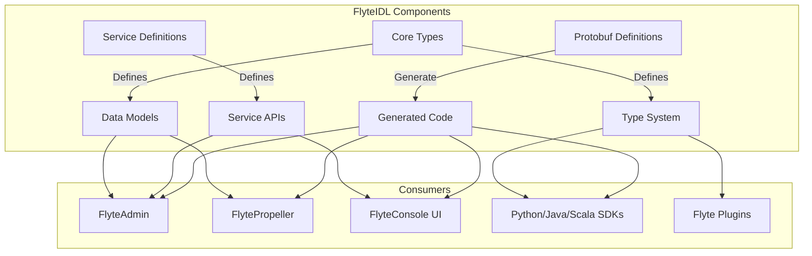
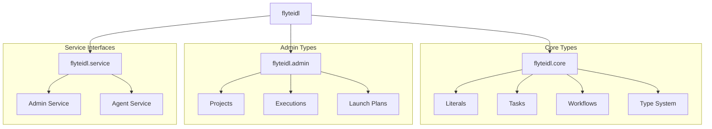
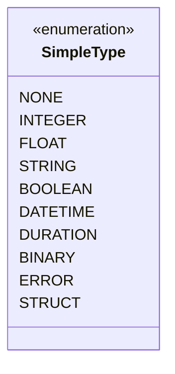
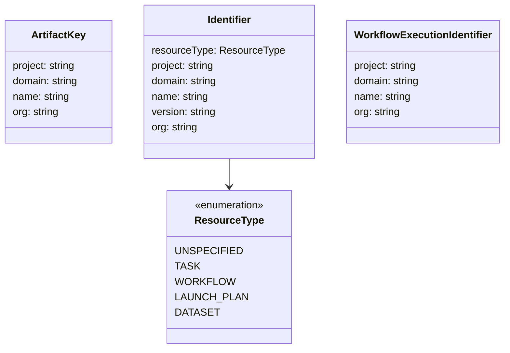
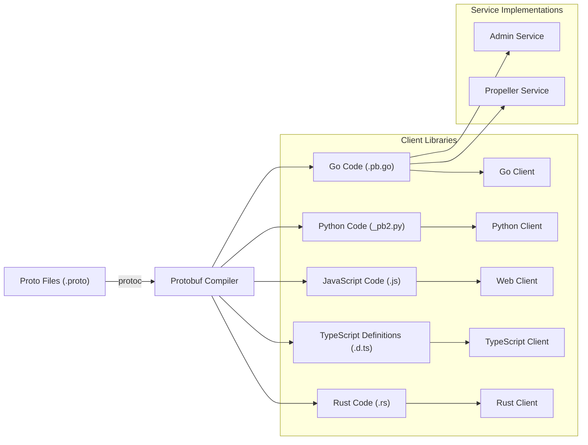
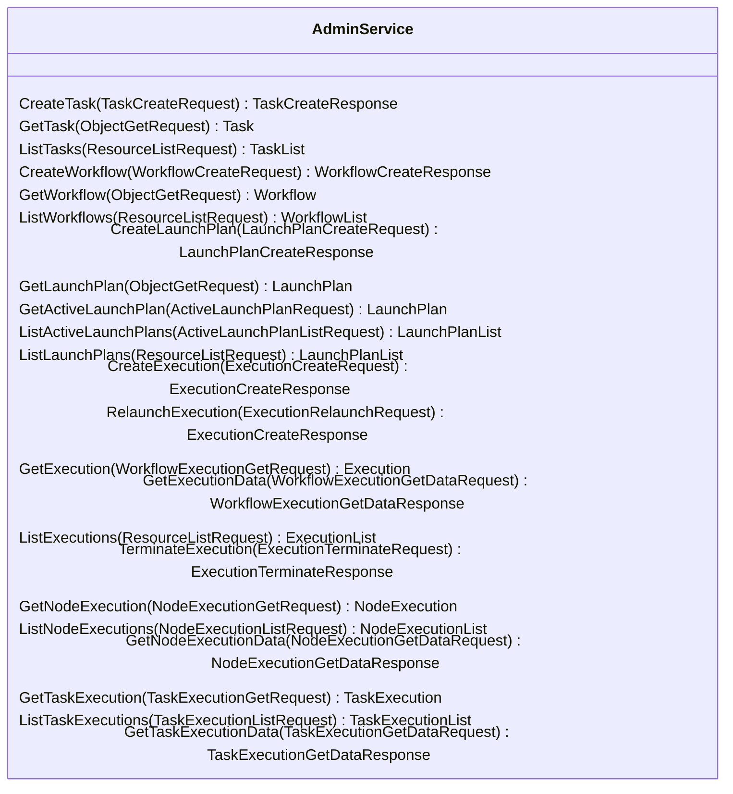
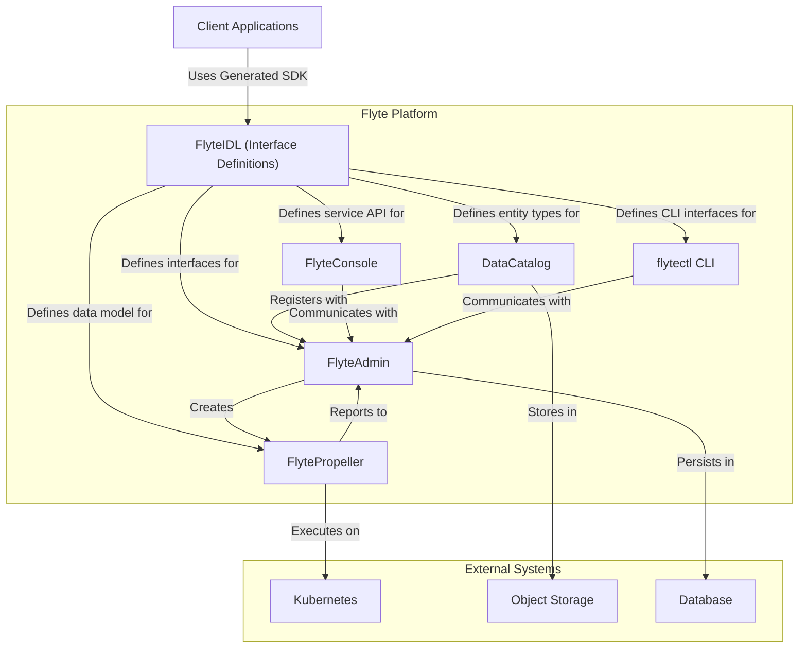

# FlyteIDL

<details>
<summary>Relevant source files</summary>

The following files were used as context for generating this wiki page:

- [flyteidl/clients/go/assets/admin.swagger.json](flyteidl/clients/go/assets/admin.swagger.json)
- [flyteidl/gen/pb-es/flyteidl/core/workflow_pb.ts](flyteidl/gen/pb-es/flyteidl/core/workflow_pb.ts)
- [flyteidl/gen/pb-go/flyteidl/core/workflow.pb.go](flyteidl/gen/pb-go/flyteidl/core/workflow.pb.go)
- [flyteidl/gen/pb-go/flyteidl/service/admin.pb.go](flyteidl/gen/pb-go/flyteidl/service/admin.pb.go)
- [flyteidl/gen/pb-go/gateway/flyteidl/service/admin.swagger.json](flyteidl/gen/pb-go/gateway/flyteidl/service/admin.swagger.json)
- [flyteidl/gen/pb-go/gateway/flyteidl/service/agent.swagger.json](flyteidl/gen/pb-go/gateway/flyteidl/service/agent.swagger.json)
- [flyteidl/gen/pb-go/gateway/flyteidl/service/external_plugin_service.swagger.json](flyteidl/gen/pb-go/gateway/flyteidl/service/external_plugin_service.swagger.json)
- [flyteidl/gen/pb-js/flyteidl.d.ts](flyteidl/gen/pb-js/flyteidl.d.ts)
- [flyteidl/gen/pb-js/flyteidl.js](flyteidl/gen/pb-js/flyteidl.js)
- [flyteidl/gen/pb_python/flyteidl/core/workflow_pb2.py](flyteidl/gen/pb_python/flyteidl/core/workflow_pb2.py)
- [flyteidl/gen/pb_python/flyteidl/core/workflow_pb2.pyi](flyteidl/gen/pb_python/flyteidl/core/workflow_pb2.pyi)
- [flyteidl/gen/pb_python/flyteidl/service/admin_pb2.py](flyteidl/gen/pb_python/flyteidl/service/admin_pb2.py)
- [flyteidl/gen/pb_rust/flyteidl.core.rs](flyteidl/gen/pb_rust/flyteidl.core.rs)
- [flyteidl/protos/flyteidl/core/workflow.proto](flyteidl/protos/flyteidl/core/workflow.proto)
- [flyteidl/protos/flyteidl/service/admin.proto](flyteidl/protos/flyteidl/service/admin.proto)

</details>


FlyteIDL is the Interface Definition Language that serves as the foundation for Flyte's service and data model definitions. It defines the core data structures, type system, and service interfaces that enable communication between the various components in the Flyte ecosystem. 

FlyteIDL uses Protocol Buffers (protobuf) to provide a language-agnostic way to specify interfaces and data structures, allowing automatic code generation in multiple programming languages (Go, Python, JavaScript, Rust, etc.). This enables seamless interoperability between different Flyte components regardless of their implementation language.

## Purpose and Role

FlyteIDL serves several critical purposes within the Flyte ecosystem:

1. **Definition of core data structures** - Common types used across all Flyte components
2. **Service interface specifications** - API contracts for services like FlyteAdmin
3. **Cross-language compatibility** - Generated code in multiple languages
4. **Data serialization standard** - Consistent encoding/decoding between components
5. **Type safety** - Strong typing across system boundaries



Sources:
- [flyteidl/gen/pb-js/flyteidl.js:16-26]()
- [flyteidl/gen/pb-js/flyteidl.d.ts:2-6]()
- [flyteidl/gen/pb-go/gateway/flyteidl/service/admin.swagger.json:1-20]()

## Core Structure of FlyteIDL

FlyteIDL is organized into several key namespaces:

| Namespace | Purpose | Key Components |
|-----------|---------|----------------|
| `flyteidl.core` | Core data structures | Types, Literals, Workflows, Tasks |
| `flyteidl.admin` | Admin service entities | Projects, Executions, Resources |
| `flyteidl.service` | Service definitions | AdminService, DataCatalog service |



Sources:
- [flyteidl/gen/pb-js/flyteidl.d.ts:2-6]()
- [flyteidl/gen/pb-js/flyteidl.js:28-33]()
- [flyteidl/protos/flyteidl/service/admin.proto:1-10]()

## Type System

FlyteIDL defines a comprehensive type system that forms the foundation of Flyte's data model. The type system enables strong typing across the platform.

### Simple Types

The `SimpleType` enum defines primitive types that can be used throughout the system:



Sources:
- [flyteidl/gen/pb_rust/flyteidl.core.rs:296-327]()

### Literal Types

The `LiteralType` message defines the complete type system, combining simple types with complex types:

```mermaid
classDiagram
    class LiteralType {
        metadata: Struct
        annotation: TypeAnnotation
        structure: TypeStructure
        type: oneof{
            SimpleType simple
            SchemaType schema
            LiteralType collection_type
            LiteralType map_value_type
            BlobType blob
            EnumType enum_type
            StructuredDatasetType structured_dataset_type
            UnionType union_type
        }
    }
    
    class SimpleType {
        <<enumeration>>
    }
    
    class SchemaType {
        columns: SchemaColumn[]
    }
    
    class BlobType {
        format: string
        dimensionality: BlobDimensionality
    }
    
    class StructuredDatasetType {
        columns: DatasetColumn[]
        format: string
        external_schema_type: string
        external_schema_bytes: bytes
    }
    
    class UnionType {
        variants: LiteralType[]
    }
    
    LiteralType --> SimpleType: simple
    LiteralType --> SchemaType: schema
    LiteralType --> LiteralType: collection_type
    LiteralType --> LiteralType: map_value_type
    LiteralType --> BlobType: blob
    LiteralType --> StructuredDatasetType: structured_dataset_type
    LiteralType --> UnionType: union_type
```

Sources:
- [flyteidl/gen/pb_rust/flyteidl.core.rs:193-241]()
- [flyteidl/gen/pb-js/flyteidl.d.ts:160-216]()

## Core Data Structures

### Artifacts and Identifiers

FlyteIDL defines various identifier structures used to uniquely identify resources throughout the system:



Sources:
- [flyteidl/gen/pb-js/flyteidl.d.ts:9-85]()
- [flyteidl/gen/pb-js/flyteidl.d.ts:706-763]()

### Workflow Structures

FlyteIDL defines the core structure of workflows, including nodes, tasks, and their relationships:

```mermaid
classDiagram
    class Node {
        id: string
        metadata: NodeMetadata
        inputs: Binding[]
        upstream_node_ids: string[]
        output_aliases: Alias[]
        target: oneof{
            TaskNode task_node
            WorkflowNode workflow_node
            BranchNode branch_node
            GateNode gate_node
            ArrayNode array_node
        }
    }
    
    class TaskNode {
        reference: oneof{
            Identifier reference_id
        }
        overrides: TaskNodeOverrides
    }
    
    class WorkflowNode {
        reference: oneof{
            Identifier launchplan_ref
            Identifier sub_workflow_ref
        }
    }
    
    class BranchNode {
        if_else: IfElseBlock
    }
    
    class WorkflowTemplate {
        id: Identifier
        metadata: WorkflowMetadata
        interface: TypedInterface
        nodes: Node[]
        outputs: Binding[]
        failure_node: Node
        metadata_defaults: WorkflowMetadataDefaults
    }
    
    Node --> TaskNode
    Node --> WorkflowNode
    Node --> BranchNode
    WorkflowTemplate --> Node: nodes
```

Sources:
- [flyteidl/protos/flyteidl/core/workflow.proto:18-290]()
- [flyteidl/gen/pb-go/flyteidl/core/workflow.pb.go:25-393]()

## Code Generation Process

FlyteIDL follows the Protocol Buffer code generation process to create language-specific bindings from the `.proto` definitions.



Sources:
- [flyteidl/gen/pb-go/flyteidl/core/workflow.pb.go:1-6]()
- [flyteidl/gen/pb_python/flyteidl/core/workflow_pb2.py:1-26]()
- [flyteidl/gen/pb-js/flyteidl.js:1-14]()
- [flyteidl/gen/pb_rust/flyteidl.core.rs:1-5]()

## Service Definitions

FlyteIDL defines the service interfaces that various Flyte components implement. The most important is the Admin Service interface:



Sources:
- [flyteidl/protos/flyteidl/service/admin.proto:25-521]()
- [flyteidl/gen/pb-go/gateway/flyteidl/service/admin.swagger.json:18-722]()

## Using FlyteIDL for Development

FlyteIDL plays a key role in several development scenarios:

### For Plugin Developers

Plugin developers use FlyteIDL to:
1. Understand the data types that will be passed to plugins
2. Implement the plugin interfaces defined in FlyteIDL
3. Serialize/deserialize data in the expected format

### For Flyte Contributors

Contributors to the core Flyte platform use FlyteIDL to:
1. Define new service interfaces or extend existing ones
2. Add new data types and structures
3. Ensure backward compatibility when making changes

### For Flyte Users

While end users don't interact directly with FlyteIDL, they benefit from:
1. Type safety provided by the IDL
2. Consistent behavior across different Flyte components
3. The ability to use Flyte from multiple programming languages

## FlyteIDL in the Flyte Architecture

FlyteIDL serves as the foundation for communication between all Flyte components:



Sources:
- [flyteidl/gen/pb-go/gateway/flyteidl/service/admin.swagger.json:18-722]()
- [flyteidl/gen/pb-go/gateway/flyteidl/service/agent.swagger.json:9-22]()

## Conclusion

FlyteIDL is a foundational component of the Flyte ecosystem that:

1. Defines the data model and type system for the entire platform
2. Specifies service interfaces that components implement
3. Enables cross-language compatibility through code generation
4. Provides a stable contract between different Flyte components

By using Protocol Buffers, FlyteIDL ensures that Flyte components can communicate regardless of their implementation language, making the system truly extensible and maintainable.