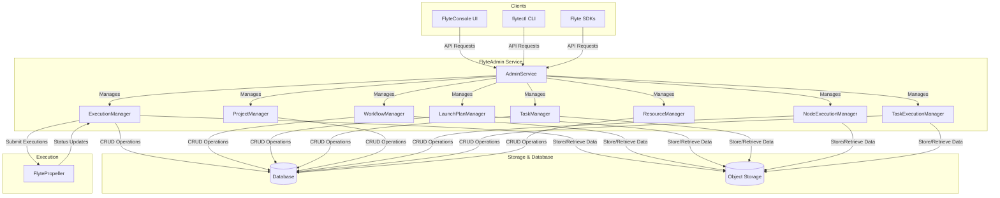
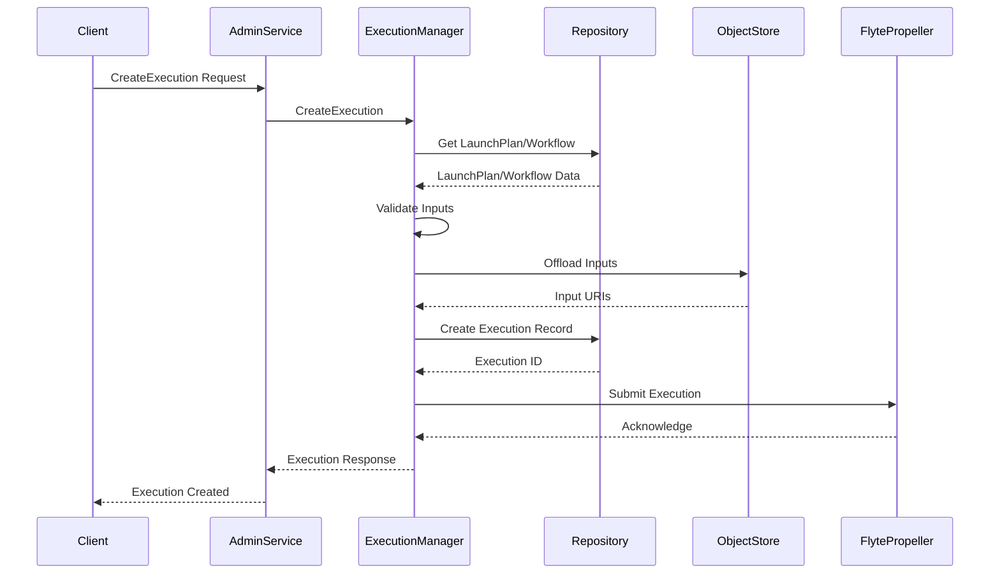
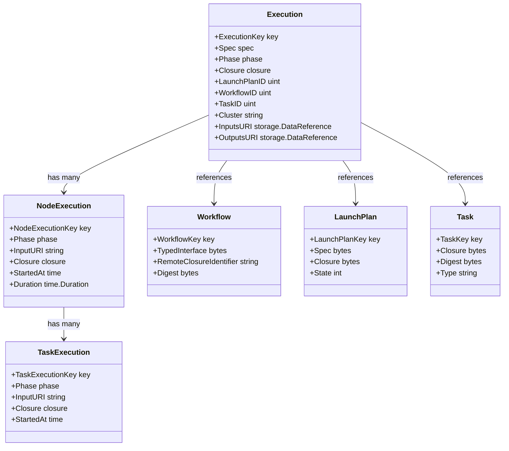
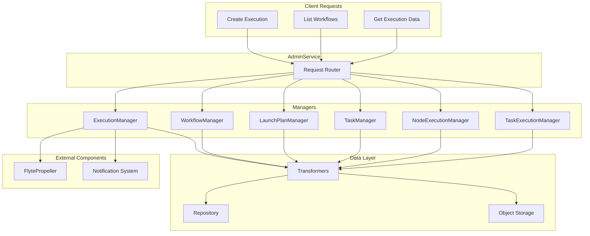
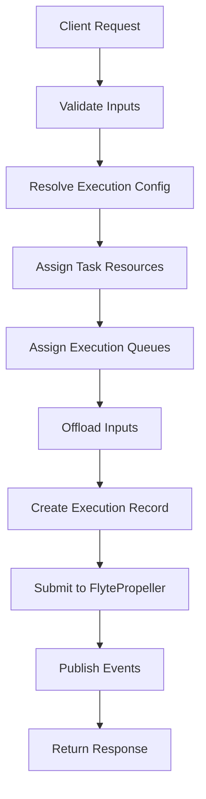

# Admin Service

<details>
<summary>Relevant source files</summary>

The following files were used as context for generating this wiki page:

- [flyteadmin/cmd/scheduler/entrypoints/scheduler.go](flyteadmin/cmd/scheduler/entrypoints/scheduler.go)
- [flyteadmin/pkg/manager/impl/execution_manager.go](flyteadmin/pkg/manager/impl/execution_manager.go)
- [flyteadmin/pkg/manager/impl/execution_manager_test.go](flyteadmin/pkg/manager/impl/execution_manager_test.go)
- [flyteadmin/pkg/manager/impl/node_execution_manager.go](flyteadmin/pkg/manager/impl/node_execution_manager.go)
- [flyteadmin/pkg/manager/impl/node_execution_manager_test.go](flyteadmin/pkg/manager/impl/node_execution_manager_test.go)
- [flyteadmin/pkg/manager/impl/task_execution_manager.go](flyteadmin/pkg/manager/impl/task_execution_manager.go)
- [flyteadmin/pkg/manager/impl/task_execution_manager_test.go](flyteadmin/pkg/manager/impl/task_execution_manager_test.go)
- [flyteadmin/pkg/repositories/config/migrations.go](flyteadmin/pkg/repositories/config/migrations.go)
- [flyteadmin/pkg/repositories/config/migrations_test.go](flyteadmin/pkg/repositories/config/migrations_test.go)
- [flyteadmin/pkg/repositories/models/execution.go](flyteadmin/pkg/repositories/models/execution.go)
- [flyteadmin/pkg/repositories/transformers/execution.go](flyteadmin/pkg/repositories/transformers/execution.go)
- [flyteadmin/pkg/repositories/transformers/execution_test.go](flyteadmin/pkg/repositories/transformers/execution_test.go)
- [flyteadmin/pkg/repositories/transformers/node_execution.go](flyteadmin/pkg/repositories/transformers/node_execution.go)
- [flyteadmin/pkg/repositories/transformers/node_execution_test.go](flyteadmin/pkg/repositories/transformers/node_execution_test.go)
- [flyteadmin/pkg/repositories/transformers/task_execution.go](flyteadmin/pkg/repositories/transformers/task_execution.go)
- [flyteadmin/pkg/repositories/transformers/task_execution_test.go](flyteadmin/pkg/repositories/transformers/task_execution_test.go)
- [flyteadmin/pkg/rpc/adminservice/base.go](flyteadmin/pkg/rpc/adminservice/base.go)
- [flyteadmin/pkg/runtime/application_config_provider.go](flyteadmin/pkg/runtime/application_config_provider.go)
- [flyteadmin/pkg/runtime/interfaces/application_configuration.go](flyteadmin/pkg/runtime/interfaces/application_configuration.go)
- [flyteadmin/pkg/workflowengine/impl/k8s_executor.go](flyteadmin/pkg/workflowengine/impl/k8s_executor.go)
- [flyteadmin/pkg/workflowengine/impl/k8s_executor_test.go](flyteadmin/pkg/workflowengine/impl/k8s_executor_test.go)
- [flyteadmin/pkg/workflowengine/impl/prepare_execution.go](flyteadmin/pkg/workflowengine/impl/prepare_execution.go)
- [flyteadmin/pkg/workflowengine/impl/prepare_execution_test.go](flyteadmin/pkg/workflowengine/impl/prepare_execution_test.go)
- [flyteadmin/pkg/workflowengine/interfaces/executor.go](flyteadmin/pkg/workflowengine/interfaces/executor.go)
- [flyteidl/clients/go/assets/admin.swagger.json](flyteidl/clients/go/assets/admin.swagger.json)
- [flyteidl/gen/pb-es/flyteidl/core/workflow_pb.ts](flyteidl/gen/pb-es/flyteidl/core/workflow_pb.ts)
- [flyteidl/gen/pb-go/flyteidl/core/workflow.pb.go](flyteidl/gen/pb-go/flyteidl/core/workflow.pb.go)
- [flyteidl/gen/pb-go/flyteidl/service/admin.pb.go](flyteidl/gen/pb-go/flyteidl/service/admin.pb.go)
- [flyteidl/gen/pb-go/gateway/flyteidl/service/admin.swagger.json](flyteidl/gen/pb-go/gateway/flyteidl/service/admin.swagger.json)
- [flyteidl/gen/pb-go/gateway/flyteidl/service/agent.swagger.json](flyteidl/gen/pb-go/gateway/flyteidl/service/agent.swagger.json)
- [flyteidl/gen/pb-go/gateway/flyteidl/service/external_plugin_service.swagger.json](flyteidl/gen/pb-go/gateway/flyteidl/service/external_plugin_service.swagger.json)
- [flyteidl/gen/pb-js/flyteidl.d.ts](flyteidl/gen/pb-js/flyteidl.d.ts)
- [flyteidl/gen/pb-js/flyteidl.js](flyteidl/gen/pb-js/flyteidl.js)
- [flyteidl/gen/pb_python/flyteidl/core/workflow_pb2.py](flyteidl/gen/pb_python/flyteidl/core/workflow_pb2.py)
- [flyteidl/gen/pb_python/flyteidl/core/workflow_pb2.pyi](flyteidl/gen/pb_python/flyteidl/core/workflow_pb2.pyi)
- [flyteidl/gen/pb_python/flyteidl/service/admin_pb2.py](flyteidl/gen/pb_python/flyteidl/service/admin_pb2.py)
- [flyteidl/gen/pb_rust/flyteidl.core.rs](flyteidl/gen/pb_rust/flyteidl.core.rs)
- [flyteidl/protos/flyteidl/core/workflow.proto](flyteidl/protos/flyteidl/core/workflow.proto)
- [flyteidl/protos/flyteidl/service/admin.proto](flyteidl/protos/flyteidl/service/admin.proto)
- [flyteplugins/go/tasks/plugins/array/k8s/subtask.go](flyteplugins/go/tasks/plugins/array/k8s/subtask.go)

</details>


The Admin Service is a critical component in the Flyte control plane that serves as the centralized management API for all Flyte workflow-related operations. It provides a comprehensive set of endpoints for creating, monitoring, and managing workflows, tasks, executions, launch plans, and other core Flyte entities.

## Purpose and Scope

This page documents the Admin Service architecture, its internal components, API capabilities, and how it interacts with other components of the Flyte system. For information about the workflow execution engine itself, see [Workflow Execution Engine](#3), and for FlyteIDL specification details, see [FlyteIDL](#5.1).

## System Architecture

The Admin Service serves as the central API gateway for Flyte, handling client requests from the CLI, UI, and SDKs while interacting with various backend services and data stores.



Sources:
- [flyteadmin/pkg/rpc/adminservice/base.go:29-44]()
- [flyteadmin/pkg/rpc/adminservice/base.go:48-86]()
- [flyteadmin/pkg/manager/impl/execution_manager.go:75-93]()

## Core Components

The Admin Service is built around a set of specialized managers, each handling different aspects of workflow management.

### AdminService

The primary service interface that handles gRPC and HTTP requests. It coordinates all operations by delegating to appropriate managers.

```go
type AdminService struct {
    TaskManager              interfaces.TaskInterface
    WorkflowManager          interfaces.WorkflowInterface
    LaunchPlanManager        interfaces.LaunchPlanInterface
    ExecutionManager         interfaces.ExecutionInterface
    NodeExecutionManager     interfaces.NodeExecutionInterface
    TaskExecutionManager     interfaces.TaskExecutionInterface
    ProjectManager           interfaces.ProjectInterface
    ResourceManager          interfaces.ResourceInterface
    NamedEntityManager       interfaces.NamedEntityInterface
    VersionManager           interfaces.VersionInterface
    DescriptionEntityManager interfaces.DescriptionEntityInterface
    MetricsManager           interfaces.MetricsInterface
}
```

Sources:
- [flyteadmin/pkg/rpc/adminservice/base.go:29-44]()

### ExecutionManager

Handles the creation, monitoring, and management of workflow executions. This component is responsible for:
- Creating new executions based on client requests
- Transforming execution models to and from database representations
- Tracking execution status and handling state transitions
- Retrieving execution data and metadata

Sources:
- [flyteadmin/pkg/manager/impl/execution_manager.go:75-93]()
- [flyteadmin/pkg/repositories/transformers/execution.go:30-53]()

### Database Interface

The Admin Service uses a repository pattern to abstract database operations, supporting multiple backend databases (e.g., Postgres, SQLite).

Sources:
- [flyteadmin/pkg/repositories/config/migrations.go:19-24]()
- [flyteadmin/pkg/runtime/interfaces/application_configuration.go:22-38]()

## Execution Flow

The following sequence diagram illustrates how the Admin Service handles workflow execution creation:



Sources:
- [flyteadmin/pkg/manager/impl/execution_manager.go:450-630]()
- [flyteadmin/pkg/manager/impl/execution_manager_test.go:302-412]()

## Data Model

The Admin Service manages several key entities that are persisted in the database and transformed into API representations.

### Core Entities



Sources:
- [flyteadmin/pkg/repositories/transformers/execution.go:30-53]()
- [flyteadmin/pkg/repositories/transformers/node_execution.go:22-29]()
- [flyteadmin/pkg/repositories/transformers/task_execution.go:30-34]()

## API Overview

The Admin Service exposes a comprehensive set of gRPC and HTTP endpoints for interacting with Flyte resources. The major API categories include:

### Workflow Management
- Create, retrieve, and list workflows
- Register and version workflows

### Task Management
- Create, retrieve, and list tasks
- Register and version tasks

### Launch Plan Management
- Create, retrieve, and list launch plans
- Activate/deactivate launch plans

### Execution Management
- Create new workflow executions
- Retrieve execution status and details
- List executions with filtering
- Terminate running executions
- Retrieve execution data (inputs/outputs)

### Node Execution Management
- Retrieve node execution details
- List node executions
- Retrieve node execution data

### Task Execution Management
- Retrieve task execution details
- List task executions
- Retrieve task execution data

### Project Management
- Create and manage projects
- Register domain resources

Sources:
- [flyteidl/clients/go/assets/admin.swagger.json:19-535]()
- [flyteidl/gen/pb-go/gateway/flyteidl/service/admin.swagger.json:19-310]()

## Data Flow Between Components



Sources:
- [flyteadmin/pkg/rpc/adminservice/base.go:48-86]()
- [flyteadmin/pkg/manager/impl/execution_manager.go:100-174]()
- [flyteadmin/pkg/repositories/transformers/execution.go:61-148]()

## Configuration

The Admin Service can be configured through several configuration objects:

### Application Configuration

Controls the base behavior of the Admin Service including metrics, roles, event handling, and default workflow behaviors.

```go
type ApplicationConfig struct {
    RoleNameKey string
    MetricsScope string
    MetricKeys []string
    ProfilerPort int
    MetadataStoragePrefix []string
    EventVersion int
    AsyncEventsBufferSize int
    MaxParallelism int32
    Labels map[string]string
    Annotations map[string]string
    Interruptible bool
    OverwriteCache bool
    AssumableIamRole string
    K8SServiceAccount string
    OutputLocationPrefix string
    UseOffloadedWorkflowClosure bool
    Envs map[string]string
    FeatureGates FeatureGates
    ConsoleURL string
    UseOffloadedInputs bool
}
```

Sources:
- [flyteadmin/pkg/runtime/interfaces/application_configuration.go:62-118]()
- [flyteadmin/pkg/runtime/application_config_provider.go:23-37]()

### Database Configuration

Configures the database connection used by the Admin Service.

```go
type DbConfig struct {
    EnableForeignKeyConstraintWhenMigrating bool
    MaxIdleConnections int
    MaxOpenConnections int
    ConnMaxLifeTime config.Duration
    PostgresConfig *PostgresConfig
    SQLiteConfig *SQLiteConfig
}
```

Sources:
- [flyteadmin/pkg/runtime/interfaces/application_configuration.go:22-38]()

## Security

The Admin Service supports security features including:

- Authentication via various providers
- Authorization with role-based access control
- Identity propagation for executions
- Security contexts for execution isolation

Security contexts can be defined at various levels:
- Execution level
- Launch plan level
- Project/domain level
- System-wide defaults

Sources:
- [flyteadmin/pkg/manager/impl/execution_manager.go:371-397]()
- [flyteadmin/pkg/runtime/interfaces/application_configuration.go:98-101]()

## Integration with External Systems

The Admin Service integrates with various external systems:

### Storage Systems
- Object storage for inputs/outputs and workflow closures
- Database for metadata and state

### Notification Systems
- Support for email, Slack, and other notification channels
- Event publishing to Kafka and other message buses

### CloudEvents
- Publishing workflow events to CloudEvents-compatible systems

Sources:
- [flyteadmin/pkg/rpc/adminservice/base.go:86-87]()
- [flyteadmin/pkg/manager/impl/execution_manager.go:89-91]()

## Workflow Execution Creation

Creating a workflow execution is one of the most complex operations handled by the Admin Service. It involves:

1. Validating the launch plan and inputs
2. Resolving execution configuration (defaults, overrides)
3. Offloading inputs to object storage
4. Creating the execution record
5. Submitting the execution to FlytePropeller
6. Publishing events and notifications



Sources:
- [flyteadmin/pkg/manager/impl/execution_manager.go:450-630]()
- [flyteadmin/pkg/manager/impl/execution_manager_test.go:302-412]()

## Error Handling

The Admin Service uses a standardized error handling approach:

- gRPC status codes for API errors
- Structured error objects with codes, messages, and kind (system vs. user)
- Error propagation from the database layer through transformers to the API
- Error metrics for monitoring

Sources:
- [flyteadmin/pkg/repositories/transformers/execution.go:88-104]()
- [flyteadmin/pkg/manager/impl/execution_manager.go:74-78]()

## Metrics and Monitoring

The Admin Service exposes various metrics for monitoring:

- Active executions counter
- Execution creation/termination rates
- Execution latency histograms
- Error counters by type
- System resource usage

Sources:
- [flyteadmin/pkg/manager/impl/execution_manager.go:50-65]()
- [flyteadmin/pkg/manager/impl/execution_manager.go:67-73]()

## Conclusion

The Admin Service is the central management component of the Flyte platform, providing a unified API for all workflow management operations. Its modular architecture allows for flexibility and extensibility while maintaining a consistent interface for clients. By handling the complex orchestration of workflow resources, the Admin Service enables users to focus on defining their workflows rather than managing infrastructure.