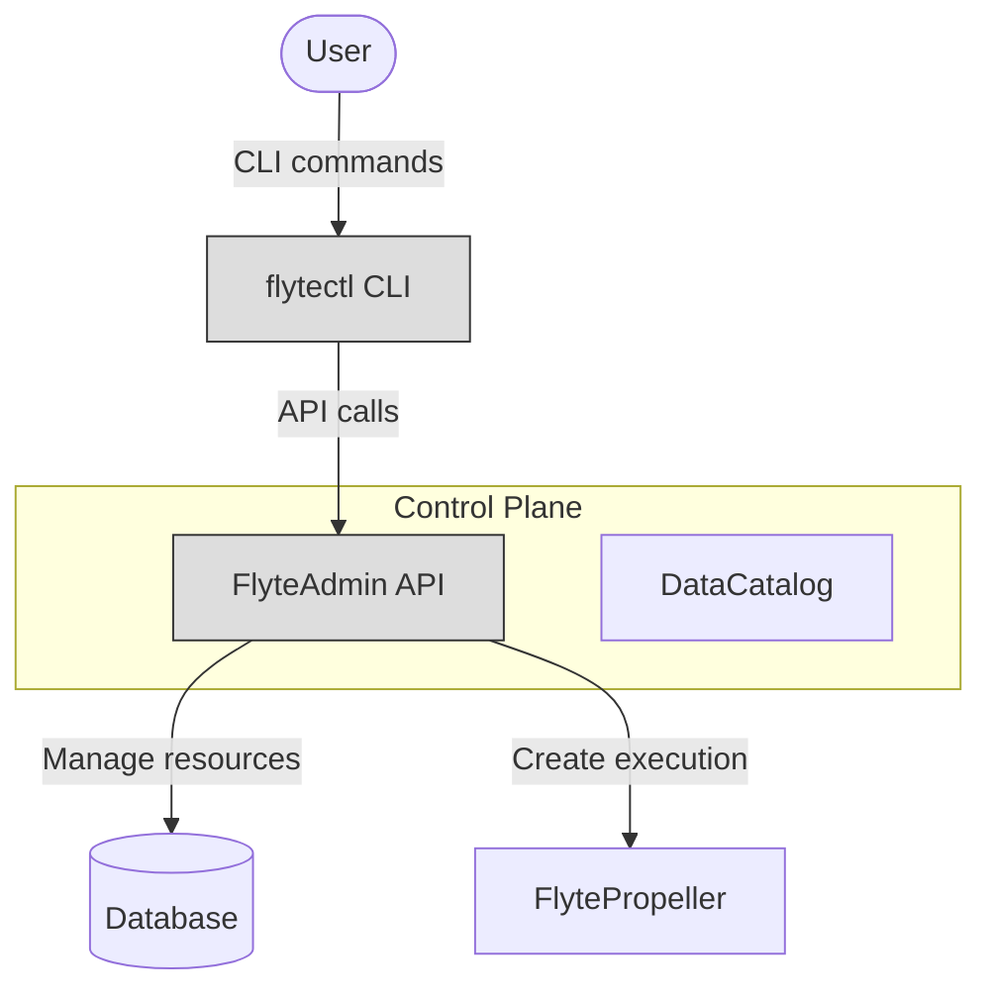
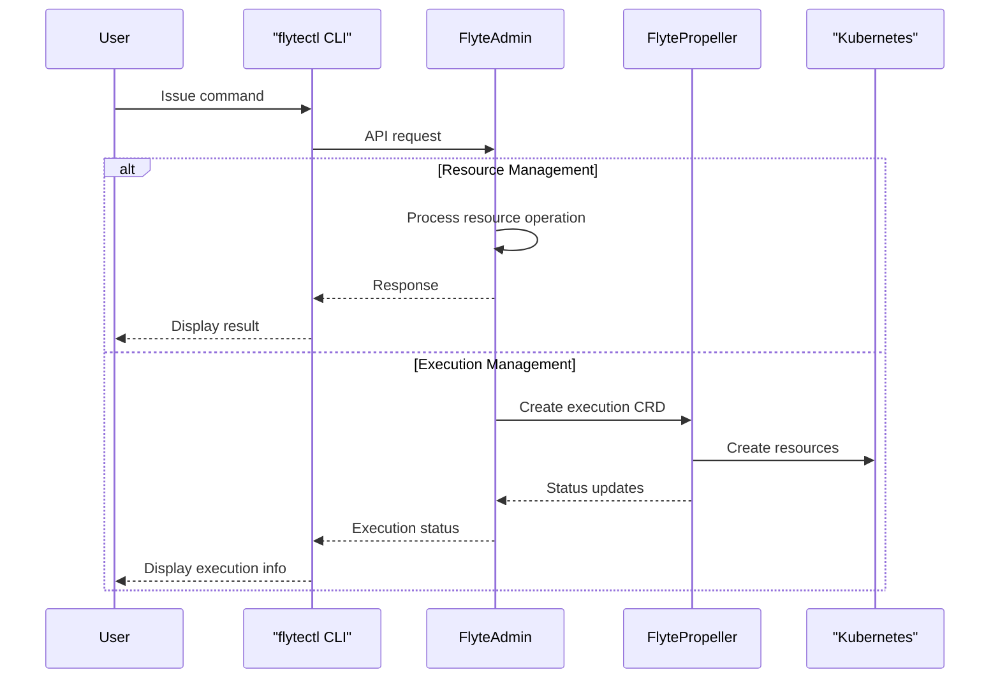
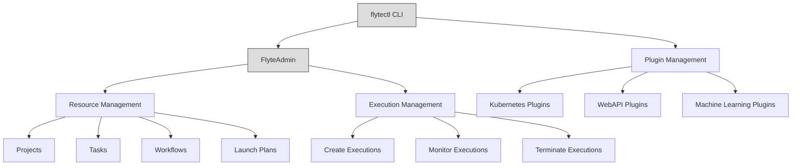

# Command Line Interface

<details>
<summary>Relevant source files</summary>

The following files were used as context for generating this wiki page:

- [README.md](README.md)
- [flytectl/go.mod](flytectl/go.mod)
- [flytectl/go.sum](flytectl/go.sum)

</details>


## Overview

The Flyte Command Line Interface (CLI), known as `flytectl`, is the primary tool for interacting with Flyte from the terminal. It enables users to manage Flyte resources, execute workflows, and administer Flyte deployments. This document covers the purpose, installation, configuration, and usage of flytectl.

Sources: [README.md:84-85]()

## Purpose and Scope

`flytectl` serves as a bridge between users and the Flyte control plane, allowing interaction with Flyte resources via a command-line interface. It communicates with the FlyteAdmin service to perform operations like creating and managing workflows, tasks, launch plans, executions, and more. The CLI also provides utilities for local development, debugging, and administering Flyte deployments.

In the Flyte architecture, flytectl is one of the user-facing components alongside the Python/Java/Scala SDKs and the FlyteConsole UI.



*Figure: flytectl in the Flyte architecture*

Sources: [README.md:70-88]()

## Installation

### Using Homebrew (macOS/Linux)

```bash
brew install flyteorg/homebrew-tap/flytectl
```

### Using Binary Releases

Pre-built binaries for various platforms are available on the [GitHub releases page](https://github.com/flyteorg/flyte/releases).

### Verify Installation

After installation, verify that flytectl is working correctly:

```bash
flytectl version
```

Sources: [README.md:84-85]()

## Command Structure

`flytectl` follows a hierarchical command structure with the following general pattern:

```
flytectl [global-options] command [sub-command] [command-options] [arguments]
```



```mermaid
flowchart TD
    flytectl["flytectl"] --> config["config"]
    flytectl --> create["create"]
    flytectl --> delete["delete"]
    flytectl --> get["get"]
    flytectl --> register["register"]
    flytectl --> update["update"]
    flytectl --> demo["demo"]
    flytectl --> sandbox["sandbox"]
    flytectl --> version["version"]
    flytectl --> completion["completion"]
    
    create --> create_project["project"]
    create --> create_execution["execution"]
    create --> create_task["task"]
    create --> create_workflow["workflow"]
    create --> create_launchplan["launchplan"]
    
    get --> get_execution["execution"]
    get --> get_task["task"]
    get --> get_workflow["workflow"]
    get --> get_launchplan["launchplan"]
    get --> get_project["project"]
    
    register --> register_files["files"]
    register --> register_project["project"]
    
    update --> update_project["project"]
    update --> update_launchplan["launchplan"]
    update --> update_workflow["workflow"]
    
    delete --> delete_execution["execution"]
    delete --> delete_task["task"]
    delete --> delete_workflow["workflow"]
    delete --> delete_launchplan["launchplan"]
    delete --> delete_project["project"]
    
    demo --> start["start"]
    demo --> exec["exec"]
    demo --> teardown["teardown"]
```

*Figure: High-level command structure of flytectl*

Sources: [flytectl/go.mod:1-201]()

## Common Global Flags

| Flag | Description |
|------|-------------|
| `--admin-endpoint` | FlyteAdmin service endpoint |
| `--config` | Path to the config file |
| `--project` | Flyte project to use |
| `--domain` | Flyte domain to use |
| `--output` | Output format (table, json, yaml) |
| `--verbose` | Enable verbose logging |
| `--quiet` | Disable all output except errors |

Sources: [flytectl/go.mod:32-47]()

## Key Command Categories

### Cluster Management

The `demo` and `sandbox` commands help in setting up and managing local Flyte deployments for development and testing purposes.

```bash
# Start a local Flyte sandbox
flytectl demo start

# Execute a command inside the sandbox
flytectl demo exec -- ls -la

# Tear down the sandbox
flytectl demo teardown
```

Sources: [README.md:84-85]()

### Resource Management

`flytectl` provides commands to create, get, update, and delete Flyte resources:

#### Projects and Domains

Projects are logical groupings of Flyte entities, while domains (like development, staging, production) help separate different environments within a project.

```bash
# Create a new project
flytectl create project --id my-project --name "My Project" --description "My new project"

# Get information about a project
flytectl get project my-project

# Update a project
flytectl update project my-project --description "Updated description"
```

#### Workflows, Tasks, and Launch Plans

```bash
# Get workflow information
flytectl get workflow --project flytesnacks --domain development my_workflow

# Create a launch plan
flytectl create launchplan --project flytesnacks --domain development \
    --workflow my_workflow --version v1 my_launch_plan

# Register entities from a file
flytectl register files --project flytesnacks --domain development \
    --archive workflow.tar.gz
```

#### Executions

```bash
# Create a workflow execution
flytectl create execution --project flytesnacks --domain development \
    --launch-plan my_launch_plan --version v1

# Get execution details
flytectl get execution --project flytesnacks --domain development execution_id

# Terminate a running execution
flytectl delete execution --project flytesnacks --domain development execution_id
```

Sources: [flytectl/go.mod:32-47]()

## Authentication

`flytectl` supports multiple authentication methods to connect with Flyte clusters:

1. **Basic Authentication**: Using username and password
2. **API Key Authentication**: Using client ID and client secret
3. **OpenID Connect**: Using OIDC providers
4. **Kubernetes Service Account**: When running within a Kubernetes cluster

Authentication settings can be configured in the flytectl config file or through environment variables.

Sources: [flytectl/go.mod:37-39]()

## Configuration

### Config File

`flytectl` uses a configuration file (by default located at `~/.flyte/config.yaml`) to store settings. This file can be generated using the `flytectl config init` command.

Example config file structure:

```yaml
admin:
  # FlyteAdmin service endpoint
  endpoint: dns:///localhost:30081
  # Authentication method
  authType: Basic
  # Insecure connection (disable TLS verification)
  insecure: true

# Default project and domain
project: flytesnacks
domain: development

# Output format (json, yaml, or table)
output: table
```

### Environment Variables

Configuration can also be provided via environment variables, which take precedence over config file values:

| Environment Variable | Description |
|----------------------|-------------|
| `FLYTECTL_ADMIN_ENDPOINT` | FlyteAdmin service endpoint |
| `FLYTECTL_ADMIN_INSECURE` | Disable TLS verification |
| `FLYTECTL_PROJECT` | Default project |
| `FLYTECTL_DOMAIN` | Default domain |

Sources: [flytectl/go.mod:32-47]()

## Data Flow and Integration

The following diagram illustrates how `flytectl` integrates with other components in the Flyte ecosystem:



*Figure: Data flow between flytectl and Flyte components*

Sources: [flytectl/go.mod:16-18]()

## Key Use Cases

### Local Development

```bash
# Start a local sandbox
flytectl demo start

# Register local workflow code
flytectl register files -p flytesnacks -d development --sourceDir ./my_workflows

# Execute a workflow
flytectl create execution -p flytesnacks -d development --lp my_workflow 
```

### Production Deployment

```bash
# Configure connection to production Flyte cluster
flytectl config use-context production

# Create or update a project
flytectl create project -p my-project --name "Production Project"

# Register workflow from archive
flytectl register files -p my-project -d production --archive ./workflows.tar.gz

# Update a launch plan
flytectl update launchplan -p my-project -d production --version v2 --activate my_launchplan
```

### Monitoring and Management

```bash
# Get executions for a project
flytectl get execution -p my-project -d production

# Get workflow execution details
flytectl get execution -p my-project -d production execution_id

# Terminate a running execution
flytectl delete execution -p my-project -d production execution_id
```

Sources: [README.md:84-85](), [flytectl/go.mod:32-47]()

## Plugin Integration

`flytectl` integrates with various plugins and extensions of the Flyte platform:



*Figure: flytectl's role in plugin management*

Sources: [flytectl/go.mod:5-48]()

## Conclusion

`flytectl` is a powerful command-line tool for interacting with Flyte. It provides a comprehensive set of commands to manage Flyte resources and executions. Whether you're a developer working locally or an administrator managing a production deployment, `flytectl` offers the functionality needed to effectively work with Flyte.

For more detailed information about specific commands, check the official documentation or use the built-in help:

```bash
flytectl --help
flytectl <command> --help
```

Sources: [README.md:70-88](), [flytectl/go.mod:1-201]()