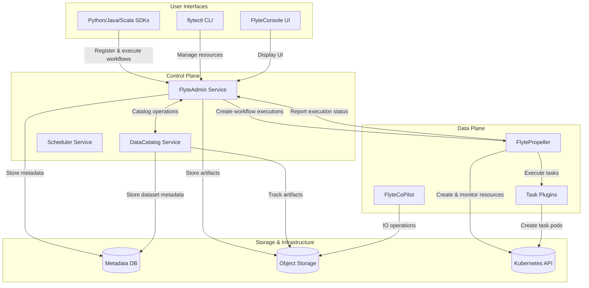
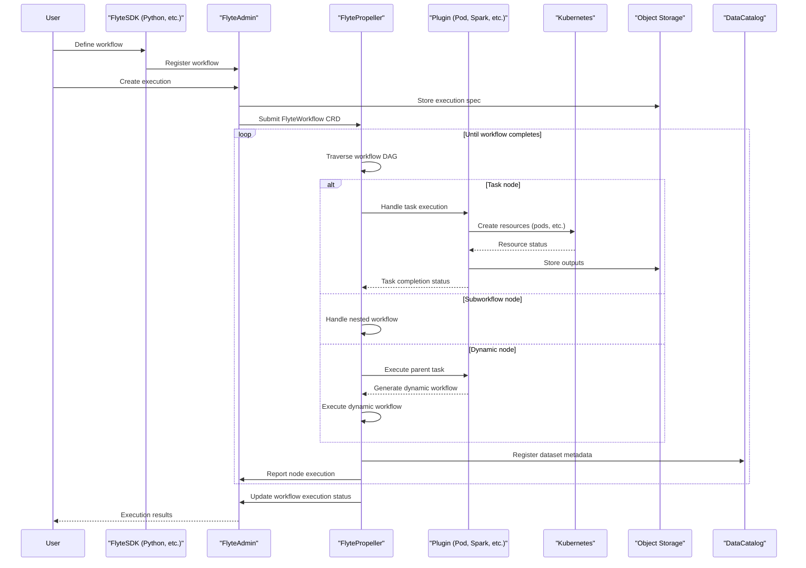
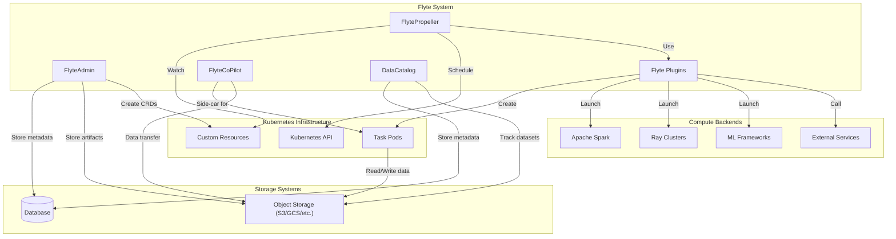
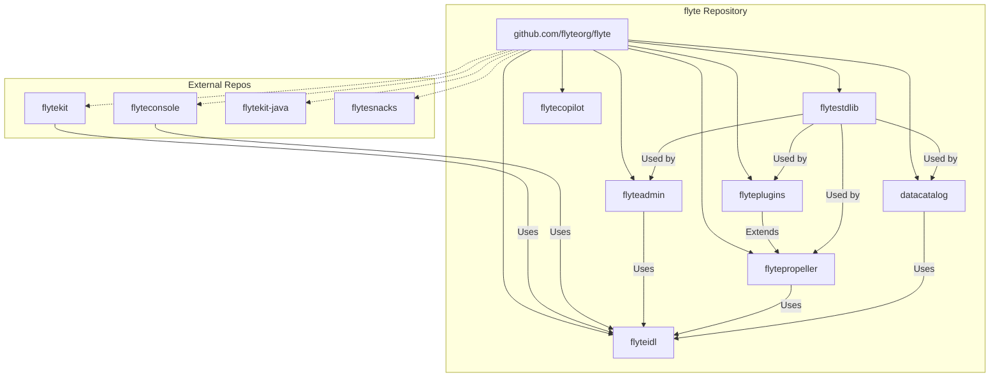

# Overview

Relevant source files

The following files were used as context for generating this wiki page:

- [README.md](README.md)
- [datacatalog/go.mod](datacatalog/go.mod)
- [datacatalog/go.sum](datacatalog/go.sum)
- [flyteadmin/go.mod](flyteadmin/go.mod)
- [flyteadmin/go.sum](flyteadmin/go.sum)
- [flytecopilot/go.mod](flytecopilot/go.mod)
- [flytecopilot/go.sum](flytecopilot/go.sum)
- [flyteidl/go.mod](flyteidl/go.mod)
- [flyteidl/go.sum](flyteidl/go.sum)
- [flyteplugins/go.mod](flyteplugins/go.mod)
- [flyteplugins/go.sum](flyteplugins/go.sum)
- [flytepropeller/go.mod](flytepropeller/go.mod)
- [flytepropeller/go.sum](flytepropeller/go.sum)
- [go.mod](go.mod)
- [go.sum](go.sum)

Flyte is an open-source workflow automation platform designed for data processing, machine learning, and analytics workloads. This document provides a high-level overview of the Flyte system architecture, core components, and how they interact to enable workflow orchestration at scale.

Flyte leverages Kubernetes as its underlying execution platform, providing scalability, reproducibility, and reliability for complex computational workflows. This page focuses on introducing the system architecture and core components of the Flyte codebase.

For detailed information about deploying Flyte, see [Deployment](#2), and for a deeper dive into how Flyte executes workflows, see [Workflow Execution Engine](#3).

## Core System Architecture

Flyte's architecture is divided into control plane and data plane components, with additional user-facing interfaces that allow users to interact with the system.

*Diagram: Flyte System Architecture*

Sources: [README.md:33-34](), [flytepropeller/go.mod:1-48](), [flyteadmin/go.mod:1-73](), [go.mod:1-17]()

### Core Components

| Component | Description | Repository Path |
|-----------|-------------|-----------------|
| **FlyteAdmin** | Core service that manages workflow executions, schedules, and system metadata. Provides the main interface for users and other components to interact with Flyte. | `/flyteadmin` |
| **FlytePropeller** | Kubernetes operator that executes workflows. Responsible for traversing workflow DAGs and launching task executions. | `/flytepropeller` |
| **DataCatalog** | Service that manages metadata for datasets and artifacts, enabling data lineage and reuse. | `/datacatalog` |
| **FlyteConsole** | Web UI for users to visualize, manage and analyze workflows and executions. | Not in this repo |
| **flytectl** | Command-line interface for Flyte. | Not in this repo |
| **FlyteCoPilot** | Sidecar container that assists with data transfer and IO operations for task containers. | `/flytecopilot` |
| **FlytePlugins** | Collection of plugins that extend FlytePropeller to support various types of tasks and integrations. | `/flyteplugins` |
| **FlyteIDL** | Interface definition language files defining Flyte's core APIs and data models. | `/flyteidl` |

Sources: [README.md:33-166](), [flytepropeller/go.mod:1-48](), [flyteadmin/go.mod:1-73](), [datacatalog/go.mod:1-24](), [flyteidl/go.mod:1-28](), [flytecopilot/go.mod:1-21]()

## Workflow Execution Flow

A key concept in Flyte is the workflow execution lifecycle. The diagram below illustrates how a workflow flows through the system from definition to execution:

*Diagram: Workflow Execution Lifecycle*

Sources: [flytepropeller/go.mod:1-48](), [flyteadmin/go.mod:1-73](), [README.md:76-89]()

## System Integration Architecture

The following diagram illustrates how Flyte integrates with external systems and infrastructure components:

*Diagram: Flyte System Integration Architecture*

Sources: [README.md:106-134](), [flyteplugins/go.mod:1-45](), [flytepropeller/go.mod:41-47]()

## Code Organization

The Flyte codebase is organized into several key repositories, with the main components structured as shown below:

*Diagram: Flyte Code Organization*

Sources: [go.mod:1-17](), [flytepropeller/go.mod:9-12](), [flyteadmin/go.mod:15-19](), [flytecopilot/go.mod:7-8]()

## Key Concepts

Understanding Flyte requires familiarity with the following core concepts:

### Workflow Components

| Concept | Description |
|---------|-------------|
| **Workflow** | A directed acyclic graph (DAG) of tasks that defines a process. Workflows are defined in code using Flyte SDKs. |
| **Task** | An individual unit of work in a workflow. Tasks can be Python functions, containers, or other execution units. |
| **Node** | A node in the workflow graph. Can represent a task, a subworkflow, or control flow elements. |
| **Execution** | An instance of a workflow that is running or has completed. |
| **Launch Plan** | A template for creating workflow executions with predefined inputs. |
| **Project & Domain** | Organizational units for workflows, providing isolation and governance. |

### Data Types and IO

| Concept | Description |
|---------|-------------|
| **FlyteFile/FlyteDirectory** | Types for transferring files and directories between tasks and storage. |
| **Structured Dataset** | An abstract 2D representation for data exchange that enforces type checking. |
| **Types** | Flyte has a strong type system that validates inputs and outputs throughout the workflow. |
| **Data Catalog** | Manages metadata about datasets to enable lineage tracking and reuse. |

Sources: [README.md:106-133](), [flyteidl/go.mod:1-28]()

## Operational Features

Flyte provides several operational features that make it suitable for production machine learning and data processing:

- **Reproducibility**: Immutable executions ensure workflow runs can be reproduced exactly.
- **Fault Tolerance**: Failed tasks can be retried or recovered without rerunning the entire workflow.
- **Caching**: Outputs can be cached to avoid redundant computation.
- **Resource Management**: Tasks can request specific compute resources (CPU, memory, GPU).
- **Multi-tenancy**: Projects and domains provide isolation between different users and teams.
- **Scheduling**: Workflows can be scheduled to run periodically.
- **Observability**: Comprehensive tracking of execution status, inputs, outputs, and logs.

Sources: [README.md:32-156]()

## Summary

Flyte is a comprehensive workflow orchestration platform built on Kubernetes. Its architecture is divided into control plane components (FlyteAdmin, DataCatalog) and data plane components (FlytePropeller, plugins). The system is designed to support a wide range of workflow types, from simple data processing to complex machine learning pipelines, with strong emphasis on reproducibility, scalability, and reliability.

This overview provides a foundation for understanding the Flyte system. For more detailed information about specific components and features, refer to the related pages in this wiki.