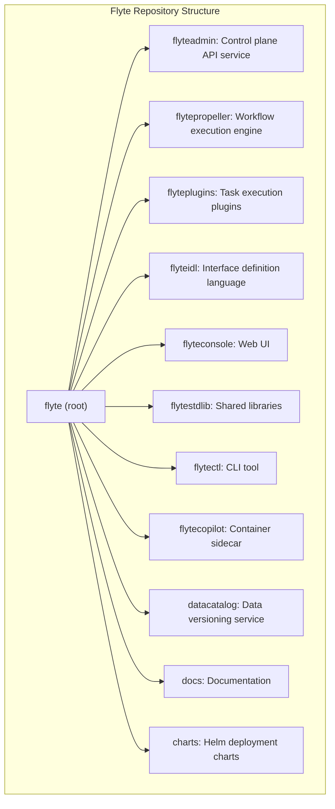
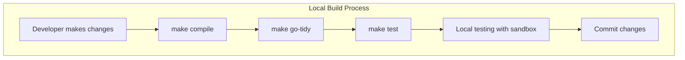
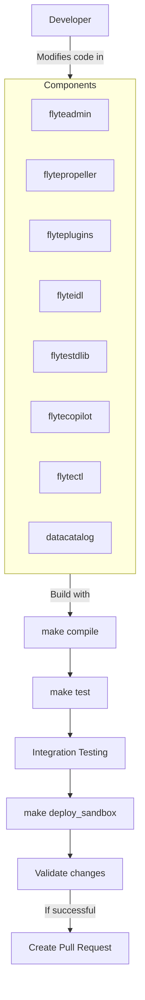
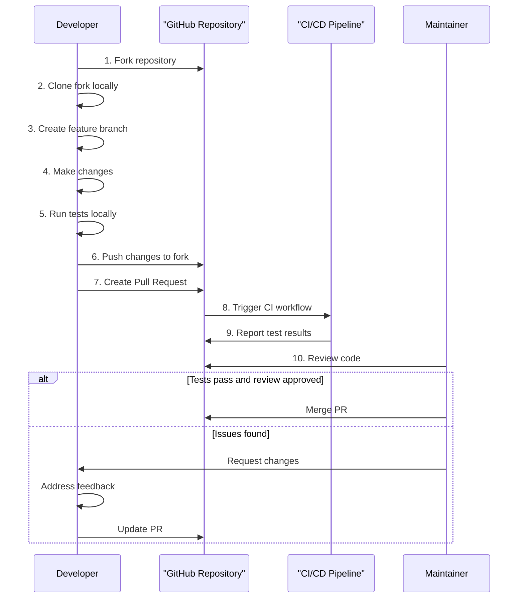
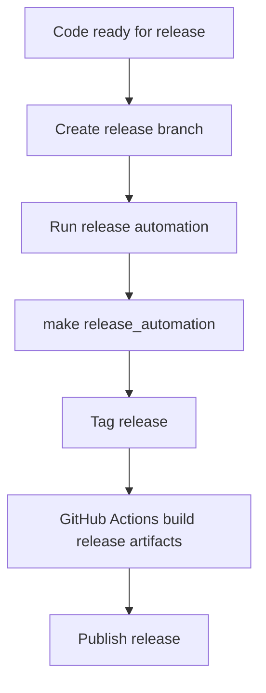

# Development and Contribution

<details>
<summary>Relevant source files</summary>

The following files were used as context for generating this wiki page:

- [Makefile](Makefile)

</details>


This page serves as a comprehensive guide for developers who want to contribute to the Flyte project. It covers the development environment setup, build processes, testing workflows, and contribution guidelines. For specific details about the build system, see [Build System](#7.1), and for CI/CD pipeline information, see [CI/CD Pipeline](#7.2).

## Setting Up Development Environment

### Prerequisites

Before you start contributing to Flyte, ensure you have the following prerequisites installed:

- Go (recommended version 1.19+)
- Docker
- kubectl
- Helm
- Make
- Git
- Python 3.9+ (for documentation and some tooling)

### Local Development Setup

Flyte provides a convenient command to set up a local development environment:

```bash
make setup_local_dev
```

This command sets up a k3d cluster with all Flyte dependencies for local development.

Sources: [Makefile:115-117]()

## Repository Structure

The Flyte repository is organized as a monorepo containing multiple components:



Sources: [Makefile:131-139]()

## Build and Development Commands

The Makefile provides several useful commands for development:

| Command | Description |
|---------|-------------|
| `make compile` | Builds the Flyte binary for local use |
| `make linux_compile` | Builds the Flyte binary for Linux |
| `make helm` | Generates Kubernetes manifests from Helm charts |
| `make deploy_sandbox` | Deploys a sandbox environment |
| `make go-tidy` | Runs go mod tidy across all modules |
| `make docs` | Builds the documentation |
| `make dev-docs` | Builds docs in a Docker container for local development |
| `make help` | Lists all available make commands |
| `make setup_local_dev` | Sets up k3d cluster with Flyte dependencies |
| `make lint-helm-charts` | Validates Helm charts |
| `make spellcheck` | Runs a spell checker on the codebase |

Sources: [Makefile:16-147]()

## Development Workflow

### Local Build Process

This diagram illustrates how the local build process works:



Sources: [Makefile:16-25](), [Makefile:130-139]()

### Component Development and Testing

Each component in the Flyte ecosystem has its own build and test process. The following diagram illustrates how these components relate to each other during development:



Sources: [Makefile:16-25](), [Makefile:130-139]()

## Contribution Process

### Pull Request Workflow

The following diagram outlines the recommended workflow for contributing to Flyte:



### Code Quality

Before submitting a pull request, ensure that your code:

1. Has proper tests
2. Follows Go code style conventions
3. Has appropriate documentation
4. Passes all CI checks

Run the following commands before submitting your changes:

```bash
make go-tidy      # Ensure go.mod files are up to date
make lint         # Run linting checks
make test         # Run unit tests
```

Sources: [Makefile:130-139](), [Makefile:142-147]()

## Release Process

Flyte follows a standard release process managed through GitHub releases. The release process is automated using scripts in the repository.



The release automation script handles:
- Generating release artifacts
- Creating documentation
- Building Docker images
- Generating Helm charts and manifests

Sources: [Makefile:39-44]()

## Documentation

Documentation is a crucial part of the Flyte project. To build and contribute to documentation:

```bash
# Install documentation dependencies
make install-piptools
make install-conda-lock

# Build documentation locally
make dev-docs
```

The documentation uses Sphinx and is hosted on Read the Docs.

Sources: [Makefile:50-108]()

## Additional Development Tips

### Working with Helm Charts

For Kubernetes deployments, Flyte uses Helm charts. To work with these charts:

```bash
# Update Helm chart dependencies
make helm_update

# Install Helm charts
make helm_install

# Upgrade existing installation
make helm_upgrade
```

Sources: [Makefile:34-84]()

### Building for Multiple Platforms

Flyte supports building for different platforms:

```bash
# Build for local platform
make compile

# Build for Linux
make linux_compile

# Build multi-architecture Docker image
make build_native_flyte
```

Sources: [Makefile:16-29](), [Makefile:119-126]()

### Quick Reference for Common Development Tasks

| Task | Command |
|------|---------|
| Set up local dev environment | `make setup_local_dev` |
| Build the Flyte binary | `make compile` |
| Update all go.mod files | `make go-tidy` |
| Run spell check | `make spellcheck` |
| Test Helm charts | `make lint-helm-charts` |
| Build documentation | `make dev-docs` |
| Clean build artifacts | `make clean` |

Sources: [Makefile:110-152]()