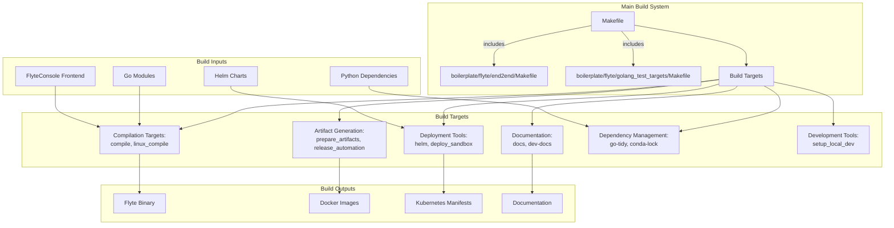
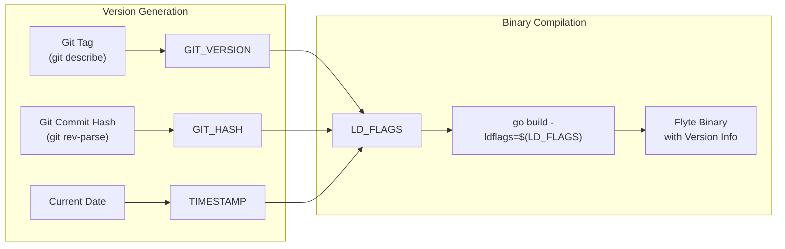
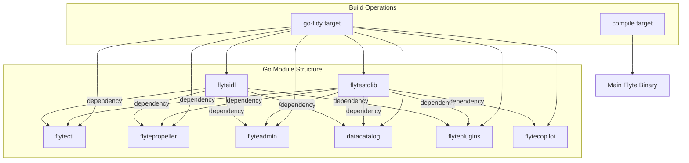
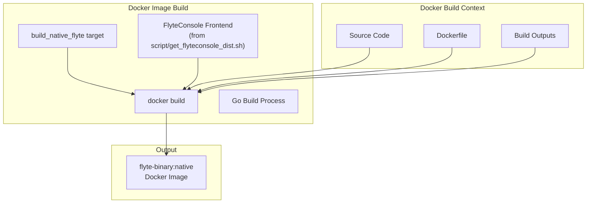
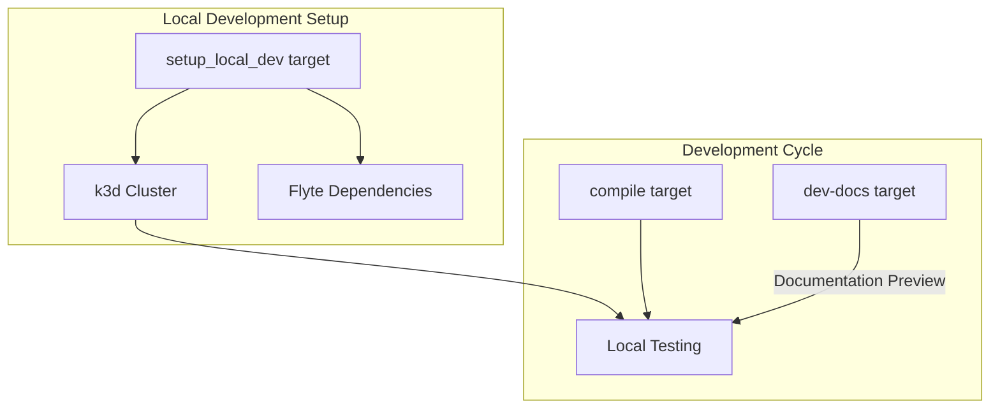
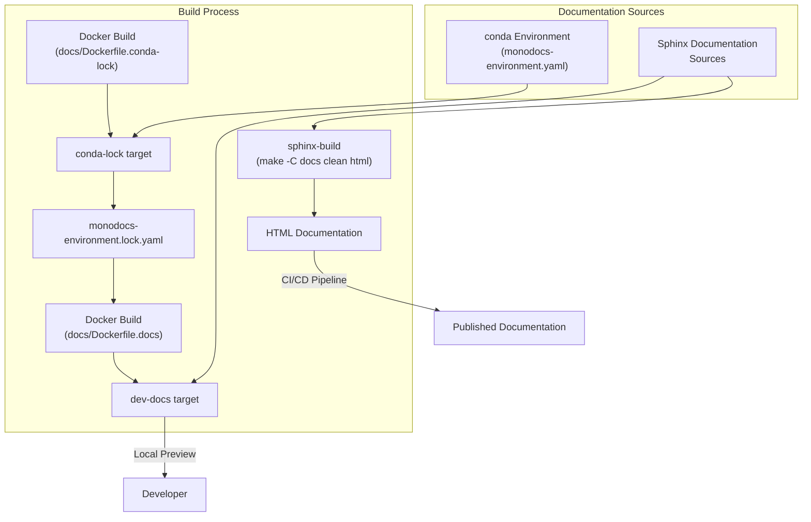

# Build System

Relevant source files

The following files were used as context for generating this wiki page:

- [Makefile](Makefile)

## Purpose and Scope

This document provides a technical overview of the Flyte build system, which handles compilation, dependency management, deployment preparation, and development workflow automation. The build system is primarily implemented through a set of Makefiles that coordinate various build tools across multiple languages and components. For information about the CI/CD pipeline that uses this build system, see [CI/CD Pipeline](#7.2).

## Build System Architecture

The Flyte build system is organized as a collection of Makefile targets that coordinate various build processes across the monorepo structure.

Sources: [Makefile:1-152]()

## Core Components

The Flyte build system integrates several key components:

1. **Makefile Targets**: Primary interface for developers to build, test, and deploy Flyte
2. **Versioning System**: Extracts version information from Git
3. **Dependency Management**: Handles Go and Python dependencies
4. **Documentation Generation**: Builds Sphinx documentation
5. **Containerization**: Creates Docker images for Flyte components
6. **Kubernetes Deployment**: Generates Helm charts and manifests

Sources: [Makefile:9-13](), [Makefile:50-62](), [Makefile:74-84]()

## Versioning System

Flyte uses Git tags and commit hashes to generate version information at build time. This information is injected into binaries through linker flags.

The version information is encoded in the binary through linker flags that set values in the `flytestdlib/version` package:

- `Version`: Git tag and commit distance (e.g., "v1.2.3-5-g12345")
- `Build`: Short Git commit hash
- `BuildTime`: Build timestamp in YYYY-MM-DD format

Sources: [Makefile:9-13](), [Makefile:21-23]()

## Build Targets

### Compilation Targets

| Target | Description | Command |
|--------|-------------|---------|
| `compile` | Builds the Flyte binary for host platform | `go build -tags console -ldflags=$(LD_FLAGS) ./cmd/` |
| `linux_compile` | Cross-compiles for Linux | `GOOS=linux GOARCH=amd64 CGO_ENABLED=0 go build ...` |
| `cmd/single/dist` | Fetches FlyteConsole frontend assets | `script/get_flyteconsole_dist.sh` |

Sources: [Makefile:16-28]()

### Dependency Management

| Target | Description |
|--------|-------------|
| `go-tidy` | Runs `go mod tidy` on all Go modules in the repository |
| `install-piptools` | Installs Python pip-tools for dependency management |
| `install-conda-lock` | Installs conda-lock for Python environment management |
| `conda-lock` | Generates lockfiles for Python environments |

Sources: [Makefile:50-62](), [Makefile:128-138]()

### Deployment and Release

| Target | Description |
|--------|-------------|
| `helm` | Generates Kubernetes manifests from Helm charts |
| `release_automation` | Prepares release artifacts |
| `deploy_sandbox` | Deploys to the Flyte sandbox environment |
| `helm_update` | Updates Helm chart dependencies |
| `helm_install` | Installs Flyte using Helm |
| `helm_upgrade` | Upgrades an existing Flyte installation |

Sources: [Makefile:34-48](), [Makefile:74-84]()

### Documentation

| Target | Description |
|--------|-------------|
| `docs` | Builds Sphinx documentation |
| `dev-docs` | Builds documentation in a Docker container for local development |

Sources: [Makefile:87-108]()

## Multi-Module Build Process

Flyte's monorepo contains multiple Go modules that must be built and maintained together. The build system provides targets to manage dependencies across these modules.

The `go-tidy` target ensures that the `go.mod` files in each module are properly maintained. This is important for the correct resolution of dependencies between the modules.

Sources: [Makefile:128-138]()

## Docker Image Build Process

Flyte components are packaged as Docker images for deployment. The build system includes targets for building these images.

The `build_native_flyte` target builds a Docker image containing the Flyte binary for the host architecture. This is primarily used for local development. Official images are multi-architecture and built through the CI/CD pipeline.

Sources: [Makefile:119-126]()

## Development Workflow

The build system includes targets to facilitate local development:

The `setup_local_dev` target sets up a local Kubernetes environment using k3d and installs the necessary dependencies for Flyte development.

Sources: [Makefile:115-117]()

## Documentation Build System

Flyte uses a sophisticated documentation build system that supports both local development and CI builds:

The documentation build system uses Conda environments to ensure reproducible builds across different platforms. Docker is used to provide a consistent build environment for local development.

Sources: [Makefile:87-108](), [Makefile:91-103]()

## Integration with CI/CD

The build system is designed to work with the CI/CD pipeline, providing targets that are used in CI workflows:

| Target | CI Usage |
|--------|----------|
| `docs` | Build documentation in CI |
| `linux_compile` | Build Linux binaries for releases |
| `release_automation` | Prepare release artifacts |
| `lint-helm-charts` | Validate Helm charts |
| `spellcheck` | Run code spellcheck |

The CI/CD pipeline uses these targets to validate changes, build artifacts, and publish releases.

Sources: [Makefile:87-90](), [Makefile:26-28](), [Makefile:39-44](), [Makefile:141-147]()

## Best Practices for Development

When working with the Flyte build system, consider these best practices:

1. Use `make compile` for local development and testing
2. Run `make go-tidy` before committing changes to ensure dependency files are up to date
3. Use `make dev-docs` to preview documentation changes locally
4. Set up a local development environment with `make setup_local_dev`
5. Use `make help` to see a list of available make targets and their descriptions

Sources: [Makefile:110-113]()