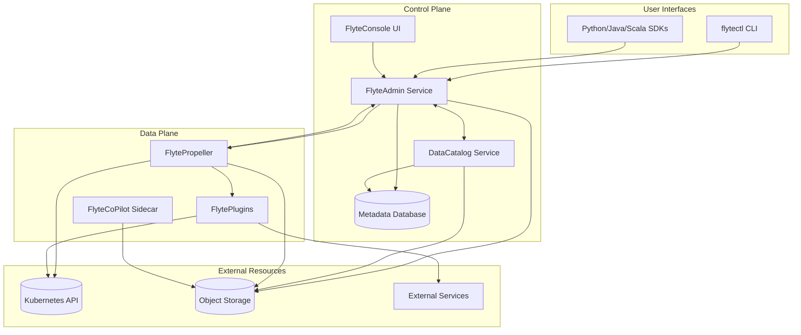
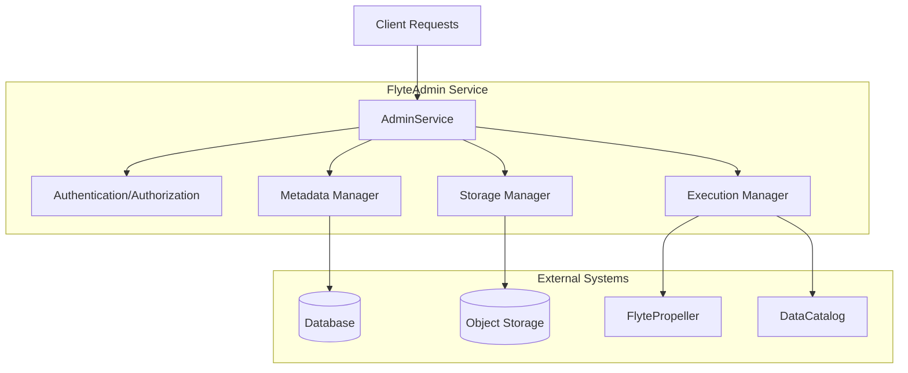
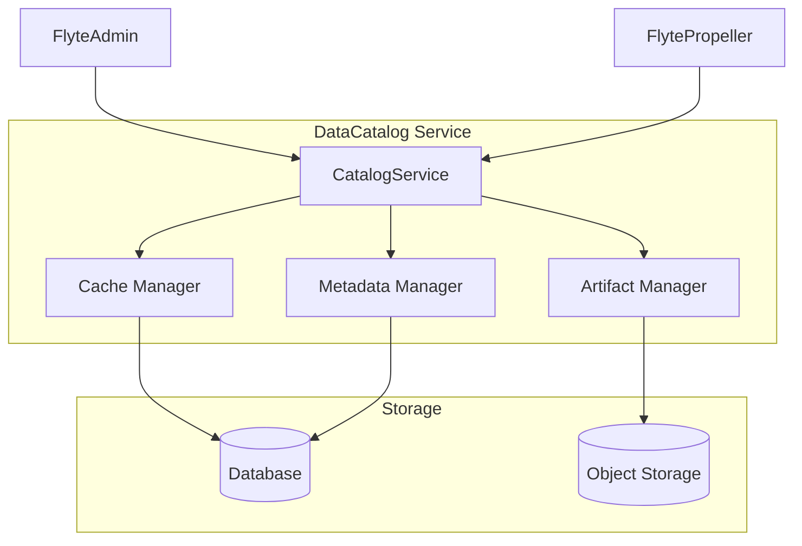
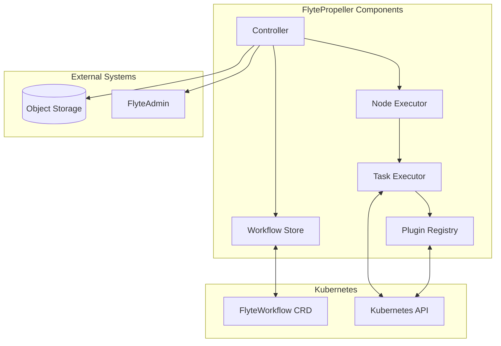
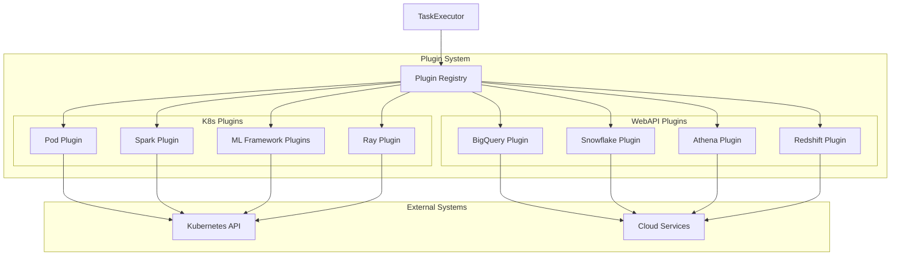
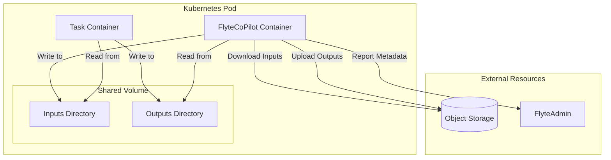
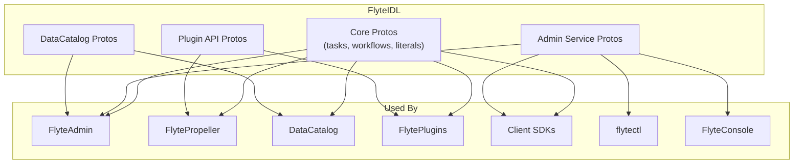
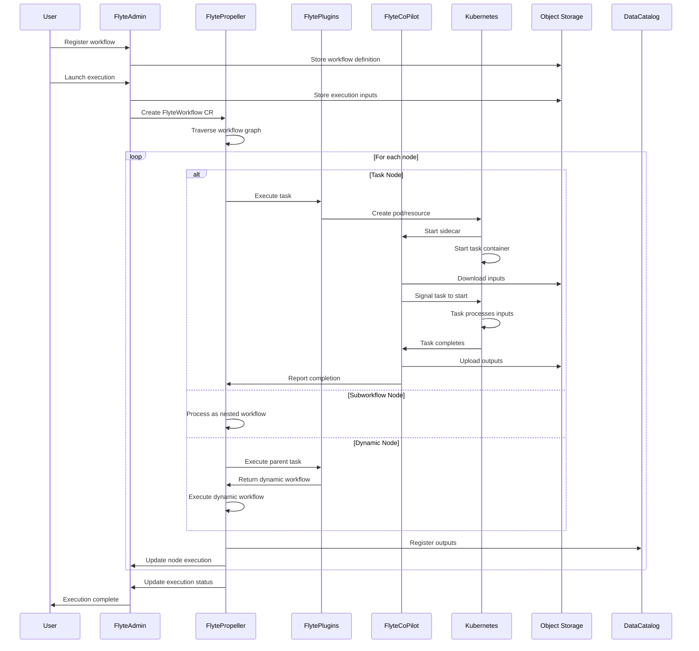

# Core Components

Relevant source files

The following files were used as context for generating this wiki page:

- [datacatalog/go.mod](datacatalog/go.mod)
- [datacatalog/go.sum](datacatalog/go.sum)
- [flyteadmin/go.mod](flyteadmin/go.mod)
- [flyteadmin/go.sum](flyteadmin/go.sum)
- [flytecopilot/go.mod](flytecopilot/go.mod)
- [flytecopilot/go.sum](flytecopilot/go.sum)
- [flyteidl/clients/go/assets/admin.swagger.json](flyteidl/clients/go/assets/admin.swagger.json)
- [flyteidl/gen/pb-es/flyteidl/core/workflow_pb.ts](flyteidl/gen/pb-es/flyteidl/core/workflow_pb.ts)
- [flyteidl/gen/pb-go/flyteidl/core/workflow.pb.go](flyteidl/gen/pb-go/flyteidl/core/workflow.pb.go)
- [flyteidl/gen/pb-go/flyteidl/service/admin.pb.go](flyteidl/gen/pb-go/flyteidl/service/admin.pb.go)
- [flyteidl/gen/pb-go/gateway/flyteidl/service/admin.swagger.json](flyteidl/gen/pb-go/gateway/flyteidl/service/admin.swagger.json)
- [flyteidl/gen/pb-go/gateway/flyteidl/service/agent.swagger.json](flyteidl/gen/pb-go/gateway/flyteidl/service/agent.swagger.json)
- [flyteidl/gen/pb-go/gateway/flyteidl/service/external_plugin_service.swagger.json](flyteidl/gen/pb-go/gateway/flyteidl/service/external_plugin_service.swagger.json)
- [flyteidl/gen/pb-js/flyteidl.d.ts](flyteidl/gen/pb-js/flyteidl.d.ts)
- [flyteidl/gen/pb-js/flyteidl.js](flyteidl/gen/pb-js/flyteidl.js)
- [flyteidl/gen/pb_python/flyteidl/core/workflow_pb2.py](flyteidl/gen/pb_python/flyteidl/core/workflow_pb2.py)
- [flyteidl/gen/pb_python/flyteidl/core/workflow_pb2.pyi](flyteidl/gen/pb_python/flyteidl/core/workflow_pb2.pyi)
- [flyteidl/gen/pb_python/flyteidl/service/admin_pb2.py](flyteidl/gen/pb_python/flyteidl/service/admin_pb2.py)
- [flyteidl/gen/pb_rust/flyteidl.core.rs](flyteidl/gen/pb_rust/flyteidl.core.rs)
- [flyteidl/go.mod](flyteidl/go.mod)
- [flyteidl/go.sum](flyteidl/go.sum)
- [flyteidl/protos/flyteidl/core/workflow.proto](flyteidl/protos/flyteidl/core/workflow.proto)
- [flyteidl/protos/flyteidl/service/admin.proto](flyteidl/protos/flyteidl/service/admin.proto)
- [flyteplugins/go.mod](flyteplugins/go.mod)
- [flyteplugins/go.sum](flyteplugins/go.sum)
- [flytepropeller/go.mod](flytepropeller/go.mod)
- [flytepropeller/go.sum](flytepropeller/go.sum)
- [go.mod](go.mod)
- [go.sum](go.sum)

This document provides a comprehensive overview of the core components that make up the Flyte platform. It explains the purpose and functionality of each key component, how they interact, and their role in the overall workflow execution lifecycle. For details on how these components are deployed, see [Deployment](#2).

## Overview of Flyte Architecture

Flyte's architecture is designed with separation of concerns and scalability in mind, divided into two main planes:

1. **Control Plane** - Manages workflow definitions, schedules, and metadata
2. **Data Plane** - Handles the actual execution of workflows and tasks

Sources:
- [flytepropeller/go.mod]()
- [flyteadmin/go.mod]()
- [go.mod]()

## Core Components in Detail

### FlyteAdmin

FlyteAdmin is the centralized control plane service that handles all user-facing API requests and maintains workflow state. It's responsible for:

1. Registering workflow entities (tasks, workflows, launch plans)
2. Managing executions (creating, monitoring, terminating)
3. Storing and retrieving workflow metadata
4. Handling authentication and authorization
5. Managing workflow schedules

FlyteAdmin exposes a gRPC service defined by the FlyteIDL and also provides a REST interface through the gRPC Gateway.

Sources:
- [flyteadmin/go.mod]()
- [flyteadmin/go.sum]()

### DataCatalog

DataCatalog is a service that manages metadata about datasets produced and consumed by Flyte workflows. Key features include:

1. Dataset versioning
2. Artifact tracking
3. Data lineage
4. Cached execution results

DataCatalog helps optimize workflow execution by enabling the reuse of previously computed results when inputs haven't changed.

Sources:
- [datacatalog/go.mod]()
- [datacatalog/go.sum]()

### FlytePropeller

FlytePropeller is the workflow execution engine that runs in the data plane. It is implemented as a Kubernetes operator that processes workflow custom resources. Key responsibilities include:

1. Executing workflows according to their specification
2. Traversing workflow DAGs and scheduling tasks
3. Handling retries and error conditions
4. Managing workflow state and task execution
5. Coordinating with plugins for task execution

FlytePropeller operates on a custom Kubernetes resource called `FlyteWorkflow` which represents the compiled form of a workflow.

Sources:
- [flytepropeller/go.mod]()
- [flytepropeller/go.sum]()

### FlytePlugins

FlytePlugins is an extensible system for executing different types of tasks. Plugins are categorized into:

1. **Kubernetes Plugins** - Execute tasks as Kubernetes resources
   - Pod Plugin (for container tasks)
   - Spark Plugin
   - PyTorch Plugin
   - TensorFlow Plugin
   - MPI Plugin
   - Ray Plugin

2. **WebAPI Plugins** - Interface with external services
   - BigQuery
   - Snowflake
   - Athena
   - Redshift
   - Other cloud services

Each plugin implements a specific interface to handle task execution for its supported task type.

Sources:
- [flyteplugins/go.mod]()
- [flyteplugins/go.sum]()

### FlyteCoPilot

FlyteCoPilot is a sidecar container that runs alongside task pods to facilitate input/output handling. It provides:

1. Download of input data from object storage
2. Upload of output data to object storage
3. Checkpointing support
4. Metadata collection

This sidecar helps abstract storage operations from the task containers themselves.

Sources:
- [flytecopilot/go.mod]()
- [flytecopilot/go.sum]()

### FlyteConsole

FlyteConsole is the web-based user interface for Flyte. It provides:

1. Workflow visualization and monitoring
2. Execution launching and management
3. Task logs and outputs inspection
4. Project and domain management

FlyteConsole communicates with FlyteAdmin via its REST API.

### flytectl (CLI)

flytectl is the command-line interface for interacting with Flyte. It enables:

1. Workflow registration
2. Execution creation and management
3. Configuration of projects, domains, and launch plans
4. System administration tasks

The CLI provides similar capabilities to the web UI but through a terminal interface.

### FlyteIDL

FlyteIDL (Interface Definition Language) defines the protocol buffers and gRPC service definitions for all Flyte services. It serves as the contract between different components and clients. Key elements include:

1. Core data types (tasks, workflows, literals)
2. Admin service definitions
3. DataCatalog service definitions
4. Plugin APIs

All inter-component communication in Flyte is defined through these interfaces.

Sources:
- [flyteidl/go.mod]()
- [flyteidl/go.sum]()
- [flyteidl/gen/pb-js/flyteidl.js]()
- [flyteidl/gen/pb-js/flyteidl.d.ts]()

## Workflow Execution Flow

To understand how these components work together, let's trace the flow of a workflow execution:

This diagram illustrates how a workflow moves through the system from registration to execution completion, showing the interaction between all core components.

Sources:
- [flytepropeller/go.mod]()
- [flyteadmin/go.mod]()
- [flyteplugins/go.mod]()
- [flyteidl/go.mod]()

## Summary

Flyte's architecture is composed of several key components that work together to provide a scalable, reliable workflow platform:

| Component | Role | Location |
|-----------|------|----------|
| FlyteAdmin | Control plane API service | Admin namespace |
| DataCatalog | Data artifact tracking service | Admin namespace |
| FlytePropeller | Workflow execution engine | Execution namespace |
| FlytePlugins | Task execution plugins | Used by FlytePropeller |
| FlyteCoPilot | Task I/O sidecar | Runs in task pods |
| FlyteConsole | Web UI | Admin namespace |
| flytectl | Command-line interface | User machine |
| FlyteIDL | Interface definitions | Used by all components |

These components are designed with clear separation of concerns, allowing for independent scaling and high reliability. The control plane components (FlyteAdmin, DataCatalog) manage metadata and coordination, while the data plane components (FlytePropeller, FlytePlugins, FlyteCoPilot) handle the actual execution of workflows.