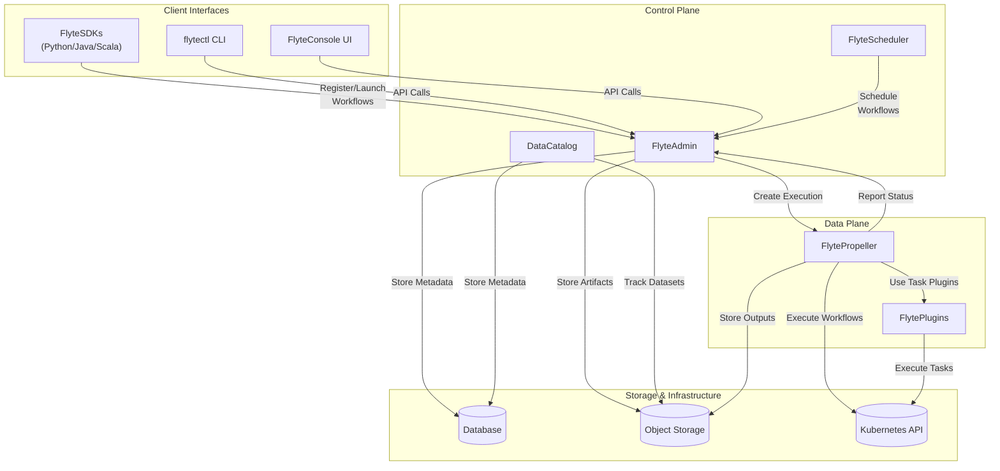
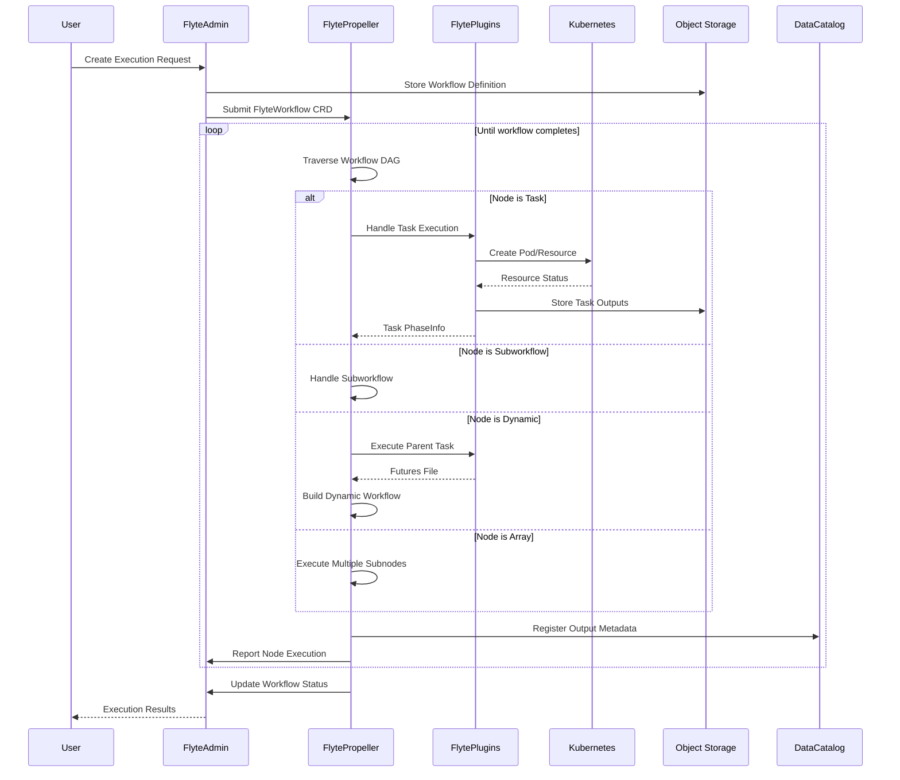
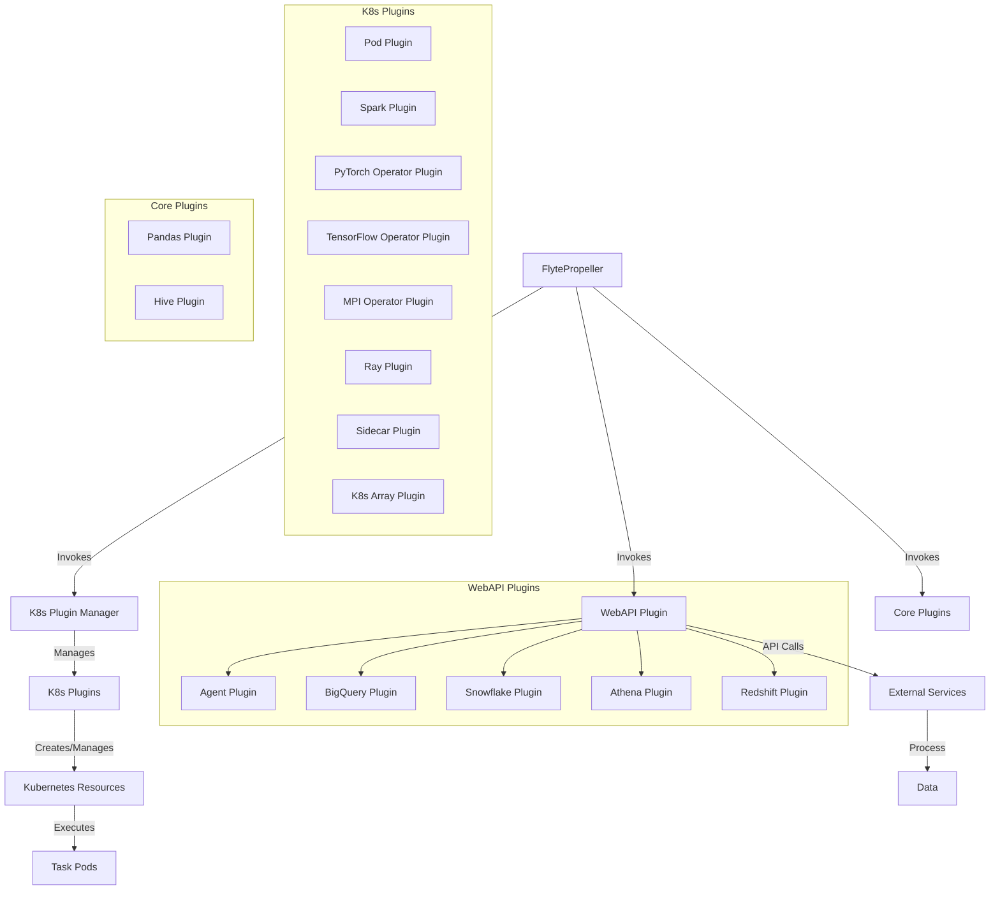
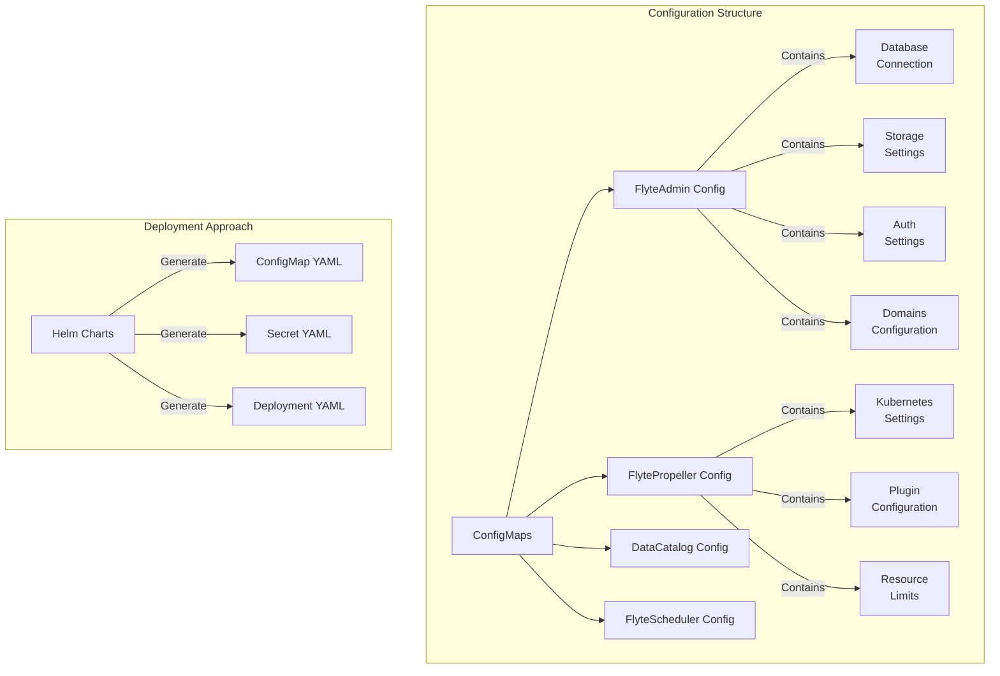
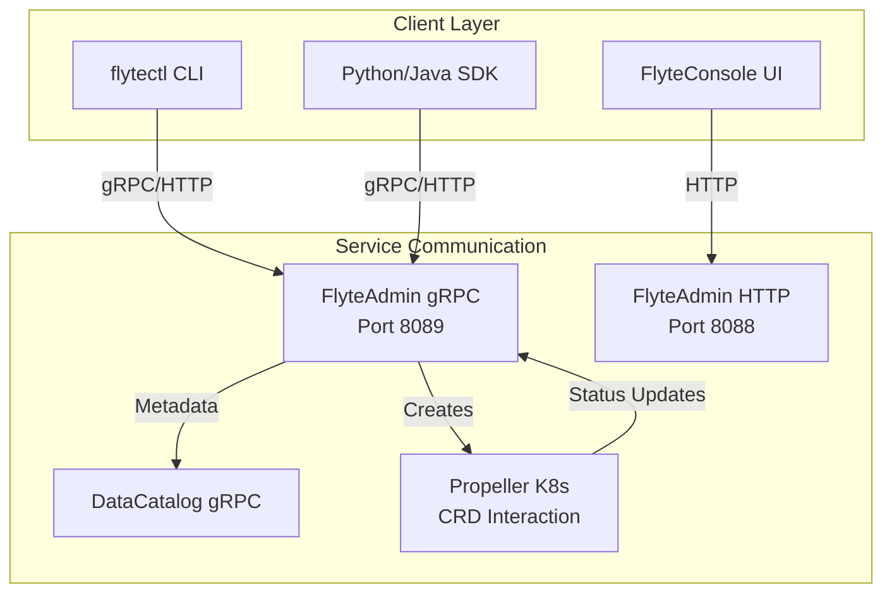
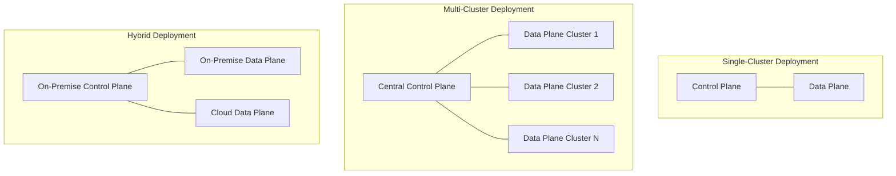
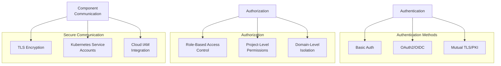

# System Architecture

Relevant source files

The following files were used as context for generating this wiki page:

- [README.md](README.md)
- [charts/flyte-core/README.md](charts/flyte-core/README.md)
- [charts/flyte-core/values.yaml](charts/flyte-core/values.yaml)
- [charts/flyte/README.md](charts/flyte/README.md)
- [charts/flyte/values.yaml](charts/flyte/values.yaml)
- [datacatalog/go.mod](datacatalog/go.mod)
- [datacatalog/go.sum](datacatalog/go.sum)
- [deployment/eks/flyte_aws_scheduler_helm_generated.yaml](deployment/eks/flyte_aws_scheduler_helm_generated.yaml)
- [deployment/eks/flyte_helm_controlplane_generated.yaml](deployment/eks/flyte_helm_controlplane_generated.yaml)
- [deployment/eks/flyte_helm_dataplane_generated.yaml](deployment/eks/flyte_helm_dataplane_generated.yaml)
- [deployment/eks/flyte_helm_generated.yaml](deployment/eks/flyte_helm_generated.yaml)
- [deployment/gcp/flyte_helm_controlplane_generated.yaml](deployment/gcp/flyte_helm_controlplane_generated.yaml)
- [deployment/gcp/flyte_helm_dataplane_generated.yaml](deployment/gcp/flyte_helm_dataplane_generated.yaml)
- [deployment/gcp/flyte_helm_generated.yaml](deployment/gcp/flyte_helm_generated.yaml)
- [deployment/sandbox/flyte_helm_generated.yaml](deployment/sandbox/flyte_helm_generated.yaml)
- [flyteadmin/go.mod](flyteadmin/go.mod)
- [flyteadmin/go.sum](flyteadmin/go.sum)
- [flytecopilot/go.mod](flytecopilot/go.mod)
- [flytecopilot/go.sum](flytecopilot/go.sum)
- [flyteidl/go.mod](flyteidl/go.mod)
- [flyteidl/go.sum](flyteidl/go.sum)
- [flyteplugins/go.mod](flyteplugins/go.mod)
- [flyteplugins/go.sum](flyteplugins/go.sum)
- [flytepropeller/go.mod](flytepropeller/go.mod)
- [flytepropeller/go.sum](flytepropeller/go.sum)
- [go.mod](go.mod)
- [go.sum](go.sum)

This page explains the overall architecture of the Flyte system, including its major components, their interactions, and the flow of data through the system. It covers the logical architecture, component responsibilities, and how these components work together during workflow execution. For deployment-specific details, see [Deployment](#2).

## Core System Architecture Overview

Flyte follows a microservices architecture separated into two primary planes: the **Control Plane** and the **Data Plane**. This separation allows for better scalability, fault isolation, and flexible deployment options.

Sources: 
- `README.md`
- `flytepropeller/go.mod`
- `flyteadmin/go.mod`
- `charts/flyte-core/values.yaml`

The Flyte architecture follows a separation of concerns with distinct components:

### Control Plane Components

1. **FlyteAdmin** - The central management component that handles:
   - API endpoints for creating and managing workflows
   - Workflow versioning and packaging
   - User authentication and authorization
   - Resource management
   - Event management
   - Execution tracking

2. **DataCatalog** - The metadata service responsible for:
   - Tracking datasets and their lineage
   - Storing and retrieving metadata about artifacts
   - Supporting data versioning

3. **FlyteScheduler** - The scheduling service that:
   - Manages recurring workflow executions
   - Handles time-based triggers for workflows

### Data Plane Components

1. **FlytePropeller** - The workflow execution engine that:
   - Runs as a Kubernetes controller
   - Processes workflow specifications
   - Manages the execution of workflow DAGs
   - Handles workflow state transitions
   - Coordinates with plugins for task execution

2. **FlytePlugins** - A collection of task execution plugins that:
   - Support various task types (Pod, Spark, PyTorch, etc.)
   - Connect to external services
   - Extend Flyte to support different execution environments

### Storage & Infrastructure

1. **Database** - Stores metadata about:
   - Workflow definitions
   - Execution records
   - Projects and domains
   - Task resources

2. **Object Storage** - Stores:
   - Workflow input/output data
   - Task input/output artifacts
   - Large binary objects

3. **Kubernetes API** - Used for:
   - Running containerized tasks
   - Managing compute resources
   - Scheduling workloads

Sources:
- `charts/flyte-core/values.yaml`
- `deployment/sandbox/flyte_helm_generated.yaml`
- `flyteadmin/go.mod`

## Workflow Execution Flow

The following diagram illustrates how Flyte components interact during workflow execution:

Sources:
- `flytepropeller/go.mod`
- `flyteadmin/go.mod`
- `datacatalog/go.mod`

The workflow execution process follows these steps:

1. A user creates an execution request through a client interface (SDK, CLI, or UI)
2. FlyteAdmin validates the request, stores the workflow definition in object storage, and creates a `FlyteWorkflow` custom resource in Kubernetes
3. FlytePropeller, running as a Kubernetes controller, detects the new custom resource and begins execution
4. FlytePropeller traverses the workflow DAG and executes nodes based on their type:
   - Task nodes: Executed through appropriate plugins
   - Subworkflow nodes: Handled recursively as sub-DAGs
   - Dynamic nodes: Generate and execute dynamic workflow structures at runtime
   - Array nodes: Execute tasks in parallel across multiple inputs
5. Execution outputs are stored in object storage
6. Metadata is registered in DataCatalog
7. Execution status is reported back to FlyteAdmin
8. Once complete, the final status is updated and results are available to the user

## Plugin Architecture

Flyte's plugin system allows for extensive customization and integration with various execution environments and external services:

Sources:
- `flyteplugins/go.mod`
- `flyteplugins/go.sum`

Flyte's plugin system consists of three main categories:

1. **Kubernetes Plugins**: These plugins create and manage Kubernetes resources for task execution:
   - Pod Plugin: Executes tasks in Kubernetes pods
   - Spark Plugin: Runs Apache Spark jobs
   - ML Operator Plugins: Integrate with Kubernetes operators for PyTorch, TensorFlow, MPI, and Ray
   - Array Plugin: Manages parallel execution across multiple inputs

2. **WebAPI Plugins**: These plugins integrate with external services through APIs:
   - Agent Plugin: Communicates with external agents
   - Data warehouse plugins: Connect to BigQuery, Snowflake, Athena, and Redshift

3. **Core Plugins**: These provide built-in functionality:
   - Pandas Plugin: Processes data using Pandas
   - Hive Plugin: Interacts with Hive data warehouses

The plugin architecture allows FlytePropeller to delegate task execution to specialized components, enabling support for a wide range of execution environments and integration points.

## Component Configuration

Flyte components are configured through YAML files, which specify connection details, resource limits, and operational parameters:

Sources:
- `charts/flyte-core/values.yaml`
- `deployment/sandbox/flyte_helm_generated.yaml`
- `deployment/eks/flyte_helm_generated.yaml`
- `deployment/gcp/flyte_helm_generated.yaml`

Each Flyte component has its own configuration files stored as ConfigMaps in Kubernetes:

1. **FlyteAdmin Configuration**:
   - Database connection settings
   - Storage configuration (S3, GCS, etc.)
   - Authentication settings
   - Domain configuration
   - Resource limits
   - Event handling

2. **FlytePropeller Configuration**:
   - Kubernetes settings
   - Workflow handling parameters
   - Plugin configuration
   - Resource limits
   - Node handling settings

3. **DataCatalog Configuration**:
   - Database connection settings
   - Storage configuration
   - Metadata processing settings

4. **FlyteScheduler Configuration**:
   - Schedule handling parameters
   - Connection to FlyteAdmin

Example configuration from deployment:

| Component | Configuration Path | Description |
|-----------|-------------------|-------------|
| FlyteAdmin | `/etc/flyte/config/*.yaml` | Admin server configuration files |
| FlytePropeller | `/etc/flyte/config/*.yaml` | Propeller configuration files |
| DataCatalog | `/etc/datacatalog/config/*.yaml` | DataCatalog configuration files |
| FlyteScheduler | `/etc/flyte/config/*.yaml` | Scheduler configuration files |

Flyte typically uses Helm charts for deployment, which generate the necessary Kubernetes resources including ConfigMaps, Secrets, and Deployments based on environment-specific values.

## Communication Between Components

Sources:
- `charts/flyte-core/values.yaml`
- `deployment/sandbox/flyte_helm_generated.yaml`

Flyte components communicate through a combination of gRPC, HTTP, and Kubernetes custom resources:

1. **Client-to-FlyteAdmin Communication**:
   - gRPC API (port 8089): Used by CLI and SDK clients
   - HTTP API (port 8088): Used by web console and for simple API access
   - Both support authentication via OAuth2, OpenID Connect, or API keys

2. **FlyteAdmin-to-FlytePropeller Communication**:
   - Kubernetes Custom Resource Definitions (CRDs)
   - FlyteAdmin creates `FlyteWorkflow` CRDs that FlytePropeller watches and processes

3. **FlyteAdmin-to-DataCatalog Communication**:
   - gRPC API for metadata storage and retrieval

4. **FlytePropeller-to-FlyteAdmin Communication**:
   - gRPC API for reporting execution status
   - Kubernetes events for critical updates

5. **FlytePropeller-to-Plugins Communication**:
   - Internal Go interfaces
   - Kubernetes resources for K8s plugins
   - HTTP/gRPC for WebAPI plugins

This communication model allows for loose coupling between components, making the system more resilient and easier to scale.

## Deployment Architectures

Flyte supports multiple deployment architectures to accommodate different use cases and organizational requirements:

Sources:
- `charts/flyte-core/values.yaml`
- `deployment/eks/flyte_helm_generated.yaml`
- `deployment/gcp/flyte_helm_generated.yaml`
- `deployment/sandbox/flyte_helm_generated.yaml`

Flyte supports three primary deployment architectures:

1. **Single-Cluster Deployment**:
   - All components (control plane and data plane) run in a single Kubernetes cluster
   - Simplest deployment model, suitable for sandbox environments and smaller teams
   - Example: Flyte Sandbox deployment

2. **Multi-Cluster Deployment**:
   - Control plane runs in a central management cluster
   - Multiple data planes run in separate clusters, potentially across different regions or cloud providers
   - Enables better resource isolation and scalability
   - Allows different teams to have dedicated execution environments

3. **Hybrid Deployment**:
   - Control plane can run in one environment (e.g., on-premise)
   - Data planes can run in multiple environments (e.g., different cloud providers)
   - Enables organizations to leverage cloud resources while maintaining control over metadata

The separation between control and data planes allows for flexible deployment models to meet different organizational requirements for security, compliance, and scale.

## System Security

Flyte's security architecture includes authentication, authorization, and secure communication between components:

Sources:
- `charts/flyte-core/values.yaml`
- `deployment/eks/flyte_helm_generated.yaml`
- `deployment/gcp/flyte_helm_generated.yaml`

Flyte implements a comprehensive security model:

1. **Authentication**:
   - Support for OAuth2/OpenID Connect providers
   - Basic authentication for testing environments
   - PKI/mTLS for service-to-service authentication

2. **Authorization**:
   - Role-Based Access Control (RBAC) for permission management
   - Project-level access control for workflow resources
   - Domain isolation for environment separation (development, staging, production)

3. **Secure Communication**:
   - TLS encryption for all service communication
   - Kubernetes service accounts for pod-to-service authentication
   - Integration with cloud IAM services (AWS IAM, GCP IAM)
   - Secret management for sensitive configuration

4. **Resource Isolation**:
   - Kubernetes namespace isolation
   - Resource quotas at project level
   - Network policies for traffic control

These security mechanisms can be configured to meet specific organizational requirements for authentication, authorization, and isolation.

## Scalability and Performance

Flyte is designed to scale to handle large workloads and ensure performance:

| Component | Scalability Approach | Performance Considerations |
|-----------|---------------------|---------------------------|
| FlyteAdmin | Horizontal pod scaling Database connection pooling | Read replicas for database Cache for frequently accessed data |
| FlytePropeller | Worker pool for node processing Sharded controller deployment | Resource throttling Worker count optimization |
| DataCatalog | Horizontal scaling Database partitioning | Caching layers Efficient metadata storage |
| Storage | Cloud-native object storage CDN integration | Data locality Compression strategies |
| Task Execution | Kubernetes autoscaling Spot/preemptible instances | Resource right-sizing Execution parallelism |

Sources:
- `charts/flyte-core/values.yaml`
- `deployment/eks/flyte_helm_generated.yaml`
- `flytepropeller/go.mod`

Each component in the Flyte architecture is designed to scale independently:

1. **Control Plane Scaling**:
   - FlyteAdmin and DataCatalog can be deployed with multiple replicas
   - Database can be scaled using read replicas and connection pooling
   - In-memory caching reduces database load for frequently accessed data

2. **Data Plane Scaling**:
   - FlytePropeller can be deployed in a sharded configuration to distribute workflow processing
   - Worker pools can be adjusted based on workflow volume
   - Plugins can dynamically scale resources based on task requirements

3. **Task Execution Scaling**:
   - Kubernetes cluster autoscaling for dynamic resource allocation
   - Support for spot/preemptible instances to reduce costs
   - Array tasks for efficient parallel processing

4. **Storage Scaling**:
   - Cloud-native object storage with virtually unlimited capacity
   - Caching strategies for frequently accessed data
   - Data locality optimizations for performance

These scalability features allow Flyte to handle workflows ranging from simple data processing to complex machine learning pipelines with thousands of tasks.

## Conclusion

Flyte's architecture is designed with scalability, extensibility, and reliability in mind. The separation between control and data planes, the plugin-based execution model, and the use of Kubernetes as the underlying platform enable Flyte to support a wide range of workflow requirements.

Key architectural strengths include:

1. **Separation of Concerns**: Clear boundaries between workflow definition, management, and execution
2. **Extensibility**: Plugin system for integration with various execution environments and external services
3. **Scalability**: Each component can scale independently based on workload requirements
4. **Flexibility**: Multiple deployment options to accommodate different organizational needs
5. **Type Safety**: Strong typing across the workflow definition and execution pipeline

Understanding this architecture is essential for effectively deploying, operating, and extending Flyte to meet your workflow automation needs.

Sources:
- `README.md`
- `charts/flyte-core/values.yaml`
- `deployment/sandbox/flyte_helm_generated.yaml`
- `flytepropeller/go.mod`
- `flyteadmin/go.mod`