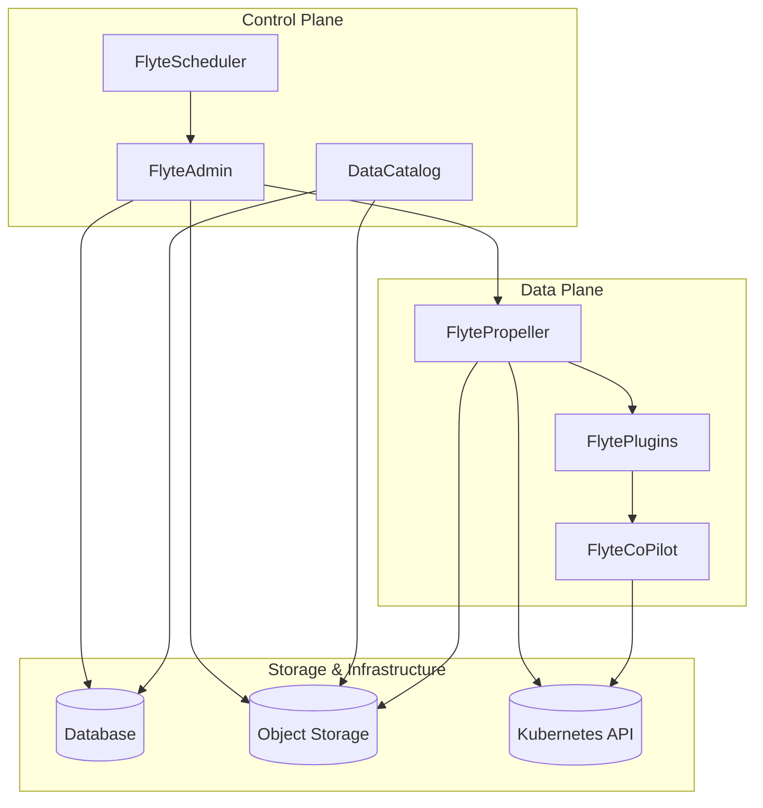
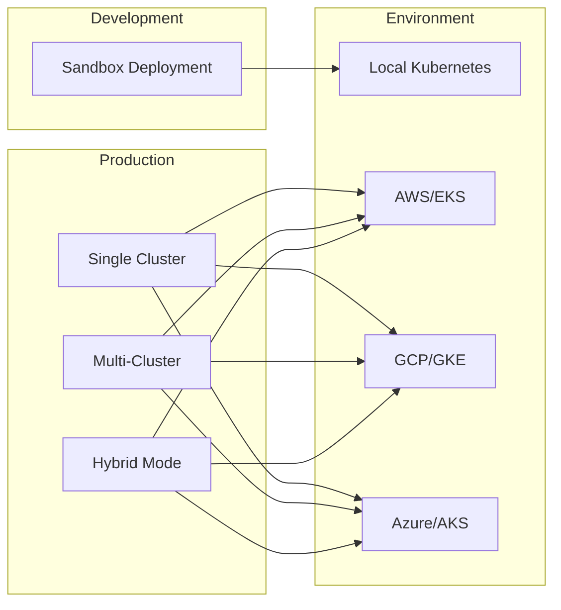
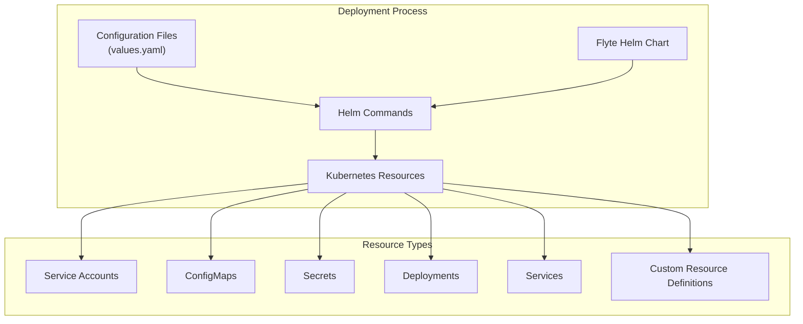
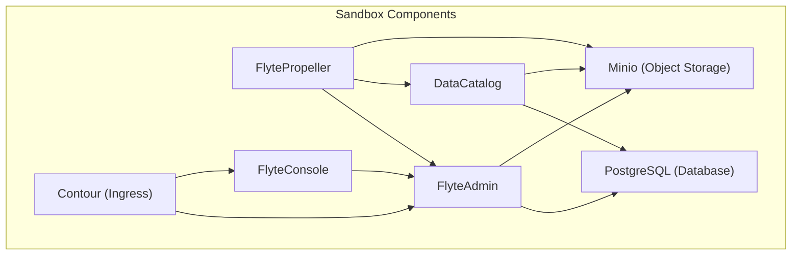
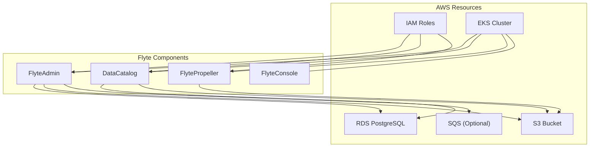
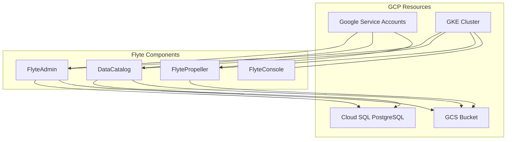
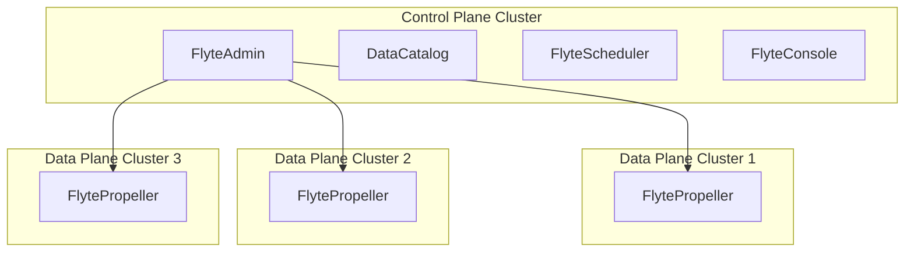

# Deployment

<details>
<summary>Relevant source files</summary>

The following files were used as context for generating this wiki page:

- [charts/flyte-core/README.md](charts/flyte-core/README.md)
- [charts/flyte-core/values.yaml](charts/flyte-core/values.yaml)
- [charts/flyte/README.md](charts/flyte/README.md)
- [charts/flyte/values.yaml](charts/flyte/values.yaml)
- [deployment/eks/flyte_aws_scheduler_helm_generated.yaml](deployment/eks/flyte_aws_scheduler_helm_generated.yaml)
- [deployment/eks/flyte_helm_controlplane_generated.yaml](deployment/eks/flyte_helm_controlplane_generated.yaml)
- [deployment/eks/flyte_helm_dataplane_generated.yaml](deployment/eks/flyte_helm_dataplane_generated.yaml)
- [deployment/eks/flyte_helm_generated.yaml](deployment/eks/flyte_helm_generated.yaml)
- [deployment/gcp/flyte_helm_controlplane_generated.yaml](deployment/gcp/flyte_helm_controlplane_generated.yaml)
- [deployment/gcp/flyte_helm_dataplane_generated.yaml](deployment/gcp/flyte_helm_dataplane_generated.yaml)
- [deployment/gcp/flyte_helm_generated.yaml](deployment/gcp/flyte_helm_generated.yaml)
- [deployment/sandbox/flyte_helm_generated.yaml](deployment/sandbox/flyte_helm_generated.yaml)
- [deployment/test/flyte_generated.yaml](deployment/test/flyte_generated.yaml)

</details>


This page provides a comprehensive guide to deploying Flyte in various environments. It covers deployment architecture, available deployment options, and configuration methods. For information about specific components of Flyte, see [Core Components](#1.1). For system architecture overview, see [System Architecture](#1.2).

## Deployment Architecture

Flyte's deployment architecture consists of two main parts: the control plane and the data plane. This architecture allows Flyte to be deployed in various configurations, including single-cluster, multi-cluster, and hybrid models.



Sources: 
- [charts/flyte-core/values.yaml:1-467]()
- [deployment/gcp/flyte_helm_generated.yaml:1-586]()
- [deployment/eks/flyte_helm_generated.yaml:1-566]()

### Component Overview

| Component | Description | Deployment Consideration |
|-----------|-------------|--------------------------|
| **FlyteAdmin** | Manages workflow metadata, handles API requests | Required in all deployments |
| **DataCatalog** | Manages data artifacts and metadata | Required in all deployments |
| **FlyteScheduler** | Schedules workflow executions | Optional, can be replaced with cloud schedulers |
| **FlytePropeller** | Executes workflows, manages task execution | Required in data plane |
| **FlyteCoPilot** | Sidecar for task containers | Required for certain task types |
| **FlyteConsole** | Web UI for Flyte | Optional, but recommended |

Sources:
- [charts/flyte-core/README.md:1-53]()
- [charts/flyte-core/values.yaml:11-213]()

## Deployment Options

Flyte offers several deployment options to accommodate different use cases and environments.



Sources:
- [charts/flyte/README.md:1-27]()
- [charts/flyte-core/README.md:1-53]()

### Deployment Models

1. **Sandbox Deployment**
   - Single-cluster setup for development and testing
   - All components in one Kubernetes cluster
   - Simplified configuration with minimal requirements
   - Not recommended for production workloads

2. **Single Cluster Production Deployment**
   - All components in one Kubernetes cluster
   - Both control plane and data plane in the same cluster
   - Suitable for small to medium-sized deployments

3. **Multi-Cluster Deployment**
   - Control plane in a central cluster
   - Multiple data plane clusters
   - Better isolation and resource management
   - Suitable for larger deployments

4. **Hybrid Mode**
   - Control plane in Kubernetes
   - Data plane can include non-Kubernetes environments
   - Suitable for specialized compute needs

Sources:
- [charts/flyte-core/README.md:13-51]()
- [deployment/sandbox/flyte_helm_generated.yaml:1-100]()
- [deployment/eks/flyte_helm_generated.yaml:1-100]()
- [deployment/gcp/flyte_helm_generated.yaml:1-100]()

## Helm-based Deployment

The recommended way to deploy Flyte is using Helm charts. Flyte provides helm charts for different deployment scenarios.



### Helm Chart Structure

The Flyte Helm chart is organized into several components:

| Chart | Purpose |
|-------|---------|
| **flyte-core** | Core Flyte components (Admin, Propeller, etc.) |
| **flyte** | Complete deployment including dependencies |
| **flyteagent** | Optional agent for external services |

Sources:
- [charts/flyte-core/README.md:1-53]()
- [charts/flyte/README.md:1-27]()

### Deployment Steps

1. **Prerequisites**
   - Kubernetes cluster
   - Helm 3 installed
   - Storage configured (object store and database)

2. **Install using Helm**
   ```bash
   helm repo add flyte https://flyteorg.github.io/flyte
   helm install -n flyte -f values-custom.yaml --create-namespace flyte flyte/flyte-core
   ```

3. **Configure Ingress**
   ```bash
   helm repo add bitnami https://charts.bitnami.com/bitnami
   helm install gateway bitnami/contour -n flyte
   ```

Sources:
- [charts/flyte-core/README.md:13-40]()
- [charts/flyte/README.md:19-39]()

## Environment-specific Configurations

Flyte's deployment configuration varies depending on the target environment.

### Sandbox/Local Deployment

Sandbox deployment is intended for development and testing, with minimal external dependencies.



Key features:
- Embedded Postgres database
- Minio for object storage
- Single-node deployment
- All components in the same namespace

Sources:
- [deployment/sandbox/flyte_helm_generated.yaml:1-500]()
- [charts/flyte/values.yaml:1-250]()

### AWS/EKS Deployment

AWS deployment leverages AWS-specific services and IAM for authentication.



Key configurations:
- IAM roles for service accounts
- S3 for object storage
- RDS for database
- Optional AWS SQS for scheduling

Sources:
- [deployment/eks/flyte_helm_generated.yaml:1-566]()
- [deployment/eks/flyte_helm_controlplane_generated.yaml:1-260]()
- [deployment/eks/flyte_aws_scheduler_helm_generated.yaml:1-240]()

### GCP/GKE Deployment

GCP deployment uses GCP-specific services and Workload Identity for authentication.



Key configurations:
- Workload Identity for service accounts
- GCS for object storage
- Cloud SQL for database

Sources:
- [deployment/gcp/flyte_helm_generated.yaml:1-586]()
- [deployment/gcp/flyte_helm_controlplane_generated.yaml:1-260]()
- [deployment/gcp/flyte_helm_dataplane_generated.yaml:1-198]()

## Configuration Options

Flyte offers extensive configuration options through Helm values files.

### Core Configuration Parameters

| Parameter | Description | Default |
|-----------|-------------|---------|
| `storage.type` | Storage type (s3, gcs, etc.) | `sandbox` |
| `storage.bucketName` | Storage bucket name | `my-s3-bucket` |
| `db.admin.database` | Admin database configuration | |
| `db.datacatalog.database` | DataCatalog database configuration | |
| `common.ingress` | Ingress configuration | |
| `configmap.adminServer` | FlyteAdmin server configuration | |
| `cluster_resource_manager` | Cluster resource management configuration | |

Sources:
- [charts/flyte-core/values.yaml:563-636]()
- [charts/flyte-core/README.md:54-135]()

### Component-specific Configuration

Each Flyte component has its own set of configuration parameters:

| Component | Configuration Path | Key Parameters |
|-----------|-------------------|---------------|
| FlyteAdmin | `flyteadmin` | `image`, `resources`, `service` |
| DataCatalog | `datacatalog` | `image`, `resources`, `service` |
| FlytePropeller | `flytepropeller` | `image`, `resources`, `createCRDs` |
| FlyteConsole | `flyteconsole` | `image`, `resources`, `service` |
| FlyteScheduler | `flytescheduler` | `image`, `resources` |

Sources:
- [charts/flyte-core/values.yaml:11-467]()
- [charts/flyte-core/README.md:54-240]()

## Security Configurations

Flyte's deployment can be secured with various options.

### Authentication and Authorization

Flyte supports multiple authentication methods:
- OpenID Connect
- OAuth2
- No authentication (for development)

Configuration example:
```yaml
configmap:
  adminServer:
    auth:
      appAuth:
        thirdPartyConfig:
          flyteClient:
            clientId: flytectl
            redirectUri: http://localhost:53593/callback
            scopes: ["offline", "all"]
      userAuth:
        openId:
          baseUrl: https://accounts.google.com
          clientId: <client-id>
          scopes: ["profile", "openid"]
```

Sources:
- [charts/flyte-core/values.yaml:702-770]()
- [charts/flyte-core/README.md:106-110]()

### Service Account Management

Flyte components require appropriate service accounts with necessary permissions. The configuration varies by platform:

- AWS: IAM roles for service accounts
- GCP: Workload Identity for service accounts
- Generic: Kubernetes RBAC

Sources:
- [deployment/eks/flyte_helm_generated.yaml:1-70]()
- [deployment/gcp/flyte_helm_generated.yaml:1-70]()

## Monitoring and Observability

Flyte deployment can be configured with monitoring and observability tools.

### Prometheus Metrics

Flyte components expose Prometheus metrics. ServiceMonitor resources can be configured to scrape these metrics:

```yaml
flyteadmin:
  serviceMonitor:
    enabled: true
    interval: 60s
    scrapeTimeout: 30s
    labels: {}
```

Sources:
- [charts/flyte-core/values.yaml:128-139]()
- [charts/flyte-core/README.md:207-212]()

### Logging

Task logs can be configured to integrate with various logging backends:

```yaml
configmap:
  task_logs:
    plugins:
      logs:
        kubernetes-enabled: true
        cloudwatch-enabled: false
        stackdriver-enabled: false
```

Sources:
- [charts/flyte-core/values.yaml:920-923]()
- [charts/flyte-core/README.md:132-134]()

## Troubleshooting Deployment Issues

Common deployment issues and their solutions:

| Issue | Potential Cause | Solution |
|-------|-----------------|----------|
| Database connection failures | Incorrect credentials or networking | Check database credentials and network policies |
| Storage access issues | Incorrect bucket configuration or permissions | Verify bucket name and IAM/service account permissions |
| Service discovery problems | Incorrect service names or namespace | Check service names and namespace configurations |
| Resource constraints | Insufficient cluster resources | Increase cluster capacity or adjust resource requests |

Sources:
- Various deployment files and charts

## Advanced Deployment Scenarios

### Multi-cluster Deployment

For large-scale deployments, a multi-cluster setup is recommended:
- Control plane in a central cluster
- Multiple data plane clusters
- Cross-cluster communication via Admin APIs



Sources:
- [charts/flyte-core/values.yaml:658-669]()
- [charts/flyte-core/README.md:78-90]()

### External Dependencies Configuration

Flyte depends on external services that need proper configuration:

1. **Database**
   - PostgreSQL is recommended
   - RDS on AWS
   - Cloud SQL on GCP

2. **Object Storage**
   - S3 on AWS
   - GCS on GCP
   - Minio for development

3. **Authentication Provider**
   - OpenID Connect providers
   - OAuth2 servers

Sources:
- [charts/flyte-core/values.yaml:600-636]()
- [charts/flyte-core/README.md:58-77]()

## Conclusion

Flyte deployment can be tailored to specific environments and use cases. The recommended approach is using Helm charts with environment-specific configuration values. For more details on individual components, refer to their respective documentation pages.