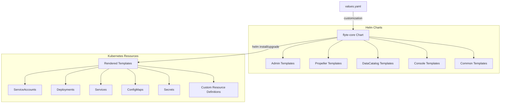
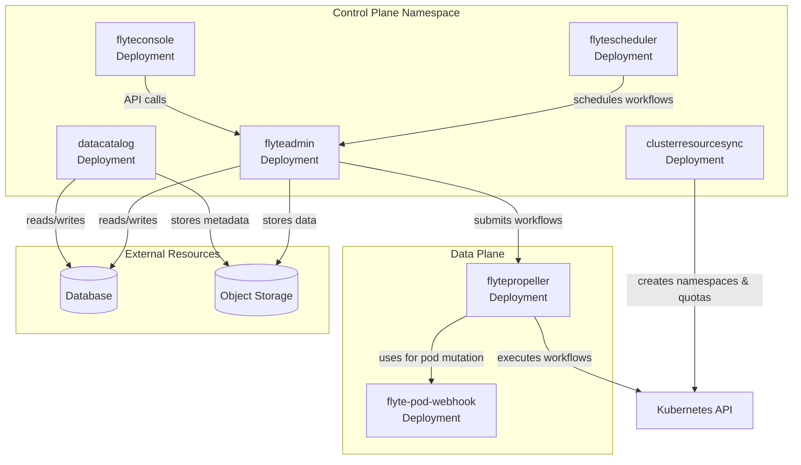

# Kubernetes Deployment with Helm

<details>
<summary>Relevant source files</summary>

The following files were used as context for generating this wiki page:

- [charts/flyte-core/README.md](charts/flyte-core/README.md)
- [charts/flyte-core/values.yaml](charts/flyte-core/values.yaml)
- [charts/flyte/README.md](charts/flyte/README.md)
- [charts/flyte/values.yaml](charts/flyte/values.yaml)
- [deployment/eks/flyte_aws_scheduler_helm_generated.yaml](deployment/eks/flyte_aws_scheduler_helm_generated.yaml)
- [deployment/eks/flyte_helm_controlplane_generated.yaml](deployment/eks/flyte_helm_controlplane_generated.yaml)
- [deployment/eks/flyte_helm_dataplane_generated.yaml](deployment/eks/flyte_helm_dataplane_generated.yaml)
- [deployment/eks/flyte_helm_generated.yaml](deployment/eks/flyte_helm_generated.yaml)
- [deployment/gcp/flyte_helm_controlplane_generated.yaml](deployment/gcp/flyte_helm_controlplane_generated.yaml)
- [deployment/gcp/flyte_helm_dataplane_generated.yaml](deployment/gcp/flyte_helm_dataplane_generated.yaml)
- [deployment/gcp/flyte_helm_generated.yaml](deployment/gcp/flyte_helm_generated.yaml)
- [deployment/sandbox/flyte_helm_generated.yaml](deployment/sandbox/flyte_helm_generated.yaml)
- [deployment/test/flyte_generated.yaml](deployment/test/flyte_generated.yaml)

</details>


This page details how to deploy Flyte to a Kubernetes cluster using Helm charts. It covers the installation process, configuration options, and deployment strategies for different environments. For sandbox deployment for local development and testing, see [Sandbox Environment](#2.2).

## Overview

Flyte can be deployed to Kubernetes clusters using Helm, which provides a templating mechanism for creating Kubernetes manifests. The Flyte Helm charts define the necessary Kubernetes resources for running Flyte, including deployments, services, config maps, and secrets.

### Deployment Architecture



Sources: 
- [charts/flyte-core/README.md](https://github.com/flyteorg/flyte/blob/master/charts/flyte-core/README.md)
- [charts/flyte-core/values.yaml](https://github.com/flyteorg/flyte/blob/master/charts/flyte-core/values.yaml)

### Flyte Components in Kubernetes



Sources:
- [deployment/sandbox/flyte_helm_generated.yaml:30-77](https://github.com/flyteorg/flyte/blob/master/deployment/sandbox/flyte_helm_generated.yaml)
- [deployment/eks/flyte_helm_generated.yaml:2-63](https://github.com/flyteorg/flyte/blob/master/deployment/eks/flyte_helm_generated.yaml)
- [deployment/gcp/flyte_helm_generated.yaml:2-55](https://github.com/flyteorg/flyte/blob/master/deployment/gcp/flyte_helm_generated.yaml)

## Prerequisites

Before deploying Flyte using Helm, ensure you have the following:

1. Kubernetes cluster (version 1.19+)
2. Helm 3 installed
3. `kubectl` configured to communicate with your cluster
4. Storage backend (S3, GCS, or MinIO for sandbox deployments)
5. Database (PostgreSQL for production deployments)

Sources:
- [charts/flyte-core/README.md:13-16](https://github.com/flyteorg/flyte/blob/master/charts/flyte-core/README.md)

## Installation

### Basic Installation

1. Add the Flyte Helm repository:

```bash
helm repo add flyte https://flyteorg.github.io/flyte
```

2. Install Flyte in its own namespace:

```bash
helm install -n flyte -f values-custom.yaml --create-namespace flyte flyte/flyte-core
```

Sources:
- [charts/flyte-core/README.md:16-21](https://github.com/flyteorg/flyte/blob/master/charts/flyte-core/README.md)

### Updating Existing Installation

To update an existing Flyte installation:

```bash
helm upgrade -f values-custom.yaml flyte flyte/flyte-core
```

You can use the helm diff plugin to review changes before applying them:

```bash
helm plugin install https://github.com/databus23/helm-diff
helm diff upgrade -f values-custom.yaml flyte flyte/flyte-core
```

Sources:
- [charts/flyte-core/README.md:23-34](https://github.com/flyteorg/flyte/blob/master/charts/flyte-core/README.md)

## Configuration

The Flyte Helm chart offers extensive configuration options through its `values.yaml` file. Here are the key configuration areas:

### Configuration Structure

```mermaid
flowchart TB
    ValuesYaml["values.yaml"] --> CoreComponents
    ValuesYaml --> CommonSettings
    ValuesYaml --> StorageSettings
    ValuesYaml --> DBSettings
    ValuesYaml --> ConfigMaps
    
    CoreComponents --> FlyteAdmin["flyteadmin
    settings"]
    CoreComponents --> FlyteScheduler["flytescheduler
    settings"]
    CoreComponents --> DataCatalog["datacatalog
    settings"]
    CoreComponents --> FlytePropeller["flytepropeller
    settings"]
    CoreComponents --> FlyteConsole["flyteconsole
    settings"]
    
    CommonSettings --> Ingress["ingress
    configuration"]
    CommonSettings --> Auth["authentication
    settings"]
    
    StorageSettings --> Type["storage.type
    (s3/gcs/sandbox)"]
    StorageSettings --> Bucket["storage.bucketName"]
    StorageSettings --> Conn["storage connection
    details"]
    
    DBSettings --> AdminDB["db.admin
    settings"]
    DBSettings --> CatalogDB["db.datacatalog
    settings"]
    
    ConfigMaps --> Admin["adminServer
    config"]
    ConfigMaps --> TaskDefaults["task_resource_defaults"]
    ConfigMaps --> Plugins["enabled_plugins"]
    ConfigMaps --> Domains["domain
    settings"]
```



Sources:
- [charts/flyte-core/values.yaml:1-207](https://github.com/flyteorg/flyte/blob/master/charts/flyte-core/values.yaml)
- [charts/flyte-core/README.md:54-147](https://github.com/flyteorg/flyte/blob/master/charts/flyte-core/README.md)

### Core Component Configuration

Each core Flyte component can be configured individually:

| Component | Key Configuration Options |
|-----------|---------------------------|
| `flyteadmin` | `replicaCount`, `image`, `resources`, `env`, `serviceAccount` |
| `flytepropeller` | `replicaCount`, `image`, `resources`, `createCRDs` |
| `datacatalog` | `replicaCount`, `image`, `resources` |
| `flyteconsole` | `replicaCount`, `image`, `resources` |
| `flytescheduler` | `image`, `resources` |

Example configuration for `flyteadmin`:

```yaml
flyteadmin:
  replicaCount: 1
  image:
    repository: cr.flyte.org/flyteorg/flyteadmin
    tag: 1.15.1
    pullPolicy: IfNotPresent
  resources:
    limits:
      cpu: 250m
      memory: 500Mi
    requests:
      cpu: 10m
      memory: 50Mi
```

Sources:
- [charts/flyte-core/values.yaml:12-76](https://github.com/flyteorg/flyte/blob/master/charts/flyte-core/values.yaml)
- [charts/flyte-core/values.yaml:304-378](https://github.com/flyteorg/flyte/blob/master/charts/flyte-core/values.yaml)

### Storage Configuration

Flyte supports multiple storage backends:

```yaml
storage:
  # Options: sandbox, s3, gcs, custom
  type: sandbox
  # S3 bucket where Flyte will store files
  bucketName: my-s3-bucket
  # S3-specific settings
  s3:
    endpoint: ""
    region: us-east-1
    # Options: iam, accesskey
    authType: iam
    accessKey: ""
    secretKey: ""
  # GCS-specific settings
  gcs:
    projectId: your-gcp-project
```

Sources:
- [charts/flyte-core/values.yaml:604-635](https://github.com/flyteorg/flyte/blob/master/charts/flyte-core/values.yaml)

### Database Configuration

Configure database settings for FlyteAdmin and DataCatalog:

```yaml
db:
  admin:
    database:
      dbname: flyteadmin
      host: postgres
      port: 5432
      username: postgres
  datacatalog:
    database:
      dbname: datacatalog
      host: postgres
      port: 5432
      username: postgres
```

For production deployments, you should set up a proper database password using secrets:

```yaml
common:
  databaseSecret:
    name: flyte-db-pass
    secretManifest:
      stringData:
        pass.txt: yourDBPassword
```

Sources:
- [charts/flyte-core/values.yaml:637-649](https://github.com/flyteorg/flyte/blob/master/charts/flyte-core/values.yaml)
- [charts/flyte-core/values.yaml:563-568](https://github.com/flyteorg/flyte/blob/master/charts/flyte-core/values.yaml)

### Task Resource Configuration

Configure default task resources:

```yaml
configmap:
  task_resource_defaults:
    task_resources:
      defaults:
        cpu: 100m
        memory: 500Mi
      limits:
        cpu: 2
        memory: 1Gi
        gpu: 1
```

Sources:
- [charts/flyte-core/values.yaml:786-797](https://github.com/flyteorg/flyte/blob/master/charts/flyte-core/values.yaml)

### Ingress Configuration

Configure ingress for external access:

```yaml
common:
  ingress:
    enabled: true
    ingressClassName: nginx
    annotations:
      nginx.ingress.kubernetes.io/app-root: /console
    separateGrpcIngress: false
    tls:
      enabled: false
```

Sources:
- [charts/flyte-core/values.yaml:570-593](https://github.com/flyteorg/flyte/blob/master/charts/flyte-core/values.yaml)

## Environment-Specific Deployments

### Sandbox Deployment

For sandbox deployments, the default values are optimized for local development with MinIO for storage:

```yaml
storage:
  type: sandbox
  bucketName: my-s3-bucket
```

Sources:
- [deployment/sandbox/flyte_helm_generated.yaml:317-347](https://github.com/flyteorg/flyte/blob/master/deployment/sandbox/flyte_helm_generated.yaml)

### AWS/EKS Deployment

For AWS/EKS deployments, configure IAM roles and S3 storage:

```yaml
flyteadmin:
  serviceAccount:
    annotations:
      eks.amazonaws.com/role-arn: arn:aws:iam::<ACCOUNT_NUMBER>:role/iam-role-flyte

storage:
  type: s3
  bucketName: <BUCKET_NAME>
  s3:
    region: <AWS_REGION>
    authType: iam
```

Sources:
- [deployment/eks/flyte_helm_generated.yaml:2-54](https://github.com/flyteorg/flyte/blob/master/deployment/eks/flyte_helm_generated.yaml)
- [deployment/eks/flyte_helm_generated.yaml:184-208](https://github.com/flyteorg/flyte/blob/master/deployment/eks/flyte_helm_generated.yaml)

### GCP Deployment

For GCP deployments, configure Workload Identity and GCS storage:

```yaml
flyteadmin:
  serviceAccount:
    annotations:
      iam.gke.io/gcp-service-account: gsa-flyteadmin@<PROJECT-ID>.iam.gserviceaccount.com

storage:
  type: stow
  container: <BUCKET_NAME>
  stow:
    kind: google
    config:
      project_id: <PROJECT-ID>
      scopes: https://www.googleapis.com/auth/cloud-platform
```

Sources:
- [deployment/gcp/flyte_helm_generated.yaml:2-28](https://github.com/flyteorg/flyte/blob/master/deployment/gcp/flyte_helm_generated.yaml)
- [deployment/gcp/flyte_helm_generated.yaml:165-180](https://github.com/flyteorg/flyte/blob/master/deployment/gcp/flyte_helm_generated.yaml)

## ClusterResource Management

Flyte can manage Kubernetes resources for projects and domains:

```yaml
cluster_resource_manager:
  enabled: true
  config:
    cluster_resources:
      refreshInterval: 5m
      templatePath: /etc/flyte/clusterresource/templates
      customData:
        - production:
          - projectQuotaCpu:
              value: "5"
          - projectQuotaMemory:
              value: "4000Mi"
        - staging:
          - projectQuotaCpu:
              value: "2"
          - projectQuotaMemory:
              value: "3000Mi"
  templates:
    - key: aa_namespace
      value: |
        apiVersion: v1
        kind: Namespace
        metadata:
          name: {{ namespace }}
        spec:
          finalizers:
          - kubernetes
    - key: ab_project_resource_quota
      value: |
        apiVersion: v1
        kind: ResourceQuota
        metadata:
          name: project-quota
          namespace: {{ namespace }}
        spec:
          hard:
            limits.cpu: {{ projectQuotaCpu }}
            limits.memory: {{ projectQuotaMemory }}
```

This defines how Flyte creates and manages namespaces with resource quotas for each project-domain combination.

Sources:
- [charts/flyte-core/values.yaml:78-92](https://github.com/flyteorg/flyte/blob/master/charts/flyte-core/values.yaml)
- [deployment/sandbox/flyte_helm_generated.yaml:218-369](https://github.com/flyteorg/flyte/blob/master/deployment/sandbox/flyte_helm_generated.yaml)

## Post-Installation Steps

### Verify the Installation

After installation, verify that all Flyte pods are running:

```bash
kubectl get pods -n flyte
```

Expected output:
```
NAME                                 READY   STATUS    RESTARTS   AGE
datacatalog-5d59f68c88-j7h8v         1/1     Running   0          2m
flyteconsole-f5999d6c8-s7lhz         1/1     Running   0          2m
flytepropeller-7bfbd8f9f5-t2cvz      1/1     Running   0          2m
flyteadmin-7f98d9c5fd-c8xnz          1/1     Running   0          2m
flytescheduler-59f5f74d47-cqld9      1/1     Running   0          2m
```

### Access the Flyte Console

If you've configured an ingress, you can access the Flyte Console through your ingress URL. For sandbox deployments with NodePort services, you can use:

```bash
kubectl -n flyte port-forward svc/envoy 8080:80
```

Then access the Flyte console at http://localhost:8080/console

## Troubleshooting

### Common Issues

1. **Pods failing to start**: Check pod logs for detailed errors
   ```bash
   kubectl logs -n flyte <pod-name>
   ```

2. **Database connection issues**: Verify database credentials and connectivity
   ```bash
   kubectl describe secret -n flyte flyte-db-pass
   ```

3. **Storage access issues**: Verify IAM roles and bucket permissions
   ```bash
   kubectl describe pod -n flyte flyteadmin-xxxxx
   ```

4. **ConfigMap issues**: Check if ConfigMaps are properly created
   ```bash
   kubectl get configmaps -n flyte
   ```

## Conclusion

This guide covered the deployment of Flyte to Kubernetes using Helm, including configuration options for different environments and components. By customizing the values file, you can tailor your Flyte deployment to meet your specific requirements for storage, database, authentication, and resource allocation.

For troubleshooting and more advanced use cases, refer to the [Flyte documentation](https://docs.flyte.org).

Sources:
- [charts/flyte-core/README.md](https://github.com/flyteorg/flyte/blob/master/charts/flyte-core/README.md)
- [charts/flyte-core/values.yaml](https://github.com/flyteorg/flyte/blob/master/charts/flyte-core/values.yaml)
- [deployment/sandbox/flyte_helm_generated.yaml](https://github.com/flyteorg/flyte/blob/master/deployment/sandbox/flyte_helm_generated.yaml)
- [deployment/eks/flyte_helm_generated.yaml](https://github.com/flyteorg/flyte/blob/master/deployment/eks/flyte_helm_generated.yaml)
- [deployment/gcp/flyte_helm_generated.yaml](https://github.com/flyteorg/flyte/blob/master/deployment/gcp/flyte_helm_generated.yaml)