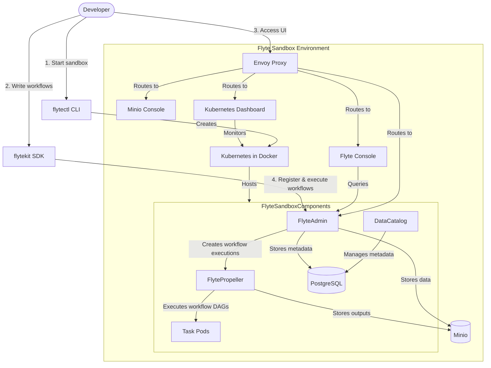
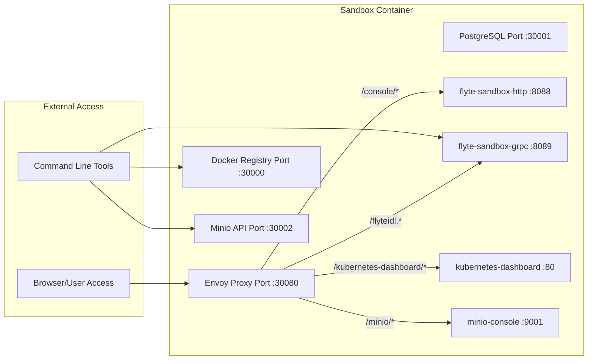
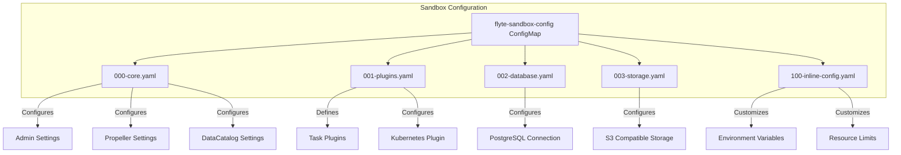
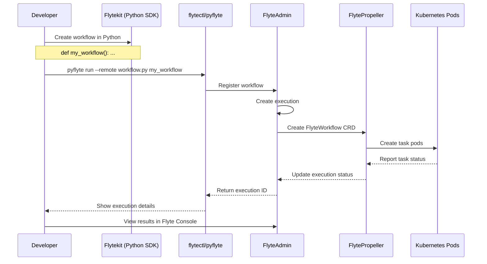
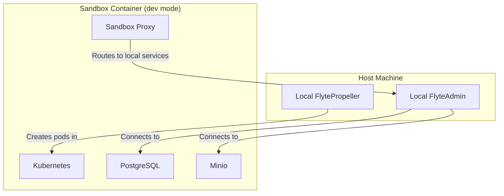

# Sandbox Environment

<details>
<summary>Relevant source files</summary>

The following files were used as context for generating this wiki page:

- [README.md](README.md)
- [charts/flyte-binary/README.md](charts/flyte-binary/README.md)
- [charts/flyte-binary/templates/_helpers.tpl](charts/flyte-binary/templates/_helpers.tpl)
- [charts/flyte-binary/templates/admin-auth-secret.yaml](charts/flyte-binary/templates/admin-auth-secret.yaml)
- [charts/flyte-binary/templates/auth-client-secret.yaml](charts/flyte-binary/templates/auth-client-secret.yaml)
- [charts/flyte-binary/templates/cluster-resource-templates.yaml](charts/flyte-binary/templates/cluster-resource-templates.yaml)
- [charts/flyte-binary/templates/clusterrole.yaml](charts/flyte-binary/templates/clusterrole.yaml)
- [charts/flyte-binary/templates/clusterrolebinding.yaml](charts/flyte-binary/templates/clusterrolebinding.yaml)
- [charts/flyte-binary/templates/configmap.yaml](charts/flyte-binary/templates/configmap.yaml)
- [charts/flyte-binary/templates/deployment.yaml](charts/flyte-binary/templates/deployment.yaml)
- [charts/flyte-binary/templates/ingress/grpc.yaml](charts/flyte-binary/templates/ingress/grpc.yaml)
- [charts/flyte-binary/templates/ingress/http.yaml](charts/flyte-binary/templates/ingress/http.yaml)
- [charts/flyte-binary/templates/service/grpc.yaml](charts/flyte-binary/templates/service/grpc.yaml)
- [charts/flyte-binary/templates/service/http.yaml](charts/flyte-binary/templates/service/http.yaml)
- [charts/flyte-binary/templates/service/webhook.yaml](charts/flyte-binary/templates/service/webhook.yaml)
- [charts/flyte-binary/values.yaml](charts/flyte-binary/values.yaml)
- [charts/flyte-sandbox/Chart.lock](charts/flyte-sandbox/Chart.lock)
- [charts/flyte-sandbox/templates/proxy/configmap.yaml](charts/flyte-sandbox/templates/proxy/configmap.yaml)
- [deployment/sandbox-binary/flyte_sandbox_binary_helm_generated.yaml](deployment/sandbox-binary/flyte_sandbox_binary_helm_generated.yaml)
- [docker/sandbox-bundled/manifests/complete-agent.yaml](docker/sandbox-bundled/manifests/complete-agent.yaml)
- [docker/sandbox-bundled/manifests/complete.yaml](docker/sandbox-bundled/manifests/complete.yaml)
- [docker/sandbox-bundled/manifests/dev.yaml](docker/sandbox-bundled/manifests/dev.yaml)

</details>


The Flyte Sandbox Environment provides a lightweight, self-contained implementation of the Flyte platform designed for local development and testing. It packages all core Flyte components in a single Docker container, allowing developers to quickly experiment with workflows and features without requiring a full production deployment.

For information about production deployment options, see [Kubernetes Deployment with Helm](#2.1).

## Architecture Overview

The Flyte Sandbox includes all essential components of the Flyte platform in a containerized environment. The sandbox uses a small Kubernetes cluster run inside Docker, with components deployed via Helm charts.

### Sandbox Components



Sources: 
- [docker/sandbox-bundled/manifests/complete.yaml:1-1054]()
- [docker/sandbox-bundled/manifests/dev.yaml:1-765]()
- [charts/flyte-sandbox/Chart.lock:1-19]()

### Component Connectivity in Sandbox



Sources:
- [docker/sandbox-bundled/manifests/complete.yaml:580-755]()
- [charts/flyte-sandbox/templates/proxy/configmap.yaml:1-84]()

## Setting Up the Sandbox

The Flyte Sandbox can be easily started using the `flytectl` command line tool. 

### Prerequisites

1. Docker installed and running
2. `flytectl` CLI tool installed
3. `pyflyte` (part of the `flytekit` Python package) installed for workflow execution

### Starting the Sandbox

To start the Flyte Sandbox environment:

```
flytectl demo start
```

This command:
1. Downloads the Flyte Sandbox Docker image
2. Launches a containerized Kubernetes environment
3. Deploys all Flyte components via Helm charts
4. Configures the necessary network ports and services
5. Provides connection information when ready

Sources:
- [README.md:81-84]()

### Sandbox Endpoints

Once running, the sandbox exposes the following endpoints:

| Service | URL | Description |
|---------|-----|-------------|
| Flyte Console | http://localhost:30080/console | Web UI for managing workflows |
| Kubernetes Dashboard | http://localhost:30080/kubernetes-dashboard | Dashboard for monitoring K8s resources |
| Minio Console | http://localhost:30080/minio | Web UI for object storage |
| PostgreSQL | localhost:30001 | Database for metadata (external access) |
| Minio API | localhost:30002 | Object storage API (external access) |
| Docker Registry | localhost:30000 | Container registry (for custom images) |

Sources:
- [docker/sandbox-bundled/manifests/complete.yaml:890-908]()
- [docker/sandbox-bundled/manifests/complete.yaml:990-996]()
- [docker/sandbox-bundled/manifests/complete.yaml:1020-1021]()

## Sandbox Configuration

The Flyte Sandbox environment is preconfigured with default settings for rapid startup, but can be customized for specific needs.

### Core Components Configuration

The core Flyte components are configured via ConfigMaps in the sandbox environment:



Sources:
- [docker/sandbox-bundled/manifests/complete.yaml:417-537]()
- [charts/flyte-binary/templates/configmap.yaml:1-212]()

### Default Storage Configuration

The sandbox uses Minio as an S3-compatible object store with the following default configuration:

```yaml
storage:
  type: stow
  stow:
    kind: s3
    config:
      region: us-east-1
      disable_ssl: true
      v2_signing: true
      endpoint: http://flyte-sandbox-minio.flyte:9000
      auth_type: accesskey
  container: my-s3-bucket
```

Default credentials:
- Access Key: `minio`
- Secret Key: `miniostorage`

Sources:
- [docker/sandbox-bundled/manifests/complete.yaml:484-494]()
- [docker/sandbox-bundled/manifests/complete.yaml:496-503]()

### Default Database Configuration

The sandbox uses PostgreSQL with the following configuration:

```yaml
database:
  postgres:
    username: postgres
    password: postgres
    host: flyte-sandbox-postgresql
    port: 5432
    dbname: flyte
    options: sslmode=disable
```

Sources:
- [docker/sandbox-bundled/manifests/complete.yaml:474-480]()
- [docker/sandbox-bundled/manifests/complete.yaml:791-802]()

## Using the Sandbox

After starting the sandbox, you can use it to develop, test, and run Flyte workflows.

### Workflow Execution Lifecycle



Sources:
- [README.md:85-90]()

### Example: Running a Workflow

1. Create a simple workflow using Flytekit:

```python
from flytekit import task, workflow

@task
def say_hello(name: str) -> str:
    return f"Hello, {name}!"

@workflow
def hello_world_wf(name: str = "World") -> str:
    greeting = say_hello(name=name)
    return greeting
```

2. Execute the workflow on the sandbox:

```bash
# Run locally first (optional)
pyflyte run hello_world.py hello_world_wf --name "Flyte"

# Run on the sandbox cluster
pyflyte run --remote hello_world.py hello_world_wf --name "Flyte"
```

3. Access the Flyte Console at `http://localhost:30080/console` to monitor execution and view results.

Sources:
- [README.md:72-89]()

## Development Mode

The sandbox supports a special development mode which allows running Flyte components locally while connecting to the sandbox for storage and database services.

In development mode, the sandbox only deploys supporting services (PostgreSQL, Minio), while the Flyte services (Admin, Propeller) are expected to run on the host machine. This allows for quick iteration during development of Flyte's core components.



Sources:
- [docker/sandbox-bundled/manifests/dev.yaml:584-607]()

## Limitations of the Sandbox

The Flyte Sandbox Environment has some limitations compared to a production deployment:

1. **Single-node Kubernetes**: Limited to a single-node K8s cluster running in Docker
2. **Performance**: Limited by the host machine's resources  
3. **Persistence**: Data is stored in container volumes by default and may be lost when the container is removed
4. **Auth**: Authentication is typically disabled for ease of development
5. **Limited scalability**: Not suitable for large-scale workflows or high concurrency

Sources:
- [charts/flyte-binary/values.yaml:43-62]()
- [docker/sandbox-bundled/manifests/complete.yaml:430-433]()

## Shutting Down the Sandbox

To stop the sandbox environment:

```bash
flytectl demo stop
```

This will stop and remove the sandbox container, but preserve the data volumes. To completely clean up:

```bash
flytectl demo clean
```

This removes the sandbox container and all associated data volumes.

Sources:
- [README.md:81-90]() (implied from demo start command)

## Conclusion

The Flyte Sandbox Environment provides a comprehensive local development and testing platform that includes all essential Flyte components. It allows developers to build, test, and refine workflows locally before deploying them to a production Flyte environment.

The sandbox is optimized for ease of use and quick startup, making it ideal for development, testing, and learning Flyte without the complexity of a full production deployment.