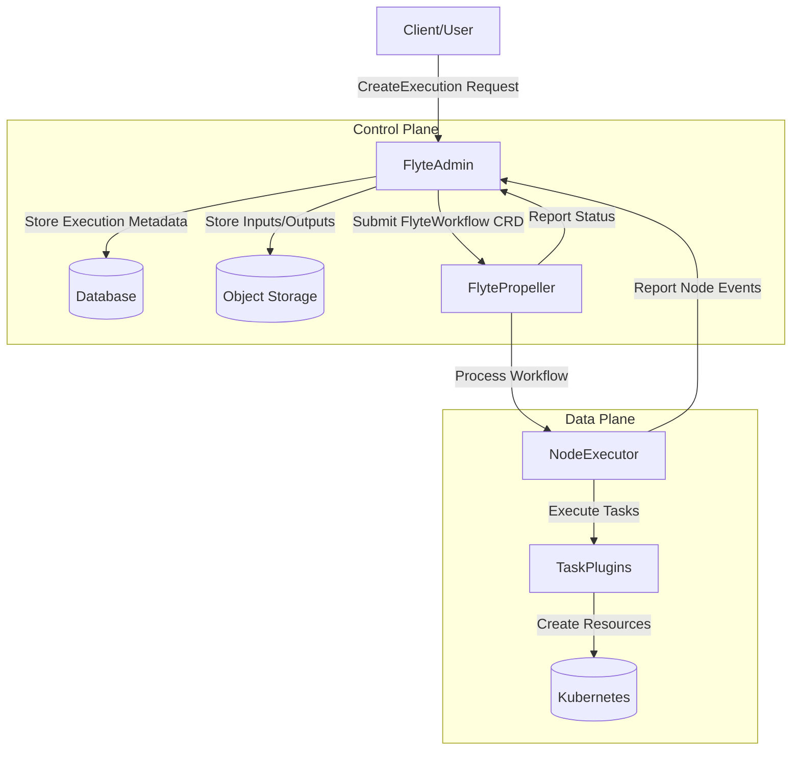
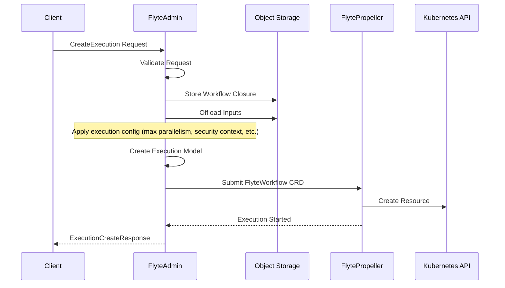
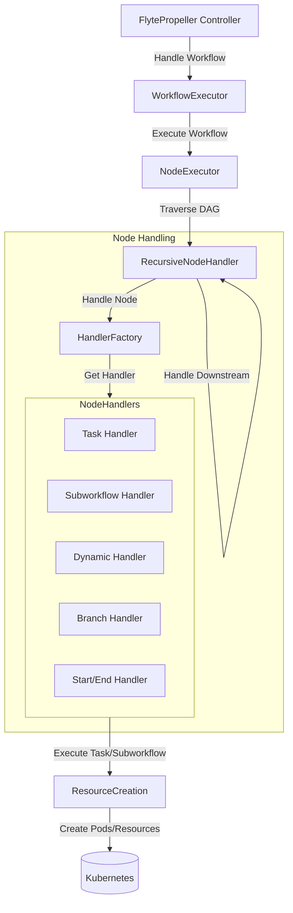
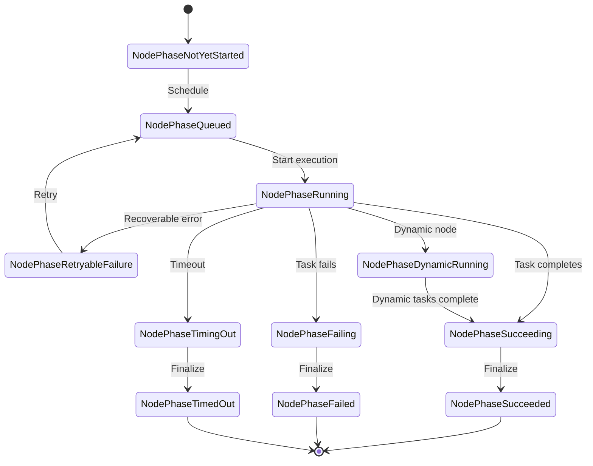
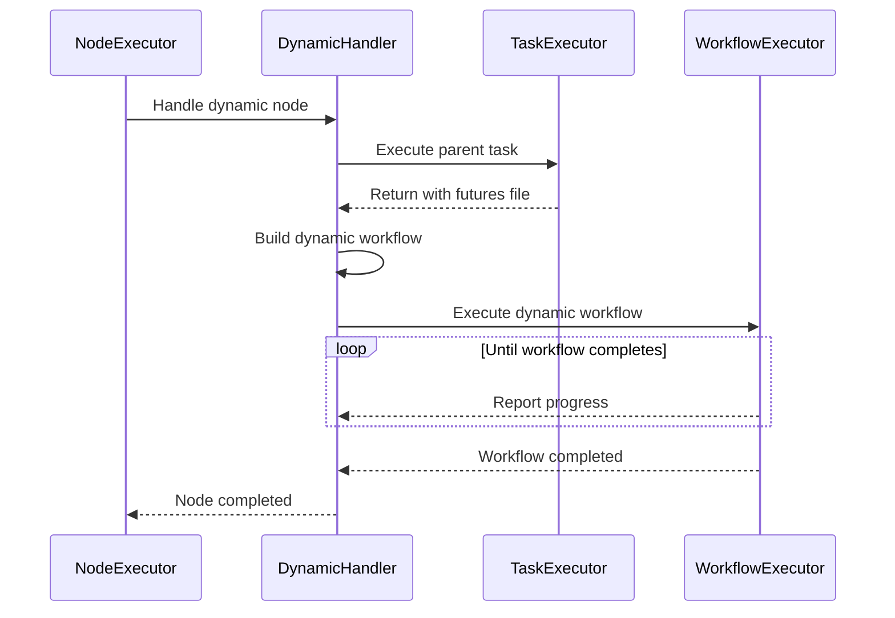
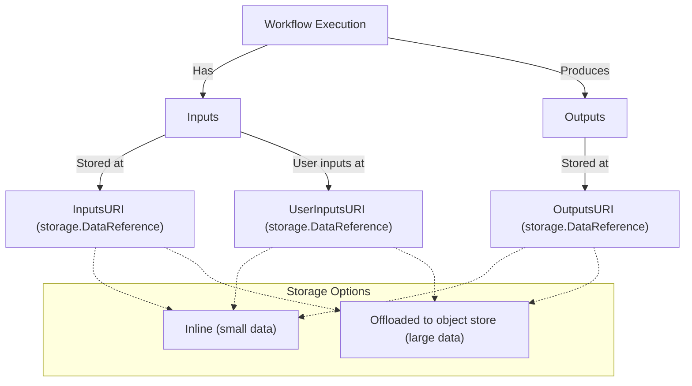
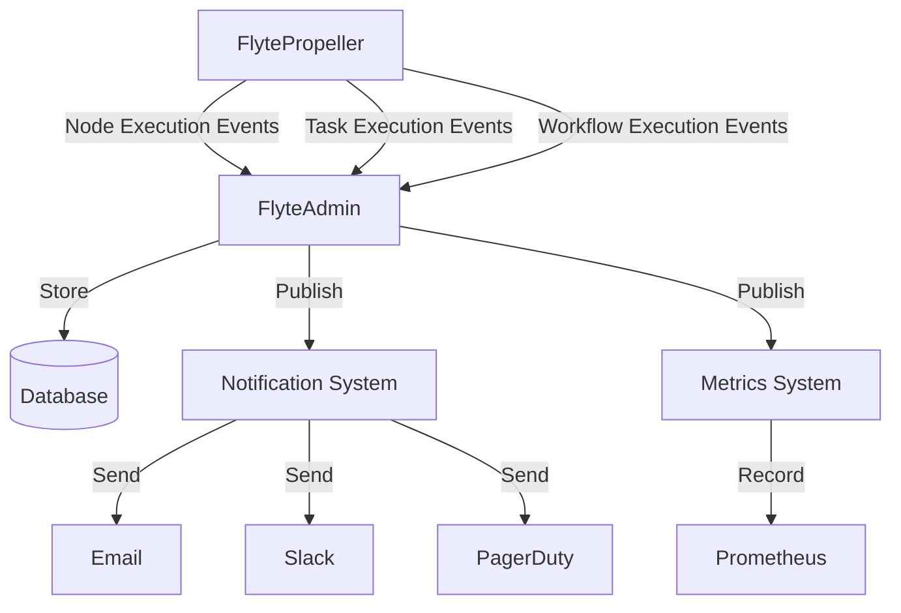

# Workflow Execution Engine

Relevant source files

The following files were used as context for generating this wiki page:

- [flyteadmin/cmd/scheduler/entrypoints/scheduler.go](flyteadmin/cmd/scheduler/entrypoints/scheduler.go)
- [flyteadmin/pkg/manager/impl/execution_manager.go](flyteadmin/pkg/manager/impl/execution_manager.go)
- [flyteadmin/pkg/manager/impl/execution_manager_test.go](flyteadmin/pkg/manager/impl/execution_manager_test.go)
- [flyteadmin/pkg/manager/impl/node_execution_manager.go](flyteadmin/pkg/manager/impl/node_execution_manager.go)
- [flyteadmin/pkg/manager/impl/node_execution_manager_test.go](flyteadmin/pkg/manager/impl/node_execution_manager_test.go)
- [flyteadmin/pkg/manager/impl/task_execution_manager.go](flyteadmin/pkg/manager/impl/task_execution_manager.go)
- [flyteadmin/pkg/manager/impl/task_execution_manager_test.go](flyteadmin/pkg/manager/impl/task_execution_manager_test.go)
- [flyteadmin/pkg/repositories/config/migrations.go](flyteadmin/pkg/repositories/config/migrations.go)
- [flyteadmin/pkg/repositories/config/migrations_test.go](flyteadmin/pkg/repositories/config/migrations_test.go)
- [flyteadmin/pkg/repositories/models/execution.go](flyteadmin/pkg/repositories/models/execution.go)
- [flyteadmin/pkg/repositories/transformers/execution.go](flyteadmin/pkg/repositories/transformers/execution.go)
- [flyteadmin/pkg/repositories/transformers/execution_test.go](flyteadmin/pkg/repositories/transformers/execution_test.go)
- [flyteadmin/pkg/repositories/transformers/node_execution.go](flyteadmin/pkg/repositories/transformers/node_execution.go)
- [flyteadmin/pkg/repositories/transformers/node_execution_test.go](flyteadmin/pkg/repositories/transformers/node_execution_test.go)
- [flyteadmin/pkg/repositories/transformers/task_execution.go](flyteadmin/pkg/repositories/transformers/task_execution.go)
- [flyteadmin/pkg/repositories/transformers/task_execution_test.go](flyteadmin/pkg/repositories/transformers/task_execution_test.go)
- [flyteadmin/pkg/rpc/adminservice/base.go](flyteadmin/pkg/rpc/adminservice/base.go)
- [flyteadmin/pkg/runtime/application_config_provider.go](flyteadmin/pkg/runtime/application_config_provider.go)
- [flyteadmin/pkg/runtime/interfaces/application_configuration.go](flyteadmin/pkg/runtime/interfaces/application_configuration.go)
- [flyteadmin/pkg/workflowengine/impl/k8s_executor.go](flyteadmin/pkg/workflowengine/impl/k8s_executor.go)
- [flyteadmin/pkg/workflowengine/impl/k8s_executor_test.go](flyteadmin/pkg/workflowengine/impl/k8s_executor_test.go)
- [flyteadmin/pkg/workflowengine/impl/prepare_execution.go](flyteadmin/pkg/workflowengine/impl/prepare_execution.go)
- [flyteadmin/pkg/workflowengine/impl/prepare_execution_test.go](flyteadmin/pkg/workflowengine/impl/prepare_execution_test.go)
- [flyteadmin/pkg/workflowengine/interfaces/executor.go](flyteadmin/pkg/workflowengine/interfaces/executor.go)
- [flyteplugins/go/tasks/plugins/array/k8s/subtask.go](flyteplugins/go/tasks/plugins/array/k8s/subtask.go)
- [flytepropeller/pkg/apis/flyteworkflow/v1alpha1/iface.go](flytepropeller/pkg/apis/flyteworkflow/v1alpha1/iface.go)
- [flytepropeller/pkg/apis/flyteworkflow/v1alpha1/mocks/ExecutableTaskNodeStatus.go](flytepropeller/pkg/apis/flyteworkflow/v1alpha1/mocks/ExecutableTaskNodeStatus.go)
- [flytepropeller/pkg/apis/flyteworkflow/v1alpha1/mocks/MutableTaskNodeStatus.go](flytepropeller/pkg/apis/flyteworkflow/v1alpha1/mocks/MutableTaskNodeStatus.go)
- [flytepropeller/pkg/apis/flyteworkflow/v1alpha1/node_status.go](flytepropeller/pkg/apis/flyteworkflow/v1alpha1/node_status.go)
- [flytepropeller/pkg/apis/flyteworkflow/v1alpha1/node_status_test.go](flytepropeller/pkg/apis/flyteworkflow/v1alpha1/node_status_test.go)
- [flytepropeller/pkg/controller/controller.go](flytepropeller/pkg/controller/controller.go)
- [flytepropeller/pkg/controller/nodes/dynamic/dynamic_workflow.go](flytepropeller/pkg/controller/nodes/dynamic/dynamic_workflow.go)
- [flytepropeller/pkg/controller/nodes/dynamic/handler.go](flytepropeller/pkg/controller/nodes/dynamic/handler.go)
- [flytepropeller/pkg/controller/nodes/dynamic/handler_test.go](flytepropeller/pkg/controller/nodes/dynamic/handler_test.go)
- [flytepropeller/pkg/controller/nodes/executor.go](flytepropeller/pkg/controller/nodes/executor.go)
- [flytepropeller/pkg/controller/nodes/executor_test.go](flytepropeller/pkg/controller/nodes/executor_test.go)
- [flytepropeller/pkg/controller/nodes/handler/state.go](flytepropeller/pkg/controller/nodes/handler/state.go)
- [flytepropeller/pkg/controller/nodes/handler/transition_info.go](flytepropeller/pkg/controller/nodes/handler/transition_info.go)
- [flytepropeller/pkg/controller/nodes/handler/transition_info_test.go](flytepropeller/pkg/controller/nodes/handler/transition_info_test.go)
- [flytepropeller/pkg/controller/nodes/handler/transition_test.go](flytepropeller/pkg/controller/nodes/handler/transition_test.go)
- [flytepropeller/pkg/controller/nodes/node_state_manager.go](flytepropeller/pkg/controller/nodes/node_state_manager.go)
- [flytepropeller/pkg/controller/nodes/transformers.go](flytepropeller/pkg/controller/nodes/transformers.go)
- [flytepropeller/pkg/controller/workflow/executor_test.go](flytepropeller/pkg/controller/workflow/executor_test.go)

This document provides a detailed overview of the workflow execution engine that powers Flyte. It covers the system components involved in workflow execution, their interactions, and the execution lifecycle from creation to completion.

The workflow execution engine spans multiple components across the Flyte system, with the primary components being FlyteAdmin (control plane) and FlytePropeller (data plane). For information about specific workflow handlers, see [Node Execution System](#3.3).

## Execution Engine Architecture

The Flyte workflow execution engine consists of two primary components that work together to execute workflows:

1. **FlyteAdmin (Control Plane)** - Manages workflow metadata, handles execution requests, and coordinates the overall workflow execution process
2. **FlytePropeller (Data Plane)** - Performs the actual execution of workflows by processing the workflow graph and running individual tasks

Sources:
- [flyteadmin/pkg/manager/impl/execution_manager.go:75-93](flyteadmin/pkg/manager/impl/execution_manager.go:75-93)
- [flytepropeller/pkg/controller/controller.go:82-96](flytepropeller/pkg/controller/controller.go:82-96)
- [flytepropeller/pkg/controller/nodes/executor.go:98-106](flytepropeller/pkg/controller/nodes/executor.go:98-106)

## Execution Creation Flow

The execution process begins when a client submits an execution request to FlyteAdmin.

### Execution Configuration

When creating an execution, FlyteAdmin resolves various configuration settings from multiple sources with the following precedence (highest to lowest):

1. Execution request
2. Launch plan (if applicable)
3. Project-domain level config
4. Project level config
5. System defaults

Configuration includes:
- Max parallelism for task nodes
- Security context (IAM roles, K8s service accounts)
- Raw output location
- Labels and annotations
- Resource overrides
- Cluster assignment

Sources:
- [flyteadmin/pkg/manager/impl/execution_manager.go:320-402](flyteadmin/pkg/manager/impl/execution_manager.go:320-402)
- [flyteadmin/pkg/runtime/interfaces/application_configuration.go:205-229](flyteadmin/pkg/runtime/interfaces/application_configuration.go:205-229)
- [flyteadmin/pkg/repositories/transformers/execution.go:62-143](flyteadmin/pkg/repositories/transformers/execution.go:62-143)

## Workflow Execution in FlytePropeller

FlytePropeller is a Kubernetes controller that processes FlyteWorkflow custom resources. It's responsible for executing the workflow graph by traversing the nodes in the workflow and executing each one based on its type.

FlytePropeller uses a recursive, depth-first algorithm to traverse the workflow graph:

1. Start with the workflow's start node
2. For each node:
   - If the node can be executed, handle it
   - If the node has completed, process its downstream nodes
3. A workflow completes when all terminal nodes are successfully executed

FlytePropeller supports various execution controls:
- Max parallelism limiting how many nodes run in parallel
- Failure handling policies for continuing execution when nodes fail
- Node execution state tracking

Sources:
- [flytepropeller/pkg/controller/controller.go:327-468](flytepropeller/pkg/controller/controller.go:327-468)
- [flytepropeller/pkg/controller/nodes/executor.go:177-262](flytepropeller/pkg/controller/nodes/executor.go:177-262)
- [flytepropeller/pkg/controller/nodes/executor.go:266-341](flytepropeller/pkg/controller/nodes/executor.go:266-341)

## Node Execution State Machine

Each node in a workflow follows a state machine that transitions through different phases during execution:

### Node Types and Handlers

FlytePropeller supports different types of nodes, each with a specialized handler:

| Node Type | Handler | Purpose |
|-----------|---------|---------|
| Task | TaskHandler | Executes a single task by creating and monitoring K8s resources |
| Subworkflow | SubworkflowHandler | Executes a nested workflow |
| Dynamic | DynamicNodeHandler | Generates a workflow at runtime based on task output |
| Branch | BranchHandler | Implements conditional logic to select execution paths |
| Start/End | StartNodeHandler/EndNodeHandler | Special nodes marking the start and end of the workflow |
| Array | ArrayHandler | Executes multiple parallel tasks |

Sources:
- [flytepropeller/pkg/apis/flyteworkflow/v1alpha1/node_status.go:83-95](flytepropeller/pkg/apis/flyteworkflow/v1alpha1/node_status.go:83-95)
- [flytepropeller/pkg/apis/flyteworkflow/v1alpha1/node_status.go:133-259](flytepropeller/pkg/apis/flyteworkflow/v1alpha1/node_status.go:133-259)
- [flytepropeller/pkg/controller/nodes/executor.go:7-17](flytepropeller/pkg/controller/nodes/executor.go:7-17)

## Dynamic Workflow Execution

Dynamic workflows are a powerful feature of Flyte that allows generating workflow structure at runtime. The execution of a dynamic node involves:

1. The parent task executes and produces a "futures file" defining tasks to execute
2. The dynamic handler processes this file to build a subworkflow
3. The subworkflow is executed just like any other workflow
4. Results are aggregated and returned as the output of the dynamic node

The dynamic node goes through several phases:
1. `DynamicNodePhaseNone`: Initial state, parent task executing
2. `DynamicNodePhaseParentFinalizing`: Parent completed, finalizing
3. `DynamicNodePhaseParentFinalized`: Parent finalized, ready to execute dynamic tasks
4. `DynamicNodePhaseExecuting`: Dynamic tasks are executing
5. `DynamicNodePhaseFailing`: Handling failures in dynamic tasks

Sources:
- [flytepropeller/pkg/controller/nodes/dynamic/handler.go:82-95](flytepropeller/pkg/controller/nodes/dynamic/handler.go:82-95)
- [flytepropeller/pkg/controller/nodes/dynamic/handler.go:168-233](flytepropeller/pkg/controller/nodes/dynamic/handler.go:168-233)

## Execution Data Management

Flyte has a sophisticated system for handling execution inputs and outputs:

### Data Storage Strategies

Flyte supports different strategies for handling execution data:

1. **Inline Storage**: Small data can be stored directly in the execution records
2. **Offloaded Storage**: Larger data is stored in an object store (S3, GCS, etc.) and referenced by URI
3. **Configurable Thresholds**: The system can be configured to automatically decide when to offload data

The data management system also supports:
- Caching of task execution results
- Type checking of inputs and outputs
- Data transformation between different formats

Sources:
- [flyteadmin/pkg/repositories/transformers/execution.go:126-135](flyteadmin/pkg/repositories/transformers/execution.go:126-135)
- [flyteadmin/pkg/repositories/transformers/task_execution.go:78-102](flyteadmin/pkg/repositories/transformers/task_execution.go:78-102)
- [flyteadmin/pkg/manager/impl/execution_manager.go:515-541](flyteadmin/pkg/manager/impl/execution_manager.go:515-541)

## Execution Monitoring and Events

Flyte uses an event-based system to track execution progress:

Each execution type (workflow, node, task) has its own event model with phase transitions and metadata. Events are used to:

1. Update the execution state in the database
2. Trigger notifications
3. Record metrics
4. Update execution closure with outputs or errors

Sources:
- [flytepropeller/pkg/controller/nodes/transformers.go:26-51](flytepropeller/pkg/controller/nodes/transformers.go:26-51)
- [flyteadmin/pkg/repositories/transformers/node_execution.go:31-70](flyteadmin/pkg/repositories/transformers/node_execution.go:31-70)
- [flyteadmin/pkg/manager/impl/node_execution_manager.go:36-55](flyteadmin/pkg/manager/impl/node_execution_manager.go:36-55)

## Execution Recovery and Failure Handling

Flyte provides several mechanisms for handling failures in workflow execution:

1. **Node Retries**: Nodes can be configured to retry on failure
2. **Workflow Recovery**: Failed workflows can be recovered and restarted
3. **Failure Policies**: Workflows can be configured to continue execution even when some nodes fail
4. **Error Classification**: Errors are classified as system or user errors, affecting retry behavior

The system distinguishes between:
- **Permanent Failures**: Cannot be recovered and result in workflow failure
- **Retryable Failures**: Temporary issues that can be retried
- **System vs. User Errors**: Different handling for system issues vs. user code problems

Sources:
- [flytepropeller/pkg/controller/nodes/executor.go:548-564](flytepropeller/pkg/controller/nodes/executor.go:548-564)
- [flyteadmin/pkg/manager/impl/execution_manager.go:622-647](flyteadmin/pkg/manager/impl/execution_manager.go:622-647)

## Execution Termination

Workflows can terminate in several states:

1. **Success**: All nodes completed successfully
2. **Failure**: One or more nodes failed permanently
3. **Timeout**: Execution exceeded its time limit
4. **Aborted**: Execution was manually terminated

When a workflow reaches a terminal state:
1. FlytePropeller reports the final status to FlyteAdmin
2. FlyteAdmin updates the execution record
3. Notifications are sent based on configuration
4. Resources are cleaned up based on garbage collection policies

Sources:
- [flytepropeller/pkg/controller/nodes/executor.go:343-400](flytepropeller/pkg/controller/nodes/executor.go:343-400)
- [flytepropeller/pkg/controller/nodes/executor.go:402-459](flytepropeller/pkg/controller/nodes/executor.go:402-459)

## Conclusion

The Flyte workflow execution engine is a sophisticated distributed system that:
- Provides a reliable and scalable platform for executing workflows
- Supports complex workflow patterns including dynamic workflows
- Handles data management efficiently
- Provides comprehensive monitoring and recovery capabilities

The separation between the control plane (FlyteAdmin) and data plane (FlytePropeller) enables a scalable architecture that can handle large numbers of concurrent workflow executions.