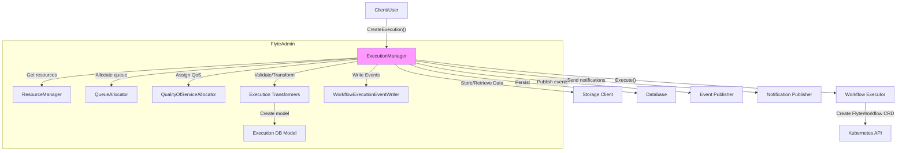
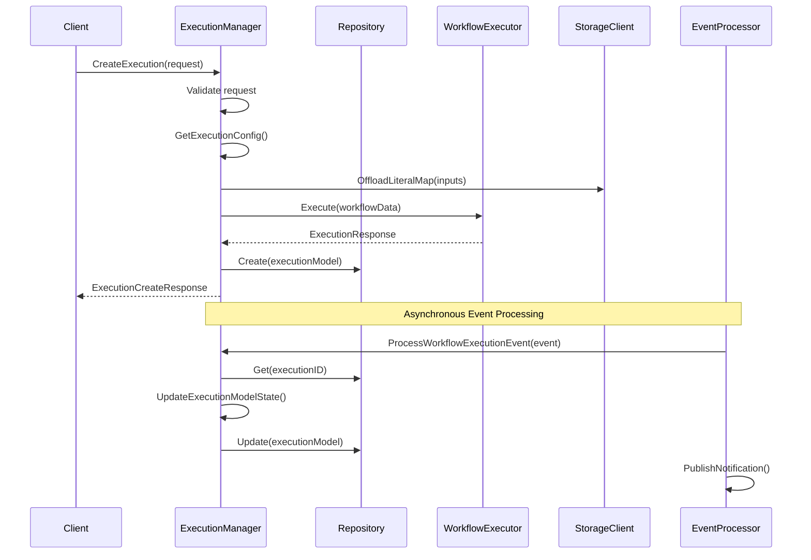
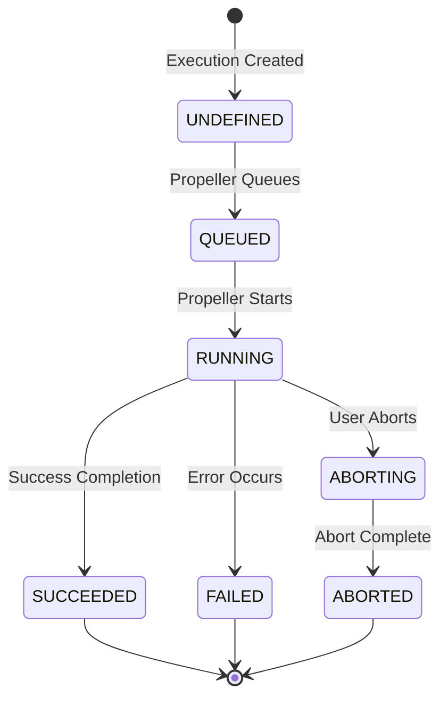
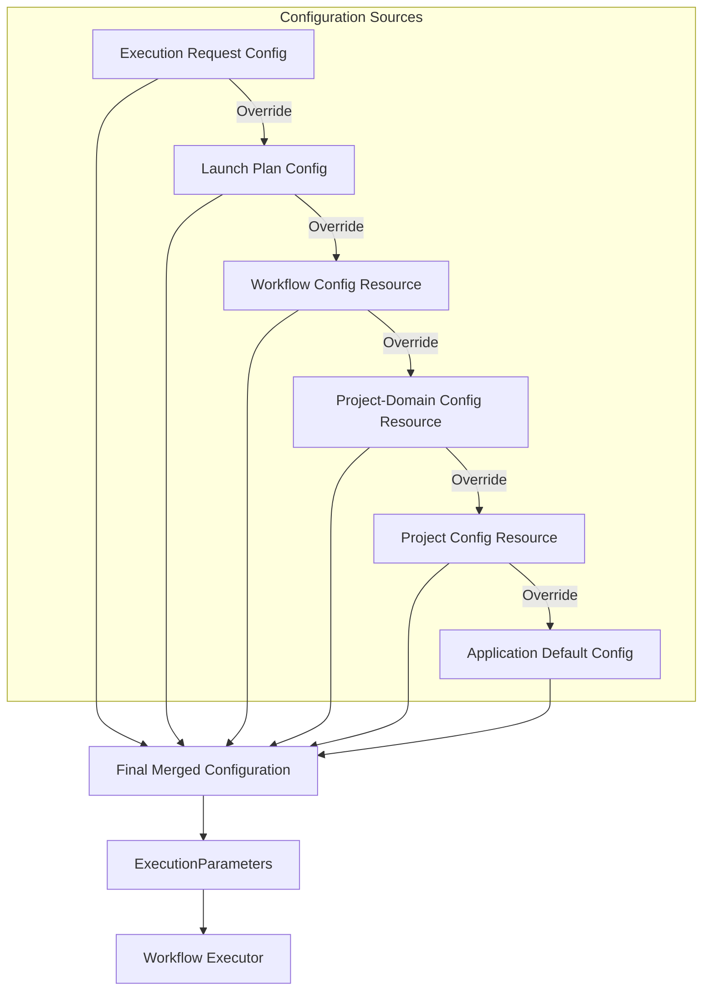
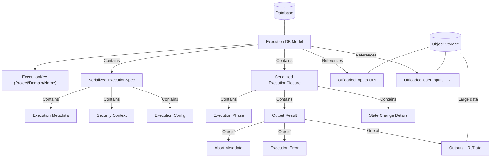

# FlyteAdmin Execution Management

Relevant source files

The following files were used as context for generating this wiki page:

- [flyteadmin/cmd/scheduler/entrypoints/scheduler.go](flyteadmin/cmd/scheduler/entrypoints/scheduler.go)
- [flyteadmin/pkg/manager/impl/execution_manager.go](flyteadmin/pkg/manager/impl/execution_manager.go)
- [flyteadmin/pkg/manager/impl/execution_manager_test.go](flyteadmin/pkg/manager/impl/execution_manager_test.go)
- [flyteadmin/pkg/manager/impl/node_execution_manager.go](flyteadmin/pkg/manager/impl/node_execution_manager.go)
- [flyteadmin/pkg/manager/impl/node_execution_manager_test.go](flyteadmin/pkg/manager/impl/node_execution_manager_test.go)
- [flyteadmin/pkg/manager/impl/task_execution_manager.go](flyteadmin/pkg/manager/impl/task_execution_manager.go)
- [flyteadmin/pkg/manager/impl/task_execution_manager_test.go](flyteadmin/pkg/manager/impl/task_execution_manager_test.go)
- [flyteadmin/pkg/repositories/config/migrations.go](flyteadmin/pkg/repositories/config/migrations.go)
- [flyteadmin/pkg/repositories/config/migrations_test.go](flyteadmin/pkg/repositories/config/migrations_test.go)
- [flyteadmin/pkg/repositories/models/execution.go](flyteadmin/pkg/repositories/models/execution.go)
- [flyteadmin/pkg/repositories/transformers/execution.go](flyteadmin/pkg/repositories/transformers/execution.go)
- [flyteadmin/pkg/repositories/transformers/execution_test.go](flyteadmin/pkg/repositories/transformers/execution_test.go)
- [flyteadmin/pkg/repositories/transformers/node_execution.go](flyteadmin/pkg/repositories/transformers/node_execution.go)
- [flyteadmin/pkg/repositories/transformers/node_execution_test.go](flyteadmin/pkg/repositories/transformers/node_execution_test.go)
- [flyteadmin/pkg/repositories/transformers/task_execution.go](flyteadmin/pkg/repositories/transformers/task_execution.go)
- [flyteadmin/pkg/repositories/transformers/task_execution_test.go](flyteadmin/pkg/repositories/transformers/task_execution_test.go)
- [flyteadmin/pkg/rpc/adminservice/base.go](flyteadmin/pkg/rpc/adminservice/base.go)
- [flyteadmin/pkg/runtime/application_config_provider.go](flyteadmin/pkg/runtime/application_config_provider.go)
- [flyteadmin/pkg/runtime/interfaces/application_configuration.go](flyteadmin/pkg/runtime/interfaces/application_configuration.go)
- [flyteadmin/pkg/workflowengine/impl/k8s_executor.go](flyteadmin/pkg/workflowengine/impl/k8s_executor.go)
- [flyteadmin/pkg/workflowengine/impl/k8s_executor_test.go](flyteadmin/pkg/workflowengine/impl/k8s_executor_test.go)
- [flyteadmin/pkg/workflowengine/impl/prepare_execution.go](flyteadmin/pkg/workflowengine/impl/prepare_execution.go)
- [flyteadmin/pkg/workflowengine/impl/prepare_execution_test.go](flyteadmin/pkg/workflowengine/impl/prepare_execution_test.go)
- [flyteadmin/pkg/workflowengine/interfaces/executor.go](flyteadmin/pkg/workflowengine/interfaces/executor.go)
- [flyteplugins/go/tasks/plugins/array/k8s/subtask.go](flyteplugins/go/tasks/plugins/array/k8s/subtask.go)

This document describes the execution management functionality of FlyteAdmin, which is responsible for creating, tracking, and updating workflow executions in the Flyte system. FlyteAdmin serves as the control plane for executions, handling the lifecycle from creation to completion, managing state transitions, and processing execution-related events.

For information on how FlytePropeller actually executes workflows after FlyteAdmin creates them, see [FlytePropeller Execution](#3.2).

## Execution Management Architecture

FlyteAdmin's execution management system centers around the `ExecutionManager` component, which orchestrates the creation and tracking of workflow executions.

Sources:
[flyteadmin/pkg/manager/impl/execution_manager.go:75-93](flyteadmin/pkg/manager/impl/execution_manager.go:75-93)
[flyteadmin/pkg/rpc/adminservice/base.go:29-44](flyteadmin/pkg/rpc/adminservice/base.go:29-44)

### Key Components

- **ExecutionManager**: Core component that handles execution creation, state management, and event processing
- **ResourceManager**: Manages resource constraints and configuration for executions
- **QueueAllocator**: Assigns appropriate queues for task execution
- **QualityOfServiceAllocator**: Determines execution priority and resource allocation
- **Transformers**: Convert between API models and database models
- **WorkflowExecutor**: Interface to the execution engine (typically FlytePropeller)
- **EventWriter**: Asynchronously writes execution events to the database

Sources:
[flyteadmin/pkg/manager/impl/execution_manager.go:75-93](flyteadmin/pkg/manager/impl/execution_manager.go:75-93)
[flyteadmin/pkg/rpc/adminservice/base.go:129-132](flyteadmin/pkg/rpc/adminservice/base.go:129-132)

## Execution Lifecycle

Sources:
[flyteadmin/pkg/manager/impl/execution_manager.go:452-691](flyteadmin/pkg/manager/impl/execution_manager.go:452-691)
[flyteadmin/pkg/repositories/transformers/execution.go:208-300](flyteadmin/pkg/repositories/transformers/execution.go:208-300)

### Execution Creation

1. Client submits an execution creation request to FlyteAdmin
2. ExecutionManager validates the request and resolves execution configuration
3. Inputs are offloaded to a storage system if needed
4. The workflow executor is invoked to create the actual execution
5. An execution model is created and stored in the database
6. A response with the execution ID is returned to the client

Sources:
[flyteadmin/pkg/manager/impl/execution_manager.go:452-691](flyteadmin/pkg/manager/impl/execution_manager.go:452-691)

### Execution State Transitions

Sources:
[flyteadmin/pkg/repositories/transformers/execution.go:208-300](flyteadmin/pkg/repositories/transformers/execution.go:208-300)
[flyteadmin/pkg/repositories/transformers/execution.go:334-358](flyteadmin/pkg/repositories/transformers/execution.go:334-358)

### Execution Events

As an execution progresses, events are sent by FlytePropeller to FlyteAdmin to update the state:

1. FlyteAdmin receives workflow execution events
2. The ExecutionManager retrieves the current execution model
3. It updates the state based on the event information
4. The updated model is stored in the database
5. Notifications are sent if configured

Sources:
[flyteadmin/pkg/repositories/transformers/execution.go:208-300](flyteadmin/pkg/repositories/transformers/execution.go:208-300)

## Execution Configuration

When creating an execution, the configuration is resolved from multiple sources in the following order of precedence:

1. Execution creation request
2. Launch plan configuration
3. Workflow-specific configuration from matchable resources
4. Project-domain-specific configuration from matchable resources
5. Project-level configuration from matchable resources
6. Application default configuration

Sources:
[flyteadmin/pkg/manager/impl/execution_manager.go:320-402](flyteadmin/pkg/manager/impl/execution_manager.go:320-402)
[flyteadmin/pkg/runtime/interfaces/application_configuration.go:205-229](flyteadmin/pkg/runtime/interfaces/application_configuration.go:205-229)

### Key Configuration Elements

The execution configuration includes:

| Configuration Element | Description |
|-----------------------|-------------|
| SecurityContext | Identity (IAM role, K8s service account) to run as |
| RawOutputDataConfig | Where to store execution outputs |
| Labels | Key-value pairs for identification/filtering |
| Annotations | Metadata for the execution |
| MaxParallelism | Maximum parallel task nodes |
| Interruptible | Whether tasks can be interrupted |
| OverwriteCache | Whether to skip cached results |
| ClusterAssignment | Which cluster pool to use |
| ExecutionClusterLabel | Specific cluster to target |

Sources:
[flyteadmin/pkg/runtime/interfaces/application_configuration.go:62-186](flyteadmin/pkg/runtime/interfaces/application_configuration.go:62-186)
[flyteadmin/pkg/workflowengine/interfaces/executor.go:20-34](flyteadmin/pkg/workflowengine/interfaces/executor.go:20-34)

### Cluster Assignment

FlyteAdmin can assign executions to specific clusters:

1. First checks for a project-domain specific cluster assignment resource
2. Falls back to configuration-based cluster assignments by domain
3. Can be overridden in the execution request (subject to validation)

Sources:
[flyteadmin/pkg/manager/impl/execution_manager.go:404-448](flyteadmin/pkg/manager/impl/execution_manager.go:404-448)

## Task Resource Management

FlyteAdmin manages resource allocation for tasks within executions:

1. Default resource values come from platform configuration
2. These can be overridden by task-specific requests
3. For container tasks, resources like CPU, memory, GPU, and ephemeral storage are managed
4. Resource defaults are applied before workflow execution

Sources:
[flyteadmin/pkg/manager/impl/execution_manager.go:176-271](flyteadmin/pkg/manager/impl/execution_manager.go:176-271)

## Execution Storage Model

Executions are stored in multiple components:

Sources:
[flyteadmin/pkg/repositories/models/execution.go:16-57](flyteadmin/pkg/repositories/models/execution.go:16-57)
[flyteadmin/pkg/repositories/transformers/execution.go:31-57](flyteadmin/pkg/repositories/transformers/execution.go:31-57)
[flyteadmin/pkg/repositories/transformers/execution.go:62-148](flyteadmin/pkg/repositories/transformers/execution.go:62-148)

## Execution Hierarchy

FlyteAdmin supports nested executions with parent-child relationships:

1. Parent workflow executions can launch child workflow executions
2. The parent node execution ID is tracked for child executions
3. Security context can be inherited from parent executions
4. Execution cluster label can be inherited from parent executions
5. Nesting level is tracked to understand execution hierarchy

Sources:
[flyteadmin/pkg/manager/impl/execution_manager.go:276-314](flyteadmin/pkg/manager/impl/execution_manager.go:276-314)

## Execution Termination

Executions can be terminated in two ways:

1. **Normal termination**: The workflow completes successfully or fails
   - FlytePropeller reports final state
   - Outputs or errors are recorded
   - Duration is calculated

2. **Abort**: A user explicitly aborts an execution
   - First marked as "ABORTING" with abort metadata
   - FlytePropeller processes the abort request
   - Final state is updated to "ABORTED" when complete

Sources:
[flyteadmin/pkg/repositories/transformers/execution.go:334-358](flyteadmin/pkg/repositories/transformers/execution.go:334-358)

## Data Handling

FlyteAdmin manages workflow inputs and outputs:

1. **Inputs offloading**: Large input literal maps are stored in object storage
   - The storage reference is saved in the execution model
   - Both raw user inputs and merged inputs (with defaults) are stored

2. **Outputs handling**: Based on configuration policy
   - Can be stored inline in the database for small outputs
   - Large outputs are offloaded to object storage
   - Error objects are always stored inline

Sources:
[flyteadmin/pkg/manager/impl/execution_manager.go:517-536](flyteadmin/pkg/manager/impl/execution_manager.go:517-536)
[flyteadmin/pkg/repositories/transformers/execution.go:257-293](flyteadmin/pkg/repositories/transformers/execution.go:257-293)

## Event Processing

FlyteAdmin processes multiple types of events related to executions:

1. **Workflow Execution Events**: Update the main execution state
2. **Node Execution Events**: Track individual node status
3. **Task Execution Events**: Monitor task progress and completion

These events are processed asynchronously to update the database and send notifications when configured.

Sources:
[flyteadmin/pkg/manager/impl/node_execution_manager.go:163-211](flyteadmin/pkg/manager/impl/node_execution_manager.go:163-211)
[flyteadmin/pkg/manager/impl/task_execution_manager.go:63-165](flyteadmin/pkg/manager/impl/task_execution_manager.go:63-165)
[flyteadmin/pkg/repositories/transformers/execution.go:208-300](flyteadmin/pkg/repositories/transformers/execution.go:208-300)

## Database Schema

The execution model is stored in multiple tables:

| Table | Purpose |
|-------|---------|
| executions | Primary execution data |
| execution_events | Events for each execution |
| node_executions | Individual node status |
| node_execution_events | Events for nodes |
| task_executions | Task execution data |

Source:
[flyteadmin/pkg/repositories/config/migrations.go:21-24](flyteadmin/pkg/repositories/config/migrations.go:21-24)

## Workflow Executor Integration

FlyteAdmin communicates with the workflow execution engine (usually FlytePropeller) through the `WorkflowExecutor` interface. The execution parameters include:

1. Inputs literal map
2. Execution configuration
3. Security context
4. Resource constraints
5. References to offloaded data
6. Labels and annotations

The workflow executor creates the actual workflow execution in Kubernetes (as a FlyteWorkflow CRD).

Sources:
[flyteadmin/pkg/workflowengine/interfaces/executor.go:15-60](flyteadmin/pkg/workflowengine/interfaces/executor.go:15-60)
[flyteadmin/pkg/workflowengine/impl/prepare_execution.go:30-37](flyteadmin/pkg/workflowengine/impl/prepare_execution.go:30-37)

## Notification System

FlyteAdmin can send notifications at various execution phase transitions:

1. Notification settings can be specified in the launch plan or execution request
2. The execution model stores notification configuration
3. When phase transitions occur, notifications are sent to configured endpoints
4. Notifications can be disabled for individual executions

Sources:
[flyteadmin/pkg/manager/impl/execution_manager.go:653-665](flyteadmin/pkg/manager/impl/execution_manager.go:653-665)