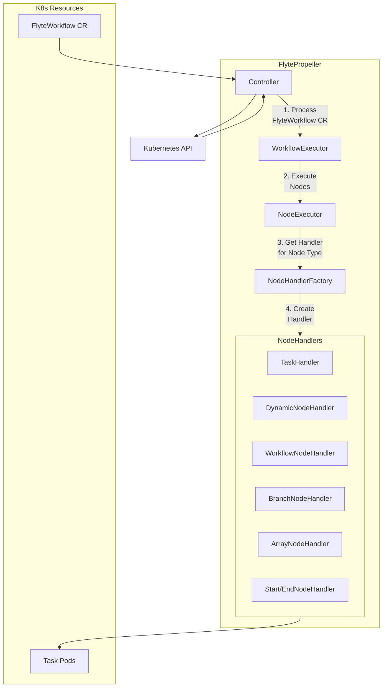
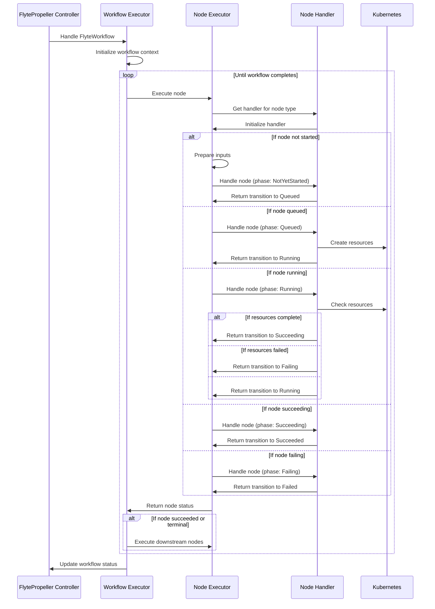
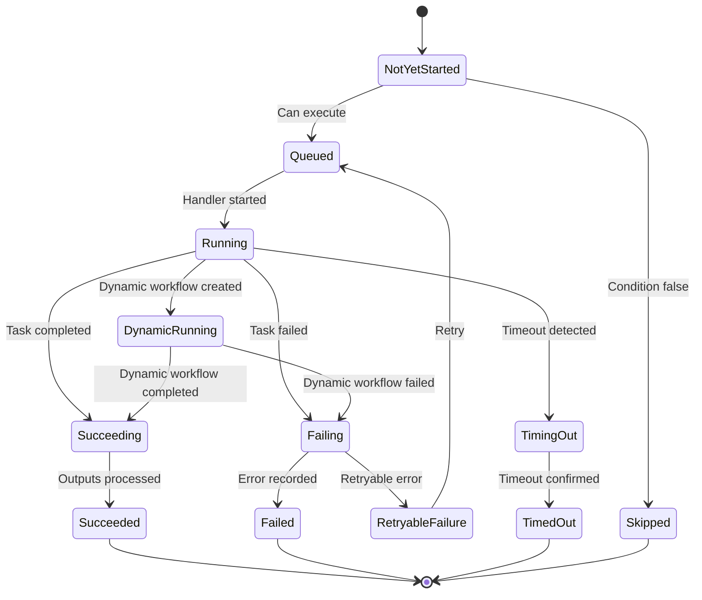
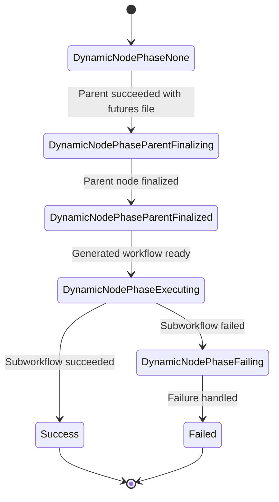
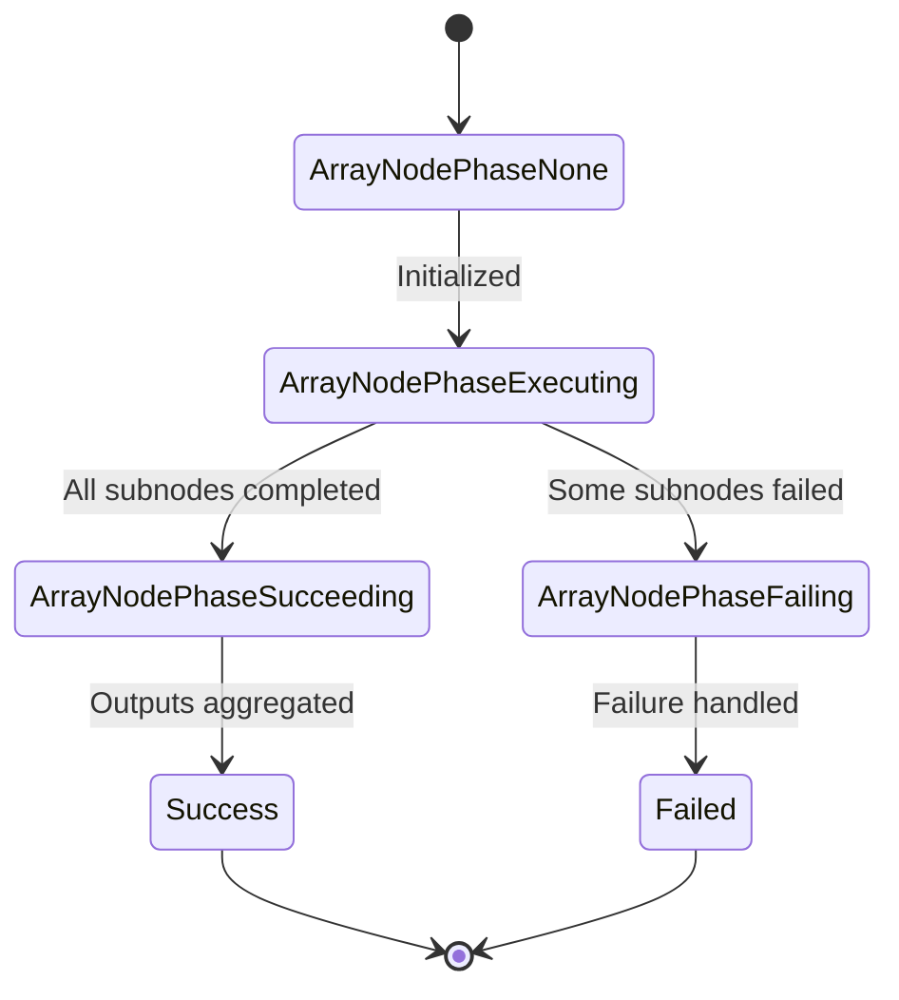

# FlytePropeller Execution

<details>
<summary>Relevant source files</summary>

The following files were used as context for generating this wiki page:

- [flytepropeller/pkg/apis/flyteworkflow/v1alpha1/array.go](flytepropeller/pkg/apis/flyteworkflow/v1alpha1/array.go)
- [flytepropeller/pkg/apis/flyteworkflow/v1alpha1/iface.go](flytepropeller/pkg/apis/flyteworkflow/v1alpha1/iface.go)
- [flytepropeller/pkg/apis/flyteworkflow/v1alpha1/mocks/ExecutableArrayNode.go](flytepropeller/pkg/apis/flyteworkflow/v1alpha1/mocks/ExecutableArrayNode.go)
- [flytepropeller/pkg/apis/flyteworkflow/v1alpha1/mocks/ExecutableTaskNodeStatus.go](flytepropeller/pkg/apis/flyteworkflow/v1alpha1/mocks/ExecutableTaskNodeStatus.go)
- [flytepropeller/pkg/apis/flyteworkflow/v1alpha1/mocks/MutableTaskNodeStatus.go](flytepropeller/pkg/apis/flyteworkflow/v1alpha1/mocks/MutableTaskNodeStatus.go)
- [flytepropeller/pkg/apis/flyteworkflow/v1alpha1/node_status.go](flytepropeller/pkg/apis/flyteworkflow/v1alpha1/node_status.go)
- [flytepropeller/pkg/apis/flyteworkflow/v1alpha1/node_status_test.go](flytepropeller/pkg/apis/flyteworkflow/v1alpha1/node_status_test.go)
- [flytepropeller/pkg/compiler/transformers/k8s/node.go](flytepropeller/pkg/compiler/transformers/k8s/node.go)
- [flytepropeller/pkg/compiler/transformers/k8s/node_test.go](flytepropeller/pkg/compiler/transformers/k8s/node_test.go)
- [flytepropeller/pkg/controller/config/config.go](flytepropeller/pkg/controller/config/config.go)
- [flytepropeller/pkg/controller/config/config_flags.go](flytepropeller/pkg/controller/config/config_flags.go)
- [flytepropeller/pkg/controller/config/config_flags_test.go](flytepropeller/pkg/controller/config/config_flags_test.go)
- [flytepropeller/pkg/controller/controller.go](flytepropeller/pkg/controller/controller.go)
- [flytepropeller/pkg/controller/nodes/array/handler.go](flytepropeller/pkg/controller/nodes/array/handler.go)
- [flytepropeller/pkg/controller/nodes/array/handler_test.go](flytepropeller/pkg/controller/nodes/array/handler_test.go)
- [flytepropeller/pkg/controller/nodes/array/node_execution_context.go](flytepropeller/pkg/controller/nodes/array/node_execution_context.go)
- [flytepropeller/pkg/controller/nodes/array/node_execution_context_test.go](flytepropeller/pkg/controller/nodes/array/node_execution_context_test.go)
- [flytepropeller/pkg/controller/nodes/dynamic/dynamic_workflow.go](flytepropeller/pkg/controller/nodes/dynamic/dynamic_workflow.go)
- [flytepropeller/pkg/controller/nodes/dynamic/handler.go](flytepropeller/pkg/controller/nodes/dynamic/handler.go)
- [flytepropeller/pkg/controller/nodes/dynamic/handler_test.go](flytepropeller/pkg/controller/nodes/dynamic/handler_test.go)
- [flytepropeller/pkg/controller/nodes/executor.go](flytepropeller/pkg/controller/nodes/executor.go)
- [flytepropeller/pkg/controller/nodes/executor_test.go](flytepropeller/pkg/controller/nodes/executor_test.go)
- [flytepropeller/pkg/controller/nodes/handler/state.go](flytepropeller/pkg/controller/nodes/handler/state.go)
- [flytepropeller/pkg/controller/nodes/handler/transition_info.go](flytepropeller/pkg/controller/nodes/handler/transition_info.go)
- [flytepropeller/pkg/controller/nodes/handler/transition_info_test.go](flytepropeller/pkg/controller/nodes/handler/transition_info_test.go)
- [flytepropeller/pkg/controller/nodes/handler/transition_test.go](flytepropeller/pkg/controller/nodes/handler/transition_test.go)
- [flytepropeller/pkg/controller/nodes/node_state_manager.go](flytepropeller/pkg/controller/nodes/node_state_manager.go)
- [flytepropeller/pkg/controller/nodes/transformers.go](flytepropeller/pkg/controller/nodes/transformers.go)
- [flytepropeller/pkg/controller/workflow/executor_test.go](flytepropeller/pkg/controller/workflow/executor_test.go)

</details>


This document explains how FlytePropeller, Flyte's Kubernetes-based workflow execution engine, processes and executes workflows. It covers the core execution architecture, node execution model, and execution flow. For information about FlytePropeller deployment and configuration, see [Deployment](#2).

## Core Execution Architecture

FlytePropeller is a Kubernetes controller that executes workflows represented as FlyteWorkflow custom resources. It follows a declarative reconciliation pattern, continuously comparing the current state of workflow executions with their desired state and taking actions to converge them.



Sources:
- [flytepropeller/pkg/controller/controller.go:60-97](flytepropeller/pkg/controller/controller.go:60-97)
- [flytepropeller/pkg/controller/controller.go:326-365](flytepropeller/pkg/controller/controller.go:326-365)
- [flytepropeller/pkg/controller/nodes/executor.go:97-107](flytepropeller/pkg/controller/nodes/executor.go:97-107)

## Workflow Execution Flow

When a FlyteWorkflow custom resource is created or updated, FlytePropeller reconciles it by executing nodes in the workflow in dependency order. The execution follows these key steps:



Sources:
- [flytepropeller/pkg/controller/nodes/executor.go:175-262](flytepropeller/pkg/controller/nodes/executor.go:175-262)
- [flytepropeller/pkg/controller/nodes/executor.go:264-341](flytepropeller/pkg/controller/nodes/executor.go:264-341)

## Node Execution Model

The workflow execution model in FlytePropeller is based on a directed acyclic graph (DAG) where nodes represent tasks, subworkflows, or control flow elements. Nodes transition through different phases as they execute.

### Node Types

FlytePropeller supports various node types, each with specialized handling:

| Node Type | Description | Handler |
|-----------|-------------|---------|
| Task      | Executes a Flyte task using the appropriate plugin | TaskHandler |
| Workflow  | Executes a subworkflow or remote workflow | WorkflowNodeHandler |
| Branch    | Evaluates conditions and selects execution path | BranchNodeHandler |
| Dynamic   | Creates and executes a workflow at runtime | DynamicNodeHandler |
| Array     | Executes tasks in parallel across an array of inputs | ArrayNodeHandler |
| Start     | Special node marking the entry point of a workflow | StartHandler |
| End       | Special node marking the completion of a workflow | EndHandler |

Sources:
- [flytepropeller/pkg/apis/flyteworkflow/v1alpha1/iface.go:37-49](flytepropeller/pkg/apis/flyteworkflow/v1alpha1/iface.go:37-49)
- [flytepropeller/pkg/controller/nodes/executor.go:1-17](flytepropeller/pkg/controller/nodes/executor.go:1-17)

### Node Phases

Each node progresses through a series of phases that represent its execution state:



Sources:
- [flytepropeller/pkg/apis/flyteworkflow/v1alpha1/iface.go:51-68](flytepropeller/pkg/apis/flyteworkflow/v1alpha1/iface.go:51-68)
- [flytepropeller/pkg/controller/nodes/handler/transition_info.go:13-25](flytepropeller/pkg/controller/nodes/handler/transition_info.go:13-25)

## Node Execution Implementation

The core of FlytePropeller's execution engine is the recursive node executor, which traverses the workflow DAG and executes nodes in order.

### Recursive Node Execution

The recursive node execution algorithm:

1. Starts with the workflow's start node
2. Processes each node based on its current phase
3. When a node completes, traverses to its downstream nodes
4. Continues until all nodes have reached a terminal state

```mermaid
flowchart TD
    start[Start] --> nodeState{Node Phase?}
    
    nodeState -->|"NotYetStarted\nQueued\nRunning"| canExecute{Can Execute?}
    canExecute -->|No| returnPending[Return Pending]
    canExecute -->|Yes| getHandler[Get Node Handler]
    getHandler --> handleNode[Handle Node]
    handleNode --> updateState[Update Node State]
    updateState --> returnStatus[Return Status]
    
    nodeState -->|"Succeeded\nSkipped\nRecovered"| handleDownstream[Process Downstream Nodes]
    handleDownstream --> checkAny{Any Downstream\nRunning?}
    checkAny -->|Yes| returnPending
    checkAny -->|No| returnComplete[Return Complete]
    
    nodeState -->|"Failed\nTimedOut"| handleFailure[Process Downstream Nodes]
    handleFailure --> propagateFailure[Propagate Failure]
    propagateFailure --> returnFailure[Return Failed Status]
    
    returnPending --> end[End]
    returnComplete --> end
    returnStatus --> end
    returnFailure --> end
```

Sources:
- [flytepropeller/pkg/controller/nodes/executor.go:175-262](flytepropeller/pkg/controller/nodes/executor.go:175-262)
- [flytepropeller/pkg/controller/nodes/executor.go:264-341](flytepropeller/pkg/controller/nodes/executor.go:264-341)

### Handling Node Transitions

Node transitions are managed through a handler pattern where specialized handlers process different node types. Each handler implements the `NodeHandler` interface:

```
NodeHandler Interface
├── Handle(ctx, nodeExecutionContext) → Transition, error
├── Finalize(ctx, nodeExecutionContext) → error  
├── Abort(ctx, nodeExecutionContext, reason) → error
└── FinalizeRequired() → bool
```

The key method is `Handle()`, which processes the node based on its current state and returns a transition that indicates the next state.

Sources:
- [flytepropeller/pkg/controller/nodes/handler/transition_info.go](flytepropeller/pkg/controller/nodes/handler/transition_info.go)
- [flytepropeller/pkg/controller/nodes/executor.go:97-107](flytepropeller/pkg/controller/nodes/executor.go:97-107)

## Special Node Types

### Dynamic Node Execution

Dynamic nodes allow workflows to generate subworkflows at runtime. They follow a specialized state machine:



Sources:
- [flytepropeller/pkg/apis/flyteworkflow/v1alpha1/node_status.go:81-95](flytepropeller/pkg/apis/flyteworkflow/v1alpha1/node_status.go:81-95)
- [flytepropeller/pkg/controller/nodes/dynamic/handler.go:175-233](flytepropeller/pkg/controller/nodes/dynamic/handler.go:175-233)

### Array Node Execution

Array nodes handle parallel execution of tasks across a collection of inputs. The execution process involves:

1. Validating array input lengths
2. Initializing array state
3. Creating and executing subnodes in parallel based on parallelism constraints
4. Collecting and aggregating results

The array node state machine includes these phases:



Sources:
- [flytepropeller/pkg/apis/flyteworkflow/v1alpha1/node_status.go:222-230](flytepropeller/pkg/apis/flyteworkflow/v1alpha1/node_status.go:222-230)
- [flytepropeller/pkg/controller/nodes/array/handler.go:190-460](flytepropeller/pkg/controller/nodes/array/handler.go:190-460)

## Error Handling and Recovery

FlytePropeller implements robust error handling and recovery mechanisms:

### Retry Behavior

Nodes can be configured with retry strategies specifying:
- Maximum number of attempts
- Backoff behavior
- Whether to retry on system failures

```mermaid
flowchart TD
    start[Node Failed] --> retryable{Is Error\nRetryable?}
    retryable -->|No| failed[Mark as Failed]
    retryable -->|Yes| attempts{Max Attempts\nReached?}
    attempts -->|Yes| failed
    attempts -->|No| sysFailure{Is System\nFailure?}
    sysFailure -->|Yes| sysAttempts{Max System\nFailures Reached?}
    sysFailure -->|No| retryNode[Increment Attempts\nRetry Node]
    sysAttempts -->|Yes| failed
    sysAttempts -->|No| retryNode
    
    failed --> end[End]
    retryNode --> end
```

Sources:
- [flytepropeller/pkg/controller/config/config.go:278-285](flytepropeller/pkg/controller/config/config.go:278-285)
- [flytepropeller/pkg/controller/nodes/executor.go:483-504](flytepropeller/pkg/controller/nodes/executor.go:483-504)

### Recovery Mechanisms

FlytePropeller supports recovery from execution failures by:

1. Attempting to recover node executions from previous runs
2. Reusing cached outputs when available
3. Handling node state transitions during recovery

When a node is being recovered, FlytePropeller:
- Checks if a previous execution exists
- Retrieves inputs and outputs from the previous execution
- Restores the node to the appropriate state

Sources:
- [flytepropeller/pkg/controller/nodes/executor.go:551-726](flytepropeller/pkg/controller/nodes/executor.go:551-726)

## Workflow Termination

When a workflow completes (either successfully or with failure), FlytePropeller:

1. Finalizes all nodes that require finalization
2. Updates the workflow status to the terminal state
3. Records workflow completion events
4. Releases all resources

For graceful termination, a finalization process is invoked for any nodes that need cleanup:

```mermaid
flowchart TD
    start[Start Termination] --> phase{Workflow Phase}
    
    phase -->|"Succeeded\nFailed\nAborted"| finalizeNeeded{Any Nodes Need\nFinalization?}
    finalizeNeeded -->|Yes| finalizeNodes[Finalize Nodes]
    finalizeNeeded -->|No| releaseResources[Release Resources]
    finalizeNodes --> releaseResources
    
    releaseResources --> recordEvents[Record Terminal Events]
    recordEvents --> end[End]
```

Sources:
- [flytepropeller/pkg/controller/nodes/executor.go:343-400](flytepropeller/pkg/controller/nodes/executor.go:343-400)
- [flytepropeller/pkg/controller/workflow/executor_test.go:1187-1297](flytepropeller/pkg/controller/workflow/executor_test.go:1187-1297)

## Configuration

FlytePropeller's execution behavior can be customized through configuration options:

| Configuration | Description | Default |
|---------------|-------------|---------|
| `MaxNodeRetriesOnSystemFailures` | Maximum retries for system failures | 3 |
| `InterruptibleFailureThreshold` | Threshold for interruptible failures | -1 |
| `DefaultMaxAttempts` | Default max attempts for a node | 1 |
| `MaxParallelism` | Maximum parallelism for tasks and launch plans | 0 (unlimited) |
| `MaxStreakLength` | Maximum consecutive rounds for one workflow | 8 |
| `EventVersion` | Controls event format version | 0 |

Sources:
- [flytepropeller/pkg/controller/config/config.go:55-138](flytepropeller/pkg/controller/config/config.go:55-138)
- [flytepropeller/pkg/controller/nodes/executor.go:143-173](flytepropeller/pkg/controller/nodes/executor.go:143-173)