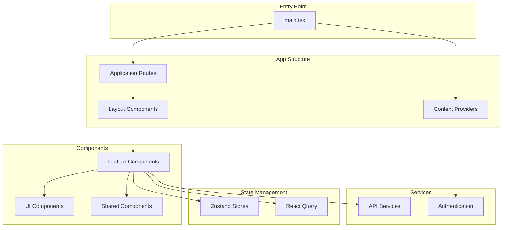
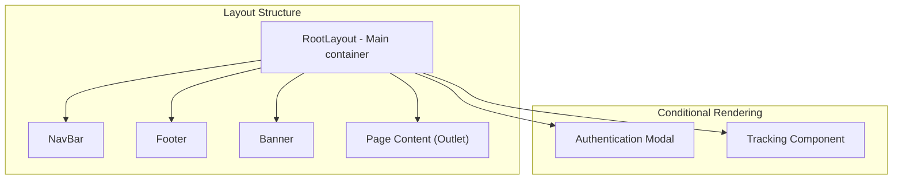
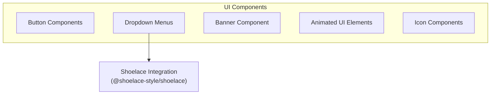
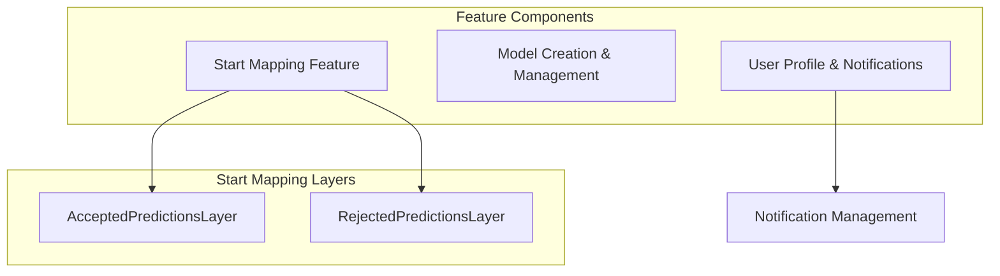
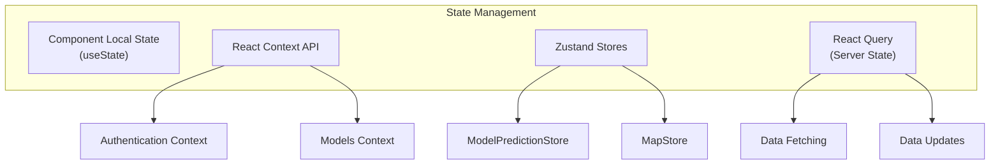
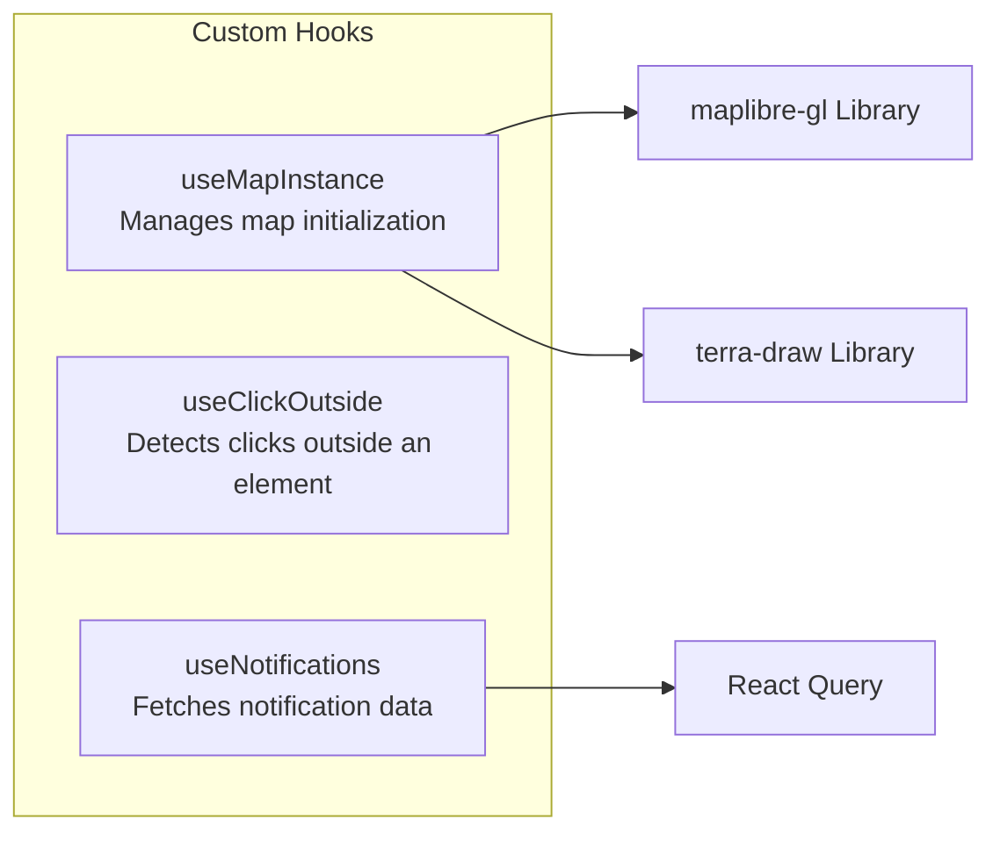
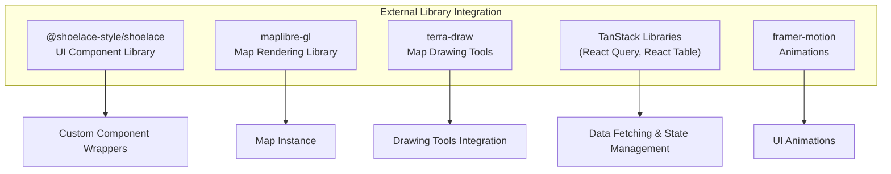
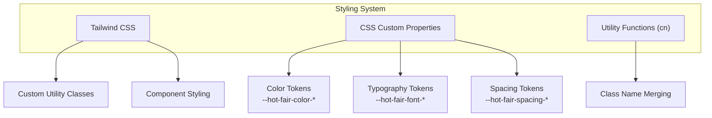

# Component Structure

Relevant source files

The following files were used as context for generating this wiki page:

- [frontend/.gitignore](frontend/.gitignore)
- [frontend/README.md](frontend/README.md)
- [frontend/eslint.config.js](frontend/eslint.config.js)
- [frontend/index.html](frontend/index.html)
- [frontend/package.json](frontend/package.json)
- [frontend/pnpm-lock.yaml](frontend/pnpm-lock.yaml)
- [frontend/src/components/layouts/root-layout.tsx](frontend/src/components/layouts/root-layout.tsx)
- [frontend/src/components/ui/animated-beam/animated-beam.tsx](frontend/src/components/ui/animated-beam/animated-beam.tsx)
- [frontend/src/components/ui/banner/banner.tsx](frontend/src/components/ui/banner/banner.tsx)
- [frontend/src/components/ui/dropdown/dropdown.tsx](frontend/src/components/ui/dropdown/dropdown.tsx)
- [frontend/src/features/start-mapping/components/map/layers/accepted-prediction-layer.tsx](frontend/src/features/start-mapping/components/map/layers/accepted-prediction-layer.tsx)
- [frontend/src/features/start-mapping/components/map/layers/rejected-prediction-layer.tsx](frontend/src/features/start-mapping/components/map/layers/rejected-prediction-layer.tsx)
- [frontend/src/features/user-profile/api/notifications.ts](frontend/src/features/user-profile/api/notifications.ts)
- [frontend/src/features/user-profile/hooks/use-notifications.ts](frontend/src/features/user-profile/hooks/use-notifications.ts)
- [frontend/src/hooks/__tests__/use-click-outside.test.ts](frontend/src/hooks/__tests__/use-click-outside.test.ts)
- [frontend/src/hooks/use-click-outside.ts](frontend/src/hooks/use-click-outside.ts)
- [frontend/src/hooks/use-map-instance.ts](frontend/src/hooks/use-map-instance.ts)
- [frontend/src/store/model-prediction-store.ts](frontend/src/store/model-prediction-store.ts)
- [frontend/src/styles/index.css](frontend/src/styles/index.css)
- [frontend/src/utils/regex-utils.ts](frontend/src/utils/regex-utils.ts)

This page documents the frontend component architecture of the fAIr system, explaining how components are organized, their hierarchical relationships, and the patterns used throughout the application. For information about the backend API endpoints that these components interact with, see [API Endpoints](#2.1).

## Overview of Frontend Architecture

The fAIr frontend is built using React 18 with TypeScript, adopting a feature-based organization pattern. The application follows modern React best practices including functional components, hooks, and a combination of context and store-based state management.

Sources: [frontend/src/main.tsx](), [frontend/README.md:55-76](), [frontend/package.json:16-50]()

## Directory Structure

The frontend codebase follows a well-organized directory structure that separates concerns and promotes reusability. The primary source code is located in the `src` directory with the following organization:

```mermaid
graph TD
    src["src/"]
    app["app/ - Routes & Providers"]
    assets["assets/ - Static assets"]
    components["components/ - Reusable components"]
    config["config/ - Environment variables"]
    constants["constants/ - UI constants"]
    enums["enums/ - TypeScript enums"]
    features["features/ - Feature modules"]
    hooks["hooks/ - Custom hooks"]
    layouts["layouts/ - Core layouts"]
    services["services/ - API clients"]
    styles["styles/ - Global styles"]
    types["types/ - TypeScript types"]
    utils["utils/ - Utility functions"]
    main["main.tsx - Entry point"]
    
    src --> app
    src --> assets
    src --> components
    src --> config
    src --> constants
    src --> enums
    src --> features
    src --> hooks
    src --> layouts
    src --> services
    src --> styles
    src --> types
    src --> utils
    src --> main
```

Sources: [frontend/README.md:55-76]()

## Core Layout Components

The application uses a hierarchical layout system where the `RootLayout` component serves as the main container for the application, handling the rendering of common UI elements across all pages.

The `RootLayout` handles conditional rendering based on the current route:

1. It shows/hides the Banner based on pathname and timeout
2. It conditionally renders the NavBar except on certain pages
3. It applies different padding and background styles based on the route
4. The Footer is hidden on specific routes (mapping, model creation)
5. Authentication modals appear when needed

Sources: [frontend/src/components/layouts/root-layout.tsx:16-114]()

## Component Types

The fAIr frontend employs several types of components, each with distinct responsibilities:

### 1. UI Components

These are the basic building blocks - reusable, presentational components that compose the user interface.

UI components like `Dropdown` integrate with the Shoelace component library while adding custom functionality. The `Dropdown` component, for example, enhances Shoelace's dropdown with features like multi-select, checkbox integration, and custom styling.

Sources: [frontend/src/components/ui/dropdown/dropdown.tsx:40-166](), [frontend/src/components/ui/banner/banner.tsx:19-49](), [frontend/src/components/ui/animated-beam/animated-beam.tsx:27-190]()

### 2. Feature Components

Feature components implement specific application features and are organized in feature modules.

Feature components typically combine UI components with business logic and state management. The mapping feature, for example, includes specialized layers for visualizing model predictions.

Sources: [frontend/src/features/start-mapping/components/map/layers/accepted-prediction-layer.tsx:10-84](), [frontend/src/features/start-mapping/components/map/layers/rejected-prediction-layer.tsx:10-85](), [frontend/src/features/user-profile/hooks/use-notifications.ts:18-87]()

### 3. Layout Components

Layout components define the overall structure of the application and individual pages.

### 4. Shared Components

Shared components are reused across different features but aren't simple UI elements.

## State Management

The application uses a multi-faceted approach to state management:

1. **Zustand Stores**: Used for UI-related global state
   - `ModelPredictionStore`: Manages model predictions for mapping
   - `MapStore`: Manages map state (zoom, view, etc.)

2. **React Context**: Used for authentication and configuration state
   - `AuthProvider`: Manages user authentication state
   - `ModelsProvider`: Provides model-related data and operations

3. **React Query**: Manages server state, including data fetching and caching

Sources: [frontend/src/store/model-prediction-store.ts:4-58](), [frontend/src/hooks/use-map-instance.ts:14-70]()

## Custom Hooks

The application uses custom hooks extensively to encapsulate and reuse logic.

Custom hooks abstract complex logic and provide reusable functionality:

1. **Map-related hooks**: Initialize and manage map instances, layers, etc.
2. **UI hooks**: Handle UI interactions like detecting outside clicks
3. **Data hooks**: Wrap API calls and data management with React Query

Sources: [frontend/src/hooks/use-map-instance.ts:14-70](), [frontend/src/hooks/use-click-outside.ts:9-31](), [frontend/src/features/user-profile/hooks/use-notifications.ts:18-87]()

## Integration with External Libraries

The frontend integrates several key libraries to provide specialized functionality:

Each external library is carefully integrated and often wrapped in custom components or hooks to match the application's specific requirements.

Sources: [frontend/package.json:16-50](), [frontend/src/components/ui/dropdown/dropdown.tsx:4-8]()

## Styling Approach

The application uses a combination of Tailwind CSS and CSS custom properties (variables) for styling.

The styling system uses:

1. **CSS Variables**: Design tokens for colors, typography, spacing, etc.
2. **Tailwind CSS**: For rapid UI development with utility classes
3. **CSS Utilities**: Custom utility classes for common styling patterns
4. **Class Merging**: Utility function for combining class names conditionally

Sources: [frontend/src/styles/index.css:10-70](), [frontend/src/utils/regex-utils.ts:1-10]()

## Component Communication Patterns

The application employs several patterns for component communication:

1. **Props**: Standard React props for parent-child communication
2. **Context API**: For sharing state across component trees
3. **Zustand Stores**: For global state accessible anywhere
4. **Events**: DOM events and custom event handling
5. **React Query**: For server state synchronization

These patterns are used together depending on the specific requirements of each feature and component.

## Routing Structure

The application uses React Router for routing with a nested route structure. The `RootLayout` component serves as the main layout for most routes, with conditional rendering based on the current route.

Routes are defined in constants and organized hierarchically to reflect the application's feature structure.

Sources: [frontend/src/components/layouts/root-layout.tsx:16-114]()

## Conclusion

The fAIr frontend employs a well-structured component architecture that separates concerns, promotes reusability, and follows modern React best practices. The combination of feature-based organization, custom hooks, and thoughtful state management creates a maintainable and scalable codebase.