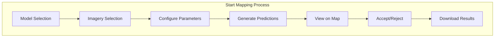
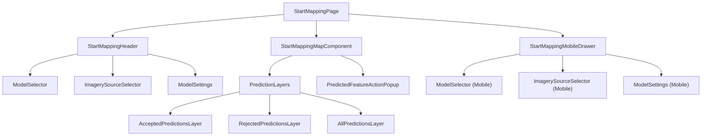
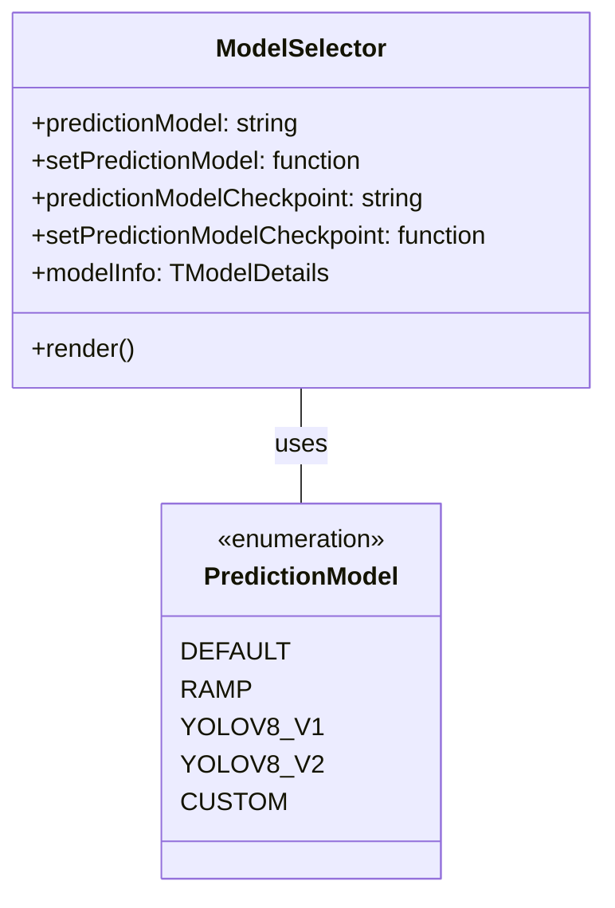
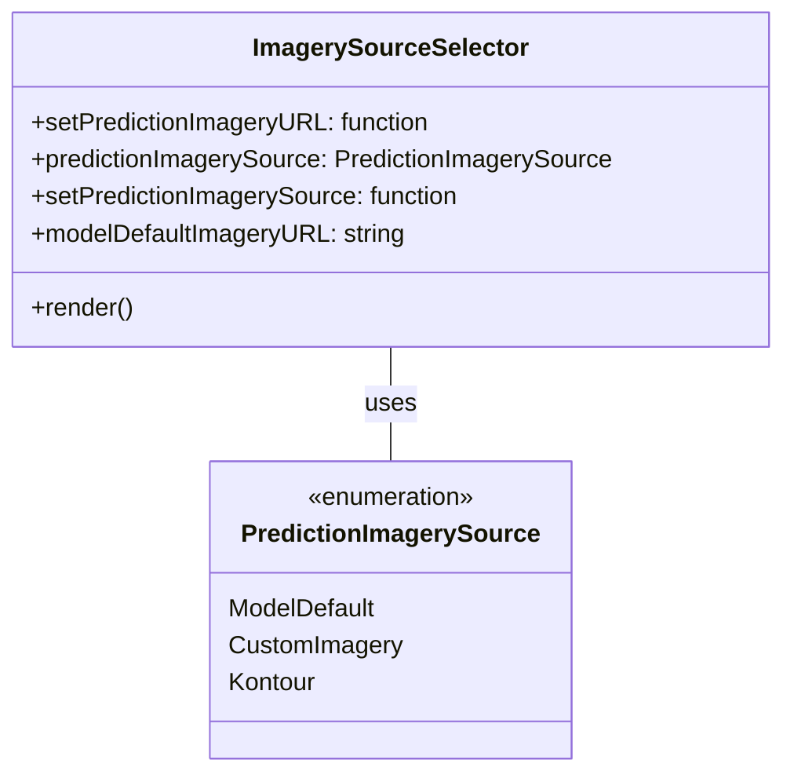
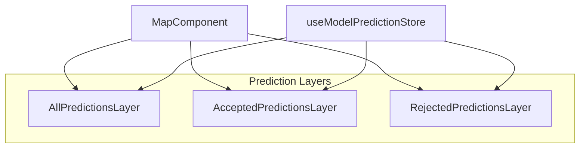
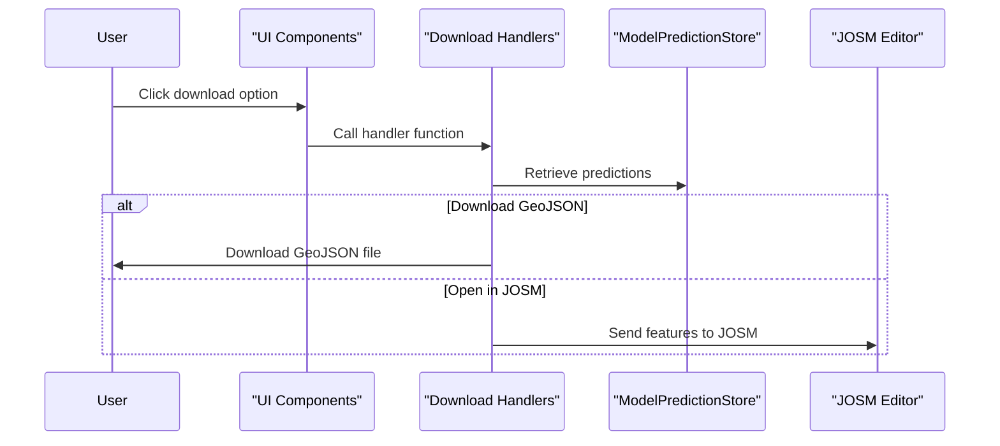
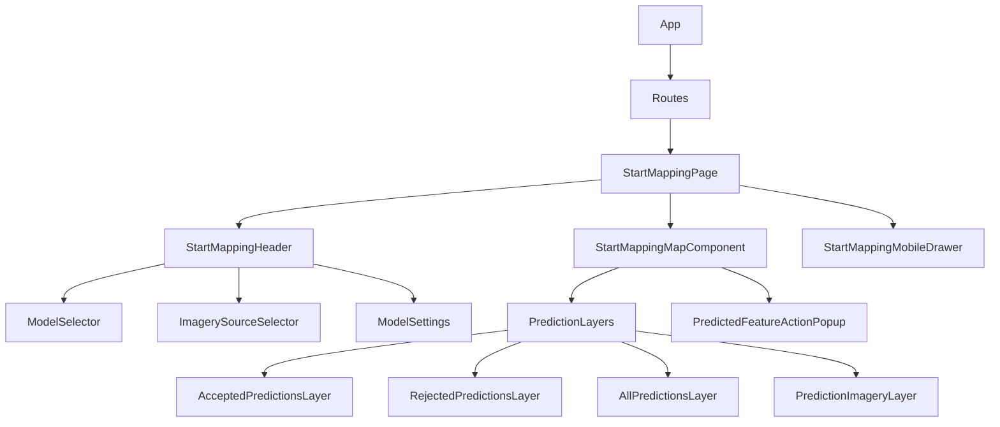
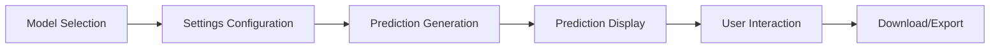

# Start Mapping Feature

Relevant source files

The following files were used as context for generating this wiki page:

- [frontend/src/app/routes/start-mapping.tsx](frontend/src/app/routes/start-mapping.tsx)
- [frontend/src/assets/images/index.ts](frontend/src/assets/images/index.ts)
- [frontend/src/components/map/layers/open-aerial-map.tsx](frontend/src/components/map/layers/open-aerial-map.tsx)
- [frontend/src/components/map/layers/tile-boundaries.tsx](frontend/src/components/map/layers/tile-boundaries.tsx)
- [frontend/src/components/map/setups/setup-terra-draw.ts](frontend/src/components/map/setups/setup-terra-draw.ts)
- [frontend/src/components/ui/form/radio-group/radio-group.css](frontend/src/components/ui/form/radio-group/radio-group.css)
- [frontend/src/components/ui/form/radio-group/radio-group.tsx](frontend/src/components/ui/form/radio-group/radio-group.tsx)
- [frontend/src/enums/start-mapping.ts](frontend/src/enums/start-mapping.ts)
- [frontend/src/features/models/components/model-detail-user.tsx](frontend/src/features/models/components/model-detail-user.tsx)
- [frontend/src/features/start-mapping/components/index.ts](frontend/src/features/start-mapping/components/index.ts)
- [frontend/src/features/start-mapping/components/map/layers/all-prediction-layer.tsx](frontend/src/features/start-mapping/components/map/layers/all-prediction-layer.tsx)
- [frontend/src/features/start-mapping/components/map/map.tsx](frontend/src/features/start-mapping/components/map/map.tsx)
- [frontend/src/features/start-mapping/components/mobile-drawer.tsx](frontend/src/features/start-mapping/components/mobile-drawer.tsx)
- [frontend/src/features/start-mapping/components/model-settings.tsx](frontend/src/features/start-mapping/components/model-settings.tsx)
- [frontend/src/features/start-mapping/components/replicable-models/imagery-source-selector-trigger-button.tsx](frontend/src/features/start-mapping/components/replicable-models/imagery-source-selector-trigger-button.tsx)
- [frontend/src/features/start-mapping/components/replicable-models/imagery-source-selector.tsx](frontend/src/features/start-mapping/components/replicable-models/imagery-source-selector.tsx)
- [frontend/src/features/start-mapping/components/replicable-models/model-selector-trigger-button.tsx](frontend/src/features/start-mapping/components/replicable-models/model-selector-trigger-button.tsx)
- [frontend/src/features/start-mapping/components/replicable-models/model-selector.tsx](frontend/src/features/start-mapping/components/replicable-models/model-selector.tsx)
- [frontend/src/hooks/use-dropdown-menu.ts](frontend/src/hooks/use-dropdown-menu.ts)
- [frontend/src/hooks/use-map-layer.ts](frontend/src/hooks/use-map-layer.ts)
- [frontend/src/types/api.ts](frontend/src/types/api.ts)
- [frontend/src/utils/__tests__/geo/geometry-utils.test.ts](frontend/src/utils/__tests__/geo/geometry-utils.test.ts)
- [frontend/src/utils/general-utils.ts](frontend/src/utils/general-utils.ts)

The Start Mapping feature allows users to view and interact with AI model predictions on a map interface. This feature enables users to select prediction models, choose imagery sources, configure prediction parameters, and manage prediction results by accepting or rejecting them. Users can also download predictions in various formats for use in external applications like JOSM (Java OpenStreetMap Editor).

For information about creating and training models, see [Model Creation and Management](#3.3).

## Overview

The Start Mapping feature is a comprehensive interface for working with trained AI models to predict features on a map. It provides tools for:

1. Selecting models and checkpoints for prediction
2. Choosing imagery sources
3. Configuring prediction parameters (confidence level, tolerance, area)
4. Viewing predictions on the map
5. Accepting or rejecting predictions
6. Downloading predictions in various formats

Sources: [frontend/src/app/routes/start-mapping.tsx:64-517]()

## User Interface Components

The Start Mapping page is composed of several key components that work together to provide the mapping experience:

Sources: [frontend/src/app/routes/start-mapping.tsx:368-516](), [frontend/src/features/start-mapping/components/index.ts:1-9]()

### Main Page Layout

The Start Mapping page is structured with:

- A header section (on desktop) containing model information and control options
- A map component that displays the imagery and prediction layers
- A mobile drawer that provides controls on smaller screens

The layout adapts based on screen size, with different UI components shown for desktop and mobile views.

Sources: [frontend/src/app/routes/start-mapping.tsx:368-516]()

### Desktop Header

The desktop header includes:
- Model name and information
- Model selector
- Imagery source selector
- Settings configuration
- Download options

Sources: [frontend/src/app/routes/start-mapping.tsx:442-470]()

### Map Component

The map component is the central element of the interface, displaying:
- Background imagery from the selected source
- Prediction layers (accepted, rejected, and all predictions)
- Interactive controls for navigating the map
- Popups for interacting with individual predictions

Sources: [frontend/src/features/start-mapping/components/map/map.tsx:29-175]()

### Mobile Interface

On mobile devices, a drawer interface provides access to the same controls as the desktop header. The drawer can be expanded and collapsed, and includes:
- Model selection
- Imagery source selection
- Prediction settings
- Download options

Sources: [frontend/src/features/start-mapping/components/mobile-drawer.tsx:22-201]()

## Model Selection and Configuration

### Model Selection

The Start Mapping page allows users to select from different models for prediction:

1. **Default Model**: The model associated with the current page
2. **RAMP**: Rapid Assessment Multi-Purpose framework model
3. **YOLO v8 v1**: You Only Look Once version 8 (first variant)
4. **YOLO v8 v2**: You Only Look Once version 8 (second variant)
5. **Custom Model**: User-provided model checkpoint

Model selection is handled by the `ModelSelector` component, which provides a radio button interface for selecting models.

Sources: [frontend/src/features/start-mapping/components/replicable-models/model-selector.tsx:16-191](), [frontend/src/enums/start-mapping.ts:10-14]()

### Imagery Source Selection

Users can select from different imagery sources for the background map:

1. **Model Default**: The imagery associated with the model's training dataset
2. **Custom Imagery**: User-provided XYZ/TMS tile server URL
3. **OpenAerialMap Mosaic**: All OpenAerialMap images in one mosaic layer

Imagery selection is handled by the `ImagerySourceSelector` component.

Sources: [frontend/src/features/start-mapping/components/replicable-models/imagery-source-selector.tsx:36-151](), [frontend/src/enums/start-mapping.ts:3-8]()

### Prediction Settings

Users can configure various settings for predictions:

1. **Use JOSM Q**: A setting for JOSM integration
2. **Confidence Level**: Threshold for confidence in predictions (25%, 50%, 75%, 90%)
3. **Tolerance**: Tolerance for prediction matching
4. **Area**: Area threshold for predictions

Settings are managed by the `ModelSettings` component.

| Setting | Description | Default Value | Range |
|---------|-------------|---------------|-------|
| Use JOSM Q | Enable JOSM Q for editing | true | boolean |
| Confidence Level | Threshold for prediction confidence | 50% | 25%, 50%, 75%, 90% |
| Tolerance | Tolerance for prediction matching | 0.3 | 0-Max |
| Area | Area threshold for predictions | 3 | 0-Max |

Sources: [frontend/src/features/start-mapping/components/model-settings.tsx:41-197](), [frontend/src/app/routes/start-mapping.tsx:172-182]()

## Prediction Interaction

### Viewing Predictions

Predictions are displayed on the map in three categories:

1. **All Predictions**: All predictions generated by the model
2. **Accepted Predictions**: Predictions that have been accepted by the user
3. **Rejected Predictions**: Predictions that have been rejected by the user

Each category has its own layer on the map with distinct styling to differentiate between them.

Sources: [frontend/src/features/start-mapping/components/map/map.tsx:159-175](), [frontend/src/features/start-mapping/components/map/layers/all-prediction-layer.tsx:15-87]()

### Accepting and Rejecting Predictions

Users can interact with predictions on the map to accept or reject them. This is handled by the `PredictedFeatureActionPopup` component, which displays when users click on a prediction.

The accepted and rejected predictions are stored in the `useModelPredictionStore` and displayed in separate layers on the map.

Sources: [frontend/src/app/routes/start-mapping.tsx:70]()

### Downloading Predictions

Users can download predictions in various formats:

1. **Download All Features**: Download all predictions as GeoJSON
2. **Download Accepted Features**: Download only accepted predictions as GeoJSON
3. **Open All Features in JOSM**: Open all predictions in JOSM for editing
4. **Open Accepted Features in JOSM**: Open only accepted predictions in JOSM for editing

Download options are available in the header for desktop and in the mobile drawer for mobile devices.

Sources: [frontend/src/app/routes/start-mapping.tsx:256-340]()

## Technical Implementation

### Component Hierarchy

The Start Mapping feature follows a hierarchical component structure:

Sources: [frontend/src/app/routes/start-mapping.tsx:64-517](), [frontend/src/features/start-mapping/components/index.ts:1-9]()

### State Management

The Start Mapping page uses various state management approaches:

1. **Component State**: For UI-specific state (e.g., dropdown visibility)
2. **URL Query Parameters**: For preserving settings between sessions
3. **Store State**: For managing model predictions

Key state elements include:

- `predictionImageryURL`: The URL of the imagery source
- `predictionImagerySource`: The type of imagery source (Model Default, Custom, etc.)
- `predictionModel`: The selected model for prediction
- `predictionModelCheckpoint`: The path to the model checkpoint
- `query`: Settings for prediction (confidence level, tolerance, area)
- `modelPredictions`: Predictions from the model (all, accepted, rejected)

Sources: [frontend/src/app/routes/start-mapping.tsx:70-120](), [frontend/src/app/routes/start-mapping.tsx:172-182]()

### Map Integration

The map is powered by MapLibre GL, with several custom layers for displaying predictions:

1. **Base Map**: The background imagery layer
2. **Tile Boundaries**: Visual indicators of map tile boundaries
3. **Prediction Layers**: Layers for displaying predictions
4. **Interactive Elements**: Popups and controls for interacting with the map

Map layers are dynamically added and updated using the `useDynamicMapLayer` hook, which manages the lifecycle of map layers.

Sources: [frontend/src/features/start-mapping/components/map/map.tsx:29-175](), [frontend/src/hooks/use-map-layer.ts:42-92](), [frontend/src/components/map/layers/open-aerial-map.tsx:1-36]()

### Model Prediction Process

The process of generating and displaying predictions follows these steps:

1. User selects a model and imagery source
2. User configures prediction settings
3. System generates predictions using the selected model and settings
4. Predictions are displayed on the map
5. User interacts with predictions (accept/reject)
6. User can download the results

Sources: [frontend/src/app/routes/start-mapping.tsx:64-517]()

## Conclusion

The Start Mapping feature provides a comprehensive interface for working with AI model predictions in a mapping context. It combines model selection, imagery configuration, and interactive mapping tools to offer a powerful environment for generating and managing predictions. The feature is designed with both desktop and mobile users in mind, with responsive UI components that adapt to different screen sizes.