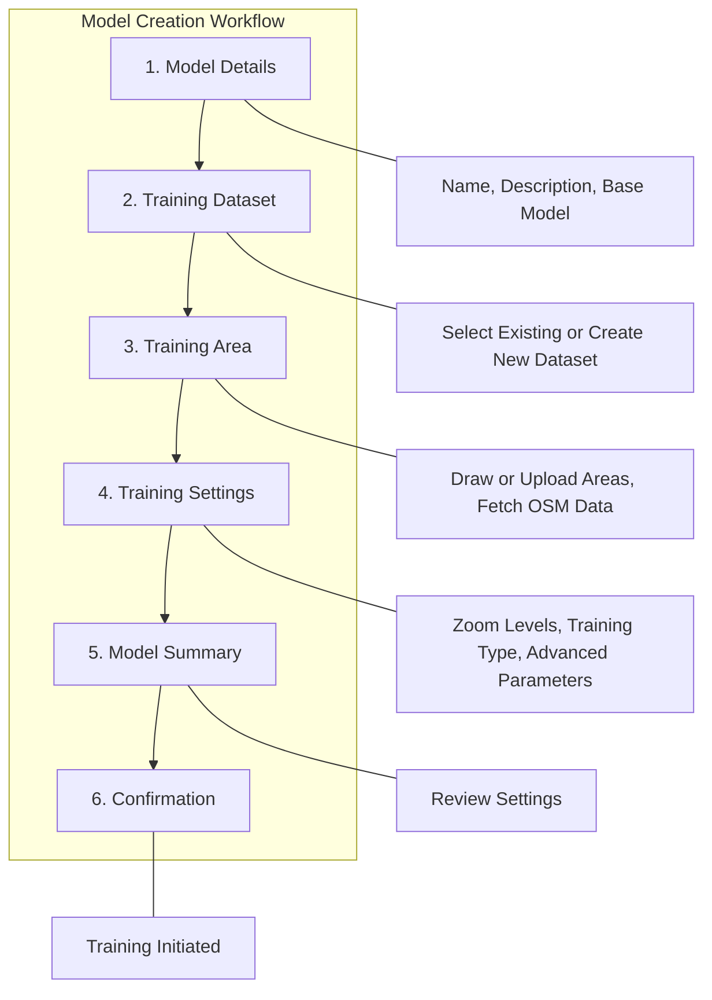
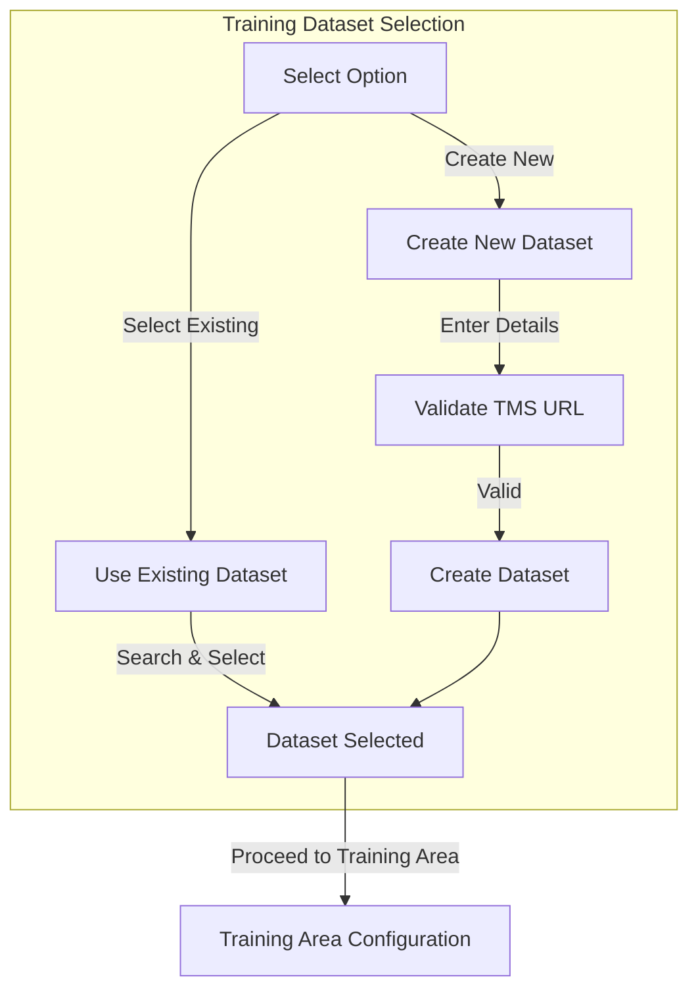
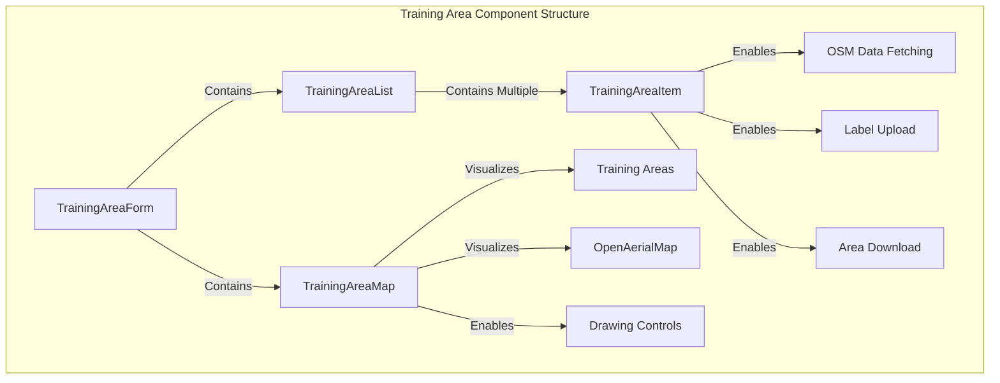
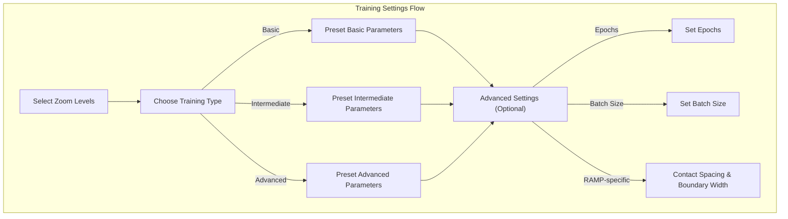
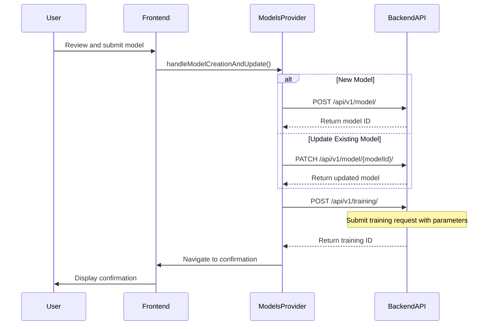
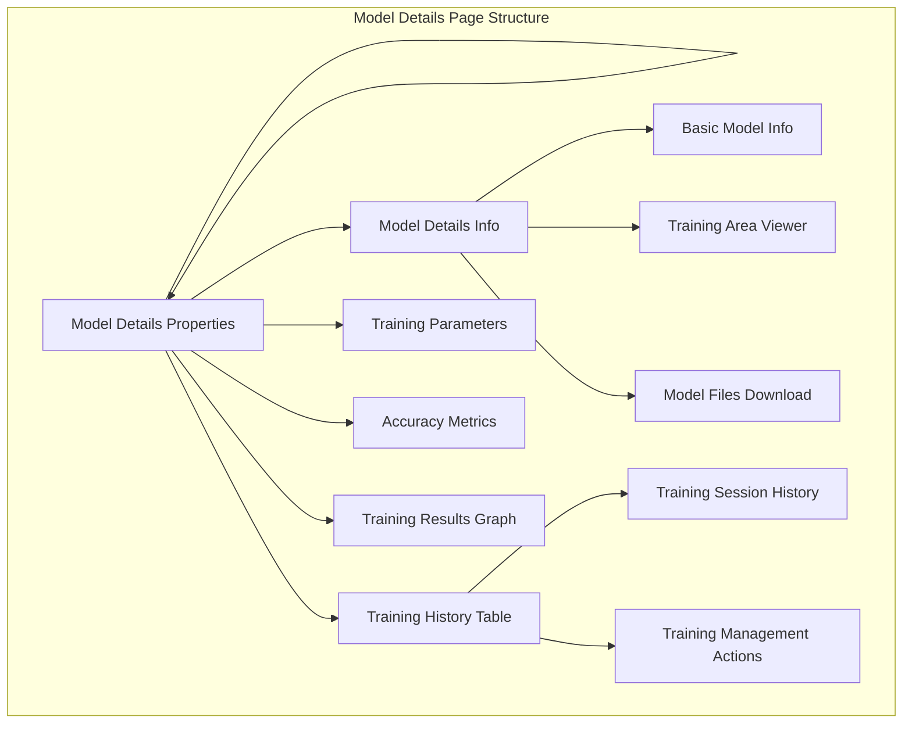
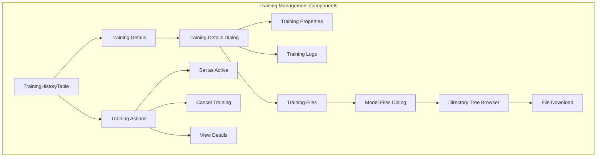
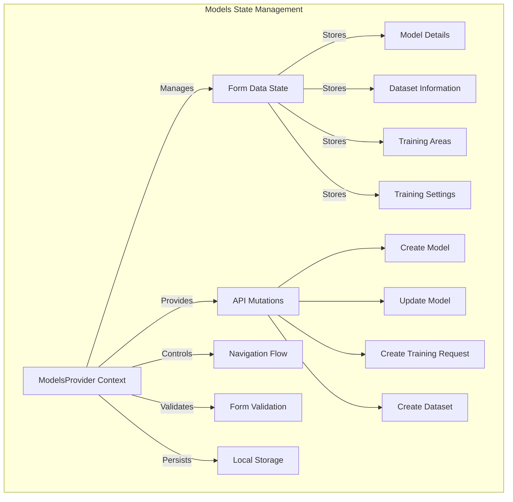

# Model Creation and Management

Relevant source files

The following files were used as context for generating this wiki page:

- [frontend/src/app/index.tsx](frontend/src/app/index.tsx)
- [frontend/src/app/providers/models-provider.tsx](frontend/src/app/providers/models-provider.tsx)
- [frontend/src/app/routes/models/model-details-card.tsx](frontend/src/app/routes/models/model-details-card.tsx)
- [frontend/src/app/routes/models/models-list.tsx](frontend/src/app/routes/models/models-list.tsx)
- [frontend/src/components/layouts/model-forms-layout.tsx](frontend/src/components/layouts/model-forms-layout.tsx)
- [frontend/src/components/map/controls/zoom-control.tsx](frontend/src/components/map/controls/zoom-control.tsx)
- [frontend/src/components/map/map.tsx](frontend/src/components/map/map.tsx)
- [frontend/src/components/ui/button/button.css](frontend/src/components/ui/button/button.css)
- [frontend/src/components/ui/button/button.tsx](frontend/src/components/ui/button/button.tsx)
- [frontend/src/components/ui/button/icon-button.tsx](frontend/src/components/ui/button/icon-button.tsx)
- [frontend/src/components/ui/form/input/input.tsx](frontend/src/components/ui/form/input/input.tsx)
- [frontend/src/enums/common.ts](frontend/src/enums/common.ts)
- [frontend/src/features/model-creation/components/dialogs/file-upload-dialog.tsx](frontend/src/features/model-creation/components/dialogs/file-upload-dialog.tsx)
- [frontend/src/features/model-creation/components/model-summary.tsx](frontend/src/features/model-creation/components/model-summary.tsx)
- [frontend/src/features/model-creation/components/progress-buttons.tsx](frontend/src/features/model-creation/components/progress-buttons.tsx)
- [frontend/src/features/model-creation/components/training-area/open-area-map.tsx](frontend/src/features/model-creation/components/training-area/open-area-map.tsx)
- [frontend/src/features/model-creation/components/training-area/training-area-item.tsx](frontend/src/features/model-creation/components/training-area/training-area-item.tsx)
- [frontend/src/features/model-creation/components/training-area/training-area-list.tsx](frontend/src/features/model-creation/components/training-area/training-area-list.tsx)
- [frontend/src/features/model-creation/components/training-area/training-area-map.tsx](frontend/src/features/model-creation/components/training-area/training-area-map.tsx)
- [frontend/src/features/model-creation/components/training-area/training-area.tsx](frontend/src/features/model-creation/components/training-area/training-area.tsx)
- [frontend/src/features/model-creation/components/training-dataset/training-dataset.tsx](frontend/src/features/model-creation/components/training-dataset/training-dataset.tsx)
- [frontend/src/features/model-creation/components/training-settings/training-settings-form.tsx](frontend/src/features/model-creation/components/training-settings/training-settings-form.tsx)
- [frontend/src/features/model-creation/hooks/use-tms-tilejson.ts](frontend/src/features/model-creation/hooks/use-tms-tilejson.ts)
- [frontend/src/features/models/api/factory.ts](frontend/src/features/models/api/factory.ts)
- [frontend/src/features/models/api/get-trainings.ts](frontend/src/features/models/api/get-trainings.ts)
- [frontend/src/features/models/api/update-trainings.ts](frontend/src/features/models/api/update-trainings.ts)
- [frontend/src/features/models/components/dialogs/model-files-dialog.tsx](frontend/src/features/models/components/dialogs/model-files-dialog.tsx)
- [frontend/src/features/models/components/dialogs/training-details-dialog.tsx](frontend/src/features/models/components/dialogs/training-details-dialog.tsx)
- [frontend/src/features/models/components/directory-tree.tsx](frontend/src/features/models/components/directory-tree.tsx)
- [frontend/src/features/models/components/header.tsx](frontend/src/features/models/components/header.tsx)
- [frontend/src/features/models/components/maps/models-map.tsx](frontend/src/features/models/components/maps/models-map.tsx)
- [frontend/src/features/models/components/maps/training-area-map.tsx](frontend/src/features/models/components/maps/training-area-map.tsx)
- [frontend/src/features/models/components/model-details-info.tsx](frontend/src/features/models/components/model-details-info.tsx)
- [frontend/src/features/models/components/model-details-properties.tsx](frontend/src/features/models/components/model-details-properties.tsx)
- [frontend/src/features/models/components/model-files-button.tsx](frontend/src/features/models/components/model-files-button.tsx)
- [frontend/src/features/models/components/training-history-table.tsx](frontend/src/features/models/components/training-history-table.tsx)
- [frontend/src/features/models/hooks/use-models.ts](frontend/src/features/models/hooks/use-models.ts)
- [frontend/src/features/models/hooks/use-training.ts](frontend/src/features/models/hooks/use-training.ts)
- [frontend/src/features/models/layouts/grid.tsx](frontend/src/features/models/layouts/grid.tsx)
- [frontend/src/features/models/layouts/table.tsx](frontend/src/features/models/layouts/table.tsx)
- [frontend/src/hooks/use-storage.ts](frontend/src/hooks/use-storage.ts)
- [frontend/src/services/api-routes.ts](frontend/src/services/api-routes.ts)
- [frontend/src/types/common.ts](frontend/src/types/common.ts)
- [frontend/src/utils/string-utils.ts](frontend/src/utils/string-utils.ts)

This document explains the model creation, training, and management features within the fAIr system. It covers the complete lifecycle of AI models, from initial creation through training configuration to deployment and management of existing models. For information about using trained models for mapping, see [Start Mapping Feature](#3.2).

## Overview

The Model Creation and Management functionality enables users to create custom AI models for detecting features in aerial imagery. The system provides a guided, step-by-step wizard that walks users through the entire model creation process. Once created, models can be trained with different parameters, monitored, and managed through a detailed interface.

### Key Concepts

- **Models**: AI models that can detect features in imagery
- **Training Datasets**: Collections of aerial imagery used to train models 
- **Training Areas**: Specific regions within a dataset where features have been labeled
- **Training Settings**: Configuration parameters that control how a model is trained

Sources: [frontend/src/app/providers/models-provider.tsx:1-582]()

## Model Creation Workflow

The model creation process follows a structured workflow with distinct steps, managed through a wizard-like interface. This helps users systematically provide all necessary information to create and train an effective model.

Each step must be completed before proceeding to the next, with validation to ensure all required information is properly provided.

Sources: 
- [frontend/src/components/layouts/model-forms-layout.tsx:1-182]()
- [frontend/src/features/model-creation/components/progress-buttons.tsx:1-150]()

## Model Details

The first step in model creation is defining basic model information:

1. **Model Name**: A descriptive name for the model (10-40 characters)
2. **Model Description**: Extended description of the model's purpose and features (10-500 characters)
3. **Base Model**: Selection of the underlying model architecture:
   - **RAMP**: Raster And Machine learning Pipeline
   - **YOLOV8_V1**: You Only Look Once version 8 (v1)
   - **YOLOV8_V2**: You Only Look Once version 8 (v2)

The choice of base model affects available training parameters in later steps.

Sources: 
- [frontend/src/app/providers/models-provider.tsx:52-146]()
- [frontend/src/enums/common.ts:1-83]()

## Training Dataset Management

Users can either select an existing training dataset or create a new one:

### Creating a New Training Dataset
1. Enter a dataset name (10-40 characters)
2. Provide a TMS (Tile Map Service) URL, which is validated for proper format
3. System extracts TileJSON information from the URL to determine bounds, zoom levels, etc.

### Selecting an Existing Dataset
Browse available datasets with search and filtering capabilities

The dataset provides the aerial imagery that will be used for model training.

Sources:
- [frontend/src/features/model-creation/components/training-dataset/training-dataset.tsx:1-60]()
- [frontend/src/app/providers/models-provider.tsx:408-428]()

## Training Area Configuration

Training areas define the regions within the aerial imagery that contain features for training. This step involves:

1. **Viewing Dataset**: Display the aerial imagery from the selected dataset
2. **Creating Training Areas**: 
   - Draw rectangular areas directly on the map
   - Upload GeoJSON files containing training area polygons
3. **Fetching Labels**: For each training area, fetch OpenStreetMap data as labels
4. **Managing Training Areas**: Delete, download, or modify training areas as needed

The system validates that training areas are appropriately sized and contain valid geometries.

The system enforces minimum and maximum size constraints for training areas to ensure effective model training:
- Minimum area: Defined in `MIN_TRAINING_AREA_SIZE`
- Maximum area: Defined in `MAX_TRAINING_AREA_SIZE`

When drawing training areas, users receive immediate feedback if the area is too small or too large.

Sources:
- [frontend/src/features/model-creation/components/training-area/training-area.tsx:1-245]()
- [frontend/src/features/model-creation/components/training-area/training-area-map.tsx:1-298]()
- [frontend/src/features/model-creation/components/training-area/training-area-item.tsx:1-534]()
- [frontend/src/features/model-creation/components/training-area/training-area-list.tsx:1-117]()
- [frontend/src/features/model-creation/components/dialogs/file-upload-dialog.tsx:1-346]()

## Training Settings Configuration

After defining training areas, users configure the training process with various parameters:

1. **Zoom Levels**: Select which zoom levels (19, 20, 21) to use in training
2. **Training Type**: Choose a complexity level with preset parameter configurations:
   - **Basic**: Minimal parameters, fastest training
   - **Intermediate**: Balanced parameters
   - **Advanced**: Comprehensive parameters, longer training but potentially higher accuracy

3. **Advanced Settings** (optional):
   - **Epochs**: Number of training cycles (varies by base model)
   - **Batch Size**: Number of samples processed before updating model weights
   - **Contact Spacing**: Parameter for RAMP model only
   - **Boundary Width**: Parameter for RAMP model only

Each parameter has model-specific validation constraints to ensure optimal training.

Each training type has different default parameter values based on the selected base model, optimized for different use cases.

Sources:
- [frontend/src/features/model-creation/components/training-settings/training-settings-form.tsx:1-265]()
- [frontend/src/app/providers/models-provider.tsx:60-146]()

## Model Summary and Submission

Before final submission, users review all configuration settings:

1. Model details (name, description, base model)
2. Dataset information
3. Training area summary
4. Training settings

Upon submission:
1. A model creation request is sent to the API
2. A training request is submitted with the specified parameters
3. The user is redirected to a confirmation page

Sources:
- [frontend/src/features/model-creation/components/model-summary.tsx:1-109]()
- [frontend/src/app/providers/models-provider.tsx:427-528]()

## Model Management Interface

Once models are created, they can be managed through a dedicated interface that provides:

1. **Model Listing**: Browse, search, and filter models
2. **Model Details**: View comprehensive information about each model
3. **Training History**: Monitor past and current training sessions
4. **Model Properties**: View technical parameters and performance metrics

### Model Listing

The model listing interface provides a comprehensive view of all available models with flexible viewing options:

- **Grid View**: Card-based display with thumbnails and key information
- **List View**: Tabular display with sortable columns
- **Map View**: Geographical display showing models by location

Filtering options include:
- Search by name or description
- Filter by date range
- Sort by various attributes (creation date, accuracy, etc.)

Sources:
- [frontend/src/app/routes/models/models-list.tsx:1-258]()
- [frontend/src/features/models/layouts/grid.tsx:1-52]()
- [frontend/src/features/models/layouts/table.tsx:1-80]()
- [frontend/src/features/models/components/maps/models-map.tsx:1-161]()

### Model Details Page

The model details page provides comprehensive information about a specific model:

1. **Basic Information**:
   - Model name and description
   - Creator and creation date
   - Base model information
   - Dataset details

2. **Properties**:
   - Training parameters (epochs, batch size, etc.)
   - Accuracy and performance metrics
   - Zoom levels
   - Source imagery information

3. **Training History**:
   - List of all training sessions
   - Status indicators (submitted, running, finished, failed)
   - Performance metrics for each training
   - Option to set active training dataset

Sources:
- [frontend/src/app/routes/models/model-details-card.tsx:1-130]() 
- [frontend/src/features/models/components/model-details-info.tsx:1-148]()
- [frontend/src/features/models/components/model-details-properties.tsx:1-357]()
- [frontend/src/features/models/components/training-history-table.tsx:1-420]()

### Training Management

The training history interface allows users to:

1. **View Training Details**:
   - Parameters used for each training session
   - Performance metrics (accuracy)
   - Start time and duration
   - Status (submitted, running, finished, failed)

2. **Manage Training Sessions**:
   - Set a specific training as the active one for the model
   - Cancel ongoing training sessions
   - View detailed training logs and results

3. **Access Training Files**:
   - Browse directory structure of training artifacts
   - Download model weights, configuration files, and training logs
   - Access visualization files like graphs and metrics

Sources:
- [frontend/src/features/models/components/training-history-table.tsx:1-420]()
- [frontend/src/features/models/components/directory-tree.tsx:1-315]()
- [frontend/src/features/models/components/dialogs/training-details-dialog.tsx:1-46]()
- [frontend/src/features/models/components/model-files-button.tsx:1-27]()
- [frontend/src/features/models/components/dialogs/model-files-dialog.tsx:1-43]()

## Data Flow and State Management

The model creation and management functionality is implemented using a context-based state management approach with React's Context API.

### ModelsProvider Context

The `ModelsProvider` context serves as the central state management system for the model creation process:

Key features of the ModelsProvider:

1. **Form State Management**: Manages all form data across multiple steps
2. **Form Validation**: Validates input according to defined rules
3. **API Integration**: Handles all API calls for model creation and training
4. **Navigation Control**: Controls the flow between steps based on validation
5. **Persistence**: Saves progress to local storage to allow returning to the form

Sources:
- [frontend/src/app/providers/models-provider.tsx:1-582]()
- [frontend/src/hooks/use-storage.ts:1-84]()

### API Integration

The model creation and management functionality interacts with the backend API through several endpoints:

| Endpoint | Purpose | HTTP Method |
|----------|---------|-------------|
| `/api/v1/model/` | Create a new model | POST |
| `/api/v1/model/{modelId}/` | Update an existing model | PATCH |
| `/api/v1/dataset/` | Create a new training dataset | POST |
| `/api/v1/aoi/` | Create a training area | POST |
| `/api/v1/label/osm/fetch/{aoi_id}/` | Fetch OSM labels for a training area | GET |
| `/api/v1/label/upload/{aoi_id}/` | Upload custom labels for a training area | POST |
| `/api/v1/training/` | Create a training request | POST |
| `/api/v1/training/publish/{id}/` | Set a training as active | POST |
| `/api/v1/training/terminate/{id}/` | Cancel a training process | POST |
| `/api/v1/workspace/training_{id}/{directory_name}` | Browse training files | GET |

API requests are managed through React Query, providing caching, refetching, and error handling capabilities.

Sources:
- [frontend/src/services/api-routes.ts:1-97]()
- [frontend/src/features/models/api/factory.ts:1-139]()
- [frontend/src/features/models/api/update-trainings.ts:1-74]()
- [frontend/src/features/models/api/get-trainings.ts:1-63]()
- [frontend/src/features/models/hooks/use-training.ts:1-60]()
- [frontend/src/features/models/hooks/use-models.ts:1-117]()

## User Interface Components

The model creation and management interface consists of multiple specialized components that provide a cohesive user experience.

### Model Forms Layout

The `ModelFormsLayout` component provides the structure for the multi-step model creation wizard:

- Progress stepper to visualize the current step
- Navigation buttons for moving between steps
- Validation to ensure all required data is provided
- Form fields appropriate to each step

Sources:
- [frontend/src/components/layouts/model-forms-layout.tsx:1-182]()
- [frontend/src/features/model-creation/components/progress-buttons.tsx:1-150]()

### Map Components

Several specialized map components are used for visualizing and interacting with geospatial data:

1. **Training Area Map**: For drawing and viewing training areas
2. **Model Map**: For geographical visualization of models
3. **Training Area Drawer**: For viewing training areas in existing models

These components leverage MapLibre GL JS for rendering maps and Terra Draw for interactive drawing capabilities.

Sources:
- [frontend/src/components/map/map.tsx:1-119]()
- [frontend/src/features/model-creation/components/training-area/training-area-map.tsx:1-298]()
- [frontend/src/features/models/components/maps/training-area-map.tsx:1-245]()
- [frontend/src/components/map/controls/zoom-control.tsx:1-60]()

### UI Elements

The system uses a combination of custom UI components and Shoelace Web Components to create a consistent and responsive interface:

- Buttons and form controls
- Dialogs and modals
- Tables and cards
- Interactive visualizations

Sources:
- [frontend/src/components/ui/button/button.tsx:1-71]()
- [frontend/src/components/ui/button/button.css:1-58]()
- [frontend/src/components/ui/button/icon-button.tsx:1-53]()
- [frontend/src/components/ui/form/input/input.tsx:1-156]()

## Conclusion

The Model Creation and Management functionality provides a comprehensive set of tools for creating, training, and managing AI models for mapping. The step-by-step wizard approach guides users through the complex process of model creation, while the management interface provides detailed insights into model performance and training history.

This functionality forms a critical part of the fAIr system, enabling users to create customized models tailored to their specific mapping needs. Once models are created and trained, they can be used in the Start Mapping feature to assist in the mapping process.