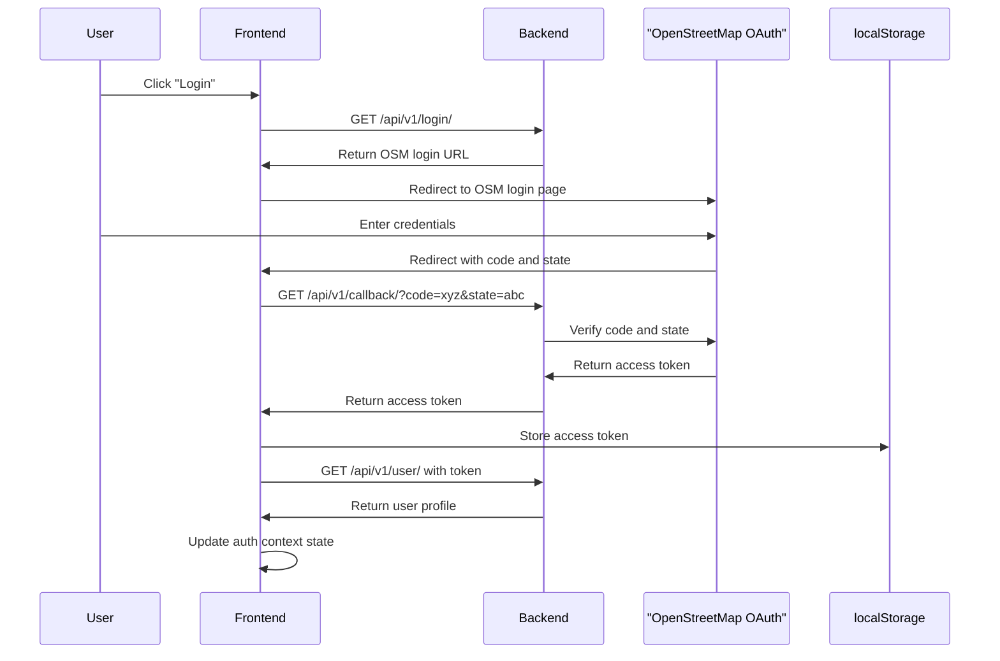
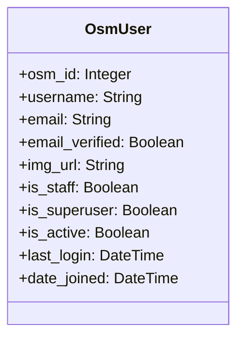
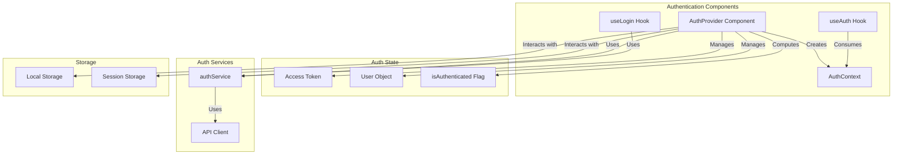
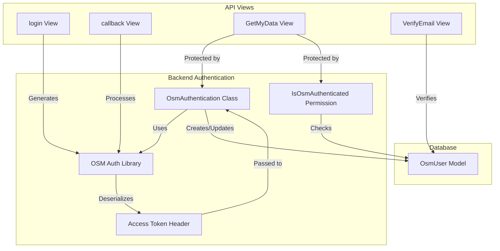
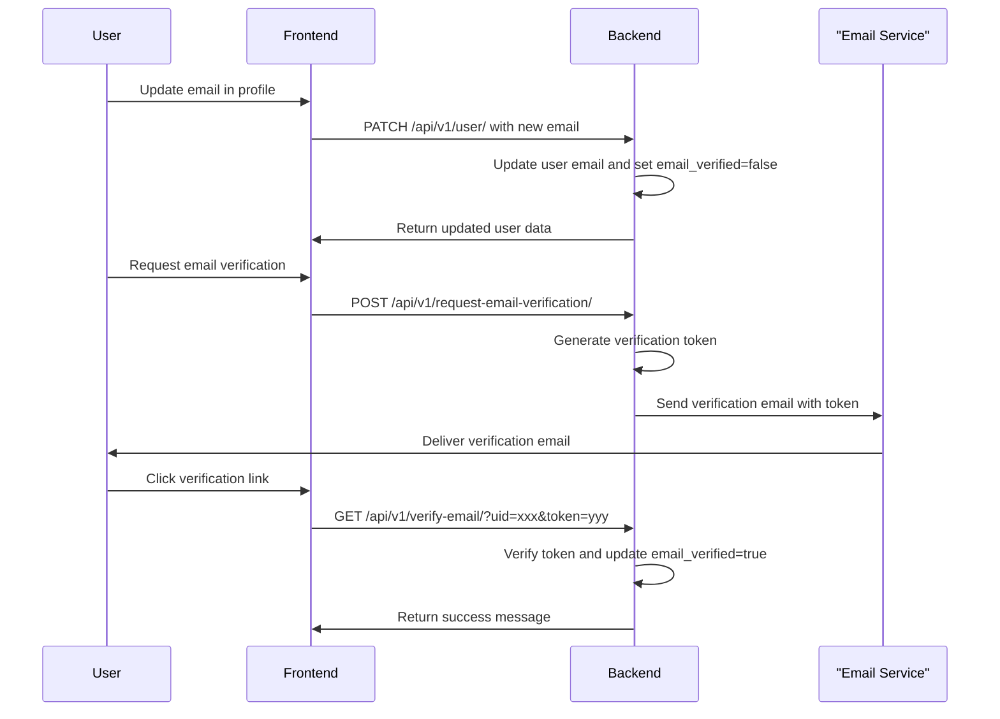
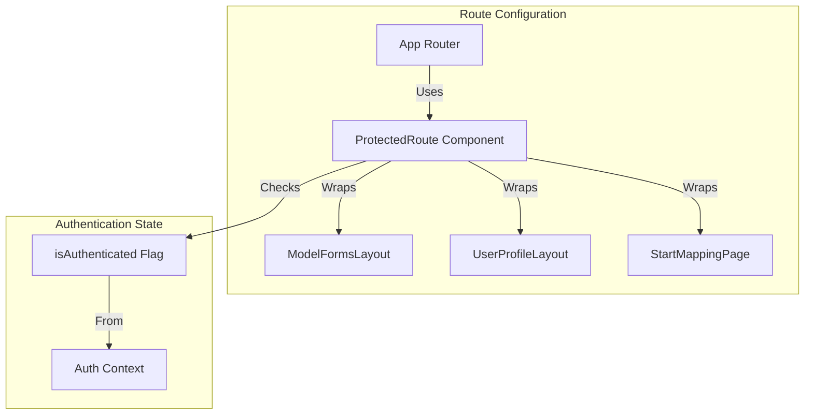

# Authentication and User Management

<details>
<summary>Relevant source files</summary>

The following files were used as context for generating this wiki page:

- [backend/.gitignore](backend/.gitignore)
- [backend/.pre-commit-config.yaml](backend/.pre-commit-config.yaml)
- [backend/core/admin.py](backend/core/admin.py)
- [backend/login/admin.py](backend/login/admin.py)
- [backend/login/authentication.py](backend/login/authentication.py)
- [backend/login/permissions.py](backend/login/permissions.py)
- [backend/login/views.py](backend/login/views.py)
- [backend/pdm.lock](backend/pdm.lock)
- [backend/pyproject.toml](backend/pyproject.toml)
- [backend/tests/factories.py](backend/tests/factories.py)
- [frontend/src/app/providers/auth-provider.tsx](frontend/src/app/providers/auth-provider.tsx)
- [frontend/src/app/router.tsx](frontend/src/app/router.tsx)
- [frontend/src/hooks/use-login.ts](frontend/src/hooks/use-login.ts)
- [frontend/src/services/api-client.ts](frontend/src/services/api-client.ts)
- [frontend/src/services/auth.ts](frontend/src/services/auth.ts)

</details>


This document explains the authentication and user management system in the fAIr application. It covers how users authenticate using OpenStreetMap (OSM) OAuth, how user data is stored and managed, how authentication state is maintained in the frontend, and how protected routes are implemented.

## 1. Overview

The fAIr application uses OpenStreetMap (OSM) as its authentication provider. This enables users to log in with their existing OSM accounts without creating a new account specifically for fAIr. The system implements a complete OAuth flow for secure authentication and manages user sessions through token-based authentication.

### Authentication Flow Diagram



Sources: [frontend/src/app/providers/auth-provider.tsx:140-153](), [frontend/src/services/auth.ts:32-59](), [backend/login/views.py:34-61]()

## 2. User Model

The system uses a custom user model that extends Django's base user model to store OSM-specific user information.

### User Data Model



Sources: [backend/login/admin.py:23-36](), [backend/tests/factories.py:16-21]()

## 3. Frontend Authentication Implementation

### 3.1. Auth Provider

The frontend uses a React context provider (`AuthProvider`) to manage authentication state and provide authentication-related functionality throughout the application. This provider handles:

- Storing and retrieving the access token
- Fetching user profile data
- Handling login and logout
- Monitoring authentication state
- Email verification



Sources: [frontend/src/app/providers/auth-provider.tsx:38-213](), [frontend/src/hooks/use-login.ts:9-42]()

### 3.2. Key Authentication Methods

The auth provider exposes several key methods:

1. **authenticateUser**: Exchanges OAuth code and state for an access token
   ```typescript
   authenticateUser(state: string, code: string): Promise<void>
   ```

2. **logout**: Clears authentication state and token
   ```typescript
   logout(): void
   ```

3. **verifyUserEmail**: Verifies a user's email with provided token
   ```typescript
   verifyUserEmail(uid: string, token: string): Promise<void>
   ```

Sources: [frontend/src/app/providers/auth-provider.tsx:140-181]()

### 3.3. Login Hook

The application provides a `useLogin` hook for initiating the login process:

```typescript
const { loading, handleLogin } = useLogin();
```

The hook stores the current page path in session storage to enable redirection back to the same page after successful authentication.

Sources: [frontend/src/hooks/use-login.ts:22-42]()

## 4. Backend Authentication Implementation

### 4.1. Authentication Mechanism

The backend implements a custom authentication scheme based on OSM OAuth:



Sources: [backend/login/authentication.py:10-54](), [backend/login/views.py:34-159]()

### 4.2. Authentication Flow API Endpoints

The backend provides several API endpoints to handle the authentication flow:

1. `/api/v1/login/`: Generates a login URL for OSM OAuth
2. `/api/v1/callback/`: Callback endpoint that exchanged code and state for an access token
3. `/api/v1/user/`: Returns the authenticated user's information
4. `/api/v1/verify-email/`: Verifies a user's email address

Sources: [backend/login/views.py:34-159]()

### 4.3. Permissions System

The backend implements several custom permission classes to control access to resources:

1. **IsOsmAuthenticated**: Checks if a user is authenticated with OSM
2. **IsAdminUser**: Checks if a user is an admin
3. **IsStaffUser**: Checks if a user is a staff member

These permissions are used to protect API endpoints that require authentication.

Sources: [backend/login/permissions.py:6-60]()

## 5. Email Verification

The system includes email verification functionality to verify user email addresses.

### 5.1. Email Verification Flow



Sources: [backend/login/views.py:102-159](), [frontend/src/app/providers/auth-provider.tsx:155-181]()

## 6. Protected Routes

The frontend implements protected routes that require authentication. If a user attempts to access a protected route without being authenticated, they are redirected to the login page.

### 6.1. Protected Route Implementation

Protected routes are wrapped with the `ProtectedRoute` component, which checks if the user is authenticated before rendering the route component.



Sources: [frontend/src/app/router.tsx:89-291]()

### 6.2. Protected Routes in the Application

The following routes are protected and require authentication:

| Route | Purpose |
|-------|---------|
| `/models/create/*` | Model creation |
| `/models/edit/*` | Model editing |
| `/start-mapping` | Start mapping feature |
| `/profile/*` | User profile pages |

Sources: [frontend/src/app/router.tsx:89-337]()

## 7. Admin Interface

The system includes a Django admin interface for managing users. Administrators can view and manage user accounts, including:

- View user profiles
- Change permissions (staff, superuser)
- Manage user activation status
- View important dates (last login, date joined)

Sources: [backend/login/admin.py:37-93](), [backend/core/admin.py:6-63]()

## 8. Integration with Other Systems

The authentication system is integrated with other components of the application:

### 8.1. API Client Integration

The frontend API client includes interceptors to handle authentication-related errors, such as automatically logging out when receiving a 401 Unauthorized response.

Sources: [frontend/src/services/api-client.ts:25-41]()

### 8.2. Model and Dataset Ownership

User authentication is used to associate models and datasets with specific users, enabling ownership-based permissions.

Sources: [backend/core/admin.py:9-22]()