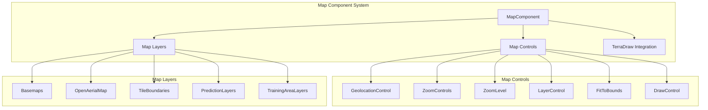
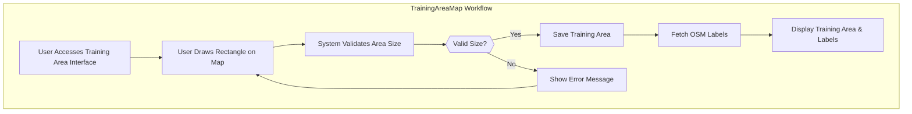
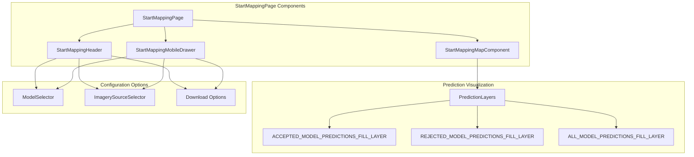
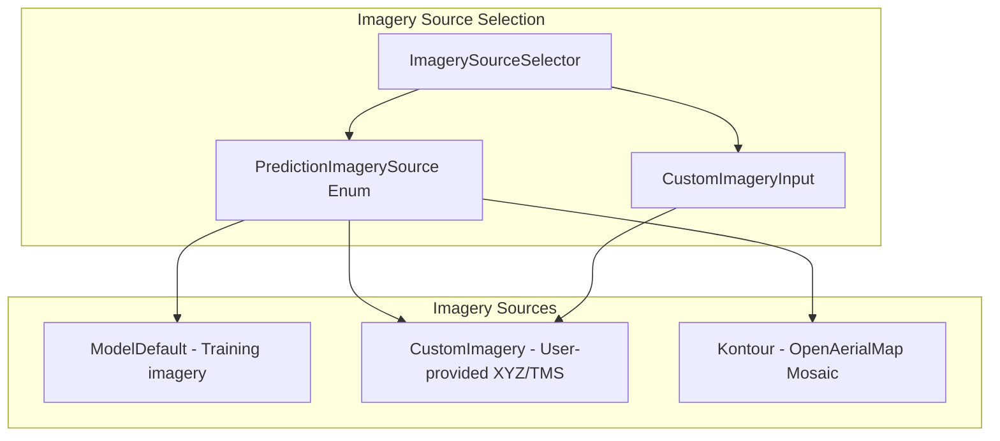
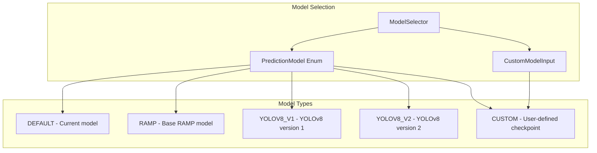
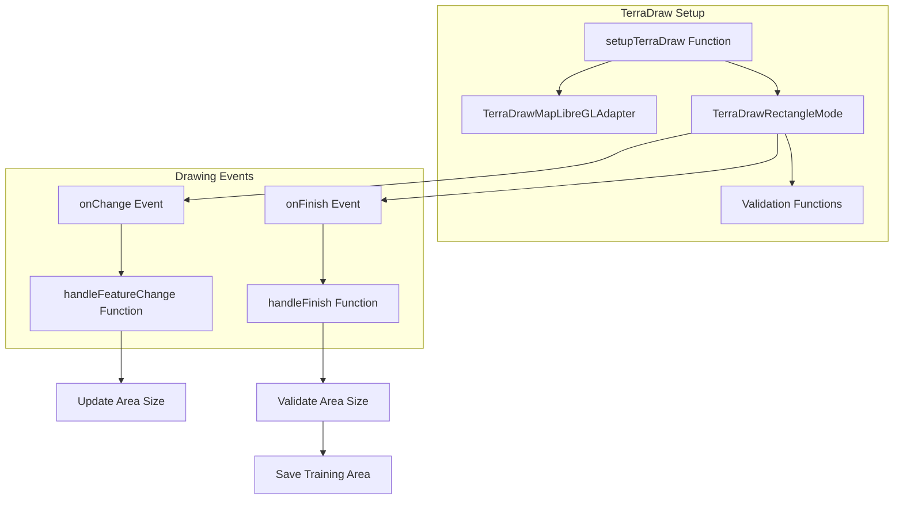

# Map Visualization Components

Relevant source files

The following files were used as context for generating this wiki page:

- [frontend/src/app/routes/start-mapping.tsx](frontend/src/app/routes/start-mapping.tsx)
- [frontend/src/assets/images/index.ts](frontend/src/assets/images/index.ts)
- [frontend/src/components/map/map.tsx](frontend/src/components/map/map.tsx)
- [frontend/src/components/map/setups/setup-terra-draw.ts](frontend/src/components/map/setups/setup-terra-draw.ts)
- [frontend/src/components/ui/form/radio-group/radio-group.css](frontend/src/components/ui/form/radio-group/radio-group.css)
- [frontend/src/components/ui/form/radio-group/radio-group.tsx](frontend/src/components/ui/form/radio-group/radio-group.tsx)
- [frontend/src/enums/start-mapping.ts](frontend/src/enums/start-mapping.ts)
- [frontend/src/features/model-creation/components/dialogs/file-upload-dialog.tsx](frontend/src/features/model-creation/components/dialogs/file-upload-dialog.tsx)
- [frontend/src/features/model-creation/components/training-area/open-area-map.tsx](frontend/src/features/model-creation/components/training-area/open-area-map.tsx)
- [frontend/src/features/model-creation/components/training-area/training-area-item.tsx](frontend/src/features/model-creation/components/training-area/training-area-item.tsx)
- [frontend/src/features/model-creation/components/training-area/training-area-list.tsx](frontend/src/features/model-creation/components/training-area/training-area-list.tsx)
- [frontend/src/features/model-creation/components/training-area/training-area-map.tsx](frontend/src/features/model-creation/components/training-area/training-area-map.tsx)
- [frontend/src/features/model-creation/components/training-area/training-area.tsx](frontend/src/features/model-creation/components/training-area/training-area.tsx)
- [frontend/src/features/model-creation/hooks/use-tms-tilejson.ts](frontend/src/features/model-creation/hooks/use-tms-tilejson.ts)
- [frontend/src/features/models/components/model-detail-user.tsx](frontend/src/features/models/components/model-detail-user.tsx)
- [frontend/src/features/start-mapping/components/mobile-drawer.tsx](frontend/src/features/start-mapping/components/mobile-drawer.tsx)
- [frontend/src/features/start-mapping/components/replicable-models/imagery-source-selector-trigger-button.tsx](frontend/src/features/start-mapping/components/replicable-models/imagery-source-selector-trigger-button.tsx)
- [frontend/src/features/start-mapping/components/replicable-models/imagery-source-selector.tsx](frontend/src/features/start-mapping/components/replicable-models/imagery-source-selector.tsx)
- [frontend/src/features/start-mapping/components/replicable-models/model-selector-trigger-button.tsx](frontend/src/features/start-mapping/components/replicable-models/model-selector-trigger-button.tsx)
- [frontend/src/features/start-mapping/components/replicable-models/model-selector.tsx](frontend/src/features/start-mapping/components/replicable-models/model-selector.tsx)
- [frontend/src/utils/general-utils.ts](frontend/src/utils/general-utils.ts)
- [frontend/src/utils/string-utils.ts](frontend/src/utils/string-utils.ts)

## Purpose and Scope

This document describes the map visualization components in the fAIr system that provide the foundation for displaying and interacting with geospatial data. These components enable users to view aerial imagery, create training areas, visualize model predictions, and interact with prediction results. For information about the overall frontend architecture, see [Frontend System](#3).

## Core Map Component Architecture

The map visualization system is built around MapLibre GL JS, an open-source JavaScript library for interactive maps. It provides a modular architecture with components that can be combined for different mapping needs.

Sources: [frontend/src/components/map/map.tsx:47-118]()

### MapComponent

The `MapComponent` is the foundational building block for all map visualizations in the system. It renders a MapLibre GL map and provides various configurable controls and layers. Key properties include:

| Property | Type | Description |
|----------|------|-------------|
| `map` | `Map \| null` | MapLibre GL map instance |
| `mapContainerRef` | `RefObject<HTMLDivElement>` | Reference to container element |
| `geolocationControl` | `boolean` | Enable geolocation control |
| `drawControl` | `boolean` | Enable drawing functionality |
| `layerControl` | `boolean` | Enable layer control panel |
| `showTileBoundaries` | `boolean` | Show tile boundaries for debugging |
| `openAerialMap` | `boolean` | Enable OpenAerialMap imagery |
| `basemaps` | `boolean` | Enable basemap selector |
| `terraDraw` | `TerraDraw \| undefined` | TerraDraw instance for drawing |
| `drawingMode` | `DrawingModes` | Current drawing mode |

Sources: [frontend/src/components/map/map.tsx:19-45]()

## Map Controls

The system provides multiple map controls that enhance user interaction with the map:

### LayerControl

The `LayerControl` component allows toggling visibility of different map layers, grouped by category. It can manage both base layers (basemaps) and overlay layers (features, predictions).

### Navigation Controls

Navigation controls include:
- `ZoomControls`: Buttons for zooming in and out
- `ZoomLevel`: Display showing current zoom level
- `FitToBounds`: Button to center map on specific bounds
- `GeolocationControl`: Button to focus on user location

### DrawControl

Enables drawing functionality with TerraDraw, supporting rectangle mode for creating training areas.

Sources: [frontend/src/components/map/map.tsx:68-92]()

## Feature-Specific Map Implementations

### Training Area Map

The `TrainingAreaMap` component is used for defining training areas for model training. It provides:

- Drawing tools for creating rectangular training areas
- Display of existing training areas
- Visualization of OSM labels within training areas
- Real-time validation of area size constraints

Key features:
- Area size validation (min/max restrictions)
- Snapping to tile boundaries
- OSM label fetching for training areas
- Visual feedback during drawing

Sources: [frontend/src/features/model-creation/components/training-area/training-area-map.tsx:39-297](), [frontend/src/features/model-creation/components/training-area/training-area.tsx:34-244]()

### Start Mapping Map

The `StartMappingMapComponent` is used for viewing and interacting with model predictions. It displays:

- Model prediction layers (accepted, rejected, all)
- Selected imagery source
- Layer controls for toggling visibility

The Start Mapping interface provides:
- Model prediction visualization on the map
- Imagery source selection
- Model selection for prediction
- Download options for GeoJSON exports
- JOSM integration for external editing

Sources: [frontend/src/app/routes/start-mapping.tsx:64-517](), [frontend/src/features/start-mapping/components/mobile-drawer.tsx:22-201]()

## Imagery Source Management

The system supports different imagery sources for mapping through the `ImagerySourceSelector` component:

Available imagery sources include:

| Source | Description | Example URL |
|--------|-------------|-------------|
| Model Default | Original imagery used for training the model | Varies by model |
| Custom Imagery | User-specified XYZ/TMS tile server URL | `https://server.com/tiles/{z}/{x}/{y}.png` |
| OpenAerialMap Mosaic | All OpenAerialMap images in a mosaic | `https://apps.kontur.io/raster-tiler/oam/mosaic/{z}/{x}/{y}.png` |

The imagery source selection affects:
- Visual context for model predictions
- Prediction accuracy (best when using the same imagery as training)
- Consistent visual reference for multiple users

Sources: [frontend/src/features/start-mapping/components/replicable-models/imagery-source-selector.tsx:36-151](), [frontend/src/features/start-mapping/components/replicable-models/imagery-source-selector-trigger-button.tsx:11-81](), [frontend/src/enums/start-mapping.ts:3-8]()

## Model Selection

The system allows selecting different models for predictions through the `ModelSelector` component:

When a model is selected, the system retrieves the appropriate model checkpoint path using `constructModelCheckpointPath` for default models or uses the user-provided path for custom models.

Sources: [frontend/src/features/start-mapping/components/replicable-models/model-selector.tsx:16-191](), [frontend/src/features/start-mapping/components/replicable-models/model-selector-trigger-button.tsx:12-92](), [frontend/src/enums/start-mapping.ts:10-14](), [frontend/src/utils/general-utils.ts:90-105]()

## TerraDraw Integration

The system integrates TerraDraw for drawing functionality:

The TerraDraw integration provides:
- Rectangle drawing mode for training areas
- Validation of drawn shapes (size, self-intersection)
- Real-time feedback during drawing
- Style configuration for visual feedback

Sources: [frontend/src/components/map/setups/setup-terra-draw.ts:16-75](), [frontend/src/features/model-creation/components/training-area/training-area-map.tsx:114-171]()

## File Upload and Download

The system supports GeoJSON file operations for training areas and predictions:

### File Upload

The `FileUploadDialog` component allows uploading GeoJSON files containing:
- Training areas (polygons) for model training
- Labels for specific areas of interest

Key features:
- GeoJSON format validation
- Size and feature count limitations
- Area size validation for training areas

Sources: [frontend/src/features/model-creation/components/dialogs/file-upload-dialog.tsx:49-345]()

### File Download

The system provides multiple options for downloading prediction results:
- Download all predictions as GeoJSON
- Download only accepted predictions as GeoJSON
- Open predictions in JOSM for editing in OSM

Sources: [frontend/src/app/routes/start-mapping.tsx:256-298]()

## Mobile Support

The map components support responsive design for mobile devices:

- `StartMappingMobileDrawer` provides a mobile-friendly interface for settings and controls
- Adaptive layout changes based on viewport size
- Touch-friendly controls for mobile interaction
- Specialized mobile dialogs for model and imagery selection

Sources: [frontend/src/features/start-mapping/components/mobile-drawer.tsx:22-201](), [frontend/src/app/routes/start-mapping.tsx:412-441]()

## Usage Patterns

### Creating a Map Interface

To implement a custom map interface:

1. Use the `useMapInstance` hook to get a map instance and container reference
2. Configure the `MapComponent` with appropriate controls and layers
3. Add custom layer components as children
4. Implement event handlers for map interactions

### Adding Custom Layers

To add custom layers to a map:

1. Define the layer IDs and source IDs
2. Create a component that adds the layers to the map
3. Handle layer visibility through the `LayerControl` component
4. Implement data fetching and updates for the layers

### Integrating Drawing Functionality

To enable drawing on a map:

1. Set up TerraDraw with appropriate modes
2. Implement event handlers for drawing events
3. Add validation and feedback during drawing
4. Handle the drawn features (save, display, etc.)

The map visualization components provide a flexible and extensible foundation for building mapping interfaces in the fAIr system.