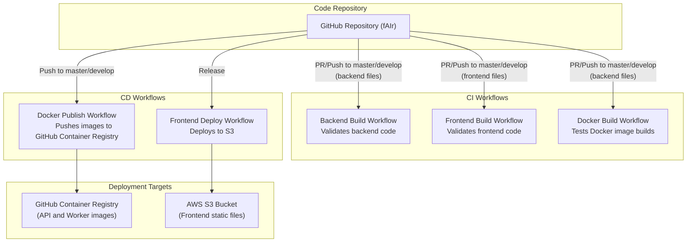
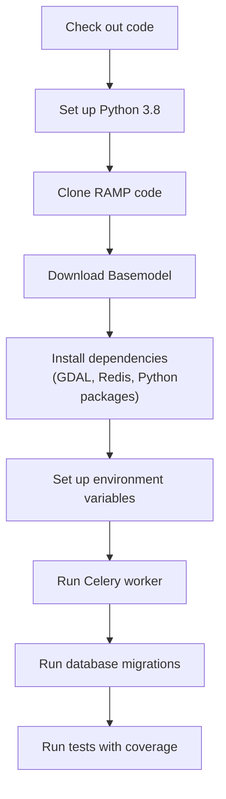
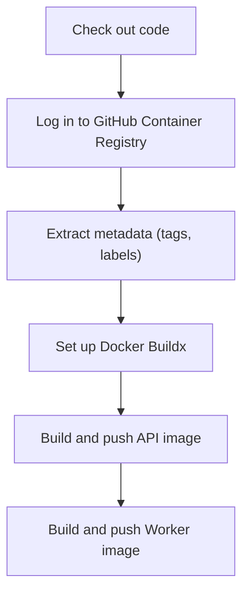
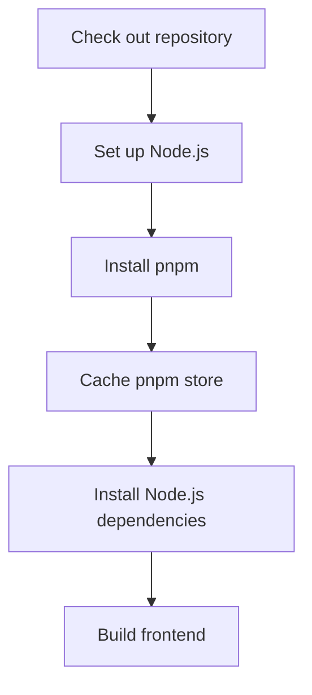
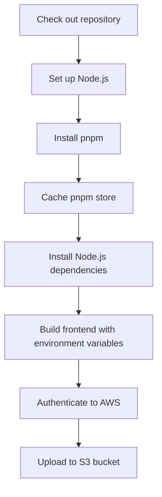
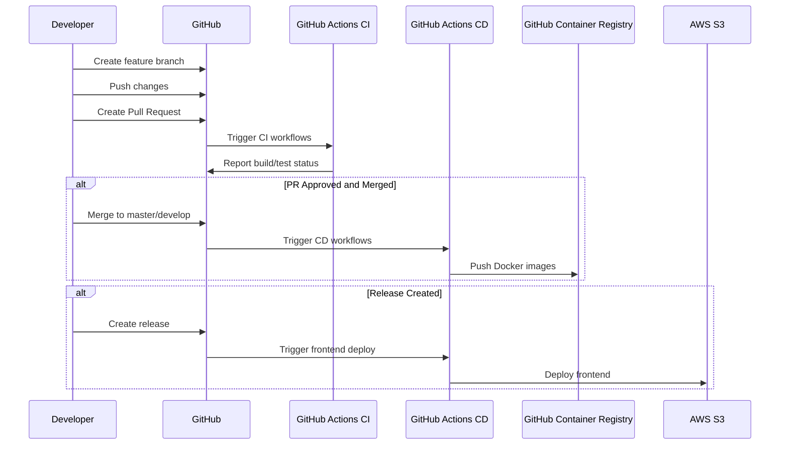

# CI/CD Workflows

<details>
<summary>Relevant source files</summary>

The following files were used as context for generating this wiki page:

- [.github/workflows/backend_build.yml](.github/workflows/backend_build.yml)
- [.github/workflows/docker_build.yml](.github/workflows/docker_build.yml)
- [.github/workflows/docker_publish_image.yml](.github/workflows/docker_publish_image.yml)
- [.github/workflows/frontend_build.yml](.github/workflows/frontend_build.yml)
- [.github/workflows/frontend_build_push.yml](.github/workflows/frontend_build_push.yml)
- [backend/README.md](backend/README.md)
- [backend/api-requirements.txt](backend/api-requirements.txt)
- [backend/docker_sample_env](backend/docker_sample_env)
- [backend/sample_env](backend/sample_env)
- [backend/tests/__init__.py](backend/tests/__init__.py)
- [backend/tests/test_endpoints.py](backend/tests/test_endpoints.py)
- [backend/tests/test_views.py](backend/tests/test_views.py)

</details>


This page documents the continuous integration and continuous deployment (CI/CD) workflows implemented in the fAIr project. It covers the automated processes for testing, building, and deploying both the frontend and backend components of the system. For information on the development environment setup, see [Development Environment Setup](#4.1), and for details on Docker containerization, see [Docker Containerization](#4.3).

## Overview of CI/CD Pipelines

The fAIr project uses GitHub Actions as its CI/CD platform to automate the software development lifecycle. These workflows ensure code quality through automated testing, build Docker images for containerized deployment, and publish frontend builds to cloud storage.



Sources: [.github/workflows/backend_build.yml:1-17](), [.github/workflows/frontend_build.yml:1-14](), [.github/workflows/docker_build.yml:1-20](), [.github/workflows/docker_publish_image.yml:1-15](), [.github/workflows/frontend_build_push.yml:1-7]()

## Workflow Triggers

Different workflows are triggered based on specific events in the repository:

| Workflow | Trigger | File Path Filter | Purpose |
|----------|---------|------------------|---------|
| Backend Build | Push to master/develop, Pull Requests | `backend/**`, `.github/workflows/backend_build.yml` | Run backend tests to ensure code quality |
| Frontend Build | Push to master/develop, Pull Requests | `frontend/**`, `.github/workflows/frontend_build.yml` | Validate frontend build process |
| Docker Build | Push to master/develop, Pull Requests | `backend/**`, `.github/workflows/docker_build.yml` | Test Docker image builds without publishing |
| Docker Publish | Push to master/develop, Release | Excludes CI workflow files | Build and publish Docker images to GitHub Container Registry |
| Frontend Deploy | Release, Manual dispatch | None | Build and deploy frontend to AWS S3 |

Sources: [.github/workflows/backend_build.yml:2-16](), [.github/workflows/frontend_build.yml:2-13](), [.github/workflows/docker_build.yml:3-19](), [.github/workflows/docker_publish_image.yml:3-14](), [.github/workflows/frontend_build_push.yml:3-6]()

## Backend CI/CD Pipeline

The backend CI/CD pipeline ensures that the Django backend application is tested and deployed correctly.

### Backend Testing Workflow

The backend build workflow performs the following steps:

1. Set up a PostgreSQL database with PostGIS extension for testing
2. Install GDAL and other system dependencies
3. Clone and set up RAMP code for AI model integration
4. Install Python dependencies
5. Set up required environment variables
6. Run database migrations
7. Execute tests with coverage reporting



Sources: [.github/workflows/backend_build.yml:18-137]()

### Docker Image Building and Publishing

Two Docker images are built for the backend:

1. **API Container**: Runs the Django API server
2. **Worker Container**: Runs the Celery worker for asynchronous tasks

The Docker publish workflow builds and pushes these images to GitHub Container Registry when code is pushed to main branches or when a release is created.



Sources: [.github/workflows/docker_publish_image.yml:20-102]()

## Frontend CI/CD Pipeline

The frontend CI/CD pipeline builds and deploys the React frontend application.

### Frontend Build Process

The frontend build workflow verifies that the frontend can be successfully built across multiple Node.js versions (18, 20, 22):

1. Check out the repository
2. Set up Node.js
3. Install pnpm package manager
4. Install dependencies with pnpm
5. Build the frontend



Sources: [.github/workflows/frontend_build.yml:15-54]()

### Frontend Deployment Process

When a release is created or the workflow is manually triggered, the frontend deploy workflow:

1. Builds the frontend with production environment variables
2. Authenticates to AWS using OIDC (OpenID Connect)
3. Syncs the built files to an S3 bucket



Sources: [.github/workflows/frontend_build_push.yml:12-70]()

## Environment Variables and Secrets

The workflows rely on various environment variables and secrets stored in GitHub:

### Backend Environment Variables

The backend build workflow requires these secrets:

- `TESTING_TOKEN`: Token for testing authentication
- `OSM_CLIENT_ID`: OpenStreetMap OAuth client ID
- `OSM_CLIENT_SECRET`: OpenStreetMap OAuth client secret
- `OSM_SECRET_KEY`: Secret key for OpenStreetMap integration

Sources: [.github/workflows/backend_build.yml:116-135](), [backend/sample_env:1-22]()

### Frontend Environment Variables

The frontend deployment workflow uses these environment variables:

- `VITE_BASE_API_URL`: Base URL for API requests
- `VITE_MATOMO_ID`: Matomo analytics ID
- `VITE_MATOMO_APP_DOMAIN`: Matomo app domain
- `VITE_OSM_HASHTAGS`: OpenStreetMap hashtags
- `VITE_FAIR_PREDICTOR_API_URL`: URL for the fair predictor API

And these secrets:
- `AWS_OIDC_ROLE`: AWS IAM role ARN for OIDC authentication
- `FRONTEND_BUCKET`: S3 bucket name for frontend deployment

Sources: [.github/workflows/frontend_build_push.yml:53-70]()

## CI/CD Infrastructure Management

The workflows are executed on GitHub-hosted runners with specific configurations:

| Workflow | Runner | Services | Cache Strategy |
|----------|--------|----------|---------------|
| Backend Build | ubuntu-latest | PostgreSQL with PostGIS | pip cache |
| Frontend Build | ubuntu-latest | None | pnpm store cache |
| Docker Build | ubuntu-latest | None | Docker layer cache |
| Docker Publish | ubuntu-24.04 | None | Docker layer cache |
| Frontend Deploy | ubuntu-latest | None | pnpm store cache |

### Caching Strategies

The workflows implement caching to improve build performance:

- Frontend workflows cache the pnpm store to speed up dependency installation
- Docker workflows use layer caching to avoid rebuilding unchanged layers

Sources: [.github/workflows/backend_build.yml:20-32](), [.github/workflows/frontend_build.yml:37-45](), [.github/workflows/docker_publish_image.yml:58-60](), [.github/workflows/frontend_build_push.yml:36-43]()

## Workflow Status and Monitoring

The CI/CD status badge is included in the backend README to show the current status of the backend build workflow:

```

```

Sources: [backend/README.md:1-1]()

## Integration with Development Process

The CI/CD workflows are integrated with the development process to ensure quality control:

