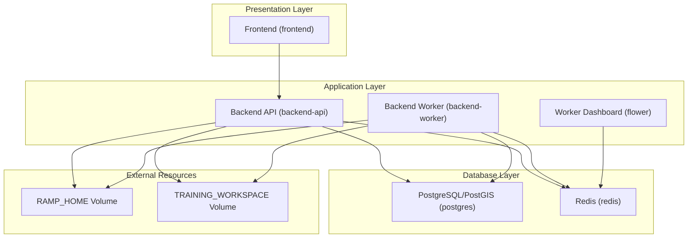
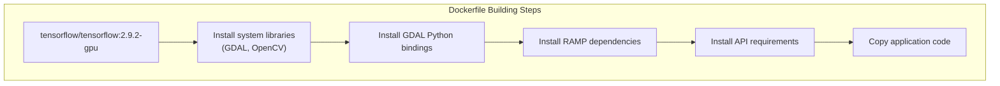
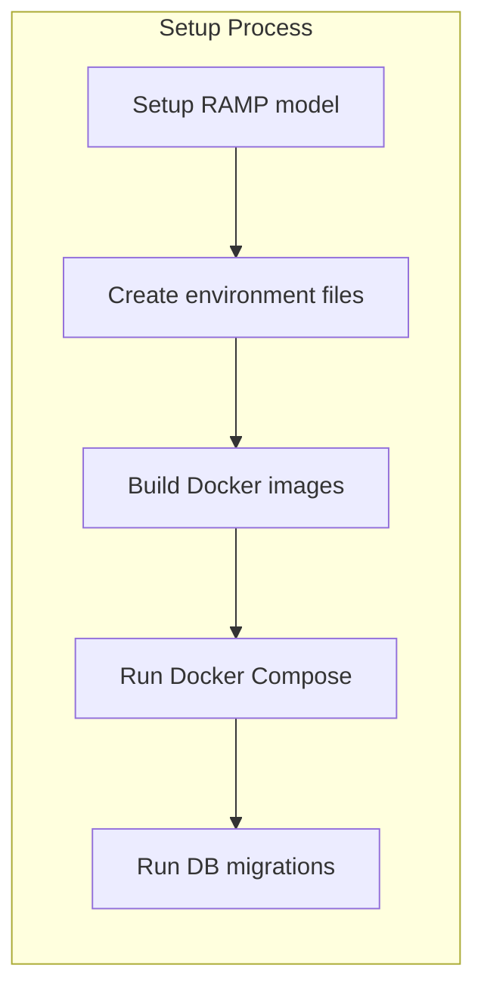
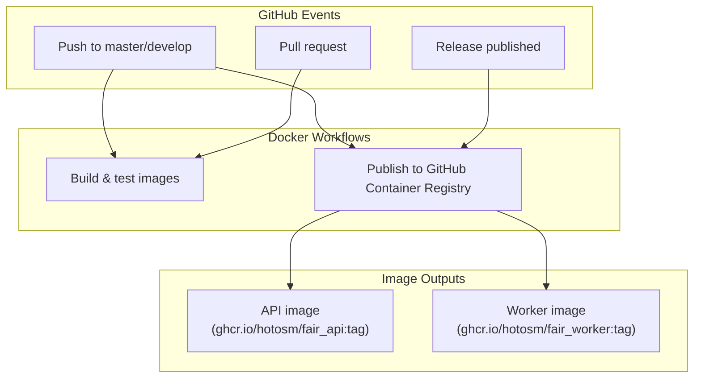
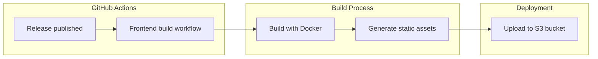

# Docker Containerization

<details>
<summary>Relevant source files</summary>

The following files were used as context for generating this wiki page:

- [.github/workflows/backend_build.yml](.github/workflows/backend_build.yml)
- [.github/workflows/docker_build.yml](.github/workflows/docker_build.yml)
- [.github/workflows/docker_publish_image.yml](.github/workflows/docker_publish_image.yml)
- [.github/workflows/frontend_build.yml](.github/workflows/frontend_build.yml)
- [.github/workflows/frontend_build_push.yml](.github/workflows/frontend_build_push.yml)
- [Readme.md](Readme.md)
- [backend/Dockerfile](backend/Dockerfile)
- [backend/Dockerfile_CPU](backend/Dockerfile_CPU)
- [backend/README.md](backend/README.md)
- [backend/api-requirements.txt](backend/api-requirements.txt)
- [backend/docker_sample_env](backend/docker_sample_env)
- [backend/sample_env](backend/sample_env)
- [backend/tests/__init__.py](backend/tests/__init__.py)
- [backend/tests/test_endpoints.py](backend/tests/test_endpoints.py)
- [backend/tests/test_views.py](backend/tests/test_views.py)
- [docker-compose-cpu.yml](docker-compose-cpu.yml)
- [docker-compose.yml](docker-compose.yml)
- [docs/Docker-installation.md](docs/Docker-installation.md)
- [frontend/Dockerfile.frontend](frontend/Dockerfile.frontend)
- [run_migrations.sh](run_migrations.sh)
- [setup-ramp.sh](setup-ramp.sh)

</details>


This page documents the Docker containerization approach used in the fAIr project. It covers the container architecture, development environment setup, image building, and CI/CD pipelines for Docker images. For information about general development environment setup, see [Development Environment Setup](#4.1), and for CI/CD workflows beyond Docker, see [CI/CD Workflows](#4.2).

## Container Architecture

The fAIr project uses Docker to containerize all major components of the system, ensuring consistency across development and deployment environments. The system is composed of several services that work together:



### Services Description

| Service | Purpose | Container Name | Base Image |
|---------|---------|---------------|------------|
| postgres | PostgreSQL database with PostGIS extension | pgsql | postgis/postgis |
| redis | Message broker for Celery and caching | redis | redis |
| backend-api | Django REST API server | api | tensorflow/tensorflow |
| backend-worker | Celery worker for async processing | worker | tensorflow/tensorflow |
| worker-dashboard | Flower dashboard for monitoring Celery | flower | mher/flower |
| frontend | React frontend application | frontend | node |

Sources: [docker-compose.yml](), [docker-compose-cpu.yml]()

## Docker Images

### Backend Images

The fAIr backend uses two main Dockerfiles:

1. **GPU-enabled Dockerfile** (`Dockerfile`): 
   - Based on `tensorflow/tensorflow:2.9.2-gpu`
   - Includes GDAL, OpenCV, and other geospatial libraries
   - Used for the backend worker that performs model training

2. **CPU-only Dockerfile** (`Dockerfile_CPU`):
   - Based on `tensorflow/tensorflow:2.9.2` (without GPU support)
   - Contains the same dependencies but works on systems without NVIDIA GPUs
   - Can be used for development or API-only deployments

Both Dockerfiles install:
- GDAL and geospatial libraries for processing geographic data
- Python dependencies from `requirements.txt` and `api-requirements.txt`
- RAMP dependencies and Solaris library for machine learning model training

Example backend Dockerfile structure (GPU version):



Sources: [backend/Dockerfile](), [backend/Dockerfile_CPU]()

### Frontend Image

The frontend uses a multi-stage Dockerfile:

1. **Build stage**:
   - Based on `node:22`
   - Installs dependencies via pnpm
   - Builds the static assets

2. **Export stage**:
   - Based on lightweight `alpine:latest`
   - Only contains the built application dist folder
   - Used for extracting the built assets for deployment

Sources: [frontend/Dockerfile.frontend]()

## Development Environment

### Setting Up Local Development with Docker

The project provides a Docker Compose configuration for local development that includes all necessary services:



Key steps for setting up the development environment:

1. Clone the repository
2. Set up RAMP model and create the RAMP_HOME directory
3. Create `.env` files for backend and frontend using the sample templates
4. Configure OSM authentication
5. Build and run containers with Docker Compose
6. Run database migrations

Sources: [docs/Docker-installation.md](), [run_migrations.sh]()

### Docker Compose Configurations

The project offers two Docker Compose configurations:

1. **Standard configuration** (`docker-compose.yml`):
   - Includes GPU support for the worker container
   - Recommended for development machines with NVIDIA GPUs

2. **CPU-only configuration** (`docker-compose-cpu.yml`):
   - Uses CPU-only images for all services
   - Suitable for development on machines without dedicated GPUs

Key environment variables required in `.env`:
- `RAMP_HOME`: Path to the RAMP model directory
- `TRAINING_WORKSPACE`: Path for storing training data
- OSM authentication details (`OSM_CLIENT_ID`, `OSM_CLIENT_SECRET`, etc.)

Sources: [docker-compose.yml](), [docker-compose-cpu.yml](), [backend/docker_sample_env]()

## CI/CD Pipeline for Docker Images

The project uses GitHub Actions to automate the building and publishing of Docker images:



### Build Workflow

The build workflow (`docker_build.yml`):
- Triggers on pushes and pull requests to master/develop branches
- Builds both API and worker images
- Does not push images to the registry (used for validation)
- Uses Docker Buildx for optimized builds
- Leverages GitHub Actions cache to speed up builds

### Publish Workflow

The publish workflow (`docker_publish_image.yml`):
- Triggers on pushes to master/develop or releases
- Builds and publishes both API and worker images to GitHub Container Registry
- Uses metadata to tag images (based on branch/tag)
- Uses Docker Buildx with caching for faster builds

Sources: [.github/workflows/docker_build.yml](), [.github/workflows/docker_publish_image.yml]()

## Frontend Deployment

Although not strictly part of the Docker containerization, the frontend is built using Docker and then deployed to an S3 bucket:



The workflow:
1. Triggered on release or manually
2. Sets up Node.js environment with pnpm
3. Builds the frontend with configured environment variables
4. Authenticates to AWS using OIDC
5. Uploads the built assets to the configured S3 bucket

Sources: [.github/workflows/frontend_build_push.yml]()

## GPU Support Considerations

fAIr's backend worker requires GPU acceleration for optimal performance of AI model training. The Docker configuration includes:

1. **GPU passthrough** in Docker Compose:
```yaml
deploy:
  resources:
    reservations:
      devices:
        - driver: nvidia
          capabilities: [gpu]
```

2. **NVIDIA Container Toolkit requirement** for the host machine
3. **GPU-specific TensorFlow base image** (`tensorflow/tensorflow:2.9.2-gpu`)

For development environments without a compatible GPU, the CPU-only configuration can be used, but model training will be significantly slower.

Sources: [docker-compose.yml](), [docs/Docker-installation.md]()

## Environment Configuration

Container environment variables are configured through `.env` files:

1. **Backend environment**: Controls database connection, Redis connection, API URLs, and credentials
2. **Frontend environment**: Controls API endpoints and application settings

For local development, sample environment files are provided:
- `backend/docker_sample_env` for the backend
- `frontend/.env_sample` for the frontend

These must be copied to `.env` files and populated with appropriate values before running the containers.

Sources: [backend/docker_sample_env](), [docs/Docker-installation.md]()