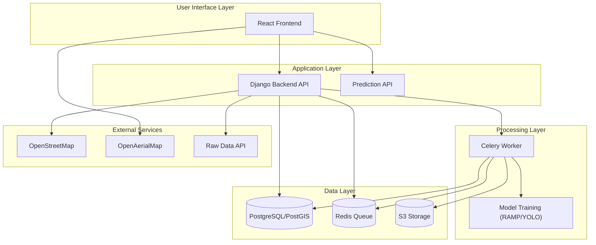
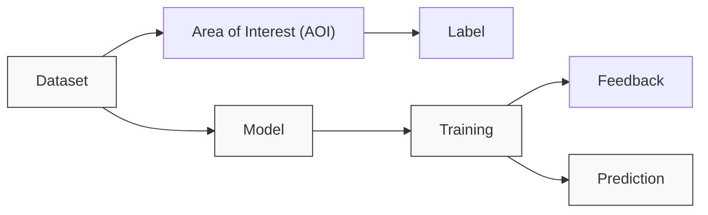
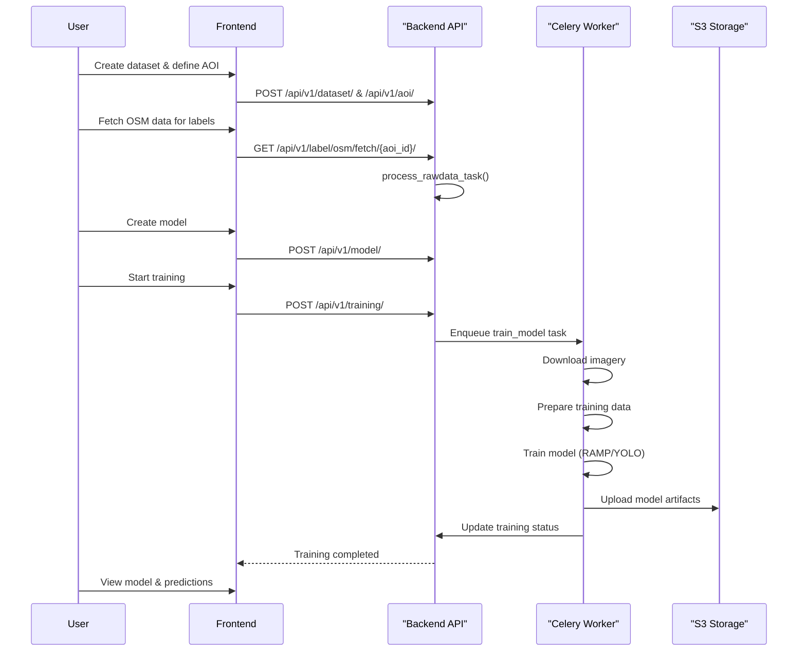

# Overview

Relevant source files

The following files were used as context for generating this wiki page:

- [Readme.md](Readme.md)
- [backend/Dockerfile](backend/Dockerfile)
- [backend/Dockerfile_CPU](backend/Dockerfile_CPU)
- [backend/aiproject/settings.py](backend/aiproject/settings.py)
- [backend/aiproject/urls.py](backend/aiproject/urls.py)
- [backend/core/models.py](backend/core/models.py)
- [backend/core/serializers.py](backend/core/serializers.py)
- [backend/core/tasks.py](backend/core/tasks.py)
- [backend/core/urls.py](backend/core/urls.py)
- [backend/core/utils.py](backend/core/utils.py)
- [backend/core/views.py](backend/core/views.py)
- [backend/requirements.txt](backend/requirements.txt)
- [docker-compose-cpu.yml](docker-compose-cpu.yml)
- [docker-compose.yml](docker-compose.yml)
- [docs/Docker-installation.md](docs/Docker-installation.md)
- [frontend/.gitignore](frontend/.gitignore)
- [frontend/Dockerfile.frontend](frontend/Dockerfile.frontend)
- [frontend/README.md](frontend/README.md)
- [frontend/eslint.config.js](frontend/eslint.config.js)
- [frontend/index.html](frontend/index.html)
- [frontend/src/components/ui/animated-beam/animated-beam.tsx](frontend/src/components/ui/animated-beam/animated-beam.tsx)
- [frontend/src/components/ui/banner/banner.tsx](frontend/src/components/ui/banner/banner.tsx)
- [frontend/src/styles/index.css](frontend/src/styles/index.css)
- [run_migrations.sh](run_migrations.sh)
- [setup-ramp.sh](setup-ramp.sh)

The fAIr project is an open AI-assisted mapping service developed by the Humanitarian OpenStreetMap Team (HOT) that enables accurate detection of geographic features from satellite imagery using machine learning models. This overview introduces the main components of the fAIr system, its purpose, and its core functionality.

fAIr's name is derived from:
- **f**: for freedom and free and open-source software
- **AI**: for Artificial Intelligence
- **r**: for resilience and responsibility for communities in humanitarian mapping

The system allows OpenStreetMap (OSM) community members to create and train their own AI models for mapping in their region of interest, making AI-assisted mapping accessible across diverse geographies. fAIr currenlty serves two target audience group : Mappers ( who use the model ) and Managers ( who create the model ) & now looking to include another usergroup of developers ( who develops and contributes the base model ), For detailed information about system installation and setup, refer to [Installation and Setup](#1.3).

## System Purpose

fAIr addresses several key challenges in humanitarian mapping:

1. **Public Access to AI**: Unlike proprietary AI services, fAIr provides free, open-source AI-assisted mapping tools that communities can control
2. **Local Context**: Models are trained on locally relevant data to ensure accuracy in diverse geographic contexts
3. **Continuous Improvement**: Models improve through user feedback, creating a learning cycle that enhances accuracy
4. **Integration with OSM Workflow**: Exports into existing OpenStreetMap contribution processes

The system currently focuses on building footprint detection & we are looking to extend farther more with other feature types in 3.0.

## High-Level Architecture

Sources: [backend/aiproject/settings.py](backend/aiproject/settings.py), [backend/core/tasks.py](backend/core/tasks.py), [docker-compose.yml](docker-compose.yml), [Readme.md](Readme.md)

## Core Components

The fAIr system consists of these primary components:

1. **Frontend**: React-based web application that provides the user interface for creating datasets, training models, and viewing predictions
2. **Backend API**: Django REST API that handles data management, authentication, and coordinates the training process using a python library called fAIr-utilities
3. **Prediction API**: Specialized API for generating real-time predictions using trained models
4. **Workers**: Celery workers that handle asynchronous model training & offline prediction ( inference ) tasks
5. **Database**: PostgreSQL with PostGIS extension for spatial data storage
6. **Storage**: S3-compatible storage for model artifacts and training data

## Key Data Models and Workflow

Sources: [backend/core/models.py](backend/core/models.py), [backend/core/serializers.py](backend/core/serializers.py)

The system workflow follows this general pattern:

1. **Dataset Creation**: Users define datasets representing geographic areas
2. **AOI Definition**: Within a dataset, Areas of Interest (AOIs) are defined
3. **Label Collection**: Building footprints are fetched primarily from OSM within AOIs with an option for custom upload
4. **Model Creation**: Users create models associated with datasets based on the available base models ( RAMP & Yolo ATM )
5. **Model Training**: Training jobs process imagery and labels to fine tune the base models on user's AOI
6. **Prediction**: Trained models generate predictions on new areas, Both offline queue and on the fly predictions 
7. **Feedback**: Users provide feedback on predictions to improve models

For more detailed information about the underlying architecture, refer to [System Architecture](#1.1).

## Model Training Process

Sources: [backend/core/tasks.py](backend/core/tasks.py), [backend/core/views.py](backend/core/views.py)

## Technology Stack

The fAIr system uses the following key technologies:

| Component | Technologies |
|-----------|--------------|
| Frontend | React, TypeScript, Vite, MapLibre GL |
| Backend | Django, Django REST Framework, GeoDjango |
| Machine Learning | TensorFlow, RAMP, YOLOv8 |
| Data Storage | PostgreSQL, PostGIS, S3 |
| Task Processing | Celery, Redis |
| Deployment | Docker, GitHub Actions |

For detailed information about key concepts and terminology used throughout the system, refer to [Key Concepts and Terminology](#1.2).

Sources: [Readme.md](Readme.md), [backend/requirements.txt](backend/requirements.txt), [frontend/README.md](frontend/README.md)
