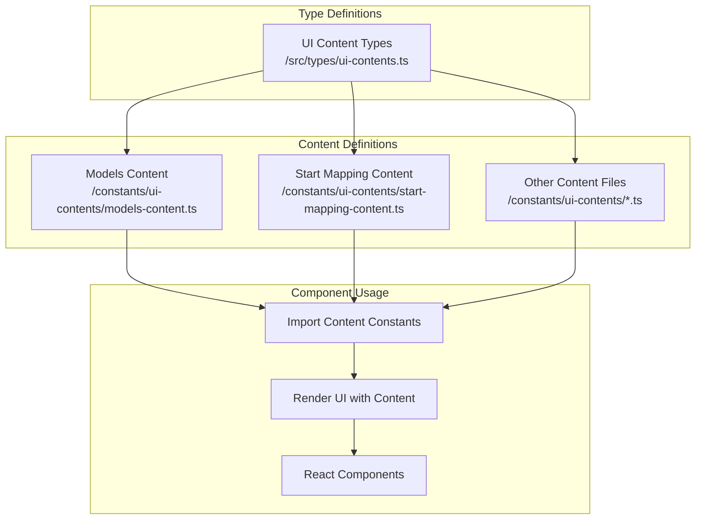
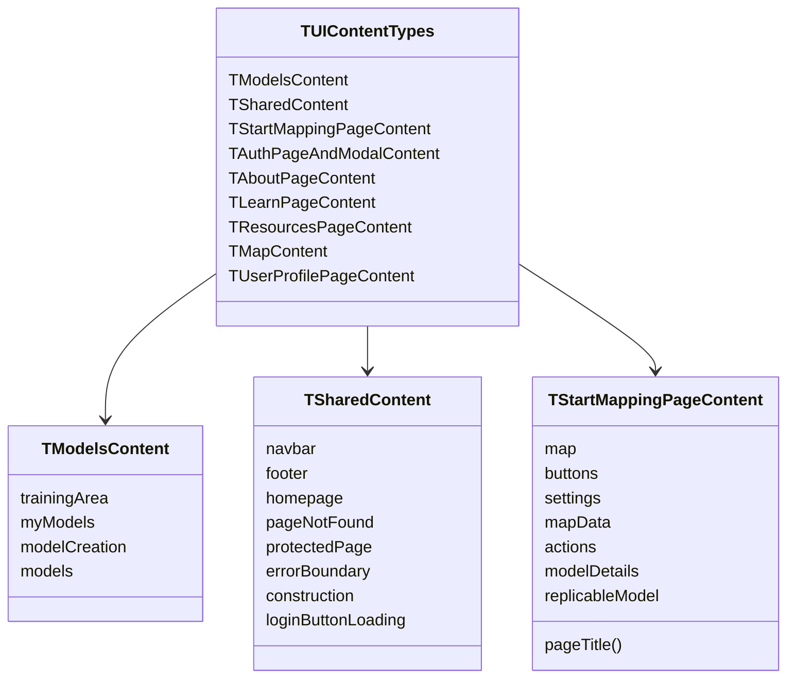
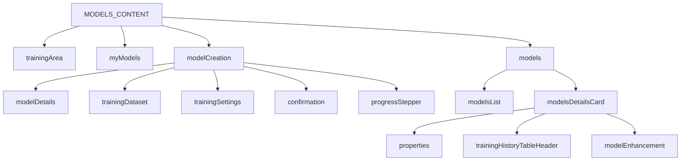
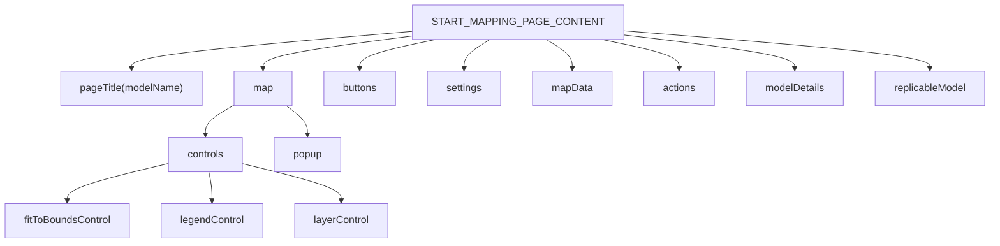
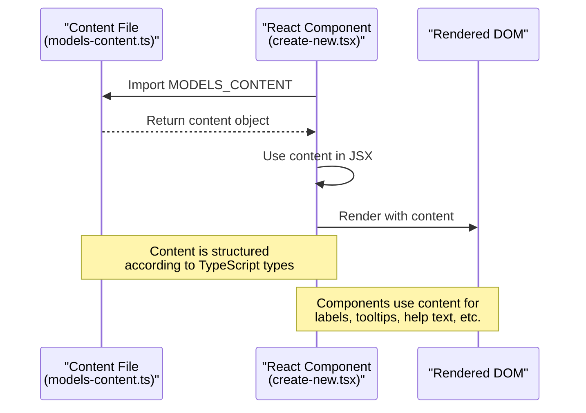

# UI Content Configuration

<details>
<summary>Relevant source files</summary>

The following files were used as context for generating this wiki page:

- [frontend/.gitignore](frontend/.gitignore)
- [frontend/README.md](frontend/README.md)
- [frontend/eslint.config.js](frontend/eslint.config.js)
- [frontend/index.html](frontend/index.html)
- [frontend/src/components/ui/animated-beam/animated-beam.tsx](frontend/src/components/ui/animated-beam/animated-beam.tsx)
- [frontend/src/components/ui/banner/banner.tsx](frontend/src/components/ui/banner/banner.tsx)
- [frontend/src/components/ui/form/help-text/help-text.tsx](frontend/src/components/ui/form/help-text/help-text.tsx)
- [frontend/src/constants/ui-contents/models-content.ts](frontend/src/constants/ui-contents/models-content.ts)
- [frontend/src/constants/ui-contents/start-mapping-content.ts](frontend/src/constants/ui-contents/start-mapping-content.ts)
- [frontend/src/features/model-creation/components/progress-bar.tsx](frontend/src/features/model-creation/components/progress-bar.tsx)
- [frontend/src/features/model-creation/components/training-dataset/create-new.tsx](frontend/src/features/model-creation/components/training-dataset/create-new.tsx)
- [frontend/src/features/model-creation/components/training-dataset/select-existing.tsx](frontend/src/features/model-creation/components/training-dataset/select-existing.tsx)
- [frontend/src/features/start-mapping/components/map/legend-control.tsx](frontend/src/features/start-mapping/components/map/legend-control.tsx)
- [frontend/src/styles/index.css](frontend/src/styles/index.css)
- [frontend/src/types/ui-contents.ts](frontend/src/types/ui-contents.ts)

</details>


## Purpose and Scope

This document explains how to customize text content, labels, tooltips, and other UI elements in the fAIr system. The UI content configuration system provides a centralized approach to managing textual content throughout the application, making it easy to modify UI text without changing component code. This document covers the structure of content configuration files, how they are organized, and how to modify UI content.

## UI Content Configuration Architecture

The fAIr application uses a structured approach to managing UI text content, separating it from component implementation. This architectural pattern improves maintainability and makes the system more adaptable to content changes.



Sources:
- [frontend/src/types/ui-contents.ts]()
- [frontend/src/constants/ui-contents/models-content.ts]()
- [frontend/src/constants/ui-contents/start-mapping-content.ts]()
- [frontend/src/features/model-creation/components/training-dataset/create-new.tsx]()

## Content Type System

UI content is strictly typed using TypeScript interfaces. These types ensure consistency and help catch missing content during development.



Sources:
- [frontend/src/types/ui-contents.ts:1-776]()

## Content Files Structure

Content files are organized by feature area and exported as constants that conform to the type definitions.

### Models Content Structure

The models content is one of the larger content modules, containing text for multiple sub-features related to model creation, management, and usage.



Sources:
- [frontend/src/constants/ui-contents/models-content.ts:1-349]()
- [frontend/src/types/ui-contents.ts:4-305]()

### Start Mapping Content Structure

The start mapping content provides text for the AI-assisted mapping interface where users interact with model predictions.



Sources:
- [frontend/src/constants/ui-contents/start-mapping-content.ts:1-104]()
- [frontend/src/types/ui-contents.ts:467-567]()

## Using UI Content in Components

UI content is imported into components from the constants directory and used for labels, tooltips, placeholders, and other text elements.

### Example: Form Component Using Content

```typescript
// Example based on create-new.tsx
import { Input } from "@/components/ui/form";
import { MODELS_CONTENT } from "@/constants";

const MyFormComponent = () => {
  return (
    <Input
      label={MODELS_CONTENT.modelCreation.trainingDataset.form.datasetName.label}
      toolTipContent={MODELS_CONTENT.modelCreation.trainingDataset.form.datasetName.toolTip}
      placeholder={MODELS_CONTENT.modelCreation.trainingDataset.form.datasetName.placeholder}
      helpText={MODELS_CONTENT.modelCreation.trainingDataset.form.datasetName.helpText}
    />
  );
};
```

The component references text content directly from the content constants, avoiding hardcoded strings.

Sources:
- [frontend/src/features/model-creation/components/training-dataset/create-new.tsx:91-123]()

### Example: Legend Control Using Content

```typescript
// Example based on legend-control.tsx
import { START_MAPPING_PAGE_CONTENT } from "@/constants";

const LegendControl = () => {
  return (
    <div>
      <p>{START_MAPPING_PAGE_CONTENT.map.controls.legendControl.title}</p>
      <ToolTip
        content={
          expandLegend
            ? START_MAPPING_PAGE_CONTENT.map.controls.legendControl.toolTip.hide
            : START_MAPPING_PAGE_CONTENT.map.controls.legendControl.toolTip.show
        }
      >
        <LegendBookIcon className="icon" />
      </ToolTip>
    </div>
  );
};
```

Sources:
- [frontend/src/features/start-mapping/components/map/legend-control.tsx:47-76]()

## How to Modify UI Content

To modify UI text content in the application, follow these steps:

1. Identify the content file containing the text you want to modify
2. Locate the specific text entry in the content constant
3. Update the text value while maintaining the structure
4. Ensure your changes maintain compatibility with the TypeScript type definitions

### Example Modification

If you want to change the tooltip text for model details, you would:

1. Open [frontend/src/constants/ui-contents/models-content.ts]()
2. Locate the section `modelDetails > form > modelName > toolTip`
3. Update the string value
4. Save the file

## Dynamic UI Content

In addition to static content defined in constants, the application also supports dynamic UI content through:

### Banner Content

The application can display announcement banners with content fetched from the backend. The banner component renders content using Markdown for rich formatting.

```typescript
// Banner component renders dynamic content from the backend
<Markdown
  remarkPlugins={[remarkGfm]}
  className="w-[90%] text-wrap xl:text-nowrap prose"
>
  {data?.[0]?.message}
</Markdown>
```

Sources:
- [frontend/src/components/ui/banner/banner.tsx:14-47]()

### Content Functions

Some content values are functions that generate text based on parameters:

```typescript
// Function-based content
pageTitle: (modelName: string) => `Start Mapping with ${modelName}`,

// Usage in a component
const title = START_MAPPING_PAGE_CONTENT.pageTitle(model.name);
```

Sources:
- [frontend/src/constants/ui-contents/start-mapping-content.ts:4]()
- [frontend/src/types/ui-contents.ts:468]()

## UI Styling Configuration

While not directly related to text content, UI styling is another customizable aspect of the application through CSS variables.

```css
:root,
:host,
.sl-theme-light {
  /* Color tokens */
  --hot-fair-color-primary: #d63f40;
  --hot-fair-color-secondary: #ffeded;
  --hot-fair-color-dark: #2c3038;
  
  /* Font sizes in rem */
  --hot-fair-font-size-extra-large: 4.25rem;
  --hot-fair-font-size-large-title: 3rem;
  
  /* Font weights */
  --hot-fair-font-weight-regular: 400;
  --hot-fair-font-weight-medium: 500;
}
```

To modify styling variables, edit the [frontend/src/styles/index.css]() file.

Sources:
- [frontend/src/styles/index.css:10-71]()

## UI Content and Component Relationship

The following diagram illustrates how UI content flows from configuration files to rendered components:



Sources:
- [frontend/src/features/model-creation/components/training-dataset/create-new.tsx]()
- [frontend/src/constants/ui-contents/models-content.ts]()

## Conclusion

The UI content configuration system in fAIr provides a centralized and type-safe approach to managing textual content in the application. By separating content from component implementation, it enables easy modification of UI text without changing component code. This approach enhances maintainability and supports localization efforts.

For information about environment configuration settings, see [Environment Variables](#5.1).