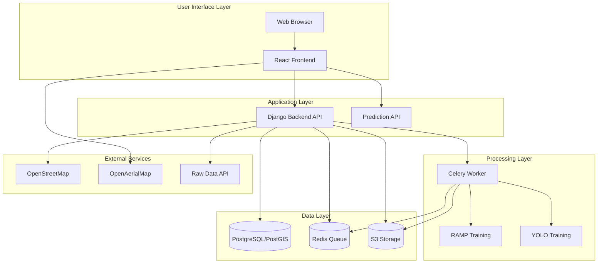
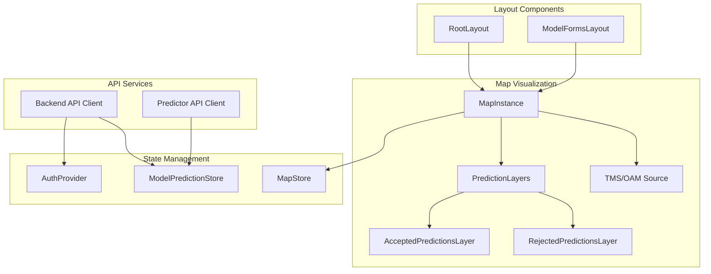
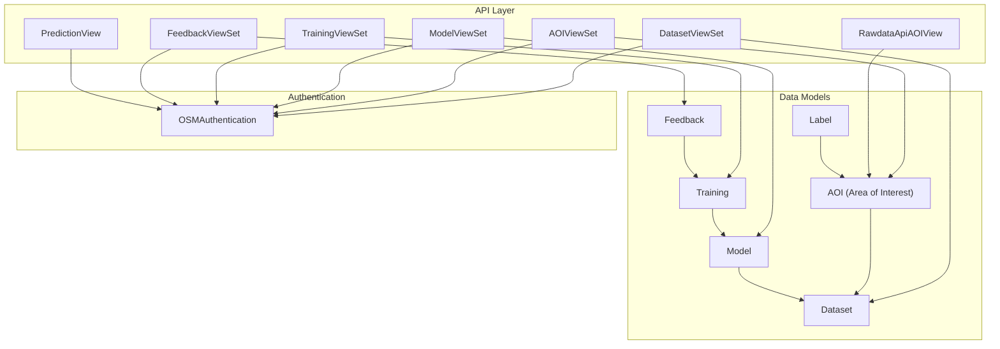
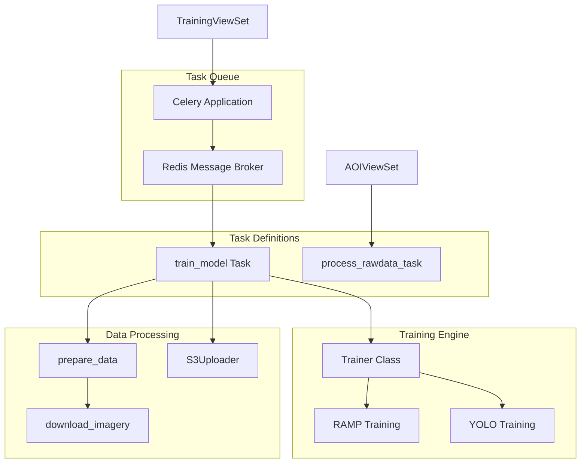
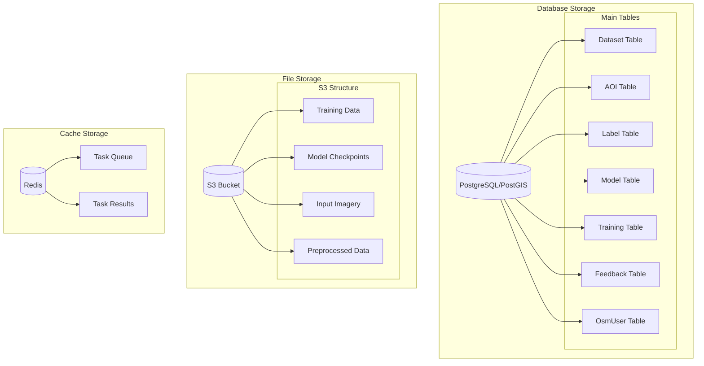
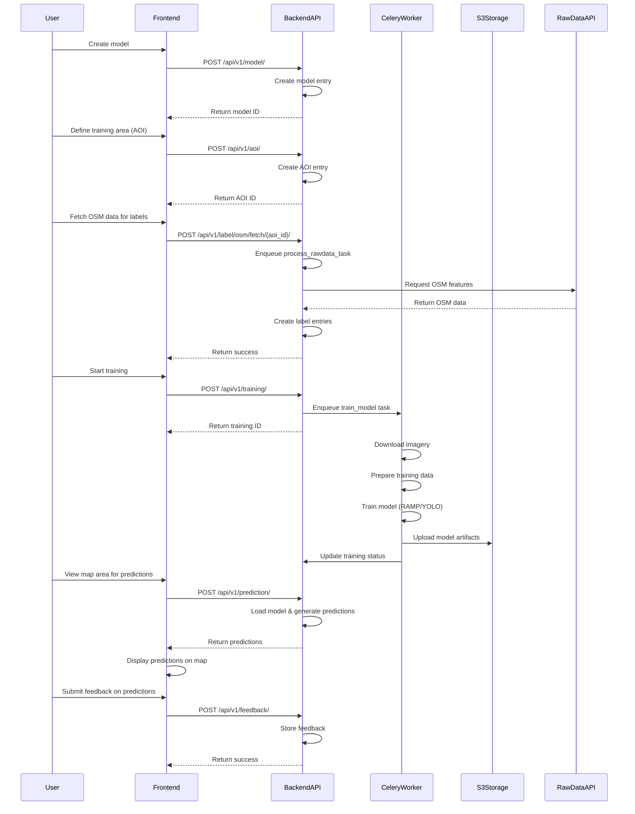
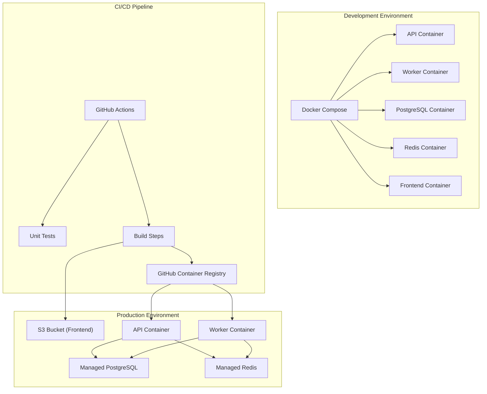
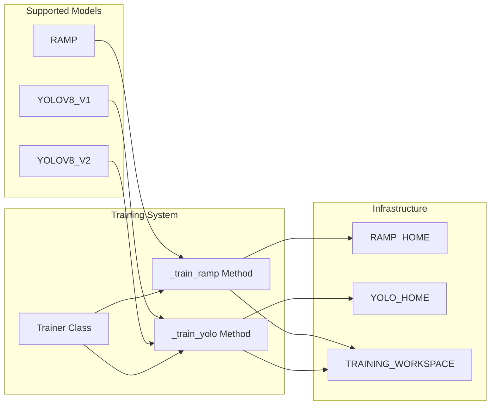

# System Architecture

Relevant source files

The following files were used as context for generating this wiki page:

- [.github/workflows/docker_build.yml](.github/workflows/docker_build.yml)
- [.github/workflows/docker_publish_image.yml](.github/workflows/docker_publish_image.yml)
- [.github/workflows/frontend_build.yml](.github/workflows/frontend_build.yml)
- [.github/workflows/frontend_build_push.yml](.github/workflows/frontend_build_push.yml)
- [Readme.md](Readme.md)
- [backend/Dockerfile](backend/Dockerfile)
- [backend/Dockerfile_CPU](backend/Dockerfile_CPU)
- [backend/aiproject/settings.py](backend/aiproject/settings.py)
- [backend/aiproject/urls.py](backend/aiproject/urls.py)
- [backend/core/models.py](backend/core/models.py)
- [backend/core/serializers.py](backend/core/serializers.py)
- [backend/core/tasks.py](backend/core/tasks.py)
- [backend/core/urls.py](backend/core/urls.py)
- [backend/core/utils.py](backend/core/utils.py)
- [backend/core/views.py](backend/core/views.py)
- [backend/requirements.txt](backend/requirements.txt)
- [docker-compose-cpu.yml](docker-compose-cpu.yml)
- [docker-compose.yml](docker-compose.yml)
- [docs/Docker-installation.md](docs/Docker-installation.md)
- [frontend/.env.sample](frontend/.env.sample)
- [frontend/Dockerfile.frontend](frontend/Dockerfile.frontend)
- [frontend/package.json](frontend/package.json)
- [frontend/pnpm-lock.yaml](frontend/pnpm-lock.yaml)
- [frontend/src/components/layouts/root-layout.tsx](frontend/src/components/layouts/root-layout.tsx)
- [frontend/src/config/env.ts](frontend/src/config/env.ts)
- [frontend/src/config/index.ts](frontend/src/config/index.ts)
- [frontend/src/features/start-mapping/components/map/layers/accepted-prediction-layer.tsx](frontend/src/features/start-mapping/components/map/layers/accepted-prediction-layer.tsx)
- [frontend/src/features/start-mapping/components/map/layers/rejected-prediction-layer.tsx](frontend/src/features/start-mapping/components/map/layers/rejected-prediction-layer.tsx)
- [frontend/src/hooks/use-map-instance.ts](frontend/src/hooks/use-map-instance.ts)
- [frontend/src/store/model-prediction-store.ts](frontend/src/store/model-prediction-store.ts)
- [run_migrations.sh](run_migrations.sh)
- [setup-ramp.sh](setup-ramp.sh)

This document provides a comprehensive overview of the fAIr system architecture, explaining how different components interact to deliver AI-assisted mapping capabilities. It covers the overall system design, component relationships, data flow, and deployment architecture. For specific details about installation and setup, see [Installation and Setup](#1.3).

## High-Level Architecture Overview

fAIr employs a modern service-oriented architecture that separates concerns between frontend user interface, backend API services, asynchronous processing, and data storage. The system is designed to handle computationally intensive AI model training and inference while providing an intuitive user experience.

**Diagram: High-Level Architecture of fAIr System**

Sources: [backend/core/views.py:1-97](), [backend/core/tasks.py:1-43](), [Readme.md:82-85](), [backend/aiproject/settings.py:1-60]()

## Core Components

### 1. Frontend System

The frontend is a single-page application built with React and TypeScript. It provides the user interface for model creation, training, monitoring, and prediction visualization.

**Diagram: Frontend Component Architecture**

Key frontend components:

- **Layout Components**: Manage the UI structure and navigation
- **Map Visualization**: Integrates MapLibre GL for interactive maps with prediction layers
- **State Management**: Uses Zustand for state management
- **API Services**: Handles communication with backend and prediction APIs

Sources: [frontend/src/components/layouts/root-layout.tsx:1-114](), [frontend/package.json:1-91](), [frontend/src/hooks/use-map-instance.ts:1-71](), [frontend/src/features/start-mapping/components/map/layers/accepted-prediction-layer.tsx:1-70](), [frontend/src/features/start-mapping/components/map/layers/rejected-prediction-layer.tsx:1-70](), [frontend/src/store/model-prediction-store.ts:1-40]()

### 2. Backend System

The backend is built with Django and Django REST Framework, providing a set of RESTful APIs for managing datasets, models, training, and predictions.

**Diagram: Backend Core Components**

Key backend components:

- **API Layer**: ViewSets and API views that handle HTTP requests
- **Data Models**: Django models that define the database schema
- **Authentication**: Integration with OpenStreetMap for authentication

Sources: [backend/core/views.py:42-282](), [backend/core/models.py:1-213](), [backend/core/serializers.py:1-100](), [backend/core/urls.py:1-90](), [backend/aiproject/urls.py:1-59]()

### 3. Processing System

The processing system handles computationally intensive tasks such as model training and prediction generation using Celery for task queuing and execution.

**Diagram: Asynchronous Processing System**

The processing system consists of:

- **Task Queue**: Redis serves as the message broker for Celery
- **Task Definitions**: Celery tasks for model training and data processing
- **Training Engine**: Components for RAMP and YOLO model training
- **Data Processing**: Utilities for preparing data and uploading results

Sources: [backend/core/tasks.py:38-468](), [backend/core/views.py:203-232](), [backend/core/utils.py:192-586](), [backend/aiproject/settings.py:215-241]()

### 4. Data Storage

fAIr uses multiple storage systems to manage different types of data:

**Diagram: Data Storage Architecture**

The data storage consists of:

- **PostgreSQL/PostGIS**: Stores structured data, with PostGIS extension for geospatial data
- **S3 Storage**: Stores model artifacts, training data, and imagery
- **Redis**: Serves as a message broker and result backend for Celery tasks

Sources: [backend/aiproject/settings.py:163-168](), [backend/core/models.py:1-213](), [backend/core/utils.py:34-143](), [backend/aiproject/settings.py:59-66]()

## Data Flow and Interactions

The following sequence diagram illustrates the end-to-end flow for model training and prediction:

**Diagram: Model Training and Prediction Flow**

This sequence diagram shows the complete process of:
1. Creating a model
2. Defining training areas
3. Obtaining training labels from OpenStreetMap data
4. Training the model
5. Generating predictions
6. Providing feedback on predictions

Sources: [backend/core/views.py:92-216](), [backend/core/views.py:244-284](), [backend/core/views.py:380-611](), [backend/core/tasks.py:380-468]()

## Deployment Architecture

fAIr is containerized using Docker and can be deployed in various environments:

**Diagram: Deployment Architecture**

The deployment architecture consists of:

- **Development**: Docker Compose setup with all components running locally
- **Production**: Containers deployed to production infrastructure with managed services
- **CI/CD**: GitHub Actions for testing, building, and deploying

Sources: [docker-compose.yml:1-81](), [docker-compose-cpu.yml:1-54](), [.github/workflows/frontend_build_push.yml:1-71](), [.github/workflows/docker_publish_image.yml:1-102](), [.github/workflows/frontend_build.yml:1-54](), [backend/Dockerfile:1-38]()

## Key Technologies

| Component | Technology | Purpose |
|-----------|------------|---------|
| Frontend | React, TypeScript | User interface |
| Map Visualization | MapLibre GL | Interactive mapping |
| Backend API | Django, Django REST Framework | RESTful API endpoints |
| Authentication | OSM OAuth | User authentication |
| Database | PostgreSQL, PostGIS | Structured and geospatial data storage |
| Task Queue | Celery, Redis | Asynchronous task processing |
| Model Training | TensorFlow, YOLO | AI model frameworks |
| File Storage | AWS S3 | Model artifacts and imagery storage |
| Containerization | Docker | Application packaging and deployment |
| CI/CD | GitHub Actions | Automated testing and deployment |

Sources: [frontend/package.json:16-50](), [backend/requirements.txt:1-7](), [backend/api-requirements.txt:1-46](), [backend/aiproject/settings.py:89-108]()

## Model Types and Training Support

fAIr supports multiple types of AI models for object detection in aerial imagery:

**Diagram: Model Training Architecture**

Key aspects of the model training system:

- **RAMP**: Rapid Assessment of Mapping of Parameters model
- **YOLO V8**: You Only Look Once version 8 model, with two variants (V1 and V2)
- **Training System**: A unified Trainer class that handles both model types
- **Infrastructure**: Environment variables configuring training workspace and model homes

Sources: [backend/core/models.py:64-68](), [backend/core/tasks.py:99-290](), [backend/aiproject/settings.py:243-252]()