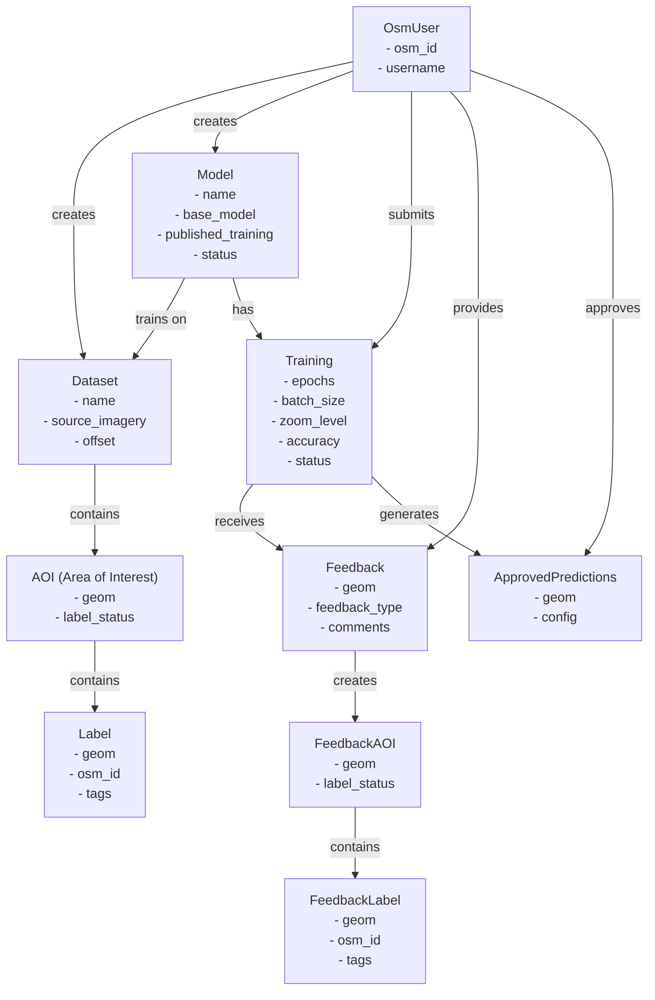
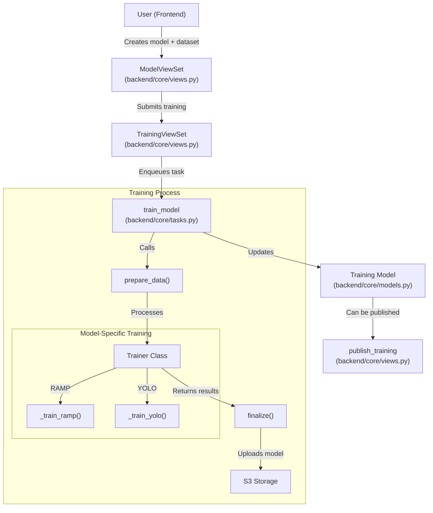
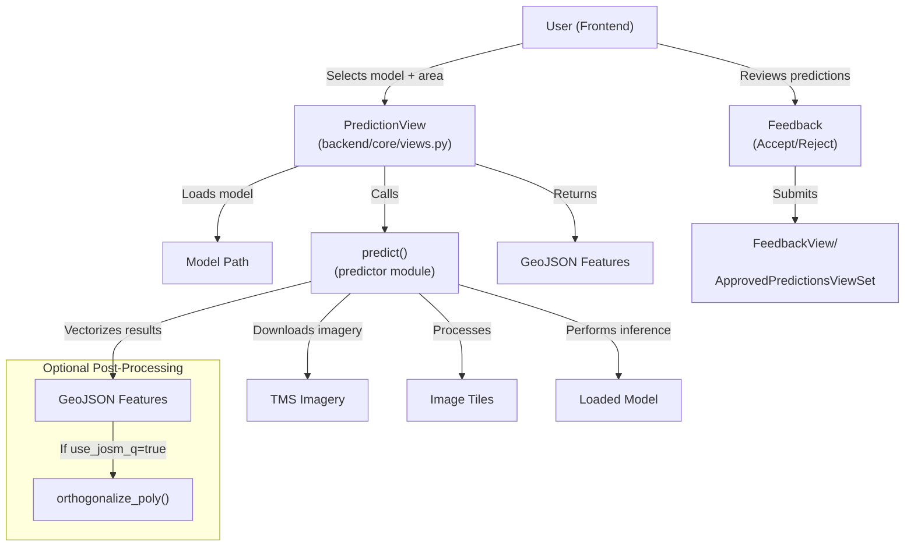
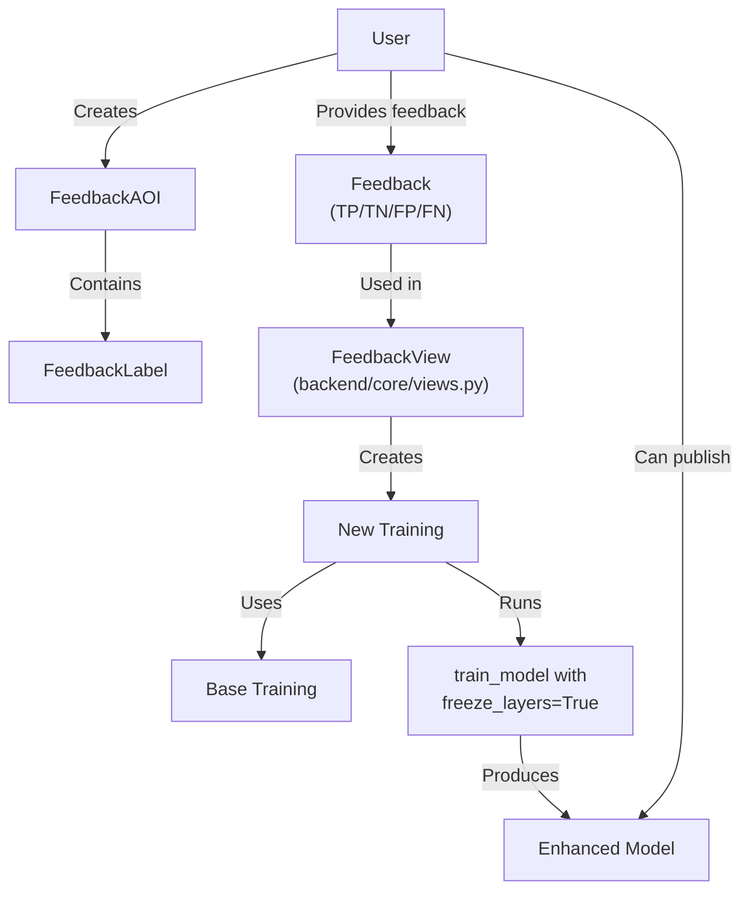
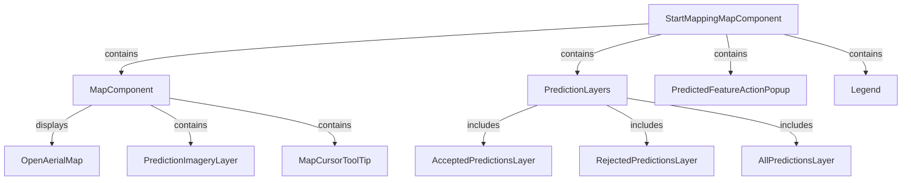
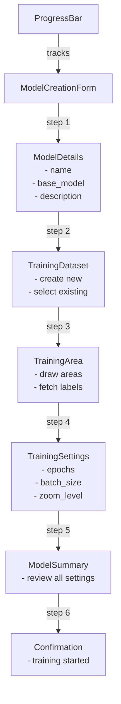

# Key Concepts and Terminology

<details>
<summary>Relevant source files</summary>

The following files were used as context for generating this wiki page:

- [backend/aiproject/settings.py](backend/aiproject/settings.py)
- [backend/aiproject/urls.py](backend/aiproject/urls.py)
- [backend/core/models.py](backend/core/models.py)
- [backend/core/serializers.py](backend/core/serializers.py)
- [backend/core/tasks.py](backend/core/tasks.py)
- [backend/core/urls.py](backend/core/urls.py)
- [backend/core/utils.py](backend/core/utils.py)
- [backend/core/views.py](backend/core/views.py)
- [backend/requirements.txt](backend/requirements.txt)
- [frontend/src/components/ui/form/help-text/help-text.tsx](frontend/src/components/ui/form/help-text/help-text.tsx)
- [frontend/src/constants/ui-contents/models-content.ts](frontend/src/constants/ui-contents/models-content.ts)
- [frontend/src/constants/ui-contents/start-mapping-content.ts](frontend/src/constants/ui-contents/start-mapping-content.ts)
- [frontend/src/features/model-creation/components/progress-bar.tsx](frontend/src/features/model-creation/components/progress-bar.tsx)
- [frontend/src/features/model-creation/components/training-dataset/create-new.tsx](frontend/src/features/model-creation/components/training-dataset/create-new.tsx)
- [frontend/src/features/model-creation/components/training-dataset/select-existing.tsx](frontend/src/features/model-creation/components/training-dataset/select-existing.tsx)
- [frontend/src/features/start-mapping/components/map/legend-control.tsx](frontend/src/features/start-mapping/components/map/legend-control.tsx)
- [frontend/src/features/start-mapping/components/map/map.tsx](frontend/src/features/start-mapping/components/map/map.tsx)
- [frontend/src/types/api.ts](frontend/src/types/api.ts)
- [frontend/src/types/ui-contents.ts](frontend/src/types/ui-contents.ts)
- [frontend/src/utils/__tests__/geo/geometry-utils.test.ts](frontend/src/utils/__tests__/geo/geometry-utils.test.ts)

</details>


This document defines and explains the fundamental concepts and technical terminology used throughout the fAIr AI-assisted mapping system. Understanding these terms is essential for both developers working with the codebase and users who want to understand how the system operates at a technical level. For information about the system architecture, see [System Architecture](#1.1).

## Core System Entities

The fAIr system is built around several key entities that form the foundation of the application. These entities are represented as Django models in the backend and have corresponding TypeScript interfaces in the frontend.

### Entity Relationship Diagram



Sources: [backend/core/models.py:11-212](). [frontend/src/types/api.ts:1-237]()

### Dataset

A Dataset represents a collection of geographical data used for training AI models. It serves as a container for Areas of Interest (AOIs) and their associated labels.

Key attributes:
- **name**: A descriptive name
- **source_imagery**: URL to the imagery tiles (TMS URL format)
- **status**: Current state (ACTIVE=0, ARCHIVED=1, DRAFT=-1)
- **offset**: [x, y] coordinates to adjust for imagery misalignment

```python
# From backend/core/models.py
class Dataset(models.Model):
    class DatasetStatus(models.IntegerChoices):
        ARCHIVED = 1
        ACTIVE = 0
        DRAFT = -1

    name = models.CharField(max_length=50)
    user = models.ForeignKey(OsmUser, to_field="osm_id", on_delete=models.CASCADE)
    source_imagery = models.URLField(blank=True, null=True)
    status = models.IntegerField(default=-1, choices=DatasetStatus.choices)
    offset = ArrayField(
        base_field=models.FloatField(),
        size=2,
        default=[0.0, 0.0],
        verbose_name="Imagery Offset [x, y]",
    )
```

Sources: [backend/core/models.py:11-37]()

### Area of Interest (AOI)

An Area of Interest (AOI) defines a specific geographical region within a Dataset where training data is collected.

Key attributes:
- **geom**: Geographic polygon defining the area (stored as PolygonField)
- **label_status**: Status of label collection (DOWNLOADED=1, NOT_DOWNLOADED=-1, RUNNING=0)
- **label_fetched**: Timestamp when labels were last fetched

```python
# From backend/core/models.py
class AOI(models.Model):
    class DownloadStatus(models.IntegerChoices):
        DOWNLOADED = 1
        NOT_DOWNLOADED = -1
        RUNNING = 0

    dataset = models.ForeignKey(Dataset, to_field="id", on_delete=models.CASCADE)
    geom = geomodels.PolygonField(srid=4326)
    label_status = models.IntegerField(default=-1, choices=DownloadStatus.choices)
    label_fetched = models.DateTimeField(null=True, blank=True)
```

Sources: [backend/core/models.py:40-52]()

### Label

Labels are the actual building outlines or features within Areas of Interest, used as ground truth for training models.

Key attributes:
- **geom**: Geographic shape of the feature (stored as GeometryField)
- **osm_id**: OpenStreetMap ID if imported from OSM
- **tags**: Associated metadata (JSON format)

```python
# From backend/core/models.py
class Label(models.Model):
    aoi = models.ForeignKey(AOI, to_field="id", on_delete=models.CASCADE)
    geom = geomodels.GeometryField(srid=4326)
    osm_id = models.BigIntegerField(null=True, blank=True)
    tags = models.JSONField(null=True, blank=True)
```

Sources: [backend/core/models.py:55-61]()

### Model

A Model represents an AI model trained to detect features (primarily buildings) in satellite or aerial imagery.

Key attributes:
- **name**: Descriptive name
- **base_model**: Foundation model type (RAMP, YOLO_V8_V1, YOLO_V8_V2)
- **status**: Current state (PUBLISHED=0, ARCHIVED=1, DRAFT=-1)
- **published_training**: ID of the currently published training

```python
# From backend/core/models.py
class Model(models.Model):
    BASE_MODEL_CHOICES = (
        ("RAMP", "RAMP"),
        ("YOLO_V8_V1", "YOLO_V8_V1"),
        ("YOLO_V8_V2", "YOLO_V8_V2"),
    )

    class ModelStatus(models.IntegerChoices):
        ARCHIVED = 1
        PUBLISHED = 0
        DRAFT = -1

    dataset = models.ForeignKey(Dataset, to_field="id", on_delete=models.DO_NOTHING)
    name = models.CharField(max_length=50)
    description = models.TextField(max_length=4000, null=True, blank=True)
    user = models.ForeignKey(OsmUser, to_field="osm_id", on_delete=models.CASCADE)
    published_training = models.PositiveIntegerField(null=True, blank=True)
    status = models.IntegerField(default=-1, choices=ModelStatus.choices)
    base_model = models.CharField(
        choices=BASE_MODEL_CHOICES, default="RAMP", max_length=50
    )
```

Sources: [backend/core/models.py:63-87]()

### Training

Training represents a specific instance of training a Model with particular parameters.

Key attributes:
- **zoom_level**: Array of zoom levels used for imagery
- **epochs**: Number of training iterations
- **batch_size**: Number of samples processed in each step
- **accuracy**: Achieved training accuracy
- **status**: Current state (SUBMITTED, RUNNING, FINISHED, FAILED)
- **task_id**: ID of the asynchronous task running the training

```python
# From backend/core/models.py
class Training(models.Model):
    STATUS_CHOICES = (
        ("SUBMITTED", "SUBMITTED"),
        ("RUNNING", "RUNNING"),
        ("FINISHED", "FINISHED"),
        ("FAILED", "FAILED"),
    )
    model = models.ForeignKey(Model, to_field="id", on_delete=models.CASCADE)
    source_imagery = models.URLField(blank=True, null=True)
    description = models.TextField(max_length=500, null=True, blank=True)
    status = models.CharField(
        choices=STATUS_CHOICES, default="SUBMITTED", max_length=10
    )
    task_id = models.CharField(null=True, blank=True, max_length=100)
    zoom_level = ArrayField(
        models.PositiveIntegerField(),
        size=4,
    )
    accuracy = models.FloatField(null=True, blank=True)
    epochs = models.PositiveIntegerField()
    chips_length = models.PositiveIntegerField(default=0)
    batch_size = models.PositiveIntegerField()
    freeze_layers = models.BooleanField(default=False)
```

Sources: [backend/core/models.py:88-116](), [backend/core/serializers.py:124-241]()

### Feedback

Feedback represents user input on model predictions, helping to improve model accuracy.

Key attributes:
- **geom**: Geometry of the predicted feature being evaluated
- **feedback_type**: Type of feedback (TP=True Positive, FP=False Positive, TN=True Negative, FN=False Negative)
- **comments**: Optional user comments

```python
# From backend/core/models.py
class Feedback(models.Model):
    FEEDBACK_TYPE = (
        ("TP", "True Positive"),
        ("TN", "True Negative"),
        ("FP", "False Positive"),
        ("FN", "False Negative"),
    )
    geom = geomodels.GeometryField(srid=4326)
    training = models.ForeignKey(Training, to_field="id", on_delete=models.CASCADE)
    feedback_type = models.CharField(choices=FEEDBACK_TYPE, max_length=10)
    comments = models.TextField(max_length=100, null=True, blank=True)
    user = models.ForeignKey(OsmUser, to_field="osm_id", on_delete=models.CASCADE)
```

Sources: [backend/core/models.py:118-135]()

### Approved Predictions

Approved Predictions are model predictions that have been validated by users.

Key attributes:
- **geom**: Geometry of the approved prediction
- **config**: Configuration used to generate the prediction

```python
# From backend/core/models.py
class ApprovedPredictions(models.Model):
    training = models.ForeignKey(Training, to_field="id", on_delete=models.DO_NOTHING)
    config = models.JSONField(null=True, blank=True)
    geom = geomodels.GeometryField(srid=4326)
    user = models.ForeignKey(OsmUser, to_field="osm_id", on_delete=models.CASCADE)
```

Sources: [backend/core/models.py:164-174]()

## Machine Learning Concepts

### Base Models

The system supports several base models for building detection:

| Base Model   | Description                                                             | Characteristics                                  |
|--------------|-------------------------------------------------------------------------|--------------------------------------------------|
| RAMP         | Rapid Mapping model (default)                                           | Fast training, good accuracy for basic buildings |
| YOLO_V8_V1   | You Only Look Once version 8 (variant 1)                                | Well-balanced with good general accuracy         |
| YOLO_V8_V2   | You Only Look Once version 8 (variant 2)                                | Advanced, designed for diverse feature detection |

Each base model requires specific configurations and offers different trade-offs between speed and accuracy.

Sources: [backend/core/models.py:63-69](), [backend/aiproject/settings.py:70-80](), [frontend/src/constants/ui-contents/models-content.ts:37-44]()

### Training Workflow



Sources: [backend/core/tasks.py:99-467](), [backend/core/views.py:93-264](), [backend/core/views.py:885-914]()

The training workflow involves:

1. **Dataset Preparation**: User creates a dataset and defines AOIs, then fetches or uploads labels.
2. **Training Configuration**: User creates a model and configures training parameters (epochs, batch size, etc.).
3. **Training Submission**: The `TrainingViewSet` receives the request and enqueues an asynchronous task.
4. **Asynchronous Processing**: The `train_model` Celery task:
   - Downloads imagery for AOIs from the specified source
   - Prepares labels and imagery data
   - Invokes the appropriate training method (RAMP or YOLO)
   - Saves the trained model artifacts
   - Updates the training status and metadata
5. **Model Publishing**: User can publish a successful training to make it available for predictions.

Sources: [backend/core/tasks.py:380-467]()

### Prediction Workflow



Sources: [backend/core/views.py:786-883](), [backend/core/views.py:508-543](), [backend/core/views.py:717-777]()

The prediction workflow involves:

1. **Model Selection**: User selects a published model to use for predictions.
2. **Area Definition**: User zooms to an area of interest on the map.
3. **Parameter Configuration**: User configures prediction parameters:
   - **confidence**: Minimum confidence threshold (0-100%)
   - **use_josm_q**: Option to orthogonalize building shapes
   - **max_angle_change**: Maximum angle change for orthogonalization
   - **skew_tolerance**: Tolerance for skewed angles
4. **Prediction Generation**: The system:
   - Loads the trained model
   - Downloads imagery for the selected area
   - Runs inference on the imagery
   - Post-processes results (optional orthogonalization)
   - Returns predictions as GeoJSON features
5. **User Review**: User reviews and provides feedback on predictions:
   - **Accept**: Approves predictions for potential OSM import
   - **Reject**: Flags incorrect predictions
   - **Comment**: Provides feedback with comments

Sources: [frontend/src/types/api.ts:210-227](), [frontend/src/features/start-mapping/components/map/map.tsx:32-174]()

## Model Enhancement and Feedback

### Feedback Mechanism



Sources: [backend/core/views.py:717-777](), [backend/core/tasks.py:380-467]()

The feedback mechanism allows users to:

1. **Provide direct feedback** on predictions (True Positive, False Positive, etc.)
2. **Create FeedbackAOIs** with additional training examples
3. **Fetch OSM data** for feedback areas using `RawdataApiFeedbackView`
4. **Submit a feedback-based training** that enhances the existing model

This feedback loop is crucial for improving model accuracy over time through continuous learning.

Sources: [backend/core/views.py:278-322](), [backend/core/views.py:546-575]()

## Technical Configuration Parameters

### Training Parameters

| Parameter | Description | Default/Range | Configuration Location |
|-----------|-------------|--------------|------------------------|
| epochs | Number of complete training iterations | RAMP: 40 max, YOLO: 200 max | aiproject/settings.py |
| batch_size | Number of samples processed per step | Max: 8 | aiproject/settings.py |
| zoom_level | Zoom levels of imagery used | Typically 19-21 | Model-dependent |
| freeze_layers | Whether to freeze base model layers | true/false | Training-specific |
| multimasks | Use multiple masking techniques | true/false | Training-specific |

### Prediction Parameters

| Parameter | Description | Default/Range | Configuration Location |
|-----------|-------------|--------------|------------------------|
| confidence | Minimum confidence threshold | 0-100% | UI configurable |
| use_josm_q | Orthogonalize building shapes | true/false | UI configurable |
| max_angle_change | Maximum angle change in orthogonalization | 0-45 degrees | UI configurable |
| skew_tolerance | Tolerance for skewed angles | 0-45 degrees | UI configurable |
| tile_overlap_distance | Overlap between adjacent tiles | 0.0-1.0 | UI configurable |

Sources: [backend/aiproject/settings.py:70-84](), [backend/core/serializers.py:305-449](), [frontend/src/constants/ui-contents/start-mapping-content.ts:41-72]()

## Frontend Components

### Map Visualization

The map visualization system is built around several key components:



Sources: [frontend/src/features/start-mapping/components/map/map.tsx:32-174](), [frontend/src/features/start-mapping/components/map/legend-control.tsx:1-110]()

Key mapping components include:
- **MapComponent**: Core map rendering container
- **OpenAerialMap**: Imagery layer from TMS sources
- **PredictionLayers**: Container for prediction visualization
- **AcceptedPredictionsLayer**: Shows accepted predictions
- **RejectedPredictionsLayer**: Shows rejected predictions
- **AllPredictionsLayer**: Shows all predictions
- **PredictedFeatureActionPopup**: UI for interacting with predictions
- **Legend**: Displays a legend for the map

Sources: [frontend/src/features/start-mapping/components/map/map.tsx:159-175]()

### Model Creation Workflow

The model creation process is a multi-step workflow:



Sources: [frontend/src/features/model-creation/components/progress-bar.tsx:14-91](), [frontend/src/constants/ui-contents/models-content.ts:21-205]()

The workflow guides users through:
1. **Model Details**: Setting basic model information
2. **Training Dataset**: Creating or selecting a dataset
3. **Training Area**: Defining geographic areas and fetching labels
4. **Training Settings**: Configuring training parameters
5. **Model Summary**: Reviewing all settings
6. **Confirmation**: Submitting and starting the training process

Sources: [frontend/src/features/model-creation/components/training-dataset/create-new.tsx:20-170](), [frontend/src/features/model-creation/components/training-dataset/select-existing.tsx:12-86]()

## API Structure

The fAIr backend provides a comprehensive RESTful API for managing all aspects of the system:

| API Endpoint | Purpose | View/ViewSet | HTTP Methods |
|--------------|---------|--------------|--------------|
| /api/v1/dataset/ | Manage datasets | DatasetViewSet | GET, POST, PUT, DELETE |
| /api/v1/aoi/ | Manage areas of interest | AOIViewSet | GET, POST, PUT, DELETE |
| /api/v1/label/ | Manage labels | LabelViewSet | GET, POST, PUT, DELETE |
| /api/v1/model/ | Manage models | ModelViewSet | GET, POST, PUT, DELETE |
| /api/v1/training/ | Manage trainings | TrainingViewSet | GET, POST, DELETE |
| /api/v1/feedback/ | Manage feedback | FeedbackViewSet | GET, POST, PATCH, DELETE |
| /api/v1/prediction/ | Generate predictions | PredictionView | POST |
| /api/v1/training/publish/{id}/ | Publish a training | publish_training | POST |

Sources: [backend/core/urls.py:38-90](), [backend/aiproject/urls.py:38-58]()

## Environment Configuration

The system's behavior can be customized through environment variables in `aiproject/settings.py`:

| Environment Variable | Purpose | Default |
|----------------------|---------|---------|
| RAMP_EPOCHS_LIMIT | Maximum epochs for RAMP models | 40 |
| RAMP_BATCH_SIZE_LIMIT | Maximum batch size for RAMP | 8 |
| YOLO_EPOCHS_LIMIT | Maximum epochs for YOLO models | 200 |
| YOLO_BATCH_SIZE_LIMIT | Maximum batch size for YOLO | 8 |
| BUCKET_NAME | S3 bucket for model storage | fair-dev |
| EXPORT_TOOL_API_URL | URL for raw data API | https://api-prod.raw-data.hotosm.org/v1 |
| ENABLE_PREDICTION_API | Enable/disable prediction API | False |

Sources: [backend/aiproject/settings.py:70-84](), [backend/aiproject/settings.py:254-254]()

## Asynchronous Processing

The fAIr system uses Celery and Redis for asynchronous processing of computationally intensive tasks:

| Component | Purpose | Configuration |
|-----------|---------|---------------|
| Celery Worker | Executes background tasks | CELERY_BROKER_URL |
| Redis | Message broker and result backend | CELERY_RESULT_BACKEND |
| train_model | Main training task | Queued based on model type |
| process_rawdata_task | Processes OSM data | Async task |

Sources: [backend/core/tasks.py:380-467](), [backend/aiproject/settings.py:215-232]()

The asynchronous architecture ensures that resource-intensive operations like model training don't block the main application thread, allowing the UI to remain responsive while these tasks run in the background.

Sources: [backend/core/views.py:586-610](), [backend/core/views.py:674-714]()