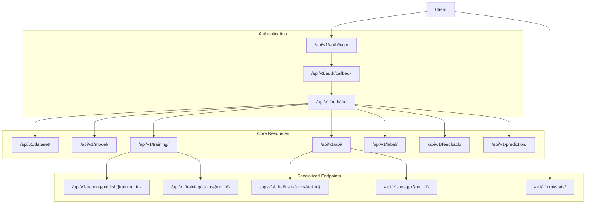
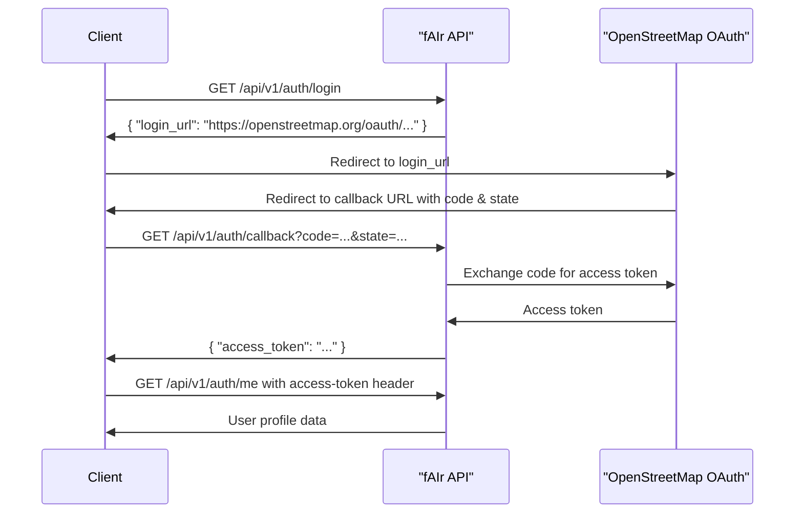
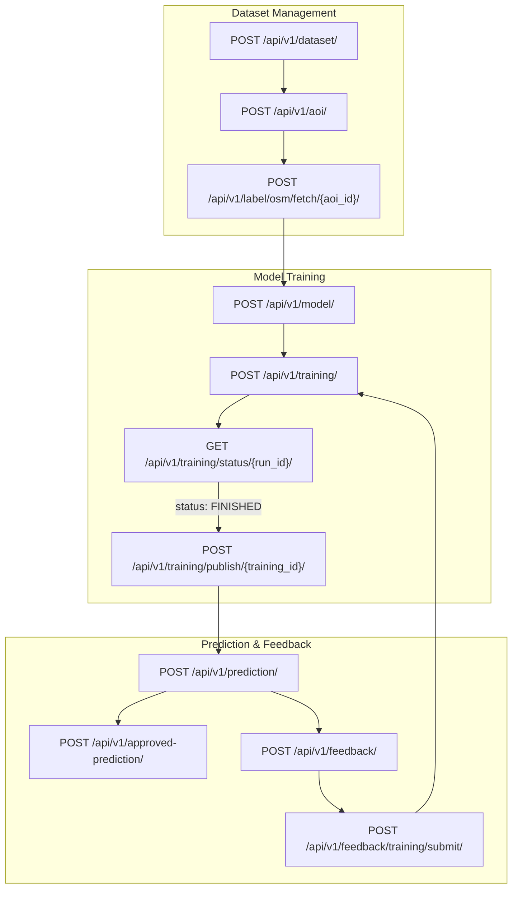

# API Endpoints

<details>
<summary>Relevant source files</summary>

The following files were used as context for generating this wiki page:

- [backend/.gitignore](backend/.gitignore)
- [backend/.pre-commit-config.yaml](backend/.pre-commit-config.yaml)
- [backend/aiproject/settings.py](backend/aiproject/settings.py)
- [backend/aiproject/urls.py](backend/aiproject/urls.py)
- [backend/core/models.py](backend/core/models.py)
- [backend/core/serializers.py](backend/core/serializers.py)
- [backend/core/tasks.py](backend/core/tasks.py)
- [backend/core/urls.py](backend/core/urls.py)
- [backend/core/utils.py](backend/core/utils.py)
- [backend/core/views.py](backend/core/views.py)
- [backend/login/views.py](backend/login/views.py)
- [backend/pdm.lock](backend/pdm.lock)
- [backend/pyproject.toml](backend/pyproject.toml)
- [backend/requirements.txt](backend/requirements.txt)
- [frontend/src/features/start-mapping/components/map/map.tsx](frontend/src/features/start-mapping/components/map/map.tsx)
- [frontend/src/types/api.ts](frontend/src/types/api.ts)
- [frontend/src/utils/__tests__/geo/geometry-utils.test.ts](frontend/src/utils/__tests__/geo/geometry-utils.test.ts)

</details>


This document provides detailed information about the RESTful API endpoints available in the fAIr system. These endpoints form the backend interface that allows the frontend and other clients to interact with the system's functionality for AI-assisted mapping. For information about the backend system as a whole, see [Backend System](#2).

## API Overview

The fAIr API is organized around REST principles. It accepts JSON-encoded request bodies, returns JSON-encoded responses, and uses standard HTTP response codes to indicate the success or failure of requests. The API is versioned with all endpoints prefixed with `/api/v1/`.



Sources: [backend/aiproject/urls.py:37-58](), [backend/core/urls.py:43-91]()

## Authentication

The fAIr system uses OpenStreetMap (OSM) OAuth for authentication. All API requests that require authentication must include an `access-token` header with a valid OSM access token.

### Authentication Endpoints

| Endpoint | Method | Description |
|----------|--------|-------------|
| `/api/v1/auth/login` | GET | Generates an OSM login URL to initiate the authentication flow |
| `/api/v1/auth/callback` | GET | Callback endpoint for OSM OAuth, returns an access token |
| `/api/v1/auth/me` | GET | Returns the authenticated user's profile information |
| `/api/v1/auth/me` | PATCH | Updates the authenticated user's profile information |

#### Login Flow



Sources: [backend/login/views.py:34-46](), [backend/login/views.py:48-62](), [backend/login/views.py:64-99]()

## Resource Endpoints

### Dataset Endpoints

The Dataset resource represents a collection of geospatial data that can be used for training AI models.

| Endpoint | Method | Description |
|----------|--------|-------------|
| `/api/v1/dataset/` | GET | List all datasets (pagination supported) |
| `/api/v1/dataset/{id}/` | GET | Retrieve a specific dataset |
| `/api/v1/dataset/` | POST | Create a new dataset |
| `/api/v1/dataset/{id}/` | PUT | Update a dataset (full update) |
| `/api/v1/dataset/{id}/` | PATCH | Update a dataset (partial update) |
| `/api/v1/dataset/{id}/` | DELETE | Delete a dataset |
| `/api/v1/datasets/centroid/` | GET | Get centroid information for all datasets (for map visualization) |

#### Dataset Object Structure

```
{
  "id": 1,
  "name": "Building Dataset for Accra",
  "source_imagery": "https://server.com/imagery/{z}/{x}/{y}.png",
  "last_modified": "2023-06-15T10:30:45Z",
  "created_at": "2023-06-10T08:15:20Z",
  "status": 0,
  "models_count": 3,
  "offset": [0.0, 0.0],
  "user": {
    "osm_id": 12345,
    "username": "johndoe"
  }
}
```

Sources: [backend/core/views.py:93-116](), [backend/core/serializers.py:32-70](), [backend/core/models.py:11-38](), [backend/core/views.py:363-373]()

### Area of Interest (AOI) Endpoints

AOIs represent specific geographic areas within a dataset that contain training data.

| Endpoint | Method | Description |
|----------|--------|-------------|
| `/api/v1/aoi/` | GET | List all AOIs (filterable by dataset) |
| `/api/v1/aoi/{id}/` | GET | Retrieve a specific AOI |
| `/api/v1/aoi/` | POST | Create a new AOI |
| `/api/v1/aoi/{id}/` | DELETE | Delete an AOI |
| `/api/v1/aoi/gpx/{aoi_id}/` | GET | Generate GPX format of an AOI's boundary |
| `/api/v1/label/osm/fetch/{aoi_id}/` | POST | Fetch OpenStreetMap data for an AOI |

#### AOI Object Structure

```
{
  "type": "Feature",
  "geometry": {
    "type": "Polygon",
    "coordinates": [[[lon1, lat1], [lon2, lat2], ...]]
  },
  "properties": {
    "dataset": 1,
    "label_status": -1,
    "label_fetched": null,
    "created_at": "2023-06-12T14:20:30Z",
    "last_modified": "2023-06-12T14:20:30Z"
  }
}
```

Sources: [backend/core/views.py:389-398](), [backend/core/serializers.py:171-197](), [backend/core/models.py:40-52](), [backend/core/views.py:578-594](), [backend/core/views.py:917-923]()

### Label Endpoints

Labels represent the ground truth features extracted from OpenStreetMap within an AOI.

| Endpoint | Method | Description |
|----------|--------|-------------|
| `/api/v1/label/` | GET | List all labels (filterable by AOI or dataset) |
| `/api/v1/label/{id}/` | GET | Retrieve a specific label |
| `/api/v1/label/` | POST | Create a new label |
| `/api/v1/label/{id}/` | PUT | Update a label |
| `/api/v1/label/{id}/` | DELETE | Delete a label |
| `/api/v1/label/upload/{aoi_id}/` | POST | Upload GeoJSON labels for an AOI |

#### Label Object Structure

```
{
  "type": "Feature",
  "geometry": {
    "type": "Polygon",
    "coordinates": [[[lon1, lat1], [lon2, lat2], ...]]
  },
  "properties": {
    "aoi": 1,
    "osm_id": 987654321,
    "tags": {
      "building": "yes",
      "building:levels": "2",
      "amenity": "school"
    },
    "created_at": "2023-06-12T15:45:22Z"
  }
}
```

Sources: [backend/core/views.py:400-432](), [backend/core/serializers.py:240-248](), [backend/core/models.py:55-61](), [backend/core/views.py:435-486]()

### Model Endpoints

Models represent AI models that can be trained to identify features in imagery.

| Endpoint | Method | Description |
|----------|--------|-------------|
| `/api/v1/model/` | GET | List all models (pagination supported) |
| `/api/v1/model/{id}/` | GET | Retrieve a specific model |
| `/api/v1/model/` | POST | Create a new model |
| `/api/v1/model/{id}/` | PUT | Update a model (full update) |
| `/api/v1/model/{id}/` | PATCH | Update a model (partial update) |
| `/api/v1/model/{id}/` | DELETE | Delete a model |
| `/api/v1/models/centroid/` | GET | Get centroid information for all models (for map visualization) |

#### Model Object Structure

```
{
  "id": 1,
  "name": "Building Detection Model v1",
  "created_at": "2023-06-15T11:20:45Z",
  "last_modified": "2023-06-20T09:30:15Z",
  "description": "Model for detecting buildings in urban areas",
  "user": {
    "osm_id": 12345,
    "username": "johndoe"
  },
  "published_training": 3,
  "status": 0,
  "dataset": 1,
  "accuracy": 85.7,
  "base_model": "RAMP",
  "thumbnail_url": "https://server.com/imagery/18/12345/67890.png"
}
```

Sources: [backend/core/views.py:324-347](), [backend/core/serializers.py:72-122](), [backend/core/models.py:63-86](), [backend/core/views.py:350-360]()

### Training Endpoints

Trainings represent individual training runs for models.

| Endpoint | Method | Description |
|----------|--------|-------------|
| `/api/v1/training/` | GET | List all trainings (filterable by model, status, user) |
| `/api/v1/training/{id}/` | GET | Retrieve a specific training |
| `/api/v1/training/` | POST | Create and start a new training |
| `/api/v1/training/{id}/` | DELETE | Delete a training |
| `/api/v1/training/status/{run_id}/` | GET | Check the status of a running training task |
| `/api/v1/training/publish/{training_id}/` | POST | Publish a successfully completed training |
| `/api/v1/training/terminate/{training_id}/` | POST | Terminate a running training |

#### Training Object Structure

```
{
  "id": 3,
  "source_imagery": "https://server.com/imagery/{z}/{x}/{y}.png",
  "description": "RAMP training with optimized parameters",
  "created_at": "2023-06-18T14:30:22Z",
  "status": "FINISHED",
  "task_id": "12345-abcde-67890",
  "zoom_level": [19, 20, 21],
  "started_at": "2023-06-18T14:30:25Z",
  "finished_at": "2023-06-18T16:15:40Z",
  "accuracy": 85.7,
  "epochs": 20,
  "chips_length": 1056,
  "batch_size": 8,
  "freeze_layers": false,
  "model": {
    "id": 1,
    "name": "Building Detection Model v1",
    "dataset": 1,
    "base_model": "RAMP",
    "status": 0
  },
  "user": {
    "osm_id": 12345,
    "username": "johndoe"
  },
  "feedback_count": 0,
  "approved_predictions_count": 0
}
```

Sources: [backend/core/views.py:124-147](), [backend/core/views.py:244-275](), [backend/core/serializers.py:124-241](), [backend/core/models.py:88-116](), [backend/core/views.py:674-714](), [backend/core/views.py:885-913](), [backend/core/tasks.py:380-467]()

### Feedback Endpoints

Feedback represents user corrections to model predictions that can be used to improve the model.

| Endpoint | Method | Description |
|----------|--------|-------------|
| `/api/v1/feedback/` | GET | List all feedback items (filterable by training, user, type) |
| `/api/v1/feedback/{id}/` | GET | Retrieve a specific feedback item |
| `/api/v1/feedback/` | POST | Create a new feedback item |
| `/api/v1/feedback/{id}/` | PATCH | Update a feedback item |
| `/api/v1/feedback/{id}/` | DELETE | Delete a feedback item |
| `/api/v1/feedback-aoi/` | GET/POST/PATCH/DELETE | CRUD for feedback AOIs |
| `/api/v1/feedback-label/` | GET/POST/PATCH/DELETE | CRUD for feedback labels |
| `/api/v1/feedback/training/submit/` | POST | Submit feedback for retraining a model |

#### Feedback Object Structure

```
{
  "type": "Feature",
  "geometry": {
    "type": "Polygon",
    "coordinates": [[[lon1, lat1], [lon2, lat2], ...]]
  },
  "properties": {
    "id": 1,
    "training": 3,
    "created_at": "2023-06-25T10:15:30Z",
    "zoom_level": 20,
    "feedback_type": "FP",
    "comments": "This is not a building, but a shadow",
    "user": 12345,
    "source_imagery": "https://server.com/imagery/{z}/{x}/{y}.png"
  }
}
```

Sources: [backend/core/views.py:278-293](), [backend/core/serializers.py:221-237](), [backend/core/models.py:118-135](), [backend/core/views.py:295-322](), [backend/core/views.py:717-777]()

### Prediction Endpoint

The prediction endpoint allows making predictions using trained models.

| Endpoint | Method | Description |
|----------|--------|-------------|
| `/api/v1/prediction/` | POST | Generate predictions for a given area using a published model |
| `/api/v1/approved-prediction/` | GET | List approved predictions (filterable by training) |
| `/api/v1/approved-prediction/` | POST | Approve a prediction |
| `/api/v1/approved-prediction/{id}/` | DELETE | Delete an approved prediction |

#### Prediction Request Structure

```
{
  "bbox": [lon1, lat1, lon2, lat2],
  "model_id": 1,
  "zoom_level": 20,
  "use_josm_q": true,
  "source": "https://server.com/imagery/{z}/{x}/{y}.png",
  "confidence": 80,
  "max_angle_change": 15,
  "skew_tolerance": 15,
  "tolerance": 0.5,
  "tile_overlap_distance": 0.15
}
```

Sources: [backend/core/views.py:786-883](), [backend/core/serializers.py:360-449](), [backend/core/views.py:508-543](), [backend/core/serializers.py:250-255](), [backend/core/models.py:164-174]()

## Utility Endpoints

### Workspace Endpoints

These endpoints provide access to training workspace files.

| Endpoint | Method | Description |
|----------|--------|-------------|
| `/api/v1/workspace/{lookup_dir}/` | GET | List files and directories in a training workspace |
| `/api/v1/workspace/download/{lookup_dir}/` | GET | Download a file from the training workspace |

Sources: [backend/core/views.py:935-965](), [backend/core/utils.py:105-123](), [backend/core/utils.py:60-70]()

### Data Conversion Endpoints

| Endpoint | Method | Description |
|----------|--------|-------------|
| `/api/v1/geojson2osm/` | POST | Convert GeoJSON to OSM XML format |
| `/api/v1/conflate/` | POST | Conflate GeoJSON with existing OSM data |

Sources: [backend/core/views.py:648-671]()

### Notification Endpoints

| Endpoint | Method | Description |
|----------|--------|-------------|
| `/api/v1/notifications/me` | GET | List user notifications |
| `/api/v1/notifications/mark-as-read/{notification_id}/` | POST | Mark a notification as read |
| `/api/v1/notifications/mark-all-as-read/` | POST | Mark all notifications as read |

Sources: [backend/core/serializers.py:531-555](), [backend/core/models.py:191-212]()

### Statistics Endpoint

| Endpoint | Method | Description |
|----------|--------|-------------|
| `/api/v1/kpi/stats/` | GET | Get key performance indicators of the system |

Sources: [backend/core/views.py:983-997]()

## Data Flow Between Endpoints

The following diagram illustrates the typical data flow between endpoints in a common workflow:



Sources: [backend/core/views.py](), [backend/core/tasks.py]()

## API Response Formats

### Successful Responses

Successful responses include the appropriate HTTP status code (typically 200 OK, 201 Created, or 204 No Content) and a JSON response body for GET, POST, and PUT/PATCH requests.

#### List Response Format (with pagination)

```
{
  "count": 42,
  "next": "https://api.example.org/api/v1/dataset/?limit=10&offset=10",
  "previous": null,
  "results": [
    {
      // resource object 1
    },
    {
      // resource object 2
    },
    // ...
  ]
}
```

#### Detail Response Format

```
{
  // Single resource object
}
```

### Error Responses

Error responses include the appropriate HTTP status code (4xx for client errors, 5xx for server errors) and a JSON response body with an error message.

```
{
  "error": "Detailed error message"
}
```

or

```
{
  "field_name": [
    "Field-specific error message"
  ],
  "another_field": [
    "Another field-specific error message"
  ]
}
```

## Authentication and Permissions

Most API endpoints require authentication using an OpenStreetMap access token, which should be included in the `access-token` HTTP header.

```
GET /api/v1/dataset/
Headers:
  access-token: your_osm_access_token
```

The API uses different permission levels:

1. **Public methods**: Endpoints marked with `public_methods = ["GET"]` allow GET requests without authentication
2. **Authenticated user methods**: All authenticated users can access these endpoints
3. **Admin/Staff methods**: Only admin or staff users can access these endpoints, such as `/api/v1/users/` and `/api/v1/banner/`

Sources: [backend/core/views.py:96-98](), [backend/login/authentication.py](), [backend/login/permissions.py]()

## API Relationships Model

The following diagram shows the relationships between the main resources in the API:

```mermaid
erDiagram
    User ||--o{ Dataset : creates
    Dataset ||--o{ AOI : contains
    AOI ||--o{ Label : has
    Dataset ||--o{ Model : trains
    Model ||--o{ Training : has
    Training ||--o{ Feedback : receives
    Training ||--o{ ApprovedPrediction : generates
    User ||--o{ Feedback : submits
    User ||--o{ ApprovedPrediction : approves
    Training ||--o{ FeedbackAOI : has
    FeedbackAOI ||--o{ FeedbackLabel : contains
    User ||--o{ UserNotification : receives
    
    User {
        int osm_id
        string username
        string email
        bool email_verified
    }
    
    Dataset {
        int id
        string name
        string source_imagery
        array offset
        int status
    }
    
    AOI {
        int id
        int dataset
        geometry geom
        int label_status
        datetime label_fetched
    }
    
    Label {
        int id
        int aoi
        geometry geom
        bigint osm_id
        json tags
    }
    
    Model {
        int id
        int dataset
        string name
        string description
        string base_model
        int published_training
        int status
    }
    
    Training {
        int id
        int model
        string source_imagery
        string description
        string status
        array zoom_level
        int epochs
        int batch_size
        float accuracy
    }
    
    Feedback {
        int id
        int training
        geometry geom
        string feedback_type
        string comments
    }
    
    ApprovedPrediction {
        int id
        int training
        geometry geom
        json config
    }
}
```

Sources: [backend/core/models.py](), [backend/login/models.py]()