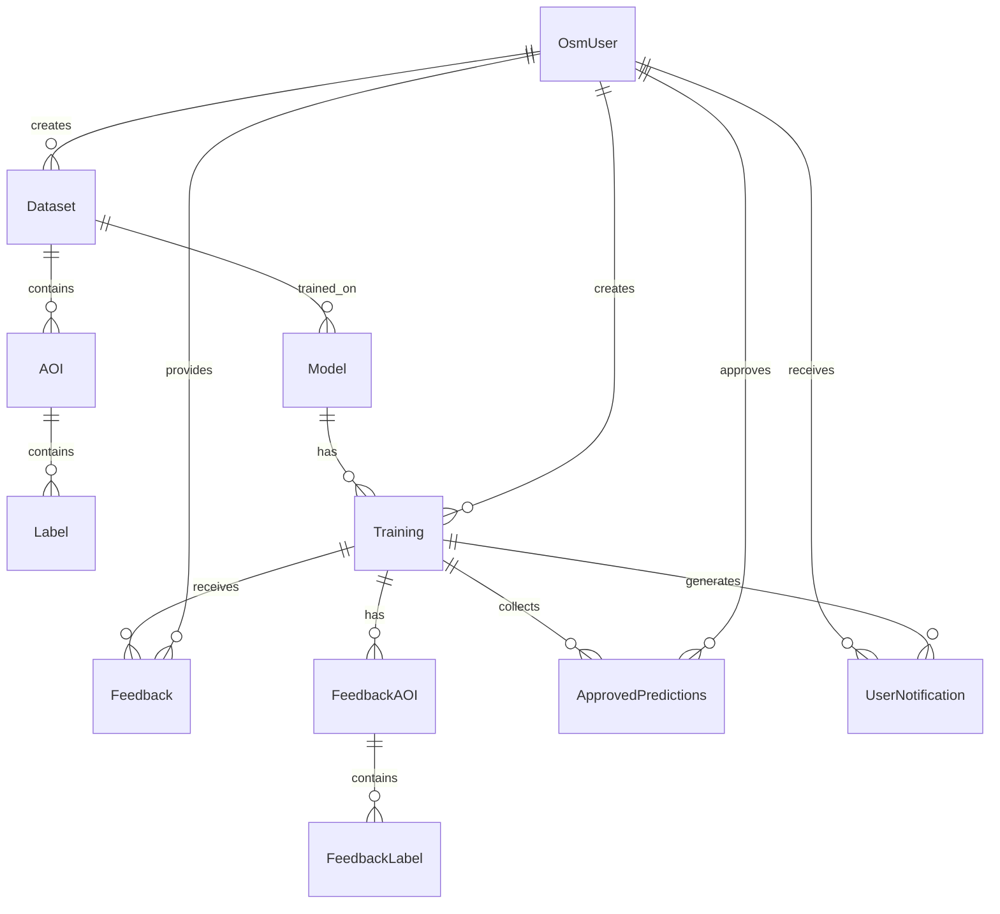
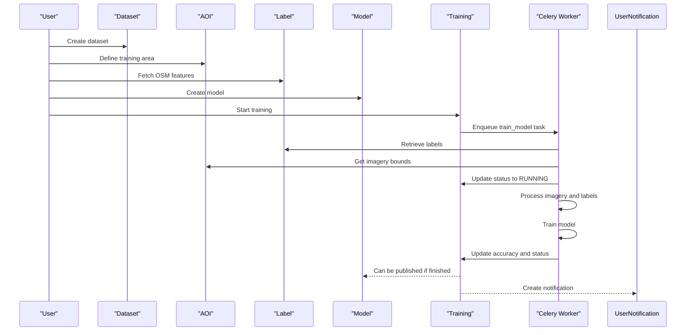
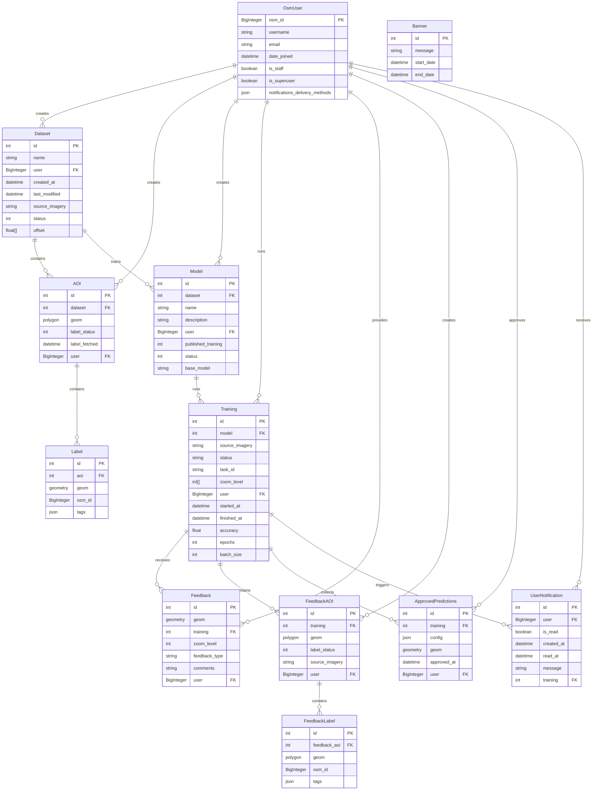

# Data Models

<details>
<summary>Relevant source files</summary>

The following files were used as context for generating this wiki page:

- [.github/workflows/backend_build.yml](.github/workflows/backend_build.yml)
- [backend/README.md](backend/README.md)
- [backend/aiproject/settings.py](backend/aiproject/settings.py)
- [backend/aiproject/urls.py](backend/aiproject/urls.py)
- [backend/api-requirements.txt](backend/api-requirements.txt)
- [backend/core/admin.py](backend/core/admin.py)
- [backend/core/models.py](backend/core/models.py)
- [backend/core/serializers.py](backend/core/serializers.py)
- [backend/core/tasks.py](backend/core/tasks.py)
- [backend/core/urls.py](backend/core/urls.py)
- [backend/core/utils.py](backend/core/utils.py)
- [backend/core/views.py](backend/core/views.py)
- [backend/docker_sample_env](backend/docker_sample_env)
- [backend/login/admin.py](backend/login/admin.py)
- [backend/login/authentication.py](backend/login/authentication.py)
- [backend/login/permissions.py](backend/login/permissions.py)
- [backend/requirements.txt](backend/requirements.txt)
- [backend/sample_env](backend/sample_env)
- [backend/tests/__init__.py](backend/tests/__init__.py)
- [backend/tests/factories.py](backend/tests/factories.py)
- [backend/tests/test_endpoints.py](backend/tests/test_endpoints.py)
- [backend/tests/test_views.py](backend/tests/test_views.py)

</details>


This document explains the database models and their relationships in the fAIr backend system. It provides a comprehensive view of the data structures that support AI-assisted mapping functionality. For information about asynchronous processing that uses these models, see [Asynchronous Processing](#2.3).

## Overview

The fAIr system uses Django's Object-Relational Mapping (ORM) with PostgreSQL/PostGIS to store and manage data. The data models represent various components including datasets, areas of interest (AOIs), AI models, trainings, labels, and user feedback.

The data models are designed to support the following key functions:
- Managing geospatial datasets and labels
- Creating and training AI models for feature detection
- Managing the training lifecycle
- Capturing user feedback and approved predictions
- User notifications and system announcements

Sources: [backend/core/models.py:1-213](backend/core/models.py:1-213)

## Core Data Model Relationships

The following diagram illustrates the relationships between the primary data models in the system:



Sources: [backend/core/models.py:1-213](backend/core/models.py:1-213), [backend/core/serializers.py:1-556](backend/core/serializers.py:1-556)

## Detailed Data Models

### User Model

The user model extends Django's authentication system with OpenStreetMap (OSM) user information:

```mermaid
classDiagram
    class "OsmUser" {
        +BigInteger osm_id
        +CharField username
        +URLField img_url
        +EmailField email
        +BooleanField email_verified
        +DateTimeField date_joined
        +DateTimeField last_login
        +JSONField notifications_delivery_methods
        +BooleanField newsletter_subscription
        +BooleanField account_deletion_requested
    }
```

The `OsmUser` model is used for authentication and is referenced by several other models to track ownership and interactions. The system uses OSM OAuth for authentication, as implemented in `OsmAuthentication` class.

Sources: [backend/login/authentication.py:1-55](backend/login/authentication.py:1-55), [backend/login/admin.py:1-94](backend/login/admin.py:1-94)

### Dataset Model

```mermaid
classDiagram
    class "Dataset" {
        +CharField name
        +ForeignKey user
        +DateTimeField last_modified
        +DateTimeField created_at
        +URLField source_imagery
        +IntegerField status
        +ArrayField offset
    }

    class "DatasetStatus" {
        <<enumeration>>
        ARCHIVED = 1
        ACTIVE = 0
        DRAFT = -1
    }
```

The `Dataset` model is the top-level container for mapping data. It has the following key fields:
- `name`: Name of the dataset
- `user`: Reference to the creator
- `source_imagery`: URL template for the imagery source
- `status`: Current status of the dataset (ACTIVE, ARCHIVED, DRAFT)
- `offset`: An array of two float values representing [x, y] offset in meters for imagery alignment

Sources: [backend/core/models.py:11-39](backend/core/models.py:11-39), [backend/core/serializers.py:32-69](backend/core/serializers.py:32-69)

### Area of Interest (AOI) Model

```mermaid
classDiagram
    class "AOI" {
        +ForeignKey dataset
        +PolygonField geom
        +IntegerField label_status
        +DateTimeField label_fetched
        +DateTimeField created_at
        +DateTimeField last_modified
        +ForeignKey user
    }

    class "DownloadStatus" {
        <<enumeration>>
        DOWNLOADED = 1
        NOT_DOWNLOADED = -1
        RUNNING = 0
    }
```

The `AOI` model represents geographic areas within a dataset that will be used for model training. Key fields include:
- `dataset`: Reference to the parent dataset
- `geom`: Polygon geometry defining the area boundary
- `label_status`: Status of label download/processing
- `label_fetched`: When labels were last fetched from OSM

Sources: [backend/core/models.py:40-53](backend/core/models.py:40-53), [backend/core/serializers.py:171-198](backend/core/serializers.py:171-198)

### Label Model

```mermaid
classDiagram
    class "Label" {
        +ForeignKey aoi
        +GeometryField geom
        +BigIntegerField osm_id
        +JSONField tags
        +DateTimeField created_at
    }
```

The `Label` model represents features (like buildings) extracted from OpenStreetMap within an Area of Interest. These labels are used as training data:
- `aoi`: Reference to the parent AOI
- `geom`: Geometry of the feature (typically a polygon for buildings)
- `osm_id`: OpenStreetMap ID of the feature
- `tags`: JSON object containing OSM tags for the feature

Sources: [backend/core/models.py:55-61](backend/core/models.py:55-61), [backend/core/serializers.py:240-249](backend/core/serializers.py:240-249)

### Model Model

```mermaid
classDiagram
    class "Model" {
        +ForeignKey dataset
        +CharField name
        +DateTimeField created_at
        +DateTimeField last_modified
        +TextField description
        +ForeignKey user
        +PositiveIntegerField published_training
        +IntegerField status
        +CharField base_model
    }

    class "ModelStatus" {
        <<enumeration>>
        ARCHIVED = 1
        PUBLISHED = 0
        DRAFT = -1
    }

    class "BASE_MODEL_CHOICES" {
        <<enumeration>>
        RAMP
        YOLO_V8_V1
        YOLO_V8_V2
    }
```

The `Model` represents an AI model configuration that can be trained to detect features. Key fields include:
- `dataset`: Reference to the dataset it's trained on
- `name`: Name of the model
- `user`: Reference to the creator
- `published_training`: ID of the published training run
- `status`: Current status of the model (PUBLISHED, ARCHIVED, DRAFT)
- `base_model`: The underlying AI model architecture (RAMP, YOLO_V8_V1, YOLO_V8_V2)

Sources: [backend/core/models.py:63-86](backend/core/models.py:63-86), [backend/core/serializers.py:72-122](backend/core/serializers.py:72-122)

### Training Model

```mermaid
classDiagram
    class "Training" {
        +ForeignKey model
        +URLField source_imagery
        +TextField description
        +DateTimeField created_at
        +CharField status
        +CharField task_id
        +ArrayField zoom_level
        +ForeignKey user
        +DateTimeField started_at
        +DateTimeField finished_at
        +FloatField accuracy
        +PositiveIntegerField epochs
        +PositiveIntegerField chips_length
        +PositiveIntegerField batch_size
        +BooleanField freeze_layers
        +PointField centroid
    }

    class "STATUS_CHOICES" {
        <<enumeration>>
        SUBMITTED
        RUNNING
        FINISHED
        FAILED
    }
```

The `Training` model represents a specific training run for a model. Key fields include:
- `model`: Reference to the model being trained
- `status`: Current status of the training (SUBMITTED, RUNNING, FINISHED, FAILED)
- `task_id`: ID of the Celery task running the training
- `zoom_level`: Array of zoom levels used for imagery
- `user`: User who initiated the training
- `accuracy`: Accuracy achieved by the model
- `epochs`: Number of training epochs
- `batch_size`: Batch size used for training
- `freeze_layers`: Whether to freeze base model layers

Sources: [backend/core/models.py:88-116](backend/core/models.py:88-116), [backend/core/serializers.py:124-241](backend/core/serializers.py:124-241), [backend/core/tasks.py:380-468](backend/core/tasks.py:380-468)

## Feedback and Prediction Models

### Feedback Model

```mermaid
classDiagram
    class "Feedback" {
        +GeometryField geom
        +ForeignKey training
        +DateTimeField created_at
        +PositiveIntegerField zoom_level
        +CharField feedback_type
        +TextField comments
        +ForeignKey user
        +URLField source_imagery
    }

    class "FEEDBACK_TYPE" {
        <<enumeration>>
        TP: "True Positive"
        TN: "True Negative"
        FP: "False Positive"
        FN: "False Negative"
    }
```

The `Feedback` model captures user feedback on model predictions:
- `geom`: Geometry of the feedback area
- `training`: Reference to the training run
- `feedback_type`: Type of feedback (TP, TN, FP, FN)
- `user`: User who provided the feedback

Sources: [backend/core/models.py:118-136](backend/core/models.py:118-136), [backend/core/serializers.py:221-238](backend/core/serializers.py:221-238)

### FeedbackAOI Model

```mermaid
classDiagram
    class "FeedbackAOI" {
        +ForeignKey training
        +PolygonField geom
        +IntegerField label_status
        +DateTimeField label_fetched
        +DateTimeField created_at
        +DateTimeField last_modified
        +URLField source_imagery
        +ForeignKey user
    }

    class "DownloadStatus" {
        <<enumeration>>
        DOWNLOADED = 1
        NOT_DOWNLOADED = -1
        RUNNING = 0
    }
```

The `FeedbackAOI` model defines areas for feedback collection:
- `training`: Reference to the training run
- `geom`: Polygon geometry defining the feedback area
- `label_status`: Status of OSM data download
- `source_imagery`: URL template for the imagery source

Sources: [backend/core/models.py:137-151](backend/core/models.py:137-151), [backend/core/serializers.py:200-219](backend/core/serializers.py:200-219)

### FeedbackLabel Model

```mermaid
classDiagram
    class "FeedbackLabel" {
        +BigIntegerField osm_id
        +ForeignKey feedback_aoi
        +JSONField tags
        +PolygonField geom
        +DateTimeField created_at
    }
```

The `FeedbackLabel` model represents features within feedback areas:
- `feedback_aoi`: Reference to the parent feedback AOI
- `geom`: Polygon geometry of the feature
- `osm_id`: OpenStreetMap ID of the feature
- `tags`: JSON object containing OSM tags

Sources: [backend/core/models.py:153-162](backend/core/models.py:153-162), [backend/core/serializers.py:257-262](backend/core/serializers.py:257-262)

### ApprovedPredictions Model

```mermaid
classDiagram
    class "ApprovedPredictions" {
        +ForeignKey training
        +JSONField config
        +GeometryField geom
        +DateTimeField approved_at
        +ForeignKey user
    }
```

The `ApprovedPredictions` model stores predictions that users have approved:
- `training`: Reference to the training run that generated the prediction
- `config`: Configuration used for vectorization/prediction
- `geom`: Geometry of the approved prediction
- `user`: User who approved the prediction

Sources: [backend/core/models.py:164-174](backend/core/models.py:164-174), [backend/core/serializers.py:250-255](backend/core/serializers.py:250-255)

## System Models

### Banner Model

```mermaid
classDiagram
    class "Banner" {
        +TextField message
        +DateTimeField start_date
        +DateTimeField end_date
        +is_displayable()
    }
```

The `Banner` model is used for system-wide announcements:
- `message`: Content of the banner
- `start_date`: When to start displaying the banner
- `end_date`: When to stop displaying the banner (optional)
- `is_displayable()`: Method to check if banner should be displayed

Sources: [backend/core/models.py:176-188](backend/core/models.py:176-188), [backend/core/serializers.py:452-460](backend/core/serializers.py:452-460)

### UserNotification Model

```mermaid
classDiagram
    class "UserNotification" {
        +ForeignKey user
        +BooleanField is_read
        +DateTimeField created_at
        +DateTimeField read_at
        +TextField message
        +ForeignKey training
        +mark_as_read()
    }
```

The `UserNotification` model stores notifications for users:
- `user`: User who receives the notification
- `is_read`: Whether the notification has been read
- `message`: Content of the notification
- `training`: Associated training run
- `mark_as_read()`: Method to mark notification as read

Sources: [backend/core/models.py:191-212](backend/core/models.py:191-212), [backend/core/serializers.py:531-556](backend/core/serializers.py:531-556)

## Data Flow During Training Process

The following sequence diagram illustrates how data flows through the models during the training process:



Sources: [backend/core/tasks.py:380-468](backend/core/tasks.py:380-468), [backend/core/views.py:124-232](backend/core/views.py:124-232)

## Database Schema Diagram with Fields

This diagram shows the full database schema with key fields:



Sources: [backend/core/models.py:1-213](backend/core/models.py:1-213), [backend/aiproject/settings.py:162-167](backend/aiproject/settings.py:162-167)

## Serialization and API Representation

The models are exposed through Django REST Framework API endpoints, using serializers to convert model instances to JSON and handle validation. Key serializers include:

| Model | Serializer | API Endpoint | Key Functions |
|-------|------------|--------------|---------------|
| Dataset | DatasetSerializer | `/api/v1/dataset/` | CRUD operations for datasets |
| AOI | AOISerializer | `/api/v1/aoi/` | Define areas of interest |
| Label | LabelSerializer | `/api/v1/label/` | Manage feature labels |
| Model | ModelSerializer | `/api/v1/model/` | Create and manage AI models |
| Training | TrainingSerializer | `/api/v1/training/` | Run and monitor training |
| Feedback | FeedbackSerializer | `/api/v1/feedback/` | Submit feedback on predictions |
| FeedbackAOI | FeedbackAOISerializer | `/api/v1/feedback-aoi/` | Define feedback areas |
| FeedbackLabel | FeedbackLabelSerializer | `/api/v1/feedback-label/` | Manage feedback labels |
| ApprovedPredictions | ApprovedPredictionsSerializer | `/api/v1/approved-prediction/` | Store approved predictions |

Sources: [backend/core/serializers.py:1-556](backend/core/serializers.py:1-556), [backend/core/urls.py:43-56](backend/core/urls.py:43-56), [backend/core/views.py:93-543](backend/core/views.py:93-543)

## Storing Geospatial Data

The system uses PostGIS, a spatial database extension for PostgreSQL, to store and query geospatial data:

- `PolygonField`, `GeometryField`, and `PointField` store spatial geometries
- Django's `GeoFeatureModelSerializer` converts these to GeoJSON for API responses
- Spatial filters like `InBBoxFilter` enable querying by geographic bounds

This allows the system to efficiently store, query, and process mapping features for AI model training and prediction.

Sources: [backend/aiproject/settings.py:162-167](backend/aiproject/settings.py:162-167), [backend/core/serializers.py:5-7](backend/core/serializers.py:5-7), [backend/core/views.py:407-416](backend/core/views.py:407-416)