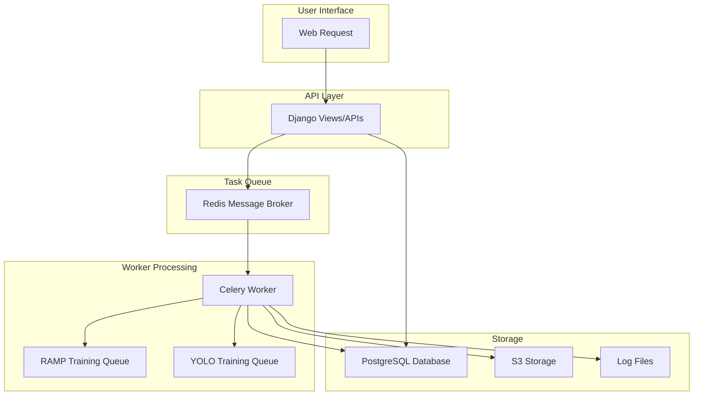
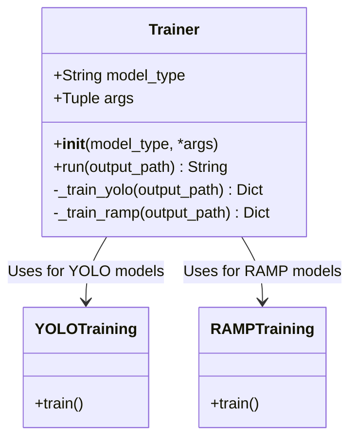
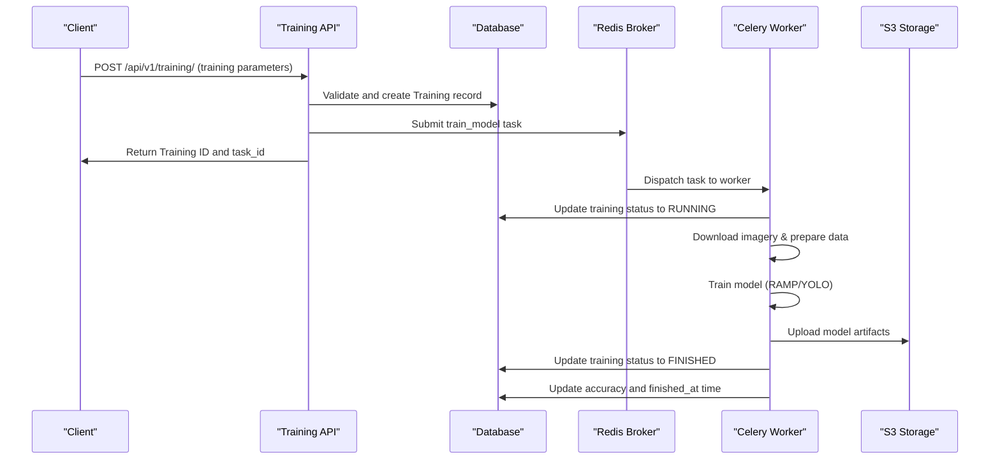
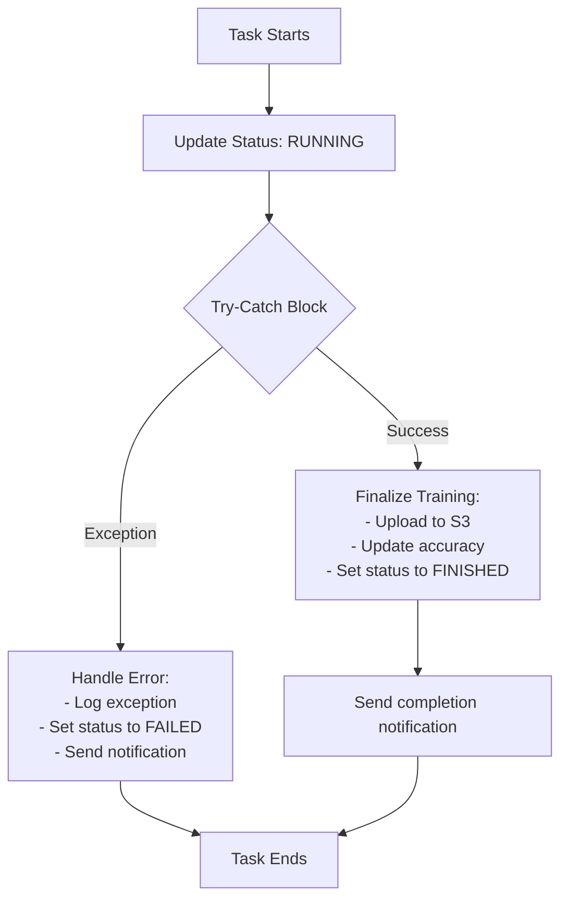

# Asynchronous Processing

<details>
<summary>Relevant source files</summary>

The following files were used as context for generating this wiki page:

- [.github/workflows/backend_build.yml](.github/workflows/backend_build.yml)
- [.gitignore](.gitignore)
- [backend/README.md](backend/README.md)
- [backend/aiproject/__init__.py](backend/aiproject/__init__.py)
- [backend/aiproject/asgi.py](backend/aiproject/asgi.py)
- [backend/aiproject/celery.py](backend/aiproject/celery.py)
- [backend/aiproject/settings.py](backend/aiproject/settings.py)
- [backend/aiproject/urls.py](backend/aiproject/urls.py)
- [backend/aiproject/utils.py](backend/aiproject/utils.py)
- [backend/aiproject/wsgi.py](backend/aiproject/wsgi.py)
- [backend/api-requirements.txt](backend/api-requirements.txt)
- [backend/core/models.py](backend/core/models.py)
- [backend/core/serializers.py](backend/core/serializers.py)
- [backend/core/tasks.py](backend/core/tasks.py)
- [backend/core/urls.py](backend/core/urls.py)
- [backend/core/utils.py](backend/core/utils.py)
- [backend/core/views.py](backend/core/views.py)
- [backend/docker_sample_env](backend/docker_sample_env)
- [backend/requirements.txt](backend/requirements.txt)
- [backend/sample_env](backend/sample_env)
- [backend/tests/__init__.py](backend/tests/__init__.py)
- [backend/tests/test_endpoints.py](backend/tests/test_endpoints.py)
- [backend/tests/test_views.py](backend/tests/test_views.py)

</details>


## Purpose and Scope

This document explains the asynchronous processing system implemented in the fAIr platform, which enables computationally intensive tasks like model training to be handled in the background while keeping the web server responsive. The document covers the Celery configuration, task definitions, execution workflow, and status monitoring mechanisms.

Sources: [backend/aiproject/celery.py](), [backend/aiproject/settings.py:215-232]()

## Overview

The fAIr platform uses Celery, a distributed task queue system, to handle computationally intensive operations asynchronously. This is particularly important for AI model training processes, which can take significant time and resources. By moving these operations to background workers, the main application remains responsive to user requests.

The primary asynchronous operations in the system include:

1. Model training (RAMP and YOLO)
2. Raw data processing
3. Feedback incorporation



Sources: [backend/core/tasks.py](), [backend/core/views.py:203-223](), [backend/aiproject/settings.py:215-232]()

## Celery Configuration

The Celery task queue is configured in the Django application to handle asynchronous processing.

### Key Settings

The primary Celery configuration is defined in the project settings:

```python
CELERY_BROKER_URL = env("CELERY_BROKER_URL", default="redis://127.0.0.1:6379/0")
CELERY_RESULT_BACKEND = env("CELERY_RESULT_BACKEND", default="redis://127.0.0.1:6379/0")
```

By default, Redis is used both as the message broker and result backend. The Celery application is initialized in the `aiproject/celery.py` file and configured to discover tasks automatically from all registered Django apps.

### Queues and Routing

The system uses specialized queues for different types of model training:

1. `ramp_training` - Queue for RAMP model training tasks
2. `yolo_training` - Queue for YOLO model training tasks

Tasks are routed to the appropriate queue based on the model type when they are submitted for execution.

Sources: [backend/aiproject/celery.py](), [backend/aiproject/settings.py:215-232](), [backend/core/views.py:217-220]()

## Task Definition and Implementation

### The `train_model` Task

The primary asynchronous task in the system is `train_model`, which handles the training of machine learning models. This task is defined in `core/tasks.py` as a shared task that can be executed by Celery workers.

```python
@shared_task
def train_model(
    dataset_id,
    training_id,
    epochs,
    batch_size,
    zoom_level,
    source_imagery,
    feedback=None,
    freeze_layers=False,
    multimasks=False,
    input_contact_spacing=8,
    input_boundary_width=3,
):
    # Task implementation...
```

The task performs several operations:

1. Retrieves the relevant Training and Model instances
2. Updates the training status to "RUNNING"
3. Sets up logging for the task
4. Prepares training data, including downloading imagery
5. Executes the appropriate training algorithm (RAMP or YOLO)
6. Uploads the trained model and results to S3 storage
7. Updates the training status and accuracy in the database

### The `Trainer` Class

Model training is handled by the `Trainer` class, which provides a unified interface for different model types:



The `Trainer` class determines which training method to use based on the model type and executes the appropriate training pipeline.

Sources: [backend/core/tasks.py:99-290](), [backend/core/tasks.py:380-467]()

## Task Execution Workflow

### Initiating Training Tasks

The asynchronous training process is typically initiated through the REST API when a user creates a new training instance. This happens in the `create` method of the `TrainingSerializer` class in `core/views.py`:



The task is submitted to Celery using `apply_async` with appropriate parameters and queue selection:

```python
task = train_model.apply_async(
    kwargs={
        "dataset_id": instance.model.dataset.id,
        "training_id": instance.id,
        "epochs": instance.epochs,
        "batch_size": instance.batch_size,
        "zoom_level": instance.zoom_level,
        "source_imagery": instance.source_imagery
        or instance.model.dataset.source_imagery,
        "freeze_layers": instance.freeze_layers,
        "multimasks": multimasks,
        "input_contact_spacing": input_contact_spacing,
        "input_boundary_width": input_boundary_width,
    },
    queue=(
        "ramp_training"
        if instance.model.base_model == "RAMP"
        else "yolo_training"
    ),
)
```

The task ID is stored in the Training model for later reference and status tracking.

### Task Validation

Before submitting a task, the system performs several validations:

1. Checks if another training is already running for the same model
2. Verifies that labels exist for the dataset
3. Validates that epochs and batch size are within configured limits

These validations ensure that system resources are used efficiently and prevent invalid training attempts.

Sources: [backend/core/views.py:148-232](), [backend/core/tasks.py:380-467]()

## Task Status Monitoring

### Status Tracking Endpoint

The system provides an API endpoint for monitoring the status of asynchronous tasks. The `run_task_status` view in `core/views.py` allows clients to check the current state of a training task:

```python
@api_view(["GET"])
def run_task_status(request, run_id: str):
    # Implementation...
```

This endpoint uses Celery's `AsyncResult` to retrieve the current status of the task and returns information including:

- Task ID
- Current status (PENDING, STARTED, RUNNING, FINISHED, FAILED)
- Result or error information
- Log output for running tasks

### Status and Notification Updates

The asynchronous task updates the `Training` model's status field at key points in the execution:

- "SUBMITTED" - Initial state when the task is created
- "RUNNING" - When the worker starts processing the task
- "FINISHED" - Upon successful completion
- "FAILED" - If an error occurs during execution

Additionally, the system sends notifications to users when training status changes:

```python
def send_notification(training_instance, status):
    if "web" in training_instance.user.notifications_delivery_methods:
        UserNotification.objects.create(
            user=training_instance.user,
            message=f"Training {training_instance.id} has {status}.",
            training=training_instance,
        )
    if "email" in training_instance.user.notifications_delivery_methods:
        # Email notification logic...
```

This allows users to be informed of training progress without having to continuously check the status.

Sources: [backend/core/views.py:673-714](), [backend/core/utils.py:489-510](), [backend/core/tasks.py:402-404](), [backend/core/tasks.py:456-463]()

## Secondary Asynchronous System: Django Q

In addition to Celery, the fAIr platform also uses Django Q for lighter background tasks. This is particularly used for processing raw data from OpenStreetMap:

```python
async_task("core.views.process_rawdata_task", obj.geom.geojson, aoi_id)
```

Django Q is configured in the settings with parameters for workers, retries, and timeouts:

```python
Q_CLUSTER = {
    "name": "DjangORM",
    "workers": 4,
    "retry": 60 * 6,
    "max_retires": 1,
    "recycle": 50,
    "queue_limit": 50,
    "timeout": 60 * 5,  # number of seconds
    "label": "Django Q",
    "orm": "default",
}
```

This provides a lightweight alternative to Celery for tasks that don't require the full power of a distributed task queue.

Sources: [backend/core/views.py:593](), [backend/aiproject/settings.py:222-232]()

## Deployment Considerations

When deploying the fAIr platform, the Celery workers must be started alongside the Django application. This is typically done with a command like:

```bash
celery -A aiproject worker --loglevel=debug -Q ramp_training,yolo_training
```

The workers subscribe to the specified queues and process tasks as they are submitted to the message broker. Additionally, the Flower dashboard can be started to monitor the Celery workers and tasks:

```bash
celery -A aiproject --broker=redis://localhost:6379/ flower
```

For Django Q, the worker process is started with:

```bash
python manage.py qcluster
```

These processes should be managed by a process supervisor in production environments to ensure they remain running.

Sources: [.github/workflows/backend_build.yml:97-102](), [backend/README.md:160-176]()

## Error Handling and Recovery

The asynchronous processing system includes robust error handling to manage failures in background tasks:

1. Exceptions in the `train_model` task are caught and logged
2. The training status is updated to "FAILED" in case of errors
3. Error details are stored and made available through the status API
4. Users are notified of training failures

This ensures that issues in background processing don't affect the overall system stability and users are informed of any problems.



Sources: [backend/core/tasks.py:459-467]()

## Conclusion

The asynchronous processing system in fAIr provides a scalable and efficient mechanism for handling resource-intensive tasks like model training. By leveraging Celery and Redis, the platform is able to distribute workloads across workers while maintaining a responsive user interface. The status tracking and notification mechanisms ensure that users stay informed about the progress of their tasks without requiring continuous polling.

For more details on specific models and data structures referenced in this document, see [Data Models](#2.2).