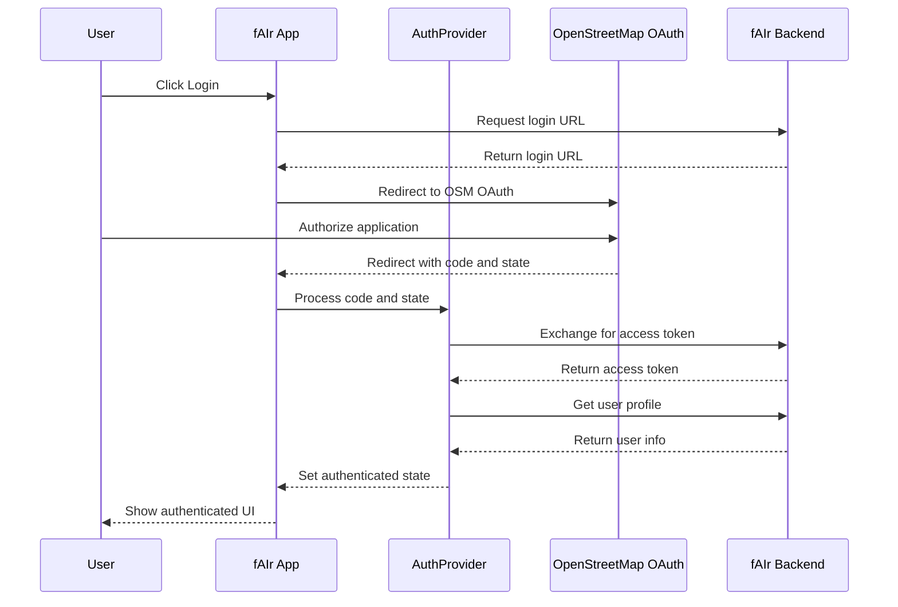

# Frontend System

<details>
<summary>Relevant source files</summary>

The following files were used as context for generating this wiki page:

- [frontend/.gitignore](frontend/.gitignore)
- [frontend/README.md](frontend/README.md)
- [frontend/eslint.config.js](frontend/eslint.config.js)
- [frontend/index.html](frontend/index.html)
- [frontend/package.json](frontend/package.json)
- [frontend/pnpm-lock.yaml](frontend/pnpm-lock.yaml)
- [frontend/src/app/index.tsx](frontend/src/app/index.tsx)
- [frontend/src/app/providers/auth-provider.tsx](frontend/src/app/providers/auth-provider.tsx)
- [frontend/src/app/providers/models-provider.tsx](frontend/src/app/providers/models-provider.tsx)
- [frontend/src/app/router.tsx](frontend/src/app/router.tsx)
- [frontend/src/components/layouts/model-forms-layout.tsx](frontend/src/components/layouts/model-forms-layout.tsx)
- [frontend/src/components/layouts/root-layout.tsx](frontend/src/components/layouts/root-layout.tsx)
- [frontend/src/components/ui/animated-beam/animated-beam.tsx](frontend/src/components/ui/animated-beam/animated-beam.tsx)
- [frontend/src/components/ui/banner/banner.tsx](frontend/src/components/ui/banner/banner.tsx)
- [frontend/src/features/model-creation/components/progress-buttons.tsx](frontend/src/features/model-creation/components/progress-buttons.tsx)
- [frontend/src/features/model-creation/components/training-dataset/training-dataset.tsx](frontend/src/features/model-creation/components/training-dataset/training-dataset.tsx)
- [frontend/src/features/start-mapping/components/map/layers/accepted-prediction-layer.tsx](frontend/src/features/start-mapping/components/map/layers/accepted-prediction-layer.tsx)
- [frontend/src/features/start-mapping/components/map/layers/rejected-prediction-layer.tsx](frontend/src/features/start-mapping/components/map/layers/rejected-prediction-layer.tsx)
- [frontend/src/hooks/use-login.ts](frontend/src/hooks/use-login.ts)
- [frontend/src/hooks/use-map-instance.ts](frontend/src/hooks/use-map-instance.ts)
- [frontend/src/hooks/use-storage.ts](frontend/src/hooks/use-storage.ts)
- [frontend/src/services/api-client.ts](frontend/src/services/api-client.ts)
- [frontend/src/services/auth.ts](frontend/src/services/auth.ts)
- [frontend/src/store/model-prediction-store.ts](frontend/src/store/model-prediction-store.ts)
- [frontend/src/styles/index.css](frontend/src/styles/index.css)

</details>


The Frontend System in the fAIr project provides the web-based user interface for AI-assisted mapping. It is a React-based application that enables users to create AI models, train them on OSM data, visualize predictions on aerial imagery, and provide feedback on these predictions to improve model performance.

This document covers the architecture, structure, and key components of the frontend system. For information about specific frontend features, see [Component Structure](#3.1), [Start Mapping Feature](#3.2), and [Model Creation and Management](#3.3).

## Architecture Overview

The frontend is built with React 18, TypeScript, and Vite as a modern single-page application (SPA). It follows component-based architecture principles with well-defined responsibilities for each part of the system.


Sources: [frontend/src/app/index.tsx:1-52](), [frontend/src/app/router.tsx:1-404](), [frontend/src/main.tsx]()

## Key Technologies

The frontend system uses the following key technologies:

| Technology | Purpose |
|------------|---------|
| React 18 | UI library |
| TypeScript | Type safety and developer experience |
| Vite | Build tool and development server |
| React Router | Client-side routing |
| TanStack Query | Data fetching, caching, and state management |
| Zustand | Client-side state management |
| MapLibre GL | Map visualization |
| Tailwind CSS | Utility-first styling |
| Shoelace | UI component library |

Sources: [frontend/package.json:1-91]()

## Core Architecture

### Application Bootstrap

The frontend application bootstrapping process begins at `main.tsx`, which renders the `App` component. The `App` component initializes global providers and mounts the router:


Sources: [frontend/src/app/index.tsx:1-52]()

### Routing System

The application uses React Router for navigation with a declarative route configuration. Routes are organized hierarchically and use code splitting with lazy loading for better performance:

```typescript
// Route structure (simplified)
const router = createBrowserRouter([
  {
    element: <RootLayout />,
    children: [
      {
        path: APPLICATION_ROUTES.HOMEPAGE,
        lazy: async () => {
          const { LandingPage } = await import("@/app/routes/landing");
          return { Component: LandingPage };
        },
      },
      // More routes...
    ],
  },
]);
```

Protected routes ensure authenticated access where needed:


Sources: [frontend/src/app/router.tsx:1-404]()

### Layout Components

The application has two primary layout components:

1. **RootLayout**: The main application wrapper that includes the navbar, footer, and common UI elements.
2. **ModelFormsLayout**: A specialized layout for the model creation workflow with progress tracking.

```typescript
// RootLayout structure (simplified)
export const RootLayout = () => {
  return (
    <main className="min-h-screen relative flex flex-col">
      <NavBar />
      <div className="flex-1 mx-auto w-full">
        <Outlet /> {/* Page content rendered here */}
      </div>
      <Footer />
    </main>
  );
};
```

Sources: [frontend/src/components/layouts/root-layout.tsx:1-114](), [frontend/src/components/layouts/model-forms-layout.tsx:1-181]()

## State Management

The frontend uses a hybrid approach to state management, combining several strategies based on the specific needs of each feature:


### Context Providers

Two main context providers manage global application state:

1. **AuthProvider**: Manages authentication state, user information, and authentication flows.

```typescript
// AuthProvider structure (simplified)
export const AuthProvider = ({ children }) => {
  const [token, setToken] = useState(localStorage.getItem(TOKEN_KEY));
  const [user, setUser] = useState(null);
  const isAuthenticated = user !== null && token !== undefined;
  
  // Authentication methods and effects
  
  return (
    <AuthContext.Provider value={{ 
      token, user, isAuthenticated, authenticateUser, logout 
    }}>
      {children}
    </AuthContext.Provider>
  );
};
```

2. **ModelsProvider**: Manages state for model creation and training workflows.

```typescript
// ModelsProvider structure (simplified)
export const ModelsProvider = ({ children }) => {
  const [formData, setFormData] = useState(initialFormState);
  
  // Form management methods and API interactions
  
  return (
    <ModelsContext.Provider value={{ 
      formData, setFormData, handleChange, handleModelCreationAndUpdate 
    }}>
      {children}
    </ModelsContext.Provider>
  );
};
```

Sources: [frontend/src/app/providers/auth-provider.tsx:1-213](), [frontend/src/app/providers/models-provider.tsx:1-582]()

### Zustand Stores

Zustand is used for UI-specific state that doesn't need to be globally available through context:

```typescript
// ModelPredictionStore example (simplified)
export const useModelPredictionStore = create<ModelPredictionState>((set, get) => ({
  modelPredictions: { accepted: [], rejected: [], all: [] },
  
  setModelPredictions: (newPredictions) => {
    set({ modelPredictions: newPredictions });
  },
  
  moveFeatureBetweenBuckets: (from, to, id, updatedProps = {}) => {
    // Implementation to move predictions between categories
  },
}));
```

Sources: [frontend/src/store/model-prediction-store.ts:1-58]()

### Browser Storage

The application uses browser storage (localStorage and sessionStorage) to persist state across page reloads:

```typescript
// useLocalStorage hook (simplified)
export const useLocalStorage = () => {
  const getValue = (key: string): string | undefined => {
    try {
      return localStorage.getItem(key) || undefined;
    } catch (error) {
      showErrorToast(error);
    }
  };
  
  const setValue = (key: string, value: string): void => {
    try {
      localStorage.setItem(key, value);
    } catch (error) {
      showErrorToast(error);
    }
  };
  
  return { getValue, setValue, removeValue };
};
```

Sources: [frontend/src/hooks/use-storage.ts:1-83]()

## Key Features

### Authentication System

The authentication system integrates with OpenStreetMap (OSM) OAuth for user authentication:



The `useLogin` hook encapsulates the login flow:

```typescript
// useLogin hook (simplified)
export const useLogin = () => {
  const [loading, setLoading] = useState(false);
  
  const handleLogin = async (): Promise<void> => {
    setLoading(true);
    setSessionValue(REDIRECT_KEY, currentPathWithQuery);
    try {
      await authService.initializeOAuthFlow();
    } catch (error) {
      showErrorToast(error);
    } finally {
      setLoading(false);
    }
  };
  
  return { loading, handleLogin };
};
```

Sources: [frontend/src/app/providers/auth-provider.tsx:1-213](), [frontend/src/hooks/use-login.ts:1-42](), [frontend/src/services/auth.ts:1-114]()

### Map Visualization

The map visualization system uses MapLibre GL and several custom components to display geographic data:


The `useMapInstance` hook initializes and manages the map:

```typescript
// useMapInstance hook (simplified)
export const useMapInstance = (pmtiles: boolean = false) => {
  const mapContainerRef = useRef<HTMLDivElement>(null);
  const [map, setMap] = useState<Map | null>(null);
  const [drawingMode, setDrawingMode] = useState<DrawingModes>(DrawingModes.STATIC);
  
  // Map initialization and terra-draw setup
  
  return {
    mapContainerRef,
    map,
    drawingMode,
    setDrawingMode,
    terraDraw,
  };
};
```

Prediction layers show model outputs on the map:

```typescript
// AcceptedPredictionsLayer component (simplified)
export const AcceptedPredictionsLayer = ({ map, features }) => {
  useEffect(() => {
    if (!map || !map.getStyle()) return;
    
    // Add source and layers for accepted predictions
    
    return () => {
      // Cleanup layers and sources
    };
  }, [map]);
  
  // Update feature data when it changes
  
  return null;
};
```

Sources: [frontend/src/hooks/use-map-instance.ts:1-70](), [frontend/src/features/start-mapping/components/map/layers/accepted-prediction-layer.tsx:1-84](), [frontend/src/features/start-mapping/components/map/layers/rejected-prediction-layer.tsx:1-85]()

## Development and Tooling

### Build Process

The frontend uses Vite for development and building:

| Command | Description |
|---------|-------------|
| `pnpm dev` | Start development server |
| `pnpm build` | Build production bundle |
| `pnpm lint` | Run ESLint |
| `pnpm format` | Format code with Prettier |
| `pnpm test` | Run tests with Vitest |

Sources: [frontend/package.json:1-91]()

### Code Quality Tools

The codebase employs several tools for maintaining code quality:

1. **TypeScript** for static type checking
2. **ESLint** for linting with custom rules
3. **Prettier** for code formatting
4. **Vitest** for testing

```typescript
// ESLint configuration (simplified)
export default [
  {
    files: ['**/*.{ts,tsx}'],
    languageOptions: {
      parser: '@typescript-eslint/parser',
    },
    plugins: {
      'react-hooks': reactHooks,
      'react-refresh': reactRefresh,
      '@tanstack/query': '@tanstack/query',
      'prettier': prettierPlugin,
    },
    // Rules configuration
  },
  // Additional configurations
];
```

Sources: [frontend/eslint.config.js:1-42]()

## Styling System

The frontend uses Tailwind CSS for styling with custom design tokens defined in CSS variables:

```css
:root {
  /* Color tokens */
  --hot-fair-color-primary: #d63f40;
  --hot-fair-color-secondary: #ffeded;
  --hot-fair-color-dark: #2c3038;
  
  /* Font sizes */
  --hot-fair-font-size-extra-large: 4.25rem;
  --hot-fair-font-size-large-title: 3rem;
  
  /* Font weights */
  --hot-fair-font-weight-regular: 400;
  --hot-fair-font-weight-medium: 500;
  
  /* Spacing */
  --hot-fair-spacing-extra-large: 5rem;
  --hot-fair-spacing-large: 2rem;
}
```

Custom utility classes extend Tailwind's functionality:

```css
@layer components {
  .icon {
    @apply inline-block h-4 w-4;
  }
  
  .app-padding {
    @apply px-small md:px-large 2xl:px-extra-large;
  }
  
  .map-elements-z-index {
    @apply z-[1];
  }
}
```

Sources: [frontend/src/styles/index.css:1-241]()

## Conclusion

The Frontend System of the fAIr project is a modern React application that provides a user-friendly interface for AI-assisted mapping. It integrates with the backend API to enable model creation, training, and prediction review workflows. The system is built with maintainability and extensibility in mind, using contemporary web development practices and tools.

For more detailed information about specific features, please refer to the linked wiki pages at the top of this document.