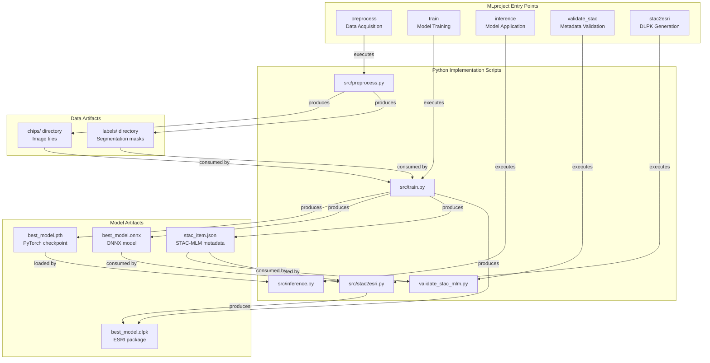
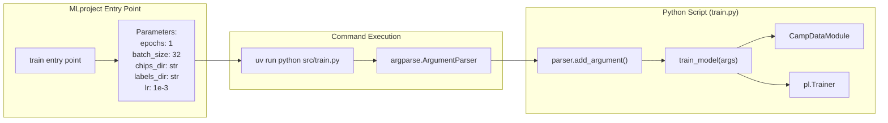
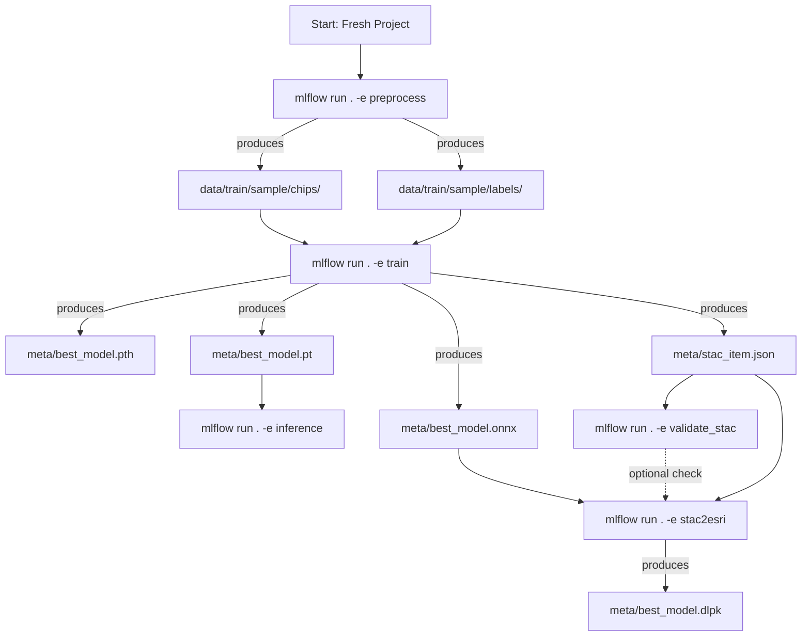
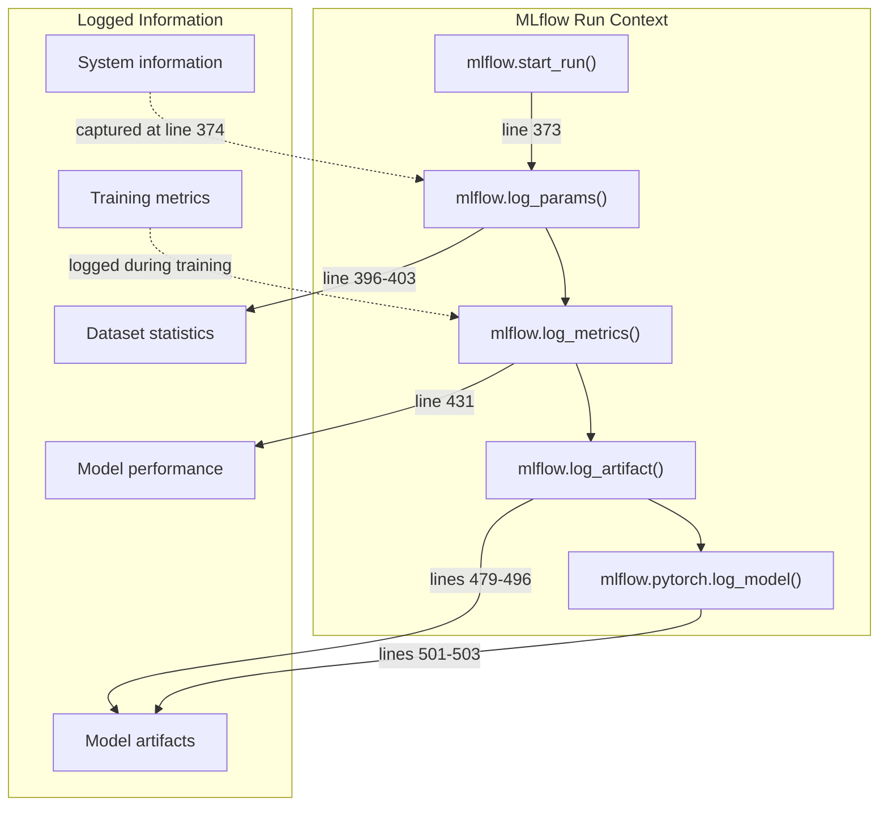

# MLflow Project Structure

<details>
<summary>Relevant source files</summary>

The following files were used as context for generating this wiki page:

- [examplemodel/MLproject](examplemodel/MLproject)
- [examplemodel/src/train.py](examplemodel/src/train.py)

</details>


## Purpose and Scope

This document details the MLflow Project configuration defined in the `MLproject` file, which provides a declarative interface for orchestrating the machine learning pipeline in the OpenGeoAIModelHub repository. The `MLproject` file defines five entry points (preprocess, train, inference, validate_stac, stac2esri) that encapsulate distinct phases of the ML workflow, each with configurable parameters and command specifications.

For information about the actual implementation of the training pipeline, see [Training Pipeline](#3.2). For details on dependency management and package configuration, see [Dependencies and Configuration](#3.6).

**Sources:** [examplemodel/MLproject:1-63]()

---

## MLproject File Overview

The `MLproject` file is a YAML-formatted configuration that defines the project name and entry points for execution via the MLflow CLI. It serves as the orchestration layer between user commands and the underlying Python implementation scripts.

### Project Metadata

```yaml
name: refugee-camp-detector
```

The project is named `refugee-camp-detector`, which serves as the identifier in MLflow tracking and experiments.

**Sources:** [examplemodel/MLproject:1]()

### Commented Docker Environment

```yaml
# docker_env:
#   image: ghcr.io/kshitijrajsharma/opengeoaimodelshub:master
```

The file includes a commented-out Docker environment specification, indicating that the project can optionally run in a containerized environment using the pre-built image from GitHub Container Registry. When uncommented, this would ensure consistent execution environments across different machines.

**Sources:** [examplemodel/MLproject:2-3]()

---

## Entry Point Architecture

The MLproject defines five distinct entry points, each handling a specific phase of the ML pipeline. These entry points are invoked using the MLflow CLI with the syntax: `mlflow run . -e <entry_point_name>`.



**Diagram: MLproject Entry Points and Their Relationships**

**Sources:** [examplemodel/MLproject:5-63]()

---

## Entry Point: preprocess

The `preprocess` entry point downloads satellite imagery from a Tile Map Service (TMS) and generates training data chips with corresponding label masks.

### Parameters

| Parameter | Type | Default Value | Description |
|-----------|------|---------------|-------------|
| `zoom` | int | 19 | Tile zoom level for image resolution |
| `bbox` | str | "85.51991979758662,27.628837632373674,85.52736620395387,27.633394557789373" | Bounding box coordinates (minlon,minlat,maxlon,maxlat) |
| `tms` | str | "https://tiles.openaerialmap.org/..." | Tile Map Service URL template with {z}/{x}/{y} placeholders |
| `train_dir` | str | "data/train/sample" | Output directory for generated training data |

### Command Specification

```yaml
command: >
  uv run python src/preprocess.py
  --zoom {zoom}
  --bbox {bbox}
  --tms {tms}
  --train-dir    {train_dir}
```

The command uses `uv run python` to execute the preprocessing script within the project's dependency environment. MLflow performs parameter substitution using curly brace syntax `{parameter_name}`.

### Invocation Example

```bash
mlflow run . -e preprocess \
  -P zoom=19 \
  -P bbox="85.5199,27.6288,85.5274,27.6334" \
  -P tms="https://tiles.openaerialmap.org/62d85d11d8499800053796c1/0/62d85d11d8499800053796c2/{z}/{x}/{y}"
```

**Sources:** [examplemodel/MLproject:6-17]()

---

## Entry Point: train

The `train` entry point executes the model training pipeline using PyTorch Lightning, logs metrics to MLflow, and generates multiple model artifacts.

### Parameters

| Parameter | Type | Default Value | Description |
|-----------|------|---------------|-------------|
| `epochs` | int | 1 | Number of training epochs |
| `batch_size` | int | 32 | Batch size for training |
| `chips_dir` | str | "data/train/sample/chips" | Directory containing image chips |
| `labels_dir` | str | "data/train/sample/labels" | Directory containing label masks |
| `lr` | float | 1e-3 | Learning rate for optimizer |

### Command Specification

```yaml
command: >
  uv run python src/train.py 
  --epochs {epochs}
  --batch_size {batch_size}
  --chips_dir {chips_dir}
  --labels_dir {labels_dir}
  --lr {lr}
```

### Parameter Flow to Python Implementation



**Diagram: Parameter Flow from MLproject to Training Implementation**

The training script receives parameters via argparse at [examplemodel/src/train.py:510-516]() and uses them to configure the `CampDataModule` [examplemodel/src/train.py:389-393]() and `pl.Trainer` [examplemodel/src/train.py:414-419]().

### Invocation Example

```bash
mlflow run . -e train \
  -P epochs=10 \
  -P batch_size=64 \
  -P lr=0.001
```

**Sources:** [examplemodel/MLproject:19-32](), [examplemodel/src/train.py:509-518]()

---

## Entry Point: inference

The `inference` entry point performs model inference on a single image and generates prediction overlays.

### Parameters

| Parameter | Type | Default Value | Description |
|-----------|------|---------------|-------------|
| `image_path` | str | (required) | Path to input image for inference |
| `model_path` | str | "meta/best_model.pt" | Path to TorchScript model file |
| `output_dir` | str | "output" | Directory for saving prediction results |
| `mlflow_tracking` | bool | false | Enable MLflow tracking for inference run |

### Command Specification

```yaml
command: >
  uv run python src/inference.py {image_path}
  --model_path {model_path}
  --output_dir {output_dir}
  {{--mlflow_tracking if mlflow_tracking}}
```

The command uses conditional parameter syntax `{{--mlflow_tracking if mlflow_tracking}}`, which only includes the `--mlflow_tracking` flag when the parameter is `true`.

### Invocation Example

```bash
mlflow run . -e inference \
  -P image_path=test.jpg \
  -P model_path=meta/best_model.pt \
  -P mlflow_tracking=true
```

**Sources:** [examplemodel/MLproject:34-44]()

---

## Entry Point: validate_stac

The `validate_stac` entry point validates STAC-MLM metadata against the official schema to ensure compliance.

### Parameters

| Parameter | Type | Default Value | Description |
|-----------|------|---------------|-------------|
| `stac_file` | str | "meta/stac_item.json" | Path to STAC-MLM JSON file for validation |

### Command Specification

```yaml
command: "uv run python validate_stac_mlm.py {stac_file}"
```

### Invocation Example

```bash
mlflow run . -e validate_stac -P stac_file=meta/stac_item.json
```

**Sources:** [examplemodel/MLproject:46-49]()

---

## Entry Point: stac2esri

The `stac2esri` entry point converts STAC-MLM metadata and ONNX models into ESRI Deep Learning Package (DLPK) format for ArcGIS deployment.

### Parameters

| Parameter | Type | Default Value | Description |
|-----------|------|---------------|-------------|
| `stac_path` | str | "meta/stac_item.json" | Path to STAC-MLM metadata file |
| `onnx_path` | str | "meta/best_model.onnx" | Path to ONNX model file |
| `out_dir` | str | "meta" | Output directory for generated DLPK |
| `dlpk_name` | str | "refugee-camp-detector.dlpk" | Filename for the DLPK package |

### Command Specification

```yaml
command: >
  uv run python src/stac2esri.py
  --stac {stac_path}
  --onnx {onnx_path}
  --out-dir {out_dir}
  --dlpk-name {dlpk_name}
```

### Invocation Example

```bash
mlflow run . -e stac2esri \
  -P stac_path=meta/stac_item.json \
  -P onnx_path=meta/best_model.onnx \
  -P dlpk_name=my_model.dlpk
```

**Sources:** [examplemodel/MLproject:51-62]()

---

## Parameter Type System

The MLproject file uses a type system to validate parameters passed via the MLflow CLI. Each parameter declaration includes a type specification that enforces data type constraints.

### Supported Parameter Types

| Type | Description | Example Values |
|------|-------------|----------------|
| `int` | Integer values | 1, 10, 100 |
| `float` | Floating-point numbers | 1e-3, 0.001, 3.14 |
| `str` | String values | "path/to/file", "85.5199,27.6288" |
| `bool` | Boolean flags | true, false |

### Parameter Declaration Syntax

```yaml
parameters:
  parameter_name: {type: <type>, default: <value>}
```

For required parameters without defaults:

```yaml
parameters:
  parameter_name: {type: <type>}
```

Example from the `inference` entry point showing a required string parameter:

```yaml
image_path: {type: str}
```

**Sources:** [examplemodel/MLproject:7-56]()

---

## Command Execution Pattern

All entry points use the `uv run python` command pattern, which ensures execution within the project's isolated dependency environment managed by the `uv` package manager.

### Command Structure

```
uv run python <script_path> [positional_args] [--flag value]
```

### Parameter Substitution

MLflow performs string substitution for parameters using `{parameter_name}` syntax:

```yaml
command: >
  uv run python src/train.py 
  --epochs {epochs}
  --batch_size {batch_size}
```

At runtime, if invoked with `-P epochs=10 -P batch_size=64`, this becomes:

```bash
uv run python src/train.py --epochs 10 --batch_size 64
```

### Conditional Parameters

The `inference` entry point demonstrates conditional parameter inclusion:

```yaml
{{--mlflow_tracking if mlflow_tracking}}
```

This syntax only includes `--mlflow_tracking` in the command when the boolean parameter is `true`.

**Sources:** [examplemodel/MLproject:12-62]()

---

## Entry Point Dependency Graph

The following diagram shows the typical execution order and data dependencies between entry points:



**Diagram: Entry Point Execution Dependencies**

### Typical Workflow Sequence

1. **Data Preparation**: Run `preprocess` to download and prepare training data
2. **Model Training**: Run `train` to train the model and generate artifacts
3. **Metadata Validation** (optional): Run `validate_stac` to verify STAC-MLM compliance
4. **ESRI Package Creation** (optional): Run `stac2esri` to generate DLPK for ArcGIS deployment
5. **Inference** (as needed): Run `inference` to apply the model to new images

**Sources:** [examplemodel/MLproject:5-63]()

---

## Integration with MLflow Tracking

When entry points are executed via `mlflow run`, MLflow automatically creates a run in the tracking server and logs the following information:

### Automatically Tracked Information

- **Parameters**: All entry point parameters are logged as MLflow parameters
- **Source**: Git commit hash (if running from a Git repository)
- **Entry Point**: Name of the entry point executed
- **Start/End Time**: Execution timing information
- **Status**: Success or failure status

### Additional Tracking in train.py

The training script explicitly uses MLflow tracking API to log additional information:



**Diagram: MLflow Tracking Integration in Training Pipeline**

**Sources:** [examplemodel/src/train.py:373](), [examplemodel/src/train.py:396-403](), [examplemodel/src/train.py:431](), [examplemodel/src/train.py:479-503]()

---

## Extending the MLproject

To add a new entry point to the MLproject file:

1. **Define the entry point** with a unique name
2. **Specify parameters** with types and optional defaults
3. **Write the command** using `uv run python` and parameter substitution
4. **Implement the Python script** that handles the specified arguments
5. **Test the entry point** using `mlflow run . -e <entry_point_name>`

### Example: Adding a New Entry Point

```yaml
evaluate:
  parameters:
    model_path: {type: str, default: "meta/best_model.pt"}
    test_dir: {type: str, default: "data/test"}
    metrics_output: {type: str, default: "meta/metrics.json"}
  command: >
    uv run python src/evaluate.py
    --model_path {model_path}
    --test_dir {test_dir}
    --metrics_output {metrics_output}
```

**Sources:** [examplemodel/MLproject:5-63]()

---

## Summary

The `MLproject` file provides a declarative, standardized interface for executing the refugee camp detection ML pipeline. It defines five entry points that orchestrate data preprocessing, model training, inference, metadata validation, and ESRI package generation. Each entry point specifies typed parameters with defaults and uses `uv run python` for dependency-isolated execution. This structure enables reproducible ML workflows that can be tracked, versioned, and shared via MLflow.

**Sources:** [examplemodel/MLproject:1-63]()