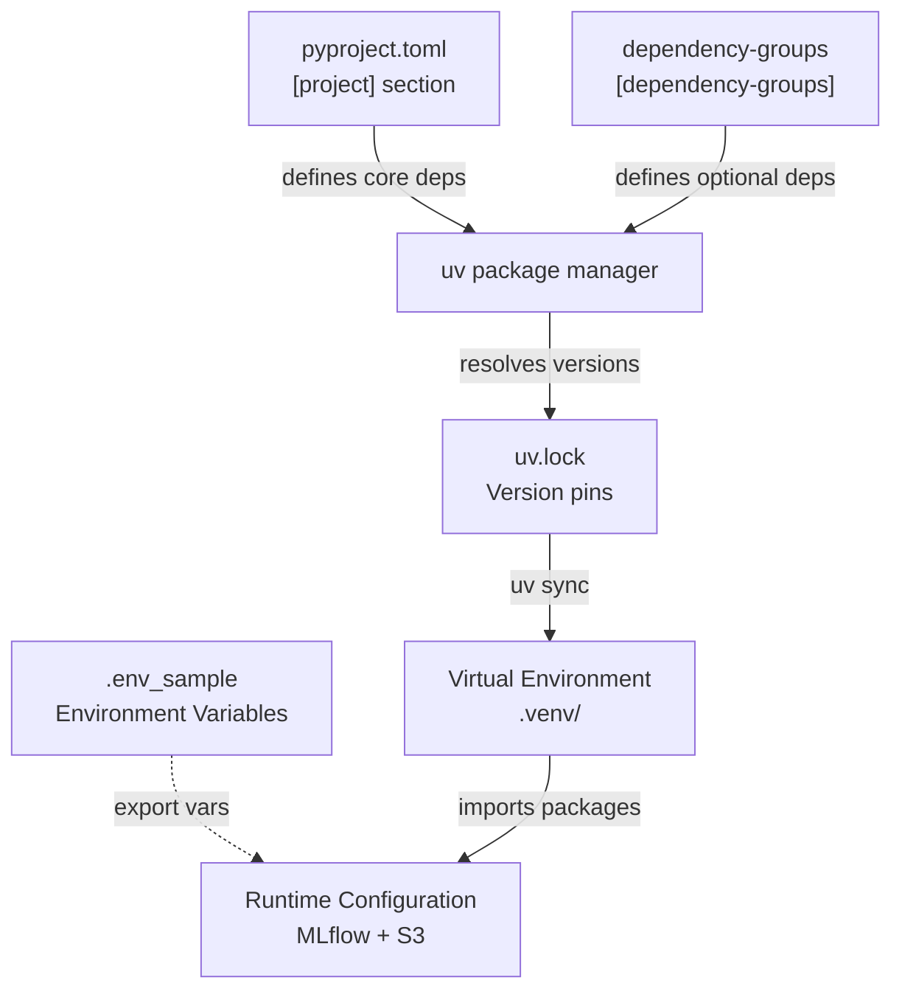
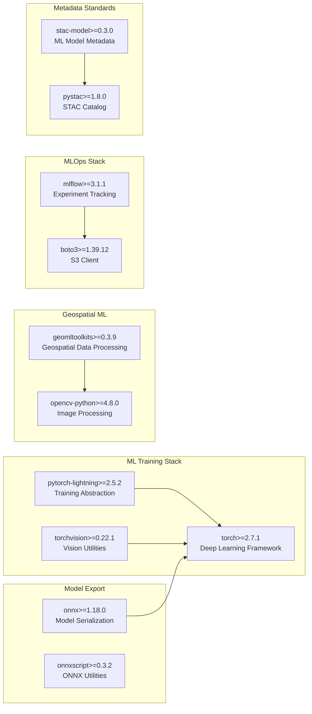
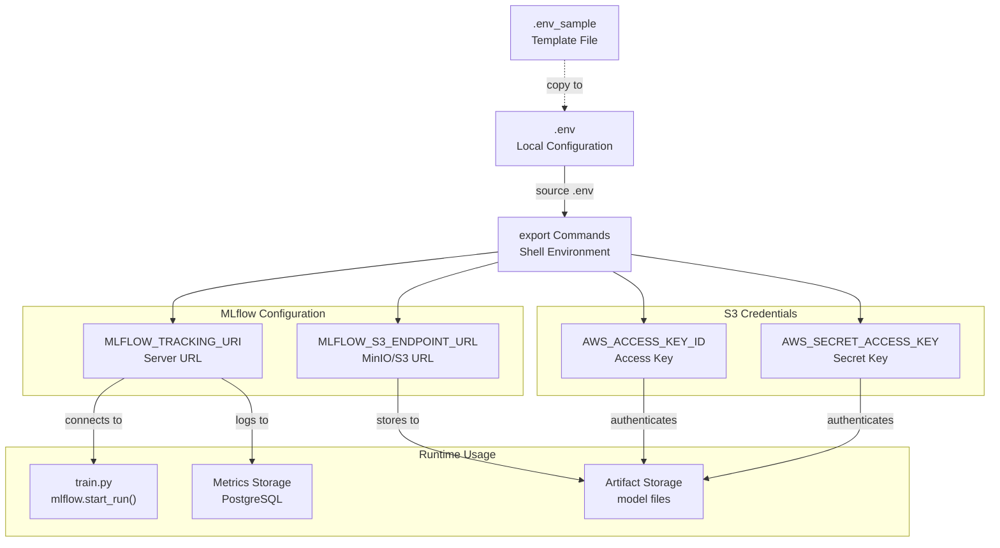
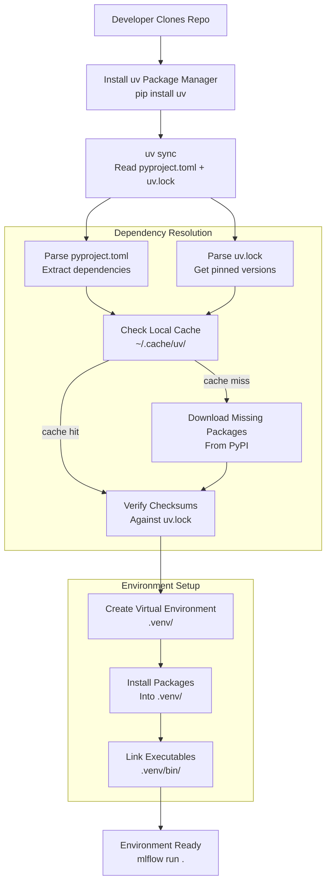
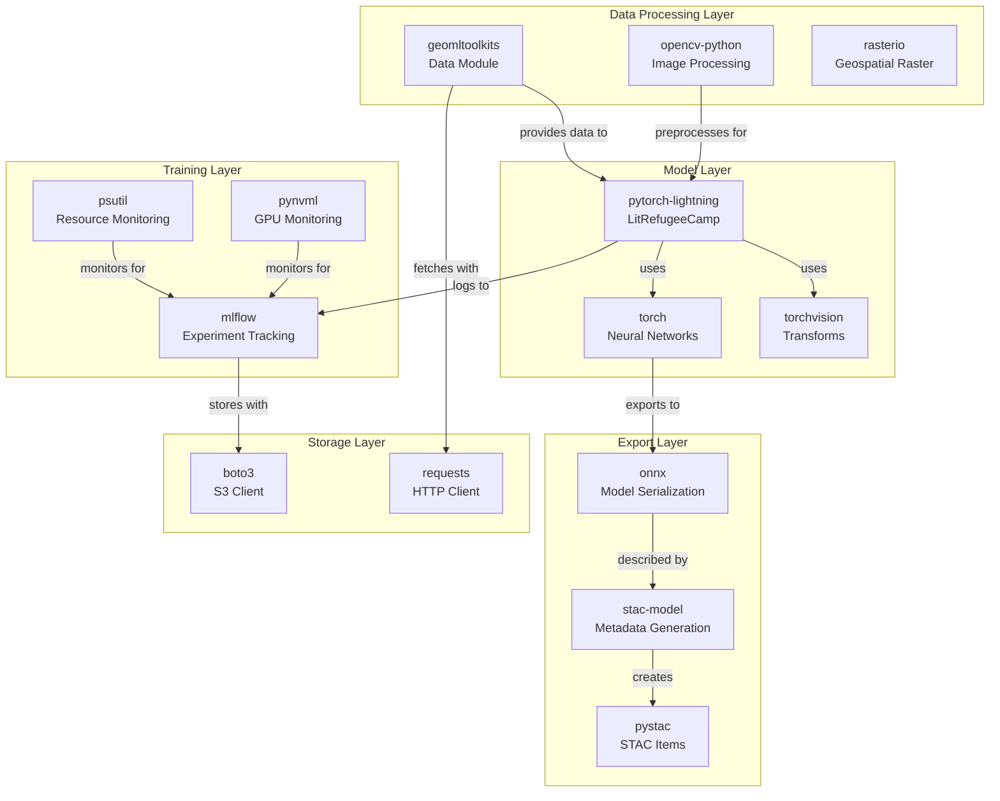

# Dependencies and Configuration

<details>
<summary>Relevant source files</summary>

The following files were used as context for generating this wiki page:

- [examplemodel/.env_sample](examplemodel/.env_sample)
- [examplemodel/pyproject.toml](examplemodel/pyproject.toml)
- [examplemodel/uv.lock](examplemodel/uv.lock)

</details>


This page documents the dependency management system and configuration requirements for the example model in OpenGeoAIModelHub. It covers the Python package dependencies defined in `pyproject.toml`, the lock file mechanism via `uv.lock`, and the environment variables required for MLflow and S3 integration.

For information about the MLflow Project structure and entry points, see [MLflow Project Structure](#3.5). For infrastructure deployment configuration, see [Configuration Management](#4.3).

## Purpose and Scope

The example model system uses modern Python dependency management with the `uv` package manager, which provides fast dependency resolution and reproducible builds. This document explains:

- The `pyproject.toml` dependency specification
- The `uv.lock` lock file structure and purpose
- Environment variable configuration for MLflow tracking and artifact storage
- Dependency categories and their roles in the ML pipeline

## Package Management Architecture

The project uses `uv` as its package manager, which reads dependency specifications from `pyproject.toml` and generates a lock file (`uv.lock`) that pins all transitive dependencies to specific versions.

**Dependency Management Flow**



**Sources:** [examplemodel/pyproject.toml:1-31](), [examplemodel/uv.lock:1-10](), [examplemodel/.env_sample:1-5]()

## Project Dependencies (pyproject.toml)

The `pyproject.toml` file defines the project metadata and dependencies using PEP 621 standards.

### Project Metadata

| Field | Value | Description |
|-------|-------|-------------|
| `name` | `examplemodel` | Package name |
| `version` | `0.0.1` | Semantic version |
| `requires-python` | `>=3.10` | Minimum Python version |
| `description` | Enhanced refugee camp detection model with production-ready STAC-MLM metadata | Project description |

**Sources:** [examplemodel/pyproject.toml:1-6]()

### Core Dependencies

The project depends on several categories of packages that support different aspects of the ML pipeline:

**ML Framework Dependencies**



**Sources:** [examplemodel/pyproject.toml:7-24]()

### Dependency Table

The following table lists all direct dependencies and their purposes:

| Package | Version Constraint | Purpose |
|---------|-------------------|---------|
| `torch` | `>=2.7.1` | Core PyTorch deep learning framework |
| `torchvision` | `>=0.22.1` | Computer vision utilities and transforms |
| `pytorch-lightning` | `>=2.5.2` | High-level training abstraction (LitRefugeeCamp) |
| `mlflow` | `>=3.1.1` | Experiment tracking and model registry |
| `onnx` | `>=1.18.0` | Model export to ONNX format |
| `onnxscript` | `>=0.3.2` | ONNX graph manipulation utilities |
| `geomltoolkits` | `>=0.3.9` | Geospatial ML data processing (TMS, OSM integration) |
| `stac-model` | `>=0.3.0` | STAC-MLM metadata generation |
| `pystac` | `>=1.8.0` | STAC catalog manipulation |
| `boto3` | `>=1.39.12` | AWS S3 / MinIO object storage client |
| `opencv-python` | `>=4.8.0` | Image processing and visualization |
| `psutil` | `>=7.0.0` | System resource monitoring |
| `pynvml` | `>=12.0.0` | NVIDIA GPU monitoring |
| `jsonschema` | `>=4.0.0` | JSON schema validation for STAC |
| `requests` | `>=2.28.0` | HTTP requests for external APIs |
| `dotenv` | `>=0.9.9` | Environment variable loading |

**Sources:** [examplemodel/pyproject.toml:7-24]()

### Dependency Groups

The project defines optional dependency groups for specific use cases:

```toml
[dependency-groups]
validation = [
    "jsonschema>=4.0.0",
    "requests>=2.28.0",
]
```

The `validation` group includes dependencies needed for the STAC metadata validation entry point. These can be installed separately with `uv sync --group validation`.

**Sources:** [examplemodel/pyproject.toml:26-30]()

## Lock File Structure (uv.lock)

The `uv.lock` file contains the complete dependency graph with pinned versions for reproducible installations. It uses a custom format that records:

- Exact versions of all direct and transitive dependencies
- Multiple resolution markers for different Python versions
- Source URLs and checksums for verification
- Wheel and source distribution metadata

### Lock File Metadata

```
version = 1
revision = 2
requires-python = ">=3.10"
resolution-markers = [
    "python_full_version >= '3.13'",
    "python_full_version == '3.12.*'",
    "python_full_version == '3.11.*'",
    "python_full_version < '3.11'",
]
```

The lock file supports multiple Python version resolution strategies, ensuring compatibility across Python 3.10-3.13.

**Sources:** [examplemodel/uv.lock:1-9]()

### Key Transitive Dependencies

The lock file resolves hundreds of transitive dependencies. Key categories include:

| Category | Example Packages | Purpose |
|----------|-----------------|---------|
| **HTTP/Async** | `aiohttp`, `aiosignal`, `frozenlist`, `multidict`, `yarl` | Async HTTP client for MLflow |
| **Data Processing** | `numpy`, `pandas`, `scipy` | Scientific computing (via PyTorch) |
| **Visualization** | `matplotlib`, `contourpy`, `pillow` | Plot generation and image handling |
| **Geospatial** | `rasterio`, `affine`, `gdal` | Raster data processing (via geomltoolkits) |
| **ML Frameworks** | `torch`, `torchvision`, `pytorch-lightning` | Core ML stack |
| **MLOps** | `mlflow`, `sqlalchemy`, `alembic` | Experiment tracking backend |
| **Cloud Storage** | `boto3`, `botocore`, `s3transfer` | S3/MinIO integration |

**Sources:** [examplemodel/uv.lock:11-230]()

### Package Resolution Example

Each package in the lock file includes detailed metadata:

```
[[package]]
name = "torch"
version = "2.7.1"
source = { registry = "https://pypi.org/simple" }
dependencies = [
    { name = "filelock" },
    { name = "typing-extensions" },
    { name = "sympy" },
    { name = "networkx" },
    { name = "jinja2" },
    { name = "fsspec" },
]
```

This structure allows `uv` to:
- Verify package integrity via checksums
- Resolve version conflicts deterministically
- Support multiple platform-specific wheels
- Cache downloads for fast installation

**Sources:** [examplemodel/uv.lock:1-10]()

## Environment Configuration

The example model requires environment variables for MLflow tracking and S3 artifact storage. These are documented in the `.env_sample` template file.

### Environment Variable Structure

**Environment Configuration Flow**



**Sources:** [examplemodel/.env_sample:1-5]()

### Required Environment Variables

| Variable | Example Value | Purpose |
|----------|--------------|---------|
| `AWS_ACCESS_KEY_ID` | `key_key` | MinIO/S3 access key for artifact storage |
| `AWS_SECRET_ACCESS_KEY` | `secret_secret` | MinIO/S3 secret key for authentication |
| `MLFLOW_S3_ENDPOINT_URL` | `https://minio-api.krschap.tech` | S3-compatible endpoint URL (MinIO) |
| `MLFLOW_TRACKING_URI` | `http://mlflow.krschap.tech` | MLflow tracking server URL |

**Sources:** [examplemodel/.env_sample:1-4]()

### Configuration Usage

These environment variables are consumed by:

1. **MLflow Python Client**: `mlflow.set_tracking_uri()` reads `MLFLOW_TRACKING_URI` to connect to the tracking server
2. **Boto3 S3 Client**: MLflow's artifact repository uses `AWS_ACCESS_KEY_ID`, `AWS_SECRET_ACCESS_KEY`, and `MLFLOW_S3_ENDPOINT_URL` to store artifacts in MinIO
3. **Training Pipeline**: The `train.py` script automatically uses these variables when calling `mlflow.start_run()` and `mlflow.log_artifact()`

**Usage Pattern:**

```bash
# Copy template and edit with your credentials
cp .env_sample .env
nano .env

# Source environment variables
source .env

# Run training with MLflow integration
mlflow run . -e train
```

The MLflow client library automatically detects these environment variables and configures the appropriate backends for metadata storage (PostgreSQL via tracking server) and artifact storage (MinIO via S3 protocol).

**Sources:** [examplemodel/.env_sample:1-5]()

## Dependency Installation Workflow

The complete dependency installation process uses `uv` for fast, reproducible builds:

**Installation Process**



**Sources:** [examplemodel/pyproject.toml:1-31](), [examplemodel/uv.lock:1-10]()

### Installation Commands

| Command | Purpose |
|---------|---------|
| `uv sync` | Install all dependencies from `uv.lock` |
| `uv sync --group validation` | Install with optional dependency groups |
| `uv add <package>` | Add a new dependency and update `uv.lock` |
| `uv lock` | Regenerate `uv.lock` from `pyproject.toml` |
| `uv pip list` | List installed packages |

The `uv sync` command is idempotent and fast, typically completing in seconds due to aggressive caching and parallel downloads.

**Sources:** [examplemodel/pyproject.toml:1-31](), [examplemodel/uv.lock:1-10]()

## Dependency Categories and Their Roles

Understanding the dependency categories helps clarify their usage in the codebase:

**Dependency Role Mapping**



**Sources:** [examplemodel/pyproject.toml:7-24]()

### PyTorch Lightning Dependencies

The `pytorch-lightning` package provides the high-level abstractions used throughout the training pipeline:

- **Used in**: `src/model.py` for the `LitRefugeeCamp` class
- **Provides**: `LightningModule`, `Trainer`, `LightningDataModule`
- **Integrates with**: MLflow via automatic logging callbacks

### MLflow Dependencies

The `mlflow` package handles experiment tracking and model versioning:

- **Used in**: `src/train.py` for `mlflow.start_run()` and `mlflow.pytorch.log_model()`
- **Requires**: Environment variables for tracking URI and S3 endpoint
- **Stores**: Metrics in PostgreSQL, artifacts in MinIO

### Geospatial Dependencies

The `geomltoolkits` package provides utilities for working with geospatial data:

- **Used in**: Data preprocessing for fetching imagery from TMS servers
- **Integrates with**: OpenAerialMap and OpenStreetMap APIs
- **Provides**: Chip extraction and label generation

### STAC/ONNX Dependencies

The `stac-model` and `onnx` packages support model export and metadata:

- **Used in**: `src/esri/RefugeeCampDetector.py` for DLPK generation
- **Creates**: STAC-MLM compliant metadata for model discoverability
- **Exports**: PyTorch models to ONNX format for cross-platform deployment

**Sources:** [examplemodel/pyproject.toml:7-24]()

## Version Constraints and Compatibility

The project uses minimum version constraints (`>=`) rather than exact pins in `pyproject.toml`, allowing flexibility while maintaining compatibility:

| Constraint Type | Example | Rationale |
|----------------|---------|-----------|
| Minimum version | `torch>=2.7.1` | Ensures required features are available |
| Python requirement | `requires-python = ">=3.10"` | Leverages modern Python features |
| Lock file pins | Exact versions in `uv.lock` | Ensures reproducibility |

This approach provides:
- **Flexibility**: Allows patch version updates automatically
- **Reproducibility**: `uv.lock` pins exact versions for consistent builds
- **Security**: `uv lock` can be run to update to latest compatible versions with security patches

**Sources:** [examplemodel/pyproject.toml:6-24](), [examplemodel/uv.lock:1-9]()

## Summary

The dependency management system uses:
- **pyproject.toml**: PEP 621 compliant project metadata and dependency specifications
- **uv.lock**: Complete dependency graph with pinned versions for reproducibility
- **uv package manager**: Fast, modern dependency resolution and installation
- **Environment variables**: Runtime configuration for MLflow and S3 integration

This configuration supports the complete ML pipeline from data ingestion through model training, export, and deployment with reproducible builds and standardized metadata.

**Sources:** [examplemodel/pyproject.toml:1-31](), [examplemodel/uv.lock:1-10](), [examplemodel/.env_sample:1-5]()