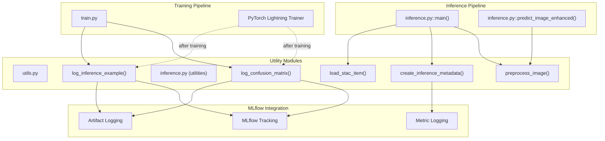
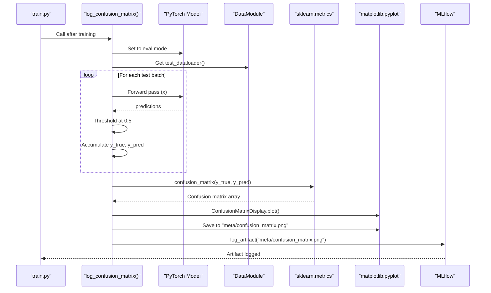
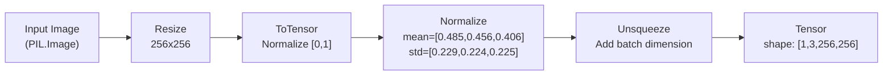
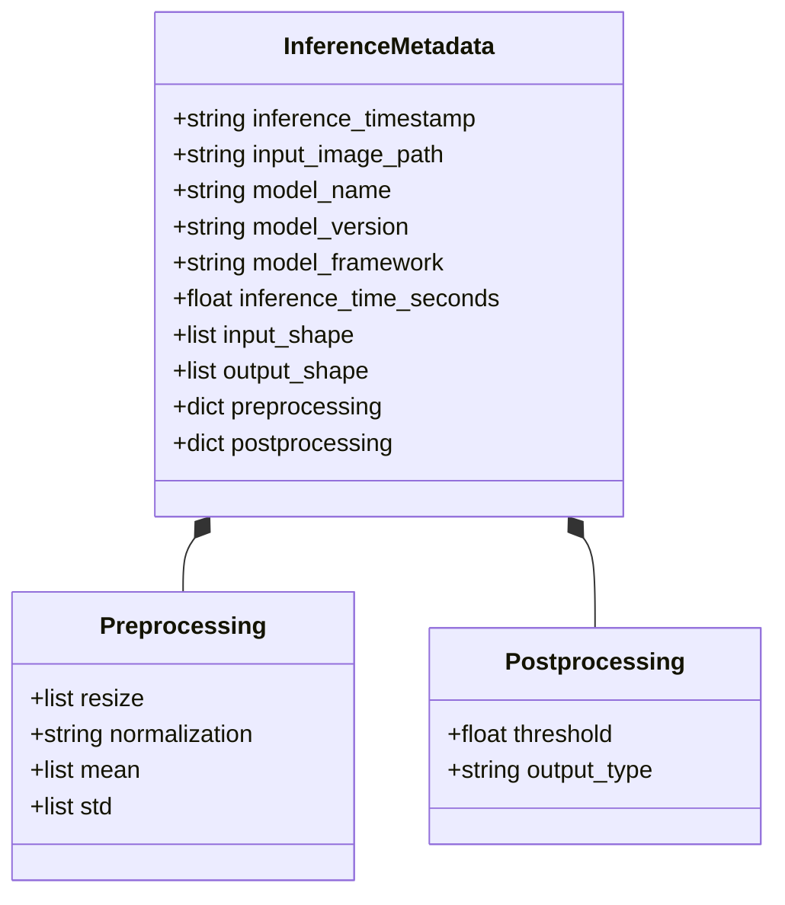
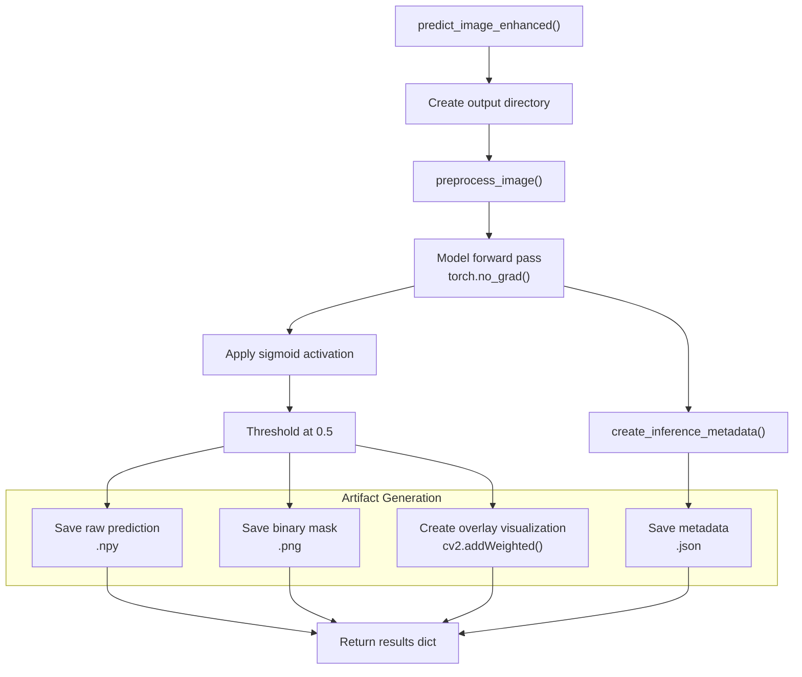
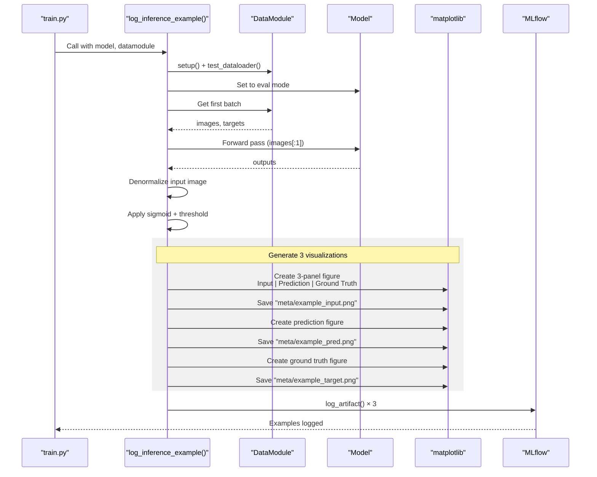

# Utilities and Helper Functions

<details>
<summary>Relevant source files</summary>

The following files were used as context for generating this wiki page:

- [examplemodel/src/inference.py](examplemodel/src/inference.py)
- [examplemodel/src/utils.py](examplemodel/src/utils.py)

</details>


This page documents the utility functions and helper modules that support the example model system's training, evaluation, and inference workflows. These utilities provide reusable functionality for model evaluation metrics, image preprocessing, prediction generation, metadata management, and MLflow integration.

For information about the main training pipeline that uses these utilities, see [Training Pipeline](#3.2). For details on the inference system architecture, see [Inference System](#3.3).

## Overview

The utility functions are distributed across two primary modules:

| Module | Purpose | Key Functions |
|--------|---------|---------------|
| `examplemodel/src/utils.py` | Model evaluation and metrics logging | `log_confusion_matrix()` |
| `examplemodel/src/inference.py` | Inference support and preprocessing | `preprocess_image()`, `create_inference_metadata()`, `load_stac_item()`, `log_inference_example()` |

These utilities are designed to be called from both the training pipeline ([train.py](https://github.com/kshitijrajsharma/opengeoaimodelshub)) and the inference pipeline ([inference.py](https://github.com/kshitijrajsharma/opengeoaimodelshub)), providing consistent functionality across the ML lifecycle.

## Utility Module Architecture



**Diagram: Utility Function Integration**

This diagram shows how utility functions integrate with the training and inference pipelines, and their connections to MLflow tracking.

Sources: [examplemodel/src/utils.py:1-32](), [examplemodel/src/inference.py:1-250]()

## Evaluation Utilities

### Confusion Matrix Logging

The `log_confusion_matrix()` function provides pixel-wise evaluation metrics for segmentation tasks. It computes a confusion matrix across all test samples and logs the visualization to MLflow.



**Diagram: Confusion Matrix Generation Flow**

Sources: [examplemodel/src/utils.py:8-31]()

#### Function Signature

```python
def log_confusion_matrix(model, datamodule, mlflow_run, device=None)
```

**Parameters:**

| Parameter | Type | Description |
|-----------|------|-------------|
| `model` | `torch.nn.Module` | The trained model to evaluate |
| `datamodule` | `LightningDataModule` | Data module providing `test_dataloader()` |
| `mlflow_run` | MLflow Run | Active MLflow run context (not actively used in function) |
| `device` | `torch.device` | Optional device; defaults to model's device |

**Implementation Details:**

The function performs the following steps:

1. **Device Detection**: Automatically detects the model's device if not specified ([utils.py:9-10]())
2. **Evaluation Mode**: Sets model to evaluation mode ([utils.py:11]())
3. **Prediction Collection**: Iterates through test dataloader, collecting predictions and ground truth ([utils.py:14-22]())
4. **Thresholding**: Applies 0.5 threshold to convert probabilities to binary predictions ([utils.py:19]())
5. **Confusion Matrix Computation**: Uses `sklearn.metrics.confusion_matrix()` for pixel-wise accuracy ([utils.py:23]())
6. **Visualization**: Creates confusion matrix display using `ConfusionMatrixDisplay` ([utils.py:24-27]())
7. **MLflow Logging**: Saves to `meta/confusion_matrix.png` and logs as artifact ([utils.py:27-29]())

**Usage Context:**

This function is typically called from [train.py](https://github.com/kshitijrajsharma/opengeoaimodelshub) after training completes, as part of the evaluation phase. It provides a visual representation of the model's classification performance at the pixel level.

Sources: [examplemodel/src/utils.py:8-31]()

## Inference Utilities

The inference utilities provide a comprehensive set of functions for image preprocessing, prediction generation, and metadata management during model inference.

### Image Preprocessing

#### `preprocess_image()`

Transforms input images into model-ready tensors using standard ImageNet normalization.

```python
def preprocess_image(image_path: str) -> torch.Tensor
```

**Preprocessing Pipeline:**



**Diagram: Image Preprocessing Transform Chain**

**Transform Specifications:**

| Step | Operation | Parameters | Purpose |
|------|-----------|------------|---------|
| 1 | `transforms.Resize()` | (256, 256) | Standardize input size |
| 2 | `transforms.ToTensor()` | - | Convert PIL to tensor, scale to [0,1] |
| 3 | `transforms.Normalize()` | ImageNet mean/std | Align with training distribution |
| 4 | `.unsqueeze(0)` | - | Add batch dimension for model input |

Sources: [examplemodel/src/inference.py:52-60]()

### Metadata Management

#### `load_stac_item()`

Loads STAC-MLM metadata from JSON files, providing model provenance information for inference.

```python
def load_stac_item(stac_path: str) -> Dict[str, Any]
```

This simple utility reads STAC metadata files generated during training ([stac_item.json](https://github.com/kshitijrajsharma/opengeoaimodelshub)) and returns them as Python dictionaries for downstream processing.

Sources: [examplemodel/src/inference.py:18-20]()

#### `create_inference_metadata()`

Generates comprehensive metadata for each inference run, capturing input/output specifications, timing information, and preprocessing details.

```python
def create_inference_metadata(
    image_path: str,
    model_info: Dict[str, Any],
    inference_time: float,
    input_shape: Tuple[int, ...],
    output_shape: Tuple[int, ...]
) -> Dict[str, Any]
```

**Metadata Schema:**



**Diagram: Inference Metadata Structure**

**Metadata Fields:**

| Category | Field | Type | Description |
|----------|-------|------|-------------|
| Temporal | `inference_timestamp` | ISO 8601 string | Inference execution time |
| Input | `input_image_path` | string | Source image path |
| Input | `input_shape` | list | Tensor shape [batch, channels, H, W] |
| Model | `model_name` | string | From STAC metadata or "unknown" |
| Model | `model_version` | string | Model version identifier |
| Model | `model_framework` | string | ML framework (e.g., "PyTorch") |
| Performance | `inference_time_seconds` | float | Inference duration |
| Output | `output_shape` | list | Output tensor shape |
| Preprocessing | `preprocessing` | dict | Transformation details |
| Postprocessing | `postprocessing` | dict | Threshold and output type |

The preprocessing dictionary captures the exact transformations applied ([inference.py:39-44]()), while postprocessing documents the threshold (0.5) and output type ("binary_mask") used to convert model outputs to final predictions.

Sources: [examplemodel/src/inference.py:23-49]()

### Prediction Functions

#### `predict_image_enhanced()`

The primary inference function that provides a complete prediction pipeline with visualization, metadata generation, and artifact management.



**Diagram: Enhanced Prediction Pipeline**

**Function Signature:**

```python
def predict_image_enhanced(
    model: torch.nn.Module,
    image_path: str,
    stac_metadata: Dict[str, Any] = None,
    output_dir: str = "output"
) -> Dict[str, Any]
```

**Output Artifacts:**

| Artifact | File Name | Format | Description |
|----------|-----------|--------|-------------|
| Raw Prediction | `prediction_raw.npy` | NumPy binary | Continuous probability values [0,1] |
| Binary Mask | `prediction_mask.png` | PNG image | Thresholded binary mask (0 or 255) |
| Overlay | `prediction_overlay.png` | PNG image | Original image with red overlay on predicted regions |
| Metadata | `inference_metadata.json` | JSON | Complete inference metadata |

**Overlay Generation:**

The overlay visualization is created using OpenCV ([inference.py:101-109]()):
1. Loads and resizes original image to 256x256
2. Creates red overlay ([0, 0, 255] in BGR) on predicted regions
3. Blends original (70%) with overlay (30%) using `cv2.addWeighted()`
4. Saves result to output directory

**Return Dictionary:**

```python
{
    "prediction": np.ndarray,           # Raw probability map
    "binary_mask": np.ndarray,          # Binary prediction
    "metadata": dict,                   # Inference metadata
    "output_files": dict,               # Paths to saved artifacts
    "refugee_camp_detected": bool       # Whether any pixels were classified positive
}
```

Sources: [examplemodel/src/inference.py:63-124]()

#### `predict_image()`

A simplified prediction function for basic inference without metadata or visualization.

```python
def predict_image(image_path: str, model_path: str = None) -> np.ndarray
```

This function provides a minimal interface that:
1. Loads model from path or defaults to `meta/best_model.pth`
2. Preprocesses input image
3. Performs inference
4. Returns thresholded binary mask

It is useful for quick predictions or integration into external systems where only the binary prediction is needed.

Sources: [examplemodel/src/inference.py:127-142]()

## MLflow Integration Utilities

### `log_inference_example()`

Generates and logs example predictions to MLflow during or after training, providing visual verification of model performance.



**Diagram: Inference Example Logging Flow**

**Function Signature:**

```python
def log_inference_example(model, data_module)
```

**Implementation Details:**

1. **Data Extraction**: Retrieves first batch from test dataloader ([inference.py:146-156]())
2. **Device Handling**: Automatically moves tensors to model's device ([inference.py:154-155]())
3. **Image Denormalization**: Reverses ImageNet normalization for visualization ([inference.py:158-160]())
4. **Binary Conversion**: Thresholds predictions and targets at 0.5 ([inference.py:166-167]())
5. **Visualization Generation**: Creates three separate visualizations:
   - Combined 3-panel figure ([inference.py:169-186]())
   - Individual prediction ([inference.py:188-193]())
   - Individual ground truth ([inference.py:195-200]())
6. **MLflow Logging**: Logs all artifacts to `examples/` path ([inference.py:203-206]())

**Visualization Specifications:**

| Figure | File Name | Panels | DPI | Purpose |
|--------|-----------|--------|-----|---------|
| Combined | `example_input.png` | 3 (15×5) | 300 | Side-by-side comparison |
| Prediction | `example_pred.png` | 1 (5×5) | 300 | Isolated model output |
| Ground Truth | `example_target.png` | 1 (5×5) | 300 | Isolated reference |

All visualizations use grayscale colormap with `vmin=0, vmax=1` for consistent binary representation ([inference.py:176-182]()).

Sources: [examplemodel/src/inference.py:145-208]()

## Usage Patterns

### Training Pipeline Integration

The utilities are called from [train.py](https://github.com/kshitijrajsharma/opengeoaimodelshub) after model training completes:

```python
# After training
from utils import log_confusion_matrix
from inference import log_inference_example

log_confusion_matrix(model, data_module, run)
log_inference_example(model, data_module)
```

This provides comprehensive evaluation metrics and visual examples in the MLflow tracking UI.

### Inference Pipeline Integration

The main inference script ([inference.py:211-250]()) demonstrates command-line usage:

```bash
# Basic inference
python inference.py /path/to/image.jpg

# With STAC metadata
python inference.py /path/to/image.jpg --stac_path meta/stac_item.json

# With MLflow tracking
python inference.py /path/to/image.jpg --mlflow_tracking --output_dir results/
```

The `main()` function orchestrates the utilities ([inference.py:211-247]()):
1. Parses command-line arguments
2. Loads STAC metadata if provided
3. Loads model (JIT or PyTorch checkpoint)
4. Calls `predict_image_enhanced()`
5. Optionally logs results to MLflow
6. Prints detection status

### Direct Function Calls

Utilities can also be imported and called directly from Python scripts:

```python
from examplemodel.src.inference import preprocess_image, predict_image_enhanced
from examplemodel.src.utils import log_confusion_matrix

# Preprocess only
tensor = preprocess_image("input.jpg")

# Full inference with artifacts
results = predict_image_enhanced(model, "input.jpg", output_dir="results/")
print(f"Camp detected: {results['refugee_camp_detected']}")
```

Sources: [examplemodel/src/inference.py:211-250](), [examplemodel/src/utils.py:1-32]()

## Error Handling and Device Management

### Automatic Device Detection

Both `log_confusion_matrix()` and `log_inference_example()` implement automatic device detection:

```python
device = next(model.parameters()).device
```

This ensures utilities work correctly regardless of whether the model is on CPU or GPU, eliminating the need for explicit device management by callers.

### File System Operations

The utilities create necessary directories and handle file I/O:

- `predict_image_enhanced()` creates output directory if it doesn't exist ([inference.py:70-71]())
- All artifact generation uses `Path` objects for cross-platform compatibility
- MLflow artifact logging handles path resolution automatically

Sources: [examplemodel/src/utils.py:9-10](), [examplemodel/src/inference.py:150](), [examplemodel/src/inference.py:70-71]()

## Summary

The utility functions provide essential support infrastructure for the example model system:

- **Evaluation**: `log_confusion_matrix()` computes pixel-wise accuracy metrics
- **Preprocessing**: `preprocess_image()` standardizes input images
- **Metadata**: `create_inference_metadata()` and `load_stac_item()` manage provenance
- **Prediction**: `predict_image_enhanced()` and `predict_image()` generate predictions
- **Visualization**: `log_inference_example()` creates visual examples for MLflow

These utilities are designed for modularity and reusability, with consistent interfaces and automatic device management. They integrate seamlessly with MLflow for experiment tracking and support both training and inference workflows.

Sources: [examplemodel/src/utils.py:1-32](), [examplemodel/src/inference.py:1-250]()